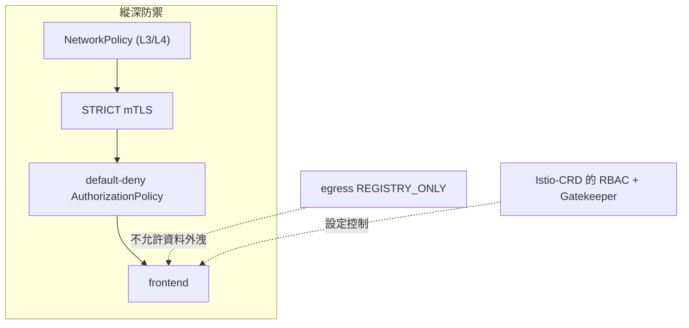

[Русская версия](README_RU.MD) · [Eng version](README.MD) · [Versión en español](README_ES.MD) · [Version française](README_FR.MD) · [Deutsche Version](README_DE.MD) · [ქართული ვერსია](README_GE.MD) · [日本語版](README_JP.MD)

# Lab 34 - Mesh 強化與威脅模型

> [參考解答](worker/files/solutions/1_TW.MD)

## 概述

Mesh 不僅提供保護，**本身也會成為攻擊面的一部分**。本 Lab 將課程中的安全實務整合為
依循 **縱深防禦** 原則的統一強化措施：加密與身分識別、最小權限授權、egress 控制、
限制 Istio-CRD 權限、強制 admission 規則，以及獨立的網路防線。

已部署：
- namespace `app`（位於 mesh 中）：`frontend`（ping_pong HTTP）+ 兩個 curl 用戶端 `good`（SA
  `good`）與 `bad`（SA `bad`）+ SA `mesh-editor`；
- namespace `legacy`（未注入）：`legacy` - 沒有 sidecar 的 curl。

Istio 使用 default profile（mTLS PERMISSIVE、egress ALLOW_ANY、未設定授權），並已安裝 OPA
Gatekeeper。worker PC 上有 `istioctl`。



## 基礎架構

| 元件 | 類型 | 數量 | 角色 |
|---|---|---|---|
| control-plane | `t3.large` | 1 | master + istiod + OPA Gatekeeper |
| worker | `t3.large` | 1 | app/legacy workload 容量 |
| worker PC | `t3.small` | 1 | 工作站：`kubectl`、`istioctl`、`check_result` |

區域：`eu-central-1`（AZ `eu-central-1a` / `eu-central-1b`）。

## 部署

```bash
TASK=34 make run_ica_task
```

## 任務

1. 為整個 mesh 啟用 **STRICT mTLS**。
2. 在 `app` 中建立 **default-deny** 授權，並僅明確允許 `good`。
3. 啟用 **egress 控制**（`REGISTRY_ONLY`）。
4. 限制 Istio-CRD 權限：`mesh-editor` 可以管理 Istio 設定，但**不能**管理
   `EnvoyFilter`。
5. **OPA Gatekeeper**：禁止具有 `mode: DISABLE` 的 `PeerAuthentication`。
6. 使用 **NetworkPolicy** 作為獨立防線（可抵抗繞過 sidecar）。

## 步驟 1. STRICT mTLS

```bash
kubectl apply -f - <<'EOF'
apiVersion: security.istio.io/v1
kind: PeerAuthentication
metadata:
  name: default
  namespace: istio-system      # root namespace -> 對整個 mesh
spec:
  mtls:
    mode: STRICT
EOF

# legacy 沒有 sidecar (plaintext) 再也無法連到 frontend：
kubectl exec -n legacy deploy/legacy -c curl -- \
  curl -s -o /dev/null -w '%{http_code}\n' --max-time 8 http://frontend.app.svc.cluster.local:8080/
```

## 步驟 2. Default-deny + 明確允許

```bash
kubectl apply -f - <<'EOF'
apiVersion: security.istio.io/v1
kind: AuthorizationPolicy
metadata:
  name: deny-all
  namespace: app
spec: {}
EOF

kubectl apply -f - <<'EOF'
apiVersion: security.istio.io/v1
kind: AuthorizationPolicy
metadata:
  name: allow-good
  namespace: app
spec:
  selector:
    matchLabels:
      app: frontend
  action: ALLOW
  rules:
    - from:
        - source:
            principals: ["cluster.local/ns/app/sa/good"]
EOF

kubectl exec -n app deploy/good -c curl -- curl -s -o /dev/null -w '%{http_code}\n' http://frontend.app.svc.cluster.local:8080/   # 200
kubectl exec -n app deploy/bad  -c curl -- curl -s -o /dev/null -w '%{http_code}\n' http://frontend.app.svc.cluster.local:8080/   # 403
```

## 步驟 3. Egress 控制：REGISTRY_ONLY

```bash
cat <<EOF > /tmp/iop.yaml
apiVersion: install.istio.io/v1alpha1
kind: IstioOperator
spec:
  profile: default
  meshConfig:
    outboundTrafficPolicy:
      mode: REGISTRY_ONLY
EOF
istioctl install -f /tmp/iop.yaml -y

kubectl exec -n app deploy/good -c curl -- \
  curl -s -o /dev/null -w '%{http_code}\n' --max-time 8 http://www.example.com/   # 502 (已封鎖)
```

## 步驟 4. Istio-CRD 的 RBAC（禁止 EnvoyFilter）

`EnvoyFilter` 是最危險的 CRD（會向 Envoy 插入原始設定）。我們將允許 `mesh-editor`
管理 Istio 設定，但**不**授與 `envoyfilters`：

```bash
kubectl apply -f - <<'EOF'
apiVersion: rbac.authorization.k8s.io/v1
kind: Role
metadata:
  name: mesh-editor
  namespace: app
rules:
  - apiGroups: ["networking.istio.io"]
    resources: ["virtualservices","destinationrules","gateways","serviceentries","sidecars","workloadentries"]
    verbs: ["get","list","watch","create","update","patch","delete"]
  - apiGroups: ["security.istio.io"]
    resources: ["authorizationpolicies","requestauthentications"]
    verbs: ["get","list","watch","create","update","patch","delete"]
  # 不發放 envoyfilters
---
apiVersion: rbac.authorization.k8s.io/v1
kind: RoleBinding
metadata:
  name: mesh-editor
  namespace: app
roleRef:
  kind: Role
  name: mesh-editor
  apiGroup: rbac.authorization.k8s.io
subjects:
  - kind: ServiceAccount
    name: mesh-editor
    namespace: app
EOF

kubectl auth can-i create virtualservices.networking.istio.io --as=system:serviceaccount:app:mesh-editor -n app   # yes
kubectl auth can-i create envoyfilters.networking.istio.io     --as=system:serviceaccount:app:mesh-editor -n app   # no
```

## 步驟 5. OPA Gatekeeper：禁止停用 mTLS

```bash
kubectl apply -f - <<'EOF'
apiVersion: templates.gatekeeper.sh/v1
kind: ConstraintTemplate
metadata:
  name: k8sdenymtlsdisable
spec:
  crd:
    spec:
      names:
        kind: K8sDenyMtlsDisable
  targets:
    - target: admission.k8s.gatekeeper.sh
      rego: |
        package k8sdenymtlsdisable
        violation[{"msg": msg}] {
          input.review.object.spec.mtls.mode == "DISABLE"
          msg := "PeerAuthentication with mode: DISABLE is not allowed"
        }
EOF

kubectl apply -f - <<'EOF'
apiVersion: constraints.gatekeeper.sh/v1beta1
kind: K8sDenyMtlsDisable
metadata:
  name: no-mtls-disable
spec:
  match:
    kinds:
      - apiGroups: ["security.istio.io"]
        kinds: ["PeerAuthentication"]
EOF

# 應為 DENIED：
kubectl apply -f - <<'EOF'
apiVersion: security.istio.io/v1
kind: PeerAuthentication
metadata:
  name: try-disable
  namespace: app
spec:
  mtls:
    mode: DISABLE
EOF
```

## 步驟 6. NetworkPolicy（可抵抗繞過 sidecar）

mTLS 與授權在 sidecar 中運作；若流量繞過它，這些措施便不會套用。
NetworkPolicy 在核心中運作（CNI Calico）- 是獨立防線：

```bash
kubectl apply -f - <<'EOF'
apiVersion: networking.k8s.io/v1
kind: NetworkPolicy
metadata:
  name: frontend-allow-app
  namespace: app
spec:
  podSelector:
    matchLabels:
      app: frontend
  policyTypes:
    - Ingress
  ingress:
    # 應用程式連接埠 8080 - 僅限來自 namespace app 的 Pod
    - from:
        - namespaceSelector:
            matchLabels:
              kubernetes.io/metadata.name: app
      ports:
        - port: 8080
          protocol: TCP
    # health (15021) / 指標 (15090) sidecar - 來自任何來源 (kubelet, prometheus)
    - ports:
        - port: 15021
          protocol: TCP
        - port: 15090
          protocol: TCP
EOF
```

我們保留連接埠 `15021` 開放；否則來自 kubelet 的 sidecar readiness probe 將開始失敗，且
pod 會變為 NotReady。

## 運作方式（威脅模型）

- **STRICT mTLS** - 僅接受經雙向驗證的 mesh 流量；plaintext 與沒有 sidecar 的用戶端會遭拒絕。
- **Default-deny 授權** - 最小權限：沒有明確的 ALLOW 時，一律不允許任何存取；這可限制遭入侵
  pod 的影響範圍。
- **REGISTRY_ONLY egress** - 遭入侵的 pod 無法將資料外洩到任意外部位址。
- **CRD 的 RBAC** - 限制 `EnvoyFilter`（以及 Istio 設定）可防止透過過多權限改寫 data
  plane。
- **OPA Gatekeeper** - 「永遠不要停用 mTLS」成為嚴格的 admission 規則。
- **NetworkPolicy** - 核心中的獨立防線，即使繞過 sidecar 仍可運作 - 這就是縱深防禦。

## 驗證結果

請在 worker PC 上執行：

```bash
check_result
```

## 總結

您已依循縱深防禦原則完成 Istio 強化：STRICT mTLS、default-deny 授權、egress 控制、限制
Istio-CRD 權限、透過 OPA Gatekeeper 的強制政策，以及在繞過 sidecar 時提供保護的獨立網路防線
（NetworkPolicy）。