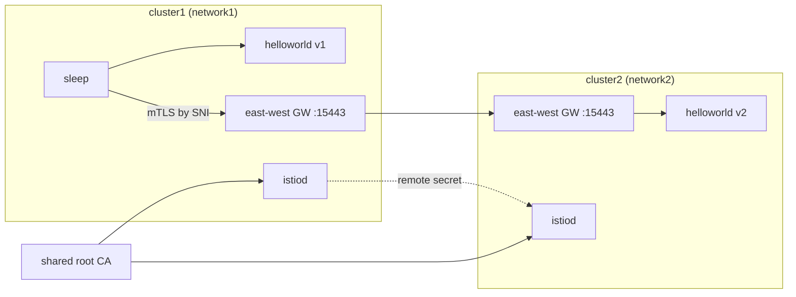

[RU version](README_RU.MD)

# Lab 35 - Multicluster mesh (multi-primary, multi-network)

## Overview

A single cluster is a single point of failure and a scaling ceiling. Istio can join several
clusters into **one mesh**: services in different clusters see each other and talk over mTLS
as if they were local. This needs three things: **shared trust** (a common root CA),
**service discovery** across clusters (remote secret), and **network connectivity**
(east-west gateway).

This lab provisions **two bare clusters** (nothing is installed on them). The worker PC has
kubeconfig contexts for both. You build the whole mesh by hand: generate a shared CA,
install istioctl/Istio on both clusters (**multi-primary**), bring up east-west gateways
(**multi-network**), link the clusters with remote secrets, and verify cross-cluster load
balancing.



## Task

Join the two clusters into one mesh and prove cross-cluster balancing:

1. **Shared CA**: generate a root + intermediate CA and install the same `cacerts` secret in
   `istio-system` on both clusters.
2. **Multi-primary Istio**: install istioctl and Istio on both clusters (one istiod each,
   shared `meshID`, distinct `clusterName`/`network`).
3. **East-west gateway**: on each cluster bring up an EW gateway reachable at the node IP on
   `15443`, and expose `*.local` services (`AUTO_PASSTHROUGH`).
4. **Cross-cluster discovery**: create remote secrets in both directions
   (`istioctl create-remote-secret`).
5. **Verify**: deploy `helloworld` (v1 in cluster1, v2 in cluster2) and `sleep`; confirm a
   client in cluster1 gets responses from both v1 and v2.

> The full command set is in the [reference solution](worker/files/solutions/1.MD). Key
> steps below.

## Key steps

```bash
# contexts and node IPs
CTX1=$(kubectl config get-contexts -o name | grep -m1 cluster1)
CTX2=$(kubectl config get-contexts -o name | grep -m1 cluster2)
C1_IP=$(kubectl --context "$CTX1" get nodes -o jsonpath='{.items[0].status.addresses[?(@.type=="InternalIP")].address}')
C2_IP=$(kubectl --context "$CTX2" get nodes -o jsonpath='{.items[0].status.addresses[?(@.type=="InternalIP")].address}')

# istioctl on the worker PC
export ISTIO_VERSION=1.29.1
curl -L https://istio.io/downloadIstio | ISTIO_VERSION=$ISTIO_VERSION sh -
sudo install istio-$ISTIO_VERSION/bin/istioctl /usr/local/bin/
```

1. **Shared CA** - generate (openssl) `root-cert.pem`/`ca-cert.pem`/`ca-key.pem`/
   `cert-chain.pem` and create the **same** `cacerts` secret in `istio-system` on both
   clusters.
2. **Istio** - `istioctl install` on each cluster: `meshID: mesh1`, `clusterName`
   `cluster1`/`cluster2`, `network` `network1`/`network2`, plus `meshNetworks` with the EW
   gateway addresses (`$C1_IP:15443`, `$C2_IP:15443`). Label `istio-system` with
   `topology.istio.io/network`.
3. **East-west gateway** - install the EW gateway (NodePort), patch its Service
   `externalIPs=[<node IP>]`, apply a `Gateway` with `tls.mode: AUTO_PASSTHROUGH` for
   `*.local`. Note: the EW gateway operator must carry the same
   `meshID`/`multiCluster.clusterName`/`network` as istiod, otherwise its proxy reports
   cluster `Kubernetes` and istiod rejects its token.
4. **Remote secrets**:

   ```bash
   istioctl create-remote-secret --context "$CTX1" --name cluster1 --server "https://$C1_IP:6443" | kubectl apply --context "$CTX2" -f -
   istioctl create-remote-secret --context "$CTX2" --name cluster2 --server "https://$C2_IP:6443" | kubectl apply --context "$CTX1" -f -
   ```

5. **Sample** - `helloworld` (Service on both, v1 in cluster1, v2 in cluster2) + `sleep`, then:

   ```bash
   kubectl --context "$CTX1" -n sample exec deploy/sleep -c sleep -- \
     sh -c 'for i in $(seq 10); do curl -s helloworld:5000/hello; done'
   # responses from both v1 (local) and v2 (remote cluster)
   ```

## How it works

- **Shared CA** - both clusters install the same `cacerts` (common root), so mTLS certs from
  both istiods chain to one root. Without a shared root there is no cross-cluster trust.
- **Multi-primary** - one istiod per cluster, no single control-plane point of failure.
- **Multi-network + EW gateway** - the clusters are separate networks (overlay CNI,
  overlapping pod CIDRs), so cross-cluster traffic rides through the east-west gateway by SNI
  (`AUTO_PASSTHROUGH`) preserving end-to-end mTLS; `meshNetworks` tells each istiod the
  peer's gateway address.
- **Remote secret** - gives istiod API access to the other cluster, so it discovers its
  services and merges endpoints of same-named services.
- **Cross-cluster LB** - once endpoints from both clusters back the same `helloworld`
  Service, Envoy balances across them (locality-aware + failover).

## Check the result

Run on the worker PC:

```bash
check_result
```

## Summary

You joined two clusters into one mesh: shared CA, multi-primary istiod, an east-west gateway
for multi-network, cross-cluster discovery via remote secrets - and confirmed cross-cluster
load balancing. This is the foundation of a fault-tolerant, geo-distributed mesh.

## Infrastructure

| Component | Type | Count | Role |
|---|---|---|---|
| cluster1 (control-plane) | `t3.xlarge` | 1 | k8s + istiod + EW gateway + helloworld v1 + sleep |
| cluster2 (control-plane) | `t3.xlarge` | 1 | k8s + istiod + EW gateway + helloworld v2 |
| worker PC | `t3.small` | 1 | `kubectl` (both contexts), `istioctl`, `openssl`, `check_result` |

Both clusters share one VPC (`10.10.0.0/16`); node-to-node traffic is open inside the VPC.
Region: `eu-central-1` (AZ `eu-central-1a` / `eu-central-1b`).
