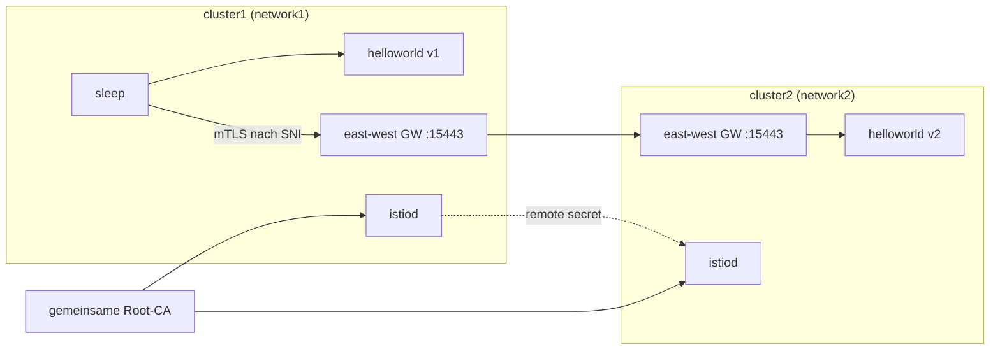

[RU version](README_RU.MD) · [Eng version](README.MD) · [Versión en español](README_ES.MD) · [Version française](README_FR.MD)

# Lab 35 - Multi-Cluster-Mesh (multi-primary, multi-network)

## Überblick

Ein einzelner Cluster ist ein Single Point of Failure und eine Skalierungsgrenze. Istio kann
mehrere Cluster zu einem **einheitlichen Mesh** verbinden: Services verschiedener Cluster sehen
einander und kommunizieren per mTLS, als wären sie benachbart. Dafür braucht es drei Dinge:
**gemeinsames Trust** (gemeinsame Root-CA), **Service Discovery** zwischen den Clustern (Remote
Secret) und **Netzwerkkonnektivität** (East-West Gateway).

In diesem Lab sind **zwei „nackte" Cluster** bereitgestellt (auf denen nichts installiert ist).
Der Arbeitsplatz (worker PC) hat kubeconfig-Kontexte beider Cluster. Den gesamten Mesh-Aufbau
machen Sie von Hand: Sie generieren die gemeinsame CA, installieren istioctl/Istio auf beiden
Clustern (Modell **multi-primary**), stellen ein East-West Gateway auf (Modell **multi-network**),
verbinden die Cluster mit Remote Secrets und prüfen das Cross-Cluster-Load-Balancing.



## Aufgabe

Aus zwei Clustern ein einheitliches Mesh bauen und das Cross-Cluster-Load-Balancing nachweisen:

1. **Gemeinsame CA**: eine Root- + Intermediate-CA generieren und dasselbe Secret `cacerts` in
   `istio-system` beider Cluster installieren.
2. **Istio multi-primary**: istioctl und Istio auf beiden Clustern installieren (eigenes istiod in
   jedem, gemeinsame `meshID`, unterschiedliche `clusterName`/`network`).
3. **East-West Gateway**: auf jedem Cluster ein EW-Gateway aufstellen, das über die Node-IP auf
   `15443` erreichbar ist, und die Services `*.local` öffnen (`AUTO_PASSTHROUGH`).
4. **Cross-Cluster Discovery**: Remote Secrets in beide Richtungen erstellen
   (`istioctl create-remote-secret`).
5. **Prüfung**: `helloworld` bereitstellen (v1 in cluster1, v2 in cluster2) und `sleep`,
   sicherstellen, dass ein Client aus cluster1 Antworten sowohl von v1 als auch von v2 erhält.

> Der vollständige Befehlssatz ist in der [reference solution](worker/files/solutions/1.MD). Unten
> die Leitschritte.

## Leitschritte

```bash
# Kontexte und Node-IPs
CTX1=$(kubectl config get-contexts -o name | grep -m1 cluster1)
CTX2=$(kubectl config get-contexts -o name | grep -m1 cluster2)
C1_IP=$(kubectl --context "$CTX1" get nodes -o jsonpath='{.items[0].status.addresses[?(@.type=="InternalIP")].address}')
C2_IP=$(kubectl --context "$CTX2" get nodes -o jsonpath='{.items[0].status.addresses[?(@.type=="InternalIP")].address}')

# istioctl auf dem worker PC
export ISTIO_VERSION=1.29.1
curl -L https://istio.io/downloadIstio | ISTIO_VERSION=$ISTIO_VERSION sh -
sudo install istio-$ISTIO_VERSION/bin/istioctl /usr/local/bin/
```

1. **Gemeinsame CA** - `root-cert.pem`/`ca-cert.pem`/`ca-key.pem`/`cert-chain.pem` generieren
   (openssl) und **dasselbe** Secret `cacerts` in `istio-system` beider Cluster erstellen.
2. **Istio** - `istioctl install` auf jedem Cluster: `meshID: mesh1`, `clusterName`
   `cluster1`/`cluster2`, `network` `network1`/`network2`, sowie `meshNetworks` mit den Adressen
   der EW-Gateways (`$C1_IP:15443`, `$C2_IP:15443`). `istio-system` mit dem Label
   `topology.istio.io/network` versehen.
3. **East-West Gateway** - das EW-Gateway installieren (NodePort), seinen Service mit
   `externalIPs=[<Node-IP>]` patchen, ein `Gateway` mit `tls.mode: AUTO_PASSTHROUGH` für `*.local`
   anwenden. Wichtig: der Operator des EW-Gateways muss dieselben `meshID`/`multiCluster.clusterName`/`network`
   haben wie istiod, sonst stellt sich der Proxy als Cluster `Kubernetes` vor und istiod lehnt sein
   Token ab.
4. **Remote Secrets**:

   ```bash
   istioctl create-remote-secret --context "$CTX1" --name cluster1 --server "https://$C1_IP:6443" | kubectl apply --context "$CTX2" -f -
   istioctl create-remote-secret --context "$CTX2" --name cluster2 --server "https://$C2_IP:6443" | kubectl apply --context "$CTX1" -f -
   ```

5. **Sample** - `helloworld` (Service in beiden, v1 in cluster1, v2 in cluster2) + `sleep`, dann:

   ```bash
   kubectl --context "$CTX1" -n sample exec deploy/sleep -c sleep -- \
     sh -c 'for i in $(seq 10); do curl -s helloworld:5000/hello; done'
   # Antworten sowohl von v1 (lokal) als auch von v2 (entfernter Cluster)
   ```

## Wie es funktioniert

- **Gemeinsame CA** - beide Cluster installieren dasselbe `cacerts`, daher vertrauen die
  mTLS-Zertifikate beider istiod der gemeinsamen Root. Ohne gemeinsame Root gibt es kein
  Cross-Cluster-Trust.
- **Multi-primary** - eigenes istiod in jedem Cluster, kein einzelner Steuerungspunkt.
- **Multi-network + EW Gateway** - die Cluster haben unterschiedliche Netze (Overlay-CNI, sich
  überschneidende Pod-CIDRs), daher läuft der Cross-Cluster-Verkehr über das East-West Gateway nach
  SNI (`AUTO_PASSTHROUGH`) unter Erhalt des durchgehenden mTLS; `meshNetworks` teilt jedem istiod
  die Gateway-Adresse des Nachbarn mit.
- **Remote Secret** - gibt istiod Zugriff auf die API des Nachbar-Clusters, dieses entdeckt dessen
  Services und vereint die Endpoints gleichnamiger Services.
- **Cross-Cluster-LB** - wenn hinter einem `helloworld` Endpoints aus beiden Clustern stehen,
  balanciert Envoy zwischen ihnen (locality-aware + failover).

## Ergebnisprüfung

Führen Sie auf dem worker PC aus:

```bash
check_result
```

## Fazit

Sie haben zwei Cluster zu einem einheitlichen Mesh verbunden: gemeinsame CA, multi-primary istiod,
East-West Gateway für multi-network, Cross-Cluster Discovery über Remote Secrets - und das
Cross-Cluster-Load-Balancing bestätigt. Das ist das Fundament eines ausfallsicheren und
geo-verteilten Mesh.

## Infrastruktur

| Komponente | Typ | Anzahl | Rolle |
|---|---|---|---|
| cluster1 (control-plane) | `t3.xlarge` | 1 | k8s + istiod + EW gateway + helloworld v1 + sleep |
| cluster2 (control-plane) | `t3.xlarge` | 1 | k8s + istiod + EW gateway + helloworld v2 |
| worker PC | `t3.small` | 1 | `kubectl` (beide Kontexte), `istioctl`, `openssl`, `check_result` |

Beide Cluster in einer VPC (`10.10.0.0/16`), der Verkehr zwischen den Nodes ist innerhalb der VPC
offen. Region: `eu-central-1` (AZ `eu-central-1a` / `eu-central-1b`).
