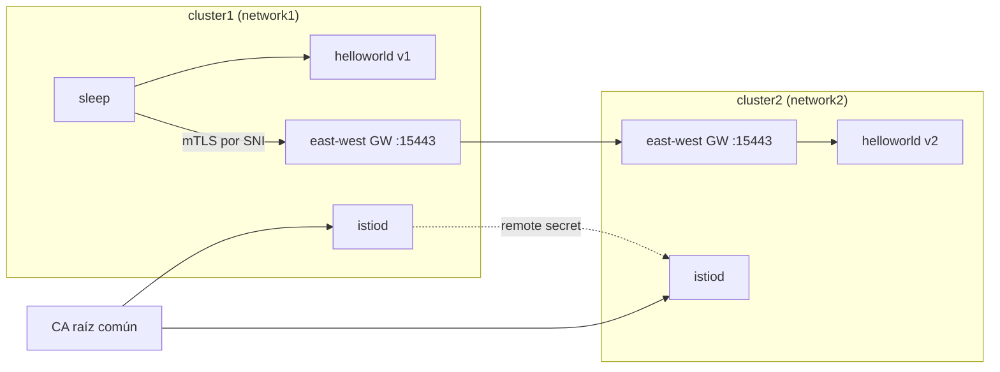

[RU version](README_RU.MD) · [Eng version](README.MD) · [Version française](README_FR.MD) · [Deutsche Version](README_DE.MD)

# Lab 35 - Mesh multiclúster (multi-primary, multi-network)

## Resumen

Un solo clúster es un único punto de fallo y el límite de escala. Istio sabe unir varios
clústeres en un **mesh único**: los servicios de distintos clústeres se ven entre sí y se comunican por mTLS,
como si estuvieran al lado. Para ello hacen falta tres cosas: **trust común** (CA raíz común), **descubrimiento
de servicios** entre clústeres (remote secret) y **conectividad de red** (east-west gateway).

En este lab están desplegados **dos clústeres «desnudos»** (en ellos no hay nada instalado). El puesto de trabajo
(worker PC) tiene contextos de kubeconfig de ambos clústeres. Todo el montaje del mesh lo haces a
mano: generas un CA común, instalas istioctl/Istio en ambos clústeres (modelo
**multi-primary**), levantas el east-west gateway (modelo **multi-network**), enlazas los
clústeres con remote-secrets y verificas el balanceo entre clústeres.



## Infraestructura

| Componente | Tipo | Cant. | Rol |
|---|---|---|---|
| cluster1 (control-plane) | `t3.xlarge` | 1 | k8s + istiod + EW gateway + helloworld v1 + sleep |
| cluster2 (control-plane) | `t3.xlarge` | 1 | k8s + istiod + EW gateway + helloworld v2 |
| worker PC | `t3.small` | 1 | `kubectl` (ambos contextos), `istioctl`, `openssl`, `check_result` |

Ambos clústeres en un mismo VPC (`10.10.0.0/16`), el tráfico entre nodos está abierto dentro del VPC.
Región: `eu-central-1` (AZ `eu-central-1a` / `eu-central-1b`).

## Despliegue

```bash
TASK=35 make run_ica_task
```

## Tarea

Montar un mesh único a partir de dos clústeres y demostrar el balanceo entre clústeres:

1. **CA común**: generar un CA raíz + intermedio e instalar el mismo secreto
   `cacerts` en `istio-system` de ambos clústeres.
2. **Istio multi-primary**: instalar istioctl e Istio en ambos clústeres (su propio istiod en
   cada uno, `meshID` común, `clusterName`/`network` distintos).
3. **East-west gateway**: levantar en cada clúster un gateway EW, accesible por la IP del nodo en
   `15443`, y exponer los servicios `*.local` (`AUTO_PASSTHROUGH`).
4. **Cross-cluster discovery**: crear remote-secrets en ambas direcciones
   (`istioctl create-remote-secret`).
5. **Verificación**: desplegar `helloworld` (v1 en cluster1, v2 en cluster2) y `sleep`, confirmar
   que el cliente de cluster1 recibe respuestas tanto de v1 como de v2.

> El conjunto completo de comandos - en [reference solution](worker/files/solutions/1.MD). A continuación - los
> pasos de referencia.

## Pasos de referencia

```bash
# contextos e IP de los nodos
CTX1=$(kubectl config get-contexts -o name | grep -m1 cluster1)
CTX2=$(kubectl config get-contexts -o name | grep -m1 cluster2)
C1_IP=$(kubectl --context "$CTX1" get nodes -o jsonpath='{.items[0].status.addresses[?(@.type=="InternalIP")].address}')
C2_IP=$(kubectl --context "$CTX2" get nodes -o jsonpath='{.items[0].status.addresses[?(@.type=="InternalIP")].address}')

# istioctl en el worker PC
export ISTIO_VERSION=1.29.1
curl -L https://istio.io/downloadIstio | ISTIO_VERSION=$ISTIO_VERSION sh -
sudo install istio-$ISTIO_VERSION/bin/istioctl /usr/local/bin/
```

1. **CA común** - generar (openssl) `root-cert.pem`/`ca-cert.pem`/`ca-key.pem`/
   `cert-chain.pem` y crear el **mismo** secreto `cacerts` en `istio-system` de ambos
   clústeres.
2. **Istio** - `istioctl install` en cada clúster: `meshID: mesh1`, `clusterName`
   `cluster1`/`cluster2`, `network` `network1`/`network2`, así como `meshNetworks` con las direcciones
   de los gateways EW (`$C1_IP:15443`, `$C2_IP:15443`). Marcar `istio-system` con la etiqueta
   `topology.istio.io/network`.
3. **East-west gateway** - instalar el gateway EW (NodePort), parchear su Service
   `externalIPs=[<IP del nodo>]`, aplicar un `Gateway` con `tls.mode: AUTO_PASSTHROUGH` para `*.local`.
   Importante: el operator del gateway EW debe tener los mismos `meshID`/`multiCluster.clusterName`/`network`
   que istiod, de lo contrario el proxy se presentará como clúster `Kubernetes` e istiod rechazará su token.
4. **Remote secrets**:

   ```bash
   istioctl create-remote-secret --context "$CTX1" --name cluster1 --server "https://$C1_IP:6443" | kubectl apply --context "$CTX2" -f -
   istioctl create-remote-secret --context "$CTX2" --name cluster2 --server "https://$C2_IP:6443" | kubectl apply --context "$CTX1" -f -
   ```

5. **Sample** - `helloworld` (Service en ambos, v1 en cluster1, v2 en cluster2) + `sleep`, luego:

   ```bash
   kubectl --context "$CTX1" -n sample exec deploy/sleep -c sleep -- \
     sh -c 'for i in $(seq 10); do curl -s helloworld:5000/hello; done'
   # respuestas tanto de v1 (local) como de v2 (clúster remoto)
   ```

## Cómo funciona

- **CA común** - ambos clústeres instalan el mismo `cacerts`, por eso los certificados mTLS
  de ambos istiod confían en la raíz común. Sin una raíz común no hay confianza entre clústeres.
- **Multi-primary** - su propio istiod en cada clúster, no hay un único punto de gestión.
- **Multi-network + EW gateway** - los clústeres tienen redes distintas (overlay CNI, pod CIDR
  solapados), por eso el tráfico cross-cluster va a través del east-west gateway por SNI
  (`AUTO_PASSTHROUGH`) conservando el mTLS de extremo a extremo; `meshNetworks` comunica a cada istiod
  la dirección del gateway del vecino.
- **Remote secret** - da a istiod acceso a la API del clúster vecino, este descubre sus
  servicios y une los endpoints de los servicios homónimos.
- **Cross-cluster LB** - cuando detrás de un mismo `helloworld` hay endpoints de ambos clústeres,
  Envoy balancea entre ellos (locality-aware + failover).

## Comprobación del resultado

Ejecuta en el worker PC:

```bash
check_result
```

## Conclusión

Has unido dos clústeres en un mesh único: CA común, istiod multi-primary, east-west
gateway para multi-network, cross-cluster discovery mediante remote-secrets - y confirmado el
balanceo entre clústeres. Este es el fundamento de un mesh tolerante a fallos y geo-distribuido.
