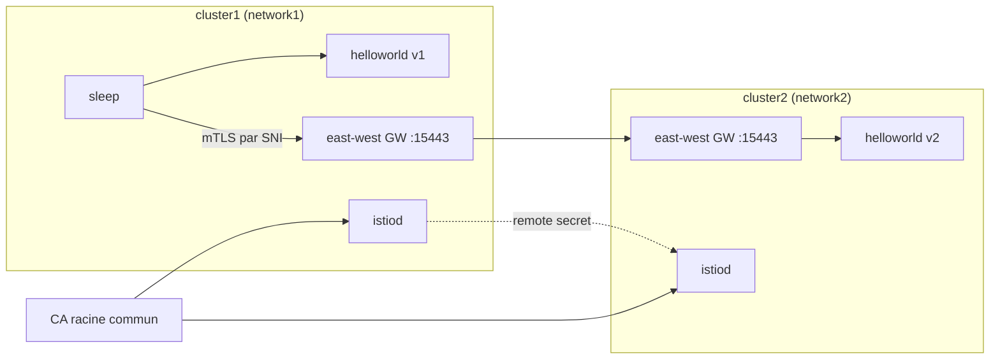

[RU version](README_RU.MD) · [Eng version](README.MD) · [Versión en español](README_ES.MD) · [Deutsche Version](README_DE.MD)

# Lab 35 - Mesh multi-cluster (multi-primary, multi-network)

## Vue d'ensemble

Un cluster unique est un point de défaillance unique et une limite de mise à l'échelle. Istio sait
regrouper plusieurs clusters en un **maillage unique** : les services de différents clusters se
voient et communiquent en mTLS, comme s'ils étaient voisins. Pour cela, trois choses sont
nécessaires : un **trust commun** (CA racine commun), la **découverte des services** entre clusters
(remote secret) et la **connectivité réseau** (east-west gateway).

Dans ce lab sont déployés **deux clusters « nus »** (rien n'est installé dessus). Le poste de
travail (worker PC) dispose des contextes kubeconfig des deux clusters. Vous montez tout le maillage
à la main : vous générez un CA commun, installez istioctl/Istio sur les deux clusters (modèle
**multi-primary**), montez un east-west gateway (modèle **multi-network**), reliez les clusters avec
des remote secrets et vérifiez la répartition de charge inter-cluster.



## Infrastructure

| Composant | Type | Nombre | Rôle |
|---|---|---|---|
| cluster1 (control-plane) | `t3.xlarge` | 1 | k8s + istiod + gateway EW + helloworld v1 + sleep |
| cluster2 (control-plane) | `t3.xlarge` | 1 | k8s + istiod + gateway EW + helloworld v2 |
| worker PC | `t3.small` | 1 | `kubectl` (les deux contextes), `istioctl`, `openssl`, `check_result` |

Les deux clusters dans un même VPC (`10.10.0.0/16`), le trafic entre nœuds est ouvert à l'intérieur du VPC.
Région : `eu-central-1` (AZ `eu-central-1a` / `eu-central-1b`).

## Déploiement

```bash
TASK=35 make run_ica_task
```

## Objectif

Assembler un maillage unique à partir de deux clusters et prouver la répartition de charge
inter-cluster :

1. **CA commun** : générer un CA racine + intermédiaire et installer le même secret `cacerts` dans
   `istio-system` des deux clusters.
2. **Istio multi-primary** : installer istioctl et Istio sur les deux clusters (un istiod propre à
   chacun, un `meshID` commun, des `clusterName`/`network` distincts).
3. **East-west gateway** : monter sur chaque cluster une gateway EW, accessible par l'IP du nœud sur
   le port `15443`, et exposer les services `*.local` (`AUTO_PASSTHROUGH`).
4. **Cross-cluster discovery** : créer des remote secrets dans les deux sens
   (`istioctl create-remote-secret`).
5. **Vérification** : déployer `helloworld` (v1 sur cluster1, v2 sur cluster2) et `sleep`, et
   vérifier que le client de cluster1 reçoit des réponses à la fois de v1 et de v2.

> Le jeu complet de commandes est dans la [reference solution](worker/files/solutions/1.MD). Les
> étapes de référence sont ci-dessous.

## Étapes de référence

```bash
# contextes et IP des nœuds
CTX1=$(kubectl config get-contexts -o name | grep -m1 cluster1)
CTX2=$(kubectl config get-contexts -o name | grep -m1 cluster2)
C1_IP=$(kubectl --context "$CTX1" get nodes -o jsonpath='{.items[0].status.addresses[?(@.type=="InternalIP")].address}')
C2_IP=$(kubectl --context "$CTX2" get nodes -o jsonpath='{.items[0].status.addresses[?(@.type=="InternalIP")].address}')

# istioctl sur le worker PC
export ISTIO_VERSION=1.29.1
curl -L https://istio.io/downloadIstio | ISTIO_VERSION=$ISTIO_VERSION sh -
sudo install istio-$ISTIO_VERSION/bin/istioctl /usr/local/bin/
```

1. **CA commun** - générer (openssl) `root-cert.pem`/`ca-cert.pem`/`ca-key.pem`/`cert-chain.pem` et
   créer le **même** secret `cacerts` dans `istio-system` des deux clusters.
2. **Istio** - `istioctl install` sur chaque cluster : `meshID: mesh1`, `clusterName`
   `cluster1`/`cluster2`, `network` `network1`/`network2`, ainsi que `meshNetworks` avec les
   adresses des gateways EW (`$C1_IP:15443`, `$C2_IP:15443`). Étiqueter `istio-system` avec le label
   `topology.istio.io/network`.
3. **East-west gateway** - installer la gateway EW (NodePort), patcher son Service avec
   `externalIPs=[<IP du nœud>]`, appliquer un `Gateway` avec `tls.mode: AUTO_PASSTHROUGH` pour `*.local`.
   Important : l'operator de la gateway EW doit avoir les mêmes `meshID`/`multiCluster.clusterName`/`network`
   qu'istiod, sinon le proxy se présentera comme le cluster `Kubernetes` et istiod rejettera son jeton.
4. **Remote secrets** :

   ```bash
   istioctl create-remote-secret --context "$CTX1" --name cluster1 --server "https://$C1_IP:6443" | kubectl apply --context "$CTX2" -f -
   istioctl create-remote-secret --context "$CTX2" --name cluster2 --server "https://$C2_IP:6443" | kubectl apply --context "$CTX1" -f -
   ```

5. **Sample** - `helloworld` (Service dans les deux, v1 sur cluster1, v2 sur cluster2) + `sleep`, puis :

   ```bash
   kubectl --context "$CTX1" -n sample exec deploy/sleep -c sleep -- \
     sh -c 'for i in $(seq 10); do curl -s helloworld:5000/hello; done'
   # réponses à la fois de v1 (local) et de v2 (cluster distant)
   ```

## Comment ça fonctionne

- **CA commun** - les deux clusters installent le même `cacerts`, donc les certificats mTLS des
  deux istiod font confiance à la racine commune. Sans racine commune, il n'y a pas de confiance
  inter-cluster.
- **Multi-primary** - un istiod propre à chaque cluster, pas de point de contrôle unique.
- **Multi-network + gateway EW** - les clusters ont des réseaux différents (CNI overlay, pod CIDR
  qui se chevauchent), donc le trafic cross-cluster passe par l'east-west gateway via le SNI
  (`AUTO_PASSTHROUGH`) en conservant le mTLS de bout en bout ; `meshNetworks` indique à chaque
  istiod l'adresse de la gateway du voisin.
- **Remote secret** - donne à istiod l'accès à l'API du cluster voisin ; celui-ci découvre ses
  services et fusionne les endpoints des services de même nom.
- **LB cross-cluster** - quand un même `helloworld` a des endpoints des deux clusters, Envoy répartit
  la charge entre eux (locality-aware + failover).

## Vérification du résultat

Lancez sur le worker PC :

```bash
check_result
```

## Bilan

Vous avez regroupé deux clusters en un maillage unique : CA commun, istiod multi-primary, east-west
gateway pour le multi-network, cross-cluster discovery via des remote secrets - et confirmé la
répartition de charge inter-cluster. C'est le fondement d'un maillage résilient et géo-distribué.
