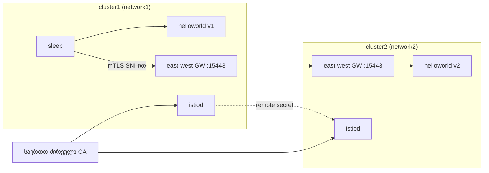

[Русская версия](README_RU.MD) · [Eng version](README.MD) · [Versión en español](README_ES.MD) · [Version française](README_FR.MD) · [Deutsche Version](README_DE.MD) · [繁體中文版](README_TW.MD) · [日本語版](README_JP.MD)

# ლაბორატორია 35 - მრავალკლასტერული mesh (multi-primary, multi-network)

## მიმოხილვა

ერთი კლასტერი მტყუნების ერთადერთი წერტილი და მასშტაბირების ზღვარია. Istio-ს შეუძლია რამდენიმე
კლასტერი **ერთიან mesh-ში** გააერთიანოს: სხვადასხვა კლასტერის სერვისები ერთმანეთს ხედავენ და mTLS-ით
ურთიერთობენ, თითქოს გვერდიგვერდ იყვნენ. ამისთვის სამი რამაა საჭირო: **საერთო trust** (საერთო ძირეული CA),
კლასტერებს შორის **სერვისების აღმოჩენა** (remote secret) და **ქსელური დაკავშირებადობა** (east-west gateway).

ამ ლაბორატორიაში გაშლილია **ორი „სუფთა“ კლასტერი** (მათზე არაფერია დაყენებული). სამუშაო
ადგილს (worker PC) ორივე კლასტერის kubeconfig-კონტექსტები აქვს. mesh-ის მთელ აწყობას
ხელით ასრულებთ: ქმნით საერთო CA-ს, ორივე კლასტერზე აყენებთ istioctl/Istio-ს
(**multi-primary** მოდელი), ამუშავებთ east-west gateway-ს (**multi-network** მოდელი),
კლასტერებს remote-საიდუმლოებით აკავშირებთ და კლასტერთაშორის დატვირთვის დაბალანსებას ამოწმებთ.



## ინფრასტრუქტურა

| კომპონენტი | ტიპი | რაოდენობა | როლი |
|---|---|---|---|
| cluster1 (control-plane) | `t3.xlarge` | 1 | k8s + istiod + EW gateway + helloworld v1 + sleep |
| cluster2 (control-plane) | `t3.xlarge` | 1 | k8s + istiod + EW gateway + helloworld v2 |
| worker PC | `t3.small` | 1 | `kubectl` (ორივე კონტექსტი), `istioctl`, `openssl`, `check_result` |

ორივე კლასტერი ერთ VPC-შია (`10.10.0.0/16`), ნოდებს შორის ტრაფიკი VPC-ის შიგნით გახსნილია.
რეგიონი: `eu-central-1` (AZ `eu-central-1a` / `eu-central-1b`).

## განთავსება

```bash
TASK=35 make run_ica_task
```

## დავალება

ორი კლასტერისგან ერთიანი mesh-ის აწყობა და კლასტერთაშორისი დატვირთვის დაბალანსების დადასტურება:

1. **საერთო CA**: შექმენით ძირეული + შუალედური CA და ორივე კლასტერის
   `istio-system`-ში დააყენეთ ერთნაირი `cacerts` საიდუმლო.
2. **Istio multi-primary**: ორივე კლასტერზე დააყენეთ istioctl და Istio (თითოეულში საკუთარი istiod,
   საერთო `meshID`, განსხვავებული `clusterName`/`network`).
3. **East-west gateway**: თითოეულ კლასტერზე აამუშავეთ EW-კარიბჭე, რომელიც ნოდის IP-ზე
   `15443` პორტითაა ხელმისაწვდომი, და გახსენით `*.local` სერვისები (`AUTO_PASSTHROUGH`).
4. **Cross-cluster discovery**: ორივე მიმართულებით შექმენით remote-საიდუმლოები
   (`istioctl create-remote-secret`).
5. **შემოწმება**: გაშალეთ `helloworld` (v1 cluster1-ში, v2 cluster2-ში) და `sleep`; დარწმუნდით,
   რომ cluster1-ის კლიენტი პასუხებს იღებს როგორც v1-ისგან, ისე v2-ისგან.

> ბრძანებების სრული ნაკრები მოცემულია [საცნობარო გადაწყვეტაში](worker/files/solutions/1_GE.MD). ქვემოთ მოცემულია საყრდენი
> ნაბიჯები.

## საყრდენი ნაბიჯები

```bash
# კონტექსტები და ნოდების IP
CTX1=$(kubectl config get-contexts -o name | grep -m1 cluster1)
CTX2=$(kubectl config get-contexts -o name | grep -m1 cluster2)
C1_IP=$(kubectl --context "$CTX1" get nodes -o jsonpath='{.items[0].status.addresses[?(@.type=="InternalIP")].address}')
C2_IP=$(kubectl --context "$CTX2" get nodes -o jsonpath='{.items[0].status.addresses[?(@.type=="InternalIP")].address}')

# istioctl worker PC-ზე
export ISTIO_VERSION=1.29.1
curl -L https://istio.io/downloadIstio | ISTIO_VERSION=$ISTIO_VERSION sh -
sudo install istio-$ISTIO_VERSION/bin/istioctl /usr/local/bin/
```

1. **საერთო CA** - შექმენით (openssl-ით) `root-cert.pem`/`ca-cert.pem`/`ca-key.pem`/
   `cert-chain.pem` და ორივე კლასტერის `istio-system`-ში შექმენით **ერთნაირი** `cacerts`
   საიდუმლო.
2. **Istio** - თითოეულ კლასტერზე გაუშვით `istioctl install`: `meshID: mesh1`, `clusterName`
   `cluster1`/`cluster2`, `network` `network1`/`network2`, აგრეთვე `meshNetworks` EW-კარიბჭეების
   მისამართებით (`$C1_IP:15443`, `$C2_IP:15443`). `istio-system` მონიშნეთ
   `topology.istio.io/network` ჭდით.
3. **East-west gateway** - დააყენეთ EW-კარიბჭე (NodePort), მის Service-ს პატჩით მიანიჭეთ
   `externalIPs=[<IP ნოდები>]`, გამოიყენეთ `Gateway` პარამეტრით `tls.mode: AUTO_PASSTHROUGH` `*.local`-ისთვის.
   მნიშვნელოვანია: EW-კარიბჭის ოპერატორს უნდა ჰქონდეს იგივე `meshID`/`multiCluster.clusterName`/`network`,
   რაც istiod-ს, წინააღმდეგ შემთხვევაში proxy თავს კლასტერ `Kubernetes`-ად წარადგენს და istiod მის ტოკენს უარყოფს.
4. **Remote secrets**:

   ```bash
   istioctl create-remote-secret --context "$CTX1" --name cluster1 --server "https://$C1_IP:6443" | kubectl apply --context "$CTX2" -f -
   istioctl create-remote-secret --context "$CTX2" --name cluster2 --server "https://$C2_IP:6443" | kubectl apply --context "$CTX1" -f -
   ```

5. **Sample** - `helloworld` (Service ორივეგან, v1 cluster1-ში, v2 cluster2-ში) + `sleep`, შემდეგ:

   ```bash
   kubectl --context "$CTX1" -n sample exec deploy/sleep -c sleep -- \
     sh -c 'for i in $(seq 10); do curl -s helloworld:5000/hello; done'
   # პასუხები როგორც v1-იდან (ლოკალურად), ისე v2-იდან (დაშორებული კლასტერი)
   ```

## როგორ მუშაობს

- **საერთო CA** - ორივე კლასტერი ერთსა და იმავე `cacerts`-ს აყენებს, ამიტომ ორივე istiod-ის
  mTLS-სერტიფიკატები საერთო ძირეულ სერტიფიკატს ენდობიან. საერთო ძირის გარეშე კლასტერთაშორისი ნდობა არ არსებობს.
- **Multi-primary** - თითოეულ კლასტერში საკუთარი istiod-ია და მართვის ერთიანი მტყუნების წერტილი არ არსებობს.
- **Multi-network + EW gateway** - კლასტერებს განსხვავებული ქსელები აქვთ (overlay CNI, გადამფარავი
  pod CIDR), ამიტომ cross-cluster ტრაფიკი east-west gateway-ის გავლით SNI-ით
  (`AUTO_PASSTHROUGH`) მიედინება, გამჭოლი mTLS-ის შენარჩუნებით; `meshNetworks` თითოეულ istiod-ს
  მეზობელი კარიბჭის მისამართს აწვდის.
- **Remote secret** - istiod-ს მეზობელი კლასტერის API-ზე წვდომას აძლევს; ის მეზობელი კლასტერის
  სერვისებს აღმოაჩენს და ერთსახელიანი სერვისების ენდპოინტებს აერთიანებს.
- **Cross-cluster LB** - როდესაც ერთი `helloworld`-ის უკან ორივე კლასტერის ენდპოინტებია,
  Envoy მათ შორის აბალანსებს (locality-aware + failover).

## შედეგის შემოწმება

worker PC-ზე გაუშვით:

```bash
check_result
```

## შედეგი

თქვენ ორი კლასტერი ერთიან mesh-ში გააერთიანეთ: საერთო CA, multi-primary istiod, east-west
gateway multi-network-ისთვის, cross-cluster discovery remote-საიდუმლოებით - და დაადასტურეთ
კლასტერთაშორისი დატვირთვის დაბალანსება. ეს მტყუნებებისადმი მდგრადი და გეოგრაფიულად განაწილებული mesh-ის საფუძველია.
