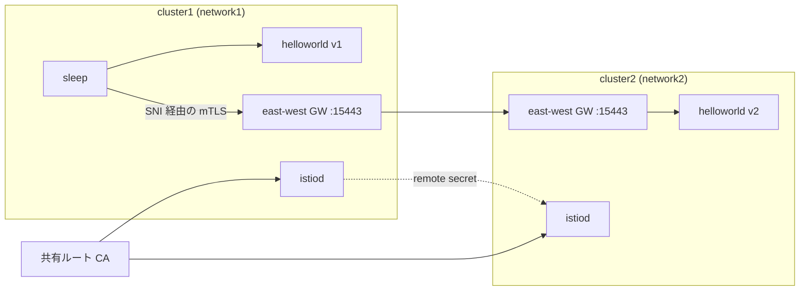

[Русская версия](README_RU.MD) · [Eng version](README.MD) · [Versión en español](README_ES.MD) · [Version française](README_FR.MD) · [Deutsche Version](README_DE.MD) · [ქართული ვერსია](README_GE.MD) · [繁體中文版](README_TW.MD)

# Lab 35 - マルチクラスター・メッシュ（multi-primary、multi-network）

## 概要

1 つのクラスターは単一障害点であり、スケールの限界でもあります。Istio は複数の
クラスターを **単一の mesh** に統合できます。異なるクラスターのサービスは互いを検出し、
近くにあるかのように mTLS で通信します。そのためには、**共有 trust**（共通のルート CA）、
クラスター間の**サービス検出**（remote secret）、そして**ネットワーク接続性**（east-west gateway）という
3 つが必要です。

このラボでは、何もインストールされていない **2 つの「素の」クラスター** がデプロイされています。
作業マシン（worker PC）には両クラスターの kubeconfig コンテキストがあります。mesh の構築はすべて
手作業で行います。共有 CA を生成し、両クラスターに istioctl/Istio をインストールし（
**multi-primary** モデル）、east-west gateway を立ち上げ（**multi-network** モデル）、
remote secret でクラスターを接続して、クラスター間の負荷分散を確認します。



## インフラストラクチャ

| コンポーネント | タイプ | 数 | 役割 |
|---|---|---|---|
| cluster1 (control-plane) | `t3.xlarge` | 1 | k8s + istiod + EW gateway + helloworld v1 + sleep |
| cluster2 (control-plane) | `t3.xlarge` | 1 | k8s + istiod + EW gateway + helloworld v2 |
| worker PC | `t3.small` | 1 | `kubectl`（両コンテキスト）、`istioctl`、`openssl`、`check_result` |

両クラスターは同一の VPC（`10.10.0.0/16`）内にあり、ノード間トラフィックは VPC 内で許可されています。
リージョン: `eu-central-1`（AZ `eu-central-1a` / `eu-central-1b`）。

## デプロイ

```bash
TASK=35 make run_ica_task
```

## 課題

2 つのクラスターから単一の mesh を構築し、クラスター間の負荷分散を証明してください。

1. **共有 CA**: ルート CA と中間 CA を生成し、両クラスターの `istio-system` に同一の
   `cacerts` シークレットをインストールする。
2. **Istio multi-primary**: 両クラスターに istioctl と Istio をインストールする（各クラスターに
   独自の istiod、共通の `meshID`、異なる `clusterName`/`network`）。
3. **East-west gateway**: 各クラスターでノード IP の `15443` から到達可能な EW gateway を立ち上げ、
   `*.local` サービスを公開する（`AUTO_PASSTHROUGH`）。
4. **Cross-cluster discovery**: 双方向の remote secret を作成する
   （`istioctl create-remote-secret`）。
5. **確認**: `helloworld`（cluster1 に v1、cluster2 に v2）と `sleep` をデプロイし、
   cluster1 のクライアントが v1 と v2 の両方から応答を受けることを確認する。

> コマンド一式は [reference solution](worker/files/solutions/1_JP.MD) にあります。以下は指針となる
> 手順です。

## 指針となる手順

```bash
# コンテキストとノードの IP
CTX1=$(kubectl config get-contexts -o name | grep -m1 cluster1)
CTX2=$(kubectl config get-contexts -o name | grep -m1 cluster2)
C1_IP=$(kubectl --context "$CTX1" get nodes -o jsonpath='{.items[0].status.addresses[?(@.type=="InternalIP")].address}')
C2_IP=$(kubectl --context "$CTX2" get nodes -o jsonpath='{.items[0].status.addresses[?(@.type=="InternalIP")].address}')

# worker PC 上の istioctl
export ISTIO_VERSION=1.29.1
curl -L https://istio.io/downloadIstio | ISTIO_VERSION=$ISTIO_VERSION sh -
sudo install istio-$ISTIO_VERSION/bin/istioctl /usr/local/bin/
```

1. **共有 CA** - （openssl で）`root-cert.pem`/`ca-cert.pem`/`ca-key.pem`/
   `cert-chain.pem` を生成し、両クラスターの `istio-system` に**同一の** `cacerts`
   シークレットを作成する。
2. **Istio** - 各クラスターで `istioctl install` を実行する: `meshID: mesh1`、`clusterName`
   `cluster1`/`cluster2`、`network` `network1`/`network2`、および EW gateway のアドレスを含む
   `meshNetworks`（`$C1_IP:15443`、`$C2_IP:15443`）。`istio-system` に
   `topology.istio.io/network` ラベルを付与する。
3. **East-west gateway** - EW gateway（NodePort）をインストールし、その Service に
   `externalIPs=[<ノード IP>]` をパッチし、`*.local` 用の `tls.mode: AUTO_PASSTHROUGH` を持つ
   `Gateway` を適用する。重要: EW gateway のオペレーターは istiod と同じ
   `meshID`/`multiCluster.clusterName`/`network` を持つ必要があります。そうでない場合、プロキシは
   自身を `Kubernetes` クラスターとして提示し、istiod はそのトークンを拒否します。
4. **Remote secrets**:

   ```bash
   istioctl create-remote-secret --context "$CTX1" --name cluster1 --server "https://$C1_IP:6443" | kubectl apply --context "$CTX2" -f -
   istioctl create-remote-secret --context "$CTX2" --name cluster2 --server "https://$C2_IP:6443" | kubectl apply --context "$CTX1" -f -
   ```

5. **Sample** - `helloworld`（両方に Service、cluster1 に v1、cluster2 に v2）+ `sleep`、続いて:

   ```bash
   kubectl --context "$CTX1" -n sample exec deploy/sleep -c sleep -- \
     sh -c 'for i in $(seq 10); do curl -s helloworld:5000/hello; done'
   # v1 (ローカル) と v2 (リモートクラスタ) の両方からの応答
   ```

## 仕組み

- **共有 CA** - 両クラスターは同じ `cacerts` をインストールするため、両方の istiod の
  mTLS 証明書は共通ルートを信頼します。共通ルートなしではクラスター間の信頼はありません。
- **Multi-primary** - 各クラスターに独自の istiod があり、単一の管理点はありません。
- **Multi-network + EW gateway** - クラスターのネットワークは異なり（overlay CNI、重複する
  pod CIDR）、そのため cross-cluster トラフィックは SNI を使用して east-west gateway 経由で送られます
  （`AUTO_PASSTHROUGH`）。エンドツーエンドの mTLS は維持され、`meshNetworks` は各 istiod に
  隣接 gateway のアドレスを知らせます。
- **Remote secret** - istiod に隣接クラスターの API へのアクセスを与え、そのサービスを検出して
  同名サービスのエンドポイントを統合します。
- **Cross-cluster LB** - 1 つの `helloworld` の背後に両クラスターのエンドポイントがある場合、
  Envoy はそれらの間で負荷分散します（locality-aware + failover）。

## 結果の確認

worker PC で実行してください:

```bash
check_result
```

## まとめ

2 つのクラスターを単一の mesh に統合しました。共有 CA、multi-primary istiod、multi-network 用の
 east-west gateway、remote secret による cross-cluster discovery、そしてクラスター間の負荷分散を確認しました。
これは耐障害性と地理分散 mesh の基盤です。