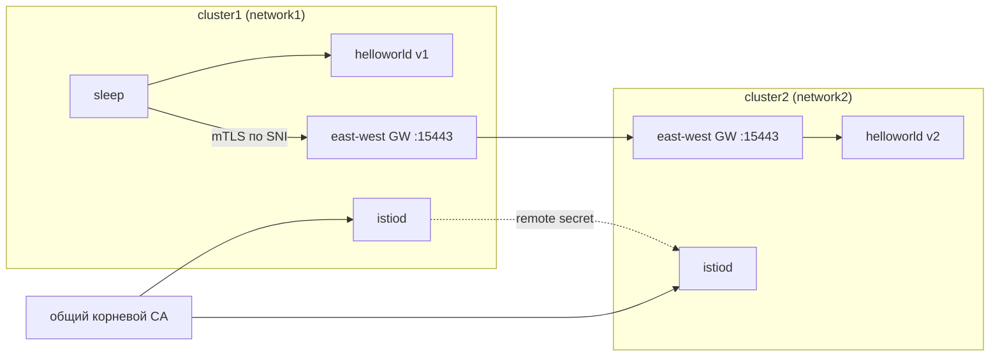

[Eng version](README.MD)

# Lab 35 - Мультикластерный mesh (multi-primary, multi-network)

## Обзор

Один кластер - единая точка отказа и предел масштаба. Istio умеет объединять несколько
кластеров в **единый mesh**: сервисы разных кластеров видят друг друга и общаются по mTLS,
как рядом. Для этого нужны три вещи: **общий trust** (общий корневой CA), **обнаружение
сервисов** между кластерами (remote secret) и **сетевая связность** (east-west gateway).

В этой лабе развёрнуты **два «голых» кластера** (на них ничего не установлено). Рабочее
место (worker PC) имеет kubeconfig-контексты обоих кластеров. Всю сборку mesh вы делаете
руками: генерируете общий CA, ставите istioctl/Istio на оба кластера (модель
**multi-primary**), поднимаете east-west gateway (модель **multi-network**), связываете
кластеры remote-секретами и проверяете межкластерную балансировку.



## Задание

Собрать из двух кластеров единый mesh и доказать межкластерную балансировку:

1. **Общий CA**: сгенерировать корневой + промежуточный CA и установить одинаковый секрет
   `cacerts` в `istio-system` обоих кластеров.
2. **Istio multi-primary**: установить istioctl и Istio на оба кластера (свой istiod в
   каждом, общий `meshID`, разные `clusterName`/`network`).
3. **East-west gateway**: поднять на каждом кластере EW-шлюз, доступный по IP ноды на
   `15443`, и открыть сервисы `*.local` (`AUTO_PASSTHROUGH`).
4. **Cross-cluster discovery**: создать remote-секреты в обе стороны
   (`istioctl create-remote-secret`).
5. **Проверка**: развернуть `helloworld` (v1 в cluster1, v2 в cluster2) и `sleep`, убедиться,
   что клиент из cluster1 получает ответы и от v1, и от v2.

> Полный набор команд - в [reference solution](worker/files/solutions/1.MD). Ниже - опорные
> шаги.

## Опорные шаги

```bash
# контексты и IP нод
CTX1=$(kubectl config get-contexts -o name | grep -m1 cluster1)
CTX2=$(kubectl config get-contexts -o name | grep -m1 cluster2)
C1_IP=$(kubectl --context "$CTX1" get nodes -o jsonpath='{.items[0].status.addresses[?(@.type=="InternalIP")].address}')
C2_IP=$(kubectl --context "$CTX2" get nodes -o jsonpath='{.items[0].status.addresses[?(@.type=="InternalIP")].address}')

# istioctl на worker PC
export ISTIO_VERSION=1.29.1
curl -L https://istio.io/downloadIstio | ISTIO_VERSION=$ISTIO_VERSION sh -
sudo install istio-$ISTIO_VERSION/bin/istioctl /usr/local/bin/
```

1. **Общий CA** - сгенерировать (openssl) `root-cert.pem`/`ca-cert.pem`/`ca-key.pem`/
   `cert-chain.pem` и создать **одинаковый** секрет `cacerts` в `istio-system` обоих
   кластеров.
2. **Istio** - `istioctl install` на каждом кластере: `meshID: mesh1`, `clusterName`
   `cluster1`/`cluster2`, `network` `network1`/`network2`, а также `meshNetworks` с адресами
   EW-шлюзов (`$C1_IP:15443`, `$C2_IP:15443`). Пометить `istio-system` меткой
   `topology.istio.io/network`.
3. **East-west gateway** - установить EW-шлюз (NodePort), пропатчить его Service
   `externalIPs=[<IP ноды>]`, применить `Gateway` с `tls.mode: AUTO_PASSTHROUGH` для `*.local`.
   Важно: у оператора EW-шлюза должны быть те же `meshID`/`multiCluster.clusterName`/`network`,
   что и у istiod, иначе прокси представится кластером `Kubernetes` и istiod отклонит его токен.
4. **Remote secrets**:

   ```bash
   istioctl create-remote-secret --context "$CTX1" --name cluster1 --server "https://$C1_IP:6443" | kubectl apply --context "$CTX2" -f -
   istioctl create-remote-secret --context "$CTX2" --name cluster2 --server "https://$C2_IP:6443" | kubectl apply --context "$CTX1" -f -
   ```

5. **Sample** - `helloworld` (Service в обоих, v1 в cluster1, v2 в cluster2) + `sleep`, затем:

   ```bash
   kubectl --context "$CTX1" -n sample exec deploy/sleep -c sleep -- \
     sh -c 'for i in $(seq 10); do curl -s helloworld:5000/hello; done'
   # ответы и от v1 (локально), и от v2 (удалённый кластер)
   ```

## Как это работает

- **Общий CA** - оба кластера ставят один и тот же `cacerts`, поэтому mTLS-сертификаты
  обоих istiod доверяют общему корню. Без общего корня межкластерного доверия нет.
- **Multi-primary** - свой istiod в каждом кластере, нет единой точки управления.
- **Multi-network + EW gateway** - у кластеров разные сети (overlay CNI, пересекающиеся
  pod CIDR), поэтому cross-cluster трафик идёт через east-west gateway по SNI
  (`AUTO_PASSTHROUGH`) с сохранением сквозного mTLS; `meshNetworks` сообщает каждому istiod
  адрес шлюза соседа.
- **Remote secret** - даёт istiod доступ к API соседнего кластера, тот обнаруживает его
  сервисы и объединяет эндпоинты одноимённых сервисов.
- **Cross-cluster LB** - когда за одним `helloworld` стоят эндпоинты из обоих кластеров,
  Envoy балансирует между ними (locality-aware + failover).

## Проверка результата

Запустите на worker PC:

```bash
check_result
```

## Итог

Вы объединили два кластера в единый mesh: общий CA, multi-primary istiod, east-west
gateway для multi-network, cross-cluster discovery через remote-секреты - и подтвердили
межкластерную балансировку. Это фундамент отказоустойчивого и гео-распределённого mesh.

## Инфраструктура

| Компонент | Тип | Кол-во | Роль |
|---|---|---|---|
| cluster1 (control-plane) | `t3.xlarge` | 1 | k8s + istiod + EW gateway + helloworld v1 + sleep |
| cluster2 (control-plane) | `t3.xlarge` | 1 | k8s + istiod + EW gateway + helloworld v2 |
| worker PC | `t3.small` | 1 | `kubectl` (оба контекста), `istioctl`, `openssl`, `check_result` |

Оба кластера в одном VPC (`10.10.0.0/16`), трафик между нодами открыт внутри VPC.
Регион: `eu-central-1` (AZ `eu-central-1a` / `eu-central-1b`).
