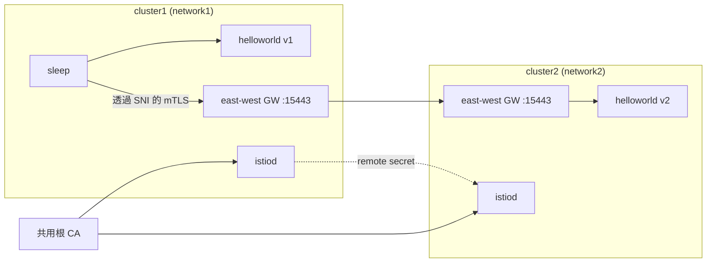

[Русская версия](README_RU.MD) · [Eng version](README.MD) · [Versión en español](README_ES.MD) · [Version française](README_FR.MD) · [Deutsche Version](README_DE.MD) · [ქართული ვერსია](README_GE.MD) · [日本語版](README_JP.MD)

# Lab 35 - 多叢集 mesh（multi-primary、multi-network）

## 概觀

單一叢集既是單一故障點，也是擴展上限。Istio 可將多個叢集組合成**單一 mesh**：不同叢集的服務能彼此發現，並如同相鄰般透過 mTLS 通訊。為此需要三項要素：**共用 trust**（共用根 CA）、跨叢集的**服務發現**（remote secret），以及**網路連通性**（east-west gateway）。

此實驗已部署**兩個「裸」叢集**（尚未在其中安裝任何元件）。工作站（worker PC）具有兩個叢集的 kubeconfig context。你必須手動完成整個 mesh 的建置：產生共用 CA、在兩個叢集上安裝 istioctl/Istio（**multi-primary** 模型）、建立 east-west gateway（**multi-network** 模型）、使用 remote secret 連結叢集，並驗證跨叢集負載平衡。



## 基礎架構

| 元件 | 類型 | 數量 | 角色 |
|---|---|---|---|
| cluster1 (control-plane) | `t3.xlarge` | 1 | k8s + istiod + EW gateway + helloworld v1 + sleep |
| cluster2 (control-plane) | `t3.xlarge` | 1 | k8s + istiod + EW gateway + helloworld v2 |
| worker PC | `t3.small` | 1 | `kubectl`（兩個 context）、`istioctl`、`openssl`、`check_result` |

兩個叢集位於同一個 VPC（`10.10.0.0/16`），VPC 內節點間流量已開放。
區域：`eu-central-1`（AZ `eu-central-1a` / `eu-central-1b`）。

## 部署

```bash
TASK=35 make run_ica_task
```

## 任務

將兩個叢集組成單一 mesh，並證明跨叢集負載平衡：

1. **共用 CA**：產生根 CA 與中繼 CA，並在兩個叢集的 `istio-system` 中安裝相同的
   `cacerts` secret。
2. **Istio multi-primary**：在兩個叢集上安裝 istioctl 和 Istio（每個叢集各有一個 istiod、
   共用 `meshID`、使用不同的 `clusterName`/`network`）。
3. **East-west gateway**：在每個叢集建立 EW gateway，使其可透過節點 IP 的
   `15443` 存取，並開放 `*.local` 服務（`AUTO_PASSTHROUGH`）。
4. **Cross-cluster discovery**：雙向建立 remote secret
   （`istioctl create-remote-secret`）。
5. **驗證**：部署 `helloworld`（cluster1 中的 v1、cluster2 中的 v2）與 `sleep`，確認
   cluster1 中的用戶端會收到 v1 和 v2 的回應。

> 完整命令集請見 [reference solution](worker/files/solutions/1_TW.MD)。以下為指引
> 步驟。

## 指引步驟

```bash
# 節點的 context 和 IP
CTX1=$(kubectl config get-contexts -o name | grep -m1 cluster1)
CTX2=$(kubectl config get-contexts -o name | grep -m1 cluster2)
C1_IP=$(kubectl --context "$CTX1" get nodes -o jsonpath='{.items[0].status.addresses[?(@.type=="InternalIP")].address}')
C2_IP=$(kubectl --context "$CTX2" get nodes -o jsonpath='{.items[0].status.addresses[?(@.type=="InternalIP")].address}')

# istioctl 在 worker PC 上
export ISTIO_VERSION=1.29.1
curl -L https://istio.io/downloadIstio | ISTIO_VERSION=$ISTIO_VERSION sh -
sudo install istio-$ISTIO_VERSION/bin/istioctl /usr/local/bin/
```

1. **共用 CA** - 產生（openssl）`root-cert.pem`/`ca-cert.pem`/`ca-key.pem`/
   `cert-chain.pem`，並在兩個叢集的 `istio-system` 中建立**相同的** `cacerts`
   secret。
2. **Istio** - 在每個叢集執行 `istioctl install`：`meshID: mesh1`、`clusterName`
   `cluster1`/`cluster2`、`network` `network1`/`network2`，以及包含 EW gateway
   位址（`$C1_IP:15443`、`$C2_IP:15443`）的 `meshNetworks`。以
   `topology.istio.io/network` label 標記 `istio-system`。
3. **East-west gateway** - 安裝 EW gateway（NodePort），修補其 Service 的
   `externalIPs=[<節點 IP>]`，並為 `*.local` 套用 `tls.mode: AUTO_PASSTHROUGH` 的
   `Gateway`。重要：EW gateway 的 operator 必須與 istiod 使用相同的
   `meshID`/`multiCluster.clusterName`/`network`，否則 proxy 會將自身識別為
   `Kubernetes` 叢集，istiod 會拒絕其 token。
4. **Remote secrets**：

   ```bash
   istioctl create-remote-secret --context "$CTX1" --name cluster1 --server "https://$C1_IP:6443" | kubectl apply --context "$CTX2" -f -
   istioctl create-remote-secret --context "$CTX2" --name cluster2 --server "https://$C2_IP:6443" | kubectl apply --context "$CTX1" -f -
   ```

5. **Sample** - `helloworld`（兩個叢集皆有 Service，cluster1 中為 v1，cluster2 中為 v2）+
   `sleep`，接著：

   ```bash
   kubectl --context "$CTX1" -n sample exec deploy/sleep -c sleep -- \
     sh -c 'for i in $(seq 10); do curl -s helloworld:5000/hello; done'
   # 回應來自 v1 (本地) 以及 v2 (遠端叢集)
   ```

## 運作原理

- **共用 CA** - 兩個叢集都安裝相同的 `cacerts`，因此兩個 istiod 的 mTLS 憑證都信任
  同一個根 CA。若無共用根 CA，就沒有跨叢集信任。
- **Multi-primary** - 每個叢集有自己的 istiod，沒有單一管理點。
- **Multi-network + EW gateway** - 叢集使用不同網路（overlay CNI、重疊的
  pod CIDR），因此 cross-cluster 流量會經由 east-west gateway，透過 SNI
  （`AUTO_PASSTHROUGH`）傳送並維持端到端 mTLS；`meshNetworks` 會告知每個 istiod
  鄰居 gateway 的位址。
- **Remote secret** - 讓 istiod 可存取相鄰叢集的 API，以便發現其服務並合併同名服務的
  endpoint。
- **Cross-cluster LB** - 當同一個 `helloworld` 有來自兩個叢集的 endpoint 時，
  Envoy 會在它們之間進行負載平衡（locality-aware + failover）。

## 驗證結果

在 worker PC 上執行：

```bash
check_result
```

## 總結

你已將兩個叢集整合為單一 mesh：共用 CA、multi-primary istiod、用於 multi-network 的
 east-west gateway、透過 remote secret 的 cross-cluster discovery，並確認了跨叢集負載
平衡。這是具備容錯能力與地理分散式 mesh 的基礎。
