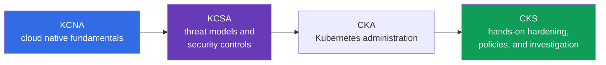
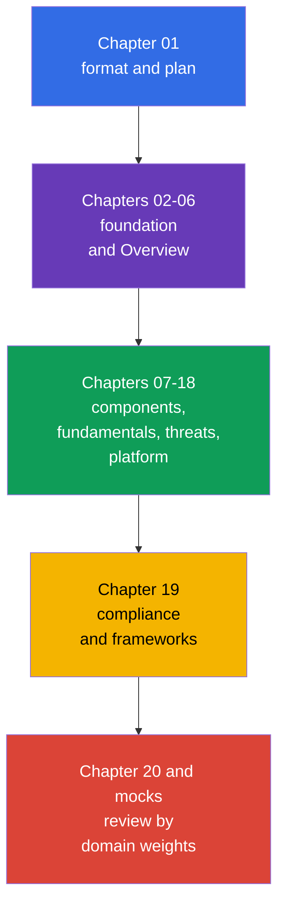

[Русская версия](ru.md) · [Versión en español](es.md) · [Version française](fr.md) · [Deutsche Version](de.md) · [ქართული ვერსია](ge.md) · [繁體中文版](tw.md) · [日本語版](jp.md)

# Chapter 01. Introduction: the KCSA exam, format, certification path, and versions

> **What is next.** KCSA establishes a common language for discussing Kubernetes and cloud native security. This introductory chapter is not an exam domain, but it explains what the certification assesses, how to read this course, and why KCSA creates a conceptual foundation while CKS requires subsequent practical preparation through CKA.

## 01.1 What is KCSA and who needs it

**Kubernetes and Cloud Native Security Associate (KCSA)** is a vendor-neutral CNCF and Linux Foundation certification covering the fundamentals of Kubernetes and cloud native security. It is an associate-level certification: the exam assesses understanding of models, risks, responsibility boundaries, and the purpose of security mechanisms, rather than the ability to quickly assemble a cluster by following instructions.

There are no formal prerequisites. It is helpful to already distinguish a `Pod`, `Deployment`, `Service`, and `Namespace`, but the course provides the necessary context itself. KCSA is suitable for developers, administrators, DevOps/SRE professionals, and beginning security engineers who need to understand which risks arise from code through cloud infrastructure.

The main outcome of preparation is not a set of commands, but the ability to connect a threat to an appropriate control. For example, a token leak from a container does not relate only to a `Secret`: you need to assess `ServiceAccount` permissions, API access, the image, the network, and cloud IAM policies.

## 01.2 Exam format and how it differs from CKS

KCSA is a proctored remote exam with multiple choice questions. **Under Linux Foundation rules verified on September 1, 2026, the standard MCQ exam has 60 questions, lasts 90 minutes, and requires 75% to pass.** The exam is conducted with proctoring: identity, workspace, browser, and other requirements must be checked in the current Linux Foundation rules before an attempt.

**Rules snapshot as of 2026-09-01.** The official Linux Foundation language matrix lists English only for KCSA. LF policy for multiple choice exams prohibits tools, reference materials, and external websites. Therefore, prepare practically: work through question wording and all answer options in English, and practice recalling terms and eliminating distractors without documentation, search, or notes.

The number of questions, duration, passing score, and other organizational conditions may change after the snapshot date. Before registering, recheck the KCSA Linux Foundation page, Multiple Choice Exams: Important Instructions/FAQ, and Candidate Handbook rather than relying on old notes or a practice test.

| Characteristic | KCSA | CKS |
|---|---|---|
| Assessed level | concepts, risks, purpose of controls | application of security measures in a cluster |
| Format | multiple choice | performance-based tasks |
| Hands-on | no | yes |
| What matters on the exam | choose the most precise explanation or control | perform and verify a change in a Kubernetes environment |
| Role in the path | conceptual foundation | practical security specialization |

You do not need to perform lab tasks during the KCSA exam. However, understanding what happens when configuring RBAC, `NetworkPolicy`, or `securityContext` helps eliminate incorrect answer options. CKS requires the next step: confidently applying these mechanisms hands-on.

## 01.3 Domains and weights

The current Linux Foundation LIVE curriculum consists of six domains. Their weights determine where to spend time during review.

| Domain | Weight | What you need to understand |
|---|---:|---|
| Overview of Cloud Native Security | 14% | the 4C model, cloud infrastructure, isolation, images, and code |
| Kubernetes Cluster Component Security | 22% | security of the control plane, nodes, network, storage, and clients |
| Kubernetes Security Fundamentals | 22% | authentication, authorization, PSS/PSA, `Secret`, auditing, and segmentation |
| Kubernetes Threat Model | 16% | trust boundaries, data flows, and the main attack categories |
| Platform Security | 16% | supply chain, registries, admission control, observability, PKI, and connectivity |
| Compliance and Security Frameworks | 10% | compliance, threat modeling, automation, and controls |
| **Total** | **100%** | **14/22/22/16/16/10** |

A high weight does not mean it is enough to memorize definitions. A question may describe a situation, such as a privileged `Pod` with node access, while the correct answer requires connecting PSS, least privilege, and the risk of privilege escalation. Therefore, the course first builds a general model and then examines controls by layers and domains.

## 01.4 Certification path: KCNA → KCSA → CKA → CKS

Certifications can be arranged as a sequence of increasing depth in cloud native security:

- **KCNA** provides a broad foundation: cloud native, containers, Kubernetes, CNCF, and general practices. It is useful if you need an introduction to the ecosystem, but it does not replace Kubernetes security.
- **KCSA** focuses on security: how the attack surface is structured, who is responsible for different layers, which mechanisms limit the impact of an incident, and what common threats are called.
- **CKA** develops Kubernetes administration practice: under Linux Foundation rules, CKA is the mandatory prerequisite before attempting CKS.
- **CKS** turns security knowledge into hardening and investigation practice. The CKS course can be read as supplementary material, but it does not replace the requirement to pass CKA before the CKS exam.

This is a recommended learning path, not a formal requirement for KCSA: a person with Kubernetes experience can start with KCSA without KCNA. After KCSA, the next official Kubernetes certification step is CKA; CKS can follow afterward.

## 01.5 How the course is structured and how to prepare

After two foundational chapters, the course follows the six curriculum domains. Each chapter first examines an object or risk, then its impact, the purpose of security measures, and common misconceptions. Deep step-by-step configurations are intentionally not the goal: KCSA assesses concepts, while links forward to CKS provide practice in specialized topics.

Course practice consists of multiple choice questions at the end of chapters and mock exams, not labs. The following cycle is useful for preparation:

1. Read a chapter and state in your own words which threat each control addresses.
2. Answer the questions without hints and analyze not only the incorrect option, but also why it is incorrect.
3. Review domains in proportion to their weights: 22% each for component security and fundamentals, rather than only the most familiar topics.
4. Complete a mock under timed conditions, then group mistakes by domain and return to the corresponding chapters.
5. Before registering, verify the format, proctoring rules, and passing score with Linux Foundation.

## 01.6 Versions and curriculum drift

Examples in this course target Kubernetes `v1.36`. KCSA is a conceptual, version-light exam, so this version is primarily needed for correctness of API names and illustrations, not as a promise of the exam environment version.

The curriculum can also change along two independent tracks. For the real exam, take the structure and weights from the Linux Foundation LIVE page: currently, these are six domains with weights of `14/22/22/16/16/10`. The `cncf/curriculum` repository contains another edition with six domains and different weights. The course retains the current LF structure but includes overlapping topics from both editions to remain useful if a transition occurs.

The verification date, current weights, LF/CNCF discrepancy description, and update policy are documented in the [KCSA version policy](../../VERSION_POLICY.md). Before the exam, check the primary source again: a training course cannot replace the current Linux Foundation conditions.

## 01.7 How this is applied in practice

- **Plan learning around risk.** The platform team maps KCSA topics to roles: the developer is responsible for a secure image and code, the operator for the cluster and network, and the cloud team for IAM and infrastructure boundaries.
- **Use common terminology.** During incident discussions, saying "this is a Container-layer issue" or "we need to limit the blast radius through least privilege" makes the solution more specific than a general request to "strengthen security."
- **Do not conflate exam goals.** Prepare for KCSA conceptual questions through reading, scenario analysis, and MCQs (multiple choice questions). Develop CKS skills in a practical environment, where you must safely modify a real manifest or configuration.
- **Track the source of truth.** Before hiring, training audits, or an exam, the team verifies versions and the curriculum with LF rather than assuming that a domain weight or the passing score has not changed.

## 01.8 Exam vocabulary / Mini-glossary

| Term | Brief meaning |
|---|---|
| KCSA | Kubernetes and Cloud Native Security Associate, a conceptual certification in cloud native and Kubernetes security. |
| KCNA | Kubernetes and Cloud Native Associate, a broad introductory certification in cloud native. |
| CKS | Certified Kubernetes Security Specialist, a practical performance-based certification in Kubernetes security. |
| multiple choice | A question with answer options where you must select the most correct option. |
| proctored | An exam in which a proctor monitors compliance with the rules. |
| performance-based | A format that assesses a completed practical action in an environment, rather than only a selected answer. |
| version-light | A characteristic of an exam where key concepts, rather than attachment to one Kubernetes version, are central. |

## 01.9 Exam Essentials / Chapter summary

- KCSA is an associate-level, vendor-neutral conceptual foundation in Kubernetes and cloud native security.
- In the 2026-09-01 snapshot, KCSA follows the standard LF MCQ format: 60 questions in 90 minutes with a 75% passing score; the exam is proctored and has no hands-on tasks.
- The number of questions, duration, passing score, proctoring conditions, and other organizational rules must be rechecked in current Linux Foundation materials before an attempt.
- The LF LIVE curriculum uses six domains with weights of `14/22/22/16/16/10`.
- KCNA provides a broad foundation, KCSA connects security with threats and controls, and CKS requires applying measures in practice.
- Learning examples use Kubernetes `v1.36`; LF determines the course structure, while divergence from `cncf/curriculum` is tracked in the version policy.

## 01.10 Do not confuse these, and how they appear on the exam

Introductory questions usually assess differences rather than syntax. Typical wording asks about the KCSA format, what distinguishes it from CKS, which domain has greater weight, where to find the current passing score, and why the training cluster version is not the same as the exam version.

MCQ pitfalls:

- Do not confuse KCSA with CKS: KCSA does not require performing a hands-on task in the exam environment.
- Do not present an indicative passing score as an immutable official value.
- Do not replace LF weights with weights from another CNCF revision without confirmation from LF.
- Do not consider KCNA a mandatory prerequisite: it is useful, but not a formally required step.

## 01.11 Self-check questions

### Question 1

Which statement most accurately describes the KCSA format?

   - a. It is a take-home lab with no time limit or identity verification.
   - b. It is an exam only about programming Kubernetes operators.
   - c. It is a proctored multiple choice exam with no hands-on tasks.
   - d. It is a hands-on exam where you must configure an admission controller in a cluster.

Answer and explanation

**Correct answer: c.** KCSA assesses conceptual understanding through multiple choice questions and is conducted with proctoring. Practical actions in a cluster are characteristic of CKS.

### Question 2

Where should you verify the exact passing score before attempting the KCSA exam?

   - a. In this course's README.
   - b. In the Kubernetes `v1.36` version description.
   - c. In any old practice test.
   - d. On the current KCSA Linux Foundation page.

Answer and explanation

**Correct answer: d.** The passing score and exam conditions may change. The official Linux Foundation page is the source of truth.

### Question 3

Which sequence best reflects the purpose of certifications for a person building a path from fundamentals to practical security specialization?

   - a. CKS → KCNA → KCSA, because KCSA consists only of practical work.
   - b. CKS → KCSA → KCNA.
   - c. KCSA → KCNA → CKS, because KCNA requires CKS.
   - d. KCNA → KCSA → CKA → CKS; CKA is the mandatory prerequisite before CKS.

Answer and explanation

**Correct answer: d.** KCNA provides a broad cloud native foundation, KCSA focuses on security concepts, CKA develops Kubernetes administration practice, and CKS assesses hands-on security skills. KCNA is not a formal prerequisite for KCSA, but CKA is mandatory before attempting CKS.

### Question 4

Why does this course structure use weights of `14/22/22/16/16/10`, even though `cncf/curriculum` may contain another edition?

   - a. The course uses the current Linux Foundation LIVE weights and tracks the other `cncf/curriculum` edition separately as possible curriculum drift.
   - b. The weights are automatically calculated from the Kubernetes baseline version and change with every transition to the next minor release.
   - c. The weights divide exam time among hands-on tasks, so they are unrelated to the official Domains & Competencies.
   - d. The course authors choose the weights independently of Linux Foundation and can change them without changing the official curriculum.

Answer and explanation

**Correct answer: a.** To prepare for the real exam, the course structure follows the current Linux Foundation LIVE matrix. The `cncf/curriculum` edition is tracked separately as a source of possible drift, but it does not itself replace the current official Domains & Competencies.

> **Where next.** If the KCSA foundation is already clear and you need practical hardening, policies, and investigation practice, move to the CKS course. The next chapter in this course is [Cloud native and why security matters](../02/README.md).

[Table of contents](../README.md) · [Chapter 02](../02/README.md)