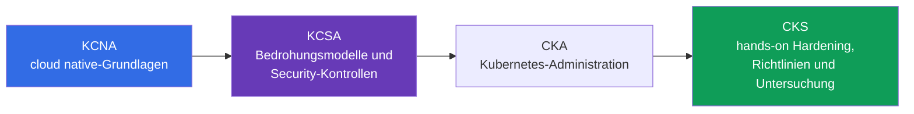
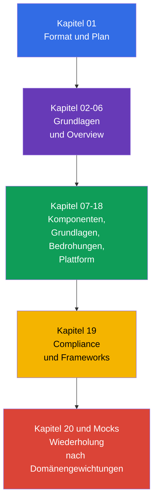

[Русская версия](ru.md) · [Eng version](README.md) · [Versión en español](es.md) · [Version française](fr.md) · [ქართული ვერსია](ge.md) · [繁體中文版](tw.md) · [日本語版](jp.md)

# Kapitel 01. Einführung: KCSA-Examen, Format, Zertifizierungsleiter und Versionen

> **Wie es weitergeht.** KCSA schafft eine gemeinsame Sprache für Gespräche über Kubernetes- und cloud native-Sicherheit. Dieses Einführungskapitel gehört nicht zu einer Examensdomäne, erklärt jedoch, was die Zertifizierung genau prüft, wie dieser Kurs zu lesen ist und warum KCSA ein konzeptionelles Fundament legt, während CKS anschließend praktische Vorbereitung über CKA erfordert.

## 01.1 Was ist KCSA und für wen ist sie gedacht

**Kubernetes and Cloud Native Security Associate (KCSA)** ist eine herstellerneutrale Zertifizierung von CNCF und Linux Foundation zu den Grundlagen von Kubernetes- und cloud native-Sicherheit. Sie befindet sich auf Associate-Niveau: Das Examen prüft das Verständnis von Modellen, Risiken, Verantwortungsgrenzen und dem Zweck von Schutzmechanismen, nicht die Fähigkeit, einen Cluster schnell anhand einer Anleitung einzurichten.

Es gibt keine formalen Voraussetzungen. Es ist hilfreich, bereits zwischen `Pod`, `Deployment`, `Service` und `Namespace` unterscheiden zu können, aber der Kurs vermittelt den notwendigen Kontext selbst. KCSA eignet sich für Entwickler, Administratoren, DevOps/SRE und angehende Security Engineers, die verstehen müssen, welche Risiken vom Code bis zur Cloud-Infrastruktur entstehen.

Das wichtigste Ergebnis der Vorbereitung ist nicht ein Satz von Befehlen, sondern die Fähigkeit, eine Bedrohung mit der passenden Kontrolle zu verknüpfen. Beispielsweise betrifft das Abfließen eines Tokens aus einem Container nicht nur ein `Secret`: Es müssen die Berechtigungen des `ServiceAccount`, der API-Zugriff, das Image, das Netzwerk und die Regeln des Cloud-IAM bewertet werden.

## 01.2 Examensformat und Unterschied zu CKS

KCSA ist ein beaufsichtigtes Remote-Examen mit multiple choice-Fragen. **Nach den am 1. September 2026 geprüften Regeln der Linux Foundation umfasst das Standard-MCQ-Examen 60 Fragen, dauert 90 Minuten und erfordert zum Bestehen 75 %.** Das Examen findet mit proctoring statt: Die Anforderungen an Identitätsnachweis, Arbeitsplatz, Browser und weitere Bedingungen sollten vor dem Versuch in den aktuellen Regeln der Linux Foundation geprüft werden.

**Stand der Regeln vom 2026-09-01.** Die offizielle Sprachmatrix der Linux Foundation führt für KCSA nur Englisch auf. Die LF-Richtlinie für multiple choice-Examen verbietet Hilfsmittel, Referenzmaterialien und externe Websites. Bereiten Sie sich daher praxisnah vor: Bearbeiten Sie Frageformulierungen und alle Antwortoptionen auf Englisch, trainieren Sie das Abrufen von Begriffen und das Ausschließen von distractor ohne Dokumentation, Suche und Notizen.

Anzahl der Fragen, Dauer, Bestehensgrenze und weitere organisatorische Bedingungen können sich nach dem Stichtag ändern. Prüfen Sie vor der Anmeldung die KCSA-Seite der Linux Foundation, Multiple Choice Exams: Important Instructions/FAQ und das Candidate Handbook erneut, nicht alte Zusammenfassungen oder Übungstests.

| Merkmal | KCSA | CKS |
|---|---|---|
| Geprüftes Niveau | Konzepte, Risiken, Zweck von Kontrollen | Anwendung von Schutzmaßnahmen im Cluster |
| Format | multiple choice | performance-based Aufgaben |
| Hands-on | nein | ja |
| Was im Examen wichtig ist | die präziseste Erklärung oder Kontrolle auswählen | eine Änderung in der Kubernetes-Umgebung ausführen und prüfen |
| Rolle in der Lernlaufbahn | konzeptionelles Fundament | praktische Security-Spezialisierung |

Bei KCSA müssen während des Examens keine Laboraufgaben ausgeführt werden. Das Verständnis dessen, was beim Konfigurieren von RBAC, `NetworkPolicy` oder `securityContext` geschieht, hilft jedoch dabei, falsche Antwortoptionen auszuschließen. CKS erfordert den nächsten Schritt: diese Mechanismen sicher praktisch anzuwenden.

## 01.3 Domänen und Gewichtungen

Das aktuelle LIVE-Curriculum der Linux Foundation besteht aus sechs Domänen. Ihre Gewichtungen bestimmen, worauf beim Wiederholen Zeit verwendet werden sollte.

| Domäne | Gewichtung | Was verstanden werden muss |
|---|---:|---|
| Overview of Cloud Native Security | 14% | 4C-Modell, Cloud-Infrastruktur, Isolierung, Images und Code |
| Kubernetes Cluster Component Security | 22% | Sicherheit von control plane, Nodes, Netzwerk, storage und Clients |
| Kubernetes Security Fundamentals | 22% | authentication, authorization, PSS/PSA, `Secret`, Audit und Segmentierung |
| Kubernetes Threat Model | 16% | Vertrauensgrenzen, Datenflüsse und grundlegende Angriffskategorien |
| Platform Security | 16% | supply chain, Registries, admission control, observability, PKI und connectivity |
| Compliance and Security Frameworks | 10% | Compliance, threat modeling, Automatisierung und Kontrollmittel |
| **Gesamt** | **100%** | **14/22/22/16/16/10** |

Eine hohe Gewichtung bedeutet nicht, dass es genügt, Definitionen auswendig zu lernen. Eine Frage kann beispielsweise einen privilegierten `Pod` mit Node-Zugriff beschreiben, während die richtige Antwort verlangt, PSS, least privilege und das Risiko einer privilege escalation zu verknüpfen. Deshalb baut der Kurs zunächst ein Gesamtmodell auf und behandelt anschließend Kontrollen nach Schichten und Domänen.

## 01.4 Zertifizierungsleiter: KCNA → KCSA → CKA → CKS

Die Zertifizierungen lassen sich als eine Abfolge zunehmender Tiefe im Bereich cloud native security einordnen:

- **KCNA** vermittelt eine breite Grundlage: cloud native, Container, Kubernetes, CNCF und allgemeine Praktiken. Sie ist nützlich, wenn eine Einführung in das Ökosystem benötigt wird, ersetzt jedoch nicht die Kubernetes-Sicherheit.
- **KCSA** konzentriert sich auf Sicherheit: wie die Angriffsfläche aufgebaut ist, wer für verschiedene Schichten zuständig ist, welche Mechanismen die Folgen eines Incidents begrenzen und wie typische Bedrohungen bezeichnet werden.
- **CKA** vertieft die administrative Kubernetes-Praxis: Nach den Regeln der Linux Foundation ist CKA die verpflichtende Voraussetzung vor dem Versuch von CKS.
- **CKS** überträgt Security-Wissen in die Praxis von Hardening und Untersuchung. Der CKS-Kurs kann als ergänzendes Material gelesen werden, ersetzt jedoch nicht die Anforderung, CKA vor dem CKS-Examen zu bestehen.

Dies ist eine empfohlene Lernlaufbahn und keine formale Voraussetzung für KCSA: Eine Person mit Kubernetes-Erfahrung kann ohne KCNA mit KCSA beginnen. Nach KCSA ist CKA der nächste offizielle Kubernetes-Zertifizierungsschritt; anschließend ist CKS möglich.

## 01.5 Aufbau des Kurses und Vorbereitung

Nach zwei grundlegenden Kapiteln folgt der Kurs den sechs Domänen des Curriculums. In jedem Kapitel werden zunächst Objekt oder Risiko, dann dessen Auswirkung, der Zweck der Schutzmaßnahmen und typische Missverständnisse behandelt. Tiefgehende schrittweise Konfigurationen sind bewusst nicht das Ziel: KCSA prüft Konzepte, und für die Praxis in spezialisierten Themen führen Links weiter zu CKS.

Die Kurspraktik besteht aus multiple choice-Fragen am Ende der Kapitel und Mock-Examen, nicht aus Labs. Für die Vorbereitung ist folgender Zyklus hilfreich:

1. Ein Kapitel lesen und in eigenen Worten formulieren, welche Bedrohung jede Kontrolle abdeckt.
2. Fragen ohne Hinweise beantworten und nicht nur die falsche Antwortoption, sondern auch den Grund für ihre Fehlerhaftigkeit analysieren.
3. Die Domänen proportional zu ihren Gewichtungen wiederholen: jeweils 22 % für component security und fundamentals, nicht nur die vertrautesten Themen.
4. Einen Mock unter Zeitvorgabe lösen, Fehler anschließend nach Domänen gruppieren und zu den entsprechenden Kapiteln zurückkehren.
5. Vor der Anmeldung Format, proctoring-Regeln und Bestehensgrenze bei der Linux Foundation abgleichen.

## 01.6 Versionen und Curriculum-Drift

Die Beispiele in diesem Kurs orientieren sich an Kubernetes `v1.36`. KCSA ist ein konzeptionelles und version-light Examen, daher dient diese Version vor allem der Korrektheit von API-Bezeichnungen und Illustrationen, nicht als Zusage für die Version der Examensumgebung.

Auch das Curriculum kann sich auf zwei unabhängigen Wegen verändern. Für das reale Examen stammen Struktur und Gewichtungen von der LIVE-Seite der Linux Foundation: derzeit sind es sechs Domänen mit den Gewichtungen `14/22/22/16/16/10`. Im Repository `cncf/curriculum` gibt es eine andere Fassung mit sechs Domänen und anderen Gewichtungen. Der Kurs bewahrt die aktuelle LF-Struktur bei, schließt aber sich überschneidende Themen beider Fassungen ein, um bei einem möglichen Übergang weiterhin nützlich zu bleiben.

Prüfdatum, aktuelle Gewichtungen, die Beschreibung der LF/CNCF-Abweichung und die Aktualisierungsregel sind in der [KCSA-Versionsrichtlinie](../../VERSION_POLICY.md) festgehalten. Prüfen Sie vor dem Examen die Primärquelle erneut: Ein Lehrkurs kann die aktuellen Bedingungen der Linux Foundation nicht ersetzen.

## 01.7 Praktische Anwendung

- **Sie planen Lernen nach Risiko.** Das Plattformteam ordnet KCSA-Themen Rollen zu: Der Entwickler ist für sicheres Image und Code zuständig, der Operator für Cluster und Netzwerk, das Cloud-Team für IAM und Infrastrukturgrenzen.
- **Sie verwenden eine gemeinsame Terminologie.** Bei der Besprechung eines Incidents macht der Satz „Das ist ein Problem der Container-Schicht“ oder „Wir müssen den blast radius durch least privilege begrenzen“ die Lösung konkreter als die allgemeine Forderung, „die Sicherheit zu härten“.
- **Sie vermischen die Examensziele nicht.** Auf konzeptionelle KCSA-Fragen bereitet man sich durch Lesen, Szenarioanalyse und MCQ (multiple choice question, Frage mit Antwortauswahl) vor. CKS-Fähigkeiten werden in einer praktischen Umgebung gefestigt, in der ein reales Manifest oder eine Konfiguration sicher geändert werden muss.
- **Sie beobachten die Quelle der Wahrheit.** Vor Einstellung, Schulungsaudit oder Examen gleicht das Team Versionen und Curriculum mit LF ab, statt anzunehmen, dass sich Domänengewichtung oder Bestehensgrenze nicht geändert haben.

## 01.8 Exam Vocabulary / Mini-Glossar

| Begriff | Kurzbeschreibung |
|---|---|
| KCSA | Kubernetes and Cloud Native Security Associate, konzeptionelle Zertifizierung für cloud native- und Kubernetes-Sicherheit. |
| KCNA | Kubernetes and Cloud Native Associate, breite einführende Zertifizierung zu cloud native. |
| CKS | Certified Kubernetes Security Specialist, praktische performance-based Zertifizierung für Kubernetes-Sicherheit. |
| multiple choice | Frage mit Antwortoptionen, bei der die zutreffendste Option gewählt werden muss. |
| proctored | Examen, bei dem die Einhaltung der Regeln durch einen Proktor überwacht wird. |
| performance-based | Format, in dem eine ausgeführte praktische Handlung in einer Umgebung bewertet wird, nicht nur die gewählte Antwort. |
| version-light | Eigenschaft eines Examens, bei dem Schlüsselkonzepte wichtiger sind als die Bindung an eine einzelne Kubernetes-Version. |

## 01.9 Exam Essentials / Zusammenfassung des Kapitels

- KCSA ist ein Associate-Niveau und herstellerneutrales konzeptionelles Fundament für Kubernetes- und cloud native-Sicherheit.
- Zum Stichtag 2026-09-01 folgt KCSA dem Standard-LF-MCQ-Format: 60 Fragen in 90 Minuten, Bestehensgrenze 75 %; das Examen wird durch einen Proktor beaufsichtigt und enthält keine hands-on Aufgaben.
- Anzahl der Fragen, Dauer, Bestehensgrenze, proctoring-Bedingungen und weitere organisatorische Regeln müssen vor dem Versuch in den aktuellen Materialien der Linux Foundation erneut geprüft werden.
- Das LIVE-Curriculum der LF verwendet sechs Domänen mit den Gewichtungen `14/22/22/16/16/10`.
- KCNA vermittelt eine breite Grundlage, KCSA verknüpft Sicherheit mit Bedrohungen und Kontrollen, CKS verlangt die praktische Anwendung von Maßnahmen.
- Die Lehrbeispiele verwenden Kubernetes `v1.36`; die Kursstruktur wird durch LF bestimmt, und die Abweichung von `cncf/curriculum` wird in der Versionsrichtlinie verfolgt.

## 01.10 Nicht verwechseln und Vorkommen im Examen

Fragen im Einführungsteil prüfen gewöhnlich Unterschiede, nicht Syntax. Typische Formulierungen sind: Welches Format hat KCSA, was unterscheidet sie von CKS, welche Domäne hat eine höhere Gewichtung, wo findet man die aktuelle Bestehensgrenze und warum ist die Version des Lernclusters nicht gleich der Examensversion.

MCQ-Fallen:

- KCSA nicht mit CKS verwechseln: KCSA verlangt nicht, eine hands-on Aufgabe in der Examensumgebung auszuführen.
- Eine orientierende Bestehensgrenze nicht als unveränderlichen offiziellen Wert ausgeben.
- LF-Gewichtungen nicht ohne Bestätigung durch LF gegen die Gewichtungen einer anderen CNCF-Revision austauschen.
- KCNA nicht als verpflichtende Voraussetzung ansehen: Sie ist nützlich, aber kein formal erforderlicher Schritt.

## 01.11 Fragen zur Selbstkontrolle

### Frage 1

Welche Aussage beschreibt das KCSA-Format am genauesten?

   - a. Es ist eine Laborhausaufgabe ohne Zeitlimit und Identitätsprüfung.
   - b. Es ist ein Examen ausschließlich über die Programmierung von Kubernetes operators.
   - c. Es ist ein beaufsichtigtes multiple choice-Examen ohne hands-on Aufgaben.
   - d. Es ist ein hands-on Examen, bei dem ein admission controller im Cluster konfiguriert werden muss.

Antwort und Erläuterung

**Richtige Antwort: c.** KCSA prüft konzeptionelles Verständnis durch multiple choice-Fragen und findet mit proctoring statt. Praktische Handlungen im Cluster sind typisch für CKS.

### Frage 2

Wo sollte die genaue Bestehensgrenze vor dem Versuch des KCSA-Examens geprüft werden?

   - a. In der README dieses Kurses.
   - b. In der Beschreibung der Kubernetes-Version `v1.36`.
   - c. In irgendeinem alten Übungstest.
   - d. Auf der aktuellen KCSA-Seite der Linux Foundation.

Antwort und Erläuterung

**Richtige Antwort: d.** Bestehensgrenze und Examensbedingungen können sich ändern. Die offizielle Seite der Linux Foundation ist die Quelle der Wahrheit.

### Frage 3

Welche Reihenfolge spiegelt den Zweck der Zertifizierungen für eine Person am besten wider, die eine Lernlaufbahn von Grundlagen bis zur praktischen Security-Spezialisierung aufbaut?

   - a. CKS → KCNA → KCSA, weil KCSA nur aus Praxis besteht.
   - b. CKS → KCSA → KCNA.
   - c. KCSA → KCNA → CKS, weil KCNA CKS erfordert.
   - d. KCNA → KCSA → CKA → CKS; CKA ist die verpflichtende Voraussetzung vor CKS.

Antwort und Erläuterung

**Richtige Antwort: d.** KCNA vermittelt eine breite cloud native-Grundlage, KCSA fokussiert sich auf Security-Konzepte, CKA vertieft die administrative Kubernetes-Praxis und CKS prüft hands-on security skills. KCNA ist keine formale Voraussetzung für KCSA, CKA ist jedoch vor dem Versuch von CKS verpflichtend.

### Frage 4

Warum verwendet die Struktur dieses Kurses die Gewichtungen `14/22/22/16/16/10`, obwohl es in `cncf/curriculum` eine andere Fassung geben kann?

   - a. Der Kurs verwendet die aktuellen LIVE-Gewichtungen der Linux Foundation und verfolgt die andere Fassung von `cncf/curriculum` separat als mögliche Curriculum-Drift.
   - b. Die Gewichtungen werden automatisch aus der Baseline-Version von Kubernetes berechnet und ändern sich bei jedem Übergang zum nächsten minor release.
   - c. Die Gewichtungen teilen die Examenszeit zwischen hands-on Aufgaben auf und stehen daher nicht mit den offiziellen Domains & Competencies in Verbindung.
   - d. Die Gewichtungen werden von den Kursautoren unabhängig von der Linux Foundation gewählt und können ohne Änderung des offiziellen Curriculums geändert werden.

Antwort und Erläuterung

**Richtige Antwort: a.** Zur Vorbereitung auf das reale Examen folgt die Kursstruktur der aktuellen LIVE-Matrix der Linux Foundation. Die Fassung `cncf/curriculum` wird separat als Quelle möglicher Curriculum-Drift verfolgt, ersetzt aber für sich genommen nicht die aktuellen offiziellen Domains & Competencies.

> **Wie es weitergeht.** Wenn das KCSA-Fundament bereits verstanden ist und praktische Übung zu Hardening, Richtlinien und Untersuchung benötigt wird, wechseln Sie zum CKS-Kurs. Das nächste Kapitel dieses Kurses ist [Cloud native und warum Sicherheit](../02/de.md).

[Inhaltsverzeichnis](../README_DE.md) · [Kapitel 02](../02/de.md)