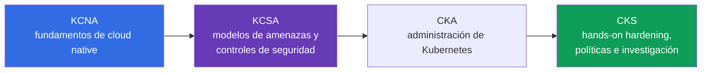
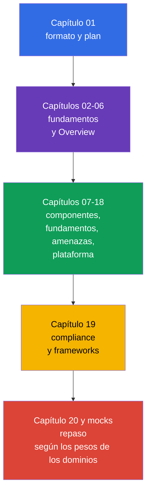

[Русская версия](ru.md) · [Eng version](README.md) · [Version française](fr.md) · [Deutsche Version](de.md) · [ქართული ვერსია](ge.md) · [繁體中文版](tw.md) · [日本語版](jp.md)

# Capítulo 01. Introducción: examen KCSA, formato, escalera de certificaciones y versiones

> **Qué sigue.** KCSA establece un lenguaje común para hablar sobre la seguridad de Kubernetes y cloud native. Este capítulo introductorio no forma parte de un dominio del examen, pero explica qué evalúa exactamente la certificación, cómo leer este curso y por qué KCSA crea una base conceptual, mientras que CKS requiere una preparación práctica posterior mediante CKA.

## 01.1 Qué es KCSA y para quién es

**Kubernetes and Cloud Native Security Associate (KCSA)** es una certificación neutral respecto a proveedores de CNCF y Linux Foundation sobre los fundamentos de seguridad de Kubernetes y cloud native. Es de nivel associate: el examen evalúa la comprensión de modelos, riesgos, límites de responsabilidad y el propósito de los mecanismos de protección, no la capacidad de montar rápidamente un clúster siguiendo instrucciones.

No hay prerrequisitos formales. Es útil diferenciar ya `Pod`, `Deployment`, `Service` y `Namespace`, pero el curso aporta por sí mismo el contexto necesario. KCSA es adecuada para desarrolladores, administradores, DevOps/SRE e ingenieros de seguridad principiantes que necesitan comprender qué riesgos surgen desde el código hasta la infraestructura cloud.

El principal resultado de la preparación no es un conjunto de comandos, sino la capacidad de relacionar una amenaza con un control adecuado. Por ejemplo, la filtración de un token desde un contenedor no se relaciona solo con un `Secret`: es necesario evaluar los permisos de `ServiceAccount`, el acceso a la API, la imagen, la red y las políticas de IAM cloud.

## 01.2 Formato del examen y diferencia con CKS

KCSA es un examen remoto supervisado con preguntas multiple choice. **Según las reglas de Linux Foundation, verificadas el 1 de septiembre de 2026, el examen MCQ estándar contiene 60 preguntas, dura 90 minutos y requiere un 75% para aprobar.** El examen se realiza con proctoring: los requisitos de identificación, espacio de trabajo, navegador y demás condiciones deben comprobarse en las reglas vigentes de Linux Foundation antes del intento.

**Instantánea de las reglas del 2026-09-01.** La matriz oficial de idiomas de Linux Foundation indica que KCSA está disponible solo en inglés. La política de LF para los exámenes multiple choice prohíbe herramientas, materiales de referencia y sitios web externos. Por ello, prepárate de forma práctica: resuelve las formulaciones de las preguntas y todas las opciones de respuesta en inglés, y practica recordar los términos y descartar distractors sin documentación, búsqueda ni notas.

El número de preguntas, la duración, la puntuación de aprobación y otras condiciones organizativas pueden cambiar después de la fecha de la instantánea. Antes de registrarte, vuelve a comprobar la página de KCSA de Linux Foundation, Multiple Choice Exams: Important Instructions/FAQ y Candidate Handbook, en lugar de un resumen antiguo o una prueba de entrenamiento.

| Característica | KCSA | CKS |
|---|---|---|
| Nivel evaluado | conceptos, riesgos y propósito de los controles | aplicación de medidas de protección en el clúster |
| Formato | multiple choice | tareas performance-based |
| Hands-on | no | sí |
| Qué importa en el examen | elegir la explicación o el control más preciso | realizar y verificar un cambio en un entorno Kubernetes |
| Papel en la trayectoria | base conceptual | especialización práctica en seguridad |

En KCSA no es necesario realizar tareas de laboratorio durante el examen. Sin embargo, comprender lo que sucede al configurar RBAC, `NetworkPolicy` o `securityContext` ayuda a descartar opciones de respuesta incorrectas. CKS requiere el siguiente paso: aplicar estos mecanismos con soltura de forma práctica.

## 01.3 Dominios y pesos

El programa LIVE actual de Linux Foundation consta de seis dominios. Sus pesos determinan a qué dedicar tiempo durante el repaso.

| Dominio | Peso | Qué hay que comprender |
|---|---:|---|
| Overview of Cloud Native Security | 14% | modelo 4C, infraestructura cloud, aislamiento, imágenes y código |
| Kubernetes Cluster Component Security | 22% | seguridad del control plane, nodos, red, storage y clientes |
| Kubernetes Security Fundamentals | 22% | authentication, authorization, PSS/PSA, `Secret`, auditoría y segmentación |
| Kubernetes Threat Model | 16% | límites de confianza, flujos de datos y principales categorías de ataques |
| Platform Security | 16% | supply chain, registros, admission control, observability, PKI y connectivity |
| Compliance and Security Frameworks | 10% | compliance, threat modeling, automatización y herramientas de control |
| **Total** | **100%** | **14/22/22/16/16/10** |

Un peso alto no significa que baste con memorizar definiciones. Una pregunta puede describir una situación, por ejemplo un `Pod` privilegiado con acceso al nodo, y la respuesta correcta requerirá relacionar PSS, least privilege y el riesgo de privilege escalation. Por ello, el curso primero construye un modelo general y después analiza los controles por capas y dominios.

## 01.4 Escalera de certificaciones: KCNA → KCSA → CKA → CKS

Las certificaciones se pueden organizar como una secuencia de aumento de profundidad en cloud native security:

- **KCNA** proporciona una base amplia: cloud native, contenedores, Kubernetes, CNCF y prácticas generales. Es útil si necesitas una introducción al ecosistema, pero no sustituye la seguridad de Kubernetes.
- **KCSA** se concentra en la seguridad: cómo está organizada la superficie de ataque, quién es responsable de las distintas capas, qué mecanismos limitan las consecuencias de un incidente y cómo se denominan las amenazas típicas.
- **CKA** desarrolla la práctica de administración de Kubernetes: precisamente CKA es un prerrequisito obligatorio antes de intentar CKS según las reglas de Linux Foundation.
- **CKS** lleva los conocimientos de security a la práctica de hardening e investigación. El curso CKS puede leerse como material adicional, pero no sustituye el requisito de aprobar CKA antes del examen CKS.

Esta es una trayectoria de aprendizaje recomendada, no un requisito formal para KCSA: una persona con experiencia en Kubernetes puede comenzar con KCSA sin KCNA. Después de KCSA, el siguiente paso oficial de certificación Kubernetes es CKA; después es posible CKS.

## 01.5 Cómo está organizado el curso y cómo prepararse

Después de dos capítulos fundamentales, el curso sigue los seis dominios del programa. En cada capítulo se analizan primero el objeto o el riesgo, luego su impacto, el propósito de las medidas de protección y los malentendidos típicos. Las configuraciones detalladas paso a paso no son deliberadamente el objetivo: KCSA evalúa conceptos, y para la práctica en temas especializados hay enlaces posteriores a CKS.

La práctica del curso consiste en preguntas multiple choice al final de los capítulos y mock exams, no en laboratorios. Para la preparación resulta útil este ciclo:

1. Leer el capítulo y formular con tus propias palabras qué amenaza cubre cada control.
2. Responder las preguntas sin pistas y analizar no solo la opción errónea, sino también la razón de su error.
3. Repasar los dominios proporcionalmente a sus pesos: un 22% para component security y fundamentals, no solo los temas más conocidos.
4. Resolver un mock con temporizador, después agrupar los errores por dominios y volver a los capítulos correspondientes.
5. Antes de registrarte, comprobar con Linux Foundation el formato, las reglas de proctoring y la puntuación de aprobación.

## 01.6 Versiones y deriva del programa

Los ejemplos de este curso están orientados a Kubernetes `v1.36`. KCSA es un examen conceptual y version-light, por lo que esta versión es necesaria principalmente para la corrección de los nombres de API e ilustraciones, y no como una promesa sobre la versión del entorno del examen.

El programa también puede cambiar en dos vías independientes. Para el examen real, la estructura y los pesos se toman de la página LIVE de Linux Foundation: actualmente son seis dominios con pesos `14/22/22/16/16/10`. En el repositorio `cncf/curriculum` hay otra edición de seis dominios y pesos diferentes. El curso mantiene la estructura actual de LF, pero incluye los temas coincidentes de ambas ediciones para seguir siendo útil ante una posible transición.

La fecha de comprobación, los pesos actuales, la descripción de la divergencia LF/CNCF y la regla de actualización están fijados en la [política de versiones de KCSA](../../VERSION_POLICY.md). Antes del examen, vuelve a comprobar la fuente primaria: el curso no puede sustituir las condiciones vigentes de Linux Foundation.

## 01.7 Cómo se aplica esto en la práctica

- **Planifican la formación según el riesgo.** El equipo de plataforma relaciona los temas de KCSA con los roles: el desarrollador es responsable de la imagen y el código seguros, el operador del clúster y la red, y el equipo cloud de IAM y los límites de infraestructura.
- **Utilizan una terminología común.** Al analizar un incidente, la frase «este es un problema de la capa Container» o «hay que limitar el blast radius mediante least privilege» hace que la solución sea más concreta que el requisito general de «reforzar la seguridad».
- **No confunden los objetivos de los exámenes.** Las preguntas conceptuales de KCSA se preparan mediante lectura, análisis de escenarios y MCQ (multiple choice question, pregunta de opción múltiple). Las habilidades de CKS se consolidan en un entorno práctico, donde es necesario modificar de forma segura un manifiesto o una configuración reales.
- **Siguen la fuente de verdad.** Antes de contratar, auditar la formación o presentarse al examen, el equipo comprueba las versiones y el programa con LF, y no supone que el peso de un dominio o la puntuación de aprobación no hayan cambiado.

## 01.8 Vocabulario del examen / Miniglosario

| Término | Significado breve |
|---|---|
| KCSA | Kubernetes and Cloud Native Security Associate, certificación conceptual de seguridad cloud native y Kubernetes. |
| KCNA | Kubernetes and Cloud Native Associate, certificación introductoria amplia sobre cloud native. |
| CKS | Certified Kubernetes Security Specialist, certificación práctica performance-based de seguridad Kubernetes. |
| multiple choice | Pregunta con opciones de respuesta en la que se debe elegir la opción más correcta. |
| proctored | Examen con supervisión del cumplimiento de las reglas por parte de un proctor. |
| performance-based | Formato en el que se evalúa una acción práctica realizada en un entorno, y no solo la respuesta seleccionada. |
| version-light | Característica de un examen en el que son fundamentales los conceptos clave, y no la vinculación con una única versión de Kubernetes. |

## 01.9 Aspectos esenciales del examen / Resumen del capítulo

- KCSA es de nivel associate y una base conceptual neutral respecto a proveedores sobre la seguridad de Kubernetes y cloud native.
- En la instantánea del 2026-09-01, KCSA sigue el formato MCQ estándar de LF: 60 preguntas en 90 minutos, con una puntuación de aprobación del 75%; el examen está supervisado por un proctor y no contiene tareas hands-on.
- El número de preguntas, la duración, la puntuación de aprobación, las condiciones de proctoring y las demás reglas organizativas deben volver a comprobarse en los materiales vigentes de Linux Foundation antes del intento.
- El programa LIVE de LF utiliza seis dominios con pesos `14/22/22/16/16/10`.
- KCNA proporciona una base amplia, KCSA conecta la seguridad con las amenazas y los controles, y CKS exige aplicar las medidas en la práctica.
- Los ejemplos de formación usan Kubernetes `v1.36`; LF determina la estructura del curso, y la divergencia con `cncf/curriculum` se sigue en la política de versiones.

## 01.10 No confundir y cómo aparece en el examen

Las preguntas de la parte introductoria suelen evaluar diferencias, no sintaxis. Formulaciones típicas: cuál es el formato de KCSA, qué la distingue de CKS, qué dominio tiene mayor peso, dónde buscar la puntuación de aprobación vigente y por qué la versión del clúster de formación no equivale a la versión del examen.

Trampas de MCQ:

- No confundir KCSA con CKS: KCSA no exige realizar una tarea hands-on en el entorno del examen.
- No presentar una puntuación de aprobación orientativa como un valor oficial inmutable.
- No sustituir los pesos de LF por los pesos de otra revisión de CNCF sin confirmación de LF.
- No considerar KCNA un prerrequisito obligatorio: es una etapa útil, pero no formalmente necesaria.

## 01.11 Preguntas de autoevaluación

### Pregunta 1

¿Qué afirmación describe con mayor precisión el formato de KCSA?

   - a. Es un trabajo de laboratorio en casa sin límite de tiempo ni verificación de identidad.
   - b. Es un examen exclusivamente sobre programación de Kubernetes operators.
   - c. Es un examen multiple choice supervisado sin tareas hands-on.
   - d. Es un examen hands-on en el que hay que configurar un admission controller en un clúster.

Respuesta y explicación

**Respuesta correcta: c.** KCSA evalúa la comprensión conceptual mediante preguntas multiple choice y se realiza con proctoring. Las acciones prácticas en un clúster son características de CKS.

### Pregunta 2

¿Dónde se debe comprobar la puntuación de aprobación exacta antes de intentar el examen KCSA?

   - a. En el README de este curso.
   - b. En la descripción de la versión de Kubernetes `v1.36`.
   - c. En cualquier prueba de entrenamiento antigua.
   - d. En la página vigente de KCSA de Linux Foundation.

Respuesta y explicación

**Respuesta correcta: d.** La puntuación de aprobación y las condiciones del examen pueden cambiar. La página oficial de Linux Foundation es la fuente de verdad.

### Pregunta 3

¿Qué orden refleja mejor el propósito de las certificaciones para una persona que construye una trayectoria desde la base hasta la especialización práctica en seguridad?

   - a. CKS → KCNA → KCSA, porque KCSA consiste solo en práctica.
   - b. CKS → KCSA → KCNA.
   - c. KCSA → KCNA → CKS, porque KCNA requiere CKS.
   - d. KCNA → KCSA → CKA → CKS; CKA es un prerrequisito obligatorio antes de CKS.

Respuesta y explicación

**Respuesta correcta: d.** KCNA proporciona una base cloud native amplia, KCSA se centra en conceptos de seguridad, CKA desarrolla la práctica de administración de Kubernetes y CKS evalúa hands-on security skills. KCNA no es un prerrequisito formal para KCSA, pero CKA es obligatorio antes de intentar CKS.

### Pregunta 4

¿Por qué la estructura de este curso utiliza los pesos `14/22/22/16/16/10`, aunque pueda existir otra edición en `cncf/curriculum`?

   - a. El curso utiliza los pesos LIVE actuales de Linux Foundation y sigue por separado la otra edición de `cncf/curriculum` como una posible deriva del programa.
   - b. Los pesos se calculan automáticamente a partir de la versión baseline de Kubernetes y cambian con cada transición al siguiente minor release.
   - c. Los pesos dividen el tiempo del examen entre tareas hands-on, por lo que no están relacionados con los Domains & Competencies oficiales.
   - d. Los pesos son elegidos por los autores del curso independientemente de Linux Foundation y pueden modificarlos sin cambiar el programa oficial.

Respuesta y explicación

**Respuesta correcta: a.** Para prepararse para el examen real, la estructura del curso sigue la matriz LIVE vigente de Linux Foundation. La edición de `cncf/curriculum` se sigue por separado como fuente de posible deriva, pero por sí misma no sustituye los Domains & Competencies oficiales vigentes.

> **Qué sigue.** Si la base de KCSA ya está clara y necesitas práctica de hardening, políticas e investigación, pasa al curso CKS. El siguiente capítulo de este curso es [Cloud native y por qué la seguridad](../02/es.md).

[Índice](../README_ES.md) · [Capítulo 02](../02/es.md)
