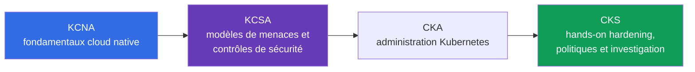
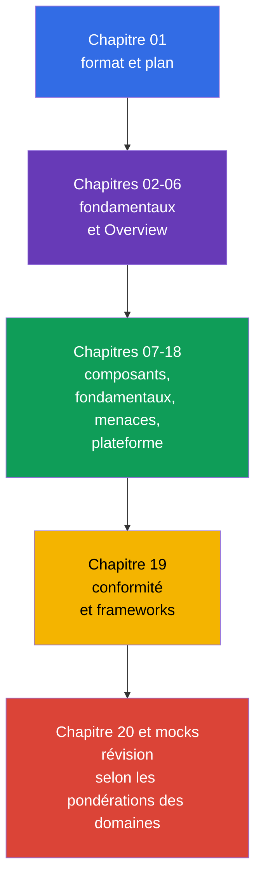

[Русская версия](ru.md) · [Eng version](README.md) · [Versión en español](es.md) · [Deutsche Version](de.md) · [ქართული ვერსია](ge.md) · [繁體中文版](tw.md) · [日本語版](jp.md)

# Chapitre 01. Introduction : examen KCSA, format, parcours des certifications et versions

> **La suite.** KCSA établit un langage commun pour aborder la sécurité Kubernetes et cloud native. Ce chapitre d'introduction ne fait pas partie du domaine de l'examen, mais explique précisément ce que la certification évalue, comment lire ce cours et pourquoi KCSA constitue un socle conceptuel, tandis que CKS exige une préparation pratique ultérieure via CKA.

## 01.1 Qu'est-ce que KCSA et à qui s'adresse-t-elle ?

**Kubernetes and Cloud Native Security Associate (KCSA)** est une certification CNCF et Linux Foundation, indépendante des fournisseurs, portant sur les fondamentaux de la sécurité Kubernetes et cloud native. C'est un niveau associate : l'examen évalue la compréhension des modèles, des risques, des limites de responsabilité et de l'objectif des mécanismes de sécurité, et non la capacité à assembler rapidement un cluster en suivant des instructions.

Il n'y a pas de prérequis formels. Il est utile de déjà distinguer `Pod`, `Deployment`, `Service` et `Namespace`, mais le cours fournit lui-même le contexte nécessaire. KCSA convient aux développeurs, administrateurs, DevOps/SRE et ingénieurs sécurité débutants qui doivent comprendre les risques qui surviennent, du code à l'infrastructure cloud.

Le principal résultat de la préparation n'est pas un ensemble de commandes, mais la capacité à associer une menace au contrôle approprié. Par exemple, la fuite d'un token depuis un conteneur ne concerne pas uniquement `Secret` : il faut évaluer les droits du `ServiceAccount`, l'accès à l'API, l'image, le réseau et les règles IAM du cloud.

## 01.2 Format de l'examen et différence avec CKS

KCSA est un examen à distance surveillé comportant des questions multiple choice. **Selon les règles Linux Foundation vérifiées le 1er septembre 2026, l'examen MCQ standard comprend 60 questions, dure 90 minutes et requiert 75 % pour réussir.** L'examen se déroule avec proctoring : les exigences relatives à la pièce d'identité, à l'espace de travail, au navigateur et les autres conditions doivent être vérifiées dans les règles Linux Foundation en vigueur avant la tentative.

**Instantané des règles au 2026-09-01.** La matrice officielle des langues de Linux Foundation indique uniquement l'anglais pour KCSA. La politique LF pour les examens multiple choice interdit les outils, les documents de référence et les sites externes. Préparez-vous donc de manière pratique : traitez les formulations des questions et toutes les réponses en anglais, entraînez-vous à restituer les termes et à éliminer les distractor sans documentation, recherche ni notes.

Le nombre de questions, la durée, le score de passage et les autres conditions organisationnelles peuvent changer après la date de cet instantané. Avant l'inscription, vérifiez à nouveau la page KCSA de Linux Foundation, Multiple Choice Exams: Important Instructions/FAQ et le Candidate Handbook, plutôt qu'un ancien résumé ou un test d'entraînement.

| Caractéristique | KCSA | CKS |
|---|---|---|
| Niveau évalué | concepts, risques, objectif des contrôles | application de mesures de sécurité dans un cluster |
| Format | multiple choice | exercices performance-based |
| Hands-on | non | oui |
| Élément important à l'examen | choisir l'explication ou le contrôle le plus précis | effectuer et vérifier une modification dans un environnement Kubernetes |
| Rôle dans le parcours | socle conceptuel | spécialisation pratique en sécurité |

Dans KCSA, il n'est pas nécessaire d'effectuer des travaux pratiques pendant l'examen. Toutefois, comprendre ce qui se produit lors de la configuration de RBAC, `NetworkPolicy` ou `securityContext` aide à éliminer les mauvaises réponses. CKS exige l'étape suivante : appliquer ces mécanismes avec assurance.

## 01.3 Domaines et pondérations

Le programme LIVE actuel de Linux Foundation est composé de six domaines. Leurs pondérations déterminent le temps à consacrer à chaque thème lors des révisions.

| Domaine | Poids | Ce qu'il faut comprendre |
|---|---:|---|
| Overview of Cloud Native Security | 14% | modèle 4C, infrastructure cloud, isolation, images et code |
| Kubernetes Cluster Component Security | 22% | sécurité du control plane, des nœuds, du réseau, du storage et des clients |
| Kubernetes Security Fundamentals | 22% | authentication, authorization, PSS/PSA, `Secret`, audit et segmentation |
| Kubernetes Threat Model | 16% | limites de confiance, flux de données et principales catégories d'attaques |
| Platform Security | 16% | supply chain, registres, admission control, observability, PKI et connectivity |
| Compliance and Security Frameworks | 10% | conformité, threat modeling, automatisation et outils de contrôle |
| **Total** | **100%** | **14/22/22/16/16/10** |

Une pondération élevée ne signifie pas qu'il suffit d'apprendre des définitions. Une question peut décrire une situation, par exemple un `Pod` privilégié ayant accès au nœud, et la bonne réponse exigera de relier PSS, least privilege et le risque de privilege escalation. Le cours construit donc d'abord un modèle global, puis examine les contrôles par couches et par domaines.

## 01.4 Parcours des certifications : KCNA → KCSA → CKA → CKS

Les certifications peuvent être placées dans une séquence qui élargit la profondeur dans le domaine de la cloud native security :

- **KCNA** fournit une base générale : cloud native, conteneurs, Kubernetes, CNCF et pratiques communes. Elle est utile lorsqu'une introduction à l'écosystème est nécessaire, mais ne remplace pas la sécurité Kubernetes.
- **KCSA** se concentre sur la sécurité : comment est organisée la surface d'attaque, qui est responsable des différentes couches, quels mécanismes limitent les conséquences d'un incident et comment sont nommées les menaces typiques.
- **CKA** développe la pratique administrative de Kubernetes : CKA est précisément le prérequis obligatoire avant une tentative de CKS selon les règles de Linux Foundation.
- **CKS** transforme les connaissances de sécurité en pratique de hardening et d'investigation. Le cours CKS peut être lu comme matériel complémentaire, mais il ne remplace pas l'exigence de réussir CKA avant l'examen CKS.

Il s'agit d'un parcours de formation recommandé, et non d'une exigence formelle pour KCSA : une personne ayant de l'expérience Kubernetes peut commencer par KCSA sans KCNA. Après KCSA, l'étape officielle suivante de certification Kubernetes est CKA ; ensuite, CKS est possible.

## 01.5 Organisation du cours et préparation

Après deux chapitres fondamentaux, le cours suit les six domaines du programme. Dans chaque chapitre, l'objet ou le risque est d'abord expliqué, puis son impact, l'objectif des mesures de protection et les erreurs d'interprétation typiques. Les configurations détaillées étape par étape ne sont volontairement pas l'objectif : KCSA évalue les concepts et, pour la pratique sur des sujets spécialisés, des liens vers CKS sont fournis.

La pratique du cours consiste en questions multiple choice à la fin des chapitres et en examens blancs, et non en labs. Le cycle suivant est utile pour la préparation :

1. Lire le chapitre et formuler avec ses propres mots quelle menace chaque contrôle atténue.
2. Répondre aux questions sans indices et analyser non seulement la réponse erronée, mais aussi la raison de son erreur.
3. Réviser les domaines proportionnellement aux pondérations : 22 % pour component security et fundamentals, et pas seulement les thèmes les plus familiers.
4. Faire un examen blanc en condition chronométrée, puis regrouper les erreurs par domaine et revenir aux chapitres correspondants.
5. Avant l'inscription, vérifier le format, les règles de proctoring et le score de passage auprès de Linux Foundation.

## 01.6 Versions et dérive du programme

Les exemples de ce cours sont orientés vers Kubernetes `v1.36`. KCSA est un examen conceptuel et version-light ; cette version sert donc surtout à garantir l'exactitude des noms d'API et des illustrations, et non à promettre la version de l'environnement d'examen.

Le programme peut aussi changer selon deux axes indépendants. Pour l'examen réel, la structure et les pondérations proviennent de la page LIVE de Linux Foundation : il s'agit actuellement de six domaines avec les pondérations `14/22/22/16/16/10`. Le dépôt `cncf/curriculum` contient une autre révision comportant six domaines et des pondérations différentes. Le cours conserve la structure LF actuelle, tout en incluant les thèmes communs aux deux révisions afin de rester utile en cas de transition.

La date de vérification, les pondérations actuelles, la description de la divergence LF/CNCF et la règle de mise à jour sont consignées dans la [politique de versions KCSA](../../VERSION_POLICY.md). Avant l'examen, vérifiez à nouveau la source primaire : un cours de formation ne peut pas remplacer les conditions en vigueur de Linux Foundation.

## 01.7 Application en pratique

- **Planifier la formation selon le risque.** L'équipe plateforme associe les thèmes KCSA aux rôles : le développeur est responsable de l'image et du code sécurisés, l'opérateur du cluster et du réseau, et l'équipe cloud de l'IAM et des limites de l'infrastructure.
- **Utiliser une terminologie commune.** Lors d'une discussion sur un incident, la phrase « c'est un problème de la couche Container » ou « il faut limiter le blast radius par le least privilege » rend la décision plus concrète que l'exigence générale de « renforcer la sécurité ».
- **Ne pas confondre les objectifs des examens.** Les questions conceptuelles de KCSA se préparent par la lecture, l'analyse de scénarios et les MCQ (multiple choice question, question à choix de réponse). Les compétences CKS se consolident dans un environnement pratique où il est nécessaire de modifier de manière sécurisée un manifeste ou une configuration réels.
- **Suivre la source de vérité.** Avant un recrutement, un audit de formation ou un examen, l'équipe compare les versions et le programme avec LF, sans supposer que la pondération d'un domaine ou le score de passage n'a pas changé.

## 01.8 Exam vocabulary / Mini-glossaire

| Terme | Signification brève |
|---|---|
| KCSA | Kubernetes and Cloud Native Security Associate, certification conceptuelle portant sur la sécurité cloud native et Kubernetes. |
| KCNA | Kubernetes and Cloud Native Associate, certification générale d'introduction à la cloud native. |
| CKS | Certified Kubernetes Security Specialist, certification pratique performance-based portant sur la sécurité Kubernetes. |
| multiple choice | Question à choix de réponse dans laquelle il faut sélectionner l'option la plus correcte. |
| proctored | Examen dont le respect des règles est contrôlé par un surveillant. |
| performance-based | Format dans lequel une action pratique réalisée dans l'environnement est évaluée, et non uniquement la réponse sélectionnée. |
| version-light | Caractéristique d'un examen où les concepts clés priment sur le lien avec une version unique de Kubernetes. |

## 01.9 Exam Essentials / Points essentiels du chapitre

- KCSA est un niveau associate et un socle conceptuel indépendant des fournisseurs sur la sécurité Kubernetes et cloud native.
- Dans l'instantané du 2026-09-01, KCSA suit le format MCQ standard de LF : 60 questions en 90 minutes, score de passage de 75 % ; l'examen est surveillé par un proctor et ne comporte pas d'exercices hands-on.
- Le nombre de questions, la durée, le score de passage, les conditions de proctoring et les autres règles organisationnelles doivent être vérifiés dans les documents Linux Foundation en vigueur avant la tentative.
- Le programme LIVE de LF utilise six domaines avec les pondérations `14/22/22/16/16/10`.
- KCNA fournit une base générale, KCSA associe la sécurité aux menaces et aux contrôles, CKS exige d'appliquer les mesures en pratique.
- Les exemples pédagogiques utilisent Kubernetes `v1.36` ; LF détermine la structure du cours, et la divergence avec `cncf/curriculum` est suivie dans la politique de versions.

## 01.10 À ne pas confondre et comment cela se présente à l'examen

Les questions de la partie introductive évaluent généralement les différences, et non la syntaxe. Formulations typiques : quel est le format de KCSA, qu'est-ce qui la distingue de CKS, quel domaine a la pondération la plus élevée, où trouver le score de passage actuel, et pourquoi la version du cluster de formation n'est pas la version de l'examen.

Pièges des MCQ :

- Ne pas confondre KCSA avec CKS : KCSA ne requiert pas d'effectuer une tâche hands-on dans l'environnement d'examen.
- Ne pas présenter un score de passage indicatif comme une valeur officielle immuable.
- Ne pas remplacer les pondérations LF par celles d'une autre révision CNCF sans confirmation de LF.
- Ne pas considérer KCNA comme un prérequis obligatoire : c'est une étape utile, mais non formellement nécessaire.

## 01.11 Questions d'auto-évaluation

### Question 1

Quelle affirmation décrit le plus précisément le format KCSA ?

   - a. C'est un travail de laboratoire à domicile sans limite de temps ni vérification d'identité.
   - b. C'est un examen portant uniquement sur la programmation d'operators Kubernetes.
   - c. C'est un examen multiple choice surveillé sans exercices hands-on.
   - d. C'est un examen hands-on dans lequel il faut configurer un admission controller dans le cluster.

Réponse et explication

**Bonne réponse : c.** KCSA évalue la compréhension conceptuelle au moyen de questions multiple choice et se déroule avec proctoring. Les actions pratiques dans un cluster sont caractéristiques de CKS.

### Question 2

Où faut-il vérifier le score de passage exact avant de tenter l'examen KCSA ?

   - a. Dans le README de ce cours.
   - b. Dans la description de la version Kubernetes `v1.36`.
   - c. Dans n'importe quel ancien test d'entraînement.
   - d. Sur la page KCSA actuelle de Linux Foundation.

Réponse et explication

**Bonne réponse : d.** Le score de passage et les conditions d'examen peuvent changer. La page officielle de Linux Foundation est la source de vérité.

### Question 3

Quel ordre reflète le mieux l'objectif des certifications pour une personne qui construit un parcours allant des bases à la spécialisation pratique en sécurité ?

   - a. CKS → KCNA → KCSA, car KCSA ne consiste qu'en pratique.
   - b. CKS → KCSA → KCNA.
   - c. KCSA → KCNA → CKS, car KCNA exige CKS.
   - d. KCNA → KCSA → CKA → CKS ; CKA est un prérequis obligatoire avant CKS.

Réponse et explication

**Bonne réponse : d.** KCNA fournit une base générale cloud native, KCSA se concentre sur les concepts de sécurité, CKA développe la pratique administrative de Kubernetes et CKS évalue les hands-on security skills. KCNA n'est pas un prérequis formel de KCSA, mais CKA est obligatoire avant une tentative de CKS.

### Question 4

Pourquoi la structure de ce cours utilise-t-elle les pondérations `14/22/22/16/16/10`, alors qu'une autre révision peut exister dans `cncf/curriculum` ?

   - a. Le cours utilise les pondérations LIVE actuelles de Linux Foundation, et suit séparément l'autre révision de `cncf/curriculum` comme une dérive possible du programme.
   - b. Les pondérations sont calculées automatiquement à partir de la version baseline de Kubernetes et changent à chaque passage à la minor release suivante.
   - c. Les pondérations répartissent le temps d'examen entre les exercices hands-on ; elles ne sont donc pas liées aux Domains & Competencies officiels.
   - d. Les pondérations sont choisies par les auteurs du cours indépendamment de Linux Foundation et ils peuvent les modifier sans changer le programme officiel.

Réponse et explication

**Bonne réponse : a.** Pour la préparation à l'examen réel, la structure du cours suit la matrice LIVE actuelle de Linux Foundation. La révision de `cncf/curriculum` est suivie séparément comme source de dérive possible, mais ne remplace pas à elle seule les Domains & Competencies officiels actuels.

> **La suite.** Si le socle KCSA est déjà acquis et qu'une pratique de hardening, des politiques et de l'investigation est nécessaire, passez au cours CKS. Le chapitre suivant de ce cours est [Cloud native et pourquoi la sécurité](../02/fr.md).

[Table des matières](../README_FR.md) · [Chapitre 02](../02/fr.md)