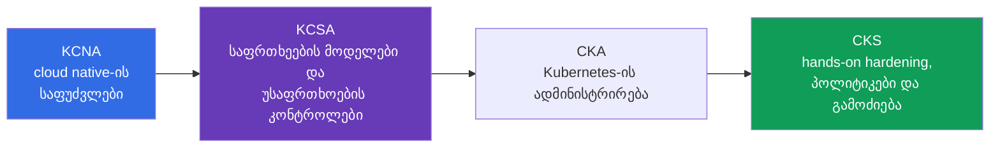
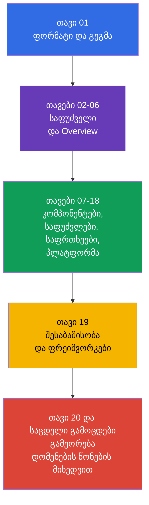

[Русская версия](ru.md) · [Eng version](README.md) · [Versión en español](es.md) · [Version française](fr.md) · [Deutsche Version](de.md) · [繁體中文版](tw.md) · [日本語版](jp.md)

# თავი 01. შესავალი: KCSA გამოცდა, ფორმატი, სერტიფიკაციების საფეხურები და ვერსიები

> **რა არის შემდეგ.** KCSA ქმნის საერთო ენას Kubernetes-ისა და cloud native უსაფრთხოებაზე სასაუბროდ. ეს შესავალი თავი საგამოცდო დომენში არ შედის, თუმცა განმარტავს, კონკრეტულად რას ამოწმებს სერტიფიკაცია, როგორ უნდა წაიკითხოთ ეს კურსი და რატომ ქმნის KCSA კონცეპტუალურ საფუძველს, ხოლო CKS შემდგომ პრაქტიკულ მომზადებას CKA-ს გავლით მოითხოვს.

## 01.1 რა არის KCSA და ვისთვის არის ის საჭირო

**Kubernetes and Cloud Native Security Associate (KCSA)** - CNCF-ისა და Linux Foundation-ის ვენდორულად ნეიტრალური სერტიფიკაცია Kubernetes-ისა და cloud native უსაფრთხოების საფუძვლებში. ეს associate-დონეა: გამოცდა ამოწმებს მოდელების, რისკების, პასუხისმგებლობის საზღვრებისა და დამცავი მექანიზმების დანიშნულების გაგებას და არა ინსტრუქციის მიხედვით კლასტერის სწრაფად აწყობის უნარს.

ფორმალური წინაპირობები არ არსებობს. სასარგებლოა, თუ უკვე განასხვავებთ `Pod`, `Deployment`, `Service` და `Namespace` ობიექტებს, თუმცა კურსი საჭირო კონტექსტს თავად გაწვდით. KCSA განკუთვნილია დეველოპერებისთვის, ადმინისტრატორებისთვის, DevOps/SRE სპეციალისტებისა და უსაფრთხოების დამწყები ინჟინრებისთვის, რომლებსაც სჭირდებათ გაიგონ, რა რისკები წარმოიქმნება კოდიდან ღრუბლოვან ინფრასტრუქტურამდე.

მომზადების მთავარი შედეგი ბრძანებების ნაკრები კი არა, საფრთხის შესაბამის კონტროლთან დაკავშირების უნარია. მაგალითად, კონტეინერიდან ტოკენის გაჟონვა მხოლოდ `Secret`-ს არ ეხება: საჭიროა `ServiceAccount`-ის უფლებების, API-ზე წვდომის, image-ის, ქსელისა და ღრუბლოვანი IAM-ის წესების შეფასება.

## 01.2 გამოცდის ფორმატი და განსხვავება CKS-ისგან

KCSA - დისტანციური, ზედამხედველობის ქვეშ ჩატარებული გამოცდაა multiple choice კითხვებით. **2026 წლის 1 სექტემბერს გადამოწმებული Linux Foundation-ის წესების თანახმად, სტანდარტული MCQ გამოცდა 60 კითხვას შეიცავს, 90 წუთს გრძელდება და ჩასაბარებლად 75%-ს მოითხოვს.** გამოცდა proctoring-ის პირობებში ტარდება: ცდის დაწყებამდე Linux Foundation-ის აქტუალურ წესებში უნდა გადაამოწმოთ პირადობის დამადასტურებელი დოკუმენტის, სამუშაო ადგილისა და ბრაუზერის მოთხოვნები და სხვა პირობები.

**წესების მდგომარეობა 2026-09-01-ისთვის.** Linux Foundation-ის ოფიციალურ ენათა მატრიცაში KCSA-სთვის მხოლოდ ინგლისური ენაა მითითებული. LF-ის პოლიტიკა multiple choice გამოცდებზე კრძალავს ხელსაწყოებს, საცნობარო მასალებსა და გარე საიტებს. ამიტომ პრაქტიკულად მოემზადეთ: კითხვების ფორმულირებები და პასუხის ყველა ვარიანტი ინგლისურად დაამუშავეთ, ივარჯიშეთ ტერმინების გახსენებასა და distractor-ების გამორიცხვაში დოკუმენტაციის, ძიებისა და ჩანაწერების გარეშე.

კითხვების რაოდენობა, ხანგრძლივობა, გამსვლელი ქულა და სხვა საორგანიზაციო პირობები შეიძლება ამ მდგომარეობის თარიღის შემდეგ შეიცვალოს. რეგისტრაციამდე ხელახლა გადაამოწმეთ Linux Foundation-ის KCSA გვერდი, Multiple Choice Exams: Important Instructions/FAQ და Candidate Handbook და არა ძველი კონსპექტი ან სავარჯიშო ტესტი.

| მახასიათებელი | KCSA | CKS |
|---|---|---|
| შემოწმებული დონე | ცნებები, რისკები, კონტროლების დანიშნულება | კლასტერში დამცავი ზომების გამოყენება |
| ფორმატი | multiple choice | performance-based დავალებები |
| Hands-on | არა | დიახ |
| რა არის მნიშვნელოვანი გამოცდაზე | ყველაზე ზუსტი განმარტების ან კონტროლის არჩევა | Kubernetes გარემოში ცვლილების შესრულება და შემოწმება |
| როლი ტრაექტორიაში | კონცეპტუალური საფუძველი | უსაფრთხოების პრაქტიკული სპეციალიზაცია |

KCSA-ზე გამოცდის დროს ლაბორატორიული დავალებების შესრულება საჭირო არ არის. თუმცა იმის გაგება, თუ რა ხდება RBAC-ის, `NetworkPolicy`-ის ან `securityContext`-ის კონფიგურაციისას, მცდარი პასუხების გამორიცხვაში გეხმარებათ. CKS შემდეგ ნაბიჯს მოითხოვს: ამ მექანიზმების ხელით თავდაჯერებულად გამოყენებას.

## 01.3 დომენები და წონები

Linux Foundation-ის მიმდინარე LIVE-პროგრამა ექვსი დომენისგან შედგება. მათი წონები განსაზღვრავს, რამდენი დრო უნდა დაუთმოთ თითოეულს გამეორებისას.

| დომენი | წონა | რა უნდა გესმოდეთ |
|---|---:|---|
| Overview of Cloud Native Security | 14% | 4C მოდელი, ღრუბლოვანი ინფრასტრუქტურა, იზოლაცია, image-ები და კოდი |
| Kubernetes Cluster Component Security | 22% | control plane-ის, კვანძების, ქსელის, storage-ისა და კლიენტების უსაფრთხოება |
| Kubernetes Security Fundamentals | 22% | authentication, authorization, PSS/PSA, `Secret`, აუდიტი და სეგმენტაცია |
| Kubernetes Threat Model | 16% | ნდობის საზღვრები, მონაცემთა ნაკადები და შეტევების ძირითადი კატეგორიები |
| Platform Security | 16% | supply chain, რეესტრები, admission control, observability, PKI და connectivity |
| Compliance and Security Frameworks | 10% | შესაბამისობა, threat modeling, ავტომატიზაცია და კონტროლის საშუალებები |
| **სულ** | **100%** | **14/22/22/16/16/10** |

მაღალი წონა არ ნიშნავს, რომ განსაზღვრებების დაზეპირება საკმარისია. კითხვაში შეიძლება აღწერილი იყოს, მაგალითად, პრივილეგირებული `Pod`, რომელსაც კვანძზე წვდომა აქვს, ხოლო სწორი პასუხისთვის საჭირო გახდეს PSS-ის, least privilege-ისა და privilege escalation-ის რისკის ერთმანეთთან დაკავშირება. ამიტომ კურსი ჯერ საერთო მოდელს ქმნის, შემდეგ კი კონტროლებს შრეებისა და დომენების მიხედვით განიხილავს.

## 01.4 სერტიფიკაციების საფეხურები: KCNA → KCSA → CKA → CKS

სერტიფიკაციები შეიძლება cloud native security-ის სფეროში სიღრმის თანმიმდევრულად გაზრდის სახით განლაგდეს:

- **KCNA** ფართო საფუძველს იძლევა: cloud native, კონტეინერები, Kubernetes, CNCF და საერთო პრაქტიკები. ის სასარგებლოა ეკოსისტემის გასაცნობად, მაგრამ Kubernetes-ის უსაფრთხოებას არ ანაცვლებს.
- **KCSA** უსაფრთხოებაზეა კონცენტრირებული: როგორ არის მოწყობილი შეტევის ზედაპირი, ვინ არის პასუხისმგებელი სხვადასხვა შრეზე, რომელი მექანიზმები ზღუდავს ინციდენტის შედეგებს და როგორ ეწოდება ტიპურ საფრთხეებს.
- **CKA** Kubernetes-ის ადმინისტრაციულ პრაქტიკას ავითარებს: Linux Foundation-ის წესების თანახმად, სწორედ CKA არის სავალდებულო წინაპირობა CKS-ის ცდის დაწყებამდე.
- **CKS** security-ცოდნას hardening-ისა და გამოძიების პრაქტიკაში გარდაქმნის. CKS კურსი შეგიძლიათ დამატებით მასალად წაიკითხოთ, თუმცა ის CKS გამოცდამდე CKA-ს ჩაბარების მოთხოვნას არ ანაცვლებს.

ეს რეკომენდებული სასწავლო ტრაექტორიაა და არა ფორმალური მოთხოვნა KCSA-სთვის: Kubernetes-ის გამოცდილების მქონე ადამიანს შეუძლია KCSA-ით დაიწყოს KCNA-ს გარეშე. KCSA-ს შემდეგ Kubernetes-ის სერტიფიცირების მომდევნო ოფიციალური ნაბიჯი CKA-ა; შემდეგ კი შესაძლებელია CKS.

## 01.5 როგორ არის მოწყობილი კურსი და როგორ უნდა მოემზადოთ

ორი ფუნდამენტური თავის შემდეგ კურსი პროგრამის ექვს დომენს მიჰყვება. თითოეულ თავში ჯერ ობიექტი ან რისკი განიხილება, შემდეგ მისი გავლენა, დამცავი ზომების დანიშნულება და ტიპური მცდარი წარმოდგენები. ღრმა, ეტაპობრივი კონფიგურაციები განზრახ არ წარმოადგენს მიზანს: KCSA კონცეფციებს ამოწმებს, ხოლო პრაქტიკისთვის პროფილურ თემებში მოცემულია შემდგომი ბმულები CKS-ზე.

კურსის პრაქტიკა არის თავების ბოლოს მოცემული multiple choice კითხვები და საცდელი გამოცდები და არა ლაბორატორიული სამუშაოები. მომზადებისთვის სასარგებლოა ასეთი ციკლი:

1. წაიკითხეთ თავი და საკუთარი სიტყვებით ჩამოაყალიბეთ, რომელ საფრთხეს უმკლავდება თითოეული კონტროლი.
2. უპასუხეთ კითხვებს მინიშნებების გარეშე და განიხილეთ არა მხოლოდ მცდარი ვარიანტი, არამედ მისი მცდარობის მიზეზიც.
3. დომენები მათი წონების პროპორციულად გაიმეორეთ: 22-22% component security-სა და fundamentals-ზე და არა მხოლოდ ყველაზე ნაცნობ თემებზე.
4. საცდელი გამოცდა ტაიმერის პირობებში შეასრულეთ, შემდეგ შეცდომები დომენების მიხედვით დააჯგუფეთ და შესაბამის თავებს დაუბრუნდით.
5. რეგისტრაციამდე Linux Foundation-თან გადაამოწმეთ ფორმატი, proctoring-ის წესები და გამსვლელი ქულა.

## 01.6 ვერსიები და პროგრამის ცვლილება

ამ კურსის მაგალითები ორიენტირებულია Kubernetes `v1.36`-ზე. KCSA კონცეპტუალური და version-light გამოცდაა, ამიტომ ეს ვერსია, უპირველეს ყოვლისა, API-ის სახელებისა და ილუსტრაციების სიზუსტისთვის არის საჭირო და არა როგორც საგამოცდო გარემოს ვერსიის დაპირება.

პროგრამა ასევე შეიძლება ორი დამოუკიდებელი მიმართულებით შეიცვალოს. რეალური გამოცდისთვის სტრუქტურა და წონები Linux Foundation-ის LIVE-გვერდიდან უნდა აიღოთ: ამჟამად ეს არის ექვსი დომენი წონებით `14/22/22/16/16/10`. `cncf/curriculum` რეპოზიტორიაში არსებობს სხვა რედაქცია ექვსი დომენითა და განსხვავებული წონებით. კურსი ინარჩუნებს LF-ის აქტუალურ სტრუქტურას, მაგრამ ორივე რედაქციის გადამკვეთ თემებს მოიცავს, რათა შესაძლო გადასვლის შემთხვევაშიც სასარგებლო დარჩეს.

შემოწმების თარიღი, მიმდინარე წონები, LF/CNCF-ის განსხვავების აღწერა და განახლების წესი დაფიქსირებულია [KCSA-ს ვერსიების პოლიტიკაში](../../VERSION_POLICY.md). გამოცდამდე პირველწყარო ხელახლა გადაამოწმეთ: სასწავლო კურსი Linux Foundation-ის აქტუალურ პირობებს ვერ ჩაანაცვლებს.

## 01.7 როგორ გამოიყენება ეს პრაქტიკაში

- **სწავლებას რისკის მიხედვით გეგმავენ.** პლატფორმის გუნდი KCSA-ს თემებს როლებს უკავშირებს: დეველოპერი პასუხისმგებელია უსაფრთხო image-სა და კოდზე, ოპერატორი - კლასტერსა და ქსელზე, ღრუბლოვანი გუნდი - IAM-სა და ინფრასტრუქტურულ საზღვრებზე.
- **საერთო ტერმინოლოგიას იყენებენ.** ინციდენტის განხილვისას ფრაზა „ეს Container შრის პრობლემაა“ ან „blast radius უნდა შეიზღუდოს least privilege-ის საშუალებით“ გადაწყვეტილებას უფრო კონკრეტულს ხდის, ვიდრე ზოგადი მოთხოვნა „უსაფრთხოება გააძლიერეთ“.
- **გამოცდების მიზნებს ერთმანეთში არ ურევენ.** KCSA-ს კონცეპტუალური კითხვებისთვის კითხვით, სცენარების ანალიზითა და MCQ-ებით (multiple choice question, კითხვა პასუხის არჩევით) ემზადებიან. CKS-ის უნარებს პრაქტიკულ გარემოში განამტკიცებენ, სადაც რეალური მანიფესტის ან კონფიგურაციის უსაფრთხოდ შეცვლაა საჭირო.
- **ჭეშმარიტების წყაროს აკვირდებიან.** დაქირავებამდე, სწავლების აუდიტამდე ან გამოცდამდე გუნდი ვერსიებსა და პროგრამას LF-თან ადარებს და არ ვარაუდობს, რომ დომენის წონა ან გამსვლელი ქულა არ შეცვლილა.

## 01.8 Exam vocabulary / მინი-ლექსიკონი

| ტერმინი | მოკლე მნიშვნელობა |
|---|---|
| KCSA | Kubernetes and Cloud Native Security Associate, cloud native-ისა და Kubernetes-ის უსაფრთხოების კონცეპტუალური სერტიფიკაცია. |
| KCNA | Kubernetes and Cloud Native Associate, cloud native-ის ფართო შესავალი სერტიფიკაცია. |
| CKS | Certified Kubernetes Security Specialist, Kubernetes-ის უსაფრთხოების პრაქტიკული performance-based სერტიფიკაცია. |
| multiple choice | კითხვა პასუხის ვარიანტებით, რომელშიც ყველაზე სწორი ვარიანტი უნდა აირჩიოთ. |
| proctored | გამოცდა, რომელზეც წესების დაცვას პროქტორი აკონტროლებს. |
| performance-based | ფორმატი, რომელშიც ფასდება გარემოში შესრულებული პრაქტიკული მოქმედება და არა მხოლოდ არჩეული პასუხი. |
| version-light | გამოცდის მახასიათებელი, რომელშიც მთავარია ძირითადი კონცეფციები და არა Kubernetes-ის ერთ ვერსიაზე მიბმა. |

## 01.9 Exam Essentials / თავის შეჯამება

- KCSA არის associate-დონისა და ვენდორულად ნეიტრალური კონცეპტუალური საფუძველი Kubernetes-ისა და cloud native უსაფრთხოებაში.
- 2026-09-01-ის მდგომარეობით, KCSA მიჰყვება LF-ის სტანდარტულ MCQ ფორმატს: 60 კითხვა 90 წუთში, გამსვლელი ქულა 75%; გამოცდა პროქტორის მეთვალყურეობით ტარდება და hands-on დავალებებს არ შეიცავს.
- კითხვების რაოდენობა, ხანგრძლივობა, გამსვლელი ქულა, proctoring-ის პირობები და დანარჩენი საორგანიზაციო წესები ცდის დაწყებამდე Linux Foundation-ის აქტუალურ მასალებში უნდა გადაამოწმოთ.
- LF-ის LIVE-პროგრამა ექვს დომენს იყენებს წონებით `14/22/22/16/16/10`.
- KCNA ფართო საფუძველს იძლევა, KCSA უსაფრთხოებას საფრთხეებსა და კონტროლებს უკავშირებს, CKS კი ზომების პრაქტიკაში გამოყენებას მოითხოვს.
- სასწავლო მაგალითები Kubernetes `v1.36`-ს იყენებს; კურსის სტრუქტურას LF განსაზღვრავს, ხოლო `cncf/curriculum`-თან განსხვავება ვერსიების პოლიტიკაში კონტროლდება.

## 01.10 არ აგერიოთ და როგორ გვხვდება ეს გამოცდაზე

შესავალი ნაწილის კითხვები, ჩვეულებრივ, განსხვავებებს ამოწმებს და არა სინტაქსს. ტიპური ფორმულირებებია: რა ფორმატი აქვს KCSA-ს, რა განასხვავებს მას CKS-ისგან, რომელ დომენს აქვს უფრო დიდი წონა, სად უნდა მოიძიოთ აქტუალური გამსვლელი ქულა და რატომ არ უდრის სასწავლო კლასტერის ვერსია გამოცდის ვერსიას.

MCQ-ის ხაფანგები:

- არ აგერიოთ KCSA და CKS: KCSA საგამოცდო გარემოში hands-on დავალების შესრულებას არ მოითხოვს.
- საორიენტაციო გამსვლელი ქულა უცვლელ ოფიციალურ მნიშვნელობად არ ჩათვალოთ.
- LF-ის წონები CNCF-ის სხვა რედაქციის წონებით LF-ის დადასტურების გარეშე არ შეცვალოთ.
- KCNA სავალდებულო წინაპირობად არ ჩათვალოთ: ეს სასარგებლო, მაგრამ ფორმალურად არასავალდებულო ეტაპია.

## 01.11 თვითშემოწმების კითხვები

### კითხვა 1

რომელი მტკიცება აღწერს KCSA-ს ფორმატს ყველაზე ზუსტად?

   - a. ეს არის სახლში შესასრულებელი ლაბორატორიული სამუშაო დროის შეზღუდვისა და პირადობის შემოწმების გარეშე.
   - b. ეს არის გამოცდა მხოლოდ Kubernetes operators-ის პროგრამირებაზე.
   - c. ეს არის ზედამხედველობის ქვეშ ჩატარებული multiple choice გამოცდა hands-on დავალებების გარეშე.
   - d. ეს არის hands-on გამოცდა, რომელზეც კლასტერში admission controller უნდა დააკონფიგურიროთ.

პასუხი და განმარტება

**სწორი პასუხია: c.** KCSA კონცეპტუალურ გაგებას multiple choice კითხვებით ამოწმებს და proctoring-ის პირობებში ტარდება. კლასტერში პრაქტიკული მოქმედებები CKS-ისთვის არის დამახასიათებელი.

### კითხვა 2

სად უნდა გადაამოწმოთ ზუსტი გამსვლელი ქულა KCSA გამოცდის ცდის დაწყებამდე?

   - a. ამ კურსის README-ში.
   - b. Kubernetes `v1.36` ვერსიის აღწერაში.
   - c. ნებისმიერ ძველ სავარჯიშო ტესტში.
   - d. Linux Foundation-ის KCSA-ს აქტუალურ გვერდზე.

პასუხი და განმარტება

**სწორი პასუხია: d.** გამსვლელი ქულა და გამოცდის პირობები შეიძლება შეიცვალოს. Linux Foundation-ის ოფიციალური გვერდი ჭეშმარიტების წყაროა.

### კითხვა 3

რომელი თანმიმდევრობა ასახავს უკეთ სერტიფიკაციების დანიშნულებას ადამიანისთვის, რომელიც საფუძვლებიდან უსაფრთხოების პრაქტიკულ სპეციალიზაციამდე ტრაექტორიას აგებს?

   - a. CKS → KCNA → KCSA, რადგან KCSA მხოლოდ პრაქტიკისგან შედგება.
   - b. CKS → KCSA → KCNA.
   - c. KCSA → KCNA → CKS, რადგან KCNA მოითხოვს CKS-ს.
   - d. KCNA → KCSA → CKA → CKS; CKA სავალდებულო წინაპირობაა CKS-მდე.

პასუხი და განმარტება

**სწორი პასუხია: d.** KCNA cloud native-ის ფართო საფუძველს იძლევა, KCSA უსაფრთხოების კონცეფციებზეა ფოკუსირებული, CKA Kubernetes-ის ადმინისტრაციულ პრაქტიკას ავითარებს, ხოლო CKS hands-on security skills-ს ამოწმებს. KCNA არ არის KCSA-ს ფორმალური წინაპირობა, მაგრამ CKA სავალდებულოა CKS-ის ცდის დაწყებამდე.

### კითხვა 4

რატომ იყენებს ამ კურსის სტრუქტურა წონებს `14/22/22/16/16/10`, მიუხედავად იმისა, რომ `cncf/curriculum`-ში შესაძლოა სხვა რედაქცია არსებობდეს?

   - a. კურსი Linux Foundation-ის მიმდინარე LIVE-წონებს იყენებს, ხოლო `cncf/curriculum`-ის სხვა რედაქციას პროგრამის შესაძლო ცვლილებად ცალკე აკვირდება.
   - b. წონები Kubernetes-ის baseline-ვერსიიდან ავტომატურად გამოითვლება და შემდეგ minor release-ზე ყოველი გადასვლისას იცვლება.
   - c. წონები საგამოცდო დროს hands-on დავალებებს შორის ანაწილებს, ამიტომ ისინი ოფიციალურ Domains & Competencies-ს არ უკავშირდება.
   - d. წონებს კურსის ავტორები Linux Foundation-ისგან დამოუკიდებლად ირჩევენ და მათი შეცვლა ოფიციალური პროგრამის ცვლილების გარეშე შეუძლიათ.

პასუხი და განმარტება

**სწორი პასუხია: a.** რეალური გამოცდისთვის მოსამზადებლად კურსის სტრუქტურა Linux Foundation-ის მიმდინარე LIVE-მატრიცას მიჰყვება. `cncf/curriculum`-ის რედაქცია ცალკე კონტროლდება, როგორც შესაძლო ცვლილების წყარო, თუმცა თავისთავად მიმდინარე ოფიციალურ Domains & Competencies-ს არ ანაცვლებს.

> **სად წავიდეთ შემდეგ.** თუ KCSA-ს საფუძველი უკვე გასაგებია და hardening-ის, პოლიტიკებისა და გამოძიების პრაქტიკული დამუშავება გჭირდებათ, გადადით CKS კურსზე. ამ კურსის შემდეგი თავია [Cloud native და რატომ არის უსაფრთხოება მნიშვნელოვანი](../02/ge.md).

[სარჩევი](../README_GE.md) · [თავი 02](../02/ge.md)
