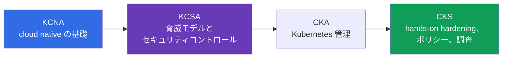
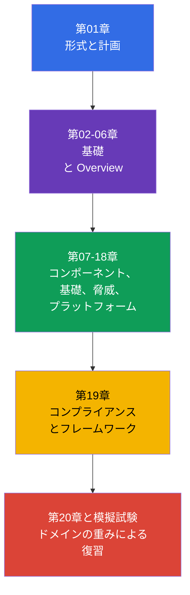

[Русская версия](ru.md) · [Eng version](README.md) · [Versión en español](es.md) · [Version française](fr.md) · [Deutsche Version](de.md) · [ქართული ვერსია](ge.md) · [繁體中文版](tw.md)

# 第01章. はじめに: KCSA 試験、形式、認定の階段、バージョン

> **この先に進む前に。** KCSA は Kubernetes と cloud native のセキュリティを話すための共通言語を提供します。この導入章は試験ドメインには含まれませんが、認定で何が確認されるか、このコースの読み方、そして KCSA が概念的な土台を作り、CKS では CKA を通じた後続の実践的準備が必要となる理由を説明します。

## 01.1 KCSA とは何か、誰に必要か

**Kubernetes and Cloud Native Security Associate (KCSA)** は、Kubernetes および cloud native セキュリティの基礎に関する CNCF と Linux Foundation のベンダー中立な認定です。これは associate レベルであり、試験では手順に従って素早くクラスターを構築する能力ではなく、モデル、リスク、責任境界、防御メカニズムの目的の理解を確認します。

正式な前提条件はありません。`Pod`、`Deployment`、`Service`、`Namespace` をすでに区別できると役立ちますが、コース自体が必要なコンテキストを提供します。KCSA は、コードからクラウドインフラストラクチャまでどのようなリスクが生じるかを理解する必要がある開発者、管理者、DevOps/SRE、初級セキュリティエンジニアに適しています。

学習の主な成果はコマンドの集合ではなく、脅威を適切なコントロールに結び付ける能力です。たとえば、コンテナからのトークン漏洩は `Secret` だけの問題ではありません。`ServiceAccount` の権限、API へのアクセス、イメージ、ネットワーク、クラウド IAM のルールを評価する必要があります。

## 01.2 試験形式と CKS との違い

KCSA は multiple choice の設問による監督付きリモート試験です。**2026 年 9 月 1 日に確認した Linux Foundation の規則によると、標準の MCQ 試験は 60 問、90 分で、合格には 75% が必要です。** 試験は proctoring のもとで実施されます。受験前に、身分証明、作業場所、ブラウザー、その他の条件を最新の Linux Foundation 規則で確認してください。

**2026-09-01 時点の規則のスナップショット。** Linux Foundation の公式言語マトリクスでは、KCSA に対応する言語は英語のみです。multiple choice 試験に関する LF のポリシーは、ツール、参考資料、外部サイトを禁止しています。そのため実践的に準備してください。英語で設問文とすべての回答選択肢を解き、ドキュメント、検索、メモなしで用語を思い出し、distractor を除外する練習をします。

設問数、試験時間、合格点、その他の運営条件は、このスナップショットの日付以降に変更される場合があります。登録前には、古い講義ノートや模擬試験ではなく、KCSA の Linux Foundation ページ、Multiple Choice Exams: Important Instructions/FAQ、Candidate Handbook を再確認してください。

| 特性 | KCSA | CKS |
|---|---|---|
| 確認されるレベル | 概念、リスク、コントロールの目的 | クラスターでの防御策の適用 |
| 形式 | multiple choice | performance-based 課題 |
| Hands-on | なし | あり |
| 試験で重要なこと | 最も正確な説明またはコントロールを選ぶ | Kubernetes 環境で変更を実施し検証する |
| 学習経路での役割 | 概念的な土台 | 実践的なセキュリティ専門化 |

KCSA では、試験中にラボ課題を実施する必要はありません。ただし、RBAC、`NetworkPolicy`、`securityContext` を設定した際に何が起こるかを理解すると、誤った回答選択肢を除外するのに役立ちます。CKS には次の段階が必要です。つまり、これらのメカニズムを自信を持って実際に適用することです。

## 01.3 ドメインと重み

現在の Linux Foundation の LIVE カリキュラムは 6 つのドメインで構成されています。その重みは復習にどれだけ時間を割くべきかを決めます。

| ドメイン | 重み | 理解すべきこと |
|---|---:|---|
| Overview of Cloud Native Security | 14% | 4C モデル、クラウドインフラストラクチャ、分離、イメージ、コード |
| Kubernetes Cluster Component Security | 22% | control plane、ノード、ネットワーク、storage、クライアントのセキュリティ |
| Kubernetes Security Fundamentals | 22% | authentication、authorization、PSS/PSA、`Secret`、監査、セグメンテーション |
| Kubernetes Threat Model | 16% | 信頼境界、データフロー、主要な攻撃カテゴリ |
| Platform Security | 16% | supply chain、レジストリ、admission control、observability、PKI、connectivity |
| Compliance and Security Frameworks | 10% | コンプライアンス、threat modeling、自動化、コントロール手段 |
| **合計** | **100%** | **14/22/22/16/16/10** |

高い重みは、定義を覚えるだけで十分という意味ではありません。たとえば、ノードにアクセスできる特権 `Pod` という状況を設問が示し、正解には PSS、least privilege、privilege escalation のリスクを関連付けることが求められる場合があります。そのため、コースでは最初に全体モデルを構築し、その後にレイヤーとドメインごとにコントロールを説明します。

## 01.4 認定の階段: KCNA → KCSA → CKA → CKS

認定は、cloud native security における理解の深さを段階的に広げる流れとして位置付けられます。

- **KCNA** は cloud native、コンテナ、Kubernetes、CNCF、一般的なプラクティスという広い基礎を提供します。エコシステムの導入が必要な場合に有用ですが、Kubernetes セキュリティの代わりにはなりません。
- **KCSA** はセキュリティに焦点を当てます。攻撃対象領域の仕組み、異なるレイヤーの責任者、インシデントの影響を制限するメカニズム、典型的な脅威の呼び方を扱います。
- **CKA** は Kubernetes 管理の実践を発展させます。Linux Foundation の規則では、CKA が CKS 受験前の必須前提条件です。
- **CKS** は security の知識を hardening と調査の実践に移します。CKS コースは補足資料として読むことができますが、CKS 試験の前に CKA に合格するという要件の代わりにはなりません。

これは KCSA の正式な要件ではなく、推奨される学習経路です。Kubernetes の経験者は KCNA を経ずに KCSA から始められます。KCSA の後の次の公式 Kubernetes 認定ステップは CKA であり、その後 CKS を受験できます。

## 01.5 コースの構成と学習方法

2 つの基礎章の後、コースはカリキュラムの 6 ドメインに従います。各章では最初にオブジェクトまたはリスクを説明し、次にその影響、防御策の目的、典型的な誤解を扱います。詳細な手順ごとの設定は意図的に目的としていません。KCSA は概念を確認する試験であり、実践的な専門トピックについては CKS への参照があります。

コースの実践は、ラボではなく、章末の multiple choice 設問と模擬試験です。準備には次のサイクルが役立ちます。

1. 章を読み、各コントロールがどの脅威に対処するかを自分の言葉で説明する。
2. ヒントなしで設問に答え、誤った選択肢だけでなく、それが誤りである理由も分析する。
3. 重みに比例してドメインを復習する。最も馴染みのあるトピックだけでなく、component security と fundamentals にそれぞれ 22% を割り当てる。
4. タイマーを設定した条件で模擬試験を解き、次に誤りをドメインごとに分類して、対応する章に戻る。
5. 登録前に、形式、proctoring の規則、合格点を Linux Foundation で確認する。

## 01.6 バージョンとカリキュラムの変動

このコースの例は Kubernetes `v1.36` を対象としています。KCSA は概念中心で version-light な試験であるため、このバージョンは主に API 名と例示の正確性のためであり、試験環境のバージョンを保証するものではありません。

カリキュラムも、2 つの独立した経路で変わる可能性があります。実際の試験については、構造と重みを Linux Foundation の LIVE ページから取得します。現在は重み `14/22/22/16/16/10` の 6 ドメインです。`cncf/curriculum` リポジトリには、6 ドメインで重みが異なる別の改訂版があります。コースは最新の LF 構造を維持しますが、将来の移行に備えて両改訂版に共通するトピックを含めています。

確認日、現在の重み、LF/CNCF 間の相違の説明、更新ルールは、[KCSA のバージョンポリシー](../../VERSION_POLICY.md) に記録されています。受験前に一次情報源を再確認してください。学習コースは最新の Linux Foundation 条件の代わりにはなりません。

## 01.7 実務での活用方法

- **リスクに基づいて学習を計画する。** プラットフォームチームは KCSA のトピックを役割に対応付けます。開発者は安全なイメージとコード、運用者はクラスターとネットワーク、クラウドチームは IAM とインフラストラクチャ境界を担います。
- **共通の用語を使う。** インシデントを議論する際、「これは Container レイヤーの問題です」や「least privilege により blast radius を制限する必要があります」という表現は、「セキュリティを強化する」という一般的な要求よりも解決策を具体化します。
- **試験の目的を混同しない。** KCSA の概念的な設問には、読解、シナリオ分析、MCQ (multiple choice question、選択式問題) で備えます。CKS のスキルは、実際のマニフェストまたは設定を安全に変更する必要がある実践環境で定着させます。
- **信頼できる情報源を追跡する。** 採用、学習の監査、試験の前に、チームはドメインの重みや合格点が変わっていないと仮定せず、LF でバージョンとカリキュラムを確認します。

## 01.8 Exam vocabulary / ミニ用語集

| 用語 | 簡潔な意味 |
|---|---|
| KCSA | Kubernetes and Cloud Native Security Associate、cloud native と Kubernetes のセキュリティに関する概念的な認定。 |
| KCNA | Kubernetes and Cloud Native Associate、cloud native に関する広範な導入認定。 |
| CKS | Certified Kubernetes Security Specialist、Kubernetes セキュリティに関する実践的な performance-based 認定。 |
| multiple choice | 最も正しい選択肢を選ぶ回答選択肢付きの設問。 |
| proctored | プロクターによる規則遵守の監督を伴う試験。 |
| performance-based | 回答を選ぶだけでなく、環境内で実施した実践的な行為を評価する形式。 |
| version-light | 一つの Kubernetes バージョンへの固定よりも重要な概念を重視する試験の特性。 |

## 01.9 Exam Essentials / 章の要点

- KCSA は associate レベルで、Kubernetes と cloud native のセキュリティに関するベンダー中立の概念的な土台です。
- 2026-09-01 時点のスナップショットでは、KCSA は標準の LF MCQ 形式に従います。90 分で 60 問、合格点は 75% で、試験はプロクターの監督下にあり hands-on 課題は含まれません。
- 設問数、試験時間、合格点、proctoring 条件、その他の運営規則は、受験前に最新の Linux Foundation 資料で再確認する必要があります。
- LF の LIVE カリキュラムは、重み `14/22/22/16/16/10` の 6 ドメインを使用します。
- KCNA は広い基礎を提供し、KCSA はセキュリティを脅威とコントロールに結び付け、CKS は対策を実践的に適用することを要求します。
- 学習例は Kubernetes `v1.36` を使用します。コースの構造は LF が定め、`cncf/curriculum` との相違はバージョンポリシーで追跡されます。

## 01.10 混同しやすい点と試験での出題

導入部の設問は通常、構文ではなく違いを確認します。典型的な設問は、KCSA の形式、CKS との違い、どのドメインの重みが大きいか、最新の合格点をどこで調べるか、学習クラスターのバージョンが試験のバージョンと同一でない理由を問います。

MCQ の落とし穴:

- KCSA と CKS を混同しない。KCSA では試験環境で hands-on 課題を実施する必要はありません。
- 参考となる合格点を不変の公式値として扱わない。
- LF の確認なしに、LF の重みを別の CNCF 改訂版の重みに置き換えない。
- KCNA を必須前提条件と見なさない。KCNA は有用ですが、正式に必要な段階ではありません。

## 01.11 自己確認のための設問

### 設問 1

KCSA の形式を最も正確に説明しているのはどれですか。

   - a. 時間制限も本人確認もない自宅ラボ課題である。
   - b. Kubernetes operators のプログラミングだけを扱う試験である。
   - c. hands-on 課題を含まない、監督付きの multiple choice 試験である。
   - d. クラスターで admission controller を設定する hands-on 試験である。

回答と解説

**正解: c.** KCSA は multiple choice の設問により概念的な理解を確認し、proctoring のもとで実施されます。クラスター内の実践的な操作は CKS の特徴です。

### 設問 2

KCSA 試験を受ける前に、正確な合格点はどこで確認すべきですか。

   - a. このコースの README。
   - b. Kubernetes `v1.36` のバージョン説明。
   - c. 古い模擬試験のいずれか。
   - d. 最新の KCSA Linux Foundation ページ。

回答と解説

**正解: d.** 合格点と試験条件は変更される可能性があります。公式の Linux Foundation ページが信頼できる情報源です。

### 設問 3

基礎から実践的なセキュリティ専門化までの学習経路を構築する人にとって、認定の目的を最もよく表す順序はどれですか。

   - a. CKS → KCNA → KCSA。KCSA は実践のみで構成されるため。
   - b. CKS → KCSA → KCNA。
   - c. KCSA → KCNA → CKS。KCNA は CKS を必要とするため。
   - d. KCNA → KCSA → CKA → CKS。CKA は CKS 前の必須前提条件である。

回答と解説

**正解: d.** KCNA は広い cloud native の基礎を提供し、KCSA はセキュリティ概念に焦点を当て、CKA は Kubernetes 管理の実践を発展させ、CKS は hands-on security skills を確認します。KCNA は KCSA の正式な前提条件ではありませんが、CKA は CKS 受験前に必須です。

### 設問 4

`cncf/curriculum` に異なる改訂版が存在する場合があるにもかかわらず、このコースの構造が重み `14/22/22/16/16/10` を使用するのはなぜですか。

   - a. コースは現在の Linux Foundation の LIVE 重みを使用し、別の `cncf/curriculum` 改訂版はカリキュラム変動の可能性として別途追跡しているため。
   - b. 重みは Kubernetes の baseline バージョンから自動的に計算され、次の minor release に移るたびに変わるため。
   - c. 重みは hands-on 課題間で試験時間を分割するものであり、公式の Domains & Competencies とは関係がないため。
   - d. 重みは Linux Foundation とは独立してコースの著者が選び、公式カリキュラムを変更せずに変えられるため。

回答と解説

**正解: a.** 実際の試験の準備では、コース構造は現在の Linux Foundation の LIVE マトリクスに従います。`cncf/curriculum` の改訂版は変動の可能性がある情報源として別途追跡されますが、それ自体が現在の公式 Domains & Competencies に取って代わるものではありません。

> **この先。** KCSA の土台を理解し、hardening、ポリシー、調査を実践的に練習する必要がある場合は、CKS コースに進んでください。このコースの次章は [Cloud native とセキュリティが重要な理由](../02/jp.md) です。

[目次](../README_JP.md) · [第02章](../02/jp.md)