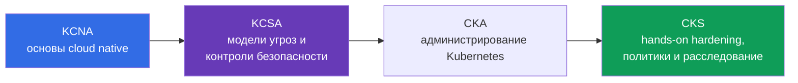
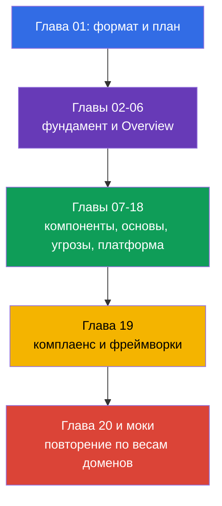

> **Язык:** русский. Переводы будут добавлены после публикации соответствующих файлов.

# Глава 01. Введение: экзамен KCSA, формат, лестница сертификаций и версии

> **Что дальше.** KCSA задаёт общий язык для разговора о безопасности Kubernetes и cloud native. Эта вводная глава не входит в экзаменационный домен, но объясняет, что именно проверяет сертификация, как читать этот курс и почему KCSA создаёт концептуальный фундамент, а CKS требует последующей практической подготовки через CKA.

## 01.1 Что такое KCSA и кому она нужна

**Kubernetes and Cloud Native Security Associate (KCSA)** - вендор-нейтральная сертификация CNCF и Linux Foundation по основам безопасности Kubernetes и cloud native. Это associate-уровень: экзамен проверяет понимание моделей, рисков, границ ответственности и назначения защитных механизмов, а не умение быстро собрать кластер по инструкции.

Формальных пререквизитов нет. Полезно уже различать `Pod`, `Deployment`, `Service` и `Namespace`, но курс даёт необходимый контекст сам. KCSA подходит разработчикам, администраторам, DevOps/SRE и начинающим инженерам по безопасности, которым нужно понять, какие риски возникают от кода до облачной инфраструктуры.

Главный результат подготовки - не набор команд, а способность связать угрозу с подходящим контролем. Например, утечка токена из контейнера относится не только к `Secret`: нужно оценить права `ServiceAccount`, доступ к API, образ, сеть и правила облачного IAM.

## 01.2 Формат экзамена и отличие от CKS

KCSA - контролируемый удалённый экзамен с вопросами multiple choice. Ориентир для подготовки - около 60 вопросов за 90 минут. Экзамен проходит с proctoring: требования к удостоверению личности, рабочему месту, браузеру и разрешённым материалам нужно заранее проверить в актуальных правилах Linux Foundation.

**Снимок правил на 2026-09-01.** Официальная матрица языков Linux Foundation указывает для KCSA только английский язык. Политика LF для экзаменов multiple choice запрещает инструменты, справочные материалы и внешние сайты. Поэтому готовьтесь практически: решайте формулировки вопросов и все варианты ответов на английском, тренируйте воспроизведение терминов и исключение distractor без документации, поиска и заметок. Это не повод угадывать условия регистрации: перед записью перепроверьте их в [странице KCSA Linux Foundation](https://training.linuxfoundation.org/certification/kubernetes-and-cloud-native-security-associate-kcsa/) и актуальном Candidate Handbook.

Проходной балл и точное число вопросов могут меняться. В общей справке LF для multiple choice на дату снимка встречаются ориентиры 90 минут и 75%, но они не заменяют условия конкретной регистрации KCSA. Источник истины перед регистрацией - [страница KCSA Linux Foundation](https://training.linuxfoundation.org/certification/kubernetes-and-cloud-native-security-associate-kcsa/), а не старый конспект или тренировочный тест.

| Характеристика | KCSA | CKS |
|---|---|---|
| Проверяемый уровень | понятия, риски, назначение контролей | применение защитных мер в кластере |
| Формат | multiple choice | performance-based задания |
| Hands-on | нет | да |
| Что важно на экзамене | выбрать наиболее точное объяснение или контроль | выполнить и проверить изменение в среде Kubernetes |
| Роль в траектории | концептуальный фундамент | практическая специализация безопасности |

В KCSA не нужно выполнять лабораторные задания во время экзамена. Однако понимание того, что происходит при настройке RBAC, `NetworkPolicy` или `securityContext`, помогает исключать неверные варианты ответа. CKS требует следующего шага: уверенно применять эти механизмы руками.

## 01.3 Домены и веса

Текущая LIVE-программа Linux Foundation состоит из шести доменов. Их веса определяют, чему уделять время при повторении.

| Домен | Вес | Что нужно понимать |
|---|---:|---|
| Overview of Cloud Native Security | 14% | модель 4C, облачная инфраструктура, изоляция, образы и код |
| Kubernetes Cluster Component Security | 22% | безопасность control plane, узлов, сети, storage и клиентов |
| Kubernetes Security Fundamentals | 22% | authentication, authorization, PSS/PSA, `Secret`, аудит и сегментация |
| Kubernetes Threat Model | 16% | границы доверия, потоки данных и основные категории атак |
| Platform Security | 16% | supply chain, реестры, admission control, observability, PKI и connectivity |
| Compliance and Security Frameworks | 10% | комплаенс, threat modeling, автоматизация и средства контроля |
| **Итого** | **100%** | **14/22/22/16/16/10** |

Высокий вес не означает, что достаточно выучить определения. Вопрос может описать ситуацию, например привилегированный `Pod` с доступом к узлу, а правильный ответ потребует связать PSS, least privilege и риск privilege escalation. Поэтому курс сначала строит общую модель, а затем разбирает контроли по слоям и доменам.

## 01.4 Лестница сертификаций: KCNA → KCSA → CKA → CKS

Сертификации можно расположить как последовательность расширения глубины в области cloud native security:

- **KCNA** даёт широкую базу: cloud native, контейнеры, Kubernetes, CNCF и общие практики. Она полезна, если нужен ввод в экосистему, но не заменяет безопасность Kubernetes.
- **KCSA** концентрируется на безопасности: как устроена поверхность атаки, кто отвечает за разные слои, какие механизмы ограничивают последствия инцидента и как называются типовые угрозы.
- **CKA** развивает административную практику Kubernetes: именно CKA является обязательным пререквизитом перед попыткой CKS по правилам Linux Foundation.
- **CKS** переводит security-знания в практику hardening и расследования. Курс CKS можно читать как дополнительный материал, но он не заменяет требование сдать CKA перед экзаменом CKS.

Это рекомендуемая учебная траектория, а не формальное требование для KCSA: человек с опытом Kubernetes может начать с KCSA без KCNA. После KCSA следующий официальный Kubernetes-сертификационный шаг — CKA; затем возможна CKS.

## 01.5 Как устроен курс и как готовиться

После двух фундаментальных глав курс следует шести доменам программы. В каждой главе сначала разбираются объект или риск, затем его влияние, назначение защитных мер и типичные заблуждения. Глубокие пошаговые настройки намеренно не являются целью: KCSA проверяет концепции, а для практики в профильных темах есть ссылки вперёд на CKS.

Практика курса - это вопросы multiple choice в конце глав и мок-экзамены, а не лабы. Для подготовки полезен такой цикл:

1. Прочитать главу и сформулировать своими словами, какую угрозу закрывает каждый контроль.
2. Ответить на вопросы без подсказок и разобрать не только ошибочный вариант, но и причину его ошибочности.
3. Повторить домены пропорционально весам: по 22% на component security и fundamentals, а не только самые знакомые темы.
4. Решить мок в условиях таймера, затем сгруппировать ошибки по доменам и вернуться к соответствующим главам.
5. Перед регистрацией сверить формат, правила proctoring и проходной балл с Linux Foundation.

## 01.6 Версии и дрейф программы

Примеры в этом курсе ориентированы на Kubernetes `v1.36`. KCSA - концептуальный и version-light экзамен, поэтому эта версия нужна прежде всего для корректности названий API и иллюстраций, а не как обещание версии экзаменационной среды.

Программа также может меняться по двум независимым контурам. Для реального экзамена структуру и веса берут с LIVE-страницы Linux Foundation: сейчас это шесть доменов с весами `14/22/22/16/16/10`. В репозитории `cncf/curriculum` есть другая редакция из шести доменов и других весов. Курс сохраняет актуальную структуру LF, но включает пересекающиеся темы обеих редакций, чтобы оставаться полезным при возможном переходе.

Дата проверки, текущие веса, описание расхождения LF/CNCF и правило обновления зафиксированы в [политике версий KCSA](../../VERSION_POLICY.md). Перед экзаменом проверяйте первоисточник повторно: учебный курс не может заменить актуальные условия Linux Foundation.

## 01.7 Как это применяют на практике

- **Планируют обучение по риску.** Платформенная команда сопоставляет темы KCSA с ролями: разработчик отвечает за безопасный образ и код, оператор - за кластер и сеть, облачная команда - за IAM и инфраструктурные границы.
- **Используют общую терминологию.** При обсуждении инцидента фраза «это проблема слоя Container» или «нужно ограничить blast radius через least privilege» делает решение конкретнее, чем общее требование «усилить безопасность».
- **Не смешивают цели экзаменов.** Концептуальные вопросы KCSA готовят через чтение, анализ сценариев и MCQ. Навыки CKS закрепляют в практической среде, где необходимо безопасно изменить реальный манифест или конфигурацию.
- **Следят за источником истины.** Перед наймом, аудитом обучения или экзаменом команда сверяет версии и программу с LF, а не предполагает, что вес домена или проходной балл не изменился.

## 01.8 Exam vocabulary / Мини-глоссарий

| Термин | Краткое значение |
|---|---|
| KCSA | Kubernetes and Cloud Native Security Associate, концептуальная сертификация по безопасности cloud native и Kubernetes. |
| KCNA | Kubernetes and Cloud Native Associate, широкая вводная сертификация по cloud native. |
| CKS | Certified Kubernetes Security Specialist, практическая performance-based сертификация по безопасности Kubernetes. |
| multiple choice | Вопрос с вариантами ответа, в котором нужно выбрать наиболее корректный вариант. |
| proctored | Экзамен с контролем соблюдения правил со стороны проктора. |
| performance-based | Формат, где оценивается выполненное практическое действие в среде, а не только выбранный ответ. |
| version-light | Характеристика экзамена, в котором ключевы концепции, а не привязка к одной версии Kubernetes. |

## 01.9 Exam Essentials / Итоги главы

- KCSA - associate-уровень и вендор-нейтральный концептуальный фундамент по безопасности Kubernetes и cloud native.
- Экзамен проходит в формате multiple choice, ориентирован примерно на 60 вопросов за 90 минут, контролируется проктором и не содержит hands-on заданий.
- Точный проходной балл, условия proctoring и формат перед попыткой нужно сверять с Linux Foundation.
- LIVE-программа LF использует шесть доменов с весами `14/22/22/16/16/10`.
- KCNA даёт широкую базу, KCSA связывает безопасность с угрозами и контролями, CKS требует применить меры на практике.
- Учебные примеры используют Kubernetes `v1.36`; структуру курса определяет LF, а расхождение с `cncf/curriculum` отслеживается в политике версий.

## 01.10 Не путать и как это встречается на экзамене

Вопросы вводной части обычно проверяют различия, а не синтаксис. Типичные формулировки: какой формат у KCSA, что отличает её от CKS, какой домен имеет больший вес, где искать актуальный проходной балл и почему версия учебного кластера не равна версии экзамена.

Ловушки MCQ:

- Не путать KCSA с CKS: KCSA не требует выполнять hands-on задачу в экзаменационной среде.
- Не выдавать ориентировочный проходной балл за неизменное официальное значение.
- Не менять веса LF на веса другой ревизии CNCF без подтверждения от LF.
- Не считать KCNA обязательным пререквизитом: это полезный, но не формально необходимый этап.

## 01.11 Вопросы для самопроверки

### Вопрос 1

Какое утверждение точнее всего описывает формат KCSA?

- a. Это домашняя лабораторная работа без ограничения времени и проверки личности.
- b. Это экзамен только по программированию Kubernetes operators.
- c. Это контролируемый multiple choice экзамен без hands-on заданий.
- d. Это hands-on экзамен, где нужно настроить admission controller в кластере.

Ответ и разбор

**Верный ответ: c.** KCSA проверяет концептуальное понимание через вопросы multiple choice и проходит с proctoring. Практические действия в кластере характерны для CKS.

### Вопрос 2

Где следует проверить точный проходной балл перед попыткой экзамена KCSA?

- a. В README этого курса.
- b. В описании версии Kubernetes `v1.36`.
- c. В любом старом тренировочном тесте.
- d. На актуальной странице KCSA Linux Foundation.

Ответ и разбор

**Верный ответ: d.** Проходной балл и условия экзамена могут меняться. Официальная страница Linux Foundation является источником истины.

### Вопрос 3

Какой порядок лучше отражает назначение сертификаций для человека, который строит траекторию от базы к практической специализации безопасности?

- a. CKS → KCNA → KCSA, потому что KCSA состоит только из практики.
- b. CKS → KCSA → KCNA.
- c. KCSA → KCNA → CKS, потому что KCNA требует CKS.
- d. KCNA → KCSA → CKA → CKS; CKA is required before attempting CKS.

Ответ и разбор

**Верный ответ: d.** KCNA даёт широкую базу cloud native, KCSA фокусируется на концепциях безопасности, CKA развивает административную практику Kubernetes, а CKS проверяет hands-on security skills. KCNA не является формальным пререквизитом KCSA, но CKA обязателен перед попыткой CKS.

### Вопрос 4

Почему структура этого курса использует веса `14/22/22/16/16/10`, хотя в `cncf/curriculum` может существовать другая редакция?

- a. Это LIVE-веса программы экзамена на странице Linux Foundation, которая является источником истины для экзамена.
- b. Эти числа описывают версию Kubernetes `v1.36`.
- c. Это процент времени, отведённого на hands-on части KCSA.
- d. Их выбирают авторы курса по своему усмотрению.

Ответ и разбор

**Верный ответ: a.** Для структуры и подготовки к реальному экзамену курс следует текущей LIVE-программе LF. Дрейф с редакцией CNCF отслеживается отдельно.

> **Куда дальше.** Если фундамент KCSA уже понятен и нужна практическая отработка hardening, политик и расследования, перейдите к [курсу CKS](../../../cks/course/README_RU.md). Следующая глава этого курса - [Cloud native и почему безопасность](../02/ru.md).

[Оглавление](../README_RU.md) · [Глава 02](../02/ru.md)
