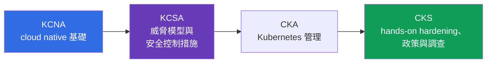
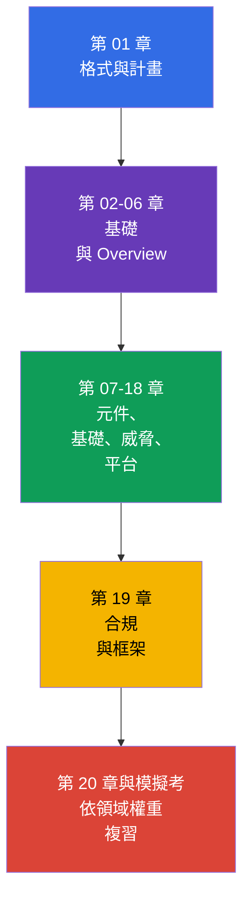

[Русская версия](ru.md) · [Eng version](README.md) · [Versión en español](es.md) · [Version française](fr.md) · [Deutsche Version](de.md) · [ქართული ვერსია](ge.md) · [日本語版](jp.md)

# 第 01 章。導論：KCSA 考試、格式、認證階梯與版本

> **接下來。** KCSA 為討論 Kubernetes 與 cloud native 安全性建立共同語言。本導論章節不屬於考試範圍，但說明此認證實際測驗的內容、如何閱讀本課程，以及為何 KCSA 建立概念基礎，而 CKS 則需要透過 CKA 進行後續實作準備。

## 01.1 什麼是 KCSA，以及它適合誰

**Kubernetes and Cloud Native Security Associate (KCSA)** 是 CNCF 與 Linux Foundation 所提供、針對 Kubernetes 和 cloud native 安全性基礎的供應商中立認證。它屬於 associate 等級：考試測驗的是對模型、風險、責任邊界與防護機制用途的理解，而非依照指示快速組裝叢集的能力。

沒有正式的先決條件。能夠分辨 `Pod`、`Deployment`、`Service` 與 `Namespace` 已經很有幫助，但課程本身會提供必要的脈絡。KCSA 適合開發人員、管理員、DevOps/SRE 與剛入門的安全工程師，他們需要理解從程式碼到雲端基礎架構會產生哪些風險。

準備的主要成果不是一組指令，而是能將威脅連結至適當控制措施的能力。例如，容器中的權杖洩漏不只關乎 `Secret`：還需評估 `ServiceAccount` 權限、API 存取、映像檔、網路及雲端 IAM 規則。

## 01.2 考試格式與 CKS 的差異

KCSA 是受監考的遠端考試，題型為 multiple choice。**依據截至 2026 年 9 月 1 日已核對的 Linux Foundation 規則，標準 MCQ 考試包含 60 題、時長 90 分鐘，通過門檻為 75%。** 考試採用 proctoring：身分證明、工作環境、瀏覽器及其他條件必須在應試前依 Linux Foundation 的最新規則確認。

**截至 2026-09-01 的規則快照。** Linux Foundation 的官方語言矩陣僅將英語列為 KCSA 的考試語言。LF 對 multiple choice 考試的政策禁止使用工具、參考資料和外部網站。因此請務實準備：以英語作答題目表述和所有選項，訓練在沒有文件、搜尋和筆記時重現術語，以及排除 distractor 的能力。

題數、時長、通過分數與其他行政條件可能會在快照日期後變更。註冊前，請重新確認 KCSA Linux Foundation 頁面、Multiple Choice Exams: Important Instructions/FAQ 與 Candidate Handbook，而非依賴舊筆記或模擬測驗。

| 特性 | KCSA | CKS |
|---|---|---|
| 測驗層級 | 概念、風險、控制措施的用途 | 在叢集中套用防護措施 |
| 格式 | multiple choice | performance-based 題目 |
| Hands-on | 否 | 是 |
| 考試重點 | 選出最精確的解釋或控制措施 | 在 Kubernetes 環境中執行並驗證變更 |
| 在學習路徑中的角色 | 概念基礎 | 安全性的實作專精 |

KCSA 考試期間不需要執行實驗作業。不過，理解設定 RBAC、`NetworkPolicy` 或 `securityContext` 時會發生什麼事，有助於排除錯誤答案。CKS 則要求下一步：能自信地親手套用這些機制。

## 01.3 領域與權重

目前 Linux Foundation 的 LIVE 課綱由六個領域組成。其權重決定複習時應投入時間的比例。

| 領域 | 權重 | 需要理解的內容 |
|---|---:|---|
| Overview of Cloud Native Security | 14% | 4C 模型、雲端基礎架構、隔離、映像檔與程式碼 |
| Kubernetes Cluster Component Security | 22% | control plane、節點、網路、storage 與用戶端的安全性 |
| Kubernetes Security Fundamentals | 22% | authentication、authorization、PSS/PSA、`Secret`、稽核與分段 |
| Kubernetes Threat Model | 16% | 信任邊界、資料流及主要攻擊類別 |
| Platform Security | 16% | supply chain、registry、admission control、observability、PKI 與 connectivity |
| Compliance and Security Frameworks | 10% | 合規、threat modeling、自動化與控制工具 |
| **總計** | **100%** | **14/22/22/16/16/10** |

高權重並不表示只要背誦定義就足夠。題目可能描述一個情境，例如可存取節點的特權 `Pod`，而正確答案會要求將 PSS、least privilege 與 privilege escalation 風險連結起來。因此，課程先建立整體模型，再依層級與領域說明控制措施。

## 01.4 認證階梯：KCNA → KCSA → CKA → CKS

可將認證視為 cloud native security 領域深度逐步擴展的序列：

- **KCNA** 提供廣泛基礎：cloud native、容器、Kubernetes、CNCF 與一般實務。若需要進入此生態系統的導論，它很有幫助，但無法取代 Kubernetes 安全性。
- **KCSA** 聚焦於安全性：攻擊面如何構成、誰對不同層級負責、哪些機制可限制事件影響，以及常見威脅如何命名。
- **CKA** 發展 Kubernetes 管理實務：依 Linux Foundation 規則，CKA 正是在嘗試 CKS 前的必要先決條件。
- **CKS** 將 security 知識轉化為 hardening 與調查的實務。CKS 課程可作為補充材料閱讀，但不能取代在參加 CKS 考試前通過 CKA 的要求。

這是建議的學習路徑，而非 KCSA 的正式要求：具有 Kubernetes 經驗的人可不經 KCNA 而從 KCSA 開始。KCSA 之後的下一個官方 Kubernetes 認證步驟是 CKA，接著才可進行 CKS。

## 01.5 課程架構與準備方式

在兩章基礎內容之後，課程依循課綱的六個領域。每章先說明物件或風險，接著探討其影響、防護措施的用途以及典型誤解。刻意不以深入的逐步設定為目標：KCSA 測驗概念，而專業主題的實作可透過指向 CKS 的後續連結進行。

課程的實作是各章末的 multiple choice 題目和模擬考，而不是實驗室。以下循環對準備很有幫助：

1. 閱讀一章，並用自己的話說明每項控制措施處理的是哪一種威脅。
2. 不帶提示地回答問題，並分析不僅是錯誤選項，也要分析它為何錯誤。
3. 依權重按比例複習各領域：component security 與 fundamentals 各占 22%，而非只複習最熟悉的主題。
4. 在計時條件下完成模擬考，然後按領域歸類錯誤並回到對應章節。
5. 註冊前，依 Linux Foundation 核對格式、proctoring 規則與通過分數。

## 01.6 版本與課綱漂移

本課程的範例以 Kubernetes `v1.36` 為準。KCSA 是概念導向且 version-light 的考試，因此此版本主要是為了 API 名稱與說明的正確性，而非對考試環境版本的承諾。

課綱也可能沿兩個獨立方向變更。真實考試的結構與權重取自 Linux Foundation 的 LIVE 頁面：目前是六個領域，權重為 `14/22/22/16/16/10`。儲存庫 `cncf/curriculum` 中另有一個由六個領域和不同權重構成的版本。課程維持最新 LF 架構，但涵蓋兩個版本重疊的主題，以便在可能轉換時仍具實用性。

檢查日期、目前權重、LF/CNCF 差異的說明和更新規則記錄於 [KCSA 版本政策](../../VERSION_POLICY.md)。考試前請再次檢查第一手來源：學習課程無法取代 Linux Foundation 的最新條件。

## 01.7 這在實務中的應用方式

- **依風險規劃學習。** 平台團隊將 KCSA 主題對應至角色：開發人員負責安全映像檔和程式碼，操作人員負責叢集與網路，雲端團隊負責 IAM 與基礎架構邊界。
- **使用共同術語。** 討論事件時，說「這是 Container 層的問題」或「需要透過 least privilege 限制 blast radius」，比籠統要求「加強安全性」更能使解決方案明確。
- **不要混淆考試目標。** KCSA 的概念題透過閱讀、情境分析與 MCQ（multiple choice question，選擇題）準備。CKS 技能則在實作環境中鞏固，該環境需要安全地變更真實的 manifest 或設定。
- **追蹤真實來源。** 招募、訓練稽核或考試前，團隊向 LF 核對版本和課綱，而不假定領域權重或通過分數未曾改變。

## 01.8 Exam vocabulary / 迷你詞彙表

| 術語 | 簡要意義 |
|---|---|
| KCSA | Kubernetes and Cloud Native Security Associate，關於 cloud native 與 Kubernetes 安全性的概念認證。 |
| KCNA | Kubernetes and Cloud Native Associate，廣泛的 cloud native 入門認證。 |
| CKS | Certified Kubernetes Security Specialist，Kubernetes 安全性的實作型 performance-based 認證。 |
| multiple choice | 有多個答案選項，需選出最正確選項的題目。 |
| proctored | 由監考人員監督是否遵守規則的考試。 |
| performance-based | 評估在環境中完成的實作動作，而不僅是所選答案的格式。 |
| version-light | 考試以核心概念為重，而非綁定單一 Kubernetes 版本的特徵。 |

## 01.9 Exam Essentials / 本章重點

- KCSA 是 associate 等級、供應商中立的 Kubernetes 與 cloud native 安全性概念基礎認證。
- 在 2026-09-01 的快照中，KCSA 遵循標準 LF MCQ 格式：90 分鐘 60 題，通過分數為 75%；考試由監考人員控制，且不含 hands-on 題目。
- 應試前必須在 Linux Foundation 最新資料中重新確認題數、時長、通過分數、proctoring 條件與其他行政規則。
- LF 的 LIVE 課綱使用六個領域，權重為 `14/22/22/16/16/10`。
- KCNA 提供廣泛基礎，KCSA 將安全性與威脅及控制措施連結，而 CKS 則要求在實務中套用措施。
- 學習範例使用 Kubernetes `v1.36`；課程結構由 LF 決定，並在版本政策中追蹤與 `cncf/curriculum` 的差異。

## 01.10 不要混淆的概念，以及在考試中如何出現

導論部分的題目通常測驗差異，而不是語法。典型問法包括：KCSA 使用何種格式、它與 CKS 有何不同、哪個領域權重較高、在哪裡尋找最新通過分數，以及為何學習叢集版本不等於考試版本。

MCQ 陷阱：

- 不要混淆 KCSA 與 CKS：KCSA 不要求在考試環境中完成 hands-on 工作。
- 不要將參考性的通過分數當作不變的官方數值。
- 未經 LF 確認，不要將 LF 權重替換為另一個 CNCF 修訂版的權重。
- 不要認為 KCNA 是必要先決條件：它有幫助，但不是正式必須的階段。

## 01.11 自我檢查問題

### 問題 1

哪個陳述最精確地描述 KCSA 的格式？

   - a. 這是沒有時間限制和身分驗證的居家實驗室作業。
   - b. 這是只針對 Kubernetes operators 程式設計的考試。
   - c. 這是沒有 hands-on 題目的受監考 multiple choice 考試。
   - d. 這是 hands-on 考試，需要在叢集中設定 admission controller。

答案與說明

**正確答案：c。** KCSA 透過 multiple choice 題目測驗概念理解，並採用 proctoring。叢集中的實作操作是 CKS 的特徵。

### 問題 2

在嘗試 KCSA 考試前，應在哪裡確認確切的通過分數？

   - a. 在本課程的 README 中。
   - b. 在 Kubernetes `v1.36` 的版本說明中。
   - c. 在任何一份舊的模擬測驗中。
   - d. 在最新的 KCSA Linux Foundation 頁面上。

答案與說明

**正確答案：d。** 通過分數和考試條件可能變更。Linux Foundation 官方頁面是真實來源。

### 問題 3

對於從基礎到安全性實作專精建立學習路徑的人，哪一個順序最能反映認證的目的？

   - a. CKS → KCNA → KCSA，因為 KCSA 完全由實作組成。
   - b. CKS → KCSA → KCNA。
   - c. KCSA → KCNA → CKS，因為 KCNA 要求 CKS。
   - d. KCNA → KCSA → CKA → CKS；CKA 是 CKS 前的必要先決條件。

答案與說明

**正確答案：d。** KCNA 提供廣泛的 cloud native 基礎，KCSA 聚焦於安全性概念，CKA 發展 Kubernetes 管理實務，而 CKS 測驗 hands-on security skills。KCNA 並非 KCSA 的正式先決條件，但在嘗試 CKS 前必須具備 CKA。

### 問題 4

為何本課程結構使用 `14/22/22/16/16/10` 權重，儘管 `cncf/curriculum` 可能存在另一個版本？

   - a. 課程使用目前 Linux Foundation 的 LIVE 權重，並將 `cncf/curriculum` 的另一版本另行追蹤為可能的課綱漂移。
   - b. 權重會由 Kubernetes 的 baseline 版本自動計算，並在每次轉移至下一個 minor release 時變更。
   - c. 權重將考試時間分配給 hands-on 題目，因此與官方 Domains & Competencies 無關。
   - d. 權重由課程作者獨立於 Linux Foundation 選定，且可在不變更官方課綱時加以修改。

答案與說明

**正確答案：a。** 為準備真實考試，課程結構遵循目前 Linux Foundation 的 LIVE 矩陣。`cncf/curriculum` 版本會作為可能課綱漂移的來源另行追蹤，但其本身不會取代目前官方的 Domains & Competencies。

> **接下來前往。** 若您已理解 KCSA 基礎，且需要實作 hardening、政策和調查的練習，請前往 CKS 課程。本課程的下一章是 [Cloud native 及其安全性原因](../02/tw.md)。

[目錄](../README_TW.md) · [第 02 章](../02/tw.md)
