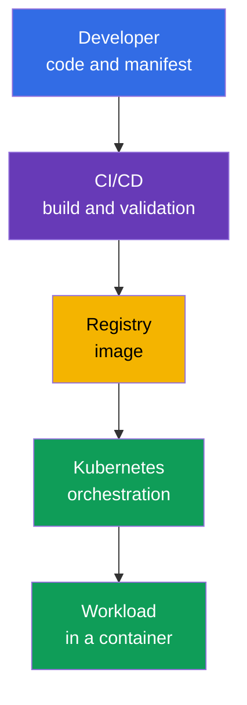
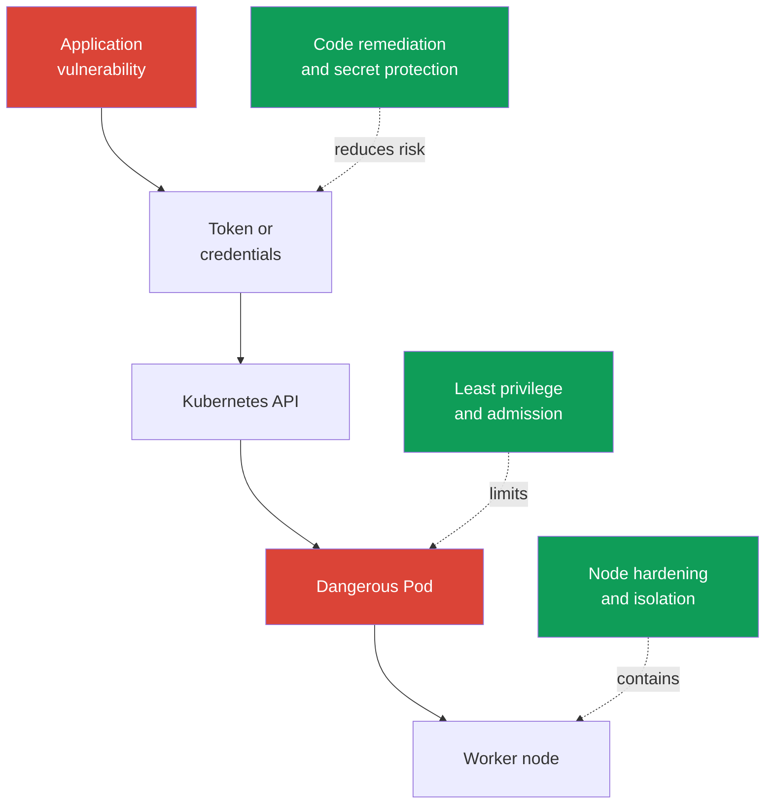

[Русская версия](ru.md) · [Versión en español](es.md) · [Version française](fr.md) · [Deutsche Version](de.md) · [ქართული ვერსია](ge.md) · [繁體中文版](tw.md) · [日本語版](jp.md)

# Chapter 02. Cloud native and why security matters

> **What is next.** KCSA views security not as a standalone product, but as a property of the entire application delivery and runtime system. Cloud native accelerates changes through containers, orchestration, and automation, but also expands the number of trust boundaries. This chapter establishes the overall framework for the following course topics and for the **Overview of Cloud Native Security** domain (14%).

## 02.1. What cloud native is and the CNCF ecosystem

**Cloud native** is an approach to developing and operating applications in which a system is designed to run flexibly in cloud or distributed infrastructure. Applications are split into small, independently deliverable parts, packaged in containers, and managed through automation.

CNCF (Cloud Native Computing Foundation) develops open projects and practices in this landscape. Kubernetes is one such project: it manages containerized workloads, but it does not replace security for images, code, cloud credentials, or the network.

| Cloud native idea | What it provides | What changes for security |
|---|---|---|
| Containers | a reproducible package of an application and its dependencies | the image becomes an artifact that must be built, checked, and obtained from a trusted registry |
| Orchestration | automated placement, scaling, and recovery of workloads | the Kubernetes API, `ServiceAccount`, `Pod`, network, and nodes become control points |
| Microservices | independent teams and frequent delivery | the number of services, API calls, secrets, and network paths increases |
| Declarative management | the desired state is described in YAML or other configuration code | manifests, Git, and CI/CD become part of the supply chain and require validation |

Declarative management is especially important. A team describes the desired `Deployment`, and the Kubernetes controller brings the actual state into line with that description. Therefore, an insecure setting in a manifest can be reproduced repeatedly during every rollout. Security must check not only an already running container, but also changes before they are applied.

The diagram has no single point after which security is "finished." Compromise of source code, CI/CD, a registry, or Kubernetes can result in a malicious workload being run. The following chapters break this system down into layers and specific controls.

CNCF currently advances this area through the **TAG Security and Compliance** (Technical Advisory Group for Security and Compliance). In the current CNCF structure, the former **TAG-Security** is archived. One key resource created by the former TAG-Security is the **Cloud Native Security Whitepaper**; it describes an artifact security lifecycle through four stages: **Develop → Distribute → Deploy → Runtime**. At the associate level, the important idea is that controls are built into every delivery stage rather than added only at the end. The document's exact version number is not relevant to the exam.

The CNCF ecosystem classifies projects by maturity level: **Sandbox** (an early or experimental stage) → **Incubating** (growing adoption and project maturity) → **Graduated** (high maturity, sustainable governance, and demonstrated production adoption).

As of the current date, Falco, Open Policy Agent (OPA), Kyverno, and Cilium have CNCF Graduated status, so they are convenient examples in the course of mature cloud-native implementations of runtime detection, policy-as-code, and networking/security.

However, **Graduated does not mean an "official industry standard" and does not guarantee that KCSA will test a particular product**. For the exam, first remember the competency and control boundary: runtime detection, admission/policy engine, container networking, observability, and so on. A specific tool is an example implementation of that function.

A project's maturity level can change, so verify its current status on the [CNCF projects page](https://www.cncf.io/projects/) before using it in a real architecture.

## 02.2. Why security is critical

Cloud native shortens the path from a code change to production. This is useful, but an error spreads just as quickly: a single incorrect `Deployment` template, a token in a CI variable, or a publicly accessible registry can reach many environments within minutes.

The dynamic nature of Kubernetes adds specific characteristics:

- A `Pod` is usually short-lived. An investigation must not rely only on the filesystem of a vanished container - auditing, logs, and a verifiable delivery history are important.
- Workloads are automatically scaled and recreated. A dangerous declaration is reproduced by the controller until its source is fixed.
- Multiple teams and services use shared infrastructure. An error in permissions or network isolation can enable movement from one service to another.
- Management happens through an API. Credentials, access rights, and admission checks affect the entire cluster attack surface.

Security does not conflict with delivery speed. The goal is to make the secure path standard and automated: build minimal images, check dependencies, apply minimal permissions, and reject clearly dangerous configurations before production. Manual review of every change does not scale, while repeatable controls in CI/CD and Kubernetes scale together with delivery.

## 02.3. The cloud native attack surface

The **attack surface** is the set of points through which an attacker can gain access, execute code, escalate privileges, or extract data. In cloud native, it begins before the cluster and does not end at the container boundary.

| Area | Typical risk | Example control |
|---|---|---|
| Image | vulnerable library, secret in an image layer, unverified provenance | scanning, minimal image, immutable digest, signature |
| Runtime | a process receives excessive Linux capabilities or attempts to escape to the host | `securityContext`, seccomp, non-root, sandbox runtime |
| Cluster | overly broad permissions, an insecure `Pod`, exposed control plane component | RBAC, Pod Security Admission, TLS, audit logging |
| Cloud and infrastructure | stolen IAM credentials, access to the metadata service, unprotected worker node | least privilege in IAM, IMDS restriction, OS hardening, network perimeter |
| Supply chain | tampering with code, dependencies, CI/CD, or an artifact | review, SCA, isolated build, SBOM, signature verification |

A container is not a complete security boundary. If a `Pod` receives a token with excessive permissions, access to the metadata service, or mounts a container runtime socket, even a correctly built image does not eliminate the risk. Conversely, a strict Kubernetes policy will not fix a malicious dependency already included in an image.

It is useful to think in scenarios rather than isolated tools. For example, an attacker can exploit a web application vulnerability, read a `ServiceAccount` token, call the Kubernetes API, and create a privileged `Pod`. Different controls break the chain: secure code, restricted token permissions, admission policy, and node protection.

## 02.4. Core security principles

These principles help you choose the correct answer in an MCQ (multiple choice question) and evaluate an architectural decision. They are not a single specific Kubernetes object: one principle is usually implemented through several controls.

### Defense in depth

**Defense in depth** means several independent layers of protection. If one control fails, the next limits the consequences. For example, image scanning does not guarantee the absence of a vulnerability, so it is complemented by non-root execution, `NetworkPolicy`, RBAC, and monitoring.

An incorrect conclusion is: "several layers mean that each can be weakened." On the contrary, layers must compensate for different failures. Restricting `ServiceAccount` permissions cannot be replaced by one antivirus product or image scanner.

### Least privilege

**Least privilege** means that a subject receives only the permissions needed for a specific task, for the minimum necessary time. A subject can be a user, `ServiceAccount`, cloud role, container process, or CI/CD.

Examples: a `Role` in one `Namespace` instead of a cluster-wide `ClusterRoleBinding`; `capabilities.drop: ["ALL"]` with targeted restoration of a required capability; a cloud role with access to one resource instead of administrative permissions. Least privilege reduces damage if credentials or a process are compromised.

### Zero trust

**Zero trust** means not considering a request trusted solely because of its location on the network, its `Namespace` name, or membership in a cluster. Every access request must rely on a verifiable identity, authentication, authorization, and policy context.

In Kubernetes, this means that internal traffic should not automatically be considered secure. `NetworkPolicy`, mTLS, `ServiceAccount`, and RBAC help verify who is accessing a resource and what they are allowed to do. Zero trust does not mean "trust no one at all" - it is the rejection of implicit trust.

### Immutability

**Immutability** means that the runtime environment is not changed manually after delivery; instead, a new verifiable artifact is created and a new version is deployed. An image with a digest, a declarative manifest, and Git history make it possible to understand exactly what is running.

If you fix a container with the `kubectl exec` command, the change disappears after the `Pod` is recreated and will not be part of reproducible delivery. The correct path is to change the code or manifest, rebuild and check the artifact, then perform a rollout. Immutability makes rollback and investigation easier, but does not remove the need to store secrets separately from the image.

### Shared responsibility

**Shared responsibility** means that protection duties are distributed between the infrastructure provider and the platform user. In managed Kubernetes, the provider may be responsible for part of the control plane, but the user remains responsible for IAM, workload configuration, data, permissions, and network rules. In a self-managed cluster, the team's area of responsibility is usually broader.

The exact boundary depends on the service and agreement. Therefore, do not assume that managed Kubernetes automatically protects everything inside the cluster. The model is examined in detail in chapter 04.

## 02.5. How this is applied in practice

- The team makes the secure path standard: `Deployment` templates use non-root execution, images come from approved registries, and CI/CD checks dependencies and configuration before merge.
- Permissions are granted to separate identities. One `ServiceAccount` for all applications and an administrator cloud role "just in case" contradict least privilege.
- Controls are placed throughout the chain: code and dependency protection, build validation, image verification, admission in the cluster, runtime restrictions, and event observation.
- Production changes go through Git and a declarative rollout. Manual repair of a live `Pod` is suitable for diagnosis, but not as permanent delivery.
- When investigating an incident, determine not only the vulnerability, but also which layers should have stopped it: this shows where to strengthen defense in depth.

## 02.6. Exam vocabulary / Mini-glossary

- **cloud native** - an approach to creating and operating applications with containers, automation, and distributed infrastructure.
- **CNCF** - Cloud Native Computing Foundation, a foundation and ecosystem of cloud native projects.
- **attack surface** - all points through which unauthorized access, code execution, or data acquisition is possible.
- **defense in depth** - several independent layers of protection.
- **least privilege** - granting only the minimum permissions required.
- **zero trust** - no implicit trust in a request based on its location on the network or membership in a system.
- **immutability** - delivering new verifiable artifacts instead of manually changing an already running environment.
- **shared responsibility** - distribution of protection duties between a provider and a user.
- **supply chain** - the delivery chain from source code and dependencies to running an artifact.

## 02.7. Exam Essentials / Chapter summary

- Cloud native combines containers, orchestration, microservices, and declarative management; each element creates its own control points.
- Fast and automated delivery requires automated security checks, otherwise an error reaches production just as quickly.
- The attack surface includes the image, runtime, cluster, cloud infrastructure, and supply chain.
- Container security depends not only on its isolation: access permissions, the network, tokens, node protection, and artifact provenance must also be considered.
- Defense in depth, least privilege, zero trust, immutability, and shared responsibility provide the common framework for all subsequent KCSA topics.

## 02.8. Do not confuse these, and how they appear on the exam

On KCSA, questions usually assess the purpose of a principle or the choice of a control for a situation. Carefully distinguish similar wording:

- several different controls against one attack chain - defense in depth;
- only the required permissions for a `ServiceAccount`, IAM role, or process - least privilege;
- checking identity and policy even for an internal request - zero trust;
- a new image by digest instead of changing a running container - immutability;
- division of duties between a managed service and the user - shared responsibility.

A typical exam trap is to assume that one strong tool replaces all others. An image scanner, RBAC, and encryption solve different parts of the problem and usually complement one another.

## 02.9. Self-assessment questions

### 1. Which statement best describes Kubernetes declarative management from a security perspective?

   - a. Containers automatically become trusted after starting.
   - b. `kubectl exec` records a change in the source manifest.
   - c. Declarative management eliminates the need for CI/CD.
   - d. An insecure configuration in a manifest can be automatically reproduced during a rollout.

Answer and explanation

**Correct answer: d.** Controllers bring the actual state into line with the described state. Therefore, an incorrect template repeatedly creates insecure workloads until the configuration source is changed.

### 2. Which combination best illustrates defense in depth for an application in Kubernetes?

   - a. One shared `Namespace` without network restrictions.
   - b. Dependency checking, restricted `ServiceAccount` permissions, admission policy, and `NetworkPolicy`.
   - c. Only image scanning before publication.
   - d. Only an administrator `ClusterRoleBinding` for the operations team.

Answer and explanation

**Correct answer: b.** These are independent controls at different stages and layers. Each reduces the likelihood or impact of another failure.

### 3. A developer needs read-only access to `ConfigMap` in one `Namespace`. Which solution follows least privilege?

   - a. Create a `ClusterRoleBinding` with `cluster-admin` so the developer can read ConfigMap in any namespace without additional restrictions.

   - b. Create a Role in the required namespace, but grant it `create`, `update`, `delete`, and `patch` for ConfigMap.

   - c. Create a Role in the required namespace with only the necessary read verbs for ConfigMap and bind it to the developer's identity.

   - d. Add Linux capabilities to the developer on the worker node so those host privileges replace Kubernetes API authorization.

Answer and explanation

**Correct answer: c.** Least privilege restricts API permissions to the required resource, actions, and minimum scope. Cluster-wide `cluster-admin` is far broader than the requirement, write verbs do not match a read-only task, and Linux capabilities do not grant Kubernetes API permissions.

### 4. What is an example of immutability when remediating a defect in production?

   - a. Disable admission checks so that a new `Pod` starts faster.
   - b. Delete logs to avoid retaining the old state.
   - c. Fix the source code or manifest, build a new verifiable image, and perform a rollout.
   - d. Change files in a running container using `kubectl exec` and leave the `Pod` running.

Answer and explanation

**Correct answer: c.** The change becomes part of a reproducible supply chain and can be checked or rolled back. A manual change to a live container is temporary and does not leave a correct artifact.

> **Where next.** The Cloud, Cluster, Container, and Code layer model is examined at a practical level in CKS chapter 02. In this course, continue with [chapter 03](../03/README.md), where the 4C model is shown as a unified cloud native security model.

---
[Table of contents](../README.md) · [Chapter 01](../01/README.md) · [Chapter 03](../03/README.md)