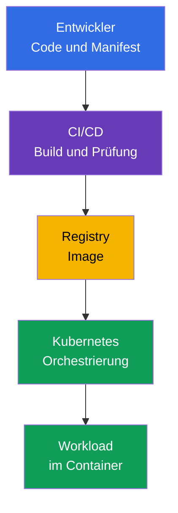
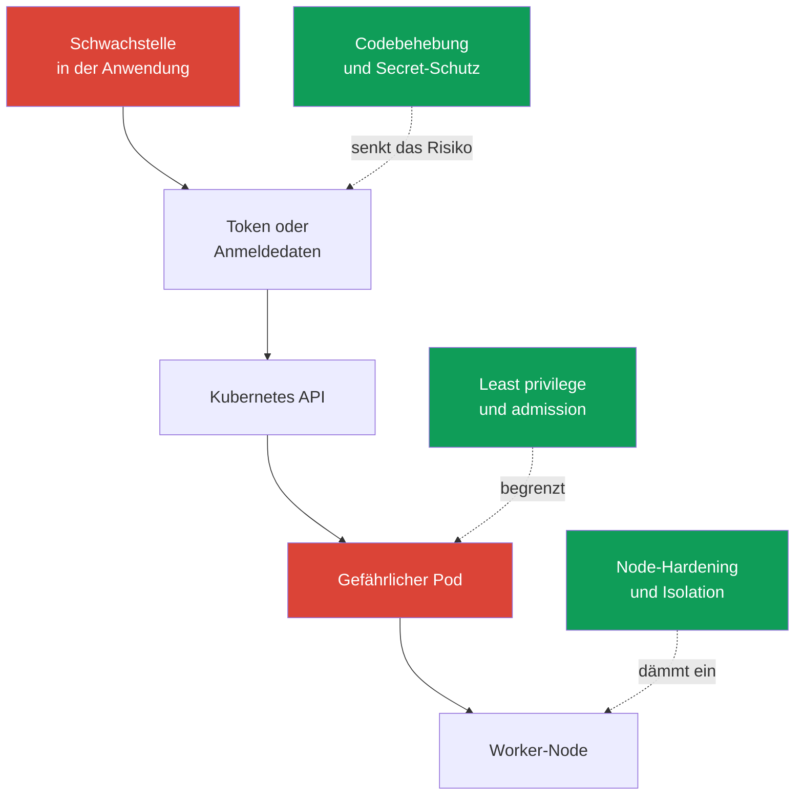

[Русская версия](ru.md) · [Eng version](README.md) · [Versión en español](es.md) · [Version française](fr.md) · [ქართული ვერსია](ge.md) · [繁體中文版](tw.md) · [日本語版](jp.md)

# Kapitel 02. Cloud native und warum Sicherheit wichtig ist

> **Wie geht es weiter?** KCSA betrachtet Sicherheit nicht als separates Produkt, sondern als Eigenschaft des gesamten Prozesses zur Bereitstellung und Ausführung von Anwendungen. Cloud native beschleunigt Änderungen durch Container, Orchestrierung und Automatisierung, erweitert jedoch zugleich die Anzahl der Vertrauensgrenzen. Dieses Kapitel schafft den allgemeinen Rahmen für die folgenden Kursthemen und die Domain **Overview of Cloud Native Security** (14%).

## 02.1. Was cloud native und das CNCF-Ökosystem sind

**Cloud native** ist ein Ansatz zur Entwicklung und zum Betrieb von Anwendungen, bei dem ein System für den flexiblen Betrieb in einer Cloud- oder verteilten Infrastruktur entworfen wird. Die Anwendung wird in kleine, unabhängig bereitstellbare Komponenten aufgeteilt, in Container verpackt und durch Automatisierung verwaltet.

Die CNCF (Cloud Native Computing Foundation) entwickelt Open-Source-Projekte und Praktiken für diese Landschaft. Kubernetes ist eines dieser Projekte: Es verwaltet containerisierte Workloads, ersetzt jedoch nicht die Sicherheit von Images, Code, Cloud-Anmeldedaten oder Netzwerken.

| Cloud-native-Idee | Welchen Nutzen sie bringt | Was sich für die Sicherheit ändert |
|---|---|---|
| Container | reproduzierbares Paket aus Anwendung und Abhängigkeiten | Das Image wird zu einem Artefakt, das erstellt, geprüft und aus einer vertrauenswürdigen Registry bezogen werden muss |
| Orchestrierung | automatische Platzierung, Skalierung und Wiederherstellung von Workloads | Kubernetes API, `ServiceAccount`, `Pod`, Netzwerk und Nodes werden zu Kontrollpunkten |
| Microservices | unabhängige Teams und häufige Bereitstellungen | Die Anzahl von Services, API-Aufrufen, Secrets und Netzwerkpfaden steigt |
| Deklarativität | Der gewünschte Zustand wird in YAML oder anderem Konfigurationscode beschrieben | Manifeste, Git und CI/CD werden Teil der Supply Chain und müssen geprüft werden |

Deklarativität ist besonders wichtig. Ein Team beschreibt den gewünschten `Deployment`, und ein Kubernetes-Controller gleicht den tatsächlichen Zustand an den beschriebenen an. Daher kann eine unsichere Einstellung in einem Manifest bei jedem rollout wiederholt reproduziert werden. Sicherheit muss nicht nur einen bereits laufenden Container, sondern auch Änderungen vor ihrer Anwendung prüfen.

Das Diagramm enthält keinen einzelnen Punkt, nach dem Sicherheit „abgeschlossen“ wäre. Eine Kompromittierung von Quellcode, CI/CD, Registry oder Kubernetes kann zur Ausführung eines schädlichen Workloads führen. Die folgenden Kapitel gliedern dieses System in Schichten und konkrete Kontrollen.

Die CNCF entwickelt diesen Bereich derzeit über die **TAG Security and Compliance** (Technical Advisory Group for Security and Compliance) weiter. In der aktuellen CNCF-Struktur ist die frühere **TAG-Security** archiviert. Eines der zentralen Materialien der früheren TAG-Security ist das **Cloud Native Security Whitepaper**; es beschreibt den Sicherheitslebenszyklus eines Artefakts in vier Phasen: **Develop → Distribute → Deploy → Runtime**. Auf Associate-Niveau ist die Idee selbst wichtig - Kontrollen sind in jede Bereitstellungsphase integriert und werden nicht erst am Ende hinzugefügt. Die genaue Versionsnummer des Dokuments ist für die Prüfung nicht relevant.

Das CNCF-Ökosystem klassifiziert Projekte nach ihrem Reifegrad: **Sandbox** (frühe oder experimentelle Phase) → **Incubating** (zunehmende Verbreitung und Projektreife) → **Graduated** (hohe Reife, nachhaltige Governance und nachgewiesene Production Adoption).

Zum aktuellen Zeitpunkt haben Falco, Open Policy Agent (OPA), Kyverno und Cilium den Status CNCF Graduated; daher eignen sie sich im Kurs als Beispiele reifer cloud-nativer Implementierungen für runtime detection, policy-as-code und networking/security.

Dabei bedeutet **Graduated nicht „offizieller Industriestandard“ und garantiert nicht, dass KCSA ein bestimmtes Produkt abfragt**. Für die Prüfung werden zuerst Kompetenz und Kontrollgrenze gelernt: runtime detection, admission/policy engine, container networking, observability usw. Das konkrete Tool ist ein Beispiel für die Implementierung dieser Funktion.

Der Reifegrad eines Projekts kann sich ändern. Prüfen Sie daher vor dem Einsatz in einer realen Architektur den aktuellen Status auf der [CNCF-Projektseite](https://www.cncf.io/projects/).

## 02.2. Warum Sicherheit kritisch ist

Cloud native verkürzt den Weg von einer Codeänderung bis zu production. Das ist nützlich, aber ein Fehler verbreitet sich ebenso schnell: Ein falsches `Deployment`-Template, ein Token in einer CI-Variablen oder eine öffentlich zugängliche Registry können innerhalb von Minuten in zahlreiche Umgebungen gelangen.

Die Dynamik von Kubernetes bringt zusätzliche Besonderheiten mit sich:

- Ein `Pod` ist normalerweise kurzlebig. Eine Untersuchung darf sich nicht nur auf das Dateisystem eines verschwundenen Containers stützen - Audit, Logs und eine überprüfbare Bereitstellungshistorie sind wichtig.
- Workloads werden automatisch skaliert und neu erstellt. Eine gefährliche Deklaration wird vom Controller reproduziert, bis ihre Quelle korrigiert ist.
- Mehrere Teams und Services nutzen eine gemeinsame Infrastruktur. Ein Fehler bei Berechtigungen oder Netzwerkisolation kann ermöglichen, sich von einem Service zu einem anderen zu bewegen.
- Die Verwaltung erfolgt über eine API. Anmeldedaten, Zugriffsrechte und admission-Prüfungen beeinflussen die gesamte Angriffsfläche des Clusters.

Sicherheit steht nicht im Widerspruch zur Bereitstellungsgeschwindigkeit. Ziel ist es, den sicheren Weg zum Standard und automatisiert zu machen: minimale Images erstellen, Abhängigkeiten prüfen, minimale Berechtigungen anwenden und eindeutig gefährliche Konfigurationen vor production ablehnen. Die manuelle Prüfung jeder Änderung skaliert nicht, wiederholbare Kontrollen in CI/CD und Kubernetes skalieren dagegen mit der Bereitstellung.

## 02.3. Die Cloud-native-Angriffsfläche

**Angriffsfläche** ist die Gesamtheit der Punkte, über die ein Angreifer Zugriff erhalten, Code ausführen, Berechtigungen erhöhen oder Daten extrahieren kann. In cloud native beginnt sie vor dem Cluster und endet nicht an der Containergrenze.

| Bereich | Typisches Risiko | Beispiel für eine Kontrolle |
|---|---|---|
| Image | anfällige Bibliothek, Secret in einer Image-Schicht, unbestätigte Herkunft | Scanning, minimales Image, unveränderlicher Digest, Signatur |
| Runtime | Ein Prozess erhält überflüssige Linux capabilities oder versucht, auf den Host auszubrechen | `securityContext`, seccomp, non-root, Sandbox-Runtime |
| Cluster | zu weitreichende Berechtigungen, unsicherer `Pod`, offene control-plane-Komponente | RBAC, Pod Security Admission, TLS, audit logging |
| Cloud und Infrastruktur | gestohlene IAM-Anmeldedaten, Zugriff auf metadata service, ungeschützter Worker-Node | least privilege in IAM, Einschränkung von IMDS, OS-Hardening, Netzwerkperimeter |
| Supply Chain | Manipulation von Code, Abhängigkeiten, CI/CD oder Artefakt | Review, SCA, isolierter Build, SBOM, Signaturverifikation |

Ein Container ist keine vollständige Sicherheitsgrenze. Wenn ein `Pod` ein Token mit übermäßigen Berechtigungen erhält, auf metadata service zugreifen kann oder den Socket der container runtime einbindet, beseitigt selbst ein korrekt erstelltes Image das Risiko nicht. Umgekehrt behebt eine strenge Kubernetes-Richtlinie keine schädliche Abhängigkeit, die bereits in das Image gelangt ist.

Es ist sinnvoll, in Szenarien statt in einzelnen Tools zu denken. Beispielsweise kann ein Angreifer eine Schwachstelle in einer Webanwendung ausnutzen, ein `ServiceAccount`-Token lesen, die Kubernetes API aufrufen und einen privilegierten `Pod` erstellen. Verschiedene Kontrollen unterbrechen die Kette: sicherer Code, eingeschränkte Token-Berechtigungen, admission policy und Schutz des Nodes.

## 02.4. Grundlegende Sicherheitsprinzipien

Diese Prinzipien helfen dabei, die richtige Antwort in einer MCQ (multiple choice question, Multiple-Choice-Frage) auszuwählen und eine Architekturentscheidung zu bewerten. Sie sind kein einzelnes konkretes Kubernetes-Objekt: Ein Prinzip wird normalerweise durch mehrere Kontrollen umgesetzt.

### Defense in depth

**Defense in depth** bedeutet mehrere unabhängige Schutzebenen. Wenn eine Kontrolle nicht funktioniert, begrenzt die nächste die Folgen. Beispielsweise garantiert Image-Scanning nicht das Fehlen einer Schwachstelle; daher wird es durch non-root-Ausführung, `NetworkPolicy`, RBAC und Monitoring ergänzt.

Ein falscher Schluss lautet: „Mehrere Schichten bedeuten, dass jede davon abgeschwächt werden kann.“ Im Gegenteil: Die Schichten müssen verschiedene Ausfälle ausgleichen. Die Beschränkung von `ServiceAccount`-Berechtigungen kann nicht durch einen einzigen Virenschutz oder Image-Scanner ersetzt werden.

### Least privilege

**Least privilege** bedeutet, dass ein Subjekt nur die Rechte erhält, die für eine konkrete Aufgabe erforderlich sind, und nur für die minimal notwendige Zeit. Ein Subjekt kann ein Benutzer, ein `ServiceAccount`, eine Cloud-Rolle, ein Containerprozess oder CI/CD sein.

Beispiele: ein `Role` in einem `Namespace` anstelle eines `ClusterRoleBinding` für den gesamten Cluster; `capabilities.drop: ["ALL"]` mit gezielter Rückgabe der erforderlichen capability; eine Cloud-Rolle mit Zugriff auf eine Ressource statt administrativer Rechte. Least privilege begrenzt den Schaden, wenn Anmeldedaten oder ein Prozess kompromittiert werden.

### Zero trust

**Zero trust** bedeutet, eine Anfrage nicht allein wegen ihres Standorts im Netzwerk, ihres `Namespace`-Namens oder ihrer Zugehörigkeit zu einem Cluster als vertrauenswürdig zu betrachten. Jeder Zugriff muss auf einer überprüfbaren identity, Authentifizierung, Autorisierung und dem Policy-Kontext beruhen.

In Kubernetes bedeutet dies, dass interner Datenverkehr nicht automatisch als sicher gelten sollte. `NetworkPolicy`, mTLS, `ServiceAccount` und RBAC helfen zu prüfen, wer auf eine Ressource zugreift und was erlaubt ist. Zero trust bedeutet nicht „niemandem überhaupt zu vertrauen“ - es ist die Abkehr von implizitem Vertrauen.

### Immutability

**Immutability** bedeutet, dass die Laufzeitumgebung nach der Bereitstellung nicht manuell verändert wird; stattdessen wird ein neues überprüfbares Artefakt erstellt und eine neue Version ausgerollt. Ein Image mit Digest, ein deklaratives Manifest und die Git-Historie machen nachvollziehbar, was genau ausgeführt wird.

Wenn ein Container mit dem Befehl `kubectl exec` repariert wird, verschwindet die Änderung nach der Neuerstellung des `Pod` und ist nicht Teil einer reproduzierbaren Bereitstellung. Der richtige Weg ist, Code oder Manifest zu ändern, das Artefakt erneut zu erstellen und zu prüfen und anschließend ein rollout durchzuführen. Immutability erleichtert Rollback und Untersuchung, hebt jedoch nicht die Notwendigkeit auf, Secrets getrennt vom Image zu speichern.

### Shared responsibility

**Shared responsibility** bedeutet, dass die Schutzaufgaben zwischen dem Infrastrukturprovider und dem Nutzer der Plattform verteilt sind. In verwaltetem Kubernetes kann der Provider für einen Teil der control plane zuständig sein, der Nutzer bleibt jedoch für IAM, Workload-Konfiguration, Daten, Berechtigungen und Netzwerkregeln verantwortlich. In einem self-managed Cluster ist der Verantwortungsbereich des Teams in der Regel größer.

Die genaue Grenze hängt vom Service und Vertrag ab. Daher darf nicht angenommen werden, dass managed Kubernetes automatisch alles innerhalb des Clusters schützt. Das Modell wird in Kapitel 04 ausführlich behandelt.

## 02.5. Praktische Anwendung

- Ein Team macht den sicheren Weg zum Standard: `Deployment`-Templates verwenden non-root-Ausführung, Images stammen aus zugelassenen Registries und CI/CD prüft Abhängigkeiten und Konfiguration vor dem merge.
- Berechtigungen werden separaten identities zugewiesen. Ein `ServiceAccount` für alle Anwendungen und eine administrative Cloud-Rolle „für alle Fälle“ widersprechen least privilege.
- Kontrollen werden entlang der Kette platziert: Schutz von Code und Abhängigkeiten, Build-Prüfung, Image-Verifikation, admission im Cluster, Runtime-Einschränkung und Beobachtung von Ereignissen.
- Änderungen in production erfolgen über Git und einen deklarativen rollout. Eine manuelle Korrektur eines laufenden `Pod` ist zur Diagnose geeignet, jedoch nicht als dauerhafte Bereitstellung.
- Bei der Untersuchung eines Incidents wird nicht nur die Schwachstelle ermittelt, sondern auch, welche Schichten sie hätten stoppen sollen: Das zeigt, wo defense in depth verstärkt werden muss.

## 02.6. Exam vocabulary / Mini-Glossar

- **cloud native** - Ansatz zur Erstellung und zum Betrieb von Anwendungen mit Containern, Automatisierung und verteilter Infrastruktur.
- **CNCF** - Cloud Native Computing Foundation, Stiftung und Ökosystem für Cloud-native-Projekte.
- **Angriffsfläche** - alle Punkte, über die unbefugter Zugriff, Codeausführung oder Datenzugriff möglich sind.
- **defense in depth** - mehrere unabhängige Schutzschichten.
- **least privilege** - Gewährung nur der minimal erforderlichen Rechte.
- **zero trust** - kein implizites Vertrauen in eine Anfrage aufgrund ihres Netzstandorts oder ihrer Systemzugehörigkeit.
- **immutability** - Bereitstellung neuer überprüfbarer Artefakte statt manueller Änderung einer bereits laufenden Umgebung.
- **shared responsibility** - Verteilung der Schutzaufgaben zwischen Provider und Nutzer.
- **supply chain** - Bereitstellungskette vom Quellcode und den Abhängigkeiten bis zur Ausführung des Artefakts.

## 02.7. Exam Essentials / Zusammenfassung des Kapitels

- Cloud native vereint Container, Orchestrierung, Microservices und deklarative Verwaltung; jedes Element schafft eigene Kontrollpunkte.
- Schnelle und automatisierte Bereitstellung erfordert automatisierte security checks, da ein Fehler andernfalls ebenso schnell in production gelangt.
- Die Angriffsfläche umfasst Image, Runtime, Cluster, Cloud-Infrastruktur und Supply Chain.
- Die Sicherheit eines Containers hängt nicht nur von seiner Isolation ab: Zugriffsrechte, Netzwerk, Tokens, Node-Schutz und die Herkunft des Artefakts müssen berücksichtigt werden.
- Defense in depth, least privilege, zero trust, immutability und shared responsibility bilden den durchgängigen Rahmen aller folgenden KCSA-Themen.

## 02.8. Nicht verwechseln und wie dies in der Prüfung vorkommt

Bei KCSA-Fragen geht es typischerweise darum, den Zweck eines Prinzips zu prüfen oder eine Kontrolle für eine Situation auszuwählen. Unterscheiden Sie ähnliche Formulierungen sorgfältig:

- mehrere unterschiedliche Kontrollen gegen eine Angriffskette - defense in depth;
- nur erforderliche Berechtigungen für `ServiceAccount`, IAM-Rolle oder Prozess - least privilege;
- Prüfung von identity und policy auch bei einer internen Anfrage - zero trust;
- ein neues Image nach Digest anstelle einer Änderung des laufenden Containers - immutability;
- Aufteilung der Verantwortlichkeiten zwischen managed Service und Nutzer - shared responsibility.

Eine typische Prüfungsfalle ist die Annahme, dass ein starkes Tool alle anderen ersetzt. Image-Scanner, RBAC und Verschlüsselung lösen unterschiedliche Teile der Aufgabe und ergänzen einander normalerweise.

## 02.9. Fragen zur Selbstkontrolle

### 1. Welche Aussage beschreibt die Deklarativität von Kubernetes aus Sicherheitssicht am besten?

   - a. Container werden nach dem Start automatisch vertrauenswürdig.
   - b. `kubectl exec` hält eine Änderung im Quell-Manifest fest.
   - c. Deklarativität beseitigt die Notwendigkeit von CI/CD.
   - d. Eine unsichere Konfiguration in einem Manifest kann bei einem rollout automatisch reproduziert werden.

Antwort und Erläuterung

**Richtige Antwort: d.** Controller gleichen den tatsächlichen Zustand an den beschriebenen an. Daher erstellt ein fehlerhaftes Template wiederholt unsichere Workloads, bis die Konfigurationsquelle geändert wird.

### 2. Welche Kombination veranschaulicht defense in depth für eine Anwendung in Kubernetes am besten?

   - a. Ein gemeinsamer `Namespace` ohne Netzwerkeinschränkungen.
   - b. Prüfung von Abhängigkeiten, eingeschränkte `ServiceAccount`-Berechtigungen, admission policy und `NetworkPolicy`.
   - c. Nur Image-Scanning vor der Veröffentlichung.
   - d. Nur ein administratives `ClusterRoleBinding` für das Betriebsteam.

Antwort und Erläuterung

**Richtige Antwort: b.** Dies sind unabhängige Kontrollen in unterschiedlichen Phasen und Schichten. Jede senkt die Wahrscheinlichkeit oder die Folgen eines anderen Ausfalls.

### 3. Ein Entwickler benötigt in einem `Namespace` nur Lesezugriff auf `ConfigMap`. Welche Lösung entspricht least privilege?

   - a. Ein `ClusterRoleBinding` mit `cluster-admin` erstellen, damit der Entwickler ConfigMap in jedem Namespace ohne zusätzliche Einschränkungen lesen kann.

   - b. Eine Role im benötigten Namespace erstellen, ihr aber `create`, `update`, `delete` und `patch` für ConfigMap erteilen.

   - c. Eine Role im benötigten Namespace nur mit den erforderlichen read verbs für ConfigMap erstellen und sie an die identity des Entwicklers binden.

   - d. Dem Entwickler Linux capabilities auf dem Worker-Node hinzufügen, damit diese host privileges die Kubernetes API authorization ersetzen.

Antwort und Erläuterung

**Richtige Antwort: c.** Least privilege beschränkt API permissions auf die erforderliche Ressource, die erforderlichen Aktionen und den minimalen Geltungsbereich. Cluster-weites `cluster-admin` geht deutlich über die Anforderung hinaus, write verbs entsprechen keiner read-only-Aufgabe und Linux capabilities gewähren keine Kubernetes API permissions.

### 4. Was ist ein Beispiel für immutability beim Beheben eines Defekts in production?

   - a. admission-Prüfungen deaktivieren, damit ein neuer `Pod` schneller startet.
   - b. Logs löschen, damit kein alter Zustand aufbewahrt wird.
   - c. Quellcode oder Manifest korrigieren, ein neues überprüfbares Image erstellen und ein rollout durchführen.
   - d. Dateien im laufenden Container über `kubectl exec` ändern und den `Pod` weiterlaufen lassen.

Antwort und Erläuterung

**Richtige Antwort: c.** Die Änderung wird Teil einer reproduzierbaren Supply Chain und kann geprüft oder zurückgerollt werden. Eine manuelle Änderung an einem laufenden Container ist temporär und hinterlässt kein korrektes Artefakt.

> **Wie geht es weiter?** Das Modell der Schichten Cloud, Cluster, Container und Code wird in Kapitel 02 CKS auf praktischem Niveau behandelt. Fahren Sie in diesem Kurs mit [Kapitel 03](../03/de.md) fort, in dem 4C als einheitliches Modell der cloud native security gezeigt wird.

---
[Inhaltsverzeichnis](../README_DE.md) · [Kapitel 01](../01/de.md) · [Kapitel 03](../03/de.md)