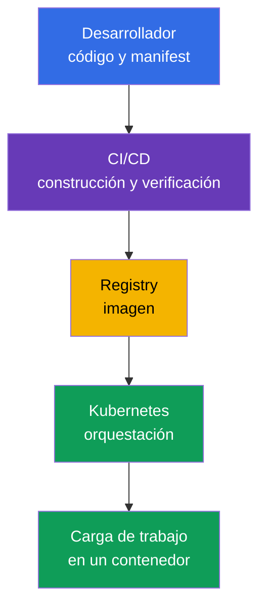
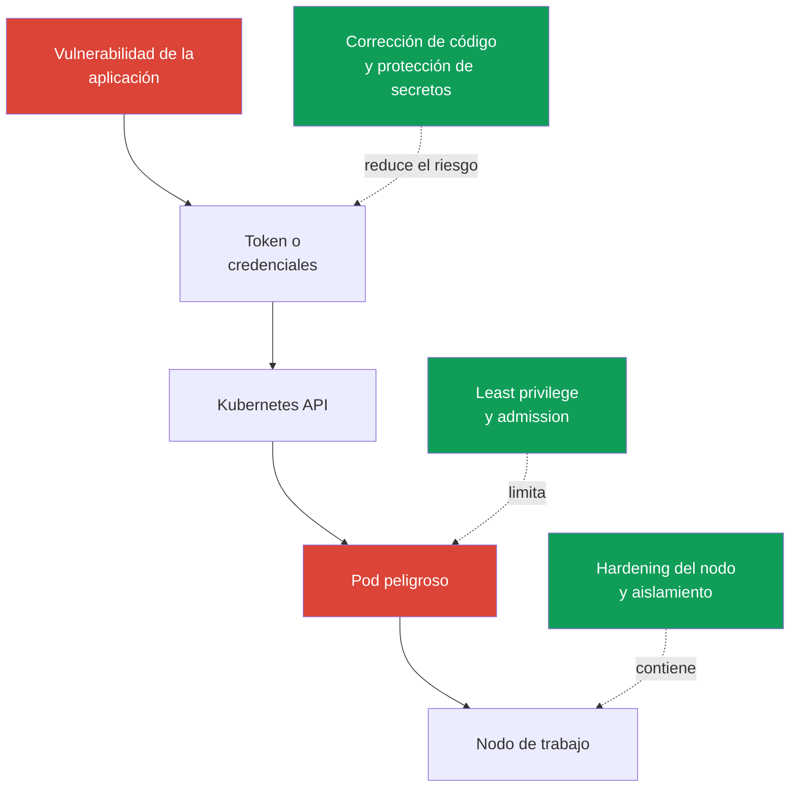

[Русская версия](ru.md) · [Eng version](README.md) · [Version française](fr.md) · [Deutsche Version](de.md) · [ქართული ვერსია](ge.md) · [繁體中文版](tw.md) · [日本語版](jp.md)

# Capítulo 02. Cloud native y por qué la seguridad importa

> **Qué sigue.** KCSA aborda la seguridad no como un producto independiente, sino como una propiedad de todo el sistema de entrega y ejecución de aplicaciones. Cloud native acelera los cambios mediante contenedores, orquestación y automatización, pero al mismo tiempo amplía el número de límites de confianza. Este capítulo establece el marco general para los temas posteriores del curso y para el dominio **Overview of Cloud Native Security** (14%).

## 02.1. Qué es cloud native y el ecosistema CNCF

**Cloud native** es un enfoque de desarrollo y operación de aplicaciones en el que el sistema se diseña para funcionar de forma flexible en una infraestructura cloud o distribuida. La aplicación se divide en componentes pequeños que se pueden entregar de forma independiente, se empaquetan en contenedores y se gestionan mediante automatización.

CNCF (Cloud Native Computing Foundation) desarrolla proyectos abiertos y prácticas de este ecosistema. Kubernetes es uno de estos proyectos: gestiona cargas de trabajo en contenedores, pero no sustituye la seguridad de las imágenes, el código, las credenciales cloud ni la red.

| Idea de cloud native | Qué aporta | Qué cambia para la seguridad |
|---|---|---|
| Contenedores | paquete reproducible de la aplicación y sus dependencias | la imagen se convierte en un artefacto que debe construirse, verificarse y obtenerse de un registry de confianza |
| Orquestación | colocación, escalado y recuperación automáticos de las cargas de trabajo | Kubernetes API, `ServiceAccount`, `Pod`, la red y los nodos se convierten en puntos de control |
| Microservicios | equipos independientes y entregas frecuentes | aumenta el número de servicios, llamadas API, secretos y rutas de red |
| Declaratividad | el estado deseado se describe en YAML u otro código de configuración | los manifests, Git y CI/CD pasan a formar parte de la cadena de suministro y requieren verificación |

La declaratividad es especialmente importante. El equipo describe el `Deployment` deseado y el controlador de Kubernetes lleva el estado real al descrito. Por tanto, una configuración insegura en un manifest puede reproducirse repetidamente en cada rollout. La seguridad debe verificar no solo el contenedor que ya está en ejecución, sino también los cambios antes de aplicarlos.

En el diagrama no hay un único punto después del cual la seguridad haya «terminado». La vulneración del código fuente, CI/CD, el registry o Kubernetes puede llevar a la ejecución de una carga de trabajo maliciosa. Los capítulos siguientes desglosarán este sistema en capas y controles concretos.

Actualmente, CNCF desarrolla esta área a través de **TAG Security and Compliance** (Technical Advisory Group for Security and Compliance). En la estructura actual de CNCF, el anterior **TAG-Security** está archivado. Uno de los materiales clave creados por el anterior TAG-Security es el **Cloud Native Security Whitepaper**; describe el ciclo de vida de seguridad de un artefacto a través de cuatro etapas: **Develop → Distribute → Deploy → Runtime**. En el nivel associate importa la idea en sí: los controles se integran en cada etapa de la entrega, no se añaden únicamente al final. El número exacto de versión del documento no es relevante para el examen.

El ecosistema CNCF clasifica los proyectos por nivel de madurez: **Sandbox** (fase temprana o experimental) → **Incubating** (adopción y madurez crecientes del proyecto) → **Graduated** (alta madurez, governance sostenible y production adoption demostrada).

A fecha actual, Falco, Open Policy Agent (OPA), Kyverno y Cilium tienen estatus CNCF Graduated, por lo que es conveniente utilizarlos en el curso como ejemplos de implementaciones cloud-native maduras de runtime detection, policy-as-code y networking/security.

Sin embargo, **Graduated no significa «estándar oficial de la industria» ni garantiza que KCSA evalúe un producto concreto**. Para el examen, primero se memorizan la competency y el límite del control: runtime detection, admission/policy engine, container networking, observability, etc. Una herramienta concreta es un ejemplo de implementación de esta función.

El nivel de madurez de un proyecto puede cambiar, por lo que antes de usarlo en una arquitectura real, compruebe su estado actual en la [página de proyectos de CNCF](https://www.cncf.io/projects/).

## 02.2. Por qué la seguridad es crítica

Cloud native acorta el camino desde un cambio de código hasta production. Esto es útil, pero el error se propaga con la misma rapidez: un template `Deployment` incorrecto, un token en una variable de CI o un registry accesible públicamente pueden llegar a numerosos entornos en minutos.

El carácter dinámico de Kubernetes añade particularidades:

- Un `Pod` suele tener una vida breve. La investigación no debe basarse únicamente en el sistema de archivos de un contenedor desaparecido: son importantes la auditoría, los logs y un historial verificable de entrega.
- Las cargas de trabajo se escalan y recrean automáticamente. Una declaración peligrosa es reproducida por el controlador hasta que se corrija su origen.
- Varios equipos y servicios usan infraestructura compartida. Un error en permisos o aislamiento de red puede permitir desplazarse de un servicio a otro.
- La gestión se realiza mediante API. Las credenciales, los permisos de acceso y las comprobaciones de admission afectan a toda la superficie del clúster.

La seguridad no contradice la velocidad de entrega. El objetivo es hacer que el camino seguro sea el estándar y esté automatizado: construir imágenes mínimas, verificar dependencias, aplicar permisos mínimos y rechazar configuraciones claramente peligrosas antes de production. La revisión manual de cada cambio no escala, mientras que los controles repetibles en CI/CD y Kubernetes escalan junto con la entrega.

## 02.3. Superficie de ataque cloud native

La **superficie de ataque** es el conjunto de puntos a través de los cuales un atacante puede obtener acceso, ejecutar código, elevar privilegios o extraer datos. En cloud native comienza antes del clúster y no termina en el límite del contenedor.

| Área | Riesgo típico | Ejemplo de control |
|---|---|---|
| Imagen | biblioteca vulnerable, secreto en una capa de imagen, procedencia no confirmada | escaneo, imagen mínima, immutable digest, firma |
| Runtime | el proceso obtiene Linux capabilities excesivas o intenta escapar al host | `securityContext`, seccomp, non-root, sandbox-runtime |
| Clúster | permisos demasiado amplios, `Pod` inseguro, componente control plane expuesto | RBAC, Pod Security Admission, TLS, audit logging |
| Cloud e infraestructura | credenciales IAM robadas, acceso a metadata service, nodo de trabajo sin proteger | least privilege en IAM, restricción de IMDS, hardening del SO, perímetro de red |
| Cadena de suministro | manipulación de código, dependencias, CI/CD o artefacto | review, SCA, construcción aislada, SBOM, verificación de firma |

Un contenedor no es un límite de seguridad completo. Si un `Pod` recibe un token con permisos excesivos, acceso a metadata service o monta el socket del container runtime, incluso una imagen correctamente construida no elimina el riesgo. A la inversa, una política estricta de Kubernetes no corregirá una dependencia maliciosa que ya haya llegado a la imagen.

Es útil pensar en escenarios, no en herramientas aisladas. Por ejemplo, un atacante puede explotar una vulnerabilidad de una aplicación web, leer el token de `ServiceAccount`, llamar a Kubernetes API y crear un `Pod` privilegiado. Controles distintos interrumpen la cadena: código seguro, permisos limitados del token, admission policy y protección del nodo.

## 02.4. Principios básicos de seguridad

Estos principios ayudan a elegir la respuesta correcta en una MCQ (multiple choice question, pregunta de opción múltiple) y a evaluar una decisión de arquitectura. No son un único objeto concreto de Kubernetes: normalmente un principio se implementa mediante varios controles.

### Defense in depth

**Defense in depth** son varios niveles independientes de protección. Si un control falla, el siguiente limita las consecuencias. Por ejemplo, el escaneo de una imagen no garantiza la ausencia de una vulnerabilidad, por lo que se complementa con ejecución non-root, `NetworkPolicy`, RBAC y monitorización.

Una conclusión errónea es: «varias capas significan que se puede debilitar cada una». Al contrario, las capas deben compensar fallos diferentes. No se puede sustituir la restricción de permisos de un `ServiceAccount` por un único antivirus o escáner de imágenes.

### Least privilege

**Least privilege** significa que un sujeto recibe únicamente los permisos necesarios para una tarea concreta y durante el mínimo tiempo necesario. El sujeto puede ser un usuario, `ServiceAccount`, un rol cloud, un proceso de contenedor o CI/CD.

Ejemplos: un `Role` en un único `Namespace` en lugar de `ClusterRoleBinding` para todo el clúster; `capabilities.drop: ["ALL"]` con la restitución puntual de la capability necesaria; un rol cloud con acceso a un único recurso en vez de permisos administrativos. Least privilege reduce el daño si las credenciales o el proceso se ven comprometidos.

### Zero trust

**Zero trust** consiste en no considerar una solicitud de confianza solo por su ubicación en la red, el nombre de `Namespace` o la pertenencia al clúster. Cada acceso debe basarse en identity verificable, autenticación, autorización y contexto de política.

En Kubernetes, esto significa que el tráfico interno no debe considerarse automáticamente seguro. `NetworkPolicy`, mTLS, `ServiceAccount` y RBAC ayudan a comprobar quién accede a un recurso y qué tiene permitido hacer. Zero trust no significa «no confiar en nadie en absoluto», sino rechazar la confianza implícita.

### Immutability

**Immutability** significa que el entorno de trabajo no se modifica manualmente tras la entrega; en su lugar, se crea un nuevo artefacto verificable y se despliega una nueva versión. Una imagen con digest, un manifest declarativo y el historial de Git permiten entender exactamente qué se está ejecutando.

Si se corrige un contenedor con el comando `kubectl exec`, el cambio desaparecerá tras recrear el `Pod` y no formará parte de una entrega reproducible. El camino correcto es modificar el código o el manifest, volver a construir y verificar el artefacto y, después, realizar un rollout. Immutability facilita la reversión y la investigación, pero no elimina la necesidad de almacenar los secretos separados de la imagen.

### Shared responsibility

**Shared responsibility** significa que las responsabilidades de protección se distribuyen entre el proveedor de infraestructura y el usuario de la plataforma. En Kubernetes gestionado, el proveedor puede ser responsable de parte del control plane, pero el usuario sigue siendo responsable de IAM, la configuración de las cargas de trabajo, los datos, los permisos y las reglas de red. En un clúster self-managed, el ámbito de responsabilidad del equipo suele ser mayor.

El límite exacto depende del servicio y el contrato. Por ello, no se debe asumir que managed Kubernetes protege automáticamente todo lo que hay dentro del clúster. El modelo se analizará en detalle en el capítulo 04.

## 02.5. Cómo se aplica en la práctica

- El equipo convierte el camino seguro en el estándar: los templates `Deployment` usan ejecución non-root, las imágenes se obtienen de registry autorizados y CI/CD verifica dependencias y configuración antes del merge.
- Los permisos se conceden a identity independientes. Un `ServiceAccount` para todas las aplicaciones y un rol cloud de administrador «por si acaso» contradicen least privilege.
- Los controles se colocan a lo largo de la cadena: protección del código y las dependencias, verificación de la construcción, verificación de la imagen, admission en el clúster, restricción del runtime y observación de eventos.
- Los cambios en production se realizan mediante Git y un rollout declarativo. La corrección manual de un `Pod` activo sirve para el diagnóstico, pero no como entrega permanente.
- Al analizar un incidente, se determina no solo la vulnerabilidad, sino también qué capas deberían haberla detenido: esto indica dónde reforzar defense in depth.

## 02.6. Exam vocabulary / Mini glosario

- **cloud native**: enfoque para crear y operar aplicaciones con contenedores, automatización e infraestructura distribuida.
- **CNCF**: Cloud Native Computing Foundation, fundación y ecosistema de proyectos cloud native.
- **superficie de ataque**: todos los puntos mediante los cuales es posible el acceso no autorizado, la ejecución de código o la obtención de datos.
- **defense in depth**: varias capas independientes de protección.
- **least privilege**: concesión únicamente de los permisos mínimos necesarios.
- **zero trust**: ausencia de confianza implícita en una solicitud según su ubicación en la red o pertenencia a un sistema.
- **immutability**: entrega de nuevos artefactos verificables en vez de modificar manualmente un entorno ya en ejecución.
- **shared responsibility**: distribución de las responsabilidades de protección entre el proveedor y el usuario.
- **supply chain**: cadena de suministro desde el código fuente y las dependencias hasta la ejecución del artefacto.

## 02.7. Exam Essentials / Resumen del capítulo

- Cloud native combina contenedores, orquestación, microservicios y gestión declarativa; cada elemento crea sus propios puntos de control.
- La entrega rápida y automatizada requiere security checks automatizados; de otro modo, un error llegará a production con la misma rapidez.
- La superficie de ataque incluye la imagen, el runtime, el clúster, la infraestructura cloud y la cadena de suministro.
- La seguridad de un contenedor no depende solo de su aislamiento: se deben considerar los permisos de acceso, la red, los tokens, la protección del nodo y la procedencia del artefacto.
- Defense in depth, least privilege, zero trust, immutability y shared responsibility establecen el marco transversal de todos los temas posteriores de KCSA.

## 02.8. Qué no confundir y cómo aparece en el examen

En KCSA, las preguntas suelen evaluar la finalidad de un principio o la elección de un control para una situación. Distinga cuidadosamente formulaciones similares:

- varios controles distintos frente a una cadena de ataque: defense in depth;
- solo los permisos necesarios para `ServiceAccount`, un rol IAM o un proceso: least privilege;
- verificación de identity y política incluso para una solicitud interna: zero trust;
- una nueva imagen por digest en lugar de modificar un contenedor en ejecución: immutability;
- reparto de responsabilidades entre un servicio managed y el usuario: shared responsibility.

Una trampa típica del examen es pensar que una herramienta potente sustituirá a todas las demás. El escáner de imágenes, RBAC y el cifrado resuelven partes diferentes del problema y normalmente se complementan.

## 02.9. Preguntas de autoevaluación

### 1. ¿Qué afirmación describe mejor la declaratividad de Kubernetes desde el punto de vista de la seguridad?

   - a. Los contenedores se convierten automáticamente en confiables tras iniciarse.
   - b. `kubectl exec` fija el cambio en el manifest de origen.
   - c. La declaratividad elimina la necesidad de CI/CD.
   - d. Una configuración insegura en un manifest puede reproducirse automáticamente durante un rollout.

Respuesta y explicación

**Respuesta correcta: d.** Los controladores llevan el estado real al descrito. Por tanto, un template erróneo vuelve a crear cargas de trabajo inseguras mientras no se cambie el origen de la configuración.

### 2. ¿Qué combinación ilustra mejor defense in depth para una aplicación en Kubernetes?

   - a. Un `Namespace` compartido sin restricciones de red.
   - b. Verificación de dependencias, permisos limitados de `ServiceAccount`, admission policy y `NetworkPolicy`.
   - c. Solo escaneo de la imagen antes de publicarla.
   - d. Solo `ClusterRoleBinding` de administrador para el equipo de operaciones.

Respuesta y explicación

**Respuesta correcta: b.** Son controles independientes en distintas etapas y capas. Cada uno reduce la probabilidad o las consecuencias de otro fallo.

### 3. Un desarrollador necesita acceso de solo lectura a `ConfigMap` en un único `Namespace`. ¿Qué solución cumple least privilege?

   - a. Crear un `ClusterRoleBinding` con `cluster-admin`, para que el desarrollador pueda leer ConfigMap en cualquier namespace sin restricciones adicionales.

   - b. Crear un Role en el namespace necesario, pero concederle `create`, `update`, `delete` y `patch` para ConfigMap.

   - c. Crear un Role en el namespace necesario solo con los read verbs requeridos para ConfigMap y vincularlo a la identity del desarrollador.

   - d. Añadir Linux capabilities al desarrollador en el nodo de trabajo para que estos host privileges sustituyan Kubernetes API authorization.

Respuesta y explicación

**Respuesta correcta: c.** Least privilege limita los API permissions al recurso necesario, las acciones necesarias y el ámbito mínimo. `cluster-admin` para todo el clúster es considerablemente más amplio que el requisito, los write verbs no corresponden a una tarea de solo lectura y las Linux capabilities no proporcionan Kubernetes API permissions.

### 4. ¿Qué es un ejemplo de immutability al resolver un defecto en production?

   - a. Desactivar las comprobaciones de admission para que el nuevo `Pod` se inicie más rápido.
   - b. Eliminar los logs para no conservar el estado anterior.
   - c. Corregir el código fuente o el manifest, construir una nueva imagen verificable y realizar un rollout.
   - d. Modificar archivos en el contenedor en ejecución mediante `kubectl exec` y dejar el `Pod` funcionando.

Respuesta y explicación

**Respuesta correcta: c.** El cambio entra en la cadena de suministro reproducible y se puede verificar o revertir. La modificación manual de un contenedor activo es temporal y no deja un artefacto correcto.

> **Qué sigue.** El modelo de capas Cloud, Cluster, Container y Code se analiza en el capítulo 02 de CKS a nivel práctico. En este curso, continúe con el [capítulo 03](../03/es.md), donde las 4C se muestran como un modelo unificado de cloud native security.

---
[Índice](../README_ES.md) · [Capítulo 01](../01/es.md) · [Capítulo 03](../03/es.md)
