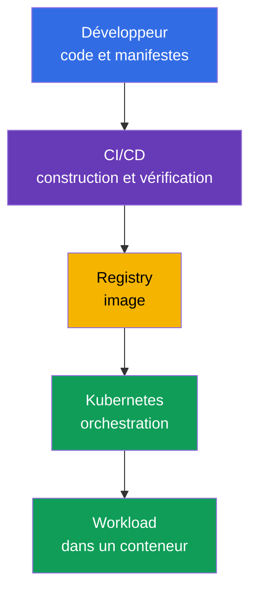
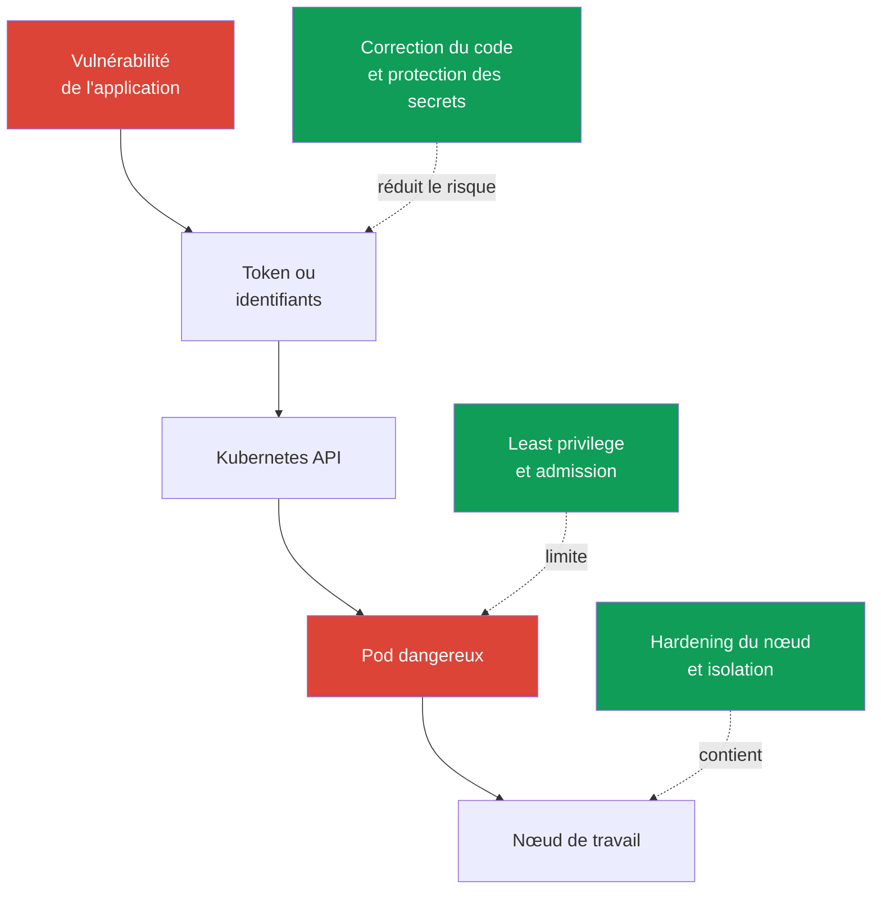

[Русская версия](ru.md) · [Eng version](README.md) · [Versión en español](es.md) · [Deutsche Version](de.md) · [ქართული ვერსია](ge.md) · [繁體中文版](tw.md) · [日本語版](jp.md)

# Chapitre 02. Cloud native et pourquoi la sécurité

> **La suite.** KCSA considère la sécurité non pas comme un produit isolé, mais comme une propriété de l'ensemble du système de livraison et d'exécution des applications. Le cloud native accélère les changements grâce aux conteneurs, à l'orchestration et à l'automatisation, mais augmente aussi le nombre de frontières de confiance. Ce chapitre établit le cadre général des thèmes suivants du cours et du domaine **Overview of Cloud Native Security** (14%).

## 02.1. Qu'est-ce que le cloud native et l'écosystème CNCF

Le **cloud native** est une approche du développement et de l'exploitation des applications, dans laquelle le système est conçu pour fonctionner avec souplesse dans une infrastructure cloud ou distribuée. L'application est découpée en petites parties livrables indépendamment, empaquetées dans des conteneurs et gérées par automatisation.

La CNCF (Cloud Native Computing Foundation) développe des projets open source et des pratiques pour cet écosystème. Kubernetes est l'un de ces projets : il gère les workloads conteneurisés, mais ne remplace pas la sécurité des images, du code, des identifiants cloud ou du réseau.

| Idée cloud native | Ce qu'elle apporte | Ce qui change pour la sécurité |
|---|---|---|
| Conteneurs | paquet reproductible de l'application et de ses dépendances | l'image devient un artefact qui doit être construit, vérifié et obtenu depuis un registry de confiance |
| Orchestration | placement, mise à l'échelle et récupération automatiques des workloads | l'API Kubernetes, `ServiceAccount`, `Pod`, le réseau et les nœuds deviennent des points de contrôle |
| Microservices | équipes indépendantes et livraisons fréquentes | le nombre de services, d'appels API, de secrets et de chemins réseau augmente |
| Déclaratif | l'état souhaité est décrit dans YAML ou dans un autre code de configuration | les manifestes, Git et CI/CD deviennent une partie de la chaîne d'approvisionnement et exigent une vérification |

Le déclaratif est particulièrement important. L'équipe décrit le `Deployment` souhaité et le contrôleur Kubernetes ramène l'état réel à l'état décrit. Par conséquent, une configuration non sécurisée dans un manifeste peut être reproduite de nombreuses fois à chaque rollout. La sécurité doit vérifier non seulement le conteneur déjà en cours d'exécution, mais aussi les changements avant leur application.

Le schéma ne comporte pas un point unique après lequel la sécurité serait « terminée ». La compromission du code source, de CI/CD, du registry ou de Kubernetes peut conduire à l'exécution d'un workload malveillant. Les chapitres suivants décomposeront ce système en couches et en contrôles concrets.

La CNCF développe actuellement ce domaine par l'intermédiaire du **TAG Security and Compliance** (Technical Advisory Group for Security and Compliance). Dans la structure actuelle de la CNCF, l'ancien **TAG-Security** est archivé. L'un des documents clés créés par l'ancien TAG-Security est le **Cloud Native Security Whitepaper** ; il décrit le cycle de vie de la sécurité d'un artefact en quatre étapes : **Develop → Distribute → Deploy → Runtime**. Au niveau associate, l'idée elle-même importe : les contrôles sont intégrés à chaque étape de la livraison, et non ajoutés uniquement à la fin. Le numéro de version précis du document n'a pas d'importance pour l'examen.

L'écosystème CNCF classe les projets selon leur niveau de maturité : **Sandbox** (phase initiale ou expérimentale) → **Incubating** (adoption et maturité croissantes du projet) → **Graduated** (maturité élevée, governance durable et production adoption confirmée).

À ce jour, Falco, Open Policy Agent (OPA), Kyverno et Cilium ont le statut CNCF Graduated ; il est donc pratique de les utiliser dans ce cours comme exemples d'implémentations cloud-native matures pour la runtime detection, le policy-as-code et le networking/security.

Cependant, **Graduated ne signifie pas « norme officielle du secteur » et ne garantit pas que KCSA évaluera un produit spécifique**. Pour l'examen, mémorisez d'abord la competency et la frontière du contrôle : runtime detection, admission/policy engine, container networking, observability, etc. L'outil concret est un exemple d'implémentation de cette fonction.

Le maturity level d'un projet peut évoluer ; avant de l'utiliser dans une architecture réelle, vérifiez son statut actuel sur la [page des projets CNCF](https://www.cncf.io/projects/).

## 02.2. Pourquoi la sécurité est critique

Le cloud native raccourcit le chemin entre un changement de code et la production. C'est utile, mais une erreur se propage tout aussi vite : un template `Deployment` incorrect, un token dans une variable CI ou un registry accessible publiquement peuvent atteindre de nombreux environnements en quelques minutes.

Le caractère dynamique de Kubernetes ajoute des particularités :

- Un `Pod` est généralement éphémère. L'investigation ne doit pas reposer uniquement sur le système de fichiers d'un conteneur disparu : l'audit, les logs et un historique vérifiable de la livraison sont importants.
- Les workloads sont automatiquement mis à l'échelle et recréés. Une déclaration dangereuse est reproduite par le contrôleur tant que sa source n'est pas corrigée.
- Plusieurs équipes et services utilisent une infrastructure commune. Une erreur dans les permissions ou l'isolation réseau peut permettre de passer d'un service à un autre.
- La gestion passe par l'API. Les identifiants, les droits d'accès et les contrôles admission influent sur toute la surface du cluster.

La sécurité ne s'oppose pas à la vitesse de livraison. L'objectif est de rendre le chemin sécurisé standard et automatisé : construire des images minimales, vérifier les dépendances, appliquer les permissions minimales et rejeter les configurations manifestement dangereuses avant la production. La vérification manuelle de chaque changement ne passe pas à l'échelle, tandis que les contrôles répétables dans CI/CD et Kubernetes passent à l'échelle avec la livraison.

## 02.3. Surface d'attaque cloud native

La **surface d'attaque** est l'ensemble des points par lesquels un attaquant peut obtenir un accès, exécuter du code, élever ses privilèges ou extraire des données. Dans le cloud native, elle commence avant le cluster et ne s'arrête pas à la frontière du conteneur.

| Domaine | Risque typique | Exemple de contrôle |
|---|---|---|
| Image | bibliothèque vulnérable, secret dans une couche d'image, provenance non confirmée | scan, image minimale, immutable digest, signature |
| Runtime | un processus obtient des Linux capabilities superflues ou tente de sortir vers l'hôte | `securityContext`, seccomp, non-root, runtime sandbox |
| Cluster | permissions trop étendues, `Pod` non sécurisé, composant control plane exposé | RBAC, Pod Security Admission, TLS, audit logging |
| Cloud et infrastructure | identifiants IAM volés, accès au metadata service, nœud de travail non protégé | least privilege dans IAM, restriction d'IMDS, hardening de l'OS, périmètre réseau |
| Chaîne d'approvisionnement | substitution du code, d'une dépendance, de CI/CD ou d'un artefact | review, SCA, construction isolée, SBOM, vérification de signature |

Un conteneur n'est pas une frontière de sécurité complète. Si un `Pod` reçoit un token doté de permissions excessives, un accès au metadata service ou monte le socket du container runtime, même une image correctement construite n'élimine pas le risque. À l'inverse, une politique Kubernetes stricte ne corrigera pas une dépendance malveillante déjà présente dans l'image.

Il est utile de raisonner par scénarios plutôt que par outils isolés. Par exemple, un attaquant peut exploiter une vulnérabilité d'une application web, lire le token `ServiceAccount`, appeler l'API Kubernetes et créer un `Pod` privilégié. Différents contrôles interrompent cette chaîne : code sécurisé, permissions limitées du token, admission policy et protection du nœud.

## 02.4. Principes fondamentaux de sécurité

Ces principes aident à choisir la bonne réponse dans les MCQ (multiple choice question, question à choix multiple) et à évaluer une décision d'architecture. Ils ne correspondent pas à un objet Kubernetes unique : un principe est généralement mis en œuvre par plusieurs contrôles.

### Defense in depth

La **defense in depth** repose sur plusieurs niveaux de protection indépendants. Si un contrôle échoue, le suivant limite les conséquences. Par exemple, le scan d'image ne garantit pas l'absence de vulnérabilité ; il est donc complété par une exécution non-root, `NetworkPolicy`, RBAC et le monitoring.

Conclusion erronée : « plusieurs couches signifient qu'il est possible de relâcher chacune d'elles ». Au contraire, les couches doivent compenser des défaillances différentes. Il est impossible de remplacer la restriction des permissions d'un `ServiceAccount` par un seul antivirus ou scanner d'images.

### Least privilege

Le **least privilege** signifie qu'un sujet ne reçoit que les droits nécessaires à une tâche donnée, et pour la durée minimale requise. Le sujet peut être un utilisateur, un `ServiceAccount`, un rôle cloud, un processus de conteneur ou CI/CD.

Exemples : un `Role` dans un seul `Namespace` plutôt qu'un `ClusterRoleBinding` pour l'ensemble du cluster ; `capabilities.drop: ["ALL"]` avec le rétablissement ciblé de la capability nécessaire ; un rôle cloud avec accès à une seule ressource plutôt que des permissions administratives. Le least privilege réduit les dommages si des identifiants ou un processus sont compromis.

### Zero trust

Le **zero trust** consiste à ne pas considérer une requête comme fiable uniquement en raison de son emplacement sur le réseau, de son nom de `Namespace` ou de son appartenance au cluster. Chaque accès doit reposer sur une identity vérifiable, l'authentification, l'autorisation et le contexte de la politique.

Dans Kubernetes, cela signifie que le trafic interne ne doit pas être automatiquement considéré comme sûr. `NetworkPolicy`, mTLS, `ServiceAccount` et RBAC aident à vérifier qui accède à une ressource et ce qui lui est autorisé. Le zero trust ne signifie pas « ne faire confiance à personne » : il s'agit d'abandonner la confiance implicite.

### Immutability

L'**immutability** signifie que l'environnement d'exécution n'est pas modifié manuellement après la livraison ; à la place, un nouvel artefact vérifiable est créé et une nouvelle version est déployée. Une image avec digest, un manifest déclaratif et l'historique Git permettent de savoir précisément ce qui est exécuté.

Si vous corrigez un conteneur avec la commande `kubectl exec`, le changement disparaîtra après la recréation du `Pod` et ne fera pas partie d'une livraison reproductible. La bonne méthode est de modifier le code ou le manifeste, de reconstruire et vérifier l'artefact, puis d'effectuer le rollout. L'immutability facilite le rollback et l'investigation, mais n'annule pas la nécessité de stocker les secrets séparément de l'image.

### Shared responsibility

La **shared responsibility** signifie que les responsabilités de protection sont réparties entre le fournisseur d'infrastructure et l'utilisateur de la plateforme. Dans Kubernetes managé, le fournisseur peut être responsable d'une partie du control plane, mais l'utilisateur reste responsable d'IAM, de la configuration des workloads, des données, des permissions et des règles réseau. Dans un cluster self-managed, le périmètre de responsabilité de l'équipe est généralement plus large.

La frontière exacte dépend du service et du contrat. Il ne faut donc pas considérer que Kubernetes managé protège automatiquement tout ce qui se trouve dans le cluster. Le modèle sera étudié en détail au chapitre 04.

## 02.5. Application pratique

- L'équipe fait du chemin sécurisé le chemin standard : les templates `Deployment` utilisent une exécution non-root, les images proviennent de registry autorisés et CI/CD vérifie les dépendances et la configuration avant le merge.
- Les permissions sont attribuées à des identity distinctes. Un seul `ServiceAccount` pour toutes les applications et un rôle cloud administrateur « au cas où » contredisent le least privilege.
- Les contrôles sont placés tout au long de la chaîne : protection du code et des dépendances, vérification de la construction, vérification de l'image, admission dans le cluster, restriction du runtime et observation des événements.
- Les changements en production passent par Git et un rollout déclaratif. La correction manuelle d'un `Pod` en cours d'exécution convient au diagnostic, mais pas à une livraison permanente.
- Lors de l'analyse d'un incident, on identifie non seulement la vulnérabilité, mais aussi les couches qui auraient dû l'arrêter : cela montre où renforcer la defense in depth.

## 02.6. Exam vocabulary / Mini-glossaire

- **cloud native** - approche de création et d'exploitation d'applications avec des conteneurs, l'automatisation et une infrastructure distribuée.
- **CNCF** - Cloud Native Computing Foundation, fondation et écosystème de projets cloud native.
- **surface d'attaque** - tous les points par lesquels un accès non autorisé, l'exécution de code ou l'obtention de données sont possibles.
- **defense in depth** - plusieurs couches de protection indépendantes.
- **least privilege** - attribution des seuls droits minimaux nécessaires.
- **zero trust** - absence de confiance implicite dans une requête selon son emplacement sur le réseau ou son appartenance au système.
- **immutability** - livraison de nouveaux artefacts vérifiables plutôt que modification manuelle d'un environnement déjà en cours d'exécution.
- **shared responsibility** - répartition des responsabilités de protection entre le fournisseur et l'utilisateur.
- **supply chain** - chaîne d'approvisionnement, depuis le code source et les dépendances jusqu'à l'exécution de l'artefact.

## 02.7. Exam Essentials / Points clés du chapitre

- Le cloud native réunit les conteneurs, l'orchestration, les microservices et la gestion déclarative ; chaque élément crée ses propres points de contrôle.
- Une livraison rapide et automatisée requiert des security checks automatisés, sinon une erreur atteindra la production tout aussi vite.
- La surface d'attaque inclut l'image, le runtime, le cluster, l'infrastructure cloud et la chaîne d'approvisionnement.
- La sécurité d'un conteneur ne dépend pas seulement de son isolation : il faut aussi prendre en compte les permissions, le réseau, les tokens, la protection du nœud et la provenance de l'artefact.
- Defense in depth, least privilege, zero trust, immutability et shared responsibility établissent le cadre transversal de tous les thèmes KCSA suivants.

## 02.8. À ne pas confondre et présence à l'examen

Dans KCSA, les questions évaluent généralement la finalité d'un principe ou le choix d'un contrôle pour une situation. Distinguez attentivement les formulations semblables :

- plusieurs contrôles différents contre une même chaîne d'attaque - defense in depth ;
- uniquement les permissions nécessaires pour un `ServiceAccount`, un rôle IAM ou un processus - least privilege ;
- vérification de l'identity et de la politique même pour une requête interne - zero trust ;
- une nouvelle image par digest au lieu de modifier un conteneur en cours d'exécution - immutability ;
- répartition des responsabilités entre un service managé et l'utilisateur - shared responsibility.

Un piège d'examen typique consiste à penser qu'un outil puissant peut remplacer tous les autres. Un scanner d'images, RBAC et le chiffrement résolvent différentes parties du problème et se complètent généralement.

## 02.9. Questions d'auto-évaluation

### 1. Quelle affirmation décrit le mieux le déclaratif Kubernetes du point de vue de la sécurité ?

   - a. Les conteneurs deviennent automatiquement fiables après leur démarrage.
   - b. `kubectl exec` enregistre une modification dans le manifest source.
   - c. Le déclaratif élimine le besoin de CI/CD.
   - d. Une configuration non sécurisée dans un manifest peut être reproduite automatiquement lors d'un rollout.

Réponse et explication

**Bonne réponse : d.** Les contrôleurs ramènent l'état réel à l'état décrit. Ainsi, un template incorrect recrée des workloads non sécurisés tant que la source de configuration n'est pas modifiée.

### 2. Quelle combinaison illustre le mieux la defense in depth pour une application dans Kubernetes ?

   - a. Un unique `Namespace` partagé sans restrictions réseau.
   - b. Vérification des dépendances, permissions `ServiceAccount` limitées, admission policy et `NetworkPolicy`.
   - c. Seulement le scan de l'image avant publication.
   - d. Seulement un `ClusterRoleBinding` administrateur pour l'équipe d'exploitation.

Réponse et explication

**Bonne réponse : b.** Ce sont des contrôles indépendants à différentes étapes et couches. Chacun réduit la probabilité ou les conséquences d'une autre défaillance.

### 3. Un développeur a besoin d'un accès en lecture seule à `ConfigMap` dans un seul `Namespace`. Quelle solution respecte le least privilege ?

   - a. Créer un `ClusterRoleBinding` avec `cluster-admin`, afin que le développeur puisse lire ConfigMap dans n'importe quel namespace sans restrictions supplémentaires.

   - b. Créer un Role dans le namespace requis, mais lui accorder `create`, `update`, `delete` et `patch` pour ConfigMap.

   - c. Créer un Role dans le namespace requis avec seulement les read verbs nécessaires pour ConfigMap et l'associer à l'identity du développeur.

   - d. Ajouter au développeur des Linux capabilities sur le nœud de travail, afin que ces host privileges remplacent l'autorisation de l'API Kubernetes.

Réponse et explication

**Bonne réponse : c.** Le least privilege limite les API permissions à la ressource, aux actions et au périmètre requis. Un `cluster-admin` à l'échelle du cluster dépasse largement le besoin, les write verbs ne correspondent pas à une tâche en lecture seule et les Linux capabilities n'accordent pas d'API permissions Kubernetes.

### 4. Quel est un exemple d'immutability lors de la correction d'un défaut en production ?

   - a. Désactiver les contrôles admission afin qu'un nouveau `Pod` démarre plus vite.
   - b. Supprimer les logs afin de ne pas conserver l'ancien état.
   - c. Corriger le code source ou le manifest, construire une nouvelle image vérifiable et effectuer un rollout.
   - d. Modifier les fichiers dans un conteneur en cours d'exécution via `kubectl exec` et laisser le `Pod` continuer de fonctionner.

Réponse et explication

**Bonne réponse : c.** Le changement entre dans la chaîne d'approvisionnement reproductible et peut être vérifié ou annulé. La modification manuelle d'un conteneur en cours d'exécution est temporaire et ne produit pas d'artefact correct.

> **La suite.** Le modèle des couches Cloud, Cluster, Container et Code est étudié au niveau pratique dans le chapitre 02 de CKS. Dans ce cours, poursuivez avec le [chapitre 03](../03/fr.md), où les 4C sont présentés comme un modèle unifié de cloud native security.

---
[Table des matières](../README_FR.md) · [Chapitre 01](../01/fr.md) · [Chapitre 03](../03/fr.md)
