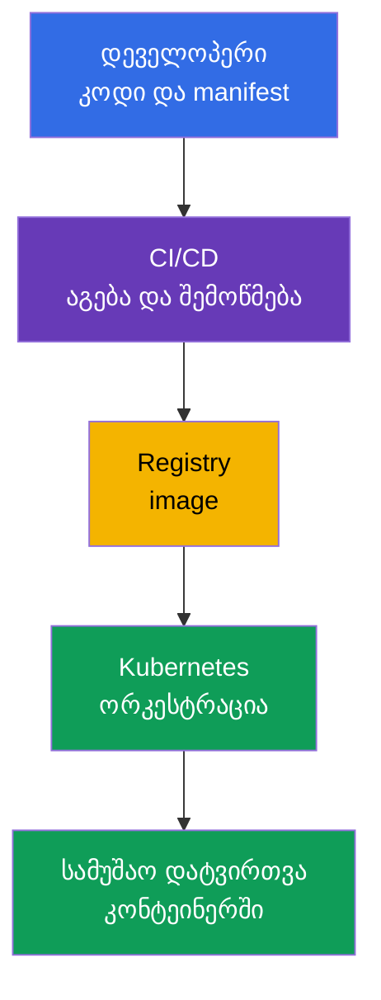
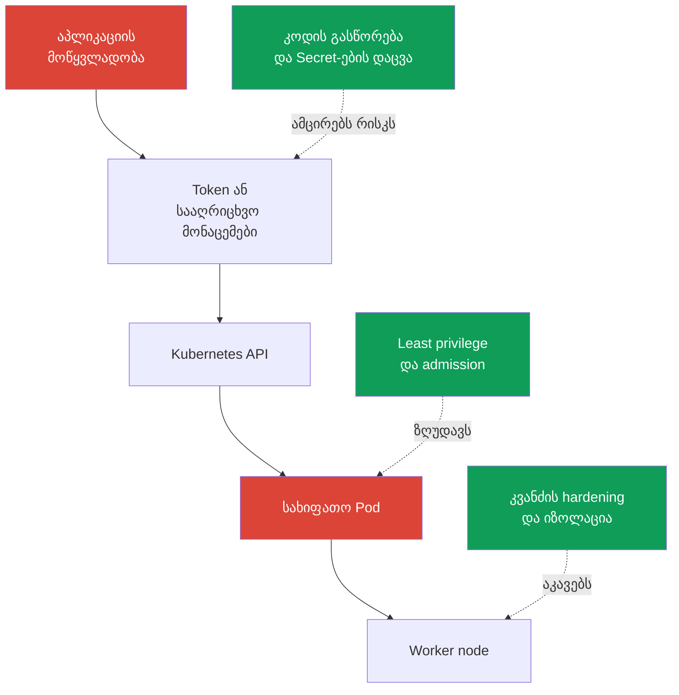

[Русская версия](ru.md) · [Eng version](README.md) · [Versión en español](es.md) · [Version française](fr.md) · [Deutsche Version](de.md) · [繁體中文版](tw.md) · [日本語版](jp.md)

# თავი 02. Cloud native და რატომ არის უსაფრთხოება მნიშვნელოვანი

> **რა არის შემდეგ.** KCSA უსაფრთხოებას განიხილავს არა როგორც ცალკე პროდუქტს, არამედ როგორც აპლიკაციების მიწოდებისა და გაშვების მთელი სისტემის თვისებას. Cloud native აჩქარებს ცვლილებებს კონტეინერების, ორკესტრაციისა და ავტომატიზაციის ხარჯზე, მაგრამ ამავე დროს ზრდის ნდობის საზღვრების რაოდენობას. ეს თავი ქმნის საერთო ჩარჩოს კურსის შემდეგი თემებისა და **Overview of Cloud Native Security** (14%) დომენისთვის.

## 02.1. რა არის cloud native და CNCF-ის ეკოსისტემა

**Cloud native** - აპლიკაციების შემუშავებისა და ექსპლუატაციის მიდგომა, რომლის დროსაც სისტემა პროექტდება ღრუბლოვან ან განაწილებულ ინფრასტრუქტურაში მოქნილი მუშაობისთვის. აპლიკაცია იყოფა მცირე, ერთმანეთისგან დამოუკიდებლად მიწოდებად ნაწილებად, თავსდება კონტეინერებში და იმართება ავტომატიზაციის საშუალებით.

CNCF (Cloud Native Computing Foundation) ავითარებს ამ ლანდშაფტის ღია პროექტებსა და პრაქტიკებს. Kubernetes ერთ-ერთი ასეთი პროექტია: ის მართავს კონტეინერიზებულ სამუშაო დატვირთვებს, მაგრამ არ ანაცვლებს image-ების, კოდის, ღრუბლოვანი სააღრიცხვო მონაცემების ან ქსელის უსაფრთხოებას.

| Cloud native-ის იდეა | რას გვაძლევს | რა იცვლება უსაფრთხოებისთვის |
|---|---|---|
| კონტეინერები | აპლიკაციისა და დამოკიდებულებების კვლავწარმოებადი პაკეტი | image ხდება არტეფაქტი, რომელიც უნდა აიგოს, შემოწმდეს და მიღებულ იქნეს სანდო registry-დან |
| ორკესტრაცია | სამუშაო დატვირთვების ავტომატური განთავსება, მასშტაბირება და აღდგენა | Kubernetes API, `ServiceAccount`, `Pod`, ქსელი და კვანძები კონტროლის წერტილებად იქცევა |
| მიკროსერვისები | დამოუკიდებელი გუნდები და ხშირი მიწოდება | იზრდება სერვისების, API გამოძახებების, Secret-ებისა და ქსელური მარშრუტების რაოდენობა |
| დეკლარაციულობა | სასურველი მდგომარეობა აღწერილია YAML-ში ან სხვა კონფიგურაციის კოდში | manifest-ები, Git და CI/CD მიწოდების ჯაჭვის ნაწილი ხდება და შემოწმებას საჭიროებს |

დეკლარაციულობა განსაკუთრებით მნიშვნელოვანია. გუნდი აღწერს სასურველ `Deployment`-ს, ხოლო Kubernetes-ის controller ფაქტობრივ მდგომარეობას აღწერილთან შესაბამისობაში მოჰყავს. ამიტომ manifest-ში არსებული არაუსაფრთხო პარამეტრი შეიძლება ყოველი rollout-ის დროს მრავალჯერ განმეორდეს. უსაფრთხოებამ უნდა შეამოწმოს არა მხოლოდ უკვე გაშვებული კონტეინერი, არამედ ცვლილებებიც მათ გამოყენებამდე.

სქემაზე არ არის ერთი ერთადერთი წერტილი, რომლის შემდეგაც უსაფრთხოება „დასრულებულია“. საწყისი კოდის, CI/CD-ის, registry-ის ან Kubernetes-ის კომპრომეტირებამ შეიძლება მავნე სამუშაო დატვირთვის გაშვება გამოიწვიოს. შემდეგ თავებში ეს სისტემა დაიყოფა შრეებად და კონკრეტულ კონტროლებად.

ამჟამად CNCF ამ მიმართულებას ავითარებს **TAG Security and Compliance**-ის (Technical Advisory Group for Security and Compliance) მეშვეობით. CNCF-ის მიმდინარე სტრუქტურაში ყოფილი **TAG-Security** დაარქივებულია. ყოფილი TAG-Security-ის მიერ შექმნილი ერთ-ერთი საკვანძო მასალაა **Cloud Native Security Whitepaper**; ის არტეფაქტის უსაფრთხოების სასიცოცხლო ციკლს ოთხი ეტაპის სახით აღწერს: **Develop → Distribute → Deploy → Runtime**. Associate დონეზე მნიშვნელოვანია თავად იდეა - კონტროლები მიწოდების თითოეულ ეტაპშია ჩაშენებული და არა მხოლოდ ბოლოს დამატებული. გამოცდისთვის დოკუმენტის ზუსტ ვერსიის ნომერს მნიშვნელობა არ აქვს.

CNCF-ის ეკოსისტემა პროექტებს სიმწიფის დონის მიხედვით ახარისხებს: **Sandbox** (ადრეული ან ექსპერიმენტული ეტაპი) → **Incubating** (მზარდი დანერგვა და პროექტის სიმწიფე) → **Graduated** (მაღალი სიმწიფე, მდგრადი governance და დადასტურებული production adoption).

ამჟამად Falco-ს, Open Policy Agent-ის (OPA), Kyverno-სა და Cilium-ს CNCF Graduated სტატუსი აქვთ, ამიტომ კურსში მათი გამოყენება მოსახერხებელია როგორც runtime detection-ის, policy-as-code-ისა და networking/security-ის მომწიფებული cloud-native რეალიზაციების მაგალითებისა.

ამასთან, **Graduated არ ნიშნავს „ოფიციალურ დარგობრივ სტანდარტს“ და არ იძლევა გარანტიას, რომ KCSA კონკრეტულ პროდუქტს შეამოწმებს**. გამოცდისთვის პირველ რიგში უნდა დაიმახსოვროთ competency და კონტროლის საზღვარი: runtime detection, admission/policy engine, container networking, observability და ა.შ. კონკრეტული ინსტრუმენტი ამ ფუნქციის რეალიზაციის მაგალითია.

პროექტის Maturity level შეიძლება შეიცვალოს, ამიტომ რეალურ არქიტექტურაში გამოყენებამდე აქტუალური სტატუსი შეამოწმეთ [CNCF-ის პროექტების გვერდზე](https://www.cncf.io/projects/).

## 02.2. რატომ არის უსაფრთხოება კრიტიკულად მნიშვნელოვანი

Cloud native ამცირებს გზას კოდის ცვლილებიდან production-მდე. ეს სასარგებლოა, თუმცა შეცდომაც იმავე სისწრაფით ვრცელდება: ერთმა არასწორმა `Deployment` template-მა, CI ცვლადში მოთავსებულმა token-მა ან საჯაროდ ხელმისაწვდომმა registry-მ შეიძლება რამდენიმე წუთში მრავალ გარემოში შეაღწიოს.

Kubernetes-ის დინამიკურობას თავისი თავისებურებები ახლავს:

- `Pod`, ჩვეულებრივ, ხანმოკლეა. გამოძიება არ უნდა ეყრდნობოდეს მხოლოდ გაუჩინარებული კონტეინერის ფაილურ სისტემას - მნიშვნელოვანია audit, log-ები და მიწოდების შემოწმებადი ისტორია.
- სამუშაო დატვირთვები ავტომატურად მასშტაბირდება და ხელახლა იქმნება. სახიფათო დეკლარაციას controller კვლავ აწარმოებს, სანამ მისი წყარო არ გასწორდება.
- რამდენიმე გუნდი და სერვისი საერთო ინფრასტრუქტურას იყენებს. უფლებებში ან ქსელურ იზოლაციაში დაშვებულმა შეცდომამ შეიძლება ერთი სერვისიდან მეორეზე გადაადგილების შესაძლებლობა შექმნას.
- მართვა API-ის საშუალებით ხორციელდება. სააღრიცხვო მონაცემები, წვდომის უფლებები და admission შემოწმებები კლასტერის მთელ attack surface-ზე მოქმედებს.

უსაფრთხოება მიწოდების სიჩქარეს არ ეწინააღმდეგება. მიზანია, უსაფრთხო გზა სტანდარტული და ავტომატიზებული გახდეს: აიგოს მინიმალური image-ები, შემოწმდეს დამოკიდებულებები, გამოყენებულ იქნეს მინიმალური უფლებები და აშკარად სახიფათო კონფიგურაციები production-მდე უარყოფილ იქნეს. თითოეული ცვლილების ხელით შემოწმება ვერ მასშტაბირდება, ხოლო CI/CD-სა და Kubernetes-ში განმეორებადი კონტროლები მიწოდებასთან ერთად მასშტაბირდება.

## 02.3. Cloud native-ის attack surface

**Attack surface** - იმ წერტილების ერთობლიობაა, რომელთა გავლით თავდამსხმელს შეუძლია წვდომის მიღება, კოდის შესრულება, პრივილეგიების გაზრდა ან მონაცემების მოპოვება. Cloud native-ში ის კლასტერამდე იწყება და კონტეინერის საზღვარზე არ მთავრდება.

| სფერო | ტიპური რისკი | კონტროლის მაგალითი |
|---|---|---|
| Image | მოწყვლადი ბიბლიოთეკა, Secret image-ის შრეში, დაუდასტურებელი წარმომავლობა | სკანირება, მინიმალური image, immutable digest, ხელმოწერა |
| Runtime | პროცესი იღებს ზედმეტ Linux capabilities-ს ან host-ზე გასვლას ცდილობს | `securityContext`, seccomp, non-root, sandbox runtime |
| კლასტერი | მეტისმეტად ფართო უფლებები, არაუსაფრთხო `Pod`, ღია control plane კომპონენტი | RBAC, Pod Security Admission, TLS, audit logging |
| ღრუბელი და ინფრასტრუქტურა | მოპარული IAM credentials, metadata service-ზე წვდომა, დაუცველი worker node | least privilege IAM-ში, IMDS-ის შეზღუდვა, OS hardening, ქსელური პერიმეტრი |
| მიწოდების ჯაჭვი | კოდის, დამოკიდებულების, CI/CD-ის ან არტეფაქტის ჩანაცვლება | review, SCA, იზოლირებული build, SBOM, ხელმოწერის verification |

კონტეინერი უსაფრთხოების სრულ საზღვარს არ წარმოადგენს. თუ `Pod` იღებს token-ს ზედმეტი ნებართვებით, metadata service-ზე წვდომას ან ამონტაჟებს container runtime-ის socket-ს, სწორად აგებული image-იც კი ვერ აღმოფხვრის რისკს. და პირიქით, Kubernetes-ის მკაცრი policy ვერ გამოასწორებს მავნე დამოკიდებულებას, რომელიც image-ში უკვე მოხვდა.

სასარგებლოა აზროვნება სცენარებით და არა ცალკეული ინსტრუმენტებით. მაგალითად, თავდამსხმელმა შეიძლება გამოიყენოს ვებაპლიკაციის მოწყვლადობა, წაიკითხოს `ServiceAccount` token, გამოიძახოს Kubernetes API და შექმნას პრივილეგირებული `Pod`. ამ ჯაჭვს სხვადასხვა კონტროლი წყვეტს: უსაფრთხო კოდი, token-ის შეზღუდული უფლებები, admission policy და კვანძის დაცვა.

## 02.4. უსაფრთხოების საბაზისო პრინციპები

ეს პრინციპები გეხმარებათ MCQ-ში (multiple choice question, კითხვა პასუხის ვარიანტებით) სწორი პასუხის არჩევასა და არქიტექტურული გადაწყვეტილების შეფასებაში. ისინი არ წარმოადგენენ ერთ კონკრეტულ Kubernetes object-ს: ერთი პრინციპი, ჩვეულებრივ, რამდენიმე კონტროლით ხორციელდება.

### Defense in depth

**Defense in depth** - დაცვის რამდენიმე დამოუკიდებელი დონე. თუ ერთმა კონტროლმა არ იმუშავა, შემდეგი შედეგებს ზღუდავს. მაგალითად, image-ის სკანირება მოწყვლადობის არარსებობის გარანტიას არ იძლევა, ამიტომ მას ემატება non-root გაშვება, `NetworkPolicy`, RBAC და მონიტორინგი.

მცდარი დასკვნაა: „რამდენიმე შრე ნიშნავს, რომ თითოეული მათგანი შეიძლება შესუსტდეს“. პირიქით, შრეებმა სხვადასხვა ტიპის მარცხი უნდა დააკომპენსიროს. `ServiceAccount`-ის უფლებების შეზღუდვას მხოლოდ ანტივირუსი ან image scanner ვერ ჩაანაცვლებს.

### Least privilege

**Least privilege** - სუბიექტი იღებს მხოლოდ იმ უფლებებს, რომლებიც კონკრეტული ამოცანისთვის სჭირდება, და მინიმალურად საჭირო დროით. სუბიექტი შეიძლება იყოს მომხმარებელი, `ServiceAccount`, ღრუბლოვანი role, კონტეინერის პროცესი ან CI/CD.

მაგალითები: `Role` ერთ `Namespace`-ში მთელი კლასტერის `ClusterRoleBinding`-ის ნაცვლად; `capabilities.drop: ["ALL"]` საჭირო capability-ის წერტილოვანი დაბრუნებით; ღრუბლოვანი role ერთ რესურსზე წვდომით ადმინისტრაციული უფლებების ნაცვლად. Least privilege ამცირებს ზიანს, თუ სააღრიცხვო მონაცემები ან პროცესი კომპრომეტირებულია.

### Zero trust

**Zero trust** - მოთხოვნა არ უნდა ჩაითვალოს სანდოდ მხოლოდ ქსელში მისი მდებარეობის, `Namespace`-ის სახელის ან კლასტერთან კუთვნილების გამო. თითოეული წვდომა უნდა ეფუძნებოდეს შემოწმებად identity-ს, authentication-ს, authorization-სა და policy context-ს.

Kubernetes-ში ეს ნიშნავს, რომ შიდა ტრაფიკი ავტომატურად უსაფრთხოდ არ უნდა ჩაითვალოს. `NetworkPolicy`, mTLS, `ServiceAccount` და RBAC გვეხმარება შევამოწმოთ, ვინ მიმართავს რესურსს და რა აქვს ნებადართული. Zero trust არ ნიშნავს „საერთოდ არავის ენდო“ - ეს არის ნაგულისხმევ ნდობაზე უარის თქმა.

### Immutability

**Immutability** - სამუშაო გარემო მიწოდების შემდეგ ხელით არ იცვლება; ამის ნაცვლად იქმნება ახალი შემოწმებადი არტეფაქტი და იშლება ახალი ვერსია. Digest-ის მქონე image, დეკლარაციული manifest და Git-ის ისტორია საშუალებას გვაძლევს გავიგოთ, კონკრეტულად რა არის გაშვებული.

თუ კონტეინერს `kubectl exec` ბრძანებით გაასწორებთ, ცვლილება `Pod`-ის ხელახლა შექმნის შემდეგ გაქრება და კვლავწარმოებადი მიწოდების ნაწილი არ იქნება. სწორი გზაა კოდის ან manifest-ის შეცვლა, არტეფაქტის ხელახლა აგება და შემოწმება, შემდეგ კი rollout-ის შესრულება. Immutability ამარტივებს rollback-სა და გამოძიებას, თუმცა არ აუქმებს Secret-ების image-ისგან განცალკევებით შენახვის აუცილებლობას.

### Shared responsibility

**Shared responsibility** - დაცვის მოვალეობები ინფრასტრუქტურის პროვაიდერსა და პლატფორმის მომხმარებელს შორის ნაწილდება. Managed Kubernetes-ში პროვაიდერი შეიძლება control plane-ის ნაწილზე იყოს პასუხისმგებელი, მაგრამ მომხმარებელი კვლავ პასუხისმგებელია IAM-ზე, სამუშაო დატვირთვების კონფიგურაციაზე, მონაცემებზე, უფლებებსა და ქსელურ წესებზე. Self-managed კლასტერში გუნდის პასუხისმგებლობის ზონა, ჩვეულებრივ, უფრო ფართოა.

ზუსტი საზღვარი სერვისსა და ხელშეკრულებაზეა დამოკიდებული. ამიტომ არ შეიძლება ჩავთვალოთ, რომ managed Kubernetes ავტომატურად იცავს ყველაფერს კლასტერის შიგნით. მოდელი დეტალურად იქნება განხილული მე-04 თავში.

## 02.5. როგორ გამოიყენება ეს პრაქტიკაში

- გუნდი უსაფრთხო გზას სტანდარტად აქცევს: `Deployment` template-ები non-root გაშვებას იყენებს, image-ები ნებადართული registry-ებიდან მიიღება, ხოლო CI/CD დამოკიდებულებებსა და კონფიგურაციას merge-მდე ამოწმებს.
- უფლებები ცალკეულ identity-ებს ენიჭება. ერთი `ServiceAccount` ყველა აპლიკაციისთვის და ადმინისტრატორის ღრუბლოვანი role „ყოველი შემთხვევისთვის“ least privilege-ს ეწინააღმდეგება.
- კონტროლები ჯაჭვის გასწვრივ თავსდება: კოდისა და დამოკიდებულებების დაცვა, build-ის შემოწმება, image-ის verification, admission კლასტერში, runtime-ის შეზღუდვა და მოვლენებზე დაკვირვება.
- Production-ში ცვლილებები Git-ისა და დეკლარაციული rollout-ის საშუალებით ტარდება. ცოცხალი `Pod`-ის ხელით გასწორება დიაგნოსტიკისთვის გამოდგება, მაგრამ არა როგორც მუდმივი მიწოდება.
- ინციდენტის განხილვისას ადგენენ არა მხოლოდ მოწყვლადობას, არამედ იმასაც, თუ რომელ შრეებს უნდა შეეჩერებინა ის: ეს აჩვენებს, სად უნდა გაძლიერდეს defense in depth.

## 02.6. Exam vocabulary / მინი-ლექსიკონი

- **cloud native** - კონტეინერების, ავტომატიზაციისა და განაწილებული ინფრასტრუქტურის გამოყენებით აპლიკაციების შექმნისა და ექსპლუატაციის მიდგომა.
- **CNCF** - Cloud Native Computing Foundation, cloud native პროექტების ფონდი და ეკოსისტემა.
- **attack surface** - ყველა წერტილი, რომელთა გავლით შესაძლებელია არაავტორიზებული წვდომა, კოდის შესრულება ან მონაცემების მიღება.
- **defense in depth** - დაცვის რამდენიმე დამოუკიდებელი შრე.
- **least privilege** - მხოლოდ მინიმალურად საჭირო უფლებების მინიჭება.
- **zero trust** - მოთხოვნის მიმართ ნაგულისხმევი ნდობის არარსებობა ქსელში მისი მდებარეობის ან სისტემისადმი კუთვნილების გამო.
- **immutability** - უკვე გაშვებული გარემოს ხელით შეცვლის ნაცვლად ახალი შემოწმებადი არტეფაქტების მიწოდება.
- **shared responsibility** - დაცვის მოვალეობების განაწილება პროვაიდერსა და მომხმარებელს შორის.
- **supply chain** - მიწოდების ჯაჭვი საწყისი კოდიდან და დამოკიდებულებებიდან არტეფაქტის გაშვებამდე.

## 02.7. Exam Essentials / თავის შეჯამება

- Cloud native აერთიანებს კონტეინერებს, ორკესტრაციას, მიკროსერვისებსა და დეკლარაციულ მართვას; თითოეული ელემენტი თავის კონტროლის წერტილებს ქმნის.
- სწრაფი და ავტომატიზებული მიწოდება ავტომატიზებულ security checks-ს მოითხოვს, წინააღმდეგ შემთხვევაში შეცდომა იმავე სისწრაფით მოხვდება production-ში.
- Attack surface მოიცავს image-ს, runtime-ს, კლასტერს, ღრუბლოვან ინფრასტრუქტურასა და მიწოდების ჯაჭვს.
- კონტეინერის უსაფრთხოება მხოლოდ მის იზოლაციაზე არ არის დამოკიდებული: გასათვალისწინებელია წვდომის უფლებები, ქსელი, token-ები, კვანძის დაცვა და არტეფაქტის წარმომავლობა.
- Defense in depth, least privilege, zero trust, immutability და shared responsibility KCSA-ის ყველა მომდევნო თემისთვის გამჭოლ ჩარჩოს ქმნის.

## 02.8. არ აგერიოთ და როგორ გვხვდება ეს გამოცდაზე

KCSA-ზე კითხვები, ჩვეულებრივ, ამოწმებს პრინციპის დანიშნულებას ან სიტუაციისთვის კონტროლის არჩევას. ყურადღებით განასხვავეთ მსგავსი ფორმულირებები:

- რამდენიმე განსხვავებული კონტროლი ერთი შეტევის ჯაჭვის წინააღმდეგ - defense in depth;
- მხოლოდ საჭირო ნებართვები `ServiceAccount`-ისთვის, IAM role-ისთვის ან პროცესისთვის - least privilege;
- identity-სა და policy-ის შემოწმება შიდა მოთხოვნისთვისაც კი - zero trust;
- ახალი image digest-ით გაშვებული კონტეინერის შეცვლის ნაცვლად - immutability;
- მოვალეობების განაწილება managed service-სა და მომხმარებელს შორის - shared responsibility.

ტიპური საგამოცდო მახეა ჩათვალოთ, რომ ერთი ძლიერი ინსტრუმენტი ყველა დანარჩენს ჩაანაცვლებს. Image scanner, RBAC და დაშიფვრა ამოცანის სხვადასხვა ნაწილს წყვეტს და, ჩვეულებრივ, ერთმანეთს ავსებს.

## 02.9. კითხვები თვითშემოწმებისთვის

### 1. რომელი დებულება აღწერს ყველაზე უკეთ Kubernetes-ის დეკლარაციულობას უსაფრთხოების თვალსაზრისით?

   - a. კონტეინერები გაშვების შემდეგ ავტომატურად სანდო ხდება.
   - b. `kubectl exec` ცვლილებას საწყის manifest-ში აფიქსირებს.
   - c. დეკლარაციულობა CI/CD-ის საჭიროებას გამორიცხავს.
   - d. Manifest-ში არსებული არაუსაფრთხო კონფიგურაცია rollout-ის დროს შეიძლება ავტომატურად განმეორდეს.

პასუხი და განმარტება

**სწორი პასუხია: d.** Controller-ებს ფაქტობრივი მდგომარეობა აღწერილთან შესაბამისობაში მოჰყავს. ამიტომ მცდარი template არაუსაფრთხო სამუშაო დატვირთვებს ხელახლა ქმნის, სანამ კონფიგურაციის წყარო არ შეიცვლება.

### 2. რომელი კომბინაცია ასახავს ყველაზე უკეთ defense in depth-ს Kubernetes-ში გაშვებული აპლიკაციისთვის?

   - a. ერთი საერთო `Namespace` ქსელური შეზღუდვების გარეშე.
   - b. დამოკიდებულებების შემოწმება, `ServiceAccount`-ის შეზღუდული უფლებები, admission policy და `NetworkPolicy`.
   - c. მხოლოდ image-ის სკანირება გამოქვეყნებამდე.
   - d. მხოლოდ ადმინისტრატორის `ClusterRoleBinding` ექსპლუატაციის გუნდისთვის.

პასუხი და განმარტება

**სწორი პასუხია: b.** ეს სხვადასხვა ეტაპისა და შრის დამოუკიდებელი კონტროლებია. თითოეული სხვა მარცხის ალბათობას ან შედეგებს ამცირებს.

### 3. დეველოპერს მხოლოდ ერთ `Namespace`-ში `ConfigMap`-ის წაკითხვის უფლება სჭირდება. რომელი გადაწყვეტილება შეესაბამება least privilege-ს?

   - a. შეიქმნას `ClusterRoleBinding` `cluster-admin`-ით, რათა დეველოპერმა ნებისმიერ namespace-ში ConfigMap დამატებითი შეზღუდვების გარეშე წაიკითხოს.

   - b. საჭირო namespace-ში შეიქმნას Role, მაგრამ ConfigMap-ისთვის მიენიჭოს `create`, `update`, `delete` და `patch`.

   - c. საჭირო namespace-ში შეიქმნას Role მხოლოდ ConfigMap-ისთვის აუცილებელი read verbs-ით და მიებას დეველოპერის identity-ს.

   - d. დეველოპერს worker node-ზე დაემატოს Linux capabilities, რათა ამ host privileges-მა Kubernetes API authorization ჩაანაცვლოს.

პასუხი და განმარტება

**სწორი პასუხია: c.** Least privilege API permissions-ს საჭირო რესურსით, საჭირო მოქმედებებითა და მინიმალური scope-ით ზღუდავს. Cluster-wide `cluster-admin` მოთხოვნაზე მნიშვნელოვნად ფართოა, write verbs read-only ამოცანას არ შეესაბამება, Linux capabilities კი Kubernetes API permissions-ს არ იძლევა.

### 4. რა არის production-ში დეფექტის აღმოფხვრისას immutability-ის მაგალითი?

   - a. Admission შემოწმებების გამორთვა, რათა ახალი `Pod` უფრო სწრაფად გაეშვას.
   - b. Log-ების წაშლა, რათა ძველი მდგომარეობა არ შეინახოს.
   - c. საწყისი კოდის ან manifest-ის გასწორება, ახალი შემოწმებადი image-ის აგება და rollout-ის შესრულება.
   - d. გაშვებულ კონტეინერში ფაილების შეცვლა `kubectl exec`-ის საშუალებით და `Pod`-ის მუშაობის გაგრძელება.

პასუხი და განმარტება

**სწორი პასუხია: c.** ცვლილება კვლავწარმოებად მიწოდების ჯაჭვში შედის და შეიძლება შემოწმდეს ან rollback შესრულდეს. ცოცხალი კონტეინერის ხელით შეცვლა დროებითია და სწორ არტეფაქტს არ ტოვებს.

> **სად გადავიდეთ შემდეგ.** Cloud, Cluster, Container და Code შრეების მოდელი CKS-ის მე-02 თავში პრაქტიკულ დონეზეა განხილული. ამ კურსში გააგრძელეთ [მე-03 თავით](../03/ge.md), სადაც 4C ნაჩვენებია, როგორც cloud native security-ის ერთიანი მოდელი.

---
[სარჩევი](../README_GE.md) · [თავი 01](../01/ge.md) · [თავი 03](../03/ge.md)
