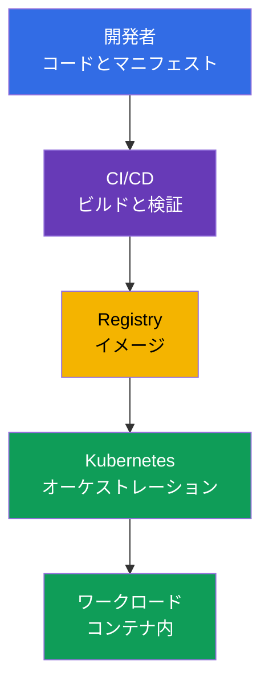
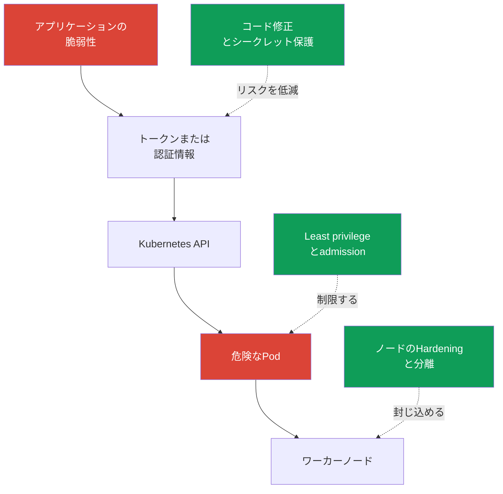

[Русская версия](ru.md) · [Eng version](README.md) · [Versión en español](es.md) · [Version française](fr.md) · [Deutsche Version](de.md) · [ქართული ვერსია](ge.md) · [繁體中文版](tw.md)

# 第02章 Cloud nativeとセキュリティが重要な理由

> **この先。** KCSAでは、セキュリティを個別の製品ではなく、アプリケーションのデリバリーと実行を担うシステム全体の特性として捉えます。Cloud nativeはコンテナ、オーケストレーション、自動化によって変更を迅速化しますが、同時に信頼境界の数も増加させます。この章では、コースの以降のトピックおよび **Overview of Cloud Native Security**（14%）ドメインのための共通の枠組みを示します。

## 02.1. Cloud nativeとCNCFエコシステムとは

**Cloud native** は、クラウドまたは分散インフラストラクチャで柔軟に動作するようシステムを設計する、アプリケーションの開発・運用アプローチです。アプリケーションを独立してデリバリー可能な小さな部分に分割し、コンテナにパッケージ化して、自動化により管理します。

CNCF（Cloud Native Computing Foundation）は、このランドスケープのオープンなプロジェクトとプラクティスを発展させています。Kubernetesもそのようなプロジェクトの一つです。コンテナ化されたワークロードを管理しますが、イメージ、コード、クラウド認証情報、ネットワークのセキュリティに取って代わるものではありません。

| Cloud nativeの考え方 | 得られるもの | セキュリティにおける変化 |
|---|---|---|
| コンテナ | アプリケーションと依存関係の再現可能なパッケージ | イメージは、ビルド、検証し、信頼できるレジストリから取得すべきアーティファクトになる |
| オーケストレーション | ワークロードの自動配置、スケーリング、復旧 | Kubernetes API、`ServiceAccount`、`Pod`、ネットワーク、ノードが制御点になる |
| マイクロサービス | 独立したチームと頻繁なデリバリー | サービス、API呼び出し、シークレット、ネットワーク経路の数が増える |
| 宣言型 | 望ましい状態をYAMLまたは他の設定コードで記述する | マニフェスト、Git、CI/CDがサプライチェーンの一部となり、検証が必要になる |

宣言型は特に重要です。チームは望ましい `Deployment` を記述し、Kubernetesコントローラーが実際の状態を記述された状態へと収束させます。そのため、マニフェスト内の安全でない設定は、rolloutごとに繰り返し再現される可能性があります。セキュリティでは、すでに実行中のコンテナだけでなく、適用前の変更も検証する必要があります。

この図には、セキュリティが「完了」する唯一の地点はありません。ソースコード、CI/CD、registry、Kubernetesの侵害は、悪意のあるワークロードの実行につながる可能性があります。以降の章では、このシステムをレイヤーと具体的なコントロールに分解します。

CNCFは現在、この領域を **TAG Security and Compliance**（Technical Advisory Group for Security and Compliance）を通じて推進しています。現在のCNCF構造では、旧 **TAG-Security** はアーカイブされています。旧TAG-Securityが作成した主要な資料の一つが **Cloud Native Security Whitepaper** です。これは、アーティファクトのセキュリティライフサイクルを **Develop → Distribute → Deploy → Runtime** の4段階で説明しています。associateレベルでは、コントロールが最後に追加されるのではなく、デリバリーの各段階に組み込まれるという考え方そのものが重要です。試験では、文書の正確なバージョン番号は重要ではありません。

CNCFエコシステムはプロジェクトを成熟度で分類します: **Sandbox**（初期または実験段階）→ **Incubating**（導入とプロジェクト成熟度の成長）→ **Graduated**（高い成熟度、持続可能なgovernance、実証済みのproduction adoption）。

現時点では、Falco、Open Policy Agent（OPA）、Kyverno、CiliumはCNCF Graduatedのステータスを持ちます。そのため、本コースではruntime detection、policy-as-code、networking/securityにおける成熟したcloud-native実装の例として便利です。

ただし、**Graduatedは「公式の業界標準」を意味するものではなく、KCSAが特定の製品を出題することを保証するものでもありません**。試験では、まずcompetencyとコントロール境界を記憶します: runtime detection、admission/policy engine、container networking、observabilityなどです。具体的なツールは、その機能を実装する例です。

プロジェクトのMaturity levelは変わり得るため、実際のアーキテクチャで使用する前に、[CNCFプロジェクトページ](https://www.cncf.io/projects/)で最新のステータスを確認してください。

## 02.2. セキュリティが重要である理由

Cloud nativeは、コード変更からproductionまでの経路を短縮します。これは有用ですが、エラーも同様に速く広がります。誤った `Deployment` template、CI変数内のトークン、または公開アクセス可能なregistryは、数分で多数の環境に広がる可能性があります。

Kubernetesの動的性は、次のような特性をもたらします:

- `Pod` は通常、短命です。調査は、消失したコンテナのファイルシステムだけに依存すべきではありません - 監査、ログ、検証可能なデリバリー履歴が重要です。
- ワークロードは自動的にスケーリングおよび再作成されます。危険な宣言は、ソースが修正されるまでコントローラーによって再現されます。
- 複数のチームとサービスが共通のインフラストラクチャを使用します。権限またはネットワーク分離の誤りにより、あるサービスから別のサービスへ移動できる可能性があります。
- 管理はAPIを通じて行われます。認証情報、アクセス権、admission検証は、クラスターの攻撃面全体に影響します。

セキュリティはデリバリー速度と矛盾しません。目標は、安全な経路を標準かつ自動化されたものにすることです。最小限のイメージをビルドし、依存関係を検証し、最小権限を適用し、明らかに危険な設定をproductionの前で拒否します。各変更を手作業で検証することはスケールしませんが、CI/CDとKubernetesにおける再現可能なコントロールはデリバリーとともにスケールします。

## 02.3. Cloud nativeの攻撃面

**攻撃面** は、攻撃者がアクセスを取得し、コードを実行し、権限を昇格させ、またはデータを取り出せるすべての点の総体です。Cloud nativeにおいてはクラスターの前から始まり、コンテナの境界で終わるものではありません。

| 領域 | 典型的なリスク | コントロールの例 |
|---|---|---|
| イメージ | 脆弱なライブラリ、イメージレイヤー内のシークレット、検証されていない来歴 | スキャン、最小イメージ、immutable digest、署名 |
| ランタイム | プロセスが過剰なLinux capabilitiesを取得する、またはホストへの脱出を試みる | `securityContext`、seccomp、non-root、sandboxランタイム |
| クラスター | 過度に広い権限、安全でない `Pod`、公開されたcontrol planeコンポーネント | RBAC、Pod Security Admission、TLS、audit logging |
| クラウドとインフラストラクチャ | 窃取されたIAM認証情報、metadata serviceへのアクセス、保護されていないワーカーノード | IAMのleast privilege、IMDSの制限、OS hardening、ネットワーク境界 |
| サプライチェーン | コード、依存関係、CI/CD、アーティファクトの改ざん | review、SCA、分離ビルド、SBOM、署名検証 |

コンテナは完全なセキュリティ境界ではありません。`Pod` が過剰な権限を持つトークンを受け取り、metadata serviceにアクセスでき、またはcontainer runtimeのソケットをマウントしている場合、正しくビルドされたイメージであってもリスクは解消されません。逆に、厳格なKubernetesポリシーも、すでにイメージに入った悪意のある依存関係を修正することはできません。

個別のツールではなく、シナリオで考えることが有用です。たとえば、攻撃者はWebアプリケーションの脆弱性を悪用し、`ServiceAccount` トークンを読み取り、Kubernetes APIを呼び出して、特権 `Pod` を作成する可能性があります。このチェーンは異なるコントロールによって中断されます: 安全なコード、制限されたトークン権限、admission policy、ノード保護です。

## 02.4. セキュリティの基本原則

これらの原則は、MCQ（multiple choice question、選択問題）で正しい回答を選び、アーキテクチャ上の判断を評価する助けになります。これらは単一の特定のKubernetesオブジェクトではありません。通常、一つの原則は複数のコントロールによって実装されます。

### Defense in depth

**Defense in depth** は、複数の独立した防御レイヤーです。一つのコントロールが機能しなかった場合、次のコントロールが影響を制限します。たとえば、イメージスキャンは脆弱性が存在しないことを保証しないため、non-root実行、`NetworkPolicy`、RBAC、モニタリングで補完します。

誤った結論は、「複数のレイヤーがあるなら、それぞれを弱めてもよい」というものです。反対に、レイヤーは異なる失敗を補う必要があります。`ServiceAccount` の権限制限を、単一のアンチウイルスまたはイメージスキャナーで置き換えることはできません。

### Least privilege

**Least privilege** は、主体に対して特定のタスクに必要な権限だけを、必要最小限の期間だけ与えることです。主体はユーザー、`ServiceAccount`、クラウドロール、コンテナプロセス、CI/CDのいずれでもあり得ます。

例: クラスター全体に対する `ClusterRoleBinding` ではなく一つの `Namespace` 内の `Role`、必要なcapabilityのみを限定して戻す `capabilities.drop: ["ALL"]`、管理者権限ではなく一つのリソースにアクセスできるクラウドロールです。Least privilegeは、認証情報またはプロセスが侵害された場合の損害を減らします。

### Zero trust

**Zero trust** は、ネットワーク内の場所、`Namespace` の名前、またはクラスターへの所属だけを理由に、リクエストを信頼済みと見なさないことです。すべてのアクセスは、検証可能なidentity、認証、認可、ポリシーコンテキストに基づく必要があります。

Kubernetesでは、これは内部トラフィックを自動的に安全とみなすべきではないことを意味します。`NetworkPolicy`、mTLS、`ServiceAccount`、RBACは、誰がリソースにアクセスしているのか、何を許可されているのかを検証する助けになります。Zero trustは「誰も一切信頼しない」という意味ではありません - 暗黙の信頼を排除することです。

### Immutability

**Immutability** は、デリバリー後に実行環境を手作業で変更しないことです。その代わりに、新しい検証可能なアーティファクトを作成し、新しいバージョンをデプロイします。digestを持つイメージ、宣言型manifest、Git履歴により、実行されているものを理解できます。

コンテナを `kubectl exec` コマンドで修正した場合、変更は `Pod` の再作成後に消え、再現可能なデリバリーの一部にもなりません。正しい経路は、コードまたはマニフェストを変更し、アーティファクトを再度ビルドして検証した後、rolloutを実行することです。Immutabilityはロールバックと調査を容易にしますが、イメージとは別にシークレットを保存する必要性をなくすものではありません。

### Shared responsibility

**Shared responsibility** は、保護の責任がインフラストラクチャプロバイダーとプラットフォーム利用者に分担されることです。managed Kubernetesでは、プロバイダーがcontrol planeの一部を担当する場合がありますが、利用者はIAM、ワークロード設定、データ、権限、ネットワークルールについて引き続き責任を負います。self-managedクラスターでは、チームの責任範囲は通常より広くなります。

正確な境界はサービスと契約に依存します。そのため、managed Kubernetesがクラスター内のすべてを自動的に保護すると考えることはできません。このモデルは第04章で詳しく説明します。

## 02.5. 実務での適用方法

- チームは安全な経路を標準にします: `Deployment` テンプレートはnon-root実行を使用し、イメージは許可されたregistryから取得され、CI/CDはmerge前に依存関係と設定を検証します。
- 権限は個別のidentityに付与します。すべてのアプリケーションで一つの `ServiceAccount` を使うことや、「念のため」のクラウド管理者ロールはleast privilegeに反します。
- コントロールをチェーンに沿って配置します: コードと依存関係の保護、ビルドの検証、イメージの検証、クラスターでのadmission、ランタイムの制限、イベントの監視です。
- productionでの変更はGitと宣言型rolloutを通じて行います。稼働中の `Pod` の手作業による修正は診断には適しますが、恒久的なデリバリーには適しません。
- インシデントを分析する際は、脆弱性だけでなく、どのレイヤーがそれを止めるべきだったかも調べます。これにより、defense in depthをどこで強化すべきかが分かります。

## 02.6. Exam vocabulary / ミニ用語集

- **cloud native** - コンテナ、自動化、分散インフラストラクチャを用いてアプリケーションを作成・運用するアプローチ。
- **CNCF** - Cloud Native Computing Foundation、cloud nativeプロジェクトの財団およびエコシステム。
- **攻撃面** - 不正アクセス、コード実行、データ取得が可能となるすべての点。
- **defense in depth** - 複数の独立した防御レイヤー。
- **least privilege** - 必要最小限の権限だけを付与すること。
- **zero trust** - ネットワーク上の場所やシステムへの所属に基づいて、リクエストを暗黙に信頼しないこと。
- **immutability** - すでに稼働している環境を手作業で変更する代わりに、新しい検証可能なアーティファクトをデリバリーすること。
- **shared responsibility** - 保護の責任をプロバイダーと利用者に分担すること。
- **supply chain** - ソースコードと依存関係からアーティファクトの実行までのデリバリーチェーン。

## 02.7. Exam Essentials / 章の要点

- Cloud nativeはコンテナ、オーケストレーション、マイクロサービス、宣言型管理を組み合わせます。各要素はそれぞれのコントロールポイントを生み出します。
- 高速で自動化されたデリバリーには、自動化されたsecurity checksが必要です。そうでなければ、エラーも同じ速さでproductionに到達します。
- 攻撃面には、イメージ、ランタイム、クラスター、クラウドインフラストラクチャ、サプライチェーンが含まれます。
- コンテナのセキュリティはその分離だけに依存しません。アクセス権、ネットワーク、トークン、ノード保護、アーティファクトの来歴を考慮する必要があります。
- Defense in depth、least privilege、zero trust、immutability、shared responsibilityは、後続するすべてのKCSAトピックの横断的な枠組みを定めます。

## 02.8. 混同しやすい点と試験での出題方法

KCSAの問題は通常、原則の目的や、状況に対するコントロールの選択を問います。似た表現を注意深く区別してください:

- 一つの攻撃チェーンに対する複数の異なるコントロール - defense in depth;
- `ServiceAccount`、IAMロール、プロセスに必要な権限だけを与える - least privilege;
- 内部リクエストに対してもidentityとポリシーを検証する - zero trust;
- 実行中のコンテナを変更する代わりに、digestを持つ新しいイメージを使用する - immutability;
- managedサービスと利用者の間で責任を分担する - shared responsibility.

典型的な試験の罠は、一つの強力なツールが他のすべてを置き換えられると考えることです。イメージスキャナー、RBAC、暗号化はタスクの異なる部分を解決するものであり、通常は互いを補完します。

## 02.9. 自己確認問題

### 1. セキュリティの観点から、Kubernetesの宣言型を最もよく表す記述はどれですか？

   - a. コンテナは起動後、自動的に信頼済みになります。
   - b. `kubectl exec` は変更を元のmanifestに固定します。
   - c. 宣言型によりCI/CDは不要になります。
   - d. manifest内の安全でない設定は、rollout時に自動的に再現される可能性があります。

回答と解説

**正解: d.** コントローラーは実際の状態を記述された状態へと収束させます。そのため、誤ったtemplateは設定のソースが変更されるまで、安全でないワークロードを繰り返し作成します。

### 2. Kubernetes上のアプリケーションにおけるdefense in depthを最もよく示す組み合わせはどれですか？

   - a. ネットワーク制限のない、一つの共通 `Namespace`。
   - b. 依存関係の検証、制限された `ServiceAccount` 権限、admission policy、`NetworkPolicy`。
   - c. 公開前にイメージをスキャンすることだけ。
   - d. 運用チームに対する管理者 `ClusterRoleBinding` だけ。

回答と解説

**正解: b.** これは異なる段階とレイヤーにある独立したコントロールです。それぞれが、他の失敗の可能性または影響を低減します。

### 3. 開発者には、一つの `Namespace` 内の `ConfigMap` への読み取り専用アクセスだけが必要です。least privilegeに適合する解決策はどれですか？

   - a. 開発者が追加の制限なしに任意のnamespaceのConfigMapを読めるように、`cluster-admin` を含む `ClusterRoleBinding` を作成する。

   - b. 必要なnamespaceにRoleを作成するが、ConfigMapに対して `create`、`update`、`delete`、`patch` を付与する。

   - c. 必要なnamespaceに、ConfigMapに必要なread verbsだけを持つRoleを作成し、それを開発者のidentityにバインドする。

   - d. これらのhost privilegesがKubernetes API authorizationを置き換えるように、開発者にワーカーノード上のLinux capabilitiesを追加する。

回答と解説

**正解: c.** Least privilegeは、API permissionsを必要なリソース、必要な操作、最小限のスコープに制限します。クラスター全体の `cluster-admin` は要件より大幅に広く、write verbsはread-onlyタスクに適合せず、Linux capabilitiesはKubernetes API permissionsを提供しません。

### 4. productionで不具合を修正する際のimmutabilityの例はどれですか？

   - a. 新しい `Pod` をより速く起動できるように、admission検証を無効にする。
   - b. 過去の状態を保存しないように、ログを削除する。
   - c. ソースコードまたはmanifestを修正し、新しい検証可能なイメージをビルドしてrolloutを実行する。
   - d. `kubectl exec` を通じて実行中コンテナ内のファイルを変更し、`Pod` をそのまま動作させる。

回答と解説

**正解: c.** 変更は再現可能なデリバリーチェーンに組み込まれ、検証またはロールバックが可能です。実行中コンテナの手作業による変更は一時的であり、正しいアーティファクトを残しません。

> **次に進むには。** Cloud、Cluster、Container、Codeのレイヤーモデルは、CKSの第02章で実践的なレベルで説明されています。このコースでは、4Cを統一されたcloud native securityモデルとして示す[第03章](../03/jp.md)へ進んでください。

---
[目次](../README_JP.md) · [第01章](../01/jp.md) · [第03章](../03/jp.md)