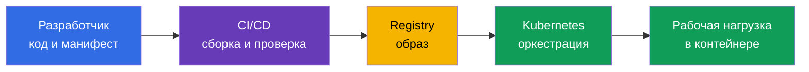
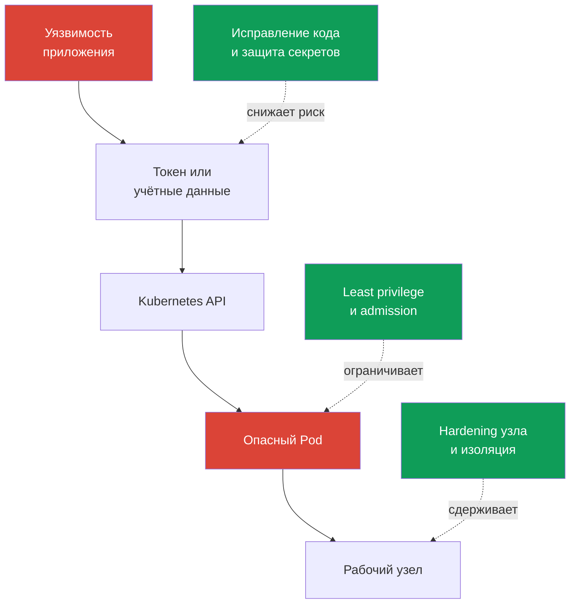

> **Язык:** русский. Переводы будут добавлены после публикации соответствующих файлов.

# Глава 02. Cloud native и почему безопасность

> **Что дальше.** KCSA рассматривает безопасность не как отдельный продукт, а как свойство всей системы доставки и запуска приложений. Cloud native ускоряет изменения за счёт контейнеров, оркестрации и автоматизации, но одновременно расширяет число границ доверия. Эта глава задаёт общую рамку для следующих тем курса и для домена **Overview of Cloud Native Security** (14%).

## 02.1. Что такое cloud native и экосистема CNCF

**Cloud native** - подход к разработке и эксплуатации приложений, при котором систему проектируют для гибкой работы в облачной или распределённой инфраструктуре. Приложение разбивают на небольшие независимо поставляемые части, упаковывают в контейнеры и управляют ими через автоматизацию.

CNCF (Cloud Native Computing Foundation) развивает открытые проекты и практики этого ландшафта. Kubernetes - один из таких проектов: он управляет контейнеризированными рабочими нагрузками, но не заменяет безопасность образов, кода, облачных учётных данных или сети.

| Идея cloud native | Что она даёт | Что меняется для безопасности |
|---|---|---|
| Контейнеры | воспроизводимый пакет приложения и зависимостей | образ становится артефактом, который надо собирать, проверять и получать из доверенного реестра |
| Оркестрация | автоматическое размещение, масштабирование и восстановление рабочих нагрузок | Kubernetes API, `ServiceAccount`, `Pod`, сеть и узлы становятся точками контроля |
| Микросервисы | независимые команды и частые поставки | растёт число сервисов, API-вызовов, секретов и сетевых путей |
| Декларативность | желаемое состояние описывают в YAML или другом коде конфигурации | манифесты, Git и CI/CD становятся частью цепочки поставки и требуют проверки |

Декларативность особенно важна. Команда описывает желаемый `Deployment`, а контроллер Kubernetes приводит фактическое состояние к описанному. Поэтому небезопасная настройка в манифесте может многократно воспроизводиться при каждом rollout. Безопасность должна проверять не только уже работающий контейнер, но и изменения до их применения.

На схеме нет одной-единственной точки, после которой безопасность «закончилась». Компрометация исходного кода, CI/CD, registry или Kubernetes может привести к запуску вредоносной рабочей нагрузки. Следующие главы разложат эту систему на слои и конкретные контроли.

## 02.2. Почему безопасность критична

Cloud native сокращает путь от изменения кода до production. Это полезно, но ошибка распространяется так же быстро: один неверный template `Deployment`, токен в переменной CI или публично доступный registry способны попасть во множество сред за минуты.

Динамичность Kubernetes добавляет особенности:

- `Pod` обычно недолговечен. Расследование не должно опираться только на файловую систему исчезнувшего контейнера - важны аудит, логи и проверяемая история поставки.
- Рабочие нагрузки автоматически масштабируются и пересоздаются. Опасная декларация воспроизводится контроллером, пока не исправлен её источник.
- Несколько команд и сервисов используют общую инфраструктуру. Ошибка в правах или сетевой изоляции может дать возможность перемещаться от одного сервиса к другому.
- Управление идёт через API. Учётные данные, права доступа и admission-проверки влияют на всю поверхность кластера.

Безопасность не противоречит скорости доставки. Цель - сделать безопасный путь стандартным и автоматизированным: собирать минимальные образы, проверять зависимости, применять минимальные права и отклонять явно опасные конфигурации до production. Ручная проверка каждого изменения не масштабируется, а повторяемые контроли в CI/CD и Kubernetes масштабируются вместе с поставкой.

## 02.3. Поверхность атаки cloud native

**Поверхность атаки** - совокупность точек, через которые атакующий может получить доступ, выполнить код, повысить привилегии или извлечь данные. В cloud native она начинается до кластера и не заканчивается границей контейнера.

| Область | Типичный риск | Пример контроля |
|---|---|---|
| Образ | уязвимая библиотека, секрет в слое образа, неподтверждённое происхождение | сканирование, минимальный образ, immutable digest, подпись |
| Рантайм | процесс получает лишние Linux capabilities или пытается выйти к хосту | `securityContext`, seccomp, non-root, sandbox-рантайм |
| Кластер | слишком широкие права, небезопасный `Pod`, открытый компонент control plane | RBAC, Pod Security Admission, TLS, audit logging |
| Облако и инфраструктура | украденные IAM-креды, доступ к metadata service, незащищённый рабочий узел | least privilege в IAM, ограничение IMDS, hardening ОС, сетевой периметр |
| Цепочка поставок | подмена кода, зависимости, CI/CD или артефакта | review, SCA, изолированная сборка, SBOM, верификация подписи |

Контейнер не является полной границей безопасности. Если `Pod` получает токен с избыточными разрешениями, доступ к metadata service или монтирует сокет container runtime, то даже корректно собранный образ не устраняет риск. И наоборот, строгая политика Kubernetes не исправит вредоносную зависимость, уже попавшую в образ.

Полезно мыслить сценариями, а не отдельными инструментами. Например, атакующий может эксплуатировать уязвимость веб-приложения, прочитать токен `ServiceAccount`, вызвать Kubernetes API и создать привилегированный `Pod`. Цепочку прерывают разные контроли: безопасный код, ограниченные права токена, admission policy и защита узла.

## 02.4. Базовые принципы безопасности

Эти принципы помогают выбрать верный ответ в MCQ и оценить архитектурное решение. Они не являются одним конкретным Kubernetes-объектом: один принцип обычно реализуется несколькими контролями.

### Defense in depth

**Defense in depth** - несколько независимых уровней защиты. Если один контроль не сработал, следующий ограничивает последствия. Например, сканирование образа не гарантирует отсутствие уязвимости, поэтому его дополняют non-root запуском, `NetworkPolicy`, RBAC и мониторингом.

Ошибочный вывод: «несколько слоёв означают, что можно ослабить каждый». Наоборот, слои должны компенсировать разные отказы. Нельзя заменить ограничение прав `ServiceAccount` одним антивирусом или сканером образов.

### Least privilege

**Least privilege** - субъект получает только те права, которые нужны для конкретной задачи, и на минимально необходимое время. Субъектом может быть пользователь, `ServiceAccount`, облачная роль, процесс контейнера или CI/CD.

Примеры: `Role` в одном `Namespace` вместо `ClusterRoleBinding` на весь кластер; `capabilities.drop: ["ALL"]` с точечным возвратом нужной capability; облачная роль с доступом к одному ресурсу вместо административных прав. Least privilege уменьшает ущерб, если учётные данные или процесс скомпрометированы.

### Zero trust

**Zero trust** - не считать запрос доверенным только из-за его места в сети, имени `Namespace` или принадлежности к кластеру. Каждый доступ должен опираться на проверяемую identity, аутентификацию, авторизацию и контекст политики.

В Kubernetes это означает, что внутренний трафик не следует автоматически считать безопасным. `NetworkPolicy`, mTLS, `ServiceAccount` и RBAC помогают проверять, кто обращается к ресурсу и что ему разрешено. Zero trust не означает «не доверять никому вообще» - это отказ от неявного доверия.

### Immutability

**Immutability** - рабочую среду не изменяют вручную после поставки; вместо этого создают новый проверяемый артефакт и разворачивают новую версию. Образ с digest, декларативный manifest и Git-история позволяют понять, что именно запущено.

Если исправлять контейнер командой `kubectl exec`, изменение исчезнет после пересоздания `Pod` и не будет частью воспроизводимой поставки. Правильный путь - изменить код или манифест, снова собрать и проверить артефакт, затем выполнить rollout. Immutability облегчает откат и расследование, но не отменяет необходимость хранить секреты отдельно от образа.

### Shared responsibility

**Shared responsibility** - обязанности по защите распределены между провайдером инфраструктуры и пользователем платформы. В управляемом Kubernetes провайдер может отвечать за часть control plane, но пользователь по-прежнему отвечает за IAM, конфигурацию рабочих нагрузок, данные, права и сетевые правила. В self-managed кластере зона ответственности команды обычно шире.

Точная граница зависит от сервиса и договора. Поэтому нельзя считать, что managed Kubernetes автоматически защищает всё внутри кластера. Модель будет подробно разобрана в главе 04.

## 02.5. Как это применяют на практике

- Команда делает безопасный путь стандартом: шаблоны `Deployment` используют non-root запуск, образы получают из разрешённых registry, а CI/CD проверяет зависимости и конфигурацию до merge.
- Права выдаются отдельным identity. Один `ServiceAccount` для всех приложений и облачная роль администратора «на всякий случай» противоречат least privilege.
- Контроли располагают по цепочке: защита кода и зависимостей, проверка сборки, верификация образа, admission в кластере, ограничение рантайма и наблюдение за событиями.
- Изменения в production проводят через Git и декларативный rollout. Ручное исправление живого `Pod` годится для диагностики, но не как постоянная поставка.
- При разборе инцидента выясняют не только уязвимость, но и какие слои её должны были остановить: это показывает, где усилить defense in depth.

## 02.6. Exam vocabulary / Мини-глоссарий

- **cloud native** - подход к созданию и эксплуатации приложений с контейнерами, автоматизацией и распределённой инфраструктурой.
- **CNCF** - Cloud Native Computing Foundation, фонд и экосистема проектов cloud native.
- **поверхность атаки** - все точки, через которые возможны несанкционированный доступ, выполнение кода или получение данных.
- **defense in depth** - несколько независимых слоёв защиты.
- **least privilege** - предоставление только минимально нужных прав.
- **zero trust** - отсутствие неявного доверия к запросу по месту в сети или принадлежности к системе.
- **immutability** - поставка новых проверяемых артефактов вместо ручного изменения уже работающей среды.
- **shared responsibility** - распределение обязанностей по защите между провайдером и пользователем.
- **supply chain** - цепочка поставки от исходного кода и зависимостей до запуска артефакта.

## 02.7. Exam Essentials / Итоги главы

- Cloud native объединяет контейнеры, оркестрацию, микросервисы и декларативное управление; каждый элемент создаёт свои точки контроля.
- Быстрая и автоматизированная поставка требует автоматизированных security checks, иначе ошибка так же быстро попадёт в production.
- Поверхность атаки включает образ, рантайм, кластер, облачную инфраструктуру и цепочку поставки.
- Безопасность контейнера зависит не только от его изоляции: необходимо учитывать права доступа, сеть, токены, защиту узла и происхождение артефакта.
- Defense in depth, least privilege, zero trust, immutability и shared responsibility задают сквозную рамку всех последующих тем KCSA.

## 02.8. Не путать и как это встречается на экзамене

На KCSA вопросы обычно проверяют назначение принципа или выбор контроля для ситуации. Внимательно различайте похожие формулировки:

- несколько разных контролей против одной цепочки атаки - defense in depth;
- только нужные разрешения у `ServiceAccount`, IAM-роли или процесса - least privilege;
- проверка identity и политики даже для внутреннего запроса - zero trust;
- новый образ по digest вместо изменения работающего контейнера - immutability;
- разделение обязанностей между managed-сервисом и пользователем - shared responsibility.

Типичная экзаменационная ловушка - считать, что один сильный инструмент заменит все остальные. Сканер образа, RBAC и шифрование решают разные части задачи и обычно дополняют друг друга.

## 02.9. Вопросы для самопроверки

### 1. Какое утверждение лучше всего описывает декларативность Kubernetes с точки зрения безопасности?

   - a. Контейнеры автоматически становятся доверенными после запуска.
   - b. `kubectl exec` фиксирует изменение в исходном manifest.
   - c. Декларативность устраняет необходимость в CI/CD.
   - d. Небезопасная конфигурация в manifest может автоматически воспроизводиться при rollout.

Ответ и разбор

**Верный ответ: d.** Контроллеры приводят фактическое состояние к описанному. Поэтому ошибочный template повторно создаёт небезопасные рабочие нагрузки, пока не изменён источник конфигурации.

### 2. Какая комбинация лучше иллюстрирует defense in depth для приложения в Kubernetes?

   - a. Один общий `Namespace` без сетевых ограничений.
   - b. Проверка зависимостей, ограниченные права `ServiceAccount`, admission policy и `NetworkPolicy`.
   - c. Только сканирование образа перед публикацией.
   - d. Только `ClusterRoleBinding` администратора для команды эксплуатации.

Ответ и разбор

**Верный ответ: b.** Это независимые контроли на разных этапах и слоях. Каждый снижает вероятность или последствия другого отказа.

### 3. Разработчику нужен доступ только на чтение `ConfigMap` в одном `Namespace`. Какое решение соответствует least privilege?

   - a. Создать `ClusterRoleBinding` с `cluster-admin`, чтобы чтение точно не блокировалось.
   - b. Разрешить неаутентифицированный доступ к API из внутренней сети.
   - c. Создать `Role` только с нужными verb для `ConfigMap` в этом `Namespace` и привязать её к identity.
   - d. Дать workload расширенные Linux capabilities, чтобы он мог читать Kubernetes API.

Ответ и разбор

**Верный ответ: c.** Least privilege ограничивает права нужным ресурсом, нужными действиями и минимальной областью. `cluster-admin` существенно шире требования, отключение authentication ослабляет контроль доступа, а Linux capabilities не предоставляют Kubernetes API permissions.

### 4. Что является примером immutability при устранении дефекта в production?

   - a. Отключить admission-проверки, чтобы новый `Pod` запустился быстрее.
   - b. Удалить журналы, чтобы не хранить старое состояние.
   - c. Исправить исходный код или manifest, собрать новый проверяемый образ и выполнить rollout.
   - d. Изменить файлы в работающем контейнере через `kubectl exec` и оставить `Pod` работать.

Ответ и разбор

**Верный ответ: c.** Изменение входит в воспроизводимую цепочку поставки и может быть проверено или откатано. Ручное изменение живого контейнера временно и не оставляет корректного артефакта.

> **Куда дальше.** Модель слоёв Cloud, Cluster, Container и Code разобрана в главе 02 CKS на практическом уровне. В этом курсе продолжайте с [главы 03](../03/ru.md), где 4C показаны как единая модель cloud native security.

---
[Оглавление](../README_RU.md) · [Глава 01](../01/ru.md) · [Глава 03](../03/ru.md)
