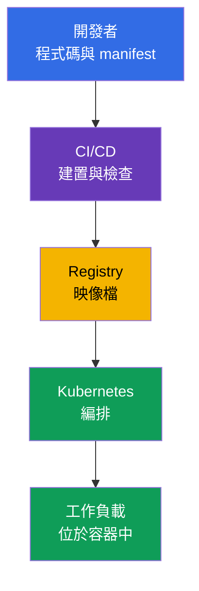
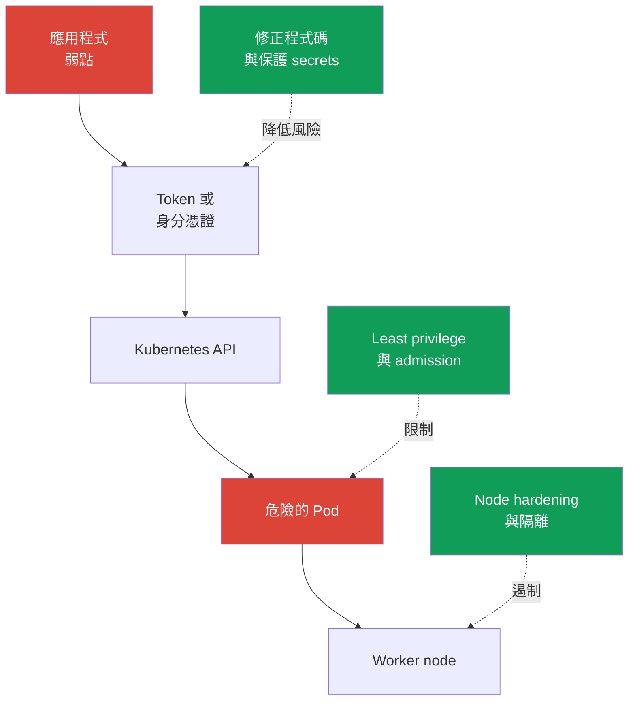

[Русская версия](ru.md) · [Eng version](README.md) · [Versión en español](es.md) · [Version française](fr.md) · [Deutsche Version](de.md) · [ქართული ვერსია](ge.md) · [日本語版](jp.md)

# 第 02 章。Cloud native 與安全性的重要原因

> **接下來的內容。** KCSA 並不將安全性視為獨立產品，而是將其視為應用程式交付與執行整個系統的特性。Cloud native 藉由容器、編排與自動化加速變更，但也同時擴大信任邊界的數量。本章為課程後續主題及 **Overview of Cloud Native Security** 領域（14%）建立整體框架。

## 02.1. 什麼是 cloud native 與 CNCF 生態系統

**Cloud native** 是一種應用程式開發與營運方法，系統被設計為能在雲端或分散式基礎架構中彈性運作。應用程式會拆分為可獨立交付的小型元件、封裝至容器中，並透過自動化加以管理。

CNCF（Cloud Native Computing Foundation）推動此生態系統的開放原始碼專案與實務。Kubernetes 是其中一個專案：它管理容器化工作負載，但不會取代映像檔、程式碼、雲端身分憑證或網路的安全性。

| Cloud native 概念 | 帶來的作用 | 安全性上的變化 |
|---|---|---|
| 容器 | 可重現的應用程式及相依性套件 | 映像檔成為必須建置、檢查並從受信任 registry 取得的產物 |
| 編排 | 工作負載的自動放置、擴展與復原 | Kubernetes API、`ServiceAccount`、`Pod`、網路與節點成為控制點 |
| 微服務 | 獨立團隊與頻繁交付 | 服務、API 呼叫、secrets 與網路路徑的數量增加 |
| 宣告式 | 以 YAML 或其他設定程式碼描述期望狀態 | manifests、Git 與 CI/CD 成為供應鏈的一部分，並需要接受檢查 |

宣告式尤其重要。團隊描述期望的 `Deployment`，而 Kubernetes controller 會使實際狀態與描述一致。因此，manifest 中不安全的設定可能在每次 rollout 時重複出現。安全性不僅必須檢查已在執行的容器，也必須檢查變更套用之前的內容。

圖中沒有某個單一節點，通過之後安全性就「完成」了。原始碼、CI/CD、registry 或 Kubernetes 任一環節遭到入侵，都可能導致惡意工作負載啟動。接下來的章節將此系統拆解為各個層級與具體控制措施。

CNCF 現在透過 **TAG Security and Compliance**（Technical Advisory Group for Security and Compliance）推動此方向。在目前的 CNCF 組織架構中，舊有的 **TAG-Security** 已歸檔。由舊 TAG-Security 製作的一份關鍵資料是 **Cloud Native Security Whitepaper**；它透過四個階段描述產物的安全生命週期：**Develop → Distribute → Deploy → Runtime**。在 associate 層級，重要的是這個概念本身 - 控制措施內建在交付的每個階段，而非只在最後才加入。考試不重視文件的確切版本號。

CNCF 生態系統依成熟度分類專案：**Sandbox**（早期或實驗階段）→ **Incubating**（專案採用度與成熟度持續成長）→ **Graduated**（高成熟度、穩定 governance 與已證實的 production adoption）。

截至目前，Falco、Open Policy Agent（OPA）、Kyverno 與 Cilium 均為 CNCF Graduated，因此在本課程中可作為成熟 cloud-native 實作的範例，分別用於 runtime detection、policy-as-code 以及 networking/security。

不過，**Graduated 並不表示「官方產業標準」，也不保證 KCSA 一定考查特定產品**。考試時，先記住 competency 與控制邊界：runtime detection、admission/policy engine、container networking、observability 等。具體工具只是實作此功能的範例。

專案的 maturity level 可能變動，因此在實際架構中使用前，請在 [CNCF 專案頁面](https://www.cncf.io/projects/)確認最新狀態。

## 02.2. 為什麼安全性至關重要

Cloud native 縮短了從程式碼變更到 production 的路徑。這很有益，但錯誤也會同樣迅速擴散：一個錯誤的 `Deployment` template、CI 變數中的 token，或可公開存取的 registry，可能在數分鐘內進入多個環境。

Kubernetes 的動態特性帶來了以下特點：

- `Pod` 通常生命週期短暫。調查不應僅依賴已消失容器的檔案系統 - audit、logs 與可驗證的交付歷程都很重要。
- 工作負載會自動擴展與重建。危險的宣告會被 controller 重複產生，直到其來源被修正。
- 多個團隊與服務共用基礎架構。權限或網路隔離的錯誤可能允許從一個服務橫向移動至另一個服務。
- 管理透過 API 進行。身分憑證、存取權限與 admission 檢查會影響整個 cluster attack surface。

安全性並不與交付速度衝突。目標是讓安全路徑成為標準且自動化的路徑：建置最小化映像檔、檢查相依性、套用最小權限，並在進入 production 前拒絕明顯危險的設定。手動檢查每次變更無法擴展，而 CI/CD 與 Kubernetes 中可重複的控制措施能隨交付一同擴展。

## 02.3. Cloud native 的 attack surface

**Attack surface** 是攻擊者可藉以取得存取權、執行程式碼、提升權限或擷取資料的所有接觸點集合。在 cloud native 中，它在 cluster 之前就已開始，且不會在容器邊界結束。

| 領域 | 典型風險 | 控制措施範例 |
|---|---|---|
| 映像檔 | 易受攻擊的程式庫、映像檔 layer 中的 secret、未確認的來源 | 掃描、最小化映像檔、immutable digest、簽章 |
| Runtime | 處理程序取得過多 Linux capabilities，或嘗試逃逸至 host | `securityContext`、seccomp、non-root、sandbox runtime |
| Cluster | 權限過於寬廣、不安全的 `Pod`、暴露的 control plane 元件 | RBAC、Pod Security Admission、TLS、audit logging |
| Cloud 與基礎架構 | 遭竊的 IAM credentials、對 metadata service 的存取、未受保護的 worker node | IAM 中的 least privilege、限制 IMDS、OS hardening、network perimeter |
| Supply chain | 程式碼、相依性、CI/CD 或產物遭竄改 | review、SCA、隔離的 build、SBOM、簽章驗證 |

容器並非完整的安全邊界。若 `Pod` 取得具有過度權限的 token、可存取 metadata service，或掛載 container runtime socket，即使映像檔建置正確，風險仍未消除。反之，嚴格的 Kubernetes policy 也無法修正已進入映像檔的惡意相依性。

以情境而非單一工具思考會更有幫助。例如，攻擊者可能利用 web application vulnerability、讀取 `ServiceAccount` token、呼叫 Kubernetes API，並建立 privileged `Pod`。不同的控制措施會中斷此鏈條：安全的程式碼、受限的 token 權限、admission policy 與 node protection。

## 02.4. 基本安全性原則

這些原則有助於在 MCQ（multiple choice question，選擇題）中選出正確答案，也有助於評估架構決策。它們不是單一的 Kubernetes 物件：一項原則通常透過多項控制措施實作。

### Defense in depth

**Defense in depth** 是多個獨立的防護層。若一項控制措施失效，下一層會限制其後果。例如，映像檔掃描無法保證不存在弱點，因此還要搭配 non-root 執行、`NetworkPolicy`、RBAC 與監控。

錯誤的結論是：「多層防護表示每一層都可以放鬆」。恰恰相反，各層應補償不同的失效情況。不能以單一 antivirus 或 image scanner 取代 `ServiceAccount` 權限限制。

### Least privilege

**Least privilege** 是指主體只取得完成特定工作所需的權限，且時間僅限於最低必要期間。主體可以是使用者、`ServiceAccount`、cloud role、container process 或 CI/CD。

範例：在一個 `Namespace` 中使用 `Role`，而非對整個 cluster 使用 `ClusterRoleBinding`；使用 `capabilities.drop: ["ALL"]`，再精確加回必要的 capability；cloud role 只能存取單一資源，而非具備管理權限。若身分憑證或處理程序遭入侵，least privilege 可減少損害。

### Zero trust

**Zero trust** 是指不因請求位於網路中的位置、`Namespace` 名稱或屬於 cluster，就將其視為可信任。每一次存取都應基於可驗證的 identity、authentication、authorization 與 policy context。

在 Kubernetes 中，這表示不應自動將內部流量視為安全。`NetworkPolicy`、mTLS、`ServiceAccount` 與 RBAC 有助於驗證誰在存取資源，以及該主體獲准做什麼。Zero trust 並非「完全不信任任何人」- 它是拒絕隱含信任。

### Immutability

**Immutability** 是指交付後不以手動方式變更執行環境；取而代之的是建立新的、可驗證的產物並部署新版本。具有 digest 的映像檔、宣告式 manifest 與 Git 歷程，可讓我們瞭解實際正在執行什麼。

若使用 `kubectl exec` 命令修正容器，該變更會在 `Pod` 重建後消失，也不會成為可重現交付的一部分。正確做法是修改程式碼或 manifest、再次建置並檢查產物，然後執行 rollout。Immutability 有助於回復與調查，但不會免除將 secrets 與映像檔分開存放的需求。

### Shared responsibility

**Shared responsibility** 是指基礎架構供應商與平台使用者之間分配保護責任。在 managed Kubernetes 中，供應商可能負責 control plane 的一部分，但使用者仍須負責 IAM、工作負載設定、資料、權限與網路規則。在 self-managed cluster 中，團隊的責任範圍通常更大。

精確邊界取決於服務與合約。因此，不能認為 managed Kubernetes 會自動保護 cluster 內的一切。此模型將在第 04 章詳細說明。

## 02.5. 如何在實務中套用

- 團隊讓安全路徑成為標準：`Deployment` templates 使用 non-root 執行，映像檔來自已核准的 registry，而 CI/CD 在 merge 前檢查相依性與設定。
- 權限會授與個別 identity。所有應用程式共用一個 `ServiceAccount`，或「以防萬一」地授與 administrator cloud role，都違反 least privilege。
- 控制措施沿著鏈條布置：保護程式碼與相依性、檢查 build、驗證映像檔、在 cluster 中 admission、限制 runtime，以及觀察事件。
- Production 變更透過 Git 與宣告式 rollout 進行。手動修正存活的 `Pod` 適合診斷，但不應作為永久交付方式。
- 分析 incident 時，不僅要找出弱點，也要釐清哪些層本應阻止它：這能指出應在何處強化 defense in depth。

## 02.6. Exam vocabulary / 迷你詞彙表

- **cloud native** - 使用容器、自動化與分散式基礎架構來建立及營運應用程式的方法。
- **CNCF** - Cloud Native Computing Foundation，cloud native 專案的基金會與生態系統。
- **attack surface** - 可能發生未經授權存取、程式碼執行或資料取得的所有接觸點。
- **defense in depth** - 多個獨立的防護層。
- **least privilege** - 僅授與最低必要權限。
- **zero trust** - 不因網路位置或系統歸屬而對請求產生隱含信任。
- **immutability** - 交付新的可驗證產物，而非手動修改已在執行的環境。
- **shared responsibility** - 供應商與使用者之間分配安全保護責任。
- **supply chain** - 從原始碼與相依性到產物執行的交付鏈。

## 02.7. Exam Essentials / 本章重點

- Cloud native 結合容器、編排、微服務與宣告式管理；每個元素都會建立各自的控制點。
- 快速且自動化的交付需要自動化 security checks，否則錯誤也會同樣迅速進入 production。
- Attack surface 包含映像檔、runtime、cluster、cloud infrastructure 與 supply chain。
- 容器的安全性不僅取決於其隔離性：還必須考量存取權限、網路、tokens、node protection 與產物來源。
- Defense in depth、least privilege、zero trust、immutability 與 shared responsibility 構成後續所有 KCSA 主題的貫穿框架。

## 02.8. 不要混淆，以及它們如何出現在考試中

KCSA 題目通常會考查某個原則的用途，或針對情境選擇控制措施。請仔細區分相似的說法：

- 多個不同控制措施對抗同一條攻擊鏈 - defense in depth；
- `ServiceAccount`、IAM role 或 process 僅有必要的權限 - least privilege；
- 即使是內部請求，也要驗證 identity 與 policy - zero trust；
- 使用依 digest 識別的新映像檔，而非變更正在執行的容器 - immutability；
- managed service 與使用者之間的責任劃分 - shared responsibility。

典型的考試陷阱是認為一項強大的工具可取代其他所有工具。Image scanner、RBAC 與 encryption 解決的是不同部分的問題，通常彼此互補。

## 02.9. 自我檢查題

### 1. 從安全性的觀點，哪一項敘述最能描述 Kubernetes 的宣告式？

   - a. 容器在啟動後會自動成為受信任的。
   - b. `kubectl exec` 會將變更寫入原始 manifest。
   - c. 宣告式消除了對 CI/CD 的需求。
   - d. manifest 中不安全的設定可能在 rollout 時自動重複產生。

答案與說明

**正確答案：d。** Controllers 會讓實際狀態與描述的狀態一致。因此，錯誤的 template 會重複建立不安全的工作負載，直到設定來源被修改。

### 2. 哪個組合最能說明 Kubernetes 應用程式的 defense in depth？

   - a. 一個共用的 `Namespace`，沒有網路限制。
   - b. 相依性檢查、受限的 `ServiceAccount` 權限、admission policy 與 `NetworkPolicy`。
   - c. 僅在發布前掃描映像檔。
   - d. 僅對維運團隊使用 administrator `ClusterRoleBinding`。

答案與說明

**正確答案：b。** 這些是在不同階段與層級的獨立控制措施。每一項都會降低其他失效的機率或後果。

### 3. 開發人員只需要讀取一個 `Namespace` 中的 `ConfigMap`。哪個解決方案符合 least privilege？

   - a. 建立具有 `cluster-admin` 的 `ClusterRoleBinding`，讓開發人員可在任何 namespace 讀取 ConfigMap，且無需額外限制。

   - b. 在所需 namespace 建立 Role，但對 ConfigMap 授與 `create`、`update`、`delete` 與 `patch`。

   - c. 在所需 namespace 中建立 Role，僅授與 ConfigMap 所需的 read verbs，並將其綁定至開發人員 identity。

   - d. 在 worker node 上為開發人員新增 Linux capabilities，使這些 host privileges 取代 Kubernetes API authorization。

答案與說明

**正確答案：c。** Least privilege 將 API permissions 限於所需資源、所需動作與最小範圍。全 cluster 的 `cluster-admin` 遠超過需求，write verbs 不符合 read-only 工作，而 Linux capabilities 並不提供 Kubernetes API permissions。

### 4. 在 production 中修正缺陷時，哪一項是 immutability 的範例？

   - a. 停用 admission checks，讓新的 `Pod` 更快啟動。
   - b. 刪除 logs，以免儲存舊狀態。
   - c. 修正原始碼或 manifest、建置新的可驗證映像檔，並執行 rollout。
   - d. 透過 `kubectl exec` 變更執行中容器的檔案，並讓該 `Pod` 繼續運作。

答案與說明

**正確答案：c。** 這項變更納入可重現的 supply chain，並可進行檢查或回復。手動變更存活容器只是暫時的，也不會留下正確的產物。

> **接下來。** Cloud、Cluster、Container 與 Code 的分層模型將在 CKS 第 02 章以實務層級說明。在本課程中，請繼續閱讀[第 03 章](../03/tw.md)，其中將 4C 呈現為統一的 cloud native security 模型。

---
[目錄](../README_TW.md) · [第 01 章](../01/tw.md) · [第 03 章](../03/tw.md)
