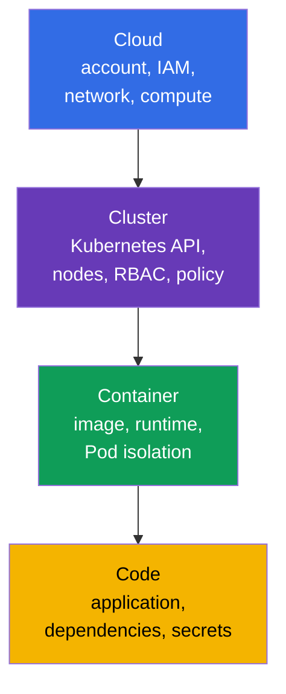
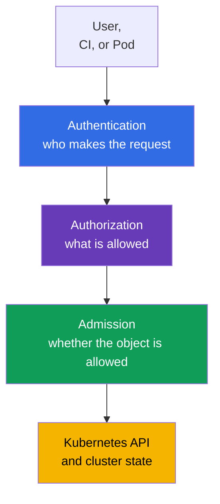
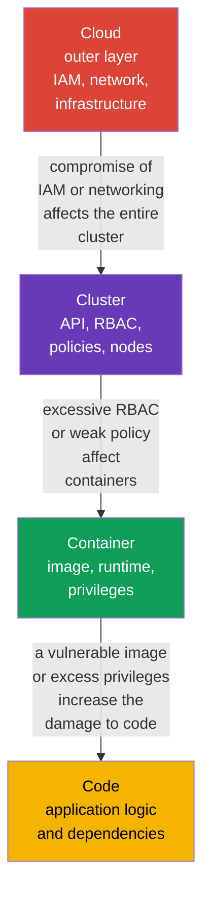

[Русская версия](ru.md) · [Versión en español](es.md) · [Version française](fr.md) · [Deutsche Version](de.md) · [ქართული ვერსია](ge.md) · [繁體中文版](tw.md) · [日本語版](jp.md)

# Chapter 03. The 4C Model of Cloud Security: Cloud, Cluster, Container, Code

> **What's next.** In the previous chapters, we defined cloud native, the attack surface, and fundamental security principles. Now we apply them to the **4C** model: Cloud, Cluster, Container, and Code. This is the foundation of the KCSA **Overview of Cloud Native Security** domain (14%): it helps you avoid looking for a single "magic" control and instead see at which layer the risk arose and who can reduce it.

## 03.1. The 4C model: four layers of protection

The 4C model divides a cloud native environment into four nested layers: **Cloud**, **Cluster**, **Container**, and **Code**. Each layer has its own attack surface, owners, and security controls.

- **Cloud** - the cloud provider account, network, IAM, virtual machines, disks, and managed services.
- **Cluster** - the Kubernetes API, control plane, worker nodes, RBAC, `NetworkPolicy`, and admission control.
- **Container** - the image, container runtime, `Pod` settings, and process isolation from the host.
- **Code** - application source code, its dependencies, configuration, and secret handling.

4C is not a product or a strict responsibility boundary. It is a way of thinking. For example, stolen IAM credentials belong to Cloud, but they may allow an attacker to read a snapshot containing Kubernetes data. A vulnerable dependency in Code can give an attacker command execution in a Container, while an insecure Cluster configuration can provide a path to other workloads' data.



The model does not mean that you must choose exactly one layer. Security is built as defense in depth: multiple independent barriers reduce the likelihood and impact of a compromise.

## 03.2. The Cloud layer: infrastructure, IAM, and the provider network

Cloud is the outer layer: the cloud account, organizations and projects, IAM, VPC/VNet, firewall or security groups, virtual machines, storage, and KMS. In managed Kubernetes, the provider operates part of the control plane, but the customer remains responsible for securely configuring their account, identities, and data.

The primary danger at this layer is overly broad cloud permissions. A credential with administrator privileges leaked from CI or a `Pod` can create new VMs, read object storage, modify network rules, or grant additional permissions. Therefore, cloud roles should be separated by purpose and follow least privilege, while the credentials, tokens, or role sessions issued to use them should be short-lived and, where applicable, automatically refreshed or rotated.

| Cloud risk | Conceptual-level control | What it reduces |
|---|---|---|
| Cloud key leak | workload identity, short-lived tokens, rotation | use of a static key outside the required task |
| Open network perimeter | security groups, firewall, private endpoint | access to APIs and services from untrusted networks |
| Loss or theft of data on a disk | encryption at rest, KMS, and restricted key access | reading data from a snapshot or stolen media |
| Overly broad role | separate IAM roles for people, CI, and workloads | privilege escalation when one identity is compromised |

The cloud provider is responsible for the security of its own infrastructure, but shared responsibility does not relieve the team of configuring IAM, networking, data access, and workloads. These details are covered in the next chapter.

## 03.3. The Cluster layer: Kubernetes as a management boundary

Cluster covers Kubernetes components and the rules by which a `Pod` obtains access to the API, network, and data. This layer includes the API server, `etcd`, kubelet on worker nodes, ServiceAccount, RBAC, `Namespace`, `NetworkPolicy`, Pod Security Admission, and audit logging.

The Kubernetes API is the central management point. If an identity can create `Pod`, read `Secret`, or modify `RoleBinding`, the consequences can exceed those of compromising a single container. Authentication, authorization, and admission control are therefore important in a cluster:



RBAC answers the question "who can perform an action," but it does not check whether `Pod` fields are secure. Pod Security Admission and other policy controls can reject, for example, a privileged `Pod` even if the user is allowed to create `Pod`. `NetworkPolicy` restricts permitted flows between workloads, while auditing helps detect dangerous actions.

A common mistake is to consider a `Namespace` complete isolation. It separates object names and often serves as a policy boundary, but it does not by itself block network traffic, grant least-privilege RBAC, or make a `Pod` secure.

## 03.4. The Container layer: image, runtime, and isolation

A Container is not a virtual machine. Containers on the same worker node share the host kernel, while the container runtime creates isolation through Linux namespaces, cgroups, capabilities, and other mechanisms. Therefore, an insecure container can become the initial point of attack against the node or neighboring workloads.

At this layer, analyze the image before it runs and the restrictions applied at runtime:

| Area | Example control | Why it is needed |
|---|---|---|
| Image | trusted registry, pinned digest, vulnerability scanning | avoid running an unknown or vulnerable artifact |
| Process user | non-root UID and `runAsNonRoot: true` | reduce the impact of code execution in the container |
| Privileges | `allowPrivilegeEscalation: false`, drop capabilities | do not grant the process unnecessary kernel privileges |
| Host connection | prohibit `privileged`, `hostPath`, and host namespaces for ordinary applications | reduce the possibility of reaching the node |
| Runtime | runtime updates, seccomp, AppArmor, or a sandbox runtime | restrict available syscalls and strengthen isolation |

The minimal `securityContext` below does not guarantee the absence of vulnerabilities, but it provides a useful baseline for an ordinary Kubernetes v1.36 application:

```yaml
apiVersion: v1
kind: Pod
metadata:
  name: catalog
spec:
  securityContext:
    runAsNonRoot: true
    seccompProfile:
      type: RuntimeDefault
  containers:
  - name: web
    image: registry.example/catalog@sha256:<digest>
    securityContext:
      allowPrivilegeEscalation: false
      capabilities:
        drop: ["ALL"]
```

This example should not be treated as a universal recipe. An application may have justified needs for a writable directory or a specific capability. The right response is to grant only the required exception and document it, rather than enable `privileged: true`.

## 03.5. The Code layer: application and dependency chain

Code includes your own source code, libraries, build scripts, configuration, and how input data is handled. An application remains part of the attack surface even in a perfectly configured cluster: a vulnerable endpoint, injection, a hard-coded password, or a dependency with a known CVE gives an attacker an entry point.

Key measures at the Code layer:

- check dependencies and update them promptly; **SCA** (Software Composition Analysis) tools help map library versions to known vulnerabilities;
- do not store tokens, passwords, or private keys in the repository, Dockerfile, or logs; deliver secrets through a purpose-built mechanism and restrict access to them;
- validate input data and use secure APIs to reduce the risk of injection and RCE;
- conduct review, testing, and static analysis before building the image;
- separate configuration from code and do not enable debug features in production unnecessarily.

A fix at the Code layer usually eliminates the root cause. For example, `NetworkPolicy` can limit egress traffic from a compromised application, but it will not fix SQL injection. At the same time, outer layers reduce the damage while a fix is developed and delivered.

## 03.6. The outer layer affects the inner layers

The 4C layers are nested: inner Code runs inside a Container, which runs in a Cluster hosted in the Cloud. Therefore, a vulnerability or misconfiguration in an outer layer weakens all inner layers. At the same time, protection at an inner layer does not replace protection at an outer layer.



Consider two situations.

1. A `Pod` has an RCE vulnerability in Code. If the Container runs non-root without unnecessary capabilities, the Cluster applies `NetworkPolicy` and least-privilege RBAC, and Cloud IAM does not grant the node broad permissions, it is harder for an attacker to advance the attack.
2. A cloud IAM role allows CI to modify the firewall and grant administrator roles. Even a protected `Pod` does not compensate for compromise of that CI: an attacker can first modify the outer layer, then attack the Cluster.

A practical order for investigating an incident or a new service: identify the asset and data flow, mark the four layers, and name the identity, trust boundary, and control for each. This helps ensure that neither code nor infrastructure is overlooked.

## 03.7. How the model is used in practice

- **Review changes using 4C.** In a review of a new service, ask questions for every layer: which IAM permissions are needed, what API permissions the `ServiceAccount` has, where the image comes from, and which dependencies and secrets the code uses.
- **Create a baseline, not a single barrier.** A team combines a private registry, image scanning, `securityContext`, RBAC, `NetworkPolicy`, auditing, and cloud restrictions. The failure of one control should not immediately expose data.
- **Separate ownership.** The platform team usually establishes Cloud and Cluster controls, while developers are responsible for Code and the properties of their Container. The responsibility boundary must be explicit; otherwise, an important control remains without an owner.
- **Look for the root cause at the correct layer.** Fix a secret leak from Git in Code and the delivery process, rather than only blocking traffic. Fix an excessive IAM role in Cloud, rather than attempting to compensate through configuration of a single `Pod`.
- **Review exceptions.** If a workload requests a capability, metadata access, or broad RBAC, document the purpose, owner, expiry, and compensating controls.

## 03.8. Exam vocabulary / Mini-glossary

- **4C** - the Cloud, Cluster, Container, Code model for systematically organizing cloud native security.
- **Cloud** - the infrastructure layer: cloud account, IAM, network, compute, and storage.
- **Cluster** - the layer of Kubernetes components, identities, policies, and worker nodes.
- **Container** - an image and isolated process run by a container runtime.
- **Code** - source code, dependencies, configuration, and application logic.
- **IAM** - management of identities and their permissions in a cloud environment.
- **admission control** - validation or modification of an API object before it is stored in Kubernetes.
- **SCA** - analysis of application dependencies to identify known vulnerabilities.
- **defense in depth** - multiple complementary layers of protection instead of a single barrier.

## 03.9. Exam Essentials / Chapter summary

- 4C approaches security through four nested layers: Cloud, Cluster, Container, and Code.
- Cloud includes provider IAM, infrastructure, and networking; excessive cloud permissions are dangerous to the entire cluster.
- Cluster is protected by authentication, RBAC, admission control, network segmentation, and auditing, but a `Namespace` alone is not complete isolation.
- Container requires a trusted image, minimal privileges, and isolation from the host.
- Code includes dependencies, secrets, and secure development; outer controls reduce damage but do not replace fixing an application vulnerability.
- Compromise of an outer layer affects inner layers, so security must be layered.

## 03.10. Do not confuse these concepts and how they appear on the exam

In KCSA questions, the 4C model helps select the layer to which a risk or control belongs. Do not confuse image scanning with Code protection: it belongs to Container and the supply chain, although it may identify an application dependency. `NetworkPolicy`, RBAC, and Pod Security Admission belong to Cluster. IAM, security groups, and KMS are in the Cloud layer.

A common MCQ (multiple choice question) trap is an option with a useful but insufficient control. For example, `NetworkPolicy` limits lateral network movement after RCE, but it does not fix a vulnerability in the application. The most correct answer usually addresses the risk at its layer and, if necessary, is supplemented with protection at neighboring layers.

## 03.11. Self-check questions

### 1. What is the order of the 4C model layers from outermost to innermost?
   - a. Cloud → Container → Cluster → Code
   - b. Cloud → Cluster → Container → Code
   - c. Cluster → Cloud → Code → Container
   - d. Code → Container → Cluster → Cloud

<details>
<summary>Answer and explanation</summary>

**Correct answer: b.** Cloud contains the cluster infrastructure, Cluster contains the Kubernetes environment, Container contains the application process, and Code is the innermost layer.

</details>

### 2. Which control primarily belongs to the Cluster layer?
   - a. An IAM role for object storage
   - b. A `NetworkPolicy` limiting traffic between `Pod`
   - c. Dependency scanning in source code
   - d. Virtual machine disk encryption

<details>
<summary>Answer and explanation</summary>

**Correct answer: b.** `NetworkPolicy` is a Kubernetes object that defines permitted workload network flows. The other options belong to Cloud, Code, and Cloud, respectively.

</details>

### 3. What best reduces the impact of RCE in an ordinary container?
   - a. Run as non-root, disable escalation, and remove unnecessary capabilities
   - b. Add all Linux capabilities for easier debugging
   - c. Give the `ServiceAccount` the cluster-admin role
   - d. Run the container with `privileged: true`

<details>
<summary>Answer and explanation</summary>

**Correct answer: a.** Minimal Container privileges reduce the set of actions available to an attacker. The other options expand permissions and increase the damage.

</details>

### 4. Why does secure code not compensate for an excessive cloud IAM role?
   - a. IAM exists only inside the container image
   - b. Code cannot run in Kubernetes without `privileged: true`
   - c. RBAC automatically restricts all cloud permissions
   - d. Compromise of the Cloud layer can allow changes to infrastructure and access to the entire Cluster

<details>
<summary>Answer and explanation</summary>

**Correct answer: d.** The outer Cloud layer affects the inner layers. A broad IAM role can make it possible to change networking, VMs, or data regardless of the security of one application.

</details>

### 5. Which statement about `Namespace` is correct?

   - a. It groups namespaced objects and provides a scope for policies, but it does not by itself create a complete security boundary.
   - b. It automatically forces all containers to run as non-root and removes all their Linux capabilities.
   - c. It automatically creates deny-all ingress and egress between workloads without a separate `NetworkPolicy`.
   - d. It prevents cluster-scoped RBAC bindings from granting permissions to resources in this namespace.

<details>
<summary>Answer and explanation</summary>

**Correct answer: a.** `Namespace` provides a naming scope and a convenient scope for RBAC, quota, PSA labels, and network selectors, but it is not by itself a complete security boundary. Isolation is created by specific controls, not merely by the existence of a Namespace.

</details>

> **Where next.** In Chapter 02 of CKS, the 4C model is used in greater depth to examine trust boundaries and practical security mechanisms. The next chapter of this course examines the Cloud layer in more detail: shared responsibility, IAM, nodes, and the metadata service.

---
[Table of contents](../README.md) · [Chapter 02](../02/README.md) · [Chapter 04](../04/README.md)