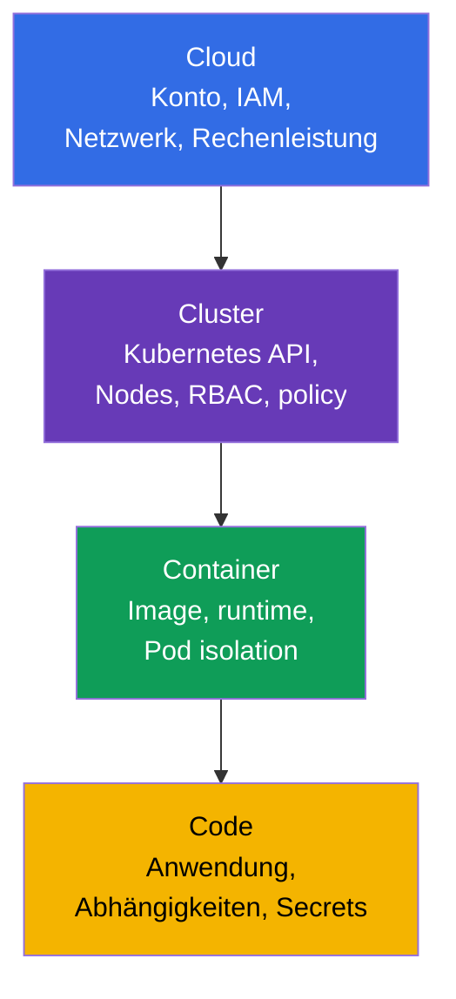
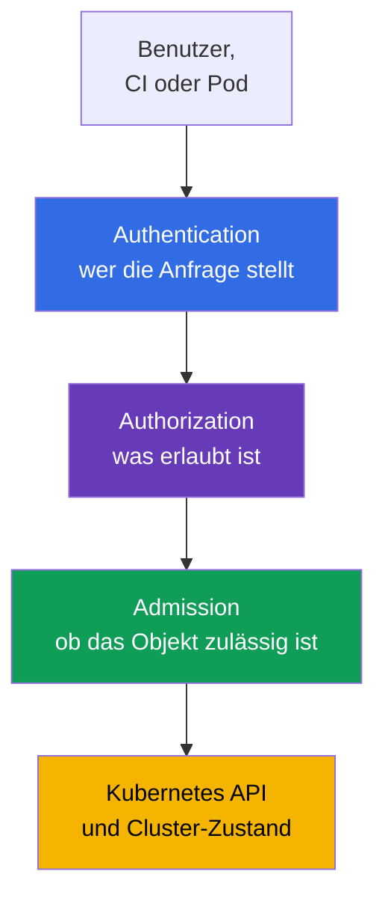
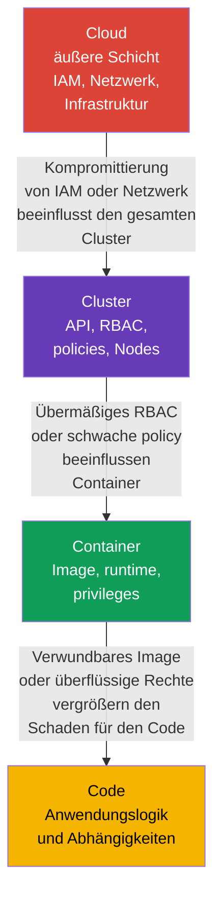

[Русская версия](ru.md) · [Eng version](README.md) · [Versión en español](es.md) · [Version française](fr.md) · [ქართული ვერსია](ge.md) · [繁體中文版](tw.md) · [日本語版](jp.md)

# Kapitel 03. Die 4C der Cloud-Sicherheit: Cloud, Cluster, Container, Code

> **Was kommt als Nächstes.** In den vorherigen Kapiteln haben wir cloud native, die Angriffsfläche und die grundlegenden Sicherheitsprinzipien definiert. Jetzt wenden wir sie auf das Modell **4C** an: Cloud, Cluster, Container und Code. Es ist die Grundlage der KCSA-Domäne **Overview of Cloud Native Security** (14 %): Es hilft dabei, nicht nach einer einzigen „magischen“ Kontrolle zu suchen, sondern zu erkennen, auf welcher Schicht ein Risiko entstanden ist und wer es mindern kann.

## 03.1. Das 4C-Modell: vier Schutzschichten

Das 4C-Modell unterteilt eine cloud-native Umgebung in vier verschachtelte Schichten: **Cloud**, **Cluster**, **Container** und **Code**. Jede Schicht hat ihre eigene Angriffsfläche, Verantwortliche und Schutzmaßnahmen.

- **Cloud** - das Konto beim Cloud-Anbieter, Netzwerk, IAM, virtuelle Maschinen, Festplatten und verwaltete Services.
- **Cluster** - Kubernetes API, control plane, Worker Nodes, RBAC, `NetworkPolicy` und admission control.
- **Container** - das Image, container runtime, Einstellungen des `Pod` und die Isolierung des Prozesses vom Host.
- **Code** - der Quellcode der Anwendung, ihre Abhängigkeiten, Konfiguration und der Umgang mit Secrets.

4C ist weder ein Produkt noch eine strikte Verantwortungsgrenze. Es ist ein Denkmodell. Beispielsweise gehören gestohlene IAM credentials zur Cloud-Schicht, können aber das Lesen eines snapshot mit Kubernetes-Daten ermöglichen. Eine Sicherheitslücke in einer Code-Abhängigkeit kann einem Angreifer die Ausführung von Befehlen im Container ermöglichen, und eine unsichere Cluster-Konfiguration kann den Weg zu Daten anderer Workloads öffnen.



Das Modell bedeutet nicht, dass genau eine Schicht gewählt werden muss. Schutz wird als defense in depth aufgebaut: Mehrere unabhängige Barrieren senken die Wahrscheinlichkeit und die Folgen einer Kompromittierung.

## 03.2. Die Cloud-Schicht: Infrastruktur, IAM und Anbieter-Netzwerk

Cloud ist die äußere Schicht: Cloud-Konto, Organisationen und Projekte, IAM, VPC/VNet, firewall oder security groups, virtuelle Maschinen, storage und KMS. Bei managed Kubernetes wird ein Teil der control plane vom Anbieter betrieben, der Kunde bleibt jedoch für die sichere Konfiguration seines Kontos, seiner identities und Daten verantwortlich.

Die größte Gefahr auf dieser Schicht sind zu weitreichende Cloud-Berechtigungen. Ein credential mit Administratorrechten, das aus CI oder einem `Pod` geleakt wurde, kann neue VM erstellen, object storage lesen, Netzwerkregeln ändern oder zusätzliche Rechte vergeben. Cloud-Rollen sollten daher nach Zweck getrennt und nach least privilege gestaltet sein; die credentials, tokens oder role sessions für ihre Nutzung sollten kurzlebig sein und, wo zutreffend, automatisch erneuert oder rotiert werden.

| Cloud-Risiko | Kontrolle auf konzeptioneller Ebene | Was sie mindert |
|---|---|---|
| Leak eines Cloud-Schlüssels | workload identity, kurzlebige Tokens, Rotation | Nutzung eines statischen Schlüssels außerhalb der erforderlichen Aufgabe |
| Offener Netzwerkperimeter | security groups, firewall, geschlossene endpoints | Zugriff auf API und Services aus nicht vertrauenswürdigen Netzwerken |
| Verlust oder Diebstahl von Daten auf einer Festplatte | encryption at rest, KMS und eingeschränkter Zugriff auf Schlüssel | Lesen von Daten aus einem snapshot oder gestohlenen Datenträger |
| Zu weitreichende Rolle | getrennte IAM roles für Personen, CI und Workloads | Privilege Escalation bei Kompromittierung einer identity |

Der Cloud-Anbieter ist für die Sicherheit seiner eigenen Infrastruktur verantwortlich, doch shared responsibility entbindet das Team nicht von der Konfiguration von IAM, Netzwerk, Datenzugriff und Workloads. Diese Details werden im nächsten Kapitel behandelt.

## 03.3. Die Cluster-Schicht: Kubernetes als Verwaltungsgrenze

Cluster umfasst die Kubernetes-Komponenten und Regeln, nach denen ein `Pod` Zugriff auf API, Netzwerk und Daten erhält. Zu dieser Schicht gehören API server, `etcd`, kubelet auf Worker Nodes, ServiceAccount, RBAC, `Namespace`, `NetworkPolicy`, Pod Security Admission und audit logging.

Die Kubernetes API ist der zentrale Verwaltungspunkt. Wenn eine identity einen `Pod` erstellen, ein `Secret` lesen oder ein `RoleBinding` ändern darf, können die Folgen größer sein als bei der Kompromittierung eines einzelnen Containers. Daher sind im Cluster Authentifizierung, Autorisierung und admission control wichtig:



RBAC beantwortet die Frage „wer eine Aktion ausführen darf“, prüft jedoch nicht, ob die Felder eines `Pod` sicher sind. Pod Security Admission und andere policy controls können beispielsweise einen privilegierten `Pod` ablehnen, selbst wenn der Benutzer `Pod` erstellen darf. `NetworkPolicy` beschränkt die erlaubten Datenflüsse zwischen Workloads, und Audit hilft bei der Erkennung gefährlicher Aktionen.

Ein typischer Fehler ist, `Namespace` als vollständige Isolierung zu betrachten. Es trennt Objektnamen und dient häufig als Grenze für Richtlinien, untersagt jedoch nicht selbstständig Netzwerkverkehr, vergibt kein minimales RBAC und macht einen `Pod` nicht sicher.

## 03.4. Die Container-Schicht: Image, runtime und Isolierung

Ein Container ist keine virtuelle Maschine. Container auf demselben Worker Node nutzen den Kernel des Hosts, und container runtime schafft Isolierung durch Linux namespaces, cgroups, capabilities und andere Mechanismen. Deshalb kann ein unsicherer Container zum Ausgangspunkt eines Angriffs auf den Node oder benachbarte Workloads werden.

Auf dieser Schicht werden das Image vor dem Start und Beschränkungen zur Laufzeit analysiert:

| Bereich | Beispielkontrolle | Warum sie benötigt wird |
|---|---|---|
| Image | vertrauenswürdige registry, festgelegter digest, Schwachstellenscanning | kein unbekanntes oder verwundbares artifact starten |
| Prozessbenutzer | non-root UID und `runAsNonRoot: true` | die Folgen der Codeausführung im Container verringern |
| Privilegien | `allowPrivilegeEscalation: false`, drop capabilities | dem Prozess keine unnötigen Kernel-Rechte geben |
| Verbindung zum Host | Verbot von `privileged`, `hostPath`, host namespaces für eine gewöhnliche Anwendung | die Möglichkeit des Ausbruchs zum Node verringern |
| Runtime | runtime-Updates, seccomp, AppArmor oder sandbox runtime | verfügbare syscalls beschränken und die Isolierung verstärken |

Der minimale `securityContext` unten garantiert nicht die Abwesenheit von Sicherheitslücken, schafft jedoch eine sinnvolle baseline für eine gewöhnliche Anwendung unter Kubernetes v1.36:

```yaml
apiVersion: v1
kind: Pod
metadata:
  name: catalog
spec:
  securityContext:
    runAsNonRoot: true
    seccompProfile:
      type: RuntimeDefault
  containers:
  - name: web
    image: registry.example/catalog@sha256:<digest>
    securityContext:
      allowPrivilegeEscalation: false
      capabilities:
        drop: ["ALL"]
```

Dieses Beispiel sollte nicht als universelles Rezept verstanden werden. Eine Anwendung kann begründete Anforderungen an ein writable-Verzeichnis oder eine bestimmte capability haben. Die richtige Reaktion ist, nur die erforderliche Ausnahme zu gewähren und sie festzuhalten, statt `privileged: true` zu aktivieren.

## 03.5. Die Code-Schicht: Anwendung und Abhängigkeitskette

Code umfasst den eigenen Quellcode, Bibliotheken, build scripts, Konfiguration und die Verarbeitung von Eingabedaten. Die Anwendung bleibt selbst in einem perfekt konfigurierten Cluster Teil der Angriffsfläche: Ein verwundbarer endpoint, injection, ein fest codiertes Passwort oder eine Abhängigkeit mit einer bekannten CVE bieten dem Angreifer einen Einstiegspunkt.

Wichtige Maßnahmen auf der Code-Schicht:

- Abhängigkeiten prüfen und rechtzeitig aktualisieren; **SCA**-Tools (Software Composition Analysis, Analyse der Softwarezusammensetzung) helfen, Bibliotheksversionen bekannten Sicherheitslücken zuzuordnen;
- tokens, Passwörter und private keys nicht im Repository, Dockerfile oder in Logs speichern; Secrets über den vorgesehenen Mechanismus übergeben und den Zugriff darauf beschränken;
- Eingabedaten validieren und sichere API verwenden, um das Risiko von injection und RCE zu senken;
- review, Tests und statische Analyse vor dem Image-Build durchführen;
- Konfiguration vom Code trennen und debug-Funktionen nicht unnötig in production einschalten.

Eine Korrektur auf der Code-Schicht beseitigt gewöhnlich die Ursache. Beispielsweise kann `NetworkPolicy` den ausgehenden Verkehr einer kompromittierten Anwendung beschränken, behebt jedoch keine SQL injection. Zugleich mindern äußere Schichten den Schaden, während die Korrektur entwickelt und ausgeliefert wird.

## 03.6. Die äußere Schicht beeinflusst die inneren

Die 4C-Schichten sind verschachtelt: Der innere Code läuft in einem Container, der in einem Cluster läuft, der in der Cloud bereitgestellt wird. Daher schwächt eine Sicherheitslücke oder Fehlkonfiguration auf einer äußeren Schicht alle inneren Schichten. Der Schutz einer inneren Schicht ersetzt jedoch nicht den Schutz einer äußeren.



Betrachten wir zwei Situationen.

1. Ein `Pod` weist in Code eine RCE-Sicherheitslücke auf. Wenn der Container als non-root ohne überflüssige capabilities läuft, der Cluster `NetworkPolicy` und minimales RBAC anwendet und Cloud IAM dem Node keine weitreichenden Rechte verleiht, ist es für den Angreifer schwieriger, den Angriff auszuweiten.
2. Eine Cloud-IAM role erlaubt CI, firewall zu ändern und Administratorrollen zu vergeben. Selbst ein geschützter `Pod` kompensiert die Kompromittierung eines solchen CI nicht: Der Angreifer kann zunächst die äußere Schicht ändern und anschließend den Cluster angreifen.

Praktische Reihenfolge bei der Analyse eines Vorfalls oder eines neuen Services: asset und Datenfluss bestimmen, die vier Schichten markieren und für jede identity, Vertrauensgrenze und Kontrolle benennen. So werden weder Code noch Infrastruktur übersehen.

## 03.7. Anwendung in der Praxis

- **Änderungen anhand von 4C prüfen.** Beim review eines neuen Services werden Fragen zu jeder Schicht gestellt: Welche IAM permissions sind erforderlich, welche API-Rechte hat der `ServiceAccount`, woher kommt das Image, welche Abhängigkeiten und Secrets verwendet der Code?
- **Eine baseline statt einer einzelnen Barriere schaffen.** Das Team kombiniert private registry, Image-Scanning, `securityContext`, RBAC, `NetworkPolicy`, Audit und Cloud-Beschränkungen. Der Ausfall einer Kontrolle darf nicht unmittelbar Daten offenlegen.
- **Ownership aufteilen.** Das Plattformteam definiert gewöhnlich die controls für Cloud und Cluster, Entwickler sind für Code und die Eigenschaften ihres Container verantwortlich. Die Verantwortungsgrenze muss eindeutig sein, sonst bleibt eine wichtige Kontrolle ohne Besitzer.
- **Die Ursache auf der richtigen Schicht suchen.** Ein Leak eines Secrets aus Git wird in Code und im delivery-Prozess behoben, nicht nur durch das Blockieren von Verkehr. Eine übermäßige IAM role wird in Cloud korrigiert, nicht durch den Versuch, sie mit den Einstellungen eines einzelnen `Pod` zu kompensieren.
- **Ausnahmen prüfen.** Wenn ein workload eine capability, Zugriff auf metadata oder weitreichendes RBAC anfordert, werden Zweck, Verantwortlicher, Frist und kompensierende controls dokumentiert.

## 03.8. Exam vocabulary / Mini-Glossar

- **4C** - ein Modell aus Cloud, Cluster, Container und Code zur Systematisierung von cloud-native Sicherheit.
- **Cloud** - die Infrastrukturschicht: Cloud-Konto, IAM, Netzwerk, Rechenleistung und storage.
- **Cluster** - die Schicht der Kubernetes-Komponenten, identities, Richtlinien und Worker Nodes.
- **Container** - Image und isolierter Prozess, der durch container runtime gestartet wird.
- **Code** - Quellcode, Abhängigkeiten, Konfiguration und Anwendungslogik.
- **IAM** - Verwaltung von identities und ihren permissions in einer Cloud-Umgebung.
- **admission control** - Prüfung oder Änderung eines API-Objekts vor dem Speichern in Kubernetes.
- **SCA** - Analyse von Anwendungsabhängigkeiten zur Ermittlung bekannter Sicherheitslücken.
- **defense in depth** - mehrere ergänzende Schutzschichten statt einer einzigen Barriere.

## 03.9. Exam Essentials / Zusammenfassung des Kapitels

- 4C betrachtet Sicherheit anhand von vier verschachtelten Schichten: Cloud, Cluster, Container und Code.
- Cloud umfasst IAM, Infrastruktur und das Netzwerk des Anbieters; übermäßige Cloud-Berechtigungen sind für den gesamten Cluster gefährlich.
- Cluster wird durch Authentifizierung, RBAC, admission control, Netzwerksegmentierung und Audit geschützt, doch `Namespace` allein ist keine vollständige Isolierung.
- Container erfordert ein vertrauenswürdiges Image, minimale Privilegien und Isolierung vom Host.
- Code umfasst Abhängigkeiten, Secrets und sichere Entwicklung; äußere controls mindern den Schaden, ersetzen jedoch nicht die Behebung einer Anwendungssicherheitslücke.
- Die Kompromittierung einer äußeren Schicht wirkt sich auf die inneren aus, daher muss Sicherheit mehrschichtig sein.

## 03.10. Nicht verwechseln und typische Exam-Fragen

In KCSA-Fragen hilft das 4C-Modell, die Schicht zu bestimmen, zu der ein Risiko oder eine Kontrolle gehört. Verwechseln Sie Image-Scanning nicht mit dem Schutz von Code: Es gehört zu Container und supply chain, kann aber eine Anwendungsabhängigkeit erkennen. `NetworkPolicy`, RBAC und Pod Security Admission gehören zu Cluster. IAM, security groups und KMS befinden sich auf der Cloud-Schicht.

Eine häufige Falle bei MCQ (multiple choice question, Frage mit Antwortauswahl) ist eine Option mit einer nützlichen, aber unzureichenden Kontrolle. Beispielsweise beschränkt `NetworkPolicy` die seitliche Netzwerkbewegung nach RCE, behebt aber keine Sicherheitslücke in der Anwendung. Die richtigste Antwort beseitigt das Risiko gewöhnlich auf seiner Schicht und wird bei Bedarf durch den Schutz angrenzender Schichten ergänzt.

## 03.11. Fragen zur Selbstkontrolle

### 1. Welche Reihenfolge haben die Schichten des 4C-Modells von außen nach innen?
   - a. Cloud → Container → Cluster → Code
   - b. Cloud → Cluster → Container → Code
   - c. Cluster → Cloud → Code → Container
   - d. Code → Container → Cluster → Cloud

<details>
<summary>Antwort und Erläuterung</summary>

**Richtige Antwort: b.** Cloud enthält die Cluster-Infrastruktur, Cluster enthält die Kubernetes-Umgebung, Container enthält den Anwendungsprozess und Code ist die innerste Schicht.

</details>

### 2. Welche Kontrolle gehört in erster Linie zur Cluster-Schicht?
   - a. IAM role für object storage
   - b. `NetworkPolicy` zur Beschränkung des Verkehrs zwischen `Pod`
   - c. Scanning einer Abhängigkeit im Quellcode
   - d. Encryption einer virtuellen Maschinenfestplatte

<details>
<summary>Antwort und Erläuterung</summary>

**Richtige Antwort: b.** `NetworkPolicy` ist ein Kubernetes-Objekt, das zulässige Netzwerkflüsse von Workloads festlegt. Die anderen Optionen gehören jeweils zu Cloud, Code und Cloud.

</details>

### 3. Was mindert die Folgen von RCE in einem gewöhnlichen Container am besten?
   - a. Als non-root ausführen, escalation deaktivieren und unnötige capabilities entfernen
   - b. Für ein bequemeres Debugging alle Linux capabilities hinzufügen
   - c. Dem `ServiceAccount` die Rolle cluster-admin geben
   - d. Den Container mit `privileged: true` starten

<details>
<summary>Antwort und Erläuterung</summary>

**Richtige Antwort: a.** Minimale Container-Privilegien verringern die dem Angreifer zur Verfügung stehenden Handlungsmöglichkeiten. Die anderen Optionen erweitern Rechte und vergrößern den Schaden.

</details>

### 4. Warum kompensiert geschützter Code keine übermäßige Cloud-IAM role?
   - a. IAM existiert nur innerhalb eines Container-Images
   - b. Code kann ohne `privileged: true` nicht in Kubernetes ausgeführt werden
   - c. RBAC beschränkt automatisch alle Cloud permissions
   - d. Die Kompromittierung der Cloud-Schicht kann Änderungen an Infrastruktur und Zugriff auf den gesamten Cluster ermöglichen

<details>
<summary>Antwort und Erläuterung</summary>

**Richtige Antwort: d.** Die äußere Cloud-Schicht beeinflusst die inneren. Eine weitreichende IAM role kann erlauben, Netzwerk, VM oder Daten unabhängig von der Sicherheit einer einzelnen Anwendung zu ändern.

</details>

### 5. Welche Aussage über `Namespace` ist richtig?

   - a. Es gruppiert namespaced-Objekte und definiert einen Bereich für Richtlinien, schafft jedoch selbst keine vollständige security boundary.
   - b. Es zwingt automatisch alle Container, als non-root zu laufen, und entfernt alle Linux capabilities.
   - c. Es erstellt automatisch deny-all ingress und egress zwischen Workloads ohne separate `NetworkPolicy`.
   - d. Es verhindert, dass cluster-scoped RBAC-Bindungen Rechte auf Ressourcen innerhalb dieses namespace vergeben.

<details>
<summary>Antwort und Erläuterung</summary>

**Richtige Antwort: a.** `Namespace` stellt einen Namensbereich und einen praktischen scope für RBAC, quota, PSA labels und Netzwerkselektoren bereit, ist aber selbst keine vollständige Sicherheitsgrenze. Isolierung wird durch konkrete controls geschaffen, nicht allein durch das Vorhandensein von Namespace.

</details>

> **Wie weiter.** In Kapitel 02 von CKS wird das 4C-Modell eingehender verwendet, um Vertrauensgrenzen und praktische Schutzmechanismen zu analysieren. Das nächste Kapitel dieses Kurses betrachtet die Cloud-Schicht detaillierter: shared responsibility, IAM, Nodes und metadata service.

---
[Inhaltsverzeichnis](../README_DE.md) · [Kapitel 02](../02/de.md) · [Kapitel 04](../04/de.md)
