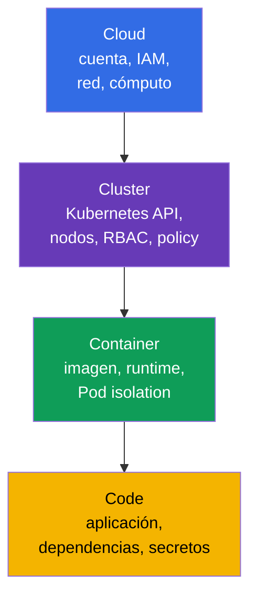
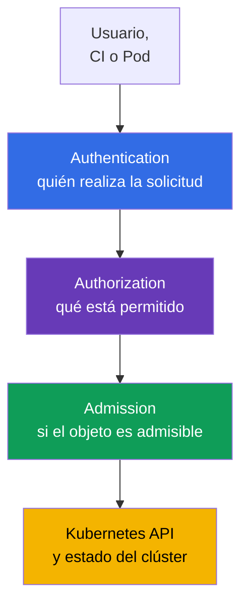
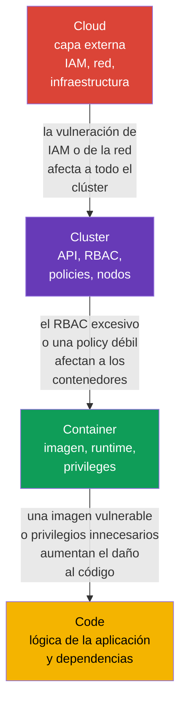

[Русская версия](ru.md) · [Eng version](README.md) · [Version française](fr.md) · [Deutsche Version](de.md) · [ქართული ვერსია](ge.md) · [繁體中文版](tw.md) · [日本語版](jp.md)

# Capítulo 03. Las 4C de la seguridad cloud: Cloud, Cluster, Container, Code

> **Qué sigue.** En los capítulos anteriores definimos cloud native, la superficie de ataque y los principios básicos de seguridad. Ahora los aplicaremos al modelo **4C**: Cloud, Cluster, Container y Code. Es la base del dominio KCSA **Overview of Cloud Native Security** (14%): ayuda a no buscar un único control «mágico», sino a ver en qué capa surgió el riesgo y quién puede mitigarlo.

## 03.1. El modelo 4C: cuatro capas de protección

El modelo 4C divide el entorno cloud native en cuatro capas anidadas: **Cloud**, **Cluster**, **Container** y **Code**. Cada capa tiene su propia superficie de ataque, responsables y controles de seguridad.

- **Cloud** - la cuenta del proveedor cloud, la red, IAM, las máquinas virtuales, los discos y los servicios gestionados.
- **Cluster** - Kubernetes API, control plane, nodos de trabajo, RBAC, `NetworkPolicy` y admission control.
- **Container** - la imagen, el container runtime, la configuración de `Pod` y el aislamiento del proceso respecto al host.
- **Code** - el código fuente de la aplicación, sus dependencias, configuración y gestión de secretos.

4C no es un producto ni una frontera estricta de responsabilidad. Es un modelo mental. Por ejemplo, unas IAM credentials robadas pertenecen a Cloud, pero pueden permitir leer un snapshot con datos de Kubernetes. Una vulnerabilidad de dependencia en Code puede dar a un atacante ejecución de comandos en Container, y una configuración insegura de Cluster, acceso a datos de otras cargas de trabajo.



El modelo no implica que se deba elegir exactamente una capa. La protección se construye como defense in depth: varias barreras independientes reducen la probabilidad y las consecuencias de una vulneración.

## 03.2. Capa Cloud: infraestructura, IAM y red del proveedor

Cloud es la capa externa: la cuenta cloud, organizaciones y proyectos, IAM, VPC/VNet, firewall o security groups, máquinas virtuales, storage y KMS. En Kubernetes gestionado, el proveedor opera una parte del control plane, pero el cliente sigue siendo responsable de la configuración segura de su cuenta, identities y datos.

El principal peligro de esta capa son los permisos cloud excesivamente amplios. Una credential con permisos de administrador, filtrada desde CI o un `Pod`, puede crear nuevas VM, leer object storage, modificar reglas de red o conceder permisos adicionales. Por tanto, los roles cloud deben estar separados por propósito y respetar least privilege, mientras que las credentials, tokens o role sessions emitidas para usarlos deben ser de corta duración y, cuando corresponda, renovarse o rotarse automáticamente.

| Riesgo de Cloud | Control a nivel conceptual | Qué reduce |
|---|---|---|
| Filtración de una clave cloud | workload identity, tokens de corta duración, rotación | uso de una clave estática fuera de la tarea necesaria |
| Perímetro de red abierto | security groups, firewall, endpoint privados | acceso a la API y a servicios desde redes no confiables |
| Pérdida o robo de datos en disco | encryption at rest, KMS y restricción del acceso a claves | lectura de datos desde un snapshot o medio robado |
| Rol demasiado amplio | IAM roles separados para personas, CI y workload | escalada de privilegios tras comprometer una identity |

El proveedor Cloud es responsable de la seguridad de su propia infraestructura, pero shared responsibility no libera al equipo de configurar IAM, la red, el acceso a datos y las cargas de trabajo. Estos detalles se tratan en el capítulo siguiente.

## 03.3. Capa Cluster: Kubernetes como frontera de control

Cluster abarca los componentes y reglas de Kubernetes mediante los cuales un `Pod` obtiene acceso a la API, la red y los datos. Esta capa incluye API server, `etcd`, kubelet en los nodos de trabajo, ServiceAccount, RBAC, `Namespace`, `NetworkPolicy`, Pod Security Admission y audit logging.

Kubernetes API es el punto central de control. Si una identity tiene permiso para crear `Pod`, leer `Secret` o modificar `RoleBinding`, las consecuencias pueden ser mayores que las de comprometer un solo contenedor. Por ello, la autenticación, autorización y admission control son importantes en el clúster:



RBAC responde a la pregunta «quién puede realizar una acción», pero no comprueba si los campos de un `Pod` son seguros. Pod Security Admission y otros policy controls pueden rechazar, por ejemplo, un `Pod` privilegiado, incluso si el usuario tiene derecho a crear `Pod`. `NetworkPolicy` restringe los flujos permitidos entre cargas de trabajo, y la auditoría ayuda a detectar acciones peligrosas.

Un error típico es considerar `Namespace` como un aislamiento completo. Separa los nombres de los objetos y a menudo sirve como frontera de políticas, pero por sí solo no prohíbe el tráfico de red, no otorga RBAC mínimo ni hace seguro a un `Pod`.

## 03.4. Capa Container: imagen, runtime y aislamiento

Container no es una máquina virtual. Los contenedores de un mismo nodo de trabajo usan el kernel del host, y el container runtime crea aislamiento mediante Linux namespaces, cgroups, capabilities y otros mecanismos. Por tanto, un contenedor inseguro puede convertirse en un punto inicial de ataque contra el nodo o las cargas de trabajo vecinas.

En esta capa se analizan la imagen antes de ejecutarla y las restricciones durante su ejecución:

| Área | Ejemplo de control | Por qué es necesario |
|---|---|---|
| Imagen | registry confiable, digest fijo, escaneo de vulnerabilidades | no ejecutar un artifact desconocido o vulnerable |
| Usuario del proceso | UID non-root y `runAsNonRoot: true` | reducir las consecuencias de la ejecución de código en el contenedor |
| Privilegios | `allowPrivilegeEscalation: false`, drop capabilities | no otorgar al proceso permisos innecesarios del kernel |
| Conexión con el host | prohibir `privileged`, `hostPath`, host namespaces para una aplicación normal | reducir la posibilidad de acceder al nodo |
| Runtime | actualizaciones del runtime, seccomp, AppArmor o sandbox runtime | restringir los syscalls disponibles y reforzar el aislamiento |

El `securityContext` mínimo siguiente no garantiza la ausencia de vulnerabilidades, pero crea un baseline útil para una aplicación Kubernetes v1.36 normal:

```yaml
apiVersion: v1
kind: Pod
metadata:
  name: catalog
spec:
  securityContext:
    runAsNonRoot: true
    seccompProfile:
      type: RuntimeDefault
  containers:
  - name: web
    image: registry.example/catalog@sha256:<digest>
    securityContext:
      allowPrivilegeEscalation: false
      capabilities:
        drop: ["ALL"]
```

Este ejemplo no debe considerarse una receta universal. Una aplicación puede tener necesidades justificadas de un directorio writable o de una capability concreta. La reacción correcta es conceder solo la excepción requerida y documentarla, no activar `privileged: true`.

## 03.5. Capa Code: la aplicación y la cadena de dependencias

Code comprende el código fuente propio, bibliotecas, build scripts, configuración y la forma de procesar los datos de entrada. La aplicación sigue siendo parte de la superficie de ataque incluso en un clúster configurado de forma perfecta: un endpoint vulnerable, injection, una contraseña codificada de forma fija o una dependencia con una CVE conocida proporcionan al atacante un punto de entrada.

Medidas principales en la capa Code:

- revisar las dependencias y actualizarlas a tiempo; las herramientas **SCA** (Software Composition Analysis, análisis de composición de software) ayudan a relacionar las versiones de bibliotecas con vulnerabilidades conocidas;
- no almacenar tokens, contraseñas y private keys en el repositorio, Dockerfile o logs; los secretos se entregan mediante el mecanismo previsto y se restringe el acceso a ellos;
- validar los datos de entrada y usar API seguras para reducir el riesgo de injection y RCE;
- realizar review, pruebas y análisis estático antes de construir la imagen;
- separar la configuración del código y no habilitar funciones de debug en production sin necesidad.

La corrección en la capa Code normalmente elimina la causa raíz. Por ejemplo, `NetworkPolicy` puede limitar el tráfico saliente de una aplicación comprometida, pero no corregirá una SQL injection. Al mismo tiempo, las capas externas reducen el daño mientras se desarrolla y entrega la corrección.

## 03.6. La capa externa influye en las internas

Las capas 4C están anidadas: el Code interno se ejecuta dentro de Container, que se ejecuta en Cluster, alojado en Cloud. Por tanto, una vulnerabilidad o una configuración errónea de la capa externa debilita todas las internas. A la vez, la protección de la capa interna no sustituye la protección de la externa.



Consideremos dos situaciones.

1. Un `Pod` tiene una vulnerabilidad RCE en Code. Si Container se ejecuta como non-root sin capabilities innecesarias, Cluster aplica `NetworkPolicy` y RBAC mínimo, y Cloud IAM no otorga al nodo permisos amplios, al atacante le resulta más difícil desarrollar el ataque.
2. Un IAM role cloud permite a CI modificar el firewall y conceder roles de administrador. Incluso un `Pod` protegido no compensa la vulneración de ese CI: el atacante puede primero cambiar la capa externa y después atacar Cluster.

El orden práctico para analizar un incidente o un servicio nuevo es: identificar el asset y el flujo de datos, marcar las cuatro capas y, para cada una, nombrar la identity, la frontera de confianza y el control. Así no se omiten ni el código ni la infraestructura.

## 03.7. Cómo se aplica en la práctica

- **Revisar cambios según 4C.** En el review de un nuevo servicio se plantean preguntas para cada capa: qué IAM permissions se necesitan, qué permisos de API tiene el `ServiceAccount`, de dónde procede la imagen y qué dependencias y secretos usa el código.
- **Crear un baseline, no una barrera única.** El equipo combina private registry, escaneo de imágenes, `securityContext`, RBAC, `NetworkPolicy`, auditoría y restricciones cloud. El fallo de un control no debe exponer de inmediato los datos.
- **Separar ownership.** El equipo de plataforma normalmente define los controls de Cloud y Cluster; los desarrolladores responden por Code y las propiedades de su Container. La frontera de responsabilidad debe ser explícita; de lo contrario, un control importante queda sin propietario.
- **Buscar la causa raíz en la capa correcta.** Una filtración de secretos desde Git se corrige en Code y en el proceso de delivery, no solo bloqueando el tráfico. Un IAM role excesivo se corrige en Cloud, no intentando compensarlo con la configuración de un único `Pod`.
- **Revisar las excepciones.** Si una workload solicita una capability, acceso a metadata o RBAC amplio, se documentan el objetivo, el propietario, el plazo y los controls compensatorios.

## 03.8. Exam vocabulary / Mini-glosario

- **4C** - modelo Cloud, Cluster, Container, Code para sistematizar la seguridad cloud native.
- **Cloud** - capa de infraestructura: cuenta cloud, IAM, red, cómputo y storage.
- **Cluster** - capa de componentes Kubernetes, identities, políticas y nodos de trabajo.
- **Container** - imagen y proceso aislado que ejecuta el container runtime.
- **Code** - código fuente, dependencias, configuración y lógica de aplicación.
- **IAM** - gestión de identities y sus permissions en un entorno cloud.
- **admission control** - validación o modificación de un objeto API antes de guardarlo en Kubernetes.
- **SCA** - análisis de las dependencias de una aplicación para identificar vulnerabilidades conocidas.
- **defense in depth** - varios niveles de protección complementarios en lugar de una sola barrera.

## 03.9. Exam Essentials / Resumen del capítulo

- 4C aborda la seguridad mediante cuatro capas anidadas: Cloud, Cluster, Container y Code.
- Cloud abarca IAM, infraestructura y red del proveedor; los permisos cloud excesivos son peligrosos para todo el clúster.
- Cluster se protege con autenticación, RBAC, admission control, segmentación de red y auditoría, pero `Namespace` por sí solo no es un aislamiento completo.
- Container requiere una imagen confiable, privilegios mínimos y aislamiento del host.
- Code incluye dependencias, secretos y desarrollo seguro; los controls externos reducen el daño, pero no sustituyen la corrección de una vulnerabilidad de la aplicación.
- La vulneración de una capa externa afecta a las internas, por lo que la seguridad debe ser multicapa.

## 03.10. No confundir y cómo aparece en el examen

En las preguntas de KCSA, el modelo 4C ayuda a elegir la capa a la que pertenece un riesgo o control. No confunda el escaneo de imágenes con la protección de Code: pertenece a Container y supply chain, aunque pueda identificar una dependencia de aplicación. `NetworkPolicy`, RBAC y Pod Security Admission pertenecen a Cluster. IAM, security groups y KMS están en la capa Cloud.

Una trampa frecuente en MCQ (multiple choice question, pregunta de opción múltiple) es una opción con un control útil, pero insuficiente. Por ejemplo, `NetworkPolicy` limitará el movimiento de red después de RCE, pero no corregirá una vulnerabilidad de la aplicación. La respuesta más correcta normalmente elimina el riesgo en su capa y, si es necesario, se complementa con protección de las capas vecinas.

## 03.11. Preguntas de autoevaluación

### 1. ¿Cuál es el orden de las capas del modelo 4C desde la exterior hasta la interior?
   - a. Cloud → Container → Cluster → Code
   - b. Cloud → Cluster → Container → Code
   - c. Cluster → Cloud → Code → Container
   - d. Code → Container → Cluster → Cloud

<details>
<summary>Respuesta y explicación</summary>

**Respuesta correcta: b.** Cloud contiene la infraestructura del clúster, Cluster contiene el entorno Kubernetes, Container contiene el proceso de la aplicación y Code es la capa más interna.

</details>

### 2. ¿Qué control pertenece principalmente a la capa Cluster?
   - a. IAM role para object storage
   - b. `NetworkPolicy` para restringir el tráfico entre `Pod`
   - c. Escaneo de dependencias en el código fuente
   - d. Encryption del disco de una máquina virtual

<details>
<summary>Respuesta y explicación</summary>

**Respuesta correcta: b.** `NetworkPolicy` es un objeto de Kubernetes que define los flujos de red permitidos para las cargas de trabajo. Las demás opciones pertenecen respectivamente a Cloud, Code y Cloud.

</details>

### 3. ¿Qué reduce mejor las consecuencias de RCE en un contenedor normal?
   - a. Ejecutar como non-root, desactivar escalation y eliminar capabilities innecesarias
   - b. Añadir todas las Linux capabilities para facilitar el debug
   - c. Conceder al `ServiceAccount` el rol cluster-admin
   - d. Ejecutar el contenedor con `privileged: true`

<details>
<summary>Respuesta y explicación</summary>

**Respuesta correcta: a.** Los privilegios mínimos de Container reducen el conjunto de acciones disponibles para el atacante. Las demás opciones amplían los permisos y aumentan el daño.

</details>

### 4. ¿Por qué un código protegido no compensa un IAM role cloud excesivo?
   - a. IAM existe solo dentro de la imagen del contenedor
   - b. El código no puede ejecutarse en Kubernetes sin `privileged: true`
   - c. RBAC limita automáticamente todos los permissions cloud
   - d. La vulneración de la capa Cloud puede permitir modificar la infraestructura y el acceso a todo Cluster

<details>
<summary>Respuesta y explicación</summary>

**Respuesta correcta: d.** La capa Cloud externa influye en las internas. Un IAM role amplio puede permitir modificar la red, VM o datos independientemente de la seguridad de una sola aplicación.

</details>

### 5. ¿Qué afirmación sobre `Namespace` es correcta?

   - a. Agrupa objetos con ámbito de namespace y proporciona un ámbito para políticas, pero por sí solo no crea una security boundary completa.
   - b. Obliga automáticamente a todos los contenedores a ejecutarse como non-root y elimina todas sus Linux capabilities.
   - c. Crea automáticamente deny-all ingress y egress entre workload sin una `NetworkPolicy` adicional.
   - d. Impide que las vinculaciones RBAC de ámbito cluster otorguen permisos a recursos dentro de ese namespace.

<details>
<summary>Respuesta y explicación</summary>

**Respuesta correcta: a.** `Namespace` proporciona un ámbito de nombres y un scope conveniente para RBAC, quota, PSA labels y selectores de red, pero por sí solo no es una frontera de seguridad completa. El aislamiento lo crean controls específicos, no la mera existencia de Namespace.

</details>

> **A dónde continuar.** En el capítulo 02 de CKS, el modelo 4C se utiliza con más profundidad para analizar fronteras de confianza y mecanismos prácticos de protección. El siguiente capítulo de este curso trata la capa Cloud con más detalle: shared responsibility, IAM, nodos y metadata service.

---
[Índice](../README_ES.md) · [Capítulo 02](../02/es.md) · [Capítulo 04](../04/es.md)
