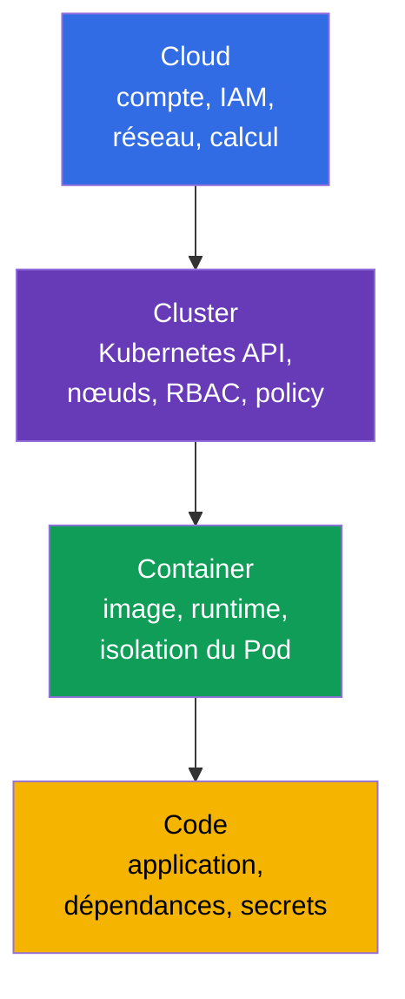
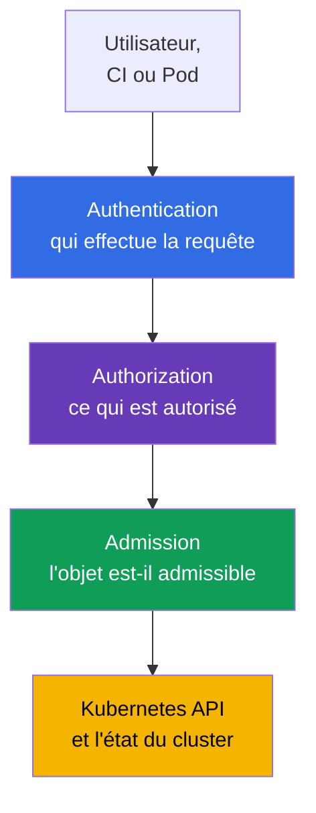
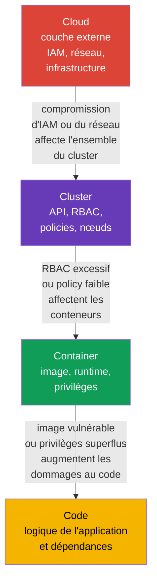

[Русская версия](ru.md) · [Eng version](README.md) · [Versión en español](es.md) · [Deutsche Version](de.md) · [ქართული ვერსია](ge.md) · [繁體中文版](tw.md) · [日本語版](jp.md)

# Chapitre 03. Les 4C de la sécurité cloud : Cloud, Cluster, Container, Code

> **La suite.** Dans les chapitres précédents, nous avons défini le cloud native, la surface d'attaque et les principes de base de la sécurité. Appliquons-les maintenant au modèle des **4C** : Cloud, Cluster, Container et Code. C'est le fondement du domaine KCSA **Overview of Cloud Native Security** (14 %) : il aide à ne pas chercher un unique contrôle « magique », mais à identifier la couche où le risque est apparu et qui peut le réduire.

## 03.1. Le modèle 4C : quatre couches de protection

Le modèle 4C divise l'environnement cloud native en quatre couches imbriquées : **Cloud**, **Cluster**, **Container** et **Code**. Chaque couche possède sa propre surface d'attaque, ses responsables et ses mécanismes de protection.

- **Cloud** - le compte du fournisseur cloud, le réseau, IAM, les machines virtuelles, les disques et les services gérés.
- **Cluster** - Kubernetes API, control plane, nœuds de travail, RBAC, `NetworkPolicy` et admission control.
- **Container** - l'image, le container runtime, les paramètres du `Pod` et l'isolation du processus vis-à-vis de l'hôte.
- **Code** - le code source de l'application, ses dépendances, sa configuration et la gestion des secrets.

Les 4C ne sont ni un produit ni une limite stricte de responsabilité. C'est un modèle de réflexion. Par exemple, des IAM credentials volés relèvent de Cloud, mais peuvent permettre de lire un snapshot contenant des données Kubernetes. Une dépendance vulnérable dans Code peut permettre à un attaquant d'exécuter des commandes dans Container, et une configuration non sécurisée de Cluster peut ouvrir un accès aux données d'autres workloads.



Le modèle ne signifie pas qu'il faut choisir une seule couche. La protection se construit selon le principe de defense in depth : plusieurs barrières indépendantes réduisent la probabilité et les conséquences d'une compromission.

## 03.2. Couche Cloud : infrastructure, IAM et réseau du fournisseur

Cloud est la couche externe : le compte cloud, les organisations et projets, IAM, VPC/VNet, firewall ou security groups, les machines virtuelles, le storage et KMS. Dans Kubernetes managé, le fournisseur exploite une partie du control plane, mais le client reste responsable de la configuration sécurisée de son compte, de ses identities et de ses données.

Le principal danger de cette couche est l'attribution de droits cloud trop étendus. Un credential disposant de droits administrateur, divulgué depuis CI ou un `Pod`, peut créer de nouvelles VM, lire l'object storage, modifier des règles réseau ou accorder des droits supplémentaires. Les rôles cloud doivent donc être séparés selon leur finalité et respecter le principe de least privilege ; les credentials, tokens ou role sessions émis pour les utiliser doivent être de courte durée et, le cas échéant, renouvelés ou rotatés automatiquement.

| Risque Cloud | Contrôle au niveau conceptuel | Ce qu'il réduit |
|---|---|---|
| Fuite d'une clé cloud | workload identity, tokens de courte durée, rotation | l'utilisation d'une clé statique au-delà de la tâche requise |
| Périmètre réseau ouvert | security groups, firewall, endpoint fermés | l'accès aux API et services depuis des réseaux non fiables |
| Perte ou vol de données sur disque | encryption at rest, KMS et restriction de l'accès aux clés | la lecture des données depuis un snapshot ou un support volé |
| Rôle trop étendu | IAM roles distincts pour une personne, CI et un workload | l'escalade de privilèges lors de la compromission d'une identity |

Le fournisseur Cloud est responsable de la sécurité de sa propre infrastructure, mais la shared responsibility ne dispense pas l'équipe de configurer IAM, le réseau, l'accès aux données et les workloads. Ces détails sont abordés dans le chapitre suivant.

## 03.3. Couche Cluster : Kubernetes comme frontière de contrôle

Cluster englobe les composants Kubernetes et les règles selon lesquelles un `Pod` obtient accès à l'API, au réseau et aux données. Cette couche comprend API server, `etcd`, kubelet sur les nœuds de travail, ServiceAccount, RBAC, `Namespace`, `NetworkPolicy`, Pod Security Admission et audit logging.

Kubernetes API est le point de contrôle central. Si une identity a le droit de créer un `Pod`, de lire un `Secret` ou de modifier un `RoleBinding`, les conséquences peuvent dépasser celles de la compromission d'un seul conteneur. L'authentification, l'autorisation et admission control sont donc importants dans le cluster :



RBAC répond à la question « qui peut effectuer une action », mais ne vérifie pas si les champs d'un `Pod` sont sûrs. Pod Security Admission et d'autres policy controls peuvent, par exemple, refuser un `Pod` privilégié, même si l'utilisateur est autorisé à créer des `Pod`. `NetworkPolicy` limite les flux autorisés entre workloads, tandis que l'audit aide à détecter les actions dangereuses.

Une erreur typique consiste à considérer `Namespace` comme une isolation complète. Il sépare les noms d'objets et sert souvent de frontière pour les politiques, mais n'interdit pas à lui seul le trafic réseau, n'attribue pas un RBAC minimal et ne rend pas un `Pod` sûr.

## 03.4. Couche Container : image, runtime et isolation

Container n'est pas une machine virtuelle. Les conteneurs d'un même nœud de travail utilisent le noyau de l'hôte, et le container runtime crée l'isolation grâce aux Linux namespaces, cgroups, capabilities et autres mécanismes. Un conteneur non sécurisé peut donc devenir le point de départ d'une attaque contre le nœud ou les workloads voisins.

À cette couche, on analyse l'image avant son démarrage et les restrictions lors de son exécution :

| Domaine | Exemple de contrôle | Pourquoi il est nécessaire |
|---|---|---|
| Image | registry de confiance, digest fixe, analyse des vulnérabilités | ne pas démarrer un artifact inconnu ou vulnérable |
| Utilisateur du processus | UID non-root et `runAsNonRoot: true` | réduire les conséquences de l'exécution de code dans le conteneur |
| Privilèges | `allowPrivilegeEscalation: false`, suppression des capabilities | ne pas accorder au processus des droits noyau inutiles |
| Lien avec l'hôte | interdire `privileged`, `hostPath`, host namespaces pour une application ordinaire | réduire la possibilité d'accéder au nœud |
| Runtime | mises à jour du runtime, seccomp, AppArmor ou sandbox runtime | limiter les syscalls disponibles et renforcer l'isolation |

Le `securityContext` minimal ci-dessous ne garantit pas l'absence de vulnérabilités, mais établit un baseline utile pour une application Kubernetes v1.36 ordinaire :

```yaml
apiVersion: v1
kind: Pod
metadata:
  name: catalog
spec:
  securityContext:
    runAsNonRoot: true
    seccompProfile:
      type: RuntimeDefault
  containers:
  - name: web
    image: registry.example/catalog@sha256:<digest>
    securityContext:
      allowPrivilegeEscalation: false
      capabilities:
        drop: ["ALL"]
```

Cet exemple ne doit pas être considéré comme une recette universelle. Une application peut avoir des besoins justifiés d'un répertoire writable ou d'une capability précise. La bonne réaction est d'accorder uniquement l'exception requise et de la consigner, plutôt que d'activer `privileged: true`.

## 03.5. Couche Code : application et chaîne de dépendances

Code correspond au code source propriétaire, aux bibliothèques, aux build scripts, à la configuration et à la manière de traiter les données entrantes. L'application reste une partie de la surface d'attaque, même dans un cluster parfaitement configuré : un endpoint vulnérable, une injection, un mot de passe inscrit en dur ou une dépendance avec une CVE connue fournissent un point d'entrée à l'attaquant.

Mesures principales à la couche Code :

- vérifier les dépendances et les mettre à jour en temps utile ; les outils de **SCA** (Software Composition Analysis, analyse de la composition des logiciels) aident à comparer les versions des bibliothèques aux vulnérabilités connues ;
- ne pas stocker de tokens, mots de passe et private keys dans le dépôt, le Dockerfile ou les logs ; transmettre les secrets via le mécanisme prévu et limiter leur accès ;
- valider les données entrantes et utiliser des API sûres afin de réduire le risque d'injection et de RCE ;
- réaliser une review, des tests et une analyse statique avant la construction de l'image ;
- séparer la configuration du code et ne pas activer de fonctions de debug en production sans nécessité.

La correction à la couche Code élimine généralement la cause première. Par exemple, une `NetworkPolicy` peut limiter le trafic sortant d'une application compromise, mais ne corrigera pas une SQL injection. En parallèle, les couches externes limitent les dommages pendant que le correctif est développé et livré.

## 03.6. La couche externe influence les couches internes

Les couches 4C sont imbriquées : le Code interne s'exécute dans Container, qui s'exécute dans Cluster, hébergé dans Cloud. Ainsi, une vulnérabilité ou une configuration erronée de la couche externe affaiblit toutes les couches internes. Inversement, la protection d'une couche interne ne remplace pas celle de la couche externe.



Examinons deux situations.

1. Un `Pod` comporte une vulnérabilité RCE dans Code. Si Container s'exécute en non-root sans capabilities superflues, que Cluster applique une `NetworkPolicy` et un RBAC minimal, et que Cloud IAM n'accorde pas de droits étendus au nœud, il est plus difficile pour l'attaquant de poursuivre l'attaque.
2. Un rôle IAM Cloud permet à CI de modifier le firewall et d'accorder des rôles administrateur. Même un `Pod` protégé ne compense pas la compromission d'un tel CI : l'attaquant peut d'abord modifier la couche externe, puis attaquer Cluster.

Ordre pratique d'analyse d'un incident ou d'un nouveau service : identifier l'asset et le flux de données, marquer les quatre couches, puis nommer pour chacune l'identity, la frontière de confiance et le contrôle. Cela évite d'omettre le code ou l'infrastructure.

## 03.7. Application pratique

- **Examiner les modifications selon les 4C.** Lors de la review d'un nouveau service, l'équipe pose des questions pour chaque couche : quelles IAM permissions sont nécessaires, quels droits API possède le `ServiceAccount`, d'où vient l'image, quelles dépendances et quels secrets le code utilise-t-il ?
- **Établir un baseline, plutôt qu'une barrière isolée.** L'équipe associe un private registry, l'analyse d'images, `securityContext`, RBAC, `NetworkPolicy`, l'audit et des restrictions cloud. La défaillance d'un contrôle ne doit pas exposer immédiatement les données.
- **Répartir l'ownership.** L'équipe plateforme définit généralement les controls Cloud et Cluster ; les développeurs sont responsables de Code et des propriétés de leur Container. La limite de responsabilité doit être explicite, sans quoi un contrôle important reste sans responsable.
- **Chercher la cause première à la bonne couche.** Une fuite de secret depuis Git se corrige dans Code et le processus de delivery, et pas seulement en bloquant le trafic. Un rôle IAM excessif se corrige dans Cloud, sans essayer de le compenser par la configuration d'un seul `Pod`.
- **Vérifier les exceptions.** Si un workload demande une capability, un accès à metadata ou un RBAC étendu, documenter l'objectif, le responsable, l'échéance et les controls compensatoires.

## 03.8. Exam vocabulary / Mini-glossaire

- **4C** - modèle Cloud, Cluster, Container, Code pour structurer la sécurité cloud native.
- **Cloud** - couche d'infrastructure : compte cloud, IAM, réseau, calcul et storage.
- **Cluster** - couche des composants Kubernetes, des identities, des politiques et des nœuds de travail.
- **Container** - image et processus isolé exécuté par le container runtime.
- **Code** - code source, dépendances, configuration et logique de l'application.
- **IAM** - gestion des identities et de leurs permissions dans un environnement cloud.
- **admission control** - validation ou modification d'un objet API avant son enregistrement dans Kubernetes.
- **SCA** - analyse des dépendances d'une application pour identifier les vulnérabilités connues.
- **defense in depth** - plusieurs niveaux de protection complémentaires au lieu d'une barrière unique.

## 03.9. Exam Essentials / Points essentiels du chapitre

- Les 4C envisagent la sécurité à travers quatre couches imbriquées : Cloud, Cluster, Container et Code.
- Cloud couvre IAM, l'infrastructure et le réseau du fournisseur ; des droits cloud excessifs sont dangereux pour l'ensemble du cluster.
- Cluster est protégé par l'authentification, RBAC, admission control, la segmentation réseau et l'audit, mais `Namespace` ne constitue pas à lui seul une isolation complète.
- Container requiert une image de confiance, des privilèges minimaux et une isolation de l'hôte.
- Code comprend les dépendances, les secrets et le développement sécurisé ; les controls externes réduisent les dommages, mais ne remplacent pas la correction d'une vulnérabilité de l'application.
- La compromission de la couche externe affecte les couches internes ; la sécurité doit donc être multilayer.

## 03.10. À ne pas confondre et présence à l'examen

Dans les questions KCSA, le modèle 4C aide à choisir la couche à laquelle se rapporte un risque ou un contrôle. Ne confondez pas l'analyse d'image avec la protection de Code : elle relève de Container et de la supply chain, bien qu'elle puisse identifier une dépendance d'application. `NetworkPolicy`, RBAC et Pod Security Admission relèvent de Cluster. IAM, security groups et KMS se situent à la couche Cloud.

Un piège courant des MCQ (multiple choice question, question à choix multiples) est une option proposant un contrôle utile, mais insuffisant. Par exemple, une `NetworkPolicy` limitera le déplacement réseau après une RCE, mais ne corrigera pas la vulnérabilité dans l'application. La réponse la plus juste élimine généralement le risque à sa couche et, si nécessaire, est complétée par la protection des couches voisines.

## 03.11. Questions d'auto-évaluation

### 1. Quel est l'ordre des couches du modèle 4C, de l'extérieur vers l'intérieur ?
   - a. Cloud → Container → Cluster → Code
   - b. Cloud → Cluster → Container → Code
   - c. Cluster → Cloud → Code → Container
   - d. Code → Container → Cluster → Cloud

<details>
<summary>Réponse et explication</summary>

**Réponse correcte : b.** Cloud contient l'infrastructure du cluster, Cluster contient l'environnement Kubernetes, Container contient le processus de l'application et Code est la couche la plus interne.

</details>

### 2. Quel contrôle relève avant tout de la couche Cluster ?
   - a. IAM role pour l'object storage
   - b. `NetworkPolicy` pour limiter le trafic entre les `Pod`
   - c. Analyse d'une dépendance dans le code source
   - d. Encryption du disque d'une machine virtuelle

<details>
<summary>Réponse et explication</summary>

**Réponse correcte : b.** `NetworkPolicy` est un objet Kubernetes qui définit les flux réseau autorisés entre workloads. Les autres options relèvent respectivement de Cloud, Code et Cloud.

</details>

### 3. Qu'est-ce qui réduit le mieux les conséquences d'une RCE dans un conteneur ordinaire ?
   - a. Exécuter en non-root, désactiver l'escalade et supprimer les capabilities inutiles
   - b. Ajouter toutes les Linux capabilities pour faciliter le debug
   - c. Donner au `ServiceAccount` le rôle cluster-admin
   - d. Exécuter le conteneur avec `privileged: true`

<details>
<summary>Réponse et explication</summary>

**Réponse correcte : a.** Les privilèges minimaux de Container réduisent l'ensemble d'actions accessible à l'attaquant. Les autres options étendent les droits et augmentent les dommages.

</details>

### 4. Pourquoi un code protégé ne compense-t-il pas un rôle IAM Cloud excessif ?
   - a. IAM n'existe qu'à l'intérieur de l'image du conteneur
   - b. Le code ne peut pas s'exécuter dans Kubernetes sans `privileged: true`
   - c. RBAC limite automatiquement toutes les permissions cloud
   - d. La compromission de la couche Cloud peut permettre de modifier l'infrastructure et l'accès à tout le Cluster

<details>
<summary>Réponse et explication</summary>

**Réponse correcte : d.** La couche Cloud externe influence les couches internes. Un rôle IAM étendu peut permettre de modifier le réseau, les VM ou les données, indépendamment de la sécurité d'une application particulière.

</details>

### 5. Quelle affirmation concernant `Namespace` est correcte ?

   - a. Il regroupe les objets namespaced et définit une portée pour les politiques, mais ne crée pas à lui seul une security boundary complète.
   - b. Il force automatiquement tous les conteneurs à s'exécuter en non-root et supprime toutes leurs Linux capabilities.
   - c. Il crée automatiquement un deny-all ingress et egress entre les workloads sans `NetworkPolicy` distincte.
   - d. Il empêche les liaisons RBAC cluster-scoped d'accorder des droits sur les ressources de ce namespace.

<details>
<summary>Réponse et explication</summary>

**Réponse correcte : a.** `Namespace` fournit un espace de noms et une portée pratique pour RBAC, quota, PSA labels et les sélecteurs réseau, mais ne constitue pas à lui seul une frontière de sécurité complète. L'isolation est créée par des controls spécifiques, et non par la seule présence d'un Namespace.

</details>

> **Où aller ensuite.** Dans le chapitre 02 CKS, le modèle 4C est utilisé plus en profondeur pour analyser les frontières de confiance et les mécanismes pratiques de protection. Le chapitre suivant de ce cours examine plus en détail la couche Cloud : shared responsibility, IAM, nœuds et metadata service.

---
[Table des matières](../README_FR.md) · [Chapitre 02](../02/fr.md) · [Chapitre 04](../04/fr.md)