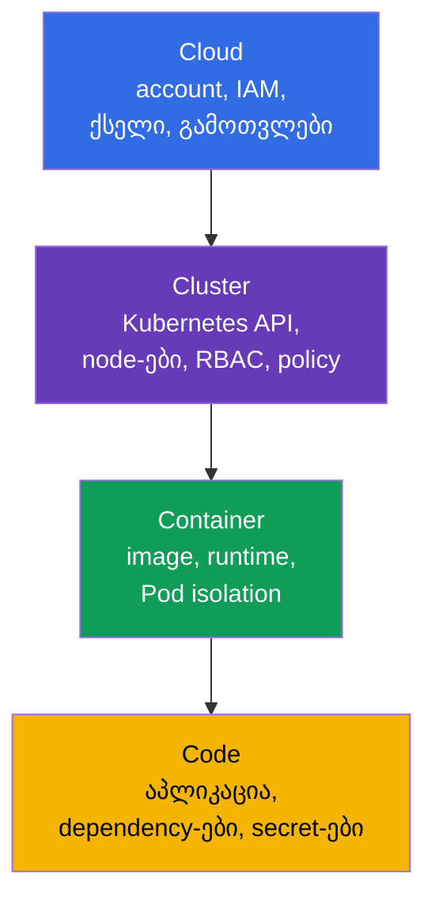
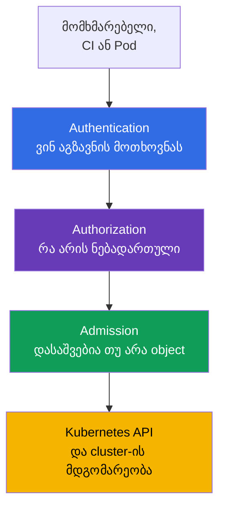
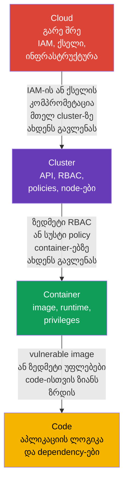

[Русская версия](ru.md) · [Eng version](README.md) · [Versión en español](es.md) · [Version française](fr.md) · [Deutsche Version](de.md) · [繁體中文版](tw.md) · [日本語版](jp.md)

# თავი 03. Cloud უსაფრთხოების 4C: Cloud, Cluster, Container, Code

> **შემდეგ რა არის.** წინა თავებში განვსაზღვრეთ cloud native, თავდასხმის ზედაპირი და უსაფრთხოების საბაზისო პრინციპები. ახლა მათ **4C** მოდელს მივუსადაგებთ: Cloud, Cluster, Container და Code. ეს KCSA-ს **Overview of Cloud Native Security** დომენის საფუძველია (14%): იგი გვეხმარება, არ ვეძებოთ ერთადერთი „ჯადოსნური“ control, არამედ დავინახოთ, რომელ შრეზე წარმოიშვა რისკი და ვის შეუძლია მისი შემცირება.

## 03.1. 4C მოდელი: დაცვის ოთხი შრე

4C მოდელი cloud native გარემოს ოთხ ჩადგმულ შრედ ყოფს: **Cloud**, **Cluster**, **Container** და **Code**. თითოეულ შრეს თავდასხმის საკუთარი ზედაპირი, მფლობელები და დაცვის საშუალებები აქვს.

- **Cloud** - cloud provider-ის account, ქსელი, IAM, virtual machine-ები, დისკები და managed service-ები.
- **Cluster** - Kubernetes API, control plane, worker node-ები, RBAC, `NetworkPolicy` და admission control.
- **Container** - image, container runtime, `Pod`-ის პარამეტრები და პროცესის იზოლაცია host-ისგან.
- **Code** - აპლიკაციის source code, მისი dependency-ები, კონფიგურაცია და secret-ებთან მუშაობა.

4C არც პროდუქტია და არც პასუხისმგებლობის მკაცრი საზღვარი. ეს აზროვნების მოდელია. მაგალითად, მოპარული IAM credentials Cloud-ს მიეკუთვნება, თუმცა შეიძლება Kubernetes-ის მონაცემებიანი snapshot-ის წაკითხვის შესაძლებლობა მისცეს. Code-ში dependency-ის vulnerability-მ თავდამსხმელს Container-ში ბრძანებების შესრულების საშუალება შეიძლება მისცეს, ხოლო Cluster-ის არაუსაფრთხო კონფიგურაციამ - სხვა workload-ების მონაცემებამდე მისასვლელი გზა.



მოდელი არ ნიშნავს, რომ ზუსტად ერთი შრე უნდა ავირჩიოთ. დაცვა იგება როგორც defense in depth: რამდენიმე დამოუკიდებელი ბარიერი კომპრომეტაციის ალბათობასა და შედეგებს ამცირებს.

## 03.2. Cloud შრე: provider-ის ინფრასტრუქტურა, IAM და ქსელი

Cloud გარე შრეა: cloud account, organization-ები და project-ები, IAM, VPC/VNet, firewall ან security group-ები, virtual machine-ები, storage და KMS. managed Kubernetes-ში control plane-ის ნაწილს provider ემსახურება, თუმცა მომხმარებელი კვლავ პასუხისმგებელია საკუთარი account-ის, identities-ისა და მონაცემების უსაფრთხო კონფიგურაციაზე.

ამ შრის მთავარი საფრთხე ზედმეტად ფართო cloud permissions-ია. ადმინისტრატორის უფლების მქონე Credential-ს, რომელიც CI-დან ან `Pod`-იდან გაჟონა, შეუძლია შექმნას ახალი VM-ები, წაიკითხოს object storage, შეცვალოს ქსელის წესები ან გასცეს დამატებითი უფლებები. ამიტომ cloud role-ები დანიშნულების მიხედვით უნდა იყოს გამიჯნული და least privilege-ს შეესაბამებოდეს, ხოლო მათი გამოყენებისთვის გაცემული credentials, tokens ან role sessions ხანმოკლე უნდა იყოს და, სადაც შესაძლებელია, ავტომატურად ახლდებოდეს ან იცვლებოდეს.

| Cloud-ის რისკი | Control კონცეპტუალურ დონეზე | რას ამცირებს იგი |
|---|---|---|
| cloud key-ის გაჟონვა | workload identity, ხანმოკლე token-ები, როტაცია | static key-ის საჭირო ამოცანის ფარგლებს გარეთ გამოყენებას |
| ღია ქსელის პერიმეტრი | security group-ები, firewall, დახურული endpoint-ები | API-სა და service-ებზე არასანდო ქსელებიდან წვდომას |
| დისკზე მონაცემების დაკარგვა ან მოპარვა | encryption at rest, KMS და key-ებზე წვდომის შეზღუდვა | snapshot-იდან ან მოპარული მატარებლიდან მონაცემების წაკითხვას |
| ზედმეტად ფართო role | ცალკეული IAM roles ადამიანის, CI-ისა და workload-ისთვის | ერთი identity-ის კომპრომეტაციისას უფლებების ესკალაციას |

Cloud provider პასუხისმგებელია საკუთარი ინფრასტრუქტურის უსაფრთხოებაზე, მაგრამ shared responsibility გუნდს IAM-ის, ქსელის, მონაცემებზე წვდომისა და workload-ების კონფიგურაციისგან არ ათავისუფლებს. ეს დეტალები შემდეგ თავში განიხილება.

## 03.3. Cluster შრე: Kubernetes როგორც მართვის საზღვარი

Cluster მოიცავს Kubernetes კომპონენტებსა და წესებს, რომელთა მიხედვითაც `Pod` API-ზე, ქსელსა და მონაცემებზე წვდომას იღებს. ამ შრეში შედის API server, `etcd`, worker node-ებზე kubelet, ServiceAccount, RBAC, `Namespace`, `NetworkPolicy`, Pod Security Admission და audit logging.

Kubernetes API მართვის ცენტრალური წერტილია. თუ identity-ს აქვს `Pod`-ის შექმნის, `Secret`-ის წაკითხვის ან `RoleBinding`-ის შეცვლის უფლება, შედეგები შეიძლება ერთი container-ის კომპრომეტაციაზე უფრო მასშტაბური იყოს. ამიტომ cluster-ში მნიშვნელოვანია authentication, authorization და admission control:



RBAC პასუხობს კითხვას „ვის შეუძლია მოქმედების შესრულება“, მაგრამ არ ამოწმებს, უსაფრთხოა თუ არა `Pod`-ის field-ები. Pod Security Admission-სა და სხვა policy control-ებს შეუძლიათ, მაგალითად, privileged `Pod` უარყონ მაშინაც კი, თუ მომხმარებელს `Pod`-ის შექმნის უფლება აქვს. `NetworkPolicy` workload-ებს შორის დაშვებულ ნაკადებს ზღუდავს, ხოლო audit სახიფათო მოქმედებების აღმოჩენაში გვეხმარება.

ტიპური შეცდომაა `Namespace`-ის სრულ იზოლაციად მიჩნევა. ის object-ების სახელებს გამოყოფს და ხშირად policy-ების საზღვრად გამოიყენება, თუმცა თავისთავად არც ქსელურ traffic-ს კრძალავს, არც მინიმალურ RBAC-ს გასცემს და არც `Pod`-ს ხდის უსაფრთხოს.

## 03.4. Container შრე: image, runtime და იზოლაცია

Container virtual machine არ არის. ერთი worker node-ის container-ები host-ის kernel-ს იყენებენ, container runtime კი იზოლაციას Linux namespaces-ის, cgroups-ის, capabilities-ისა და სხვა მექანიზმების მეშვეობით ქმნის. ამიტომ არაუსაფრთხო container შეიძლება node-ზე ან მეზობელ workload-ებზე თავდასხმის საწყისი წერტილი გახდეს.

ამ შრეზე გაშვებამდე image-ს და გაშვების დროს მოქმედ შეზღუდვებს აანალიზებენ:

| სფერო | Control-ის მაგალითი | რატომ არის საჭირო |
|---|---|---|
| Image | სანდო registry, ფიქსირებული digest, vulnerability scanning | უცნობი ან vulnerability-ის მქონე artifact-ის გაშვების თავიდან ასაცილებლად |
| პროცესის მომხმარებელი | non-root UID და `runAsNonRoot: true` | container-ში code execution-ის შედეგების შესამცირებლად |
| Privilege-ები | `allowPrivilegeEscalation: false`, drop capabilities | პროცესისთვის kernel-ის არასაჭირო უფლებების არმისაცემად |
| Host-თან კავშირი | ჩვეულებრივი აპლიკაციისთვის `privileged`, `hostPath`, host namespaces-ის აკრძალვა | node-ზე გასვლის შესაძლებლობის შესამცირებლად |
| Runtime | runtime-ის განახლებები, seccomp, AppArmor ან sandbox runtime | ხელმისაწვდომი syscall-ების შესაზღუდად და იზოლაციის გასაძლიერებლად |

ქვემოთ მოცემული მინიმალური `securityContext` vulnerability-ების არარსებობის გარანტიას არ იძლევა, თუმცა ჩვეულებრივი Kubernetes v1.36 აპლიკაციისთვის სასარგებლო baseline-ს ქმნის:

```yaml
apiVersion: v1
kind: Pod
metadata:
  name: catalog
spec:
  securityContext:
    runAsNonRoot: true
    seccompProfile:
      type: RuntimeDefault
  containers:
  - name: web
    image: registry.example/catalog@sha256:<digest>
    securityContext:
      allowPrivilegeEscalation: false
      capabilities:
        drop: ["ALL"]
```

ეს მაგალითი უნივერსალურ რეცეპტად არ უნდა მივიჩნიოთ. აპლიკაციას შეიძლება writable directory ან კონკრეტული capability საფუძვლიანად სჭირდებოდეს. სწორი რეაქციაა მხოლოდ საჭირო გამონაკლისის მიცემა და მისი დაფიქსირება და არა `privileged: true`-ის ჩართვა.

## 03.5. Code შრე: აპლიკაცია და dependency chain

Code არის საკუთარი source code, library-ები, build scripts, კონფიგურაცია და input data-ის დამუშავების გზა. აპლიკაცია იდეალურად კონფიგურირებულ cluster-შიც თავდასხმის ზედაპირის ნაწილად რჩება: vulnerable endpoint, injection, hardcoded password ან ცნობილი CVE-ის მქონე dependency თავდამსხმელს შესასვლელ წერტილს აძლევს.

Code შრეზე ძირითადი ზომებია:

- dependency-ების შემოწმება და დროული განახლება; **SCA** (Software Composition Analysis, პროგრამული უზრუნველყოფის შემადგენლობის ანალიზი) ხელსაწყოები library-ების version-ებს ცნობილ vulnerability-ებთან ადარებს;
- token-ების, password-ებისა და private key-ების repository-ში, Dockerfile-ში ან log-ებში არშენახვა; secret-ები სპეციალური მექანიზმით გადაიცემა და მათზე წვდომა იზღუდება;
- input data-ის ვალიდაცია და უსაფრთხო API-ების გამოყენება injection-ისა და RCE-ის რისკის შესამცირებლად;
- image-ის build-მდე review-ის, testing-ისა და static analysis-ის ჩატარება;
- configuration-ის code-ისგან გამოყოფა და production-ში debug feature-ების საჭიროების გარეშე არჩართვა.

Code შრეზე გამოსწორება, როგორც წესი, ძირეულ მიზეზს აღმოფხვრის. მაგალითად, `NetworkPolicy`-ს შეუძლია კომპრომეტირებული აპლიკაციის outbound traffic შეზღუდოს, თუმცა SQL injection-ს ვერ გამოასწორებს. ამავე დროს გარე შრეები ზიანს ამცირებს, სანამ გამოსწორება მუშავდება და მიეწოდება.

## 03.6. გარე შრე გავლენას ახდენს შიდა შრეებზე

4C-ის შრეები ერთმანეთშია ჩადგმული: შიდა Code მუშაობს Container-ში, რომელიც მუშაობს Cloud-ში განთავსებულ Cluster-ში. ამიტომ გარე შრის vulnerability ან არასწორი კონფიგურაცია ყველა შიდა შრეს ასუსტებს. ამასთან, შიდა შრის დაცვა გარე შრის დაცვას არ ცვლის.



განვიხილოთ ორი სიტუაცია.

1. `Pod`-ში Code-ის RCE vulnerability არსებობს. თუ Container გაშვებულია non-root რეჟიმში, ზედმეტი capabilities-ის გარეშე, Cluster იყენებს `NetworkPolicy`-სა და მინიმალურ RBAC-ს, ხოლო Cloud IAM node-ს ფართო უფლებებს არ აძლევს, თავდამსხმელს შეტევის განვითარება უფრო გაუჭირდება.
2. Cloud IAM role CI-ს firewall-ის შეცვლისა და administrator role-ების გაცემის საშუალებას აძლევს. დაცული `Pod`-იც კი ვერ დააკომპენსირებს ასეთი CI-ის კომპრომეტაციას: თავდამსხმელს შეუძლია ჯერ გარე შრე შეცვალოს, შემდეგ კი Cluster-ს შეუტიოს.

ინციდენტის ან ახალი service-ის ანალიზის პრაქტიკული თანმიმდევრობაა: განსაზღვრეთ asset და data flow, მონიშნეთ ოთხი შრე, თითოეულისთვის დაასახელეთ identity, trust boundary და control. ასე არც code და არც infrastructure გამოგრჩებათ.

## 03.7. როგორ იყენებენ ამას პრაქტიკაში

- **ცვლილებებს 4C-ის მიხედვით ამოწმებენ.** ახალი service-ის review-ისას თითოეული შრის შესახებ სვამენ კითხვებს: რომელი IAM permissions არის საჭირო, რა API უფლებები აქვს `ServiceAccount`-ს, საიდან მიიღება image, რომელ dependency-ებსა და secret-ებს იყენებს code.
- **ქმნიან baseline-ს და არა ერთჯერად ბარიერს.** გუნდი აერთიანებს private registry-ს, image scanning-ს, `securityContext`-ს, RBAC-ს, `NetworkPolicy`-ს, audit-სა და cloud შეზღუდვებს. ერთი control-ის failure-მა მონაცემები მაშინვე არ უნდა გამოაჩინოს.
- **ownership-ს ყოფენ.** Platform team, ჩვეულებრივ, Cloud-ისა და Cluster-ის control-ებს განსაზღვრავს, developer-ები კი Code-სა და საკუთარი Container-ის თვისებებზე აგებენ პასუხს. პასუხისმგებლობის საზღვარი აშკარა უნდა იყოს, წინააღმდეგ შემთხვევაში მნიშვნელოვანი control მფლობელის გარეშე დარჩება.
- **ძირეულ მიზეზს სწორ შრეზე ეძებენ.** Git-იდან secret-ის გაჟონვას Code-სა და delivery process-ში ასწორებენ და მხოლოდ traffic-ს არ ბლოკავენ. ზედმეტ IAM role-ს Cloud-ში ასწორებენ და ერთი `Pod`-ის კონფიგურაციით კომპენსირებას არ ცდილობენ.
- **გამონაკლისებს ამოწმებენ.** თუ workload capability-ს, metadata-ზე წვდომას ან ფართო RBAC-ს ითხოვს, დოკუმენტურად აფიქსირებენ მიზანს, მფლობელს, ვადასა და compensating control-ებს.

## 03.8. Exam vocabulary / მინი-ლექსიკონი

- **4C** - Cloud, Cluster, Container, Code მოდელი cloud native უსაფრთხოების სისტემატიზაციისთვის.
- **Cloud** - ინფრასტრუქტურული შრე: cloud account, IAM, ქსელი, გამოთვლები და storage.
- **Cluster** - Kubernetes კომპონენტების, identities-ის, policy-ებისა და worker node-ების შრე.
- **Container** - image და იზოლირებული პროცესი, რომელსაც container runtime უშვებს.
- **Code** - source code, dependency-ები, configuration და აპლიკაციის ლოგიკა.
- **IAM** - cloud გარემოში identities-ისა და მათი permissions-ის მართვა.
- **admission control** - Kubernetes-ში შენახვამდე API object-ის შემოწმება ან შეცვლა.
- **SCA** - აპლიკაციის dependency-ების ანალიზი ცნობილი vulnerability-ების გამოსავლენად.
- **defense in depth** - ერთი ბარიერის ნაცვლად დაცვის რამდენიმე ურთიერთშემავსებელი დონე.

## 03.9. Exam Essentials / თავის შეჯამება

- 4C უსაფრთხოებას ოთხი ჩადგმული შრის მეშვეობით განიხილავს: Cloud, Cluster, Container და Code.
- Cloud მოიცავს IAM-ს, ინფრასტრუქტურასა და provider-ის ქსელს; ზედმეტი cloud permissions მთელი cluster-ისთვის საშიშია.
- Cluster-ს authentication, RBAC, admission control, network segmentation და audit იცავს, თუმცა `Namespace` თავისთავად სრული იზოლაცია არ არის.
- Container სანდო image-ს, მინიმალურ privileges-სა და host-ისგან იზოლაციას მოითხოვს.
- Code მოიცავს dependency-ებს, secret-ებსა და secure development-ს; გარე control-ები ზიანს ამცირებს, მაგრამ აპლიკაციის vulnerability-ის გამოსწორებას არ ცვლის.
- გარე შრის კომპრომეტაცია შიდა შრეებზე ახდენს გავლენას, ამიტომ უსაფრთხოება მრავალშრიანი უნდა იყოს.

## 03.10. ნუ აგერევათ და როგორ გვხვდება ეს გამოცდაზე

KCSA-ს კითხვებში 4C მოდელი გვეხმარება იმ შრის არჩევაში, რომელსაც რისკი ან control მიეკუთვნება. image scanning Code-ის დაცვაში არ აგერიოთ: ის Container-სა და supply chain-ს მიეკუთვნება, თუმცა შეიძლება აპლიკაციის dependency გამოავლინოს. `NetworkPolicy`, RBAC და Pod Security Admission Cluster-ს მიეკუთვნება. IAM, security group-ები და KMS Cloud შრეზეა.

MCQ-ის (multiple choice question, კითხვა პასუხის ვარიანტებით) გავრცელებული ხაფანგია სასარგებლო, მაგრამ არასაკმარისი control-ის მქონე ვარიანტი. მაგალითად, `NetworkPolicy` RCE-ის შემდეგ ქსელში გადაადგილებას შეზღუდავს, თუმცა აპლიკაციის vulnerability-ს ვერ გამოასწორებს. ყველაზე სწორი პასუხი, ჩვეულებრივ, რისკს მისივე შრეზე აღმოფხვრის და, საჭიროების შემთხვევაში, მეზობელი შრეების დაცვით ავსებს.

## 03.11. თვითშემოწმების კითხვები

### 1. როგორია 4C მოდელის შრეების თანმიმდევრობა გარედან შიგნით?
   - a. Cloud → Container → Cluster → Code
   - b. Cloud → Cluster → Container → Code
   - c. Cluster → Cloud → Code → Container
   - d. Code → Container → Cluster → Cloud

<details>
<summary>პასუხი და განმარტება</summary>

**სწორი პასუხია: b.** Cloud შეიცავს cluster-ის ინფრასტრუქტურას, Cluster შეიცავს Kubernetes გარემოს, Container შეიცავს აპლიკაციის პროცესს, Code კი ყველაზე შიდა შრეა.

</details>

### 2. რომელი control მიეკუთვნება უპირველესად Cluster შრეს?
   - a. IAM role object storage-ისთვის
   - b. `NetworkPolicy` `Pod`-ებს შორის traffic-ის შესაზღუდად
   - c. dependency scanning source code-ში
   - d. virtual machine-ის დისკის Encryption

<details>
<summary>პასუხი და განმარტება</summary>

**სწორი პასუხია: b.** `NetworkPolicy` Kubernetes object-ია, რომელიც workload-ების დასაშვებ ქსელურ ნაკადებს განსაზღვრავს. დანარჩენი ვარიანტები, შესაბამისად, Cloud-ს, Code-სა და Cloud-ს მიეკუთვნება.

</details>

### 3. რა ამცირებს ყველაზე უკეთ RCE-ის შედეგებს ჩვეულებრივ container-ში?
   - a. non-root რეჟიმში გაშვება, escalation-ის გამორთვა და არასაჭირო capabilities-ის მოცილება
   - b. debugging-ის გასამარტივებლად ყველა Linux capability-ის დამატება
   - c. `ServiceAccount`-ისთვის cluster-admin role-ის მიცემა
   - d. container-ის `privileged: true`-ით გაშვება

<details>
<summary>პასუხი და განმარტება</summary>

**სწორი პასუხია: a.** Container-ის მინიმალური privileges თავდამსხმელისთვის ხელმისაწვდომ მოქმედებათა ნაკრებს ამცირებს. სხვა ვარიანტები უფლებებს აფართოებს და ზიანს ზრდის.

</details>

### 4. რატომ ვერ აკომპენსირებს დაცული code ზედმეტ cloud IAM role-ს?
   - a. IAM მხოლოდ container image-ის შიგნით არსებობს
   - b. Code Kubernetes-ში `privileged: true`-ის გარეშე ვერ მუშაობს
   - c. RBAC ყველა cloud permission-ს ავტომატურად ზღუდავს
   - d. Cloud შრის კომპრომეტაციამ შეიძლება infrastructure-ისა და მთელ Cluster-ზე წვდომის შეცვლის საშუალება მოგვცეს

<details>
<summary>პასუხი და განმარტება</summary>

**სწორი პასუხია: d.** გარე Cloud შრე შიდა შრეებზე ახდენს გავლენას. ფართო IAM role-მა შეიძლება ერთი აპლიკაციის უსაფრთხოებისგან დამოუკიდებლად ქსელის, VM-ების ან მონაცემების შეცვლის შესაძლებლობა მისცეს.

</details>

### 5. რომელი დებულებაა სწორი `Namespace`-ის შესახებ?

   - a. ის namespaced object-ებს აჯგუფებს და policy-ებისთვის scope-ს განსაზღვრავს, მაგრამ თავისთავად სრულ security boundary-ს არ ქმნის.
   - b. ის ყველა container-ს ავტომატურად აიძულებს non-root რეჟიმში მუშაობას და ყველა Linux capability-ს აშორებს.
   - c. ის ცალკე `NetworkPolicy`-ის გარეშე workload-ებს შორის deny-all ingress-სა და egress-ს ავტომატურად ქმნის.
   - d. ის cluster-scoped RBAC binding-ებს ამ namespace-ის შიგნით resource-ებზე უფლებების გაცემას უკრძალავს.

<details>
<summary>პასუხი და განმარტება</summary>

**სწორი პასუხია: a.** `Namespace` სახელების არესა და RBAC-ის, quota-ს, PSA label-ებისა და network selector-ებისთვის მოსახერხებელ scope-ს უზრუნველყოფს, თუმცა თავისთავად უსაფრთხოების სრული საზღვარი არ არის. იზოლაციას კონკრეტული control-ები ქმნის და არა მხოლოდ Namespace-ის არსებობა.

</details>

> **შემდეგ სად წავიდეთ.** CKS-ის 02 თავში 4C მოდელი trust boundary-ებისა და დაცვის პრაქტიკული მექანიზმების გასაანალიზებლად უფრო ღრმად გამოიყენება. ამ კურსის შემდეგი თავი Cloud შრეს უფრო დეტალურად განიხილავს: shared responsibility, IAM, node-ები და metadata service.

---
[სარჩევი](../README_GE.md) · [თავი 02](../02/ge.md) · [თავი 04](../04/ge.md)
