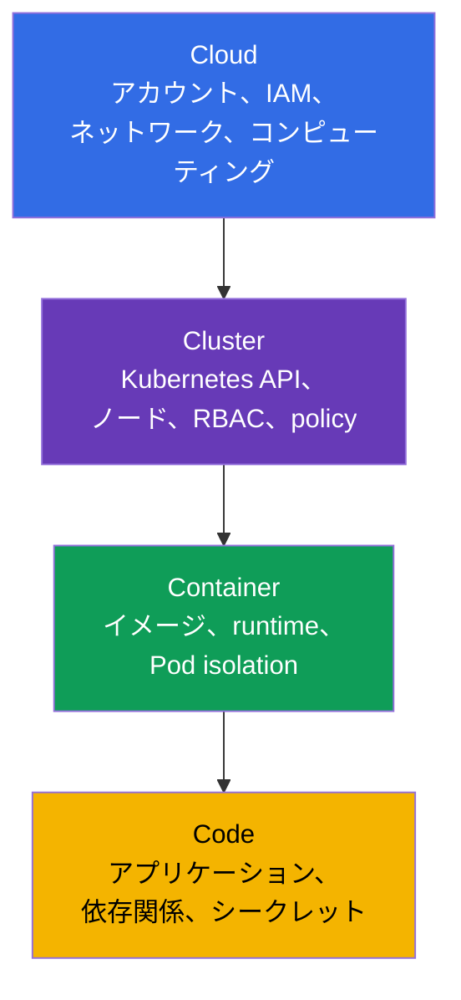
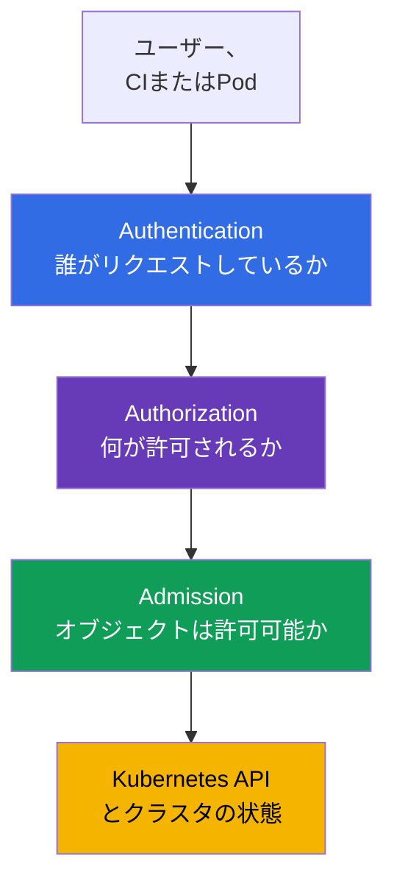
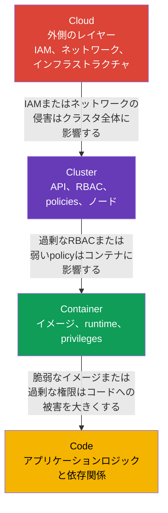

[Русская версия](ru.md) · [Eng version](README.md) · [Versión en español](es.md) · [Version française](fr.md) · [Deutsche Version](de.md) · [ქართული ვერსია](ge.md) · [繁體中文版](tw.md)

# 第03章 クラウドセキュリティの4C: Cloud、Cluster、Container、Code

> **この先。** 前章までで、cloud native、攻撃対象領域、そしてセキュリティの基本原則を定義しました。ここでは、それらを **4C** モデル、すなわち Cloud、Cluster、Container、Code に適用します。これは KCSA の **Overview of Cloud Native Security**（14%）ドメインの基盤です。唯一の「魔法の」コントロールを探すのではなく、リスクがどのレイヤーで生じ、誰がそれを軽減できるかを把握するのに役立ちます。

## 03.1. 4Cモデル: 4つの防御レイヤー

4Cモデルは、cloud native環境を入れ子になった4つのレイヤー、**Cloud**、**Cluster**、**Container**、**Code** に分けます。各レイヤーには固有の攻撃対象領域、所有者、そして防御手段があります。

- **Cloud** - クラウドプロバイダーのアカウント、ネットワーク、IAM、仮想マシン、ディスク、マネージドサービス。
- **Cluster** - Kubernetes API、control plane、ワーカーノード、RBAC、`NetworkPolicy`、admission control。
- **Container** - イメージ、container runtime、`Pod` の設定、ホストからのプロセス分離。
- **Code** - アプリケーションのソースコード、その依存関係、設定、シークレットの取り扱い。

4Cは製品でも、厳密な責任分界でもありません。これは考え方のモデルです。たとえば、盗まれたIAM credentialsはCloudに属しますが、Kubernetesデータを含むsnapshotを読み取れる場合があります。Codeの依存関係の脆弱性は、攻撃者にContainerでのコマンド実行を許し得ます。また、Clusterの安全でない設定は、他のワークロードのデータへの経路となり得ます。



このモデルは、必ず1つのレイヤーだけを選ぶべきという意味ではありません。防御はdefense in depthとして構築されます。複数の独立した障壁により、侵害の発生確率と影響を低減します。

## 03.2. Cloudレイヤー: インフラストラクチャ、IAM、プロバイダーのネットワーク

Cloudは外側のレイヤーです。クラウドアカウント、組織とプロジェクト、IAM、VPC/VNet、firewallまたはsecurity groups、仮想マシン、storage、KMSが含まれます。managed Kubernetesではcontrol planeの一部をプロバイダーが運用しますが、顧客は引き続き、自身のアカウント、identities、データを安全に設定する責任を負います。

このレイヤーの主な危険は、過度に広いクラウド権限です。CIまたは`Pod`から漏えいした管理者権限を持つcredentialは、新しいVMの作成、object storageの読み取り、ネットワークルールの変更、追加の権限の付与を可能にし得ます。そのため、クラウドrolesは用途ごとに分離し、least privilegeに従う必要があります。さらに、それらを利用するために発行されるcredentials、tokens、role sessionsは短命にし、該当する場合は自動的に更新またはローテーションする必要があります。

| Cloudのリスク | 概念レベルのコントロール | 軽減するもの |
|---|---|---|
| クラウドキーの漏えい | workload identity、短命トークン、ローテーション | 必要なタスクの範囲外での静的キーの利用 |
| 開放されたネットワーク境界 | security groups、firewall、閉じたendpoint | 信頼できないネットワークからのAPIおよびサービスへのアクセス |
| ディスク上のデータの紛失または窃取 | encryption at rest、KMS、キーへのアクセス制限 | snapshotまたは盗難媒体からのデータ読み取り |
| 過度に広いrole | 人、CI、workload用の個別IAM roles | 1つのidentityの侵害時における権限昇格 |

クラウドプロバイダーは自身のインフラストラクチャのセキュリティを担いますが、shared responsibilityは、チームをIAM、ネットワーク、データアクセス、ワークロードの設定責任から解放するものではありません。これらの詳細は次章で扱います。

## 03.3. Clusterレイヤー: 管理境界としてのKubernetes

Clusterは、`Pod`がAPI、ネットワーク、データへのアクセスを得るKubernetesコンポーネントとルールを対象とします。このレイヤーには、API server、`etcd`、ワーカーノード上のkubelet、ServiceAccount、RBAC、`Namespace`、`NetworkPolicy`、Pod Security Admission、audit loggingが含まれます。

Kubernetes APIは中央の管理点です。identityに`Pod`の作成、`Secret`の読み取り、`RoleBinding`の変更権限があれば、その影響は1つのコンテナの侵害より大きくなり得ます。そのため、クラスタでは認証、認可、admission controlが重要です。



RBACは「誰が操作を実行できるか」という問いに答えますが、`Pod`のフィールドが安全かどうかは検査しません。Pod Security Admissionや他のpolicy controlsは、たとえばユーザーに`Pod`の作成権限があっても、privilegedな`Pod`を拒否できます。`NetworkPolicy`はワークロード間で許可する通信フローを制限し、監査は危険な操作の検出を助けます。

典型的な誤りは、`Namespace`を完全な分離と見なすことです。これはオブジェクト名を分割し、しばしばpolicyの境界として機能しますが、それ自体ではネットワークトラフィックを禁止せず、最小限のRBACを付与せず、`Pod`を安全にもしません。

## 03.4. Containerレイヤー: イメージ、runtime、分離

Containerは仮想マシンではありません。同じワーカーノード上のコンテナはホストのカーネルを利用し、container runtimeはLinux namespaces、cgroups、capabilities、その他の仕組みによって分離を作ります。そのため、安全でないコンテナは、ノードまたは隣接するワークロードへの攻撃の起点になり得ます。

このレイヤーでは、起動前のイメージと起動時の制限を分析します。

| 領域 | コントロールの例 | 必要な理由 |
|---|---|---|
| イメージ | 信頼できるregistry、固定されたdigest、脆弱性スキャン | 未知または脆弱なartifactを起動しない |
| プロセスユーザー | non-root UIDと`runAsNonRoot: true` | コンテナ内でのコード実行の影響を低減する |
| 権限 | `allowPrivilegeEscalation: false`、capabilitiesのdrop | プロセスに不要なカーネル権限を与えない |
| ホストとの接続 | 通常のアプリケーションでは`privileged`、`hostPath`、host namespacesを禁止 | ノードへの脱出可能性を低減する |
| Runtime | runtimeの更新、seccomp、AppArmor、sandbox runtime | 利用可能なsyscallsを制限し、分離を強化する |

以下の最小限の`securityContext`は、脆弱性が存在しないことを保証するわけではありませんが、通常のKubernetes v1.36アプリケーションにとって有用なbaselineとなります。

```yaml
apiVersion: v1
kind: Pod
metadata:
  name: catalog
spec:
  securityContext:
    runAsNonRoot: true
    seccompProfile:
      type: RuntimeDefault
  containers:
  - name: web
    image: registry.example/catalog@sha256:<digest>
    securityContext:
      allowPrivilegeEscalation: false
      capabilities:
        drop: ["ALL"]
```

この例を普遍的なレシピと受け取るべきではありません。アプリケーションには、writableなディレクトリや特定のcapabilityが正当に必要な場合があります。正しい対応は、必要な例外だけを与えて記録することであり、`privileged: true`を有効にすることではありません。

## 03.5. Codeレイヤー: アプリケーションと依存関係のチェーン

Codeは、自身のソースコード、ライブラリ、build scripts、設定、入力データを扱う方法を指します。完全に設定されたクラスタであっても、アプリケーションは攻撃対象領域の一部です。脆弱なendpoint、injection、ハードコードされたパスワード、既知のCVEを持つ依存関係は、攻撃者に入口を与えます。

Codeレイヤーにおける主な対策は次のとおりです。

- 依存関係を確認し、適時に更新する。**SCA**（Software Composition Analysis、ソフトウェア構成分析）ツールは、ライブラリのバージョンを既知の脆弱性と対応付けるのに役立つ。
- tokens、パスワード、private keysをリポジトリ、Dockerfile、ログに保存しない。シークレットは専用の仕組みを通じて渡し、それらへのアクセスを制限する。
- 入力データを検証し、安全なAPIを使用して、injectionとRCEのリスクを低減する。
- イメージのビルド前にreview、テスト、静的解析を実施する。
- 設定をコードから分離し、必要がない限りproductionでdebug機能を有効にしない。

Codeレイヤーでの修正は、通常、根本原因を取り除きます。たとえば、`NetworkPolicy`は侵害されたアプリケーションからの送信トラフィックを制限できますが、SQL injectionを修正することはできません。同時に、外側のレイヤーは修正が開発・デリバリーされる間の被害を低減します。

## 03.6. 外側のレイヤーは内側に影響する

4Cのレイヤーは入れ子です。内側のCodeはContainer内で動作し、それはCloudに配置されたCluster内で動作します。そのため、外側のレイヤーの脆弱性または設定ミスは、すべての内側のレイヤーを弱めます。一方で、内側のレイヤーの防御は外側のレイヤーの防御に取って代わりません。



2つの状況を考えてみましょう。

1. `Pod`内のCodeにRCE脆弱性がある。Containerが不要なcapabilitiesなしのnon-rootで起動され、Clusterが`NetworkPolicy`と最小限のRBACを適用し、Cloud IAMがノードに広い権限を与えていなければ、攻撃者が攻撃を展開するのはより困難になる。
2. クラウドのIAM roleがCIにfirewallの変更と管理者roleの付与を許可している。このようなCIの侵害を、安全な`Pod`で補うことはできない。攻撃者はまず外側のレイヤーを変更し、その後Clusterを攻撃できる。

インシデントまたは新しいサービスを分析する実務的な順序は、assetとデータフローを特定し、4つのレイヤーを記し、各レイヤーのidentity、信頼境界、コントロールを挙げることです。これにより、コードもインフラストラクチャも見落としません。

## 03.7. 実務での適用方法

- **変更を4Cで確認する。** 新しいサービスのreviewでは、各レイヤーに対して問いを立てます。必要なIAM permissionsは何か、`ServiceAccount`にはどのAPI権限があるか、イメージはどこから来るか、コードはどの依存関係とシークレットを使用するか。
- **単一の障壁ではなくbaselineを作る。** チームはprivate registry、イメージスキャン、`securityContext`、RBAC、`NetworkPolicy`、監査、クラウドの制限を組み合わせます。1つのコントロールの失敗で、ただちにデータが露出してはなりません。
- **ownershipを分離する。** プラットフォームチームは通常、CloudとClusterのcontrolsを定め、開発者はCodeと自身のContainerの特性に責任を負います。責任境界は明確でなければなりません。さもなければ重要なコントロールに所有者がいなくなります。
- **正しいレイヤーで根本原因を探す。** Gitからのシークレット漏えいは、トラフィックをブロックするだけでなく、Codeとdeliveryプロセスで修正します。過剰なIAM roleは、1つの`Pod`の設定で補おうとせず、Cloudで修正します。
- **例外を確認する。** workloadがcapability、metadataへのアクセス、または広いRBACを要求する場合は、目的、所有者、期限、補完的controlsを文書化します。

## 03.8. Exam vocabulary / ミニ用語集

- **4C** - cloud nativeのセキュリティを体系化するためのCloud、Cluster、Container、Codeのモデル。
- **Cloud** - クラウドアカウント、IAM、ネットワーク、コンピューティング、storageからなるインフラストラクチャレイヤー。
- **Cluster** - Kubernetesコンポーネント、identities、policies、ワーカーノードのレイヤー。
- **Container** - container runtimeが起動するイメージと分離されたプロセス。
- **Code** - ソースコード、依存関係、設定、アプリケーションロジック。
- **IAM** - クラウド環境におけるidentitiesとそのpermissionsの管理。
- **admission control** - Kubernetesに保存する前にAPIオブジェクトを検査または変更すること。
- **SCA** - 既知の脆弱性を特定するためのアプリケーション依存関係の分析。
- **defense in depth** - 単一の障壁ではなく、相互に補完する複数の防御レイヤー。

## 03.9. Exam Essentials / 章のまとめ

- 4Cは、Cloud、Cluster、Container、Codeという4つの入れ子のレイヤーを通じてセキュリティを捉える。
- CloudはIAM、プロバイダーのインフラストラクチャとネットワークを対象とする。過剰なクラウド権限はクラスタ全体にとって危険である。
- Clusterは認証、RBAC、admission control、ネットワークセグメンテーション、監査で保護する。ただし、`Namespace`自体は完全な分離ではない。
- Containerには、信頼できるイメージ、最小権限、ホストからの分離が必要である。
- Codeには依存関係、シークレット、安全な開発が含まれる。外側のcontrolsは被害を低減するが、アプリケーションの脆弱性を修正するものではない。
- 外側のレイヤーの侵害は内側に影響するため、セキュリティは多層的でなければならない。

## 03.10. 混同しやすい点と試験での出題

KCSAの問題では、4Cモデルを使うと、リスクまたはコントロールが属するレイヤーを選べます。イメージスキャンをCodeの防御と混同しないでください。アプリケーションの依存関係を検出する場合があっても、これはContainerとsupply chainに属します。`NetworkPolicy`、RBAC、Pod Security AdmissionはClusterに属します。IAM、security groups、KMSはCloudレイヤーにあります。

MCQ（multiple choice question、選択問題）のよくある落とし穴は、有用ではあるが不十分なコントロールを選択肢に含めることです。たとえば、`NetworkPolicy`はRCE後のネットワーク上の横移動を制限しますが、アプリケーションの脆弱性を修正しません。最も正しい回答は、通常、そのレイヤーでリスクを除去し、必要に応じて隣接レイヤーの防御で補完するものです。

## 03.11. 自己確認問題

### 1. 4Cモデルのレイヤーを外側から内側へ並べた正しい順序はどれですか。
   - a. Cloud → Container → Cluster → Code
   - b. Cloud → Cluster → Container → Code
   - c. Cluster → Cloud → Code → Container
   - d. Code → Container → Cluster → Cloud

<details>
<summary>回答と解説</summary>

**正解: b.** Cloudにはクラスタのインフラストラクチャが含まれ、ClusterにはKubernetes環境が含まれ、Containerにはアプリケーションプロセスが含まれ、Codeが最も内側のレイヤーです。

</details>

### 2. 主にClusterレイヤーに属するコントロールはどれですか。
   - a. object storageのためのIAM role
   - b. `Pod`間のトラフィックを制限する`NetworkPolicy`
   - c. ソースコード内の依存関係のスキャン
   - d. 仮想マシンのディスクのencryption

<details>
<summary>回答と解説</summary>

**正解: b.** `NetworkPolicy`は、ワークロードで許可されるネットワークフローを定義するKubernetesオブジェクトです。ほかの選択肢はそれぞれCloud、Code、Cloudに属します。

</details>

### 3. 通常のコンテナにおけるRCEの影響を最もよく低減するものはどれですか。
   - a. non-rootで実行し、escalationを無効にして不要なcapabilitiesを取り除く
   - b. デバッグを容易にするため、すべてのLinux capabilitiesを追加する
   - c. `ServiceAccount`にcluster-admin roleを与える
   - d. `privileged: true`でコンテナを起動する

<details>
<summary>回答と解説</summary>

**正解: a.** Containerの最小権限は、攻撃者が実行できる操作の範囲を縮小します。他の選択肢は権限を拡大し、被害を大きくします。

</details>

### 4. 安全なコードが過剰なクラウドIAM roleを補えないのはなぜですか。
   - a. IAMはコンテナイメージの内部にしか存在しない
   - b. コードは`privileged: true`なしにはKubernetesで動作できない
   - c. RBACはすべてのクラウドpermissionsを自動的に制限する
   - d. Cloudレイヤーの侵害により、インフラストラクチャとCluster全体へのアクセスを変更できる場合がある

<details>
<summary>回答と解説</summary>

**正解: d.** 外側のCloudレイヤーは内側に影響します。広いIAM roleは、1つのアプリケーションのセキュリティとは無関係に、ネットワーク、VM、データを変更する能力を与え得ます。

</details>

### 5. `Namespace`について正しい記述はどれですか。

   - a. namespacedオブジェクトをグループ化し、policiesの範囲を定めるが、それ自体では完全なsecurity boundaryを作らない。
   - b. すべてのコンテナを自動的にnon-rootで動作させ、すべてのLinux capabilitiesを削除する。
   - c. 個別の`NetworkPolicy`なしに、workload間のすべてのingressとegressを自動的にdeny-allにする。
   - d. cluster-scopedなRBACバインディングが、このnamespace内のリソースに権限を与えることを禁止する。

<details>
<summary>回答と解説</summary>

**正解: a.** `Namespace`は名前の範囲を提供し、RBAC、quota、PSA labels、ネットワークセレクターに便利なscopeを与えますが、それ自体は完全なセキュリティ境界ではありません。分離を作るのは、Namespaceの存在そのものではなく、具体的なcontrolsです。

</details>

> **次へ。** 第02章のCKSでは、4Cモデルを信頼境界と実践的な防御メカニズムの分析により深く用います。このコースの次章では、Cloudレイヤーをさらに詳しく扱います。shared responsibility、IAM、ノード、metadata serviceです。

---
[目次](../README_JP.md) · [第02章](../02/jp.md) · [第04章](../04/jp.md)
