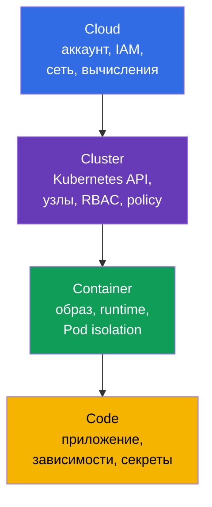
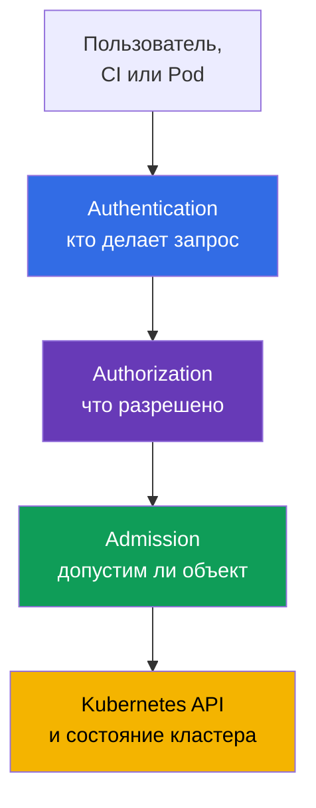
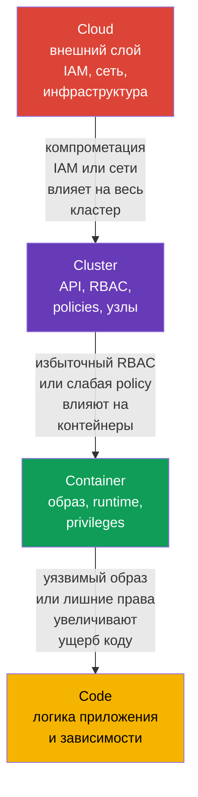

> **Язык:** русский. Переводы будут добавлены после публикации соответствующих файлов.

# Глава 03. 4C облачной безопасности: Cloud, Cluster, Container, Code

> **Что дальше.** В предыдущих главах мы определили cloud native, поверхность атаки и базовые принципы безопасности. Теперь применим их к модели **4C**: Cloud, Cluster, Container и Code. Это основа домена KCSA **Overview of Cloud Native Security** (14%): она помогает не искать единственный «магический» контроль, а видеть, на каком слое возник риск и кто может его уменьшить.

## 03.1. Модель 4C: четыре слоя защиты

Модель 4C делит среду cloud native на четыре вложенных слоя: **Cloud**, **Cluster**, **Container** и **Code**. У каждого слоя своя поверхность атаки, владельцы и средства защиты.

- **Cloud** - аккаунт облачного провайдера, сеть, IAM, виртуальные машины, диски и управляемые сервисы.
- **Cluster** - Kubernetes API, control plane, рабочие узлы, RBAC, `NetworkPolicy` и admission control.
- **Container** - образ, container runtime, настройки `Pod` и изоляция процесса от хоста.
- **Code** - исходный код приложения, его зависимости, конфигурация и работа с секретами.

4C - не продукт и не строгая граница ответственности. Это модель мышления. Например, украденные IAM credentials относятся к Cloud, но могут позволить прочитать snapshot с данными Kubernetes. Уязвимость зависимости в Code может дать атакующему выполнение команд в Container, а небезопасная настройка Cluster - путь к данным других рабочих нагрузок.



Модель не означает, что нужно выбирать ровно один слой. Защита строится как defense in depth: несколько независимых барьеров уменьшают вероятность и последствия компрометации.

## 03.2. Слой Cloud: инфраструктура, IAM и сеть провайдера

Cloud - внешний слой: облачная учётная запись, организации и проекты, IAM, VPC/VNet, firewall или security groups, виртуальные машины, storage и KMS. В managed Kubernetes часть control plane обслуживает провайдер, но клиент по-прежнему отвечает за безопасную конфигурацию своего аккаунта, identities и данных.

Главная опасность этого слоя - слишком широкие облачные права. Credential с правом администратора, утёкший из CI или `Pod`, может создавать новые VM, читать object storage, менять сетевые правила или выдавать дополнительные права. Поэтому облачные роли должны быть разделены по назначению и соответствовать least privilege, а выдаваемые для их использования credentials, tokens или role sessions - быть короткоживущими и, где применимо, автоматически обновляться или ротироваться.

| Риск Cloud | Контроль на концептуальном уровне | Что он снижает |
|---|---|---|
| Утечка облачного ключа | workload identity, короткоживущие токены, ротация | использование статического ключа за пределами нужной задачи |
| Открытый сетевой периметр | security groups, firewall, закрытые endpoint | доступ к API и сервисам из недоверенных сетей |
| Потеря или кража данных на диске | encryption at rest, KMS и ограничение доступа к ключам | чтение данных из snapshot или украденного носителя |
| Слишком широкая роль | отдельные IAM roles для человека, CI и workload | эскалацию прав при компрометации одного identity |

Cloud-провайдер отвечает за безопасность собственной инфраструктуры, но shared responsibility не освобождает команду от настройки IAM, сети, доступа к данным и рабочих нагрузок. Эти детали рассматриваются в следующей главе.

## 03.3. Слой Cluster: Kubernetes как граница управления

Cluster охватывает Kubernetes-компоненты и правила, по которым `Pod` получает доступ к API, сети и данным. В этот слой входят API server, `etcd`, kubelet на рабочих узлах, ServiceAccount, RBAC, `Namespace`, `NetworkPolicy`, Pod Security Admission и audit logging.

Kubernetes API - центральная точка управления. Если identity имеет право создавать `Pod`, читать `Secret` или менять `RoleBinding`, последствия могут быть больше, чем у компрометации одного контейнера. Поэтому в кластере важны аутентификация, авторизация и admission control:



RBAC отвечает на вопрос «кто может выполнить действие», но не проверяет безопасны ли поля `Pod`. Pod Security Admission и другие policy controls могут отклонить, например, привилегированный `Pod`, даже если пользователь вправе создавать `Pod`. `NetworkPolicy` ограничивает разрешённые потоки между рабочими нагрузками, а аудит помогает обнаружить опасные действия.

Типичная ошибка - считать `Namespace` полной изоляцией. Он разделяет имена объектов и часто служит границей политик, однако сам по себе не запрещает сетевой трафик, не выдаёт минимальный RBAC и не делает `Pod` безопасным.

## 03.4. Слой Container: образ, runtime и изоляция

Container - это не виртуальная машина. Контейнеры одного рабочего узла используют ядро хоста, а container runtime создаёт изоляцию через Linux namespaces, cgroups, capabilities и другие механизмы. Поэтому небезопасный контейнер может стать начальной точкой атаки на узел или соседние рабочие нагрузки.

На этом слое анализируют образ до запуска и ограничения во время запуска:

| Область | Пример контроля | Зачем он нужен |
|---|---|---|
| Образ | доверенный registry, фиксированный digest, сканирование уязвимостей | не запускать неизвестный или уязвимый artifact |
| Пользователь процесса | non-root UID и `runAsNonRoot: true` | уменьшить последствия выполнения кода в контейнере |
| Привилегии | `allowPrivilegeEscalation: false`, drop capabilities | не давать процессу ненужные права ядра |
| Связь с хостом | запрет `privileged`, `hostPath`, host namespaces для обычного приложения | уменьшить возможность выхода к узлу |
| Runtime | обновления runtime, seccomp, AppArmor или sandbox runtime | ограничить доступные syscalls и усилить изоляцию |

Минимальный `securityContext` ниже не гарантирует отсутствие уязвимостей, но создаёт полезный baseline для обычного приложения Kubernetes v1.36:

```yaml
apiVersion: v1
kind: Pod
metadata:
  name: catalog
spec:
  securityContext:
    runAsNonRoot: true
    seccompProfile:
      type: RuntimeDefault
  containers:
  - name: web
    image: registry.example/catalog@sha256:<digest>
    securityContext:
      allowPrivilegeEscalation: false
      capabilities:
        drop: ["ALL"]
```

Этот пример не нужно воспринимать как универсальный рецепт. У приложения могут быть обоснованные потребности в writable-каталоге или конкретной capability. Верная реакция - дать только требуемое исключение и зафиксировать его, а не включать `privileged: true`.

## 03.5. Слой Code: приложение и цепочка зависимостей

Code - это собственный исходный код, библиотеки, build scripts, конфигурация и способ обработки входных данных. Приложение остаётся частью поверхности атаки даже в идеально настроенном кластере: уязвимый endpoint, injection, жёстко записанный пароль или зависимость с известной CVE дают атакующему точку входа.

Основные меры на слое Code:

- проверять зависимости и своевременно обновлять их; инструменты **SCA** (Software Composition Analysis, анализ состава программного обеспечения) помогают сопоставлять версии библиотек с известными уязвимостями;
- не хранить токены, пароли и private keys в репозитории, Dockerfile или логах; секреты передают через предназначенный механизм и ограничивают доступ к ним;
- валидировать входные данные и применять безопасные API, чтобы уменьшить риск injection и RCE;
- проводить review, тестирование и статический анализ до сборки образа;
- отделять конфигурацию от кода и не включать debug-функции в production без необходимости.

Исправление на Code-слое обычно устраняет первопричину. Например, `NetworkPolicy` может ограничить исходящий трафик скомпрометированного приложения, но не исправит SQL injection. Одновременно внешние слои уменьшают ущерб, пока исправление разрабатывается и доставляется.

## 03.6. Внешний слой влияет на внутренние

Слои 4C вложены: внутренний Code работает внутри Container, который работает в Cluster, размещённом в Cloud. Поэтому уязвимость или неверная конфигурация внешнего слоя ослабляет все внутренние. При этом защита внутреннего слоя не заменяет защиту внешнего.



Рассмотрим две ситуации.

1. В `Pod` есть RCE-уязвимость в Code. Если Container запущен non-root без лишних capabilities, Cluster применяет `NetworkPolicy` и минимальный RBAC, а Cloud IAM не даёт узлу широких прав, атакующему сложнее развить атаку.
2. Облачная IAM role позволяет CI менять firewall и выдавать роли администратора. Даже защищённый `Pod` не компенсирует компрометацию такого CI: атакующий может сначала изменить внешний слой, затем атаковать Cluster.

Практический порядок разбора инцидента или нового сервиса: определить asset и поток данных, отметить четыре слоя, для каждого назвать identity, границу доверия и контроль. Так не упускаются ни код, ни инфраструктура.

## 03.7. Как это применяют на практике

- **Проверяют изменения по 4C.** В review нового сервиса задают вопросы к каждому слою: какие IAM permissions нужны, какие API-права есть у `ServiceAccount`, откуда поступает образ, какие зависимости и секреты использует код.
- **Делают baseline, а не единичный барьер.** Команда сочетает private registry, сканирование образов, `securityContext`, RBAC, `NetworkPolicy`, аудит и облачные ограничения. Отказ одного контроля не должен сразу раскрывать данные.
- **Разделяют ownership.** Платформенная команда обычно задаёт controls Cloud и Cluster, разработчики отвечают за Code и свойства своего Container. Граница ответственности должна быть явной, иначе важный контроль остаётся без владельца.
- **Ищут первопричину на верном слое.** Утечку секрета из Git исправляют в Code и процессе delivery, а не только блокируют трафик. Избыточную IAM role исправляют в Cloud, а не пытаются компенсировать настройкой одного `Pod`.
- **Проверяют исключения.** Если workload просит capability, доступ к metadata или широкий RBAC, документируют цель, владельца, срок и компенсирующие controls.

## 03.8. Exam vocabulary / Мини-глоссарий

- **4C** - модель Cloud, Cluster, Container, Code для систематизации безопасности cloud native.
- **Cloud** - инфраструктурный слой: облачный аккаунт, IAM, сеть, вычисления и storage.
- **Cluster** - слой Kubernetes-компонентов, identities, политик и рабочих узлов.
- **Container** - образ и изолированный процесс, который запускает container runtime.
- **Code** - исходный код, зависимости, конфигурация и логика приложения.
- **IAM** - управление identities и их permissions в облачной среде.
- **admission control** - проверка или изменение объекта API до сохранения в Kubernetes.
- **SCA** - анализ зависимостей приложения для выявления известных уязвимостей.
- **defense in depth** - несколько дополняющих уровней защиты вместо единственного барьера.

## 03.9. Exam Essentials / Итоги главы

- 4C рассматривает безопасность через четыре вложенных слоя: Cloud, Cluster, Container и Code.
- Cloud охватывает IAM, инфраструктуру и сеть провайдера; избыточные облачные права опасны для всего кластера.
- Cluster защищают аутентификация, RBAC, admission control, сегментация сети и аудит, но `Namespace` сам по себе не является полной изоляцией.
- Container требует доверенного образа, минимальных привилегий и изоляции от хоста.
- Code включает зависимости, секреты и безопасную разработку; внешние controls снижают ущерб, но не заменяют исправление уязвимости приложения.
- Компрометация внешнего слоя влияет на внутренние, поэтому безопасность должна быть многоуровневой.

## 03.10. Не путать и как это встречается на экзамене

В вопросах KCSA модель 4C помогает выбрать слой, к которому относится риск или контроль. Не путайте сканирование образа с защитой Code: оно относится к Container и supply chain, хотя может выявить зависимость приложения. `NetworkPolicy`, RBAC и Pod Security Admission относятся к Cluster. IAM, security groups и KMS находятся на Cloud-слое.

Частая ловушка MCQ (multiple choice question, вопрос с выбором ответа) - вариант с полезным, но недостаточным контролем. Например, `NetworkPolicy` ограничит сетевое перемещение после RCE, но не исправит уязвимость в приложении. Наиболее правильный ответ обычно устраняет риск на его слое и при необходимости дополняется защитой соседних слоёв.

## 03.11. Вопросы для самопроверки

### 1. Какой порядок слоёв модели 4C от внешнего к внутреннему?
   - a. Cloud → Container → Cluster → Code
   - b. Cloud → Cluster → Container → Code
   - c. Cluster → Cloud → Code → Container
   - d. Code → Container → Cluster → Cloud

<details>
<summary>Ответ и разбор</summary>

**Верный ответ: b.** Cloud содержит инфраструктуру кластера, Cluster содержит среду Kubernetes, Container содержит процесс приложения, а Code является самым внутренним слоем.

</details>

### 2. Какой контроль прежде всего относится к слою Cluster?
   - a. IAM role для object storage
   - b. `NetworkPolicy` для ограничения трафика между `Pod`
   - c. Сканирование зависимости в исходном коде
   - d. Encryption диска виртуальной машины

<details>
<summary>Ответ и разбор</summary>

**Верный ответ: b.** `NetworkPolicy` - Kubernetes-объект, который задаёт допустимые сетевые потоки рабочих нагрузок. Остальные варианты относятся соответственно к Cloud, Code и Cloud.

</details>

### 3. Что лучше всего уменьшает последствия RCE в обычном контейнере?
   - a. Запускать non-root, отключить escalation и убрать ненужные capabilities
   - b. Добавить все Linux capabilities для удобства отладки
   - c. Дать `ServiceAccount` роль cluster-admin
   - d. Запустить контейнер с `privileged: true`

<details>
<summary>Ответ и разбор</summary>

**Верный ответ: a.** Минимальные привилегии Container уменьшают доступный атакующему набор действий. Другие варианты расширяют права и увеличивают ущерб.

</details>

### 4. Почему защищённый код не компенсирует избыточную облачную IAM role?
   - a. IAM существует только внутри образа контейнера
   - b. Код не может работать в Kubernetes без `privileged: true`
   - c. RBAC автоматически ограничивает все облачные permissions
   - d. Компрометация Cloud-слоя может позволить менять инфраструктуру и доступ ко всему Cluster

<details>
<summary>Ответ и разбор</summary>

**Верный ответ: d.** Внешний Cloud-слой влияет на внутренние. Широкая IAM role может дать возможность менять сеть, VM или данные независимо от безопасности одного приложения.

</details>

### 5. Какое утверждение о `Namespace` верно?

   - a. Он группирует namespaced-объекты и задаёт область для политик, но сам по себе не создаёт полную security boundary.
   - b. Он автоматически заставляет все контейнеры работать non-root и удаляет у них все Linux capabilities.
   - c. Он автоматически создаёт deny-all ingress и egress между workload без отдельной `NetworkPolicy`.
   - d. Он запрещает cluster-scoped RBAC-привязкам выдавать права на ресурсы внутри этого namespace.

<details>
<summary>Ответ и разбор</summary>

**Верный ответ: a.** `Namespace` даёт область имён и удобный scope для RBAC, quota, PSA labels и сетевых селекторов, но сам по себе не является полной границей безопасности. Изоляцию создают конкретные controls, а не наличие Namespace как такового.

</details>

> **Куда дальше.** В главе 02 CKS модель 4C используется глубже для разбора границ доверия и практических механизмов защиты. Следующая глава этого курса рассматривает Cloud-слой подробнее: shared responsibility, IAM, узлы и metadata service.

---
[Оглавление](../README_RU.md) · [Глава 02](../02/ru.md) · [Глава 04](../04/ru.md)
