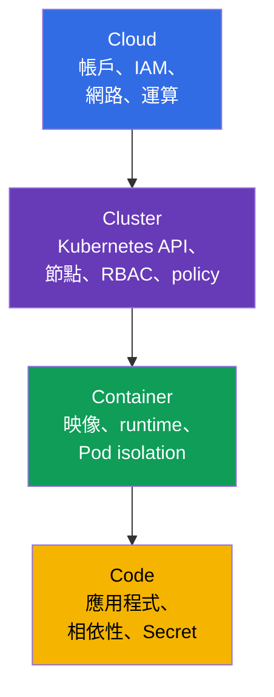
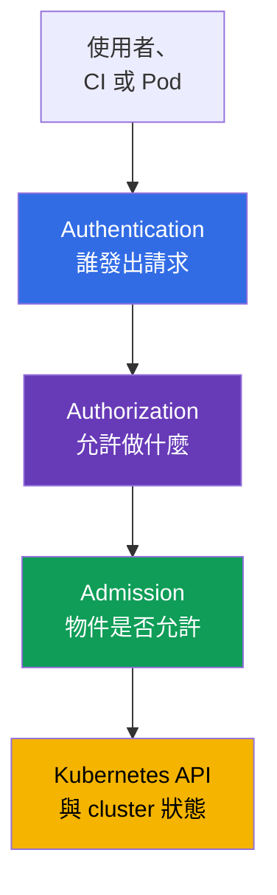
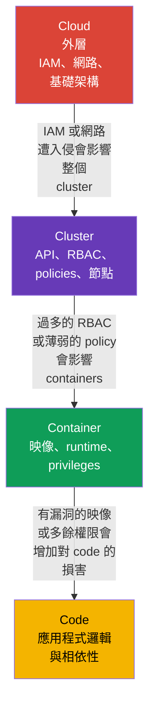

[Русская версия](ru.md) · [Eng version](README.md) · [Versión en español](es.md) · [Version française](fr.md) · [Deutsche Version](de.md) · [ქართული ვერსია](ge.md) · [日本語版](jp.md)

# 第 03 章：雲端安全的 4C：Cloud、Cluster、Container、Code

> **接下來。** 在前幾章中，我們定義了 cloud native、攻擊面與基本安全原則。現在將它們套用至 **4C** 模型：Cloud、Cluster、Container 與 Code。這是 KCSA **Overview of Cloud Native Security** 領域（14%）的基礎：它協助我們不去尋找唯一的「神奇」控制措施，而是辨識風險出現在哪一層，以及誰能降低它。

## 03.1. 4C 模型：四個防護層

4C 模型將 cloud native 環境劃分為四個巢狀層：**Cloud**、**Cluster**、**Container** 與 **Code**。每一層都有各自的攻擊面、負責人與安全控制措施。

- **Cloud** - 雲端服務供應商帳戶、網路、IAM、虛擬機器、磁碟與受管服務。
- **Cluster** - Kubernetes API、control plane、工作節點、RBAC、`NetworkPolicy` 與 admission control。
- **Container** - 映像、container runtime、`Pod` 設定與程序和主機間的隔離。
- **Code** - 應用程式原始碼、其相依性、設定，以及對 Secret 的處理方式。

4C 不是產品，也不是嚴格的責任邊界。它是一種思考模型。例如，遭竊的 IAM credentials 屬於 Cloud，但可能允許讀取含有 Kubernetes 資料的 snapshot。Code 中的相依性漏洞可讓攻擊者在 Container 中執行命令，而不安全的 Cluster 設定則可能成為存取其他工作負載資料的途徑。



此模型不代表必須只選擇一個層次。安全防護應以 defense in depth 建立：多個獨立屏障可降低遭入侵的機率與後果。

## 03.2. Cloud 層：基礎架構、IAM 與供應商網路

Cloud 是外層：雲端帳戶、組織與專案、IAM、VPC/VNet、firewall 或 security groups、虛擬機器、storage 與 KMS。在 managed Kubernetes 中，control plane 的一部分由供應商維護，但客戶仍需負責帳戶、identities 與資料的安全設定。

此層的主要危險是過於寬泛的雲端權限。從 CI 或 `Pod` 外洩、具有管理員權限的 credential，可能建立新的 VM、讀取 object storage、變更網路規則，或授予額外權限。因此，雲端角色必須依用途分離並符合 least privilege；用於使用這些角色的 credentials、tokens 或 role sessions 應為短效，且在適用情況下能自動更新或輪替。

| Cloud 風險 | 概念層級的控制措施 | 可降低的問題 |
|---|---|---|
| 雲端金鑰外洩 | workload identity、短效 token、輪替 | 在所需工作以外使用靜態金鑰 |
| 開放的網路邊界 | security groups、firewall、私有 endpoint | 從不受信任網路存取 API 與服務 |
| 磁碟資料遺失或遭竊 | encryption at rest、KMS 與限制金鑰存取 | 從 snapshot 或遭竊媒體讀取資料 |
| 過於寬泛的角色 | 為人員、CI 與 workload 分設 IAM roles | 單一 identity 遭入侵時的權限提升 |

雲端供應商負責自身基礎架構的安全，但 shared responsibility 並未免除團隊設定 IAM、網路、資料存取與工作負載的責任。下一章將討論這些細節。

## 03.3. Cluster 層：Kubernetes 作為管理邊界

Cluster 包含 Kubernetes 元件，以及 `Pod` 取得 API、網路與資料存取權時所依循的規則。這一層包含 API server、`etcd`、工作節點上的 kubelet、ServiceAccount、RBAC、`Namespace`、`NetworkPolicy`、Pod Security Admission 與 audit logging。

Kubernetes API 是中央管理點。若 identity 有權建立 `Pod`、讀取 `Secret` 或變更 `RoleBinding`，其後果可能比單一 container 遭入侵更大。因此，cluster 中的 authentication、authorization 與 admission control 非常重要：



RBAC 回答「誰可以執行某個動作」，但不會檢查 `Pod` 欄位是否安全。即使使用者有建立 `Pod` 的權限，Pod Security Admission 與其他 policy controls 仍可拒絕例如 privileged `Pod`。`NetworkPolicy` 限制工作負載間允許的流量，而稽核有助於偵測危險操作。

常見錯誤是將 `Namespace` 視為完整隔離。它能分隔物件名稱，且通常是 policy 的邊界，但本身不會禁止網路流量、不會授予最小 RBAC，也不會使 `Pod` 安全。

## 03.4. Container 層：映像、runtime 與隔離

Container 不是虛擬機器。同一工作節點的 containers 共用主機核心，而 container runtime 透過 Linux namespaces、cgroups、capabilities 與其他機制建立隔離。因此，不安全的 container 可能成為攻擊節點或相鄰工作負載的起點。

在此層中，需分析映像在執行前的狀態，以及執行期間的限制：

| 範圍 | 控制措施範例 | 其必要性 |
|---|---|---|
| 映像 | 受信任的 registry、固定 digest、漏洞掃描 | 不執行未知或有漏洞的 artifact |
| 程序使用者 | non-root UID 與 `runAsNonRoot: true` | 降低 container 中執行程式碼的後果 |
| 權限 | `allowPrivilegeEscalation: false`、drop capabilities | 不賦予程序不必要的核心權限 |
| 與主機的連結 | 一般應用程式禁止 `privileged`、`hostPath`、host namespaces | 降低存取節點的可能性 |
| Runtime | runtime 更新、seccomp、AppArmor 或 sandbox runtime | 限制可用 syscalls 並強化隔離 |

以下最小化的 `securityContext` 無法保證不存在漏洞，但可為一般 Kubernetes v1.36 應用程式建立有用的 baseline：

```yaml
apiVersion: v1
kind: Pod
metadata:
  name: catalog
spec:
  securityContext:
    runAsNonRoot: true
    seccompProfile:
      type: RuntimeDefault
  containers:
  - name: web
    image: registry.example/catalog@sha256:<digest>
    securityContext:
      allowPrivilegeEscalation: false
      capabilities:
        drop: ["ALL"]
```

此範例不應被視為通用配方。應用程式可能確實需要可寫入的目錄或特定 capability。正確的做法是只提供所需的例外並將其記錄，而非啟用 `privileged: true`。

## 03.5. Code 層：應用程式與相依性供應鏈

Code 包含自有原始碼、程式庫、build scripts、設定及處理輸入資料的方式。即使 cluster 設定完美，應用程式仍是攻擊面的一部分：有漏洞的 endpoint、injection、硬式寫入的密碼，或有已知 CVE 的相依性，都會給攻擊者一個進入點。

Code 層的主要措施：

- 檢查相依性並及時更新；**SCA**（Software Composition Analysis，軟體組成分析）工具有助於將程式庫版本與已知漏洞比對；
- 不在 repository、Dockerfile 或日誌中存放 token、密碼與 private keys；應透過專用機制傳遞 Secret，並限制其存取；
- 驗證輸入資料並使用安全 API，以降低 injection 與 RCE 的風險；
- 在映像建置前進行 review、測試與靜態分析；
- 將設定與程式碼分離，並且不在 production 中不必要地啟用 debug 功能。

在 Code 層修正通常能消除根本原因。例如，`NetworkPolicy` 可限制遭入侵應用程式的輸出流量，但無法修正 SQL injection。同時，在修正程式開發與交付期間，外層可降低損害。

## 03.6. 外層會影響內層

4C 各層是巢狀的：內層 Code 在 Container 中執行，Container 在 Cluster 中執行，Cluster 部署於 Cloud。因此，外層的漏洞或錯誤設定會削弱所有內層。然而，內層的防護無法取代外層防護。



考慮兩種情況。

1. `Pod` 的 Code 中存在 RCE 漏洞。若 Container 以 non-root 身分執行且沒有多餘 capabilities，Cluster 套用 `NetworkPolicy` 與最小 RBAC，並且 Cloud IAM 未授予節點寬泛權限，攻擊者就更難擴大攻擊。
2. 雲端 IAM role 允許 CI 變更 firewall 並授予管理員角色。即使 `Pod` 已受保護，也無法補償這類 CI 遭入侵：攻擊者可先變更外層，再攻擊 Cluster。

分析事件或新服務時的實務順序是：識別 asset 與資料流，標示四個層次，並為每一層指出 identity、信任邊界與控制措施。如此便不會遺漏程式碼或基礎架構。

## 03.7. 實務上的應用方式

- **依 4C 檢查變更。** 在新服務的 review 中，針對每一層提問：需要哪些 IAM permissions、`ServiceAccount` 有哪些 API 權限、映像來自何處，以及程式碼使用哪些相依性和 Secret。
- **建立 baseline，而非單一屏障。** 團隊結合 private registry、映像掃描、`securityContext`、RBAC、`NetworkPolicy`、稽核與雲端限制。單一控制措施失效不應立即暴露資料。
- **劃分 ownership。** 平台團隊通常設定 Cloud 與 Cluster 的 controls，開發人員則負責 Code 及其 Container 的屬性。責任邊界必須明確，否則重要控制措施會沒有負責人。
- **在正確層次尋找根本原因。** Git 中的 Secret 外洩應在 Code 與 delivery 流程中修正，而不只是封鎖流量。過度寬泛的 IAM role 應在 Cloud 修正，而不是試圖以單一 `Pod` 設定補償。
- **檢查例外。** 若 workload 請求 capability、metadata 存取或寬泛 RBAC，記錄其目的、負責人、期限與補償性 controls。

## 03.8. Exam vocabulary / 迷你詞彙表

- **4C** - 用於系統化 cloud native 安全的 Cloud、Cluster、Container、Code 模型。
- **Cloud** - 基礎架構層：雲端帳戶、IAM、網路、運算與 storage。
- **Cluster** - Kubernetes 元件、identities、policies 與工作節點所在的層。
- **Container** - 由 container runtime 啟動的映像與隔離程序。
- **Code** - 原始碼、相依性、設定與應用程式邏輯。
- **IAM** - 雲端環境中對 identities 及其 permissions 的管理。
- **admission control** - 在 Kubernetes 中儲存前對 API 物件進行檢查或修改。
- **SCA** - 分析應用程式相依性以發現已知漏洞。
- **defense in depth** - 使用多個互補的防護層，而非單一屏障。

## 03.9. Exam Essentials / 本章重點

- 4C 透過四個巢狀層檢視安全：Cloud、Cluster、Container 與 Code。
- Cloud 包含供應商的 IAM、基礎架構與網路；過多的雲端權限對整個 cluster 都有風險。
- Cluster 以 authentication、RBAC、admission control、網路分段與稽核保護，但 `Namespace` 本身不是完整隔離。
- Container 需要受信任的映像、最小權限與和主機的隔離。
- Code 包含相依性、Secret 與安全開發；外層 controls 可降低損害，但不能取代修正應用程式漏洞。
- 外層遭入侵會影響內層，因此安全必須採用多層防護。

## 03.10. 不要混淆，以及在考試中的呈現方式

在 KCSA 題目中，4C 模型可協助選擇風險或控制措施所屬的層次。不要將映像掃描與 Code 防護混淆：它屬於 Container 與 supply chain，雖然它可能發現應用程式相依性。`NetworkPolicy`、RBAC 與 Pod Security Admission 屬於 Cluster。IAM、security groups 與 KMS 則位於 Cloud 層。

MCQ（multiple choice question，選擇題）的常見陷阱是選項提供有用但不足的控制措施。例如，`NetworkPolicy` 能在 RCE 後限制網路橫向移動，但無法修正應用程式漏洞。最正確的答案通常會在該風險所屬層次消除它，必要時再補充相鄰層的防護。

## 03.11. 自我檢查問題

### 1. 4C 模型從外至內的層次順序是什麼？
   - a. Cloud → Container → Cluster → Code
   - b. Cloud → Cluster → Container → Code
   - c. Cluster → Cloud → Code → Container
   - d. Code → Container → Cluster → Cloud

<details>
<summary>答案與說明</summary>

**正確答案：b。** Cloud 包含 cluster 的基礎架構，Cluster 包含 Kubernetes 環境，Container 包含應用程式程序，而 Code 是最內層。

</details>

### 2. 哪一項控制措施主要屬於 Cluster 層？
   - a. object storage 的 IAM role
   - b. 用於限制 `Pod` 之間流量的 `NetworkPolicy`
   - c. 原始碼中相依性的掃描
   - d. 虛擬機器磁碟的 encryption

<details>
<summary>答案與說明</summary>

**正確答案：b。** `NetworkPolicy` 是 Kubernetes 物件，用於指定工作負載允許的網路流量。其他選項分別屬於 Cloud、Code 與 Cloud。

</details>

### 3. 什麼最能降低一般 container 中 RCE 的後果？
   - a. 以 non-root 執行、停用 escalation 並移除不需要的 capabilities
   - b. 為了方便偵錯而加入所有 Linux capabilities
   - c. 為 `ServiceAccount` 賦予 cluster-admin 角色
   - d. 使用 `privileged: true` 執行 container

<details>
<summary>答案與說明</summary>

**正確答案：a。** Container 的最小權限可減少攻擊者可採取的行動。其他選項會擴大權限並增加損害。

</details>

### 4. 為什麼受保護的程式碼無法補償過於寬泛的雲端 IAM role？
   - a. IAM 僅存在於 container 映像內
   - b. 沒有 `privileged: true`，Code 就無法在 Kubernetes 中運作
   - c. RBAC 會自動限制所有雲端 permissions
   - d. Cloud 層遭入侵可允許變更基礎架構與整個 Cluster 的存取權

<details>
<summary>答案與說明</summary>

**正確答案：d。** 外層 Cloud 會影響內層。寬泛 IAM role 可讓人變更網路、VM 或資料，無論單一應用程式的安全性如何。

</details>

### 5. 關於 `Namespace`，哪一項敘述正確？

   - a. 它會將 namespaced 物件分組並為 policies 提供範圍，但本身不會建立完整的 security boundary。
   - b. 它會自動強制所有 containers 以 non-root 執行，並移除所有 Linux capabilities。
   - c. 不需要額外 `NetworkPolicy`，它便會自動在 workload 之間建立 deny-all ingress 和 egress。
   - d. 它禁止 cluster-scoped RBAC 綁定在該 namespace 中對資源授予權限。

<details>
<summary>答案與說明</summary>

**正確答案：a。** `Namespace` 提供名稱範圍，並且是 RBAC、quota、PSA labels 與網路 selectors 的便利 scope，但本身不是完整安全邊界。隔離由具體 controls 建立，而非僅因 Namespace 的存在。

</details>

> **下一步。** 在 CKS 第 02 章中，4C 模型會用於更深入分析信任邊界與實務防護機制。本課程下一章將更詳細討論 Cloud 層：shared responsibility、IAM、節點與 metadata service。

---
[目錄](../README_TW.md) · [第 02 章](../02/tw.md) · [第 04 章](../04/tw.md)
