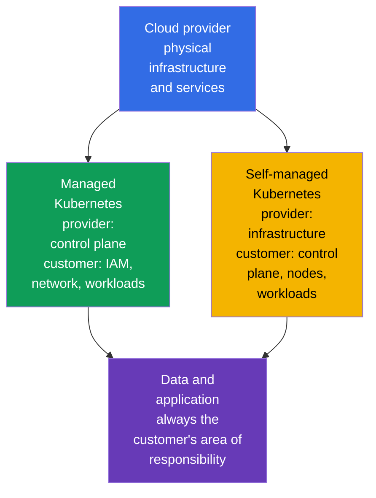
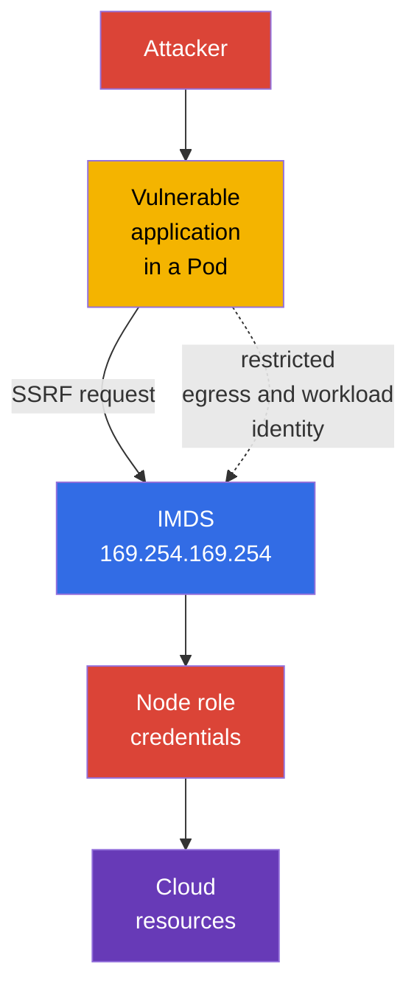

[Русская версия](ru.md) · [Versión en español](es.md) · [Version française](fr.md) · [Deutsche Version](de.md) · [ქართული ვერსია](ge.md) · [繁體中文版](tw.md) · [日本語版](jp.md)

# Chapter 04. Cloud Provider and Infrastructure Security

> **What's next.** The 4C model places the Cloud in the outer layer: an error in IAM, the provider network, or worker node configuration can bypass `Pod` and container defenses. This chapter covers the Cloud Provider and Infrastructure Security competency from the **Overview of Cloud Native Security** domain (14%) and provides a foundation for subsequent topics on cluster components, networks, and secrets.

## 04.1. Shared responsibility: managed and self-managed Kubernetes

The cloud does not eliminate responsibility for security; it divides it. The boundary depends on the service model and the contract of a particular provider. Therefore, before conducting an assessment, answer two questions: who operates the component, and who defines its secure configuration?

In managed Kubernetes, such as EKS, GKE, or AKS, the provider usually operates the control plane: it ensures API server availability, updates the underlying infrastructure, and protects physical data centers. However, the cluster owner remains responsible for its organization's IAM, Kubernetes users and roles, network settings, images, workloads, secrets, and data.

In self-managed Kubernetes, the organization is additionally responsible for installing, updating, and hardening the control plane, `etcd`, certificates, node components, and often the underlying network. The provider still remains responsible for the physical infrastructure and some underlying cloud services, but not for the secure Kubernetes configuration established by the customer.

| Area | Managed Kubernetes | Self-managed Kubernetes |
|---|---|---|
| Physical data center and underlying infrastructure | primarily the provider | primarily the provider |
| Control plane and its lifecycle | the provider operates it; the customer defines many access policies | the organization installs, updates, and secures it |
| Worker nodes | responsibility is typically shared | the organization chooses the OS, updates, and hardening |
| IAM, Kubernetes RBAC, workloads, and data | the organization | the organization |
| Application network, access rules, and secrets | the organization | the organization |

A managed service reduces the operational workload, but it does not make a cluster secure automatically. For example, the provider can maintain the API server, yet an overly broad IAM role or a publicly accessible database remains a risk for the account owner.

## 04.2. IAM, cloud credentials, and least privilege

IAM defines which identity can perform an action on a resource: read an object in storage, create a virtual machine, obtain a KMS key, or modify a network rule. An identity can be a person, a CI/CD service, a virtual machine, or a workload. In Kubernetes, cloud IAM often complements RBAC: RBAC authorizes access to the Kubernetes API, while IAM authorizes access to cloud resources.

The primary rule is **least privilege**. A role must include only the necessary actions, resources, and scope. `AdministratorAccess` for an application, a shared access key in a `Secret`, or one role for every service turns the compromise of one `Pod` into the compromise of a large part of the account.

A short-lived credential issued to a specific workload identity is preferable to a long-lived static access key in an image, CI variable, or YAML. Implementation depends on the provider, but the goal is the same: associate the `ServiceAccount` identity with a narrowly scoped cloud role and obtain a temporary token on demand.

| Practice | Why it is safer |
|---|---|
| Separate role for each service | compromise does not grant the permissions of neighboring services |
| Resources and actions explicitly limited | the role cannot modify everything in the account |
| Temporary credentials and rotation | a leaked token has a limited lifetime |
| MFA for privileged people | a password alone is insufficient for administrative access |
| Auditing IAM actions | unusual use of privileges can be detected and investigated |

Do not treat a Kubernetes `ServiceAccount` as a replacement for cloud IAM. It identifies a workload to the Kubernetes API. Access to object storage, KMS, or a provider database requires a separate, correctly associated cloud identity.

## 04.3. Worker nodes and a minimal host OS

A worker node runs `kubelet`, the container runtime, and `Pod` workloads. If an attacker obtains root on a node, they can often read container data, intercept tokens, access the runtime socket, or affect neighboring workloads. Therefore, a node is an important trust boundary, not simply a place to run virtual machines.

A minimal host OS reduces the attack surface: it contains fewer packages, daemons, open ports, and tools that can be used after a compromise. This does not mean that every small OS image is secure by itself. Supported updates, timely vulnerability remediation, controlled configuration, and observability are required.

Basic measures for nodes:

- use a supported OS image and a managed update process;
- install only necessary packages and disable unnecessary services;
- restrict SSH and administrative access with separate identities and network rules;
- protect access to `kubelet` and the container runtime socket;
- do not place workloads with incompatible trust levels on the same node without deliberate isolation;
- collect logs and events to detect deviation from the baseline configuration.

A node update must not be considered only an availability task. An outdated kernel or runtime can contain a container escape path, so patching is part of protecting the Cloud and Cluster layers.

## 04.4. Metadata service and the risk of credentials in a `Pod`

Many cloud platforms provide a metadata service at the link-local address `169.254.169.254`. A virtual machine requests metadata there and, in some models, temporary credentials for its cloud role. This is convenient for automation but dangerous if an application in a `Pod` can freely make requests to the metadata service.

An SSRF (Server-Side Request Forgery) vulnerability illustrates the risk. An attacker does not obtain a shell on the node, but causes a web application to send an HTTP request to `169.254.169.254`. If the request is permitted, the application can return the node role credentials. When that role has overly broad permissions, compromising one `Pod` becomes access to cloud account resources.

Defense consists of multiple layers:

- use a metadata service mechanism that requires a protected request or token, if the provider supports it;
- block `Pod` access to the metadata IP where it is not required, using provider network configuration, CNI, or `NetworkPolicy`;
- do not give applications a broad node role;
- grant cloud permissions directly to the required workload through a separate identity;
- fix SSRF and other application flaws because network controls do not replace secure coding.

Not every `NetworkPolicy` can control the host IP or metadata endpoint: this depends on the CNI and configuration. It is important to understand the goal of the control and test it on the selected platform rather than assume all providers behave identically.

## 04.5. Encryption and the infrastructure network perimeter

**Encryption at rest** protects data when it is stored on a disk, in object storage, in a snapshot, or in a managed database. It usually uses keys managed by the provider or by the organization through KMS. Encryption does not solve the problem of excessive permissions: an identity authorized to read and decrypt can still obtain the data.

**Encryption in transit** protects data while it is transmitted over the network. For APIs, databases, and external services, this is typically TLS. It protects against interception and alteration of traffic in transit, but only if the client verifies the certificate and trusts the correct CA.

Security groups, firewall rules, and ACLs form the cloud network perimeter. They define where connections to a worker node, load balancer, or database may originate. A `0.0.0.0/0` rule for an administrative port is rarely justified. A safer option is to allow only the required protocol, port, and source, for example ingress from a load balancer to an application or administrator access from a protected network.

| Control | Threat it reduces | What it does not replace |
|---|---|---|
| Encryption at rest | reading a lost disk, snapshot, or storage without the key | IAM and data access control |
| TLS in transit | interception and tampering with network traffic | client and server identity verification |
| Security groups | unwanted connections at the cloud network level | `Pod` segmentation through `NetworkPolicy` |
| `NetworkPolicy` | unwanted traffic between workloads | access rules for VMs and cloud services |

Protection is more effective when these mechanisms complement each other: a security group does not expose the node to the internet, `NetworkPolicy` restricts `Pod` traffic, TLS protects the allowed connection, and IAM limits the consequences of a stolen credential.

## 04.6. How this is applied in practice

- **Document responsibility boundaries.** For every cluster, the team records the managed or self-managed model and the owners of the control plane, nodes, network, updates, and backups. This makes an incident not a search for the responsible party, but a clear set of actions.
- **Divide cloud roles by workload.** CI/CD, monitoring, and every application receive separate minimal permissions instead of a shared administrative node role.
- **Build node images as a baseline.** A supported minimal OS, patches, disabled unnecessary services, and restricted access are checked automatically when nodes are created.
- **Protect the metadata endpoint.** In production, verify which `Pod` workloads actually need it, restrict egress, and use workload identity instead of node role credentials.
- **Protect data throughout its path.** Combine encryption for disks, backups, and storage with TLS, private subnets, and narrowly scoped security groups. Separately verify who can use KMS keys.

## 04.7. Exam vocabulary / Mini-glossary

- **shared responsibility model** - division of security responsibilities between the provider and the customer.
- **managed Kubernetes** - a Kubernetes service where the provider operates at least the control plane.
- **self-managed Kubernetes** - Kubernetes that the organization installs and maintains itself.
- **IAM** - a system of identities and permissions for cloud resources.
- **credential** - data that proves an identity: a token, key, certificate, or temporary session.
- **least privilege** - granting only the minimum permissions required.
- **IMDS** - instance metadata service, an endpoint for virtual machine metadata and sometimes credentials.
- **SSRF** - a vulnerability that causes a server to make a request to an address chosen by an attacker.
- **encryption at rest** - encryption of data in storage.
- **encryption in transit** - encryption of data while it travels over a network.
- **security group** - a cloud set of network access rules for a resource.

## 04.8. Exam Essentials / Chapter summary

- Managed Kubernetes reduces the effort of operating the control plane, but IAM, workloads, data, networking, and many configurations remain the organization's responsibility.
- In self-managed Kubernetes, the owner is additionally responsible for updating and hardening the control plane and nodes.
- IAM and Kubernetes RBAC solve different problems. Cloud permissions should be granted to separate identities according to least privilege and, where possible, on a temporary basis.
- Compromise of a worker node is dangerous to many `Pod` workloads, so a minimal supported OS, patching, and restricted administrative access are fundamental controls.
- `Pod` access to `169.254.169.254` can enable theft of node role credentials through SSRF. Restricting access and using workload identity reduce the risk.
- Encryption at rest, TLS, security groups, and `NetworkPolicy` operate at different boundaries and should be used together.

## 04.9. Do not confuse these concepts and how they appear on the exam

KCSA infrastructure questions usually test the division of responsibilities and the purpose of controls, rather than a specific command from one provider. It is important to distinguish the node role from the workload role, encryption of data on disk from encryption on the network, and security groups from `NetworkPolicy`.

A typical trap is the claim that managed Kubernetes transfers all security to the provider. The correct reasoning is that the provider is responsible for its part of the service, but the customer still manages access, data, and workload configuration. Another trap is considering encryption a replacement for IAM: encryption protects a particular path to data, while permissions determine who can use that path.

## 04.10. Self-check questions

### 1. Which responsibility usually remains with the customer in managed Kubernetes?

   - a. Physical security of the provider's data center.
   - b. Repairing the provider's control plane servers.
   - c. Replacing the provider's network equipment.
   - d. Configuring IAM, workloads, and access to data.

Answer and explanation

**Correct answer: d.** A managed service does not remove the customer's responsibility for identities, applications, data, and their configuration.

### 2. Which approach best follows least privilege for an application that needs access to one bucket?

   - a. Give every `Pod` administrator permissions to avoid access errors.
   - b. Put the account administrator key in the container image.
   - c. Give the application a separate role with actions only for the required bucket.
   - d. Use a shared worker node role with full access to storage.

Answer and explanation

**Correct answer: c.** A narrow, separate role reduces the consequences of an application compromise and makes permissions auditable.

### 3. Why can access from a `Pod` to `169.254.169.254` be dangerous?

   - a. This address automatically deletes `Pod` workloads.
   - b. The address is used only by the Kubernetes API server and is always unavailable from the network.
   - c. It disables TLS for external services.
   - d. Through SSRF, an application can obtain node role credentials.

Answer and explanation

**Correct answer: d.** The metadata service can issue temporary virtual machine credentials if provider policy and access to the endpoint allow it.

### 4. Which statement correctly distinguishes encryption at rest from encryption in transit?

   - a. The former protects data in storage, while the latter protects data while it travels over the network.
   - b. The former applies only to `Pod` workloads, while the latter applies only to the control plane.
   - c. They are two names for the same control.
   - d. The former replaces IAM, while the latter replaces RBAC.

Answer and explanation

**Correct answer: a.** These types of encryption address different data states and complement rather than replace access control.

### 5. Which control primarily restricts connections from the internet to the port of a worker virtual machine in the cloud?

   - a. A restrictive ingress security group or firewall rule at the cloud network level.
   - b. A Kubernetes `NetworkPolicy` applied only to a Pod inside the cluster overlay network.
   - c. An RBAC `Role` that allows an application to read only its own `ConfigMap`.
   - d. Encryption at rest for Kubernetes API objects stored in `etcd`.

Answer and explanation

**Correct answer: a.** Internet access to a cloud VM network interface is primarily controlled by cloud/network firewall mechanisms. `NetworkPolicy` controls supported CNI workload traffic, RBAC regulates Kubernetes API authorization, and encryption at rest protects stored data.

> **Where next.** Practical techniques for restricting access to the metadata service are covered in CKS Chapter 05. Worker node and container runtime hardening continues in CKS Chapter 14, while OS and host protection is covered in CKS Chapter 15.

---
[Table of contents](../README.md) · [Chapter 03](../03/README.md) · [Chapter 05](../05/README.md)
