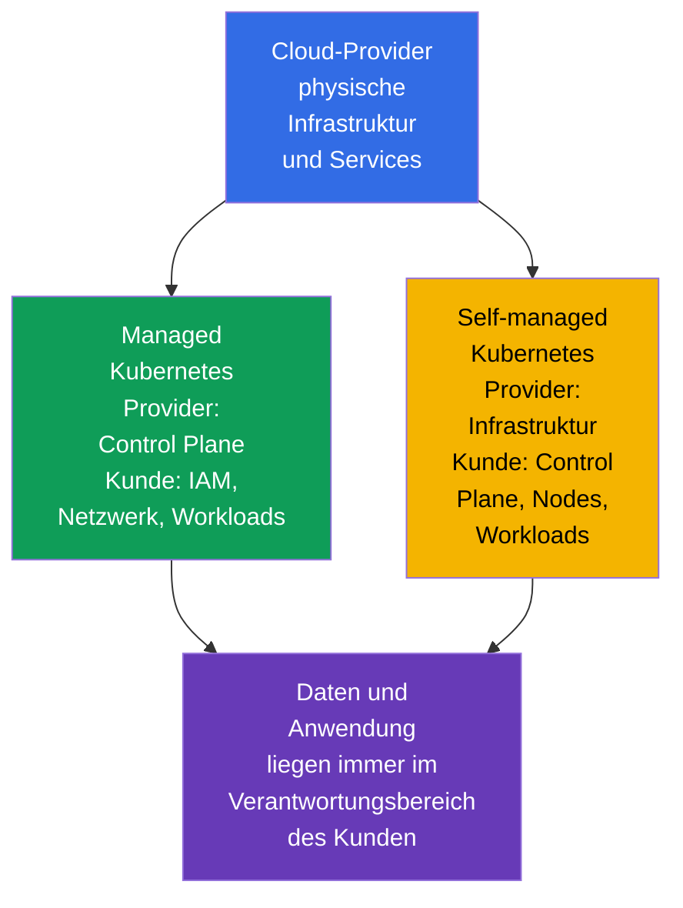
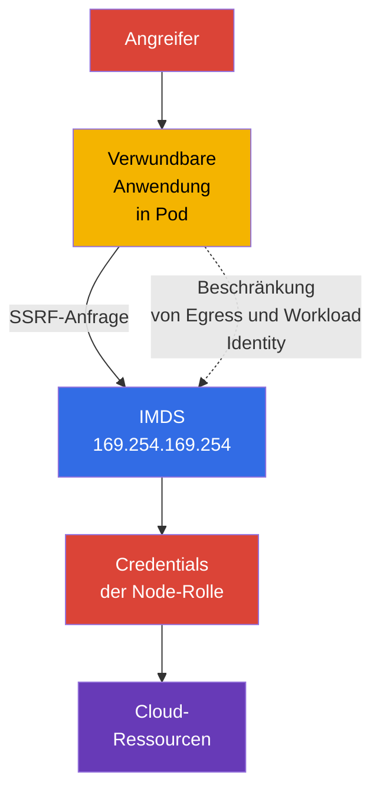

[Русская версия](ru.md) · [Eng version](README.md) · [Versión en español](es.md) · [Version française](fr.md) · [ქართული ვერსია](ge.md) · [繁體中文版](tw.md) · [日本語版](jp.md)

# Kapitel 04. Sicherheit von Cloud-Providern und Infrastruktur

> **Wie geht es weiter.** Das 4C-Modell ordnet die Cloud der äußeren Schicht zu: Ein Fehler in IAM, dem Netzwerk des Providers oder der Konfiguration eines Worker Node kann den Schutz von `Pod` und Containern umgehen. Dieses Kapitel behandelt die Kompetenz Cloud Provider and Infrastructure Security aus der Domäne **Overview of Cloud Native Security** (14 %) und schafft die Grundlage für die folgenden Themen zu Cluster-Komponenten, Netzwerken und Secrets.

## 04.1. Shared responsibility: Managed und self-managed Kubernetes

Die Cloud hebt die Sicherheitsverantwortung nicht auf, sondern teilt sie auf. Die Grenze hängt vom Servicemodell und vom Vertrag des jeweiligen Providers ab. Daher müssen vor einer Prüfung zwei Fragen beantwortet werden: Wer betreibt eine Komponente, und wer legt ihre sichere Konfiguration fest?

Bei managed Kubernetes, etwa EKS, GKE oder AKS, betreibt der Provider in der Regel die Control Plane: Er stellt die Verfügbarkeit des API server sicher, aktualisiert die zugrunde liegende Infrastruktur und schützt die physischen Rechenzentren. Der Cluster-Eigentümer bleibt jedoch weiterhin für IAM seiner Organisation, Benutzer und Kubernetes-Rollen, Netzwerkeinstellungen, Images, Workloads, Secrets und Daten verantwortlich.

Bei self-managed Kubernetes ist die Organisation zusätzlich für Installation, Updates und Hardening der Control Plane, von `etcd`, Zertifikaten, Node-Komponenten und häufig auch des Basisnetzwerks verantwortlich. Der Provider ist weiterhin für die physische Infrastruktur und einen Teil der grundlegenden Cloud-Services zuständig, jedoch nicht für die sichere Kubernetes-Konfiguration, die der Kunde eingerichtet hat.

| Bereich | Managed Kubernetes | Self-managed Kubernetes |
|---|---|---|
| Physisches Rechenzentrum und Basisinfrastruktur | überwiegend Provider | überwiegend Provider |
| Control Plane und ihr Lebenszyklus | Provider betreibt sie, Kunde legt viele Zugriffsrichtlinien fest | Organisation installiert, aktualisiert und schützt sie |
| Worker Nodes | Verantwortung ist üblicherweise geteilt | Organisation wählt Betriebssystem, Updates und Hardening |
| IAM, Kubernetes RBAC, Workloads und Daten | Organisation | Organisation |
| Anwendungsnetzwerk, Zugriffsregeln und Secrets | Organisation | Organisation |

Ein Managed Service reduziert den operativen Aufwand, macht den Cluster aber nicht automatisch sicher. Beispielsweise kann der Provider den API server betreiben, doch eine zu weit gefasste IAM-Rolle oder eine öffentlich zugängliche Datenbank bleiben ein Risiko für den Account-Eigentümer.

## 04.2. IAM, Cloud-Credentials und least privilege

IAM legt fest, welche Identity eine Aktion an einer Ressource ausführen darf: ein Objekt im Storage lesen, eine virtuelle Maschine erstellen, einen KMS-Schlüssel abrufen oder eine Netzwerkregel ändern. Eine Identity kann ein Mensch, ein CI/CD-Service, eine virtuelle Maschine oder eine Workload sein. In Kubernetes ergänzt Cloud-IAM oft RBAC: RBAC erlaubt den Zugriff auf die Kubernetes API, während IAM den Zugriff auf Cloud-Ressourcen erlaubt.

Die wichtigste Regel ist **least privilege**. Eine Rolle darf nur die erforderlichen Aktionen, Ressourcen und den benötigten Geltungsbereich enthalten. `AdministratorAccess` für eine Anwendung, ein gemeinsamer Zugriffsschlüssel in einem `Secret` oder eine Rolle für alle Services machen aus der Kompromittierung eines `Pod` die Kompromittierung eines großen Teils des Accounts.

Bevorzugt wird ein kurzlebiges Credential, das einer bestimmten Workload Identity ausgestellt wird, statt eines langlebigen statischen Access Key in einem Image, einer CI-Variablen oder YAML. Die Umsetzung hängt vom Provider ab, doch das Ziel ist gleich: Die Identity `ServiceAccount` mit einer eng gefassten Cloud-Rolle verknüpfen und bei Bedarf einen temporären Token erhalten.

| Praxis | Warum sicherer |
|---|---|
| Separate Rolle für jeden Service | Die Kompromittierung gewährt keine Rechte benachbarter Services |
| Ressourcen und Aktionen sind ausdrücklich beschränkt | Die Rolle kann nicht alles im Account ändern |
| Temporäre Credentials und Rotation | Ein geleakter Token hat eine begrenzte Lebensdauer |
| MFA für privilegierte Personen | Ein Passwort allein reicht nicht für administrativen Zugriff |
| Audit von IAM-Aktionen | Ungewöhnliche Nutzung von Berechtigungen kann erkannt und untersucht werden |

Kubernetes `ServiceAccount` sollte nicht als Ersatz für Cloud-IAM angesehen werden. Er identifiziert eine Workload gegenüber der Kubernetes API. Der Zugriff auf Object Storage, KMS oder eine Provider-Datenbank erfordert eine separate, korrekt verknüpfte Cloud-Identity.

## 04.3. Worker Nodes und ein minimales Host-Betriebssystem

Ein Worker Node führt `kubelet`, die Container Runtime und `Pod` aus. Erlangt ein Angreifer root auf einem Node, kann er häufig Containerdaten lesen, Tokens abfangen, auf den Runtime Socket zugreifen oder benachbarte Workloads beeinflussen. Daher ist ein Node eine wichtige Vertrauensgrenze und nicht bloß ein Ort zum Ausführen virtueller Maschinen.

Ein minimales Host-Betriebssystem verringert die Angriffsfläche: Es enthält weniger Pakete, Daemons, offene Ports und Werkzeuge, die nach einer Kompromittierung verwendet werden können. Das bedeutet nicht, dass jedes kleine Betriebssystem-Image an sich sicher ist. Erforderlich sind unterstützte Updates, das rechtzeitige Schließen von Schwachstellen, eine kontrollierte Konfiguration und Beobachtbarkeit.

Grundlegende Maßnahmen für Nodes:

- ein unterstütztes Betriebssystem-Image und einen verwalteten Update-Prozess verwenden;
- nur erforderliche Pakete installieren und nicht benötigte Services deaktivieren;
- SSH und administrativen Zugriff mit separaten Identities und Netzwerkregeln beschränken;
- Zugriff auf `kubelet` und den Container Runtime Socket schützen;
- Workloads mit inkompatiblem Vertrauensniveau nicht ohne bewusste Isolation auf demselben Node platzieren;
- Logs und Events erfassen, um Abweichungen von der Basiskonfiguration zu erkennen.

Ein Node-Update darf nicht nur als Aufgabe der Verfügbarkeit betrachtet werden. Ein veralteter Kernel oder eine Runtime kann einen Weg aus dem Container enthalten; daher ist Patching Teil des Schutzes der Cloud- und Cluster-Schicht.

## 04.4. Metadata Service und das Risiko von Credentials in `Pod`

Viele Cloud-Plattformen stellen einen Metadata Service über die Link-Local-Adresse `169.254.169.254` bereit. Eine virtuelle Maschine fragt dort Metadaten und in einigen Modellen temporäre Credentials ihrer Cloud-Rolle ab. Das ist für die Automatisierung praktisch, aber gefährlich, wenn eine Anwendung in `Pod` frei Anfragen an den Metadata Service senden kann.

Die Schwachstelle SSRF (Server-Side Request Forgery, serverseitige Anfragefälschung) veranschaulicht das Risiko. Der Angreifer erhält keine Shell auf dem Node, zwingt aber eine Webanwendung, eine HTTP-Anfrage an `169.254.169.254` zu senden. Wenn die Anfrage erlaubt ist, kann die Anwendung die Credentials der Node-Rolle zurückgeben. Bei zu weit gefassten Berechtigungen dieser Rolle wird aus der Kompromittierung eines `Pod` der Zugriff auf Ressourcen des Cloud-Accounts.

Der Schutz besteht aus mehreren Ebenen:

- einen Metadata-Service-Mechanismus verwenden, der eine geschützte Anfrage oder einen Token erfordert, falls der Provider ihn unterstützt;
- den Zugriff von `Pod` auf die Metadata-IP dort mit der Netzwerkkonfiguration des Providers, CNI oder `NetworkPolicy` blockieren, wo er nicht benötigt wird;
- Anwendungen keine weit gefasste Node-Rolle zuweisen;
- Cloud-Berechtigungen direkt über eine separate Identity an die erforderliche Workload vergeben;
- SSRF und andere Anwendungsfehler beheben, weil Netzwerkkontrollen Secure Coding nicht ersetzen.

Nicht jede `NetworkPolicy` kann die IP des Hosts oder den Metadata Endpoint kontrollieren: Das hängt von CNI und der Konfiguration ab. Wichtig ist, das Ziel der Kontrolle zu kennen und sie auf der gewählten Plattform zu prüfen, statt bei allen Providern dasselbe Verhalten anzunehmen.

## 04.5. Verschlüsselung und Netzwerkperimeter der Infrastruktur

**Encryption at rest** schützt Daten, wenn sie auf einem Datenträger, in Object Storage, einem Snapshot oder einer verwalteten Datenbank gespeichert sind. Üblicherweise werden Schlüssel eingesetzt, die der Provider oder die Organisation über KMS verwaltet. Verschlüsselung löst das Problem übermäßiger Berechtigungen nicht: Eine Identity mit Berechtigung zum Lesen und Entschlüsseln kann die Daten weiterhin abrufen.

**Encryption in transit** schützt Daten bei der Übertragung über das Netzwerk. Für APIs, Datenbanken und externe Services ist dies üblicherweise TLS. Es hilft gegen das Abfangen und Verändern von Traffic auf dem Übertragungsweg, aber nur, wenn der Client das Zertifikat prüft und der richtigen CA vertraut.

Security groups, Firewall Rules und ACL bilden den Netzwerkperimeter der Cloud. Sie legen fest, woher eine Verbindung zu einem Worker Node, Load Balancer oder einer Datenbank möglich ist. Eine Regel `0.0.0.0/0` für einen administrativen Port ist selten gerechtfertigt. Sicherer ist es, nur das erforderliche Protokoll, den Port und die Quelle zu erlauben, beispielsweise Ingress vom Load Balancer zur Anwendung oder Administratorzugriff aus einem geschützten Netzwerk.

| Kontrolle | Welche Bedrohung sie mindert | Was sie nicht ersetzt |
|---|---|---|
| Encryption at rest | Lesen eines verlorenen Datenträgers, Snapshots oder Storage ohne Schlüssel | IAM und Zugriffskontrolle auf Daten |
| TLS in transit | Abfangen und Manipulation von Netzwerk-Traffic | Prüfung der Identity von Client und Server |
| Security groups | Unerwünschte Verbindung auf Ebene des Cloud-Netzwerks | Segmentierung von `Pod` durch `NetworkPolicy` |
| `NetworkPolicy` | Unerwünschter Traffic zwischen Workloads | Zugriffsregeln für VM und Cloud-Services |

Der Schutz ist wirksamer, wenn diese Mechanismen einander ergänzen: Eine Security Group öffnet den Node nicht für das Internet, `NetworkPolicy` beschränkt den Traffic von `Pod`, TLS schützt die erlaubte Verbindung und IAM begrenzt die Folgen eines gestohlenen Credential.

## 04.6. Praktische Anwendung

- **Verantwortungsgrenzen dokumentieren.** Für jeden Cluster hält das Team das Managed- oder self-managed-Modell, den Eigentümer von Control Plane, Nodes, Netzwerk, Updates und Backups fest. Dadurch wird ein Incident nicht zur Suche nach Verantwortlichen, sondern zu einer klaren Abfolge von Maßnahmen.
- **Cloud-Rollen nach Workload aufteilen.** CI/CD, Monitoring und jede Anwendung erhalten separate Minimalberechtigungen statt einer gemeinsamen administrativen Node-Rolle.
- **Node-Images als Baseline erstellen.** Unterstütztes minimales Betriebssystem, Patches, deaktivierte überflüssige Dienste und eingeschränkter Zugriff werden bei der Erstellung von Nodes automatisch geprüft.
- **Metadata Endpoint schützen.** In Production wird geprüft, welche `Pod` ihn tatsächlich benötigen; Egress wird eingeschränkt und statt Credentials der Node-Rolle wird Workload Identity verwendet.
- **Daten über den gesamten Weg schützen.** Verschlüsselung für Datenträger, Backups und Storage wird mit TLS, privaten Subnets und eng gefassten Security Groups kombiniert. Zusätzlich wird geprüft, wer KMS-Schlüssel verwenden darf.

## 04.7. Exam vocabulary / Mini-Glossar

- **shared responsibility model** - Aufteilung der Schutzpflichten zwischen Provider und Kunde.
- **managed Kubernetes** - Kubernetes-Service, bei dem der Provider mindestens die Control Plane betreibt.
- **self-managed Kubernetes** - Kubernetes, das die Organisation selbst installiert und betreibt.
- **IAM** - System für Identities und Berechtigungen für Cloud-Ressourcen.
- **credential** - Daten, die eine Identity bestätigen: Token, Schlüssel, Zertifikat oder temporäre Sitzung.
- **least privilege** - Gewährung nur der minimal erforderlichen Rechte.
- **IMDS** - Instance Metadata Service, Endpoint für Metadaten und manchmal Credentials einer virtuellen Maschine.
- **SSRF** - Schwachstelle, die einen Server zwingt, eine Anfrage an eine vom Angreifer gewählte Adresse auszuführen.
- **encryption at rest** - Verschlüsselung von Daten im Storage.
- **encryption in transit** - Verschlüsselung von Daten bei der Übertragung über das Netzwerk.
- **security group** - Cloud-Regelsatz für den Netzwerkzugriff auf eine Ressource.

## 04.8. Exam Essentials / Zusammenfassung des Kapitels

- Managed Kubernetes reduziert den Betriebsaufwand für die Control Plane, doch IAM, Workloads, Daten, Netzwerk und viele Konfigurationen bleiben Verantwortung der Organisation.
- Bei self-managed Kubernetes ist der Eigentümer zusätzlich für Updates und Hardening der Control Plane und Nodes verantwortlich.
- IAM und Kubernetes RBAC lösen unterschiedliche Aufgaben. Cloud-Berechtigungen sollten nach dem Prinzip least privilege und wenn möglich temporär an separate Identities vergeben werden.
- Die Kompromittierung eines Worker Node ist für viele `Pod` gefährlich; daher sind ein minimales unterstütztes Betriebssystem, Patching und die Beschränkung des administrativen Zugriffs grundlegende Controls.
- Der Zugriff von `Pod` auf `169.254.169.254` kann es ermöglichen, über SSRF die Credentials der Node-Rolle zu stehlen. Zugangsbeschränkungen und Workload Identity mindern das Risiko.
- Encryption at rest, TLS, Security Groups und `NetworkPolicy` arbeiten an unterschiedlichen Grenzen und müssen zusammen eingesetzt werden.

## 04.9. Nicht verwechseln und Vorkommen in der Prüfung

KCSA-Fragen zur Infrastruktur prüfen üblicherweise die Aufteilung der Verantwortung und den Zweck von Controls, nicht den konkreten Befehl eines Providers. Wichtig ist, Node-Rolle und Workload-Rolle, die Verschlüsselung von Daten auf dem Datenträger und im Netzwerk sowie Security Groups und `NetworkPolicy` zu unterscheiden.

Eine typische Falle ist die Behauptung, dass managed Kubernetes die Sicherheit vollständig auf den Provider überträgt. Die richtige Überlegung lautet: Der Provider ist für seinen Teil des Service verantwortlich, doch der Kunde verwaltet weiterhin Zugriff, Daten und die Konfiguration der Workloads. Eine weitere Falle besteht darin, Verschlüsselung als Ersatz für IAM anzusehen: Verschlüsselung schützt einen bestimmten Zugriffsweg auf Daten, Berechtigungen legen dagegen fest, wer diesen Weg nutzen darf.

## 04.10. Fragen zur Selbstkontrolle

### 1. Welche Aufgabe bleibt beim Kunden von managed Kubernetes üblicherweise bestehen?

   - a. Physischer Schutz des Rechenzentrums des Providers.
   - b. Reparatur der Server der Control Plane des Providers.
   - c. Austausch der Netzwerkausrüstung des Providers.
   - d. Konfiguration von IAM, Workloads und Datenzugriff.

Antwort und Erläuterung

**Richtige Antwort: d.** Ein Managed Service entbindet den Kunden nicht von der Verantwortung für Identities, Anwendungen, Daten und deren Konfiguration.

### 2. Welcher Ansatz entspricht für eine Anwendung, die Zugriff auf einen Bucket benötigt, am besten dem Prinzip least privilege?

   - a. Jedem `Pod` Administratorrechte geben, um Zugriffsfehler zu vermeiden.
   - b. Den Administrator-Schlüssel des Accounts im Container-Image ablegen.
   - c. Der Anwendung eine separate Rolle mit Aktionen nur für den benötigten Bucket geben.
   - d. Eine gemeinsame Worker-Node-Rolle mit vollständigem Zugriff auf den Storage verwenden.

Antwort und Erläuterung

**Richtige Antwort: c.** Eine eng gefasste separate Rolle reduziert die Folgen einer Anwendungskompromittierung und macht die Berechtigungen überprüfbar.

### 3. Warum kann der Zugriff aus `Pod` auf `169.254.169.254` gefährlich sein?

   - a. Diese Adresse löscht `Pod` automatisch.
   - b. Die Adresse wird nur vom Kubernetes API server verwendet und ist immer aus dem Netzwerk nicht erreichbar.
   - c. Sie deaktiviert TLS für externe Services.
   - d. Über SSRF kann eine Anwendung die Credentials der Node-Rolle abrufen.

Antwort und Erläuterung

**Richtige Antwort: d.** Der Metadata Service kann temporäre Credentials der virtuellen Maschine ausstellen, wenn die Provider-Richtlinie und der Zugriff auf den Endpoint dies erlauben.

### 4. Welche Aussage unterscheidet Encryption at rest und Encryption in transit korrekt?

   - a. Erstere schützt Daten im Storage, letztere Daten bei der Übertragung über das Netzwerk.
   - b. Erstere wird nur auf `Pod` angewendet, letztere nur auf die Control Plane.
   - c. Es sind zwei Bezeichnungen für dieselbe Kontrolle.
   - d. Erstere ersetzt IAM, letztere ersetzt RBAC.

Antwort und Erläuterung

**Richtige Antwort: a.** Diese Verschlüsselungsarten decken unterschiedliche Zustände der Daten ab und ergänzen die Zugriffskontrolle, statt sie zu ersetzen.

### 5. Welche Kontrolle beschränkt in erster Linie die Verbindung aus dem Internet zu einem Port einer Worker-VM in der Cloud?

   - a. Eine einschränkende Ingress Security Group oder Firewall Rule auf Ebene des Cloud-Netzwerks.
   - b. Kubernetes `NetworkPolicy`, die nur auf Pod innerhalb des Overlay-Netzwerks des Clusters angewendet wird.
   - c. RBAC `Role`, die einer Anwendung nur das Lesen ihres eigenen `ConfigMap` erlaubt.
   - d. Encryption at rest für Kubernetes API objects, die in `etcd` gespeichert sind.

Antwort und Erläuterung

**Richtige Antwort: a.** Der Zugriff aus dem Internet auf die Netzwerkschnittstelle einer Cloud-VM wird in erster Linie durch Cloud-/Netzwerk-Firewall-Mechanismen kontrolliert. `NetworkPolicy` steuert von CNI unterstützten Workload-Traffic, RBAC regelt die Kubernetes API Authorization und Encryption at rest schützt gespeicherte Daten.

> **Wie geht es weiter.** Praktische Verfahren zur Beschränkung des Zugriffs auf den Metadata Service werden in Kapitel 05 CKS behandelt. Hardening von Worker Nodes und Container Runtime wird in Kapitel 14 CKS fortgesetzt, der Schutz von Betriebssystem und Host in Kapitel 15 CKS.

---
[Inhaltsverzeichnis](../README_DE.md) · [Kapitel 03](../03/de.md) · [Kapitel 05](../05/de.md)
