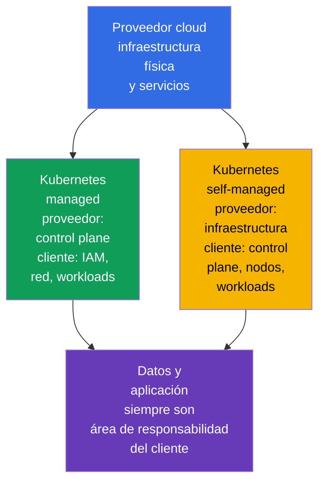
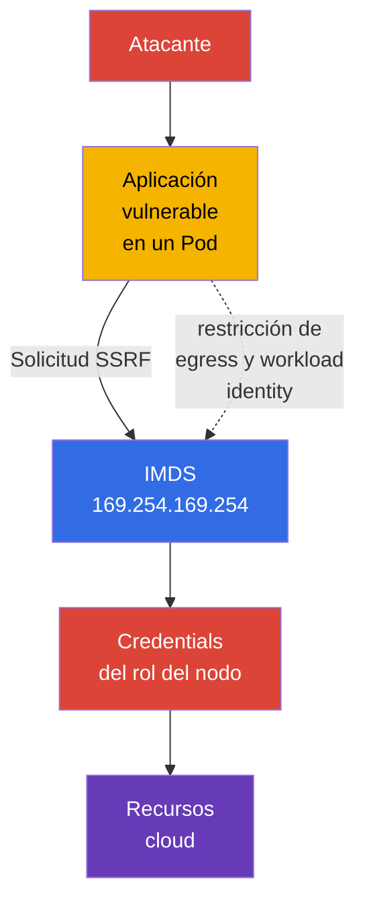

[Русская версия](ru.md) · [Eng version](README.md) · [Version française](fr.md) · [Deutsche Version](de.md) · [ქართული ვერსია](ge.md) · [繁體中文版](tw.md) · [日本語版](jp.md)

# Capítulo 04. Seguridad del proveedor cloud y de la infraestructura

> **Qué sigue.** El modelo 4C sitúa Cloud en la capa externa: un error en IAM, la red del proveedor o la configuración del nodo de trabajo puede eludir las defensas de los `Pod` y los contenedores. Este capítulo desarrolla la competencia Cloud Provider and Infrastructure Security del dominio **Overview of Cloud Native Security** (14%) y proporciona una base para los temas posteriores sobre componentes del clúster, redes y secretos.

## 04.1. Shared responsibility: Kubernetes managed y self-managed

La nube no elimina la responsabilidad por la seguridad, sino que la divide. El límite depende del modelo de servicio y del contrato del proveedor concreto. Por ello, antes de una revisión hay que responder dos preguntas: quién administra el componente y quién define su configuración segura.

En Kubernetes managed, como EKS, GKE o AKS, el proveedor normalmente opera el control plane: garantiza la disponibilidad del API server, actualiza la infraestructura base y protege los centros de datos físicos. Sin embargo, el propietario del clúster sigue siendo responsable del IAM de su organización, los usuarios y roles de Kubernetes, la configuración de red, las imágenes, los workloads, los secretos y los datos.

En Kubernetes self-managed, la organización también es responsable de instalar, actualizar y realizar hardening del control plane, `etcd`, los certificados, los componentes del nodo y, con frecuencia, la red básica. El proveedor sigue siendo responsable de la infraestructura física y de parte de los servicios cloud básicos, pero no de la configuración segura de Kubernetes establecida por el cliente.

| Área | Kubernetes managed | Kubernetes self-managed |
|---|---|---|
| Centro de datos físico e infraestructura base | principalmente el proveedor | principalmente el proveedor |
| Control plane y su ciclo de vida | el proveedor lo opera, el cliente define muchas políticas de acceso | la organización lo instala, actualiza y protege |
| Nodos de trabajo | la responsabilidad suele estar dividida | la organización elige el SO, las actualizaciones y el hardening |
| IAM, Kubernetes RBAC, workloads y datos | la organización | la organización |
| Red de la aplicación, reglas de acceso y secretos | la organización | la organización |

Un servicio managed reduce el trabajo operativo, pero no hace que el clúster sea seguro automáticamente. Por ejemplo, el proveedor puede mantener el API server, pero un rol IAM demasiado amplio o una base de datos accesible públicamente continúan siendo un riesgo para el propietario de la cuenta.

## 04.2. IAM, credenciales cloud y least privilege

IAM determina qué identity puede ejecutar una acción sobre un recurso: leer un objeto del almacenamiento, crear una máquina virtual, obtener una clave KMS o cambiar una regla de red. Una identity puede ser una persona, un servicio CI/CD, una máquina virtual o un workload. En Kubernetes, el IAM cloud suele complementar RBAC: RBAC permite el acceso al Kubernetes API, e IAM permite el acceso a los recursos cloud.

La regla principal es **least privilege**. Un rol debe contener únicamente las acciones, recursos y ámbito necesarios. `AdministratorAccess` para una aplicación, una clave de acceso compartida en un `Secret` o un rol único para todos los servicios hacen que la vulneración de un `Pod` comprometa una gran parte de la cuenta.

Es preferible una credential de corta duración, emitida para una workload identity concreta, en lugar de una access key estática y duradera en una imagen, variable de CI o YAML. La implementación depende del proveedor, pero el objetivo es el mismo: vincular la identity `ServiceAccount` a un rol cloud limitado y obtener un token temporal bajo demanda.

| Práctica | Por qué es más segura |
|---|---|
| Un rol independiente para cada servicio | la vulneración no concede derechos de servicios vecinos |
| Recursos y acciones limitados explícitamente | el rol no puede modificar todo en la cuenta |
| Credentials temporales y rotación | un token filtrado tiene una vida útil limitada |
| MFA para personas privilegiadas | una sola contraseña no basta para el acceso administrativo |
| Auditoría de acciones IAM | permite detectar e investigar un uso inusual de permisos |

No se debe considerar un Kubernetes `ServiceAccount` como sustituto del IAM cloud. Identifica al workload ante el Kubernetes API. El acceso al almacenamiento de objetos, KMS o a la base de datos del proveedor requiere una identity cloud separada y correctamente vinculada.

## 04.3. Nodos de trabajo y SO host mínimo

Un nodo de trabajo ejecuta `kubelet`, el container runtime y los `Pod`. Si un atacante obtiene root en un nodo, con frecuencia puede leer datos de los contenedores, interceptar tokens, acceder al runtime socket o afectar a workloads vecinos. Por ello, el nodo es un límite de confianza importante, no solo un lugar para ejecutar máquinas virtuales.

Un SO host mínimo reduce la superficie de ataque: contiene menos paquetes, daemons, puertos abiertos y herramientas que pueden utilizarse tras una vulneración. Esto no significa que cualquier imagen pequeña de SO sea segura por sí misma. Se necesitan actualizaciones con soporte, corrección oportuna de vulnerabilidades, configuración controlada y observabilidad.

Medidas básicas para los nodos:

- usar una imagen de SO compatible y un proceso de actualización gestionado;
- instalar solo los paquetes necesarios y desactivar los servicios innecesarios;
- restringir SSH y el acceso administrativo con identities y reglas de red independientes;
- proteger el acceso a `kubelet` y al container runtime socket;
- no ubicar en el mismo nodo workloads con niveles de confianza incompatibles sin aislamiento deliberado;
- recopilar logs y eventos para detectar desviaciones de la configuración base.

La actualización del nodo no debe considerarse solo una tarea de disponibilidad. Un kernel o runtime obsoleto puede contener una vía de escape del contenedor, por lo que el patching es parte de la protección de las capas Cloud y Cluster.

## 04.4. Metadata service y el riesgo de credentials en un `Pod`

Muchas plataformas cloud proporcionan un metadata service en la dirección link-local `169.254.169.254`. Una máquina virtual solicita allí metadatos y, en algunos modelos, las credentials temporales de su rol cloud. Esto es práctico para la automatización, pero peligroso si una aplicación en un `Pod` puede realizar libremente solicitudes al metadata service.

Una vulnerabilidad SSRF (Server-Side Request Forgery, falsificación de solicitudes del lado del servidor) ilustra el riesgo. El atacante no obtiene una shell en el nodo, pero obliga a una aplicación web a enviar una solicitud HTTP a `169.254.169.254`. Si la solicitud está permitida, la aplicación puede devolver las credentials del rol del nodo. Con permisos excesivamente amplios en este rol, la vulneración de un `Pod` se convierte en acceso a los recursos de la cuenta cloud.

La protección consta de varios niveles:

- usar el mecanismo de metadata service que requiera una solicitud protegida o token, si el proveedor lo admite;
- bloquear el acceso de los `Pod` a la IP de metadata donde no sea necesario, mediante la configuración de red del proveedor, CNI o `NetworkPolicy`;
- no proporcionar a las aplicaciones un rol amplio de nodo;
- conceder permisos cloud directamente al workload que los necesita mediante una identity separada;
- corregir SSRF y otros errores de aplicación, porque el control de red no sustituye el secure coding.

No toda `NetworkPolicy` puede controlar la IP del host o el metadata endpoint: depende del CNI y de la configuración. Es importante conocer el objetivo del control y comprobarlo en la plataforma elegida, en lugar de suponer un comportamiento idéntico en todos los proveedores.

## 04.5. Cifrado y perímetro de red de la infraestructura

**Encryption at rest** protege los datos cuando se almacenan en un disco, almacenamiento de objetos, snapshot o base de datos gestionada. Normalmente se utilizan claves gestionadas por el proveedor o por la organización mediante KMS. El cifrado no resuelve el problema de permisos excesivos: una identity con permiso para leer y descifrar aún podrá obtener los datos.

**Encryption in transit** protege los datos durante su transmisión por la red. Para API, bases de datos y servicios externos suele ser TLS. Ayuda contra la interceptación y modificación del tráfico en tránsito, pero solo si el cliente valida el certificado y confía en la CA correcta.

Security groups, firewall rules y ACL forman el perímetro de red cloud. Determinan desde dónde es posible conectarse a un nodo de trabajo, load balancer o base de datos. Una regla `0.0.0.0/0` para un puerto administrativo rara vez está justificada. Una opción más segura es permitir únicamente el protocolo, puerto y origen necesarios, por ejemplo, ingress desde un load balancer a la aplicación o acceso de administradores desde una red protegida.

| Control | Qué amenaza reduce | Qué no sustituye |
|---|---|---|
| Encryption at rest | lectura de un disco, snapshot o almacenamiento perdido sin la clave | IAM y control de acceso a los datos |
| TLS in transit | interceptación y alteración del tráfico de red | validación de la identity del cliente y servidor |
| Security groups | conexión no deseada en la red cloud | segmentación de `Pod` mediante `NetworkPolicy` |
| `NetworkPolicy` | tráfico no deseado entre workloads | reglas de acceso a VM y servicios cloud |

La protección es más eficaz cuando estos mecanismos se complementan: el security group no expone el nodo a internet, `NetworkPolicy` restringe el tráfico de los `Pod`, TLS protege la conexión permitida e IAM limita las consecuencias de una credential robada.

## 04.6. Cómo se aplica en la práctica

- **Documentar los límites de responsabilidad.** Para cada clúster, el equipo registra el modelo managed o self-managed, el propietario del control plane, los nodos, la red, las actualizaciones y las copias de seguridad. Así, un incidente no se convierte en una búsqueda de responsables, sino en un conjunto claro de acciones.
- **Dividir los roles cloud por workload.** CI/CD, monitoring y cada aplicación reciben permisos mínimos independientes en lugar de un rol administrativo de nodo compartido.
- **Construir imágenes de nodo como baseline.** Un SO mínimo compatible, parches, servicios innecesarios desactivados y acceso restringido se verifican automáticamente al crear nodos.
- **Proteger el metadata endpoint.** En production se comprueba qué `Pod` realmente lo necesitan, se restringe egress y se usa workload identity en lugar de credentials del rol del nodo.
- **Proteger los datos en todo el recorrido.** El cifrado para discos, backup y almacenes se combina con TLS, subnet privadas y security groups limitados. Por separado, se verifica quién puede utilizar las claves KMS.

## 04.7. Exam vocabulary / Mini-glosario

- **shared responsibility model** - división de las responsabilidades de protección entre proveedor y cliente.
- **managed Kubernetes** - servicio Kubernetes en el que el proveedor opera como mínimo el control plane.
- **self-managed Kubernetes** - Kubernetes que la organización instala y mantiene por sí misma.
- **IAM** - sistema de identities y permisos para recursos cloud.
- **credential** - datos que confirman una identity: token, clave, certificado o sesión temporal.
- **least privilege** - concesión únicamente de los permisos mínimos necesarios.
- **IMDS** - instance metadata service, endpoint de metadatos y, en ocasiones, credentials de una máquina virtual.
- **SSRF** - vulnerabilidad que obliga al servidor a realizar una solicitud a una dirección elegida por el atacante.
- **encryption at rest** - cifrado de datos en almacenamiento.
- **encryption in transit** - cifrado de datos durante su transmisión por la red.
- **security group** - conjunto cloud de reglas de acceso de red a un recurso.

## 04.8. Exam Essentials / Resumen del capítulo

- Kubernetes managed reduce el trabajo de operación del control plane, pero IAM, workloads, datos, red y muchas configuraciones siguen siendo responsabilidad de la organización.
- En Kubernetes self-managed, el propietario también es responsable de actualizar y realizar hardening del control plane y los nodos.
- IAM y Kubernetes RBAC resuelven tareas diferentes. Los permisos cloud deben concederse a identities independientes según el principio de least privilege y, cuando sea posible, temporalmente.
- La vulneración de un nodo de trabajo es peligrosa para muchos `Pod`, por lo que un SO mínimo compatible, patching y la restricción del acceso administrativo son controls básicos.
- El acceso de un `Pod` a `169.254.169.254` puede permitir robar las credentials del rol del nodo mediante SSRF. Restringir el acceso y usar workload identity reducen el riesgo.
- Encryption at rest, TLS, security groups y `NetworkPolicy` operan en límites diferentes y deben utilizarse conjuntamente.

## 04.9. No confundir y cómo aparece en el examen

Las preguntas de KCSA sobre infraestructura normalmente evalúan la división de responsabilidades y la finalidad de los controls, no un comando específico de un proveedor. Es importante distinguir entre el rol del nodo y el rol del workload, el cifrado de datos en disco y en red, así como entre security groups y `NetworkPolicy`.

Una trampa habitual es afirmar que Kubernetes managed transfiere por completo la seguridad al proveedor. El razonamiento correcto es que el proveedor es responsable de su parte del servicio, pero el cliente sigue gestionando el acceso, los datos y la configuración de los workloads. Otra trampa es considerar el cifrado como sustituto de IAM: el cifrado protege una ruta determinada de acceso a los datos, y los permisos determinan quién puede usar esa ruta.

## 04.10. Preguntas de autoevaluación

### 1. ¿Qué responsabilidad suele permanecer en el cliente de Kubernetes managed?

   - a. La seguridad física del centro de datos del proveedor.
   - b. La reparación de los servidores del control plane del proveedor.
   - c. La sustitución del equipo de red del proveedor.
   - d. La configuración de IAM, workloads y acceso a los datos.

Respuesta y explicación

**Respuesta correcta: d.** Un servicio managed no elimina la responsabilidad del cliente por las identities, aplicaciones, datos y su configuración.

### 2. ¿Qué enfoque se ajusta mejor a least privilege para una aplicación que necesita acceso a un único bucket?

   - a. Dar a cada `Pod` permisos de administrador para evitar errores de acceso.
   - b. Colocar una clave de administrador de la cuenta en la imagen del contenedor.
   - c. Conceder a la aplicación un rol separado con acciones solo para el bucket necesario.
   - d. Usar un rol de nodo de trabajo compartido con acceso completo al almacenamiento.

Respuesta y explicación

**Respuesta correcta: c.** Un rol separado y limitado reduce las consecuencias de vulnerar la aplicación y hace verificables los permisos.

### 3. ¿Por qué puede ser peligroso el acceso desde un `Pod` a `169.254.169.254`?

   - a. Esta dirección elimina automáticamente el `Pod`.
   - b. La dirección solo es utilizada por Kubernetes API server y siempre es inaccesible desde la red.
   - c. Desactiva TLS para los servicios externos.
   - d. Mediante SSRF, una aplicación puede obtener las credentials del rol del nodo.

Respuesta y explicación

**Respuesta correcta: d.** Metadata service puede emitir credentials temporales de la máquina virtual si la política del proveedor y el acceso al endpoint lo permiten.

### 4. ¿Qué afirmación distingue correctamente encryption at rest de encryption in transit?

   - a. El primero protege los datos en almacenamiento, el segundo protege los datos durante la transmisión por red.
   - b. El primero se aplica solo a `Pod`, el segundo solo al control plane.
   - c. Son dos nombres para el mismo control.
   - d. El primero sustituye IAM, el segundo sustituye RBAC.

Respuesta y explicación

**Respuesta correcta: a.** Estos tipos de cifrado cubren diferentes estados de los datos y complementan, no sustituyen, el control de acceso.

### 5. ¿Qué control limita principalmente la conexión desde internet al puerto de una máquina virtual de trabajo en la nube?

   - a. Un ingress security group restrictivo o firewall rule en la red cloud.
   - b. Kubernetes `NetworkPolicy`, aplicada solo a un Pod dentro de la red overlay del clúster.
   - c. RBAC `Role`, que permite a la aplicación leer solo su propio `ConfigMap`.
   - d. Encryption at rest para Kubernetes API objects almacenados en `etcd`.

Respuesta y explicación

**Respuesta correcta: a.** El acceso desde internet a la interfaz de red de una VM cloud se controla principalmente mediante mecanismos cloud/network firewall. `NetworkPolicy` administra el tráfico de workloads compatible con CNI, RBAC regula Kubernetes API authorization y encryption at rest protege los datos almacenados.

> **Adónde seguir.** Las técnicas prácticas para restringir el acceso a metadata service se explican en el capítulo 05 de CKS. El hardening del nodo de trabajo y del container runtime continúa en el capítulo 14 de CKS, y la protección del SO y del host, en el capítulo 15 de CKS.

---
[Índice](../README_ES.md) · [Capítulo 03](../03/es.md) · [Capítulo 05](../05/es.md)