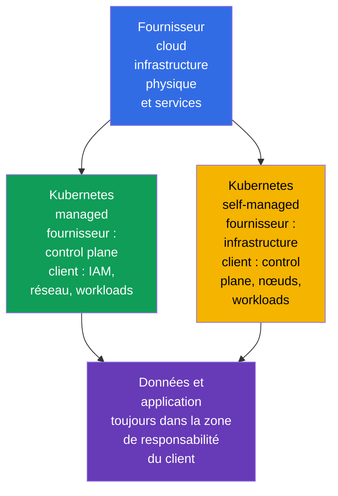
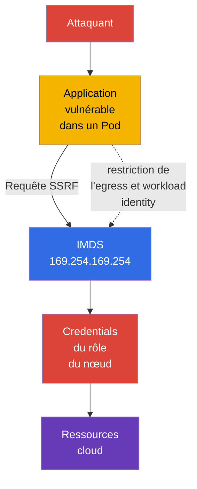

[Русская версия](ru.md) · [Eng version](README.md) · [Versión en español](es.md) · [Deutsche Version](de.md) · [ქართული ვერსია](ge.md) · [繁體中文版](tw.md) · [日本語版](jp.md)

# Chapitre 04. Sécurité du fournisseur cloud et de l'infrastructure

> **La suite.** Le modèle 4C place le Cloud dans la couche externe : une erreur dans IAM, dans le réseau du fournisseur ou dans la configuration d'un nœud worker peut contourner les protections des `Pod` et des conteneurs. Ce chapitre couvre la compétence Cloud Provider and Infrastructure Security du domaine **Overview of Cloud Native Security** (14 %) et pose les bases des thèmes suivants sur les composants du cluster, les réseaux et les secrets.

## 04.1. Shared responsibility : Kubernetes managed et self-managed

Le cloud n'annule pas la responsabilité en matière de sécurité, il la répartit. La frontière dépend du modèle de service et du contrat du fournisseur concerné. Avant une vérification, il faut donc répondre à deux questions : qui exploite le composant et qui définit sa configuration sécurisée.

Dans un Kubernetes managed, par exemple EKS, GKE ou AKS, le fournisseur exploite généralement le control plane : il assure la disponibilité de l'API server, met à jour l'infrastructure sous-jacente et protège les centres de données physiques. Mais le propriétaire du cluster reste responsable de l'IAM de son organisation, des utilisateurs et rôles Kubernetes, de la configuration réseau, des images, des workloads, des secrets et des données.

Dans un Kubernetes self-managed, l'organisation est également responsable de l'installation, de la mise à jour et du hardening du control plane, de `etcd`, des certificats, des composants du nœud et souvent du réseau de base. Le fournisseur reste responsable de l'infrastructure physique et d'une partie des services cloud sous-jacents, mais pas de la configuration sécurisée de Kubernetes mise en place par le client.

| Domaine | Kubernetes managed | Kubernetes self-managed |
|---|---|---|
| Centre de données physique et infrastructure sous-jacente | principalement le fournisseur | principalement le fournisseur |
| Control plane et son cycle de vie | le fournisseur l'exploite, le client définit de nombreuses politiques d'accès | l'organisation l'installe, le met à jour et le protège |
| Nœuds worker | responsabilité généralement partagée | l'organisation choisit l'OS, les mises à jour et le hardening |
| IAM, Kubernetes RBAC, workloads et données | organisation | organisation |
| Réseau de l'application, règles d'accès et secrets | organisation | organisation |

Un service managed réduit la charge opérationnelle, mais ne rend pas automatiquement le cluster sûr. Par exemple, le fournisseur peut maintenir l'API server, mais un rôle IAM trop étendu ou une base de données accessible publiquement restent des risques pour le propriétaire du compte.

## 04.2. IAM, credentials cloud et least privilege

IAM détermine quelle identity peut réaliser une action sur une ressource : lire un objet dans le stockage, créer une machine virtuelle, obtenir une clé KMS ou modifier une règle réseau. Une identity peut être une personne, un service CI/CD, une machine virtuelle ou un workload. Dans Kubernetes, l'IAM cloud complète souvent RBAC : RBAC autorise l'accès à l'API Kubernetes, et IAM autorise l'accès aux ressources cloud.

La règle principale est le **least privilege**. Un rôle ne doit contenir que les actions, ressources et périmètres nécessaires. `AdministratorAccess` pour une application, une clé d'accès partagée dans un `Secret` ou un même rôle pour tous les services font de la compromission d'un seul `Pod` la compromission d'une grande partie du compte.

Il est préférable d'utiliser un credential de courte durée, émis pour une workload identity précise, plutôt qu'une access key statique de longue durée dans une image, une variable CI ou du YAML. L'implémentation dépend du fournisseur, mais l'objectif est le même : associer l'identity `ServiceAccount` à un rôle cloud restreint et obtenir un token temporaire à la demande.

| Pratique | Pourquoi elle est plus sûre |
|---|---|
| Un rôle distinct pour chaque service | une compromission ne donne pas les droits des services voisins |
| Ressources et actions explicitement limitées | le rôle ne peut pas modifier l'ensemble du compte |
| Credentials temporaires et rotation | un token divulgué a une durée de vie limitée |
| MFA pour les personnes privilégiées | un mot de passe seul ne suffit pas pour l'accès administratif |
| Audit des actions IAM | il est possible de détecter et d'enquêter sur un usage inhabituel des droits |

Il ne faut pas considérer un `ServiceAccount` Kubernetes comme un remplacement de l'IAM cloud. Il identifie un workload auprès de l'API Kubernetes. L'accès au stockage d'objets, à KMS ou à une base de données du fournisseur nécessite une identity cloud distincte et correctement associée.

## 04.3. Nœuds worker et OS hôte minimal

Un nœud worker exécute `kubelet`, le container runtime et les `Pod`. Si un attaquant obtient root sur le nœud, il peut souvent lire les données des conteneurs, intercepter les tokens, accéder au runtime socket ou affecter les workloads voisins. Le nœud est donc une frontière de confiance importante, et non un simple emplacement où exécuter des machines virtuelles.

Un OS hôte minimal réduit la surface d'attaque : il contient moins de paquets, de démons, de ports ouverts et d'outils exploitables après une compromission. Cela ne signifie pas que toute petite image d'OS est sûre en elle-même. Il faut des mises à jour prises en charge, une correction rapide des vulnérabilités, une configuration contrôlée et de l'observabilité.

Mesures de base pour les nœuds :

- utiliser une image d'OS prise en charge et un processus de mise à jour géré ;
- n'installer que les paquets nécessaires et désactiver les services inutiles ;
- limiter SSH et l'accès administratif à des identity distinctes et à des règles réseau ;
- protéger l'accès à `kubelet` et au container runtime socket ;
- ne pas placer sur un même nœud des workloads avec des niveaux de confiance incompatibles sans isolation délibérée ;
- collecter les logs et événements afin de détecter tout écart par rapport à la configuration de base.

La mise à jour des nœuds ne doit pas être considérée uniquement comme une tâche de disponibilité. Un kernel ou un runtime obsolète peut contenir un chemin de sortie de conteneur ; le patching fait donc partie de la protection des couches Cloud et Cluster.

## 04.4. Metadata service et risque de credentials dans un `Pod`

De nombreuses plateformes cloud fournissent un metadata service à l'adresse link-local `169.254.169.254`. Une machine virtuelle y demande ses métadonnées et, dans certains modèles, les credentials temporaires de son rôle cloud. C'est pratique pour l'automatisation, mais dangereux si une application dans un `Pod` peut librement adresser des requêtes au metadata service.

Une vulnérabilité SSRF (Server-Side Request Forgery, falsification de requête côté serveur) illustre ce risque. L'attaquant n'obtient pas de shell sur le nœud, mais force une application web à envoyer une requête HTTP vers `169.254.169.254`. Si la requête est autorisée, l'application peut renvoyer les credentials du rôle du nœud. Si ce rôle a des droits trop étendus, la compromission d'un seul `Pod` devient un accès aux ressources du compte cloud.

La protection se compose de plusieurs niveaux :

- utiliser un mécanisme de metadata service exigeant une requête ou un token protégé, s'il est pris en charge par le fournisseur ;
- bloquer l'accès des `Pod` à l'IP des métadonnées lorsqu'il n'est pas nécessaire, à l'aide de la configuration réseau du fournisseur, du CNI ou de `NetworkPolicy` ;
- ne pas attribuer aux applications un rôle de nœud trop étendu ;
- accorder les droits cloud directement au workload requis au moyen d'une identity distincte ;
- corriger les SSRF et autres erreurs de l'application, car le contrôle réseau ne remplace pas le secure coding.

Toute `NetworkPolicy` ne peut pas forcément contrôler l'IP de l'hôte ou le metadata endpoint : cela dépend du CNI et de la configuration. Il est important de connaître l'objectif du contrôle et de le vérifier sur la plateforme choisie, plutôt que de supposer un comportement identique chez tous les fournisseurs.

## 04.5. Chiffrement et périmètre réseau de l'infrastructure

**Encryption at rest** protège les données lorsqu'elles sont stockées sur un disque, dans le stockage d'objets, un snapshot ou une base de données gérée. On utilise généralement des clés gérées par le fournisseur ou par l'organisation via KMS. Le chiffrement ne résout pas le problème des droits excessifs : une identity autorisée à lire et déchiffrer pourra toujours obtenir les données.

**Encryption in transit** protège les données durant leur transfert sur le réseau. Pour les API, les bases de données et les services externes, il s'agit généralement de TLS. Il protège contre l'interception et l'altération du trafic en chemin, mais seulement si le client vérifie le certificat et fait confiance au bon CA.

Les security groups, firewall rules et ACL forment le périmètre réseau du cloud. Ils déterminent d'où il est possible de se connecter à un nœud worker, un load balancer ou une base de données. Une règle `0.0.0.0/0` vers un port administratif est rarement justifiée. Une option plus sûre consiste à n'autoriser que le protocole, le port et la source nécessaires, par exemple l'ingress d'un load balancer vers une application ou l'accès des administrateurs depuis un réseau protégé.

| Contrôle | Menace réduite | Ce qu'il ne remplace pas |
|---|---|---|
| Encryption at rest | lecture d'un disque, snapshot ou stockage perdu sans clé | IAM et le contrôle d'accès aux données |
| TLS in transit | interception et usurpation du trafic réseau | vérification de l'identity du client et du serveur |
| Security groups | connexion indésirable au niveau du réseau cloud | segmentation des `Pod` au moyen de `NetworkPolicy` |
| `NetworkPolicy` | trafic indésirable entre workloads | règles d'accès aux VM et aux services cloud |

La protection est plus efficace lorsque ces mécanismes se complètent : le security group n'expose pas le nœud à Internet, `NetworkPolicy` limite le trafic du `Pod`, TLS protège la connexion autorisée et IAM limite les conséquences d'un credential volé.

## 04.6. Application pratique

- **Documenter les frontières de responsabilité.** Pour chaque cluster, l'équipe consigne le modèle managed ou self-managed, le propriétaire du control plane, des nœuds, du réseau, des mises à jour et des sauvegardes. Un incident devient alors non pas une recherche de responsable, mais un ensemble d'actions clair.
- **Répartir les rôles cloud par workload.** CI/CD, monitoring et chaque application reçoivent des permissions minimales distinctes plutôt qu'un rôle administratif de nœud partagé.
- **Construire les images de nœuds comme baseline.** Un OS minimal pris en charge, les patches, les services inutiles désactivés et l'accès restreint sont automatiquement vérifiés lors de la création des nœuds.
- **Protéger le metadata endpoint.** En production, vérifier quels `Pod` en ont réellement besoin, limiter l'egress et utiliser une workload identity plutôt que les credentials du rôle de nœud.
- **Protéger les données sur tout leur parcours.** Associer le chiffrement des disques, backup et stockages à TLS, à des subnet privés et à des security groups restreints. Vérifier séparément qui peut utiliser les clés KMS.

## 04.7. Exam vocabulary / Mini-glossaire

- **shared responsibility model** - répartition des responsabilités de protection entre le fournisseur et le client.
- **managed Kubernetes** - service Kubernetes dans lequel le fournisseur exploite au minimum le control plane.
- **self-managed Kubernetes** - Kubernetes que l'organisation installe et exploite elle-même.
- **IAM** - système d'identity et de permissions pour les ressources cloud.
- **credential** - donnée confirmant une identity : token, clé, certificat ou session temporaire.
- **least privilege** - attribution des seuls droits minimaux nécessaires.
- **IMDS** - instance metadata service, endpoint des métadonnées et parfois des credentials d'une machine virtuelle.
- **SSRF** - vulnérabilité qui force un serveur à exécuter une requête vers une adresse choisie par l'attaquant.
- **encryption at rest** - chiffrement des données dans le stockage.
- **encryption in transit** - chiffrement des données lors de leur transfert sur le réseau.
- **security group** - ensemble cloud de règles d'accès réseau à une ressource.

## 04.8. Exam Essentials / Points essentiels du chapitre

- Kubernetes managed réduit le travail d'exploitation du control plane, mais IAM, les workloads, les données, le réseau et de nombreuses configurations restent sous la responsabilité de l'organisation.
- Dans un Kubernetes self-managed, le propriétaire est aussi responsable de la mise à jour et du hardening du control plane et des nœuds.
- IAM et Kubernetes RBAC répondent à des besoins différents. Les droits cloud doivent être accordés à des identity distinctes selon le principe du least privilege et, si possible, de manière temporaire.
- La compromission d'un nœud worker est dangereuse pour de nombreux `Pod` ; un OS minimal pris en charge, le patching et la restriction de l'accès administratif sont donc des controls fondamentaux.
- L'accès d'un `Pod` à `169.254.169.254` peut permettre le vol des credentials du rôle de nœud via SSRF. Limiter l'accès et utiliser une workload identity réduit le risque.
- Encryption at rest, TLS, les security groups et `NetworkPolicy` fonctionnent à des frontières différentes et doivent être utilisés ensemble.

## 04.9. À ne pas confondre et présentation à l'examen

Les questions KCSA sur l'infrastructure évaluent généralement la répartition des responsabilités et l'objectif des controls, plutôt qu'une commande spécifique à un fournisseur. Il est important de distinguer le rôle du nœud et celui du workload, le chiffrement des données sur disque et sur le réseau, ainsi que les security groups et `NetworkPolicy`.

Un piège typique consiste à affirmer que Kubernetes managed transfère entièrement la sécurité au fournisseur. Le raisonnement correct est le suivant : le fournisseur est responsable de sa partie du service, mais le client gère toujours l'accès, les données et la configuration des workloads. Un autre piège est de considérer le chiffrement comme un remplacement d'IAM : le chiffrement protège un chemin d'accès particulier aux données, tandis que les permissions déterminent qui peut emprunter ce chemin.

## 04.10. Questions d'auto-évaluation

### 1. Quelle responsabilité reste généralement à la charge du client d'un Kubernetes managed ?

   - a. La sécurité physique du centre de données du fournisseur.
   - b. La réparation des serveurs du control plane du fournisseur.
   - c. Le remplacement de l'équipement réseau du fournisseur.
   - d. La configuration d'IAM, des workloads et de l'accès aux données.

Réponse et explication

**Bonne réponse : d.** Un service managed ne décharge pas le client de sa responsabilité pour les identities, les applications, les données et leur configuration.

### 2. Quelle approche correspond le mieux au least privilege pour une application qui doit accéder à un seul bucket ?

   - a. Donner à chaque `Pod` des droits d'administrateur pour éviter les erreurs d'accès.
   - b. Placer la clé administrateur du compte dans l'image du conteneur.
   - c. Donner à l'application un rôle distinct dont les actions ne concernent que le bucket requis.
   - d. Utiliser le rôle partagé du nœud worker avec un accès complet au stockage.

Réponse et explication

**Bonne réponse : c.** Un rôle distinct et restreint réduit les conséquences d'une compromission de l'application et rend les droits vérifiables.

### 3. Pourquoi l'accès depuis un `Pod` à `169.254.169.254` peut-il être dangereux ?

   - a. Cette adresse supprime automatiquement les `Pod`.
   - b. Cette adresse est utilisée uniquement par l'API server Kubernetes et est toujours inaccessible depuis le réseau.
   - c. Elle désactive TLS pour les services externes.
   - d. Par SSRF, une application peut obtenir les credentials du rôle de nœud.

Réponse et explication

**Bonne réponse : d.** Le metadata service peut délivrer les credentials temporaires de la machine virtuelle, si la politique du fournisseur et l'accès à l'endpoint le permettent.

### 4. Quelle affirmation distingue correctement encryption at rest et encryption in transit ?

   - a. Le premier protège les données dans le stockage, le second les données pendant leur transfert sur le réseau.
   - b. Le premier s'applique uniquement aux `Pod`, le second uniquement au control plane.
   - c. Ce sont deux noms pour le même contrôle.
   - d. Le premier remplace IAM, le second remplace RBAC.

Réponse et explication

**Bonne réponse : a.** Ces types de chiffrement couvrent des états différents des données et complètent le contrôle d'accès au lieu de le remplacer.

### 5. Quel contrôle limite avant tout les connexions depuis Internet vers le port d'une machine virtuelle worker dans le cloud ?

   - a. Un ingress security group restrictif ou une firewall rule au niveau du réseau cloud.
   - b. Une Kubernetes `NetworkPolicy` appliquée uniquement à un Pod dans le réseau overlay du cluster.
   - c. Un RBAC `Role` autorisant une application à lire seulement son propre `ConfigMap`.
   - d. Encryption at rest pour les Kubernetes API objects stockés dans `etcd`.

Réponse et explication

**Bonne réponse : a.** L'accès depuis Internet à l'interface réseau d'une VM cloud est d'abord contrôlé par des mécanismes cloud/network firewall. `NetworkPolicy` gère le trafic des workloads pris en charge par le CNI, RBAC régule la Kubernetes API authorization et encryption at rest protège les données stockées.

> **La suite.** Les méthodes pratiques pour limiter l'accès au metadata service sont abordées dans le chapitre 05 de CKS. Le hardening des nœuds worker et du container runtime se poursuit dans le chapitre 14 de CKS, et la protection de l'OS et de l'hôte dans le chapitre 15 de CKS.

---
[Sommaire](../README_FR.md) · [Chapitre 03](../03/fr.md) · [Chapitre 05](../05/fr.md)