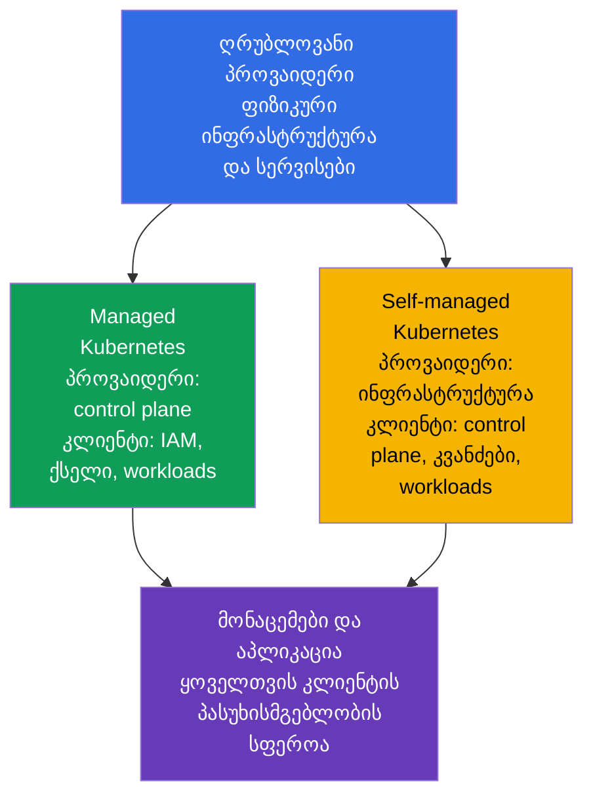
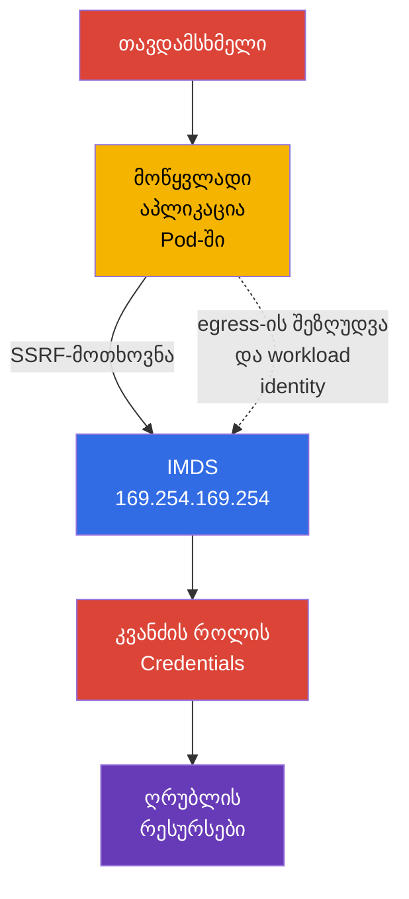

[Русская версия](ru.md) · [Eng version](README.md) · [Versión en español](es.md) · [Version française](fr.md) · [Deutsche Version](de.md) · [繁體中文版](tw.md) · [日本語版](jp.md)

# თავი 04. ღრუბლოვანი პროვაიდერისა და ინფრასტრუქტურის უსაფრთხოება

> **რა არის შემდეგ.** 4C მოდელში Cloud გარე შრეშია მოქცეული: IAM-ში, პროვაიდერის ქსელში ან სამუშაო კვანძის კონფიგურაციაში დაშვებულ შეცდომას შეუძლია `Pod`-ისა და კონტეინერების დაცვას გვერდი აუაროს. ეს თავი მოიცავს **Overview of Cloud Native Security** დომენის (14%) კომპეტენციას Cloud Provider and Infrastructure Security და საფუძველს ქმნის კლასტერის კომპონენტების, ქსელებისა და secrets-ის შესახებ მომდევნო თემებისთვის.

## 04.1. Shared responsibility: managed და self-managed Kubernetes

ღრუბელი უსაფრთხოებაზე პასუხისმგებლობას არ აუქმებს, არამედ მას ანაწილებს. საზღვარი დამოკიდებულია სერვისის მოდელსა და კონკრეტული პროვაიდერის კონტრაქტზე. ამიტომ შემოწმებამდე ორ კითხვას უნდა გაეცეს პასუხი: ვინ მართავს კომპონენტს და ვინ განსაზღვრავს მის უსაფრთხო კონფიგურაციას.

managed Kubernetes-ში, მაგალითად EKS, GKE ან AKS-ში, პროვაიდერი, როგორც წესი, მართავს control plane-ს: უზრუნველყოფს API server-ის ხელმისაწვდომობას, აახლებს საბაზისო ინფრასტრუქტურას და იცავს ფიზიკურ მონაცემთა ცენტრებს. თუმცა კლასტერის მფლობელი კვლავ პასუხისმგებელია თავისი ორგანიზაციის IAM-ზე, Kubernetes-ის მომხმარებლებსა და როლებზე, ქსელის პარამეტრებზე, images-ზე, workloads-ზე, secrets-სა და მონაცემებზე.

self-managed Kubernetes-ში ორგანიზაცია დამატებით პასუხისმგებელია control plane-ის, `etcd`-ის, სერტიფიკატების, კვანძის კომპონენტებისა და ხშირად საბაზისო ქსელის ინსტალაციაზე, განახლებასა და hardening-ზე. პროვაიდერი კვლავ პასუხისმგებელია ფიზიკურ ინფრასტრუქტურასა და საბაზისო ღრუბლოვანი სერვისების ნაწილზე, მაგრამ არა კლიენტის მიერ დაინსტალირებული Kubernetes-ის უსაფრთხო კონფიგურაციაზე.

| სფერო | Managed Kubernetes | Self-managed Kubernetes |
|---|---|---|
| ფიზიკური მონაცემთა ცენტრი და საბაზისო ინფრასტრუქტურა | უპირატესად პროვაიდერი | უპირატესად პროვაიდერი |
| Control plane და მისი სასიცოცხლო ციკლი | პროვაიდერი მართავს, კლიენტი წვდომის ბევრ პოლიტიკას განსაზღვრავს | ორგანიზაცია აყენებს, აახლებს და იცავს |
| სამუშაო კვანძები | პასუხისმგებლობა, როგორც წესი, განაწილებულია | ორგანიზაცია ირჩევს OS-ს, განახლებებსა და hardening-ს |
| IAM, Kubernetes RBAC, workloads და მონაცემები | ორგანიზაცია | ორგანიზაცია |
| აპლიკაციის ქსელი, წვდომის წესები და secrets | ორგანიზაცია | ორგანიზაცია |

Managed სერვისი საოპერაციო სამუშაოს მოცულობას ამცირებს, მაგრამ კლასტერს ავტომატურად უსაფრთხოს არ ხდის. მაგალითად, პროვაიდერს შეუძლია API server-ის მხარდაჭერა, თუმცა ზედმეტად ფართო IAM-როლი ან საჯაროდ ხელმისაწვდომი მონაცემთა ბაზა ანგარიშის მფლობელის რისკად რჩება.

## 04.2. IAM, ღრუბლოვანი credentials და least privilege

IAM განსაზღვრავს, რომელ identity-ს შეუძლია რესურსზე მოქმედების შესრულება: საცავში ობიექტის წაკითხვა, ვირტუალური მანქანის შექმნა, KMS-ის გასაღების მიღება ან ქსელის წესის შეცვლა. Identity შეიძლება იყოს ადამიანი, CI/CD სერვისი, ვირტუალური მანქანა ან workload. Kubernetes-ში cloud IAM ხშირად ავსებს RBAC-ს: RBAC Kubernetes API-ზე წვდომას იძლევა, ხოლო IAM ღრუბლის რესურსებზე წვდომას იძლევა.

მთავარი წესია **least privilege**. როლი უნდა შეიცავდეს მხოლოდ აუცილებელ მოქმედებებს, რესურსებსა და მოქმედების ფარგლებს. აპლიკაციისთვის `AdministratorAccess`-ის მინიჭება, საერთო წვდომის გასაღების `Secret`-ში შენახვა ან ყველა სერვისისთვის ერთი როლის გამოყენება ერთი `Pod`-ის კომპრომეტირებას ანგარიშის დიდი ნაწილის კომპრომეტირებად აქცევს.

სასურველია კონკრეტული workload identity-სთვის გაცემული მოკლევადიანი credential და არა image-ში, CI-ის ცვლადში ან YAML-ში მოთავსებული გრძელვადიანი სტატიკური access key. განხორციელება პროვაიდერზეა დამოკიდებული, თუმცა მიზანი ერთია: `ServiceAccount` identity დაუკავშირდეს ვიწრო ღრუბლოვან როლს და მოთხოვნისას დროებითი token მიიღოს.

| პრაქტიკა | რატომ არის უფრო უსაფრთხო |
|---|---|
| ცალკე როლი თითოეული სერვისისთვის | კომპრომეტირება მეზობელი სერვისების უფლებებს არ იძლევა |
| რესურსები და მოქმედებები ცალსახად შეზღუდულია | როლს ანგარიშში ყველაფრის შეცვლა არ შეუძლია |
| დროებითი credentials და როტაცია | გაჟონილ token-ს მოქმედების შეზღუდული ვადა აქვს |
| MFA პრივილეგირებული ადამიანებისთვის | ადმინისტრაციული წვდომისთვის მხოლოდ ერთი პაროლი საკმარისი არ არის |
| IAM-მოქმედებების აუდიტი | უფლებების უჩვეულო გამოყენების აღმოჩენა და გამოძიება შესაძლებელია |

Kubernetes `ServiceAccount` არ უნდა ჩაითვალოს ღრუბლოვანი IAM-ის შემცვლელად. ის workload-ს Kubernetes API-ს წინაშე აიდენტიფიცირებს. ობიექტების საცავზე, KMS-ზე ან პროვაიდერის მონაცემთა ბაზაზე წვდომას ცალკე, სწორად დაკავშირებული ღრუბლოვანი identity სჭირდება.

## 04.3. სამუშაო კვანძები და მინიმალური ჰოსტის OS

სამუშაო კვანძი უშვებს `kubelet`-ს, container runtime-სა და `Pod`-ს. თუ თავდამსხმელი კვანძზე root წვდომას მიიღებს, მას ხშირად შეუძლია კონტეინერების მონაცემების წაკითხვა, tokens-ის ხელში ჩაგდება, runtime socket-თან დაკავშირება ან მეზობელ workloads-ზე ზემოქმედება. ამიტომ კვანძი ნდობის მნიშვნელოვანი საზღვარია და არა უბრალოდ ვირტუალური მანქანების გაშვების ადგილი.

მინიმალური ჰოსტის OS შეტევის ზედაპირს ამცირებს: მასში ნაკლები package, daemon, ღია port და ინსტრუმენტია, რომელთა გამოყენებაც კომპრომეტირების შემდეგ შეიძლება. ეს არ ნიშნავს, რომ OS-ის ნებისმიერი პატარა image თავისთავად უსაფრთხოა. საჭიროა მხარდაჭერილი განახლებები, მოწყვლადობების დროული აღმოფხვრა, კონტროლირებადი კონფიგურაცია და დაკვირვებადობა.

კვანძების საბაზისო ზომები:

- გამოიყენეთ მხარდაჭერილი OS image და განახლებების მართვადი პროცესი;
- დააყენეთ მხოლოდ საჭირო packages და გამორთეთ არასაჭირო სერვისები;
- შეზღუდეთ SSH და ადმინისტრაციული წვდომა ცალკეული identity-ებითა და ქსელის წესებით;
- დაიცავით `kubelet`-სა და container runtime socket-ზე წვდომა;
- გააზრებული იზოლაციის გარეშე ერთ კვანძზე ნუ განათავსებთ ნდობის შეუთავსებელი დონის workloads-ს;
- შეაგროვეთ logs და მოვლენები, რათა საბაზისო კონფიგურაციიდან გადახრა შეამჩნიოთ.

კვანძის განახლება მხოლოდ ხელმისაწვდომობის ამოცანად არ უნდა განიხილებოდეს. მოძველებული kernel ან runtime შეიძლება კონტეინერიდან გასვლის გზას შეიცავდეს, ამიტომ patching Cloud და Cluster შრეების დაცვის ნაწილია.

## 04.4. Metadata service და `Pod`-ში credentials-ის რისკი

ბევრი ღრუბლოვანი პლატფორმა metadata service-ს link-local მისამართზე `169.254.169.254` უზრუნველყოფს. ვირტუალური მანქანა იქ metadata-ს და, ზოგიერთ მოდელში, თავისი ღრუბლოვანი როლის დროებით credentials-ს ითხოვს. ეს ავტომატიზაციისთვის მოსახერხებელია, მაგრამ სახიფათოა, თუ `Pod`-ში გაშვებულ აპლიკაციას metadata service-ისთვის მოთხოვნების თავისუფლად გაგზავნა შეუძლია.

SSRF (Server-Side Request Forgery, სერვერის მხარეს მოთხოვნის გაყალბება) მოწყვლადობა რისკს თვალსაჩინოს ხდის. თავდამსხმელი კვანძზე shell-ს არ იღებს, მაგრამ ვებაპლიკაციას აიძულებს, HTTP-მოთხოვნა `169.254.169.254`-ის მისამართზე გაგზავნოს. თუ მოთხოვნა დაშვებულია, აპლიკაციამ შეიძლება კვანძის როლის credentials დააბრუნოს. ამ როლის ზედმეტად ფართო უფლებების შემთხვევაში ერთი `Pod`-ის კომპრომეტირება ღრუბლოვანი ანგარიშის რესურსებზე წვდომად გარდაიქმნება.

დაცვა რამდენიმე შრისგან შედგება:

- გამოიყენეთ metadata service-ის მექანიზმი, რომელიც დაცულ მოთხოვნას ან token-ს მოითხოვს, თუ პროვაიდერი მას მხარს უჭერს;
- დაბლოკეთ `Pod`-ის წვდომა metadata IP-ზე იქ, სადაც ეს საჭირო არ არის, პროვაიდერის ქსელური კონფიგურაციის, CNI-ის ან `NetworkPolicy`-ის მეშვეობით;
- აპლიკაციებს კვანძის ფართო როლი არ გადასცეთ;
- ღრუბლოვანი უფლებები უშუალოდ საჭირო workload-ს ცალკე identity-ის მეშვეობით მიანიჭეთ;
- გამოასწორეთ SSRF და აპლიკაციის სხვა შეცდომები, რადგან ქსელური კონტროლი secure coding-ს ვერ შეცვლის.

ყველა `NetworkPolicy` ვერ აკონტროლებს ჰოსტის IP-ს ან metadata endpoint-ს: ეს CNI-სა და კონფიგურაციაზეა დამოკიდებული. მნიშვნელოვანია კონტროლის მიზნის ცოდნა და არჩეულ პლატფორმაზე მისი შემოწმება, ნაცვლად იმისა, რომ ყველა პროვაიდერთან ერთნაირი ქცევა ვივარაუდოთ.

## 04.5. დაშიფვრა და ინფრასტრუქტურის ქსელური პერიმეტრი

**Encryption at rest** იცავს მონაცემებს, როდესაც ისინი დისკზე, ობიექტების საცავში, snapshot-ში ან მართვად მონაცემთა ბაზაში ინახება. ჩვეულებრივ გამოიყენება გასაღებები, რომლებსაც პროვაიდერი ან ორგანიზაცია KMS-ის მეშვეობით მართავს. დაშიფვრა ზედმეტი უფლებების პრობლემას არ წყვეტს: წაკითხვისა და გაშიფვრის ნებართვის მქონე identity კვლავ შეძლებს მონაცემების მიღებას.

**Encryption in transit** იცავს მონაცემებს ქსელში გადაცემისას. API-ების, მონაცემთა ბაზებისა და გარე სერვისებისთვის ეს, ჩვეულებრივ, TLS-ია. ის გზაში ტრაფიკის ხელში ჩაგდებისა და შეცვლისგან დაცვას უწყობს ხელს, მაგრამ მხოლოდ იმ შემთხვევაში, თუ კლიენტი სერტიფიკატს ამოწმებს და სწორ CA-ს ენდობა.

Security groups, firewall rules და ACL ღრუბლის ქსელურ პერიმეტრს ქმნის. ისინი განსაზღვრავს, საიდან შეიძლება სამუშაო კვანძთან, load balancer-თან ან მონაცემთა ბაზასთან დაკავშირება. ადმინისტრაციულ port-ზე `0.0.0.0/0` წესი იშვიათად არის გამართლებული. უფრო უსაფრთხო ვარიანტია მხოლოდ საჭირო protocol-ის, port-ისა და წყაროს დაშვება, მაგალითად ingress load balancer-იდან აპლიკაციისკენ ან ადმინისტრატორების წვდომა დაცული ქსელიდან.

| კონტროლი | რომელ საფრთხეს ამცირებს | რას არ ცვლის |
|---|---|---|
| Encryption at rest | დაკარგული დისკის, snapshot-ის ან საცავის გასაღების გარეშე წაკითხვას | IAM-სა და მონაცემებზე წვდომის კონტროლს |
| TLS in transit | ქსელური ტრაფიკის ხელში ჩაგდებასა და ჩანაცვლებას | კლიენტისა და სერვერის identity-ის შემოწმებას |
| Security groups | არასასურველ დაკავშირებას ღრუბლოვანი ქსელის დონეზე | `Pod`-ის სეგმენტაციას `NetworkPolicy`-ის მეშვეობით |
| `NetworkPolicy` | არასასურველ ტრაფიკს workloads-ს შორის | VM-სა და ღრუბლოვან სერვისებზე წვდომის წესებს |

დაცვა უფრო ეფექტიანია, როდესაც ეს მექანიზმები ერთმანეთს ავსებს: security group კვანძს ინტერნეტში არ ხსნის, `NetworkPolicy` `Pod`-ის ტრაფიკს ზღუდავს, TLS დაშვებულ კავშირს იცავს, ხოლო IAM მოპარული credential-ის შედეგებს ზღუდავს.

## 04.6. როგორ იყენებენ ამას პრაქტიკაში

- **პასუხისმგებლობის საზღვრებს დოკუმენტურად აფიქსირებენ.** თითოეული კლასტერისთვის გუნდი აფიქსირებს managed ან self-managed მოდელს, control plane-ის, კვანძების, ქსელის, განახლებებისა და სარეზერვო ასლების მფლობელს. ამის შედეგად ინციდენტი პასუხისმგებელი პირის ძიება კი არა, მოქმედებების გასაგები ნაკრები ხდება.
- **ღრუბლოვან როლებს workload-ების მიხედვით ყოფენ.** CI/CD, monitoring და თითოეული აპლიკაცია კვანძის საერთო ადმინისტრაციული როლის ნაცვლად ცალკეულ მინიმალურ ნებართვებს იღებს.
- **კვანძების images-ს baseline-ის სახით ქმნიან.** მხარდაჭერილი მინიმალური OS, patches, გამორთული ზედმეტი სერვისები და შეზღუდული წვდომა კვანძების შექმნისას ავტომატურად მოწმდება.
- **Metadata endpoint-ს იცავენ.** production-ში ამოწმებენ, რომელ `Pod`-ებს სჭირდება ის სინამდვილეში, ზღუდავენ egress-ს და კვანძის როლის credentials-ის ნაცვლად workload identity-ს იყენებენ.
- **მონაცემებს მთელ გზაზე იცავენ.** დისკების, backup-ისა და საცავების დაშიფვრას TLS-ს, private subnet-ებსა და ვიწრო security groups-ს უთავსებენ. ცალკე ამოწმებენ, ვის შეუძლია KMS-ის გასაღებების გამოყენება.

## 04.7. Exam vocabulary / მინი-ლექსიკონი

- **shared responsibility model** - დაცვის მოვალეობების განაწილება პროვაიდერსა და კლიენტს შორის.
- **managed Kubernetes** - Kubernetes-სერვისი, რომელშიც პროვაიდერი, სულ მცირე, control plane-ს მართავს.
- **self-managed Kubernetes** - Kubernetes, რომელსაც ორგანიზაცია დამოუკიდებლად აყენებს და ემსახურება.
- **IAM** - ღრუბლის რესურსებისთვის identity-ებისა და ნებართვების სისტემა.
- **credential** - identity-ის დამადასტურებელი მონაცემები: token, გასაღები, სერტიფიკატი ან დროებითი სესია.
- **least privilege** - მხოლოდ მინიმალურად საჭირო უფლებების მინიჭება.
- **IMDS** - instance metadata service, ვირტუალური მანქანის metadata-სა და ზოგჯერ credentials-ის endpoint.
- **SSRF** - მოწყვლადობა, რომელიც სერვერს თავდამსხმელის მიერ არჩეულ მისამართზე მოთხოვნის შესრულებას აიძულებს.
- **encryption at rest** - საცავში მონაცემების დაშიფვრა.
- **encryption in transit** - ქსელში გადაცემისას მონაცემების დაშიფვრა.
- **security group** - რესურსზე ქსელური წვდომის წესების ღრუბლოვანი ნაკრები.

## 04.8. Exam Essentials / თავის შეჯამება

- Managed Kubernetes control plane-ის მართვის მოცულობას ამცირებს, მაგრამ IAM, workloads, მონაცემები, ქსელი და ბევრი პარამეტრი ორგანიზაციის პასუხისმგებლობად რჩება.
- self-managed Kubernetes-ში მფლობელი დამატებით პასუხისმგებელია control plane-ისა და კვანძების განახლებასა და hardening-ზე.
- IAM და Kubernetes RBAC სხვადასხვა ამოცანას წყვეტს. ღრუბლოვანი უფლებები ცალკეულ identity-ებს least privilege პრინციპით და, შესაძლებლობის შემთხვევაში, დროებით უნდა მიენიჭოს.
- სამუშაო კვანძის კომპრომეტირება მრავალი `Pod`-ისთვის სახიფათოა, ამიტომ მინიმალური მხარდაჭერილი OS, patching და ადმინისტრაციული წვდომის შეზღუდვა საბაზისო controls-ია.
- `Pod`-ის წვდომამ `169.254.169.254`-ზე შეიძლება SSRF-ის მეშვეობით კვანძის როლის credentials-ის მოპარვა გახადოს შესაძლებელი. წვდომის შეზღუდვა და workload identity რისკს ამცირებს.
- Encryption at rest, TLS, security groups და `NetworkPolicy` სხვადასხვა საზღვარზე მუშაობს და ერთად უნდა იყოს გამოყენებული.

## 04.9. რა არ უნდა აგერიოთ და როგორ გვხვდება ეს გამოცდაზე

ინფრასტრუქტურის შესახებ KCSA კითხვები, ჩვეულებრივ, პასუხისმგებლობის განაწილებასა და controls-ის დანიშნულებას ამოწმებს და არა ერთი პროვაიდერის კონკრეტულ command-ს. მნიშვნელოვანია კვანძის როლისა და workload-ის როლის, დისკზე და ქსელში მონაცემების დაშიფვრის, ასევე security groups-ისა და `NetworkPolicy`-ის ერთმანეთისგან გარჩევა.

ტიპური ხაფანგია მტკიცება, რომ managed Kubernetes უსაფრთხოებაზე პასუხისმგებლობას მთლიანად პროვაიდერს გადასცემს. სწორი მსჯელობა ასეთია: პროვაიდერი სერვისის თავის ნაწილზეა პასუხისმგებელი, მაგრამ კლიენტი კვლავ მართავს წვდომას, მონაცემებსა და workloads-ის კონფიგურაციას. კიდევ ერთი ხაფანგია დაშიფვრის IAM-ის შემცვლელად მიჩნევა: დაშიფვრა მონაცემებზე წვდომის კონკრეტულ გზას იცავს, ხოლო ნებართვები განსაზღვრავს, ვის შეუძლია ამ გზით სარგებლობა.

## 04.10. თვითშემოწმების კითხვები

### 1. რომელი მოვალეობა რჩება, ჩვეულებრივ, managed Kubernetes-ის კლიენტთან?

   - a. პროვაიდერის მონაცემთა ცენტრის ფიზიკური დაცვა.
   - b. პროვაიდერის control plane-ის სერვერების შეკეთება.
   - c. პროვაიდერის ქსელური აღჭურვილობის შეცვლა.
   - d. IAM-ის, workloads-ისა და მონაცემებზე წვდომის კონფიგურაცია.

პასუხი და განმარტება

**სწორი პასუხია: d.** Managed სერვისი identities-ზე, აპლიკაციებზე, მონაცემებსა და მათ კონფიგურაციაზე პასუხისმგებლობას კლიენტს არ უხსნის.

### 2. რომელი მიდგომა შეესაბამება ყველაზე უკეთ least privilege-ს აპლიკაციისთვის, რომელსაც ერთ bucket-ზე წვდომა სჭირდება?

   - a. წვდომის შეცდომების თავიდან ასაცილებლად თითოეულ `Pod`-ს ადმინისტრატორის უფლებები მიენიჭოს.
   - b. ანგარიშის ადმინისტრატორის გასაღები კონტეინერის image-ში მოთავსდეს.
   - c. აპლიკაციას ცალკე როლი მიენიჭოს, რომლის მოქმედებებიც მხოლოდ საჭირო bucket-ს შეეხება.
   - d. გამოყენებული იყოს სამუშაო კვანძის საერთო როლი საცავზე სრული წვდომით.

პასუხი და განმარტება

**სწორი პასუხია: c.** ვიწრო ცალკეული როლი აპლიკაციის კომპრომეტირების შედეგებს ამცირებს და უფლებებს შემოწმებადს ხდის.

### 3. რატომ შეიძლება იყოს `Pod`-იდან `169.254.169.254`-ზე წვდომა სახიფათო?

   - a. ეს მისამართი `Pod`-ს ავტომატურად შლის.
   - b. მისამართს მხოლოდ Kubernetes API server იყენებს და ის ქსელიდან ყოველთვის მიუწვდომელია.
   - c. ის გარე სერვისებისთვის TLS-ს თიშავს.
   - d. SSRF-ის მეშვეობით აპლიკაციას შეუძლია კვანძის როლის credentials მიიღოს.

პასუხი და განმარტება

**სწორი პასუხია: d.** Metadata service-ს შეუძლია ვირტუალური მანქანის დროებითი credentials გასცეს, თუ პროვაიდერის პოლიტიკა და endpoint-ზე წვდომა ამის საშუალებას იძლევა.

### 4. რომელი მტკიცება განასხვავებს სწორად encryption at rest-სა და encryption in transit-ს?

   - a. პირველი საცავში არსებულ მონაცემებს იცავს, მეორე კი ქსელში გადაცემულ მონაცემებს.
   - b. პირველი მხოლოდ `Pod`-ზე გამოიყენება, მეორე კი მხოლოდ control plane-ზე.
   - c. ეს ერთი და იმავე კონტროლის ორი სახელია.
   - d. პირველი IAM-ს ცვლის, მეორე კი RBAC-ს.

პასუხი და განმარტება

**სწორი პასუხია: a.** დაშიფვრის ეს სახეები მონაცემების სხვადასხვა მდგომარეობას იცავს და წვდომის კონტროლს ავსებს, ნაცვლად იმისა, რომ ის შეცვალოს.

### 5. რომელი კონტროლი ზღუდავს უპირველეს ყოვლისა ინტერნეტიდან ღრუბელში სამუშაო ვირტუალური მანქანის port-თან დაკავშირებას?

   - a. შემზღუდავი ingress security group ან firewall rule ღრუბლოვანი ქსელის დონეზე.
   - b. Kubernetes `NetworkPolicy`, რომელიც მხოლოდ კლასტერის overlay-ქსელის შიგნით Pod-ზეა გამოყენებული.
   - c. RBAC `Role`, რომელიც აპლიკაციას მხოლოდ საკუთარი `ConfigMap`-ის წაკითხვის უფლებას აძლევს.
   - d. Encryption at rest `etcd`-ში შენახული Kubernetes API objects-ისთვის.

პასუხი და განმარტება

**სწორი პასუხია: a.** ინტერნეტიდან ღრუბლოვანი VM-ის ქსელურ ინტერფეისზე წვდომას, უპირველეს ყოვლისა, cloud/network firewall მექანიზმები აკონტროლებს. `NetworkPolicy` მხარდაჭერილი CNI-ის workloads-ის ტრაფიკს მართავს, RBAC Kubernetes API authorization-ს არეგულირებს, ხოლო encryption at rest შენახულ მონაცემებს იცავს.

> **სად წავიდეთ შემდეგ.** Metadata service-ზე წვდომის შეზღუდვის პრაქტიკული მეთოდები განხილულია CKS-ის 05 თავში. სამუშაო კვანძისა და container runtime-ის hardening გრძელდება CKS-ის 14 თავში, ხოლო OS-ისა და ჰოსტის დაცვა - CKS-ის 15 თავში.

---
[სარჩევი](../README_GE.md) · [თავი 03](../03/ge.md) · [თავი 05](../05/ge.md)
