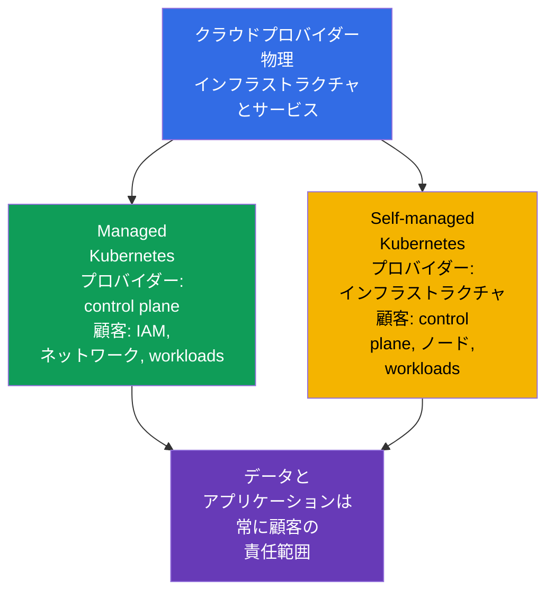
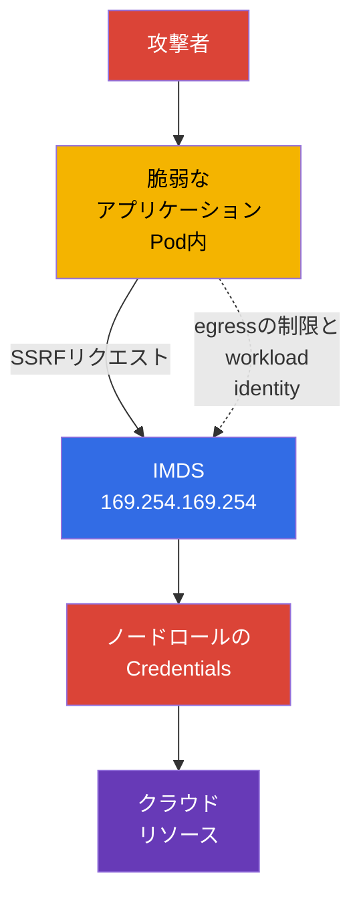

[Русская версия](ru.md) · [Eng version](README.md) · [Versión en español](es.md) · [Version française](fr.md) · [Deutsche Version](de.md) · [ქართული ვერსია](ge.md) · [繁體中文版](tw.md)

# 第04章. クラウドプロバイダーとインフラストラクチャのセキュリティ

> **次へ。** 4CモデルではCloudを最も外側の層に置きます。IAM、プロバイダーのネットワーク、またはワーカーノードの設定における誤りは、`Pod`とコンテナの防御を回避する可能性があります。本章では、**Overview of Cloud Native Security** ドメイン（14%）のCloud Provider and Infrastructure Securityコンピテンシーを扱い、後続のクラスタコンポーネント、ネットワーク、Secretに関するトピックの基礎を提供します。

## 04.1. Shared responsibility: managed Kubernetesとself-managed Kubernetes

クラウドはセキュリティ責任をなくすのではなく、分担します。その境界はサービスモデルと個々のプロバイダーとの契約によって決まります。したがって、確認の前に、誰がコンポーネントを運用し、誰が安全な設定を定義するのかという二つの問いに答える必要があります。

EKS、GKE、AKSなどのmanaged Kubernetesでは、通常プロバイダーがcontrol planeを運用します。API serverの可用性を確保し、基盤インフラストラクチャを更新し、物理データセンターを保護します。しかし、クラスタ所有者は引き続き、組織のIAM、Kubernetesのユーザーとロール、ネットワーク設定、イメージ、workload、Secret、データに責任を負います。

self-managed Kubernetesでは、組織はさらにcontrol plane、`etcd`、証明書、ノードコンポーネント、そして多くの場合は基盤ネットワークのインストール、更新、hardeningに責任を負います。プロバイダーは引き続き物理インフラストラクチャと一部の基本クラウドサービスに責任を負いますが、顧客が構築したKubernetesの安全な設定には責任を負いません。

| 領域 | Managed Kubernetes | Self-managed Kubernetes |
|---|---|---|
| 物理データセンターと基盤インフラストラクチャ | 主にプロバイダー | 主にプロバイダー |
| Control planeとそのライフサイクル | プロバイダーが運用し、顧客が多くのアクセスポリシーを定義する | 組織がインストール、更新、保護する |
| ワーカーノード | 通常は責任を分担する | 組織がOS、更新、hardeningを選択する |
| IAM、Kubernetes RBAC、workload、データ | 組織 | 組織 |
| アプリケーションネットワーク、アクセスルール、Secret | 組織 | 組織 |

Managedサービスは運用作業を減らしますが、クラスタを自動的に安全にするわけではありません。例えば、プロバイダーがAPI serverを保守していても、広すぎるIAMロールやパブリックにアクセス可能なデータベースはアカウント所有者にとってのリスクのままです。

## 04.2. IAM、クラウドcredentials、least privilege

IAMは、どのidentityがリソースに対してどの操作を実行できるかを定義します。例えば、ストレージ内のオブジェクトの読み取り、仮想マシンの作成、KMSキーの取得、ネットワークルールの変更などです。Identityには、人、CI/CDサービス、仮想マシン、workloadがあります。Kubernetesでは、クラウドIAMがRBACを補完することがよくあります。RBACはKubernetes APIへのアクセスを許可し、IAMはクラウドリソースへのアクセスを許可します。

最も重要な原則は **least privilege** です。ロールには、必要な操作、リソース、スコープだけを含めるべきです。アプリケーションへの`AdministratorAccess`、`Secret`内の共有アクセスキー、または全サービス共通の一つのロールは、一つの`Pod`の侵害をアカウントの大部分の侵害に変えてしまいます。

イメージ、CI変数、YAML内の長期的な静的access keyではなく、特定のworkload identityに発行される短命なcredentialが望まれます。実装はプロバイダーによって異なりますが、目的は同じです。`ServiceAccount` identityを限定的なクラウドロールに関連付け、要求に応じて一時的なtokenを取得します。

| プラクティス | より安全である理由 |
|---|---|
| サービスごとに個別のロール | 侵害されても隣接サービスの権限を得られない |
| リソースと操作を明示的に制限する | ロールがアカウント内のすべてを変更できない |
| 一時的なcredentialsとローテーション | 漏洩したtokenの有効期間が限定される |
| 特権ユーザーにMFAを使用する | 管理アクセスにパスワード一つでは不十分になる |
| IAM操作を監査する | 異常な権限利用を検出して調査できる |

Kubernetesの`ServiceAccount`をクラウドIAMの代替と考えるべきではありません。これはKubernetes APIに対してworkloadを識別します。オブジェクトストレージ、KMS、またはプロバイダーのデータベースへのアクセスには、別途、正しく関連付けられたクラウドidentityが必要です。

## 04.3. ワーカーノードと最小限のホストOS

ワーカーノードは`kubelet`、container runtime、`Pod`を実行します。攻撃者がノードでrootを取得すると、コンテナデータの読み取り、tokenの傍受、runtime socketへのアクセス、隣接するworkloadへの影響を及ぼせることがよくあります。したがってノードは、単なる仮想マシンの実行場所ではなく、重要な信頼境界です。

最小限のホストOSは攻撃対象領域を減らします。パッケージ、デーモン、開放ポート、侵害後に利用できるツールが少なくなるためです。これは、どんな小さなOSイメージもそれ自体で安全であるという意味ではありません。サポートされる更新、脆弱性の適時な修正、管理された設定、可観測性が必要です。

ノードの基本対策:

- サポートされるOSイメージと管理された更新プロセスを使用する;
- 必要なパッケージだけをインストールし、不要なサービスを無効化する;
- SSHと管理アクセスを、個別のidentityとネットワークルールで制限する;
- `kubelet`およびcontainer runtime socketへのアクセスを保護する;
- 意図的な分離なしに、信頼レベルに互換性のないworkloadを同一ノードに配置しない;
- ベースライン設定からの逸脱を検知できるよう、ログとイベントを収集する。

ノードの更新を可用性だけの課題とみなすことはできません。古いkernelやruntimeにはコンテナから脱出する経路が含まれる可能性があるため、patchingはCloudおよびCluster層を守る一部です。

## 04.4. Metadata serviceと`Pod`内のcredentialsのリスク

多くのクラウドプラットフォームは、link-localアドレス`169.254.169.254`でmetadata serviceを提供します。仮想マシンはそこでメタデータを要求し、一部のモデルでは自身のクラウドロールの一時的なcredentialsを取得します。これは自動化には便利ですが、`Pod`内のアプリケーションが自由にmetadata serviceへリクエストできる場合は危険です。

SSRF（Server-Side Request Forgery、サーバーサイドリクエストフォージェリ）の脆弱性はこのリスクを示します。攻撃者はノードでshellを得なくても、Webアプリケーションに`169.254.169.254`へのHTTPリクエストを送信させられます。リクエストが許可されると、アプリケーションはノードロールのcredentialsを返す可能性があります。そのロールの権限が広すぎると、一つの`Pod`の侵害はクラウドアカウントのリソースへのアクセスに変わります。

防御は複数の層で構成されます:

- プロバイダーがサポートしている場合は、保護されたリクエストまたはtokenを必要とするmetadata serviceの仕組みを使用する;
- プロバイダーのネットワーク設定、CNI、または`NetworkPolicy`を用いて、不要な場所では`Pod`からmetadata IPへのアクセスをブロックする;
- アプリケーションに広すぎるノードロールを渡さない;
- 必要なworkloadにのみ個別のidentityを通じてクラウド権限を直接付与する;
- ネットワーク制御はsecure codingの代替ではないため、SSRFやその他のアプリケーションエラーを修正する。

すべての`NetworkPolicy`がホストIPまたはmetadata endpointを制御できるわけではありません。これはCNIと設定に依存します。すべてのプロバイダーで同じ挙動を想定するのではなく、制御の目的を理解し、選択したプラットフォームで確認することが重要です。

## 04.5. 暗号化とインフラストラクチャのネットワーク境界

**Encryption at rest** は、データがディスク、オブジェクトストレージ、snapshot、または管理されたデータベースに保存されているときに保護します。通常はプロバイダーまたは組織がKMSを通じて管理するキーが使用されます。暗号化は過剰な権限の問題を解決しません。読み取りと復号を許可されたidentityは、依然としてデータを取得できます。

**Encryption in transit** は、ネットワーク上で送信中のデータを保護します。API、データベース、外部サービスでは、通常これにTLSを使用します。これは経路上でのトラフィックの傍受や改ざんに対抗しますが、クライアントが証明書を検証し、正しいCAを信頼している場合に限られます。

Security groups、firewall rules、ACLはクラウドのネットワーク境界を形成します。これらは、ワーカーノード、load balancer、またはデータベースにどこから接続できるかを定義します。管理ポートに対する`0.0.0.0/0`ルールが正当化されることはほとんどありません。より安全な選択肢は、必要なプロトコル、ポート、送信元だけを許可することです。例えば、load balancerからアプリケーションへのingressや、保護されたネットワークからの管理者アクセスです。

| 制御 | 軽減する脅威 | 代替できないもの |
|---|---|---|
| Encryption at rest | キーなしでの紛失ディスク、snapshot、ストレージの読み取り | IAMとデータアクセス制御 |
| TLS in transit | ネットワークトラフィックの傍受と改ざん | クライアントとサーバーidentityの検証 |
| Security groups | クラウドネットワーク層での不要な接続 | `NetworkPolicy`による`Pod`のセグメンテーション |
| `NetworkPolicy` | workload間の不要なトラフィック | VMおよびクラウドサービスのアクセスルール |

これらの仕組みが相互に補完するとき、防御はより効果的になります。security groupはノードをインターネットに公開せず、`NetworkPolicy`は`Pod`トラフィックを制限し、TLSは許可された接続を保護し、IAMは盗まれたcredentialの影響を制限します。

## 04.6. 実務での適用方法

- **責任境界を文書化する。** チームは各クラスタについて、managedまたはself-managedモデル、control plane、ノード、ネットワーク、更新、バックアップの所有者を記録します。これによりインシデントは責任者探しではなく、明確な一連の対応になります。
- **workloadごとにクラウドロールを分ける。** CI/CD、monitoring、各アプリケーションには、共有の管理者ノードロールではなく、それぞれ個別の最小権限を付与します。
- **ノードイメージをbaselineとして構築する。** サポート対象の最小OS、パッチ、無効化された不要なサービス、制限されたアクセスを、ノード作成時に自動的に検証します。
- **metadata endpointを保護する。** productionでは、それを本当に必要とする`Pod`を確認し、egressを制限し、ノードロールのcredentialsの代わりにworkload identityを使用します。
- **データを経路全体で保護する。** ディスク、backup、ストレージの暗号化をTLS、プライベートsubnet、限定的なsecurity groupsと組み合わせます。誰がKMSキーを使用できるかを別途確認します。

## 04.7. Exam vocabulary / ミニ用語集

- **shared responsibility model** - プロバイダーと顧客の間で保護の責任を分担するモデル。
- **managed Kubernetes** - 少なくともcontrol planeをプロバイダーが運用するKubernetesサービス。
- **self-managed Kubernetes** - 組織が自らインストールして保守するKubernetes。
- **IAM** - クラウドリソースのidentityと権限の仕組み。
- **credential** - identityを証明する情報: token、キー、証明書、または一時的なセッション。
- **least privilege** - 必要最小限の権限だけを付与すること。
- **IMDS** - instance metadata service、仮想マシンのメタデータと、場合によってはcredentialsを提供するendpoint。
- **SSRF** - 攻撃者が選択したアドレスへサーバーにリクエストを実行させる脆弱性。
- **encryption at rest** - ストレージ内にあるデータの暗号化。
- **encryption in transit** - ネットワーク送信中のデータの暗号化。
- **security group** - リソースへのネットワークアクセスを規定するクラウドのルールセット。

## 04.8. Exam Essentials / 章の要点

- Managed Kubernetesはcontrol planeの運用量を減らしますが、IAM、workload、データ、ネットワーク、多くの設定は依然として組織の責任です。
- self-managed Kubernetesでは、所有者はさらにcontrol planeとノードの更新およびhardeningに責任を負います。
- IAMとKubernetes RBACは異なる課題を解決します。クラウド権限はleast privilegeの原則に従い、可能な限り一時的な個別identityに付与すべきです。
- ワーカーノードの侵害は多くの`Pod`にとって危険です。そのため、最小限でサポートされたOS、patching、管理アクセスの制限が基本的なcontrolsです。
- `Pod`から`169.254.169.254`へのアクセスは、SSRFを通じてノードロールのcredentialsの窃取を可能にする場合があります。アクセス制限とworkload identityがリスクを減らします。
- Encryption at rest、TLS、security groups、`NetworkPolicy`は異なる境界で機能するため、組み合わせて使用する必要があります。

## 04.9. 混同しやすい点と試験での出題

インフラストラクチャに関するKCSAの問題は、通常、特定プロバイダーの一つのコマンドではなく、責任の分担とcontrolsの目的を確認します。ノードロールとworkloadロール、ディスク上とネットワーク上のデータ暗号化、security groupsと`NetworkPolicy`を区別することが重要です。

典型的な落とし穴は、managed Kubernetesがセキュリティを完全にプロバイダーに移すという主張です。正しい考え方は、プロバイダーはサービスの自分の部分に責任を負うものの、顧客は依然としてアクセス、データ、workloadの設定を管理するということです。もう一つの落とし穴は、暗号化をIAMの代替と考えることです。暗号化はデータへの特定のアクセス経路を保護し、権限はその経路を誰が利用できるかを決定します。

## 04.10. 自己確認問題

### 1. managed Kubernetesで通常も顧客に残る責任はどれですか?

   - a. プロバイダーのデータセンターの物理的な警備。
   - b. プロバイダーのcontrol planeサーバーの修理。
   - c. プロバイダーのネットワーク機器の交換。
   - d. IAM、workload、データアクセスの設定。

回答と解説

**正解: d.** Managedサービスは、identity、アプリケーション、データ、およびその設定に対する顧客の責任をなくしません。

### 2. 一つのbucketへのアクセスが必要なアプリケーションにとって、least privilegeに最も適合するアプローチはどれですか?

   - a. アクセスエラーを避けるため、各`Pod`に管理者権限を与える。
   - b. アカウント管理者キーをコンテナイメージに入れる。
   - c. 必要なbucketに対する操作だけを含む個別のロールをアプリケーションに付与する。
   - d. ストレージへのフルアクセスを持つ共有ワーカーノードロールを使用する。

回答と解説

**正解: c.** 限定的な個別ロールはアプリケーション侵害の影響を減らし、権限を検証可能にします。

### 3. `Pod`から`169.254.169.254`へのアクセスが危険な場合があるのはなぜですか?

   - a. このアドレスは`Pod`を自動的に削除する。
   - b. このアドレスはKubernetes API serverだけが使用し、ネットワークからは常にアクセスできない。
   - c. 外部サービスのTLSを無効化する。
   - d. SSRFにより、アプリケーションがノードロールのcredentialsを取得できる可能性がある。

回答と解説

**正解: d.** プロバイダーのポリシーとendpointへのアクセスが許せば、metadata serviceは仮想マシンの一時的なcredentialsを発行する可能性があります。

### 4. encryption at restとencryption in transitを正しく区別する説明はどれですか?

   - a. 前者はストレージ内のデータを保護し、後者はネットワーク送信中のデータを保護する。
   - b. 前者は`Pod`だけに適用され、後者はcontrol planeだけに適用される。
   - c. 二つは同じ制御を表す別の名称である。
   - d. 前者はIAMを代替し、後者はRBACを代替する。

回答と解説

**正解: a.** これらの暗号化はデータの異なる状態を保護し、アクセス制御を置き換えるのではなく補完します。

### 5. クラウド内のワーカー仮想マシンのポートへのインターネットからの接続を、主に制限するcontrolはどれですか?

   - a. クラウドネットワーク層における、制限的なingress security groupまたはfirewall rule。
   - b. クラスタのoverlayネットワーク内のPodだけに適用されたKubernetes `NetworkPolicy`。
   - c. アプリケーションに自身の`ConfigMap`だけを読み取ることを許可するRBAC `Role`。
   - d. `etcd`に保存されたKubernetes API objectsのEncryption at rest。

回答と解説

**正解: a.** クラウドVMのネットワークインターフェースへのインターネットからのアクセスは、主にcloud/network firewallの仕組みによって制御されます。`NetworkPolicy`はサポートされるCNIのworkloadトラフィックを管理し、RBACはKubernetes API authorizationを規定し、encryption at restは保存データを保護します。

> **次へ。** metadata serviceへのアクセスを制限する実践的な方法は、CKSの第05章で扱います。ワーカーノードとcontainer runtimeのhardeningはCKSの第14章で続き、OSとホストの保護はCKSの第15章で扱います。

---
[目次](../README_JP.md) · [第03章](../03/jp.md) · [第05章](../05/jp.md)
