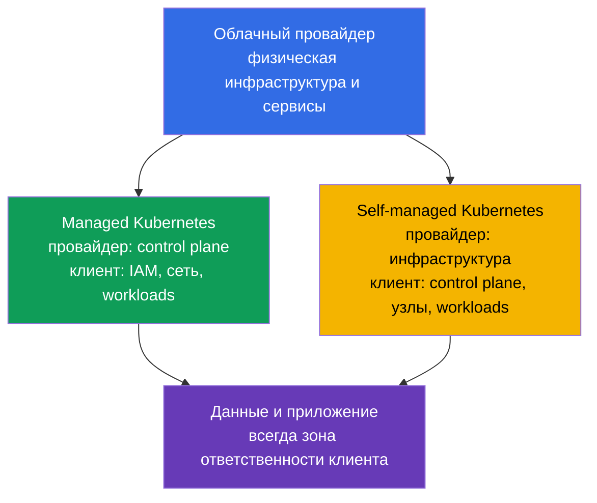
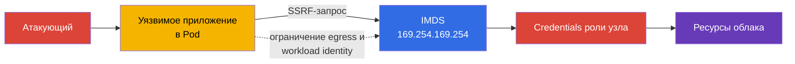

> **Язык:** русский. Переводы будут добавлены после публикации соответствующих файлов.

# Глава 04. Безопасность облачного провайдера и инфраструктуры

> **Что дальше.** Модель 4C помещает Cloud во внешний слой: ошибка в IAM, сети провайдера или настройке рабочего узла способна обойти защиту `Pod` и контейнеров. Эта глава раскрывает компетенцию Cloud Provider and Infrastructure Security из домена **Overview of Cloud Native Security** (14%) и даёт основу для последующих тем о компонентах кластера, сетях и секретах.

## 04.1. Shared responsibility: managed и self-managed Kubernetes

Облако не отменяет ответственности за безопасность, а разделяет её. Граница зависит от модели сервиса и контракта конкретного провайдера. Поэтому перед проверкой нужно ответить на два вопроса: кто управляет компонентом и кто задаёт его безопасную конфигурацию.

В managed Kubernetes, например EKS, GKE или AKS, провайдер обычно эксплуатирует control plane: обеспечивает доступность API server, обновляет базовую инфраструктуру и защищает физические дата-центры. Но владелец кластера по-прежнему отвечает за IAM своей организации, пользователей и роли Kubernetes, настройки сети, образы, рабочие нагрузки, секреты и данные.

В self-managed Kubernetes организация дополнительно отвечает за установку, обновление и hardening control plane, `etcd`, сертификаты, компоненты узла и часто за базовую сеть. Провайдер всё ещё отвечает за физическую инфраструктуру и часть базовых облачных сервисов, но не за безопасную конфигурацию Kubernetes, которую установил клиент.

| Область | Managed Kubernetes | Self-managed Kubernetes |
|---|---|---|
| Физический дата-центр и базовая инфраструктура | преимущественно провайдер | преимущественно провайдер |
| Control plane и его жизненный цикл | провайдер эксплуатирует, клиент задаёт многие политики доступа | организация устанавливает, обновляет и защищает |
| Рабочие узлы | ответственность обычно разделена | организация выбирает ОС, обновления и hardening |
| IAM, Kubernetes RBAC, workloads и данные | организация | организация |
| Сеть приложения, правила доступа и secrets | организация | организация |

Managed сервис уменьшает объём операционной работы, но не делает кластер автоматически безопасным. Например, провайдер может поддерживать API server, однако слишком широкая IAM-роль или публично доступная база данных остаются риском владельца аккаунта.

## 04.2. IAM, облачные креды и least privilege

IAM определяет, какая identity может выполнять действие над ресурсом: читать объект в хранилище, создать виртуальную машину, получить ключ KMS или изменить сетевое правило. Identity бывает человеком, сервисом CI/CD, виртуальной машиной или workload. В Kubernetes cloud IAM часто дополняет RBAC: RBAC разрешает доступ к Kubernetes API, а IAM разрешает доступ к ресурсам облака.

Главное правило - **least privilege**. Роль должна содержать только необходимые действия, ресурсы и область действия. `AdministratorAccess` для приложения, общий ключ доступа в `Secret` или одна роль для всех сервисов делают компрометацию одного `Pod` компрометацией большой части аккаунта.

Предпочтителен короткоживущий credential, выданный конкретной workload identity, а не долгоживущий статический access key в образе, переменной CI или YAML. Реализация зависит от провайдера, но цель одинакова: связать identity `ServiceAccount` с узкой облачной ролью и получать временный token по запросу.

| Практика | Почему безопаснее |
|---|---|
| Отдельная роль для каждого сервиса | компрометация не даёт права соседних сервисов |
| Ресурсы и действия явно ограничены | роль не может менять всё в аккаунте |
| Временные credentials и ротация | утёкший token имеет ограниченный срок жизни |
| MFA для привилегированных людей | одного пароля недостаточно для административного доступа |
| Аудит IAM-действий | можно обнаружить и расследовать необычное использование прав |

Не следует считать Kubernetes `ServiceAccount` заменой облачного IAM. Он идентифицирует workload перед Kubernetes API. Доступ к объектному хранилищу, KMS или базе провайдера требует отдельной, корректно связанной облачной identity.

## 04.3. Рабочие узлы и минимальная хостовая ОС

Рабочий узел запускает `kubelet`, container runtime и `Pod`. Если атакующий получает root на узле, он часто может читать данные контейнеров, перехватывать токены, обращаться к runtime socket или влиять на соседние workloads. Поэтому узел - важная граница доверия, а не просто место для запуска виртуальных машин.

Минимальная хостовая ОС сокращает поверхность атаки: в ней меньше пакетов, демонов, открытых портов и инструментов, которые можно использовать после компрометации. Это не значит, что любой маленький образ ОС безопасен сам по себе. Нужны поддерживаемые обновления, своевременное закрытие уязвимостей, контролируемая конфигурация и наблюдаемость.

Базовые меры для узлов:

- использовать поддерживаемый образ ОС и управляемый процесс обновления;
- устанавливать только нужные пакеты и отключать ненужные сервисы;
- ограничивать SSH и административный доступ отдельными identity и сетевыми правилами;
- защищать доступ к `kubelet` и container runtime socket;
- не размещать на одном узле workloads с несовместимым уровнем доверия без осознанной изоляции;
- собирать логи и события, чтобы заметить отступление от базовой конфигурации.

Обновление узла нельзя рассматривать только как задачу доступности. Устаревший kernel или runtime может содержать путь выхода из контейнера, поэтому patching - часть защиты слоя Cloud и Cluster.

## 04.4. Metadata service и риск credentials в `Pod`

Многие облачные платформы предоставляют metadata service по link-local адресу `169.254.169.254`. Виртуальная машина запрашивает там метаданные и, в некоторых моделях, временные credentials своей облачной роли. Это удобно для автоматизации, но опасно, если приложение в `Pod` может свободно делать запросы к metadata service.

Уязвимость SSRF иллюстрирует риск. Атакующий не получает shell на узле, но заставляет веб-приложение отправить HTTP-запрос к `169.254.169.254`. Если запрос разрешён, приложение может вернуть credentials роли узла. При слишком широких правах этой роли компрометация одного `Pod` превращается в доступ к ресурсам облачного аккаунта.

Защита состоит из нескольких уровней:

- использовать механизм metadata service, требующий защищённый запрос или token, если его поддерживает провайдер;
- блокировать доступ `Pod` к metadata IP там, где это не требуется, с помощью сетевой конфигурации провайдера, CNI или `NetworkPolicy`;
- не передавать приложениям широкую роль узла;
- выдавать облачные права непосредственно нужной workload через отдельную identity;
- исправлять SSRF и другие ошибки приложения, потому что сетевой контроль не заменяет secure coding.

Не каждая `NetworkPolicy` может контролировать IP хоста или metadata endpoint: это зависит от CNI и конфигурации. Важно знать цель контроля и проверить его в выбранной платформе, а не предполагать одинаковое поведение у всех провайдеров.

## 04.5. Шифрование и сетевой периметр инфраструктуры

**Encryption at rest** защищает данные, когда они хранятся на диске, в объектном хранилище, snapshot или управляемой базе. Обычно используются ключи, которыми управляет провайдер или организация через KMS. Шифрование не решает проблему избыточных прав: identity с разрешением на чтение и расшифровку всё ещё сможет получить данные.

**Encryption in transit** защищает данные при передаче по сети. Для API, баз данных и внешних сервисов это обычно TLS. Он помогает против перехвата и изменения трафика на пути, но только если клиент проверяет сертификат и доверяет правильному CA.

Security groups, firewall rules и ACL формируют сетевой периметр облака. Они определяют, откуда можно подключаться к рабочему узлу, load balancer или базе. Правило `0.0.0.0/0` к административному порту редко оправдано. Более безопасный вариант - разрешить только нужный протокол, порт и источник, например ingress от load balancer к приложению или доступ администраторов из защищённой сети.

| Контроль | Какую угрозу уменьшает | Чего не заменяет |
|---|---|---|
| Encryption at rest | чтение потерянного диска, snapshot или хранилища без ключа | IAM и контроль доступа к данным |
| TLS in transit | перехват и подмена сетевого трафика | проверку identity клиента и сервера |
| Security groups | нежелательное подключение на уровне облачной сети | сегментацию `Pod` через `NetworkPolicy` |
| `NetworkPolicy` | нежелательный трафик между workloads | правила доступа к VM и облачным сервисам |

Защита эффективнее, когда эти механизмы дополняют друг друга: security group не открывает узел в интернет, `NetworkPolicy` ограничивает трафик `Pod`, TLS защищает разрешённое соединение, а IAM ограничивает последствия похищенного credential.

## 04.6. Как это применяют на практике

- **Документируют границы ответственности.** Для каждого кластера команда фиксирует managed или self-managed модель, владельца control plane, узлов, сети, обновлений и резервных копий. Это делает инцидент не поиском ответственного, а понятным набором действий.
- **Делят облачные роли по workload.** CI/CD, monitoring и каждое приложение получают отдельные минимальные разрешения вместо общей административной роли узла.
- **Строят образы узлов как baseline.** Поддерживаемая минимальная ОС, патчи, отключённые лишние службы и ограниченный доступ проверяются автоматически при создании узлов.
- **Защищают metadata endpoint.** В production проверяют, какие `Pod` действительно нуждаются в нём, ограничивают egress и используют workload identity вместо credentials роли узла.
- **Защищают данные на всём пути.** Шифрование для дисков, backup и хранилищ сочетают с TLS, приватными subnet и узкими security groups. Отдельно проверяют, кто может использовать ключи KMS.

## 04.7. Exam vocabulary / Мини-глоссарий

- **shared responsibility model** - разделение обязанностей по защите между провайдером и клиентом.
- **managed Kubernetes** - Kubernetes-сервис, в котором провайдер эксплуатирует как минимум control plane.
- **self-managed Kubernetes** - Kubernetes, который организация устанавливает и обслуживает самостоятельно.
- **IAM** - система identity и разрешений для ресурсов облака.
- **credential** - данные, подтверждающие identity: token, ключ, сертификат или временная сессия.
- **least privilege** - предоставление только минимально необходимых прав.
- **IMDS** - instance metadata service, endpoint метаданных и иногда credentials виртуальной машины.
- **SSRF** - уязвимость, заставляющая сервер выполнить запрос по адресу, выбранному атакующим.
- **encryption at rest** - шифрование данных в хранилище.
- **encryption in transit** - шифрование данных при передаче по сети.
- **security group** - облачный набор правил сетевого доступа к ресурсу.

## 04.8. Exam Essentials / Итоги главы

- Managed Kubernetes уменьшает объём эксплуатации control plane, но IAM, workloads, данные, сеть и многие настройки остаются ответственностью организации.
- В self-managed Kubernetes владелец дополнительно отвечает за обновление и hardening control plane и узлов.
- IAM и Kubernetes RBAC решают разные задачи. Облачные права следует выдавать отдельным identity по принципу least privilege и по возможности временно.
- Компрометация рабочего узла опасна для многих `Pod`, поэтому минимальная поддерживаемая ОС, patching и ограничение административного доступа являются базовыми controls.
- Доступ `Pod` к `169.254.169.254` может позволить украсть credentials роли узла через SSRF. Ограничение доступа и workload identity уменьшают риск.
- Encryption at rest, TLS, security groups и `NetworkPolicy` работают на разных границах и должны использоваться вместе.

## 04.9. Не путать и как это встречается на экзамене

Вопросы KCSA по инфраструктуре обычно проверяют разделение ответственности и назначение controls, а не конкретную команду одного провайдера. Важно различать роль узла и роль workload, шифрование данных на диске и в сети, а также security groups и `NetworkPolicy`.

Типичная ловушка - утверждение, что managed Kubernetes полностью переносит безопасность на провайдера. Верное рассуждение: провайдер отвечает за свою часть сервиса, но клиент всё равно управляет доступом, данными и конфигурацией workloads. Другая ловушка - считать шифрование заменой IAM: шифрование защищает определённый путь доступа к данным, а разрешения определяют, кто может этим путём воспользоваться.

## 04.10. Вопросы для самопроверки

### 1. Какая обязанность обычно остаётся у клиента managed Kubernetes?

   - a. Физическая охрана дата-центра провайдера.
   - b. Ремонт серверов control plane провайдера.
   - c. Замена сетевого оборудования провайдера.
   - d. Конфигурация IAM, workloads и доступа к данным.

Ответ и разбор

**Верный ответ: d.** Managed сервис не снимает с клиента ответственность за identities, приложения, данные и их конфигурацию.

### 2. Какой подход лучше всего соответствует least privilege для приложения, которому нужен доступ к одному bucket?

   - a. Дать каждому `Pod` права администратора, чтобы избежать ошибок доступа.
   - b. Поместить ключ администратора аккаунта в образ контейнера.
   - c. Выдать приложению отдельную роль с действиями только для нужного bucket.
   - d. Использовать общую роль рабочего узла с полным доступом к хранилищу.

Ответ и разбор

**Верный ответ: c.** Узкая отдельная роль снижает последствия компрометации приложения и делает права проверяемыми.

### 3. Почему доступ из `Pod` к `169.254.169.254` может быть опасен?

   - a. Этот адрес автоматически удаляет `Pod`.
   - b. Адрес используется только Kubernetes API server и всегда недоступен из сети.
   - c. Он отключает TLS для внешних сервисов.
   - d. Через SSRF приложение может получить credentials роли узла.

Ответ и разбор

**Верный ответ: d.** Metadata service может выдавать временные credentials виртуальной машины, если политика провайдера и доступ к endpoint это позволяют.

### 4. Какое утверждение верно различает encryption at rest и encryption in transit?

   - a. Первое защищает данные в хранилище, второе - данные при передаче по сети.
   - b. Первое применяется только к `Pod`, второе - только к control plane.
   - c. Это два названия одного и того же контроля.
   - d. Первое заменяет IAM, второе заменяет RBAC.

Ответ и разбор

**Верный ответ: a.** Эти виды шифрования закрывают разные состояния данных и дополняют, а не заменяют, контроль доступа.

### 5. Какой контроль прежде всего ограничивает подключение из интернета к порту рабочей виртуальной машины в облаке?

   - a. Ограничивающая ingress security group или firewall rule на уровне облачной сети.
   - b. Kubernetes `NetworkPolicy`, применённая только к Pod внутри overlay-сети кластера.
   - c. RBAC `Role`, разрешающая приложению читать только собственный `ConfigMap`.
   - d. Encryption at rest для Kubernetes API objects, сохранённых в `etcd`.

Ответ и разбор

**Верный ответ: a.** Доступ из интернета к сетевому интерфейсу облачной VM прежде всего контролируется cloud/network firewall механизмами. `NetworkPolicy` управляет поддерживаемым CNI трафиком workloads, RBAC регулирует Kubernetes API authorization, а encryption at rest защищает сохранённые данные.

> **Куда дальше.** Практические приёмы ограничения доступа к metadata service разобраны в главе 05 CKS. Hardening рабочего узла и container runtime продолжается в главе 14 CKS, а защита ОС и хоста - в главе 15 CKS.

---
[Оглавление](../README_RU.md) · [Глава 03](../03/ru.md) · [Глава 05](../05/ru.md)
