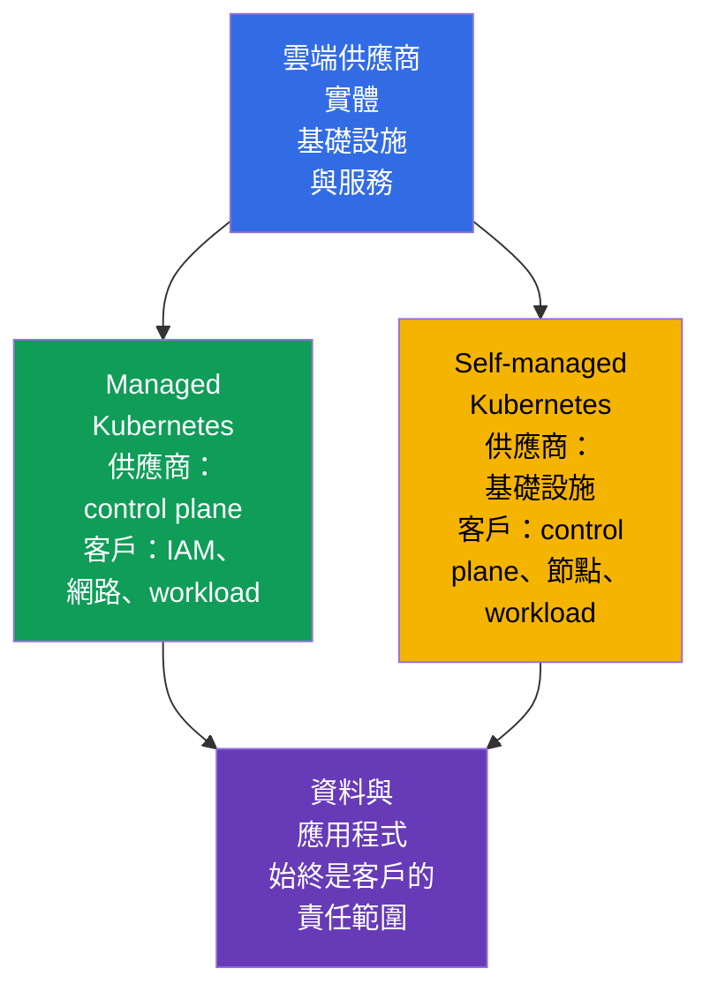
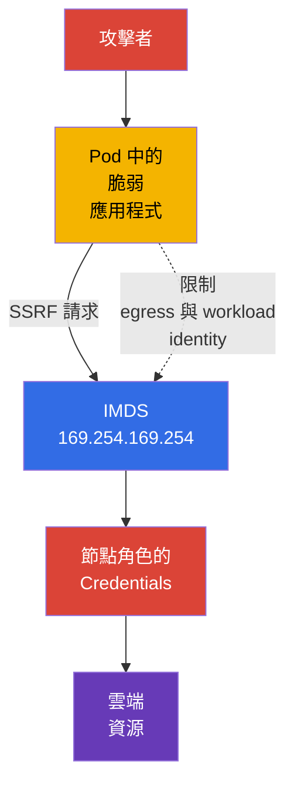

[Русская версия](ru.md) · [Eng version](README.md) · [Versión en español](es.md) · [Version française](fr.md) · [Deutsche Version](de.md) · [ქართული ვერსია](ge.md) · [日本語版](jp.md)

# 第 04 章. 雲端供應商與基礎設施安全

> **下一步。** 4C 模型將 Cloud 放在最外層：IAM、供應商網路或工作節點設定中的錯誤，可能繞過 `Pod` 與容器的防護。本章涵蓋 **Overview of Cloud Native Security** (14%) 領域中的 Cloud Provider and Infrastructure Security 能力，並為後續的叢集元件、網路與 Secret 主題奠定基礎。

## 04.1. Shared responsibility：managed 與 self-managed Kubernetes

雲端並未免除安全責任，而是將其劃分。邊界取決於服務模型及特定供應商的合約。因此，在檢查之前，應回答兩個問題：誰負責管理該元件，以及誰負責設定其安全組態。

在 managed Kubernetes 中，例如 EKS、GKE 或 AKS，供應商通常負責運作 control plane：確保 API server 的可用性、更新基礎設施，並保護實體資料中心。但叢集擁有者仍須對組織的 IAM、Kubernetes 使用者與角色、網路設定、映像檔、workload、Secret 與資料負責。

在 self-managed Kubernetes 中，組織還須負責安裝、更新與 hardening control plane、`etcd`、憑證、節點元件，並且通常也要負責基礎網路。供應商仍對實體基礎設施及部分基本雲端服務負責，但不對客戶所安裝 Kubernetes 的安全組態負責。

| 範圍 | Managed Kubernetes | Self-managed Kubernetes |
|---|---|---|
| 實體資料中心與基礎設施 | 主要由供應商負責 | 主要由供應商負責 |
| Control plane 及其生命週期 | 供應商負責運作，客戶設定許多存取政策 | 組織負責安裝、更新及保護 |
| 工作節點 | 通常為共同責任 | 組織選擇 OS、更新及 hardening |
| IAM、Kubernetes RBAC、workload 與資料 | 組織 | 組織 |
| 應用程式網路、存取規則與 Secret | 組織 | 組織 |

Managed 服務能減少營運工作量，但不會讓叢集自動變得安全。例如，供應商可以維護 API server，但權限過廣的 IAM 角色或可公開存取的資料庫，仍是帳戶擁有者的風險。

## 04.2. IAM、雲端 credential 與 least privilege

IAM 決定某個 identity 可以對資源執行哪些動作：讀取儲存體中的物件、建立虛擬機器、取得 KMS 金鑰或修改網路規則。Identity 可以是人員、CI/CD 服務、虛擬機器或 workload。在 Kubernetes 中，雲端 IAM 通常會補充 RBAC：RBAC 允許存取 Kubernetes API，而 IAM 允許存取雲端資源。

主要原則是 **least privilege**。角色應僅包含必要的動作、資源與範圍。為應用程式授予 `AdministratorAccess`、在 `Secret` 中放置共用 access key，或為所有服務使用單一角色，都會讓單一 `Pod` 遭入侵演變為帳戶大部分區域遭入侵。

較好的做法是由特定 workload identity 發放短期 credential，而不是把長期靜態 access key 放在映像檔、CI 變數或 YAML 中。實作方式依供應商而異，但目標相同：將 `ServiceAccount` identity 與範圍狹窄的雲端角色連結，並按需取得暫時 token。

| 實務作法 | 為何較安全 |
|---|---|
| 每個服務使用獨立角色 | 遭入侵不會取得相鄰服務的權限 |
| 明確限制資源與動作 | 角色無法修改帳戶中的所有項目 |
| 暫時 credential 與輪替 | 外洩的 token 有有限的有效期 |
| 為具特權人員啟用 MFA | 單一密碼不足以取得管理存取權 |
| 稽核 IAM 動作 | 可偵測及調查異常的權限使用 |

不應將 Kubernetes `ServiceAccount` 視為雲端 IAM 的替代品。它用於向 Kubernetes API 識別 workload。存取物件儲存體、KMS 或供應商資料庫，需要另一個正確連結的雲端 identity。

## 04.3. 工作節點與最小化主機 OS

工作節點會執行 `kubelet`、container runtime 及 `Pod`。若攻擊者取得節點上的 root 權限，通常可以讀取容器資料、攔截 token、存取 runtime socket，或影響相鄰 workload。因此，節點是重要的信任邊界，而不僅是執行虛擬機器的場所。

最小化主機 OS 可減少攻擊面：它包含較少套件、daemon、開放連接埠與可在遭入侵後被利用的工具。這並不表示任何小型 OS 映像檔本身就安全。仍需要受支援的更新、及時修補漏洞、受控組態與可觀測性。

節點的基本措施：

- 使用受支援的 OS 映像檔與受管理的更新流程；
- 僅安裝必要套件並停用不需要的服務；
- 以獨立 identity 與網路規則限制 SSH 與管理存取；
- 保護對 `kubelet` 與 container runtime socket 的存取；
- 除非進行有意識的隔離，否則不要在同一節點放置具有不相容信任層級的 workload；
- 收集日誌與事件，以察覺偏離基準組態的情況。

節點更新不能只視為可用性工作。過時的 kernel 或 runtime 可能包含逃離容器的途徑，因此 patching 是保護 Cloud 與 Cluster 層的一部分。

## 04.4. Metadata service 與 `Pod` 中 credential 的風險

許多雲端平台會透過 link-local 位址 `169.254.169.254` 提供 metadata service。虛擬機器會在其中要求 metadata，並且在某些模型中取得其雲端角色的暫時 credential。這對自動化很方便，但若 `Pod` 中的應用程式可以自由向 metadata service 發出請求，就會有風險。

SSRF (Server-Side Request Forgery，伺服器端請求偽造) 漏洞說明了這項風險。攻擊者不必取得節點 shell，而是使 Web 應用程式向 `169.254.169.254` 傳送 HTTP 請求。若請求獲得允許，應用程式可能回傳節點角色的 credential。若該角色的權限過廣，單一 `Pod` 遭入侵就會變成存取雲端帳戶資源。

防護由多個層次組成：

- 若供應商支援，使用需要安全請求或 token 的 metadata service 機制；
- 在不需要的地方，透過供應商網路組態、CNI 或 `NetworkPolicy` 阻擋 `Pod` 存取 metadata IP；
- 不要為應用程式授予權限過廣的節點角色；
- 透過獨立 identity 直接向需要的 workload 授予雲端權限；
- 修正 SSRF 與其他應用程式錯誤，因為網路控制無法取代 secure coding。

並非每個 `NetworkPolicy` 都能控制主機 IP 或 metadata endpoint：這取決於 CNI 與組態。重要的是了解控制的目的，並在選定平台中驗證，而不是假設所有供應商都有相同行為。

## 04.5. 基礎設施的加密與網路邊界

**Encryption at rest** 在資料儲存於磁碟、物件儲存體、snapshot 或受管理資料庫時保護資料。通常使用由供應商管理的金鑰，或由組織透過 KMS 管理的金鑰。加密無法解決權限過大的問題：具有讀取與解密權限的 identity 仍可取得資料。

**Encryption in transit** 在資料透過網路傳輸時保護資料。對 API、資料庫與外部服務而言，通常是 TLS。它有助於防範路徑上的流量攔截與竄改，但前提是用戶端會驗證憑證並信任正確的 CA。

Security groups、firewall rules 與 ACL 構成雲端的網路邊界。它們決定誰可以連線至工作節點、load balancer 或資料庫。針對管理連接埠設定 `0.0.0.0/0` 很少有合理理由。更安全的作法是只允許必要的 protocol、port 與來源，例如從 load balancer 對應用程式的 ingress，或從受保護網路提供管理員存取。

| 控制項 | 可降低的威脅 | 無法取代的項目 |
|---|---|---|
| Encryption at rest | 在沒有金鑰的情況下讀取遺失磁碟、snapshot 或儲存體 | IAM 與資料存取控制 |
| TLS in transit | 攔截與竄改網路流量 | 驗證用戶端與伺服器 identity |
| Security groups | 雲端網路層級上不必要的連線 | 透過 `NetworkPolicy` 進行的 `Pod` 分段 |
| `NetworkPolicy` | workload 之間不必要的流量 | VM 與雲端服務的存取規則 |

當這些機制互相補足時，防護更有效：security group 不會將節點開放至網際網路，`NetworkPolicy` 限制 `Pod` 流量，TLS 保護獲允許的連線，而 IAM 限制遭竊 credential 的影響。

## 04.6. 實務上的應用方式

- **記錄責任邊界。** 對每個叢集，團隊記錄其為 managed 或 self-managed 模型，以及 control plane、節點、網路、更新與備份的擁有者。如此一來，事件不再是尋找負責人，而是一組明確的行動。
- **依 workload 劃分雲端角色。** CI/CD、monitoring 與每個應用程式取得個別的最小權限，而非共用管理節點角色。
- **將節點映像檔建置為 baseline。** 在建立節點時自動檢查受支援的最小 OS、patch、已停用的多餘服務與受限存取。
- **保護 metadata endpoint。** 在 production 中，檢查哪些 `Pod` 確實需要它，限制 egress，並使用 workload identity，而非節點角色 credential。
- **保護完整資料路徑。** 結合磁碟、backup 與儲存體加密，TLS、私有 subnet 及嚴格的 security groups。另行檢查誰可以使用 KMS 金鑰。

## 04.7. Exam vocabulary / 迷你詞彙表

- **shared responsibility model** - 供應商與客戶之間劃分安全防護責任。
- **managed Kubernetes** - 至少由供應商負責運作 control plane 的 Kubernetes 服務。
- **self-managed Kubernetes** - 由組織自行安裝及維護的 Kubernetes。
- **IAM** - 用於雲端資源的 identity 與權限系統。
- **credential** - 證明 identity 的資料：token、金鑰、憑證或暫時 session。
- **least privilege** - 僅授予最低必要權限。
- **IMDS** - instance metadata service，虛擬機器的 metadata endpoint，有時也提供 credential。
- **SSRF** - 使伺服器對攻擊者選擇的位址執行請求的漏洞。
- **encryption at rest** - 對儲存中資料的加密。
- **encryption in transit** - 對透過網路傳輸資料的加密。
- **security group** - 用於資源網路存取的雲端規則集合。

## 04.8. Exam Essentials / 本章重點

- Managed Kubernetes 減少 control plane 的營運工作，但 IAM、workload、資料、網路與許多組態仍是組織的責任。
- 在 self-managed Kubernetes 中，擁有者還須負責更新與 hardening control plane 和節點。
- IAM 與 Kubernetes RBAC 解決不同的問題。雲端權限應依 least privilege 原則授予個別 identity，並盡可能使用暫時權限。
- 工作節點遭入侵會危及許多 `Pod`，因此最小化且受支援的 OS、patching 與限制管理存取都是基本 controls。
- `Pod` 存取 `169.254.169.254` 可能讓攻擊者透過 SSRF 竊取節點角色的 credential。限制存取與 workload identity 可降低風險。
- Encryption at rest、TLS、security groups 與 `NetworkPolicy` 在不同邊界運作，應一併使用。

## 04.9. 不要混淆及其在考試中的出現方式

基礎設施的 KCSA 問題通常會測試責任劃分與 controls 的用途，而非單一供應商的特定命令。重要的是區分節點角色與 workload 角色、磁碟上與網路中資料的加密，以及 security groups 與 `NetworkPolicy`。

典型陷阱是宣稱 managed Kubernetes 會將安全性完全移交給供應商。正確的推論是：供應商對服務中的自身部分負責，但客戶仍管理存取、資料與 workload 組態。另一個陷阱是將加密視為 IAM 的替代品：加密保護資料的特定存取路徑，而權限決定誰可以使用該路徑。

## 04.10. 自我檢查問題

### 1. Managed Kubernetes 中通常仍由客戶負責的義務是什麼？

   - a. 供應商資料中心的實體保全。
   - b. 維修供應商 control plane 的伺服器。
   - c. 更換供應商的網路設備。
   - d. 設定 IAM、workload 與資料存取。

答案與說明

**正確答案：d。** Managed 服務不會免除客戶對 identity、應用程式、資料及其組態的責任。

### 2. 對於需要存取一個 bucket 的應用程式，哪種方法最符合 least privilege？

   - a. 為每個 `Pod` 授予管理員權限，以避免存取錯誤。
   - b. 將帳戶管理員金鑰放入容器映像檔。
   - c. 為應用程式授予獨立角色，該角色只具備所需 bucket 的動作權限。
   - d. 使用具有完整儲存體存取權的共用工作節點角色。

答案與說明

**正確答案：c。** 範圍狹窄的獨立角色可降低應用程式遭入侵的影響，並使權限可被檢查。

### 3. 為什麼從 `Pod` 存取 `169.254.169.254` 可能有危險？

   - a. 此位址會自動刪除 `Pod`。
   - b. 該位址只供 Kubernetes API server 使用，且永遠無法從網路存取。
   - c. 它會停用外部服務的 TLS。
   - d. 應用程式可以透過 SSRF 取得節點角色的 credential。

答案與說明

**正確答案：d。** 若供應商政策與 endpoint 存取允許，metadata service 可以發放虛擬機器的暫時 credential。

### 4. 哪項敘述正確區分 encryption at rest 與 encryption in transit？

   - a. 前者保護儲存中的資料，後者保護透過網路傳輸的資料。
   - b. 前者僅適用於 `Pod`，後者僅適用於 control plane。
   - c. 它們是相同控制項的兩種名稱。
   - d. 前者取代 IAM，後者取代 RBAC。

答案與說明

**正確答案：a。** 這些加密類型涵蓋資料的不同狀態，彼此互補而非取代存取控制。

### 5. 哪項控制主要限制從網際網路連線至雲端工作虛擬機器的連接埠？

   - a. 雲端網路層級的限制性 ingress security group 或 firewall rule。
   - b. 僅套用於叢集 overlay 網路中 Pod 的 Kubernetes `NetworkPolicy`。
   - c. 允許應用程式僅讀取自身 `ConfigMap` 的 RBAC `Role`。
   - d. Kubernetes API objects 儲存在 `etcd` 時的 encryption at rest。

答案與說明

**正確答案：a。** 從網際網路存取雲端 VM 的網路介面，主要由 cloud/network firewall 機制控制。`NetworkPolicy` 管理受支援 CNI 中 workload 的流量，RBAC 規範 Kubernetes API authorization，而 encryption at rest 保護已儲存的資料。

> **接下來。** 限制對 metadata service 存取的實務方法將在 CKS 第 05 章說明。工作節點與 container runtime 的 hardening 在 CKS 第 14 章繼續，而 OS 與主機防護則在 CKS 第 15 章進一步討論。

---
[目錄](../README_TW.md) · [第 03 章](../03/tw.md) · [第 05 章](../05/tw.md)