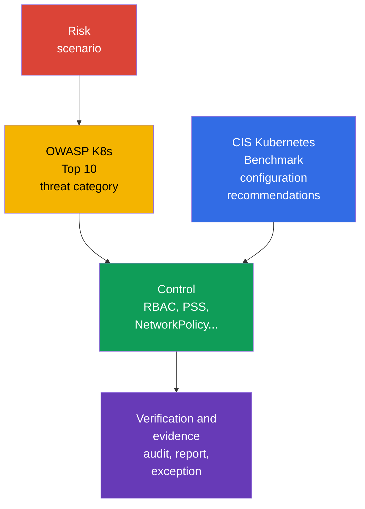

[Русская версия](ru.md) · [Versión en español](es.md) · [Version française](fr.md) · [Deutsche Version](de.md) · [ქართული ვერსია](ge.md) · [繁體中文版](tw.md) · [日本語版](jp.md)

# Chapter 05. Controls, frameworks, and isolation techniques

> **What's next.** In [Chapter 04](../04/README.md), protection was considered at the cloud and infrastructure level. Now we will bring defense in depth principles inside the cluster: examine security assessment guidance, automation tools, and isolation layers. This is part of the **Overview of Cloud Native Security** domain, weighted at 14%.

## 05.1 Controls and frameworks: CIS Kubernetes Benchmark and OWASP Kubernetes Top 10

A **security control** is a specific measure that reduces the likelihood or impact of an attack. For example, disabling anonymous access to the API, a restricted `Role`, a default-deny `NetworkPolicy`, or a Pod Security Standards profile. A **framework** is a structure used to assess risks and the completeness of these measures. A framework does not protect a cluster by itself: it helps ensure that important controls are not overlooked.

[CIS Kubernetes Benchmark](https://www.cisecurity.org/benchmark/kubernetes) is a set of recommendations for securely configuring Kubernetes. It groups checks by control plane components, worker nodes, policies, and other objects. A typical CIS recommendation answers the question: "which setting reduces a known attack surface?" For example, disable anonymous access, protect credential files, or enable an appropriate audit mechanism.

It is important not to treat a CIS result as a binary "the cluster is secure" certificate. Some recommendations depend on the installation method, managed Kubernetes, and the adopted risk model. They are assessed in context: document the exception, the risk owner, and the compensating control instead of disabling a check without explanation.

[OWASP](https://owasp.org/) (Open Worldwide Application Security Project) [Kubernetes Top 10](https://owasp.org/www-project-kubernetes-top-ten/) is a catalog of common Kubernetes risk classes, not a set of exact configuration parameters. It helps discuss threats in clear categories: insecure configuration, excessive privileges, weak network segmentation, insecure images, and insufficient observability. It is convenient to use during design and review: for each category, ask where it is possible in this cluster and which control reduces it.

| Guidance | Main question | Result of use | Does not replace |
|---|---|---|---|
| CIS Kubernetes Benchmark | Are components and nodes securely configured? | A list of technical recommendations and deviations | Threat modeling and operational processes |
| OWASP Kubernetes Top 10 | Which risk classes must not be missed? | A common language for threat analysis and prioritization | Detailed settings and configuration verification |
| Internal security baseline | What does the organization consider minimally acceptable? | Mandatory controls, exceptions, owners | External industry or regulatory requirements |

CIS and OWASP complement each other: CIS usually suggests *what to check in the configuration*, while OWASP helps explain *why this class of protections is needed*. Industry requirements, compliance evidence, and exception management are covered in more detail in [Chapter 19](../19/README.md).



## 05.2 Automating checks: `kube-bench`, policy engines, and scanners

Manual verification is useful for understanding a system, but it does not scale well and easily becomes outdated. Automation makes the baseline repeatable: it runs when a cluster is created, in CI/CD, and regularly in the running environment. At the same time, a tool produces a signal, while the decision about risk and remediation remains with the team.

`kube-bench` compares Kubernetes component parameters and state against CIS Benchmark checks. Its result usually includes pass, fail, and manual checks. It is especially useful for a self-managed cluster, where the team manages the control plane and nodes. In managed Kubernetes, some checks are unavailable to the user or fall under the provider's responsibility, so the report must be interpreted with the shared responsibility model in mind.

A **policy engine** checks declarative Kubernetes objects against organizational rules. OPA/Gatekeeper, Kyverno, and built-in admission mechanisms can, for example, reject a `Pod` with `privileged: true`, disallow an unapproved registry, or require labels. They operate before an object is created or changed through the admission path. A policy engine does not replace host protection: it cannot see every process action on a worker node and cannot remediate an already compromised node.

**Scanners** search for known vulnerabilities, insecure configuration, and secrets. An image scanner maps packages to a CVE database; a manifest scanner identifies risky fields; a repository scanner can find an accidentally saved token. Examples of tool classes include Trivy or Grype for images, and `kube-linter` and `kubesec` for manifests. A CVE list does not automatically mean an exploitable vulnerability: reachability, availability of a fix, workload criticality, and compensating measures matter.

| Tool | What it usually checks | When it runs | Typical limitation |
|---|---|---|---|
| `kube-bench` | Component and node configuration against CIS | Periodically or after a cluster change | Does not assess application business logic |
| Policy engine | API object fields against rules | At admission, sometimes in audit mode | Does not protect against direct node compromise |
| Image scanner | Packages and CVEs in an image | Before publication and regularly afterward | Does not know whether the vulnerable code path is used |
| Manifest/secret scanner | Insecure fields and secrets in a repository | In pre-commit or CI | Does not see the entire cluster state |

A reliable process combines these layers: CI prevents basic errors, admission prevents an unsuitable object from entering the cluster, and periodic scanning finds new CVEs in already published images. Results are sent to the owner, classified by risk, and not ignored indefinitely: a justified exception must have a review date and a compensating control.

## 05.3 Isolation techniques: from `Namespace` to sandbox runtime

Isolation reduces the ability of one user, team, or compromised workload to affect another. In Kubernetes, it is layered. Each layer addresses its own type of interaction, so a single `Namespace` or a single policy engine does not create a complete security boundary.

### Logical boundary: `Namespace` and RBAC

A `Namespace` separates the names of most objects and provides a convenient scope for quotas, labels, RBAC, and policies. It is suitable for organizing teams and environments, but does not prohibit access by itself. A user with an appropriate `ClusterRole` can access objects outside their `Namespace`, and network traffic between `Pod` instances is usually allowed by default.

RBAC answers a different question: **who can perform which action on which API resource**. The least privilege principle means that a `Role` or `ClusterRole` grants only the necessary verbs and scope. A `Namespace` + `RoleBinding` combination is often sufficient for a regular internal team, but it does not protect data without network and workload isolation.

### Network and workload boundary: `NetworkPolicy` and PSS

`NetworkPolicy` defines permitted ingress and egress for selected `Pod` instances. A practical baseline approach is default-deny, followed by explicitly opening the required directions. The policy takes effect only if the CNI implements it. It restricts network interaction, but does not prohibit API access or limit the privileges of the container process.

Pod Security Standards (PSS) define three profiles: `privileged`, `baseline`, and `restricted`. Pod Security Admission applies a profile to a `Namespace` in `enforce`, `audit`, or `warn` modes. In particular, `restricted` aims to reduce the risk of privileged execution, dangerous capabilities, and access to host namespaces. PSS provides a predictable minimum for a `Pod`, but does not solve every organization-specific rule.

```yaml
apiVersion: v1
kind: Namespace
metadata:
  name: team-a
  labels:
    pod-security.kubernetes.io/enforce: restricted
    pod-security.kubernetes.io/enforce-version: v1.36
```

This snippet shows how labels are assigned, not a replacement for checking compatibility of specific workloads. PSS and Pod Security Admission are covered in detail in [Chapter 11](../11/README.md), and NetworkPolicy and segmentation in [Chapter 13](../13/README.md).

### Execution boundary: gVisor and Kata Containers

A regular container isolates processes through namespaces and cgroups, but shares the host kernel. If an attacker gains code execution in a container, a kernel vulnerability or configuration mistake can expand the impact.

**gVisor** adds a sandbox layer: application system calls are handled by the `runsc` user-space kernel rather than directly by the regular host kernel interface. This reduces the kernel attack surface for an untrusted workload at the cost of compatibility and performance limitations.

**Kata Containers** runs a container workload inside a lightweight virtual machine. The VM boundary is usually stronger because it uses hardware virtualization and a separate kernel environment. The cost is greater resource consumption, longer startup time, and more operational complexity.

A sandbox runtime is not useful for every `Pod`. It is especially appropriate for customer code, CI jobs, public build systems, and other workloads with elevated distrust. It does not eliminate the need for RBAC, PSS, NetworkPolicy, and image updates: it is an additional layer, not a replacement for the other controls.

### Soft and hard multi-tenancy

**Soft multi-tenancy** is intended for teams within one organization that have a comparable level of trust. They usually share the control plane and worker nodes, while boundaries are built with `Namespace`, RBAC, ResourceQuota, PSS, and NetworkPolicy. Risk remains shared: an administrator error, a control plane vulnerability, or worker node compromise can affect multiple tenants.

**Hard multi-tenancy** is needed when tenants do not trust one another, data requirements are stricter, or a stronger separation of responsibility is required. Dedicated nodes, sandbox runtime, separate cloud accounts or VPCs, and often separate clusters are added to the listed controls. The strongest practical boundary is often outside a single Kubernetes cluster.

| Layer | What it isolates | Example control | What it is insufficient to expect |
|---|---|---|---|
| Organizational | Object names and ownership | `Namespace`, quotas | Independent API and network protection |
| API | User or ServiceAccount operations | RBAC | Restrictions on inter-Pod traffic |
| Network | Permitted traffic flows | `NetworkPolicy` | Protection from a privileged process |
| Workload | Dangerous `Pod` parameters | PSS, admission policy | Kernel isolation like a VM |
| Runtime/infrastructure | Execution of untrusted code | gVisor, Kata, dedicated node | Elimination of all other layers |

## 05.4 Linux process and resource isolation: different boundaries, different questions

A container is first of all a Linux process to which the runtime has assigned several independent constraints. They provide defense in depth, but one mechanism must not be presented as another.

| Mechanism | Question it answers | What it does **not** do |
|---|---|---|
| namespaces | What a process sees: PID, network, mounts, and other namespaces | They are not an access policy and do not limit CPU/RAM. |
| cgroups | How much CPU, memory, and other resources a process can use | They do not create a sandbox or filter syscalls. |
| Linux capabilities | Which individual root-like actions a process is allowed to perform | A capability is not full root and does not replace MAC policy. |
| seccomp | Which system calls a process is allowed to make | It does not regulate Pod-to-Pod traffic. |
| AppArmor / SELinux | Which actions and resources a mandatory access control (MAC) policy permits | They are not a system call filter: that is seccomp's role. |
| gVisor / Kata Containers | OCI-compatible sandboxed runtimes: gVisor `runsc` implements the OCI Runtime Specification and isolates a workload through a user-space application kernel; Kata Containers maintains OCI/CRI compatibility but runs a workload inside a lightweight VM. | They strengthen the execution boundary, but do not replace RBAC, PSS/PSA, or NetworkPolicy. |

`AppArmor` and `SELinux` are Linux Security Modules with mandatory access control: a policy can deny an action even when ordinary Unix permissions would allow it. AppArmor typically applies a profile to a program, while SELinux applies labels and policy to subjects and objects. For KCSA, associate them with restricting process actions rather than writing custom profiles or policies: that is a later CKS-level skill.

### Unified resource model

Resource isolation protects the availability of a shared cluster, but it is not a security sandbox. `requests` participate in scheduler decisions and reservation; `limits.cpu` limit CPU and can lead to throttling; `limits.memory` limit memory and can terminate a process as OOM under pressure. `LimitRange` sets defaults/minimums/maximums for individual containers or `Pod` instances within a namespace, while `ResourceQuota` limits the namespace's aggregate consumption. HPA scales a workload and does not create a security boundary; `NetworkPolicy` regulates the network path, not CPU/RAM.

| Scenario | Best control | Evidence and distractor |
|---|---|---|
| A tenant can create an unlimited number of `Pod` instances or consume resources in aggregate | `ResourceQuota` | Check quota usage; this is not `LimitRange`. |
| One `Pod` requests 64 GiB RAM without an agreed baseline | `LimitRange` and a policy for requests/limits | Check admission rejection/default; this is not HPA. |
| A compromised `Pod` must not access a database | `NetworkPolicy` | Check the policy and a connection attempt; a quota does not filter traffic. |

## 05.5 How to choose an isolation level for a task

The choice does not start with a tool. First, define the trust boundary: who deploys code, what data it sees, what impact is acceptable, and who administers the cluster. Then choose the minimally sufficient combination of controls and verify that it is actually applied.

| Situation | Reasonable starting point | When to strengthen |
|---|---|---|
| Several internal teams, same level of trust | `Namespace`, least-privilege RBAC, PSS, NetworkPolicy | When accessing different data classes or elevated privileges |
| Test jobs or code from an external source | Basic controls plus sandbox runtime | If code can be malicious or handles secrets |
| Customers deploy their own workloads | Hard multi-tenancy: strong networking, dedicated compute, sandbox, or a separate cluster | If regulation or the threat model requires an independent administrative boundary |
| A service with highly sensitive data | Restricted API access, network segmentation, separate secrets, and observability | If a shared control plane or nodes remain an unacceptable risk |

In practice, this is a useful question: "what happens if this `Pod`, its ServiceAccount, or its worker node is compromised?" The answer reveals the missing layer. For example, RBAC restricts ServiceAccount API actions, but does not stop a connection to another database; NetworkPolicy stops that connection, but does not prevent a container from gaining a dangerous capability; a sandbox reduces the impact of an exploit, but does not fix an excessive RBAC permission.

Isolation also has an operational cost. An overly strict policy introduced without `audit` mode or team preparation blocks legitimate releases. An overly permissive policy turns a shared cluster into a single blast radius. Therefore, controls are introduced in stages, exceptions are measured, and they are periodically reviewed together with the threat model.

## 05.6 How it is applied in practice

A platform team usually forms a security baseline from several sources: CIS recommendations, OWASP risk categories, organizational requirements, and the threat model of specific services. The baseline becomes verifiable rules: which PSS profiles are mandatory, which registries are allowed, whether default-deny `NetworkPolicy` is needed, who can create `RoleBinding`, and which workloads require a sandbox runtime.

Before a new workload is admitted, the team performs a short security review: it identifies the owner, trust in the code and image, required API permissions, network dependencies, data sensitivity, and the acceptable shared-use boundary. The pipeline then runs scanners, admission checks manifests, and periodic `kube-bench` and scanner reports create tasks to remediate deviations.

When a violation is found, immediately applying the strictest mode is not always correct. For example, a chosen Pod Security Standards profile can first be applied through Pod Security Admission in `audit` and `warn` modes: assess actual violations, show warnings to users, and fix deployment templates. After an agreed transition, configure `enforce` mode for the required profile. For a third-party policy engine, use its own audit, preview, or equivalent non-blocking mode if it supports one. This turns a technical control into a sustainable process rather than a one-time check.

## 05.7 Exam vocabulary / Mini-glossary

| Term | Brief meaning |
|---|---|
| CIS Kubernetes Benchmark | A set of recommendations for securely configuring Kubernetes. |
| control | A technical or procedural risk-reduction measure. |
| gVisor | A sandbox runtime that intercepts workload system calls. |
| hard multi-tenancy | Tenant isolation with strong, often infrastructure-level boundaries. |
| `kube-bench` | A tool that checks Kubernetes against CIS recommendations. |
| `NetworkPolicy` | An API resource for restricting `Pod` ingress and egress traffic. |
| OWASP Kubernetes Top 10 | A catalog of important Kubernetes risk classes. |
| Pod Security Standards | The `privileged`, `baseline`, and `restricted` security profiles. |
| policy engine | A mechanism that applies rules to API objects, often in the admission path. |
| soft multi-tenancy | Separation of trusted teams in a shared cluster with logical controls. |

## 05.8 Exam Essentials / Chapter summary

- CIS Kubernetes Benchmark provides verifiable recommendations for secure configuration, while OWASP Kubernetes Top 10 helps ensure risk classes are not missed.
- `kube-bench`, policy engines, and scanners automate different control stages and do not replace one another.
- A `Namespace` organizes an object scope, but is not an independent security boundary. Isolation requires RBAC, NetworkPolicy, PSS, and, if necessary, a sandbox runtime.
- gVisor and Kata Containers reduce the risk of running untrusted code, but have costs in compatibility, resources, and operations.
- Soft multi-tenancy is suitable for trusted internal teams; untrusted tenants require hard multi-tenancy, sometimes with a separate cluster.
- The isolation level is chosen based on the trust boundary and the impact of compromise, not on a tool's popularity.

## 05.9 Do not confuse these concepts and how they appear on the exam

A KCSA question usually describes a goal and asks you to choose the most appropriate control. It is useful to distinguish related concepts:

- CIS Benchmark is configuration guidance, not an image vulnerability scanner.
- OWASP Kubernetes Top 10 is a risk catalog, not an admission controller.
- A `Namespace` is a naming scope, not automatic network or RBAC isolation.
- RBAC restricts requests to the Kubernetes API, while `NetworkPolicy` restricts network flows.
- PSS restrict `Pod` parameters, while gVisor and Kata strengthen the execution boundary.
- Soft multi-tenancy assumes some shared risk; hard multi-tenancy is used when the trust boundary is stronger.

In wording such as "best first step," look for the control that addresses the stated layer. For a question about ServiceAccount access to a `Secret`, it is RBAC; for traffic between `Pod` instances, it is `NetworkPolicy`; for untrusted code, it is sandbox runtime as an additional layer.

## 05.10 Self-check questions

### 1. Which statement most accurately describes the purpose of CIS Kubernetes Benchmark?

   - a. It is a runtime that isolates containers through virtual machines.
   - b. It is a Kubernetes API authentication mechanism.
   - c. It is a set of recommendations for securely configuring Kubernetes.
   - d. It is a list of CVEs in container images.

<details>
<summary>Answer and explanation</summary>

**Correct answer: c.** CIS Kubernetes Benchmark structures recommendations for assessing the secure configuration of components and nodes. Runtime isolation belongs to Kata Containers, an image scanner searches CVEs, and authentication is performed in the API Server.

</details>

### 2. Which control primarily restricts network traffic between `Pod` instances?

   - a. `RoleBinding`
   - b. `NetworkPolicy`
   - c. Pod Security Admission
   - d. `Namespace`

<details>
<summary>Answer and explanation</summary>

**Correct answer: b.** `NetworkPolicy` defines permitted ingress and egress flows when supported by the CNI. RBAC restricts API requests, PSS restricts `Pod` parameters, and a `Namespace` does not itself create a network boundary.

</details>

### 3. Teams within one organization use a shared cluster and trust one another, but must see only their own objects and network services. Which approach is most appropriate as a baseline?

   - a. Only Kata Containers for all `Pod` instances.
   - b. Only `Namespace`, without other controls.
   - c. Soft multi-tenancy: `Namespace`, least-privilege RBAC, PSS, and `NetworkPolicy`.
   - d. Only a separate cluster for each team.

<details>
<summary>Answer and explanation</summary>

**Correct answer: c.** A combination of logical and network controls suits trusted internal teams. A single `Namespace` does not restrict API access or traffic; separate clusters and Kata may be needed for a stricter threat model, but are not a required first choice.

</details>

### 4. In which situation do gVisor or Kata Containers provide the greatest additional benefit?

   - a. When code with elevated distrust is run and the execution boundary must be strengthened.
   - b. When a ServiceAccount needs read access to a `ConfigMap`.
   - c. When CVEs must be found in a published image.
   - d. When objects in different `Namespace` instances need to be renamed.

<details>
<summary>Answer and explanation</summary>

**Correct answer: a.** A sandbox runtime reduces the interaction surface between an untrusted workload and the host kernel. Option b is solved by RBAC (ServiceAccount access to a `ConfigMap`), option c by an image scanner (finding CVEs in an image), and option d by `Namespace` (renaming objects between namespaces).

</details>

### 5. Which statement about `kube-bench` is true?

   - a. It automatically fixes all insecure control plane parameters.
   - b. It blocks an unsuitable `Pod` at the admission stage.
   - c. It replaces threat modeling and security review.
   - d. It compares configuration against CIS checks and requires interpretation of the results.

<details>
<summary>Answer and explanation</summary>

**Correct answer: d.** `kube-bench` helps identify deviations from CIS, but results depend on the environment and provider responsibility. A policy engine automatically blocks objects, while threat modeling remains a separate activity.

</details>

> **Where next.** For configuring and interpreting CIS checks, proceed to CKS Chapter 07: CIS Benchmarks and kube-bench. For sandbox runtimes and deeper isolation, proceed to CKS Chapter 22: RuntimeClass and sandbox. Within KCSA, continue with [Chapter 11 on PSS and Pod Security Admission](../11/README.md) and [Chapter 13 on NetworkPolicy and segmentation](../13/README.md).

[Table of contents](../README.md) · [Chapter 04](../04/README.md) · [Chapter 06](../06/README.md)
