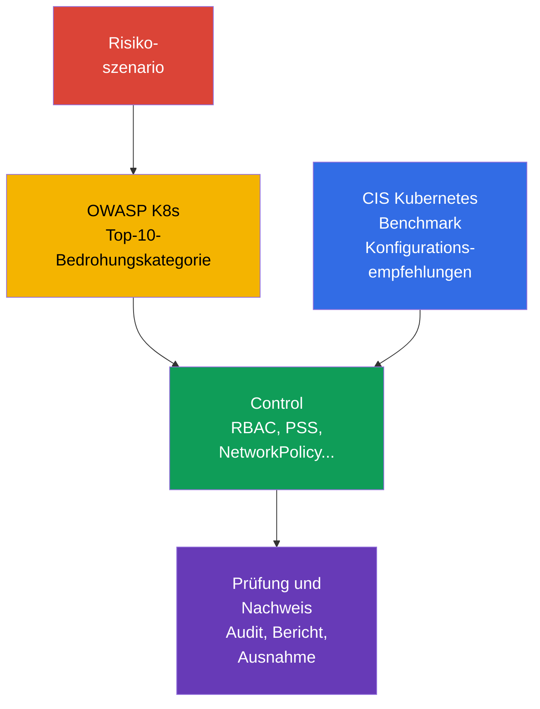

[Русская версия](ru.md) · [Eng version](README.md) · [Versión en español](es.md) · [Version française](fr.md) · [ქართული ვერსია](ge.md) · [繁體中文版](tw.md) · [日本語版](jp.md)

# Kapitel 05. Kontrollen, Frameworks und Isolationstechniken

> **Wie geht es weiter.** In [Kapitel 04](../04/de.md) wurde Sicherheit auf Cloud- und Infrastrukturebene betrachtet. Nun übertragen wir die Prinzipien von Defense in Depth in das Cluster: Wir behandeln Orientierungshilfen für Sicherheitsprüfungen, Automatisierungstools und Isolationsschichten. Dies ist Teil der Domäne **Overview of Cloud Native Security** mit einer Gewichtung von 14 %.

## 05.1 Controls und Frameworks: CIS Kubernetes Benchmark und OWASP Kubernetes Top 10

Ein **Security Control** ist eine konkrete Maßnahme, die die Wahrscheinlichkeit eines Angriffs oder dessen Folgen verringert. Beispiele sind das Verbot von Anonymous Access auf die API, eine eingeschränkte `Role`, eine `NetworkPolicy` mit Default-Deny oder ein Profil der Pod Security Standards. Ein **Framework** ist eine Struktur zur Bewertung der Risiken und der Vollständigkeit dieser Maßnahmen. Ein Framework schützt ein Cluster nicht selbst: Es hilft dabei, keine wichtigen Controls zu übersehen.

Der [CIS Kubernetes Benchmark](https://www.cisecurity.org/benchmark/kubernetes) ist eine Sammlung von Empfehlungen zur sicheren Konfiguration von Kubernetes. Er gruppiert Prüfungen nach Komponenten der Control Plane, Worker Nodes, Richtlinien und weiteren Objekten. Eine typische CIS-Empfehlung beantwortet die Frage: „Welche Einstellung verringert eine bekannte Angriffsfläche?“ Beispielsweise kann sie anonymen Zugriff verbieten, Dateien mit Anmeldedaten schützen oder einen geeigneten Audit-Mechanismus aktivieren.

Es ist wichtig, das CIS-Ergebnis nicht als binäres Zertifikat „Das Cluster ist sicher“ zu verstehen. Einige Empfehlungen hängen von der Installationsmethode, Managed Kubernetes und dem verwendeten Risikomodell ab. Sie werden im Kontext bewertet: Ausnahme, Risikoverantwortlicher und kompensierender Control werden dokumentiert, statt eine Prüfung ohne Begründung zu deaktivieren.

[OWASP](https://owasp.org/) (Open Worldwide Application Security Project, offenes Projekt für die Sicherheit von Webanwendungen) [Kubernetes Top 10](https://owasp.org/www-project-kubernetes-top-ten/) ist ein Katalog verbreiteter Kubernetes-Risikoklassen und keine Sammlung exakter Konfigurationsparameter. Er hilft dabei, Bedrohungen in verständlichen Kategorien zu besprechen: unsichere Konfiguration, übermäßige Berechtigungen, schwache Netzwerksegmentierung, unsichere Images und unzureichende Beobachtbarkeit. Er lässt sich gut bei Design und Review einsetzen: Für jede Kategorie wird gefragt, wo sie in diesem Cluster möglich ist und welcher Control sie verringert.

| Orientierungshilfe | Kernfrage | Ergebnis der Anwendung | Ersetzt nicht |
|---|---|---|---|
| CIS Kubernetes Benchmark | Sind Komponenten und Nodes sicher konfiguriert? | Liste technischer Empfehlungen und Abweichungen | Bedrohungsmodell und Betriebsprozesse |
| OWASP Kubernetes Top 10 | Welche Risikoklassen dürfen nicht übersehen werden? | Gemeinsame Sprache für Bedrohungsanalyse und Priorisierung | Detaillierte Einstellungen und Konfigurationsprüfung |
| Interne Security Baseline | Was betrachtet die Organisation als mindestens zulässig? | Verpflichtende Controls, Ausnahmen, Verantwortliche | Externe Branchen- oder Regulierungsanforderungen |

CIS und OWASP ergänzen einander: CIS zeigt gewöhnlich, *was in den Einstellungen zu prüfen ist*, und OWASP hilft zu verstehen, *warum diese Schutzklasse erforderlich ist*. Branchenanforderungen, Compliance-Nachweise und die Verwaltung von Ausnahmen werden in [Kapitel 19](../19/de.md) ausführlicher behandelt.



## 05.2 Automatisierung von Prüfungen: `kube-bench`, Policy Engines und Scanner

Eine manuelle Prüfung ist hilfreich, um das System zu verstehen, skaliert jedoch schlecht und veraltet leicht. Automatisierung macht die Baseline wiederholbar: Sie wird bei der Clustererstellung, in CI/CD und regelmäßig in der laufenden Umgebung ausgeführt. Das Tool liefert dabei ein Signal, die Entscheidung über Risiko und Behebung bleibt jedoch beim Team.

`kube-bench` gleicht Parameter und Zustand von Kubernetes-Komponenten mit den Prüfungen des CIS Benchmark ab. Sein Ergebnis enthält gewöhnlich Pass-, Fail- und Manual Checks. Es ist besonders für ein Self-Managed Cluster nützlich, in dem das Team Control Plane und Nodes verwaltet. Bei Managed Kubernetes ist ein Teil der Prüfungen für Benutzer nicht zugänglich oder fällt in die Verantwortung des Providers, daher muss der Bericht unter Berücksichtigung des Shared-Responsibility-Modells interpretiert werden.

Eine **Policy Engine** prüft deklarative Kubernetes-Objekte anhand der Regeln der Organisation. OPA/Gatekeeper, Kyverno und integrierte Admission-Mechanismen können beispielsweise einen `Pod` mit `privileged: true` ablehnen, eine nicht zugelassene Registry verbieten oder Labels verlangen. Sie arbeiten vor dem Erstellen oder Ändern eines Objekts über den Admission Path. Eine Policy Engine ersetzt keinen Hostschutz: Sie sieht nicht alle Aktionen eines Prozesses auf dem Worker Node und bereinigt keinen bereits kompromittierten Node.

**Scanner** suchen nach bekannten Schwachstellen, unsicheren Einstellungen und Secrets. Ein Image Scanner gleicht Pakete mit einer CVE-Datenbank ab; ein Manifest Scanner erkennt riskante Felder; ein Repository Scanner kann versehentlich gespeicherte Tokens finden. Beispiele für diese Toolklassen sind Trivy oder Grype für Images sowie `kube-linter` und `kubesec` für Manifeste. Eine CVE-Liste entspricht nicht automatisch einer ausnutzbaren Schwachstelle: Erreichbarkeit, Verfügbarkeit eines Fixes, Kritikalität der Workload und kompensierende Maßnahmen sind wichtig.

| Tool | Was es üblicherweise prüft | Wann es ausgeführt wird | Typische Einschränkung |
|---|---|---|---|
| `kube-bench` | Konfiguration von Komponenten und Nodes nach CIS | Regelmäßig oder nach einer Clusteränderung | Bewertet nicht die Geschäftslogik der Anwendung |
| Policy Engine | Felder von API-Objekten anhand von Regeln | Bei Admission, manchmal im Audit-Modus | Schützt nicht vor direkter Kompromittierung eines Nodes |
| Image Scanner | Pakete und CVEs im Image | Vor der Veröffentlichung und danach regelmäßig | Weiß nicht, ob ein verwundbarer Codepfad verwendet wird |
| Manifest-/Secret-Scanner | Unsichere Felder und Secrets im Repository | In Pre-Commit oder CI | Erkennt nicht den vollständigen Clusterzustand |

Ein zuverlässiger Prozess kombiniert diese Ebenen: CI verhindert grundlegende Fehler, Admission lässt kein ungeeignetes Objekt ins Cluster und regelmäßiges Scannen findet neue CVEs in bereits veröffentlichten Images. Ergebnisse werden an den Verantwortlichen geleitet, nach Risiko klassifiziert und nicht unbegrenzt ignoriert: Für eine begründete Ausnahme müssen ein Überprüfungszeitraum und ein kompensierender Control vorhanden sein.

## 05.3 Isolationstechniken: von `Namespace` bis Sandbox Runtime

Isolation verringert die Möglichkeit, dass ein Benutzer, Team oder eine kompromittierte Workload eine andere beeinflusst. In Kubernetes ist sie mehrschichtig. Jede Schicht deckt ihren eigenen Interaktionstyp ab, daher schafft weder ein einzelner `Namespace` noch eine einzelne Policy Engine eine vollständige Sicherheitsgrenze.

### Logische Grenze: `Namespace` und RBAC

Ein `Namespace` trennt die Namen der meisten Objekte und bietet einen praktischen Bereich für Quotas, Labels, RBAC und Richtlinien. Er eignet sich zur Organisation von Teams und Umgebungen, verbietet aber für sich allein keinen Zugriff. Ein Benutzer mit passender `ClusterRole` kann auf Objekte außerhalb seines `Namespace` zugreifen, und Netzwerkverkehr zwischen `Pod` ist standardmäßig normalerweise erlaubt.

RBAC beantwortet eine andere Frage: **Wer darf welche Aktion für welche API-Ressource ausführen**. Das Least-Privilege-Prinzip bedeutet, dass eine `Role` oder `ClusterRole` nur die erforderlichen Verbs und den erforderlichen Scope gewährt. Die Kombination `Namespace` + `RoleBinding` genügt häufig für ein gewöhnliches internes Team, schützt Daten jedoch nicht ohne Netzwerk- und Workload-Isolation.

### Netzwerk- und Workload-Grenze: `NetworkPolicy` und PSS

`NetworkPolicy` definiert zulässigen Ingress und Egress für ausgewählte `Pod`. Ein praktischer Basisansatz ist Default-Deny, gefolgt von der expliziten Freigabe notwendiger Richtungen. Die Richtlinie wirkt nur, wenn das CNI sie implementiert. Sie beschränkt Netzwerkinteraktionen, verbietet jedoch keinen API-Zugriff und begrenzt nicht die Privilegien des Containerprozesses.

Pod Security Standards (PSS) definieren drei Profile: `privileged`, `baseline` und `restricted`. Pod Security Admission wendet ein Profil auf einen `Namespace` in den Modi `enforce`, `audit` oder `warn` an. Insbesondere zielt `restricted` darauf ab, das Risiko privilegierter Ausführung, gefährlicher Capabilities und des Zugriffs auf Host-Namespaces zu verringern. PSS schafft ein vorhersehbares Minimum für `Pod`, löst aber nicht alle individuellen Regeln der Organisation.

```yaml
apiVersion: v1
kind: Namespace
metadata:
  name: team-a
  labels:
    pod-security.kubernetes.io/enforce: restricted
    pod-security.kubernetes.io/enforce-version: v1.36
```

Dieses Fragment zeigt die Zuweisung von Labels, ersetzt aber nicht die Kompatibilitätsprüfung konkreter Workloads. PSS und Pod Security Admission werden in [Kapitel 11](../11/de.md) ausführlich behandelt, `NetworkPolicy` und Segmentierung in [Kapitel 13](../13/de.md).

### Ausführungsgrenze: gVisor und Kata Containers

Ein gewöhnlicher Container isoliert Prozesse über Namespaces und Cgroups, teilt jedoch den Host-Kernel. Wenn ein Angreifer Codeausführung im Container erlangt, können eine Kernel-Schwachstelle oder eine fehlerhafte Konfiguration die Auswirkungen vergrößern.

**gVisor** fügt eine Sandbox-Schicht hinzu: System Calls der Anwendung werden vom Userspace-Kernel `runsc` verarbeitet und nicht direkt über die normale Kernel-Schnittstelle des Hosts. Dies verringert die Kernel-Angriffsfläche für nicht vertrauenswürdige Workloads, allerdings auf Kosten von Kompatibilitäts- und Leistungseinschränkungen.

**Kata Containers** führt eine Container-Workload innerhalb einer leichtgewichtigen virtuellen Maschine aus. Die VM-Grenze ist gewöhnlich stärker, da Hardwarevirtualisierung und eine separate Kernel-Umgebung verwendet werden. Die Kosten sind höherer Ressourcenverbrauch, längere Startzeit und komplexerer Betrieb.

Eine Sandbox Runtime ist nicht für jeden `Pod` nützlich. Sie eignet sich besonders für Kundencode, CI Jobs, öffentliche Build-Systeme und weitere Workloads mit erhöhtem Misstrauen. Sie ersetzt weder RBAC, PSS, `NetworkPolicy` noch Image-Updates: Sie ist eine zusätzliche Schicht und kein Ersatz für andere Controls.

### Soft und Hard Multi-Tenancy

**Soft Multi-Tenancy** ist für Teams derselben Organisation mit vergleichbarem Vertrauensniveau vorgesehen. Sie teilen gewöhnlich die Control Plane und Worker Nodes, während die Grenzen aus `Namespace`, RBAC, ResourceQuota, PSS und `NetworkPolicy` bestehen. Das Risiko bleibt gemeinsam: Ein Administratorfehler, eine Schwachstelle in der Control Plane oder die Kompromittierung eines Worker Nodes kann mehrere Tenants betreffen.

**Hard Multi-Tenancy** ist erforderlich, wenn Tenants einander nicht vertrauen, die Datenanforderungen strenger sind oder eine stärkere Abgrenzung der Verantwortlichkeiten verlangt wird. Zu den genannten Controls kommen dedizierte Nodes, eine Sandbox Runtime, separate Cloud-Accounts oder VPCs und häufig getrennte Cluster hinzu. Die stärkste praktische Grenze liegt oft außerhalb eines einzelnen Kubernetes-Clusters.

| Schicht | Was sie isoliert | Beispiel für einen Control | Was sie nicht ausreichend erwarten lässt |
|---|---|---|---|
| Organisatorisch | Objektnamen und Zuständigkeit | `Namespace`, Quotas | Eigenständigen Schutz von API und Netzwerk |
| API | Aktionen eines Benutzers oder ServiceAccount | RBAC | Einschränkung des Verkehrs zwischen Pods |
| Netzwerk | Zulässige Verkehrsflüsse | `NetworkPolicy` | Schutz vor einem privilegierten Prozess |
| Workload | Gefährliche `Pod`-Parameter | PSS, Admission Policy | Kernel-Isolation wie bei einer VM |
| Runtime/Infrastruktur | Ausführung nicht vertrauenswürdigen Codes | gVisor, Kata, dedizierter Node | Aufhebung aller anderen Schichten |

## 05.4 Linux-Prozess- und Ressourcenisolation: unterschiedliche Grenzen, unterschiedliche Fragen

Ein Container ist in erster Linie ein Linux-Prozess, dem die Runtime mehrere unabhängige Begrenzungen zugewiesen hat. Sie schaffen Defense in Depth, aber ein Mechanismus darf nicht als ein anderer ausgegeben werden.

| Mechanismus | Frage, die er beantwortet | Was er **nicht** tut |
|---|---|---|
| Namespaces | Was sieht der Prozess: PID, Netzwerk, Mounts und weitere Namespaces | Sie sind keine Zugriffsrichtlinie und begrenzen weder CPU noch RAM. |
| Cgroups | Wie viel CPU, Speicher und andere Ressourcen darf der Prozess nutzen | Sie schaffen keine Sandbox und filtern keine Syscalls. |
| Linux Capabilities | Welche einzelnen root-ähnlichen Aktionen dem Prozess erlaubt sind | Eine Capability ist nicht vollständiger Root-Zugriff und kein Ersatz für eine MAC Policy. |
| Seccomp | Welche System Calls dem Prozess erlaubt sind | Regelt keinen Pod-to-Pod Traffic. |
| AppArmor / SELinux | Welche Aktionen und Ressourcen eine Mandatory-Access-Control-(MAC)-Policy erlaubt | Sie sind kein Filter für System Calls: Das ist die Rolle von Seccomp. |
| gVisor / Kata Containers | OCI-kompatible Sandbox Runtimes: gVisor `runsc` implementiert die OCI Runtime Specification und isoliert die Workload durch einen Userspace Application Kernel; Kata Containers behält OCI/CRI Compatibility bei, führt die Workload aber innerhalb einer Lightweight VM aus. | Sie stärken die Execution Boundary, ersetzen jedoch weder RBAC, PSS/PSA noch `NetworkPolicy`. |

`AppArmor` und `SELinux` sind Linux Security Modules mit Mandatory Access Control: Eine Policy kann eine Aktion verbieten, selbst wenn gewöhnliche Unix Permissions sie erlauben würden. AppArmor wendet gewöhnlich ein Profile auf ein Programm an, SELinux Labels und eine Policy auf Subjekte und Objekte. Für KCSA sollte man sie mit der Begrenzung von Prozessaktionen verbinden, statt eigene Profile oder Policies zu schreiben: Das ist eine weiterführende Fähigkeit auf CKS-Niveau.

### Einheitliches Ressourcenmodell

Ressourcenisolation schützt die Verfügbarkeit eines gemeinsamen Clusters, ist aber keine Security Sandbox. `requests` wirken an der Entscheidung des Schedulers und der Reservierung mit; `limits.cpu` begrenzen CPU und können zu Throttling führen; `limits.memory` begrenzen Speicher und können bei Pressure den Prozess per OOM beenden. `LimitRange` setzt Default-/Min-/Max-Werte für einzelne Container oder `Pod` innerhalb eines Namespace, während `ResourceQuota` den Gesamtverbrauch des Namespace begrenzt. HPA skaliert eine Workload und schafft keine Security Boundary; `NetworkPolicy` regelt den Netzwerkpfad, nicht CPU/RAM.

| Szenario | Bester Control | Evidence und Distraktor |
|---|---|---|
| Ein Tenant kann unbegrenzt viele `Pod` erstellen oder insgesamt Ressourcen beanspruchen | `ResourceQuota` | Quota Usage prüfen; dies ist nicht `LimitRange`. |
| Ein einzelner `Pod` fordert 64 GiB RAM ohne abgestimmte Baseline an | `LimitRange` und Policy für Requests/Limits | Admission Rejection/Default prüfen; dies ist nicht HPA. |
| Ein kompromittierter `Pod` darf nicht auf die Datenbank zugreifen | `NetworkPolicy` | Policy und Verbindungsversuch prüfen; Quota filtert keinen Traffic. |

## 05.5 Auswahl der Isolationsstufe für die Aufgabe

Die Auswahl beginnt nicht mit einem Tool. Zuerst wird die Vertrauensgrenze formuliert: Wer stellt den Code bereit, welche Daten sieht er, welcher Schaden ist akzeptabel und wer administriert das Cluster? Dann wird die minimal ausreichende Kombination von Controls gewählt und geprüft, dass sie tatsächlich angewendet wird.

| Situation | Sinnvoller Ausgangspunkt | Wann verstärken |
|---|---|---|
| Mehrere interne Teams, gleiches Vertrauensniveau | `Namespace`, Least-Privilege RBAC, PSS, `NetworkPolicy` | Bei Zugriff auf unterschiedliche Datenklassen oder erhöhten Privilegien |
| Test Jobs oder Code aus einer externen Quelle | Grundlegende Controls plus Sandbox Runtime | Wenn Code schädlich sein kann oder Secrets verarbeitet |
| Kunden stellen eigene Workloads bereit | Hard Multi-Tenancy: starkes Netzwerk, dedizierte Rechenressourcen, Sandbox oder separates Cluster | Wenn Regulator oder Bedrohungsmodell eine unabhängige administrative Grenze verlangen |
| Service mit besonders sensiblen Daten | Eingeschränkter API-Zugriff, Netzwerksegmentierung, separate Secrets und Beobachtbarkeit | Wenn gemeinsame Control Plane oder Nodes ein inakzeptables Risiko bleiben |

In der Praxis ist folgende Frage nützlich: „Was geschieht, wenn dieser `Pod`, sein ServiceAccount oder der Worker Node kompromittiert wird?“ Die Antwort zeigt die fehlende Schicht. Beispielsweise beschränkt RBAC API-Aktionen des ServiceAccount, verhindert aber keine Verbindung zu einer anderen Datenbank; `NetworkPolicy` verhindert diese Verbindung, hindert den Container aber nicht daran, eine gefährliche Capability zu erhalten; eine Sandbox verringert die Folgen eines Exploits, behebt jedoch keine übermäßige RBAC-Berechtigung.

Isolation hat auch Betriebskosten. Eine zu strenge Richtlinie, die ohne `audit`-Modus oder Vorbereitung der Teams eingeführt wird, blockiert legitime Releases. Eine zu schwache Richtlinie macht ein gemeinsames Cluster zu einer einzigen Schadenszone. Deshalb werden Controls schrittweise eingeführt, Ausnahmen gemessen und gemeinsam mit dem Bedrohungsmodell regelmäßig überprüft.

## 05.6 Praktische Anwendung

Ein Plattformteam erstellt eine Security Baseline gewöhnlich aus mehreren Quellen: CIS-Empfehlungen, OWASP-Risikokategorien, Anforderungen der Organisation und dem Bedrohungsmodell konkreter Services. Die Baseline wird in prüfbare Regeln umgesetzt: Welche PSS-Profile verpflichtend sind, welche Registries zugelassen sind, ob Default-Deny-`NetworkPolicy` erforderlich ist, wer `RoleBinding` erstellen darf und für welche Workloads eine Sandbox Runtime erforderlich ist.

Vor der Zulassung einer neuen Workload führt das Team ein kurzes Security Review durch: Es bestimmt den Verantwortlichen, das Vertrauen in Code und Image, die erforderlichen API-Rechte, Netzwerkabhängigkeiten, die Sensibilität der Daten und die zulässige Grenze gemeinsamer Nutzung. Danach führt die Pipeline Scanner aus, Admission prüft die Manifeste und regelmäßige Berichte von `kube-bench` und Scannern erzeugen Aufgaben zur Beseitigung von Abweichungen.

Bei Feststellung eines Verstoßes ist es nicht immer richtig, sofort den strengsten Modus anzuwenden. Beispielsweise kann das gewählte Profil der Pod Security Standards zunächst über Pod Security Admission in den Modi `audit` und `warn` eingesetzt werden: tatsächliche Verstöße bewerten, Benutzern Warnungen anzeigen und Deployment-Vorlagen korrigieren. Nach einem abgestimmten Übergang wird für das erforderliche Profil der Modus `enforce` konfiguriert. Für eine externe Policy Engine wird ihr eigener Audit-, Preview- oder vergleichbarer nicht blockierender Modus verwendet, wenn ein solcher Modus unterstützt wird. So wird ein technischer Control zu einem nachhaltigen Prozess und nicht zu einer einmaligen Prüfung.

## 05.7 Exam Vocabulary / Mini-Glossar

| Begriff | Kurzbedeutung |
|---|---|
| CIS Kubernetes Benchmark | Sammlung von Empfehlungen zur sicheren Konfiguration von Kubernetes. |
| Control | Technische oder prozessuale Maßnahme zur Risikoreduzierung. |
| gVisor | Sandbox Runtime, die System Calls der Workload abfängt. |
| Hard Multi-Tenancy | Tenant-Isolation mit starken, oft infrastrukturellen Grenzen. |
| `kube-bench` | Tool zur Prüfung von Kubernetes auf Übereinstimmung mit CIS-Empfehlungen. |
| `NetworkPolicy` | API-Ressource zur Einschränkung von Ingress- und Egress-Traffic eines `Pod`. |
| OWASP Kubernetes Top 10 | Katalog wichtiger Kubernetes-Risikoklassen. |
| Pod Security Standards | Sicherheitsprofile `privileged`, `baseline` und `restricted`. |
| Policy Engine | Mechanismus, der Regeln auf API-Objekte anwendet, häufig im Admission Path. |
| Soft Multi-Tenancy | Trennung vertrauenswürdiger Teams in einem gemeinsamen Cluster mit logischen Controls. |

## 05.8 Exam Essentials / Zusammenfassung des Kapitels

- Der CIS Kubernetes Benchmark bietet prüfbare Empfehlungen für sichere Konfiguration, während OWASP Kubernetes Top 10 dabei hilft, keine Risikoklassen zu übersehen.
- `kube-bench`, Policy Engines und Scanner automatisieren unterschiedliche Kontrollstufen und ersetzen einander nicht.
- `Namespace` organisiert den Objektbereich, ist aber keine eigenständige Sicherheitsgrenze. Für Isolation sind RBAC, `NetworkPolicy`, PSS und bei Bedarf eine Sandbox Runtime erforderlich.
- gVisor und Kata Containers verringern das Risiko bei Ausführung nicht vertrauenswürdigen Codes, haben jedoch Kosten bei Kompatibilität, Ressourcen und Betrieb.
- Soft Multi-Tenancy eignet sich für vertrauenswürdige interne Teams; bei nicht vertrauenswürdigen Tenants ist Hard Multi-Tenancy erforderlich, manchmal mit einem separaten Cluster.
- Die Isolationsstufe wird nach Vertrauensgrenze und Folgen einer Kompromittierung gewählt, nicht nach der Popularität eines Tools.

## 05.9 Nicht verwechseln und wie es in der Prüfung vorkommt

Eine KCSA-Frage beschreibt gewöhnlich ein Ziel und fordert die Auswahl des passendsten Controls. Es ist hilfreich, ähnliche Begriffe voneinander zu trennen:

- CIS Benchmark sind Konfigurationsempfehlungen und kein Scanner für Image-Schwachstellen.
- OWASP Kubernetes Top 10 ist ein Risikokatalog und kein Admission Controller.
- `Namespace` ist ein Namensbereich und keine automatische Netzwerk- oder RBAC-Isolation.
- RBAC beschränkt Zugriffe auf die Kubernetes API, `NetworkPolicy` dagegen Netzwerkflüsse.
- PSS beschränken `Pod`-Parameter, während gVisor und Kata die Ausführungsgrenze stärken.
- Soft Multi-Tenancy setzt ein gewisses gemeinsames Risiko voraus; Hard Multi-Tenancy wird bei einer stärkeren Vertrauensgrenze eingesetzt.

Suchen Sie bei Formulierungen wie „bester erster Schritt“ nach dem Control, der die genannte Schicht abdeckt. Bei einer Frage zum Zugriff eines ServiceAccount auf `Secret` ist dies RBAC; bei einer Frage zum Traffic zwischen `Pod` ist es `NetworkPolicy`; bei einer Frage zu nicht vertrauenswürdigem Code ist es eine Sandbox Runtime als zusätzliche Schicht.

## 05.10 Fragen zur Selbstkontrolle

### 1. Wie lässt sich der Zweck des CIS Kubernetes Benchmark am präzisesten beschreiben?

   - a. Es ist eine Runtime zur Isolation von Containern über virtuelle Maschinen.
   - b. Es ist ein Authentifizierungsmechanismus für die Kubernetes API.
   - c. Es ist eine Sammlung von Empfehlungen zur sicheren Konfiguration von Kubernetes.
   - d. Es ist eine Liste von CVEs in Container-Images.

<details>
<summary>Antwort und Erklärung</summary>

**Richtige Antwort: c.** Der CIS Kubernetes Benchmark strukturiert Empfehlungen zur Bewertung der sicheren Konfiguration von Komponenten und Nodes. Runtime-Isolation gehört zu Kata Containers, CVEs sucht ein Image Scanner und Authentifizierung findet im API Server statt.

</details>

### 2. Welcher Control beschränkt in erster Linie den Netzwerkverkehr zwischen `Pod`?

   - a. `RoleBinding`
   - b. `NetworkPolicy`
   - c. Pod Security Admission
   - d. `Namespace`

<details>
<summary>Antwort und Erklärung</summary>

**Richtige Antwort: b.** `NetworkPolicy` legt bei Unterstützung durch das CNI erlaubte Ingress- und Egress-Flüsse fest. RBAC beschränkt API-Zugriffe, PSS die `Pod`-Parameter und ein `Namespace` schafft für sich allein keine Netzwerkgrenze.

</details>

### 3. Teams derselben Organisation nutzen ein gemeinsames Cluster und vertrauen einander, sollen jedoch nur ihre eigenen Objekte und Netzwerkservices sehen. Welcher Ansatz ist als Basis am geeignetsten?

   - a. Nur Kata Containers für alle `Pod`.
   - b. Nur `Namespace`, ohne weitere Controls.
   - c. Soft Multi-Tenancy: `Namespace`, Least-Privilege RBAC, PSS und `NetworkPolicy`.
   - d. Nur ein separates Cluster für jedes Team.

<details>
<summary>Antwort und Erklärung</summary>

**Richtige Antwort: c.** Für vertrauenswürdige interne Teams eignet sich die Kombination logischer und Netzwerk-Controls. Ein einzelner `Namespace` beschränkt weder API-Zugriff noch Traffic; separate Cluster und Kata können bei einem strengeren Bedrohungsmodell erforderlich sein, sind aber nicht zwingend die erste Wahl.

</details>

### 4. In welcher Situation bieten gVisor oder Kata Containers den größten zusätzlichen Nutzen?

   - a. Wenn Code mit erhöhtem Misstrauen ausgeführt wird und die Ausführungsgrenze verstärkt werden soll.
   - b. Wenn einem ServiceAccount Lesezugriff auf `ConfigMap` gewährt werden soll.
   - c. Wenn CVEs in einem veröffentlichten Image gefunden werden müssen.
   - d. Wenn Objekte in unterschiedlichen `Namespace` umbenannt werden müssen.

<details>
<summary>Antwort und Erklärung</summary>

**Richtige Antwort: a.** Eine Sandbox Runtime verringert die Interaktionsfläche einer nicht vertrauenswürdigen Workload mit dem Host-Kernel. Variante b löst RBAC (Zugriff eines ServiceAccount auf `ConfigMap`), Variante c ein Image Scanner (Suche nach CVEs im Image) und Variante d ein `Namespace` (Umbenennung von Objekten zwischen Namensräumen).

</details>

### 5. Welche Aussage über `kube-bench` ist richtig?

   - a. Es korrigiert automatisch alle unsicheren Parameter der Control Plane.
   - b. Es blockiert einen ungeeigneten `Pod` in der Admission-Phase.
   - c. Es ersetzt Bedrohungsmodell und Security Review.
   - d. Es gleicht die Konfiguration mit CIS-Prüfungen ab und erfordert eine Interpretation der Ergebnisse.

<details>
<summary>Antwort und Erklärung</summary>

**Richtige Antwort: d.** `kube-bench` hilft, Abweichungen von CIS zu finden, die Ergebnisse hängen jedoch von Umgebung und Provider-Verantwortung ab. Das automatische Blockieren von Objekten übernimmt eine Policy Engine, und das Bedrohungsmodell bleibt eine separate Tätigkeit.

</details>

> **Wie geht es weiter.** Für die Konfiguration und Interpretation von CIS-Prüfungen fahren Sie mit Kapitel 07 CKS fort: CIS Benchmarks und kube-bench. Für Sandbox Runtimes und tiefere Isolation - Kapitel 22 CKS: RuntimeClass und Sandbox. Innerhalb von KCSA fahren Sie mit [Kapitel 11 zu PSS und Pod Security Admission](../11/de.md) und [Kapitel 13 zu `NetworkPolicy` und Segmentierung](../13/de.md) fort.

[Inhaltsverzeichnis](../README_DE.md) · [Kapitel 04](../04/de.md) · [Kapitel 06](../06/de.md)
