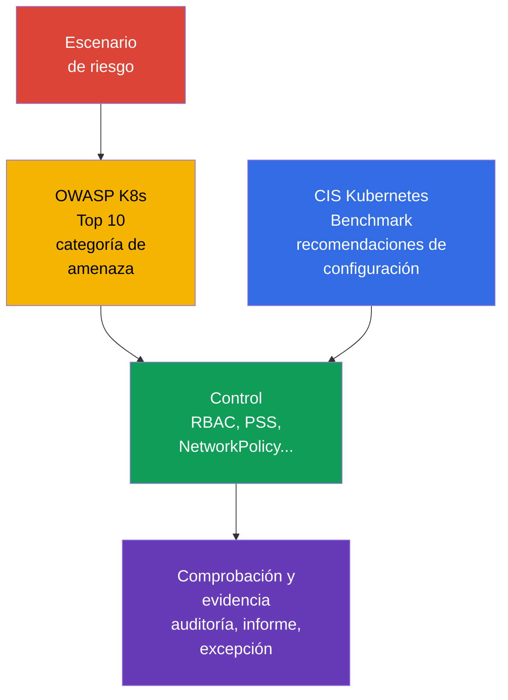

[Русская версия](ru.md) · [Eng version](README.md) · [Version française](fr.md) · [Deutsche Version](de.md) · [ქართული ვერსია](ge.md) · [繁體中文版](tw.md) · [日本語版](jp.md)

# Capítulo 05. Controles, marcos de referencia y técnicas de aislamiento

> **Qué sigue.** En el [capítulo 04](../04/es.md), la seguridad se trató en el nivel de la nube y la infraestructura. Ahora trasladaremos los principios de defense in depth al interior del clúster: analizaremos referencias para evaluar la seguridad, herramientas de automatización y capas de aislamiento. Esto forma parte del dominio **Overview of Cloud Native Security**, con un peso del 14%.

## 05.1 Controls y frameworks: CIS Kubernetes Benchmark y OWASP Kubernetes Top 10

Un **security control** es una medida concreta que reduce la probabilidad de un ataque o sus consecuencias. Por ejemplo, prohibir el acceso anónimo a la API, un `Role` limitado, una `NetworkPolicy` con default-deny o un perfil de Pod Security Standards. Un **framework** es una estructura con la que se evalúan los riesgos y la cobertura de estas medidas. Un framework no protege el clúster por sí mismo: ayuda a no omitir controls importantes.

[CIS Kubernetes Benchmark](https://www.cisecurity.org/benchmark/kubernetes) es un conjunto de recomendaciones para la configuración segura de Kubernetes. Agrupa las comprobaciones por componentes del control plane, worker nodes, políticas y otros objetos. Una recomendación típica de CIS responde a la pregunta: «¿qué configuración reduce una superficie de ataque conocida?». Por ejemplo, prohibir el acceso anónimo, proteger archivos con credenciales o habilitar un mecanismo de auditoría adecuado.

Es importante no considerar el resultado de CIS como un certificado binario de «el clúster es seguro». Algunas recomendaciones dependen del método de instalación, de Kubernetes gestionado y del modelo de riesgo adoptado. Se evalúan en contexto: se documentan la excepción, el propietario del riesgo y el control compensatorio, en lugar de desactivar la comprobación sin explicación.

[OWASP](https://owasp.org/) (Open Worldwide Application Security Project, proyecto abierto de seguridad de aplicaciones web) [Kubernetes Top 10](https://owasp.org/www-project-kubernetes-top-ten/) es un catálogo de clases comunes de riesgos de Kubernetes, no un conjunto de parámetros de configuración exactos. Ayuda a debatir amenazas en categorías comprensibles: configuración insegura, privilegios excesivos, segmentación de red débil, imágenes inseguras y observabilidad insuficiente. Es práctico aplicarlo durante el diseño y la revisión: para cada categoría, preguntar dónde es posible en este clúster y qué control la reduce.

| Referencia | Pregunta principal | Resultado de la aplicación | Lo que no sustituye |
|---|---|---|---|
| CIS Kubernetes Benchmark | ¿Están configurados de forma segura los componentes y los nodos? | Lista de recomendaciones técnicas y desviaciones | Modelo de amenazas y procesos operativos |
| OWASP Kubernetes Top 10 | ¿Qué clases de riesgos no se deben omitir? | Lenguaje común para el análisis de amenazas y la priorización | Configuraciones detalladas y comprobación de la configuración |
| Security baseline interno | ¿Qué considera la organización como mínimo aceptable? | Controls, excepciones y propietarios obligatorios | Requisitos externos del sector o del regulador |

CIS y OWASP se complementan: CIS suele indicar *qué comprobar en la configuración*, mientras que OWASP ayuda a entender *por qué se necesita esta clase de defensas*. Los requisitos sectoriales, las evidencias de conformidad y la gestión de excepciones se tratan con más detalle en el [capítulo 19](../19/es.md).



## 05.2 Automatización de comprobaciones: `kube-bench`, policy engines y scanners

La comprobación manual es útil para entender el sistema, pero escala mal y se desactualiza fácilmente. La automatización hace que el baseline sea repetible: se ejecuta al crear el clúster, en CI/CD y periódicamente en el entorno activo. Aun así, la herramienta produce una señal y la decisión sobre el riesgo y la corrección sigue correspondiendo al equipo.

`kube-bench` compara los parámetros y el estado de los componentes de Kubernetes con las comprobaciones de CIS Benchmark. Su resultado suele incluir comprobaciones pass, fail y manual. Es especialmente útil para un clúster self-managed, donde el equipo gestiona el control plane y los nodos. En Kubernetes gestionado, algunas comprobaciones no están disponibles para el usuario o son responsabilidad del proveedor, por lo que el informe debe interpretarse teniendo en cuenta el modelo de shared responsibility.

Un **policy engine** comprueba los objetos declarativos de Kubernetes conforme a las reglas de la organización. OPA/Gatekeeper, Kyverno y los mecanismos de admission integrados pueden, por ejemplo, rechazar un `Pod` con `privileged: true`, prohibir un registry no autorizado o exigir etiquetas. Funcionan antes de la creación o modificación del objeto mediante el admission path. Un policy engine no sustituye la protección del host: no ve todas las acciones de un proceso en el worker node ni corrige un nodo ya comprometido.

Los **scanners** buscan vulnerabilidades conocidas, configuraciones inseguras y secretos. Un scanner de imágenes relaciona los paquetes con una base de datos de CVE; un scanner de manifiestos detecta campos arriesgados; un scanner de repositorios puede detectar un token guardado por accidente. Ejemplos de clases de herramientas: Trivy o Grype para imágenes, `kube-linter` y `kubesec` para manifiestos. Una lista de CVE no equivale automáticamente a una vulnerabilidad explotable: importan la accesibilidad, la disponibilidad de una corrección, la criticidad de la carga de trabajo y las medidas compensatorias.

| Herramienta | Qué suele comprobar | Cuándo actúa | Limitación típica |
|---|---|---|---|
| `kube-bench` | Configuración de componentes y nodos según CIS | Periódicamente o después de cambiar el clúster | No evalúa la lógica de negocio de la aplicación |
| Policy engine | Campos de objetos API según reglas | En admission, a veces en modo audit | No protege frente al compromiso directo de un nodo |
| Image scanner | Paquetes y CVE en la imagen | Antes de publicar y periódicamente después | No sabe si se usa la ruta de código vulnerable |
| Manifest/secret scanner | Campos inseguros y secretos en el repositorio | En pre-commit o CI | No ve el estado del clúster completo |

Un proceso sólido combina estos niveles: CI no permite errores básicos, admission no permite un objeto inadecuado en el clúster y el escaneo periódico encuentra nuevas CVE en imágenes ya publicadas. Los resultados se dirigen al propietario, se clasifican por riesgo y no se ignoran indefinidamente: una excepción justificada debe tener una fecha de revisión y un control compensatorio.

## 05.3 Técnicas de aislamiento: de `Namespace` a sandbox runtime

El aislamiento reduce la posibilidad de que un usuario, equipo o carga de trabajo comprometida influya en otro. En Kubernetes es multicapa. Cada capa cubre su propio tipo de interacción, por lo que un único `Namespace` o un solo policy engine no crean una frontera de seguridad completa.

### Frontera lógica: `Namespace` y RBAC

`Namespace` separa los nombres de la mayoría de los objetos y proporciona un ámbito práctico para cuotas, etiquetas, RBAC y políticas. Es adecuado para organizar equipos y entornos, pero por sí mismo no prohíbe el acceso. Un usuario con el `ClusterRole` adecuado puede acceder a objetos fuera de su `Namespace`, y el tráfico de red entre `Pod` suele estar permitido de forma predeterminada.

RBAC responde a otra pregunta: **quién puede realizar qué acción sobre qué recurso API**. El principio de least privilege implica que un `Role` o `ClusterRole` concede únicamente los verbs y el scope necesarios. La combinación `Namespace` + `RoleBinding` suele ser suficiente para un equipo interno habitual, pero no protege los datos sin aislamiento de red y de workload.

### Frontera de red y workload: `NetworkPolicy` y PSS

`NetworkPolicy` define el ingress y egress permitido para los `Pod` seleccionados. Un enfoque base práctico es default-deny y, después, abrir explícitamente las direcciones necesarias. La política solo actúa si el CNI la implementa. Restringe la interacción de red, pero no prohíbe el acceso a la API ni limita los privilegios del proceso del contenedor.

Pod Security Standards (PSS) define tres perfiles: `privileged`, `baseline` y `restricted`. Pod Security Admission aplica un perfil a un `Namespace` en los modos `enforce`, `audit` o `warn`. En particular, `restricted` intenta reducir el riesgo de ejecución privilegiada, capabilities peligrosas y acceso a los espacios de nombres del host. PSS crea un mínimo predecible para un `Pod`, pero no resuelve todas las reglas individuales de la organización.

```yaml
apiVersion: v1
kind: Namespace
metadata:
  name: team-a
  labels:
    pod-security.kubernetes.io/enforce: restricted
    pod-security.kubernetes.io/enforce-version: v1.36
```

Este fragmento muestra la asignación de etiquetas, pero no sustituye la comprobación de compatibilidad de las cargas de trabajo concretas. PSS y Pod Security Admission se explican en detalle en el [capítulo 11](../11/es.md), y NetworkPolicy y la segmentación en el [capítulo 13](../13/es.md).

### Frontera de ejecución: gVisor y Kata Containers

Un contenedor normal aísla procesos mediante namespaces y cgroups, pero comparte el kernel del host. Si un atacante consigue ejecutar código en un contenedor, una vulnerabilidad del kernel o una configuración incorrecta pueden ampliar las consecuencias.

**gVisor** añade una capa sandbox: las llamadas al sistema de la aplicación se procesan mediante el kernel de espacio de usuario `runsc`, no directamente a través de la interfaz normal del kernel del host. Esto reduce la superficie del kernel para una carga de trabajo no confiable a cambio de limitaciones de compatibilidad y rendimiento.

**Kata Containers** ejecuta la carga de trabajo del contenedor dentro de una máquina virtual ligera. La frontera de la VM suele ser más fuerte, porque se aplican virtualización de hardware y un entorno de kernel separado. El coste es un mayor consumo de recursos, un inicio más lento y una operación más compleja.

Un sandbox runtime no es útil para todos los `Pod`. Es especialmente adecuado para código de clientes, CI jobs, sistemas de build públicos y otras cargas de trabajo con mayor falta de confianza. No elimina la necesidad de RBAC, PSS, NetworkPolicy y la actualización de imágenes: es una capa adicional, no un sustituto de los demás controls.

### Soft y hard multi-tenancy

**Soft multi-tenancy** está pensada para equipos de una misma organización con un nivel de confianza comparable. Normalmente comparten el control plane y los worker nodes, mientras que las fronteras se construyen con `Namespace`, RBAC, ResourceQuota, PSS y NetworkPolicy. El riesgo sigue siendo común: un error de administrador, una vulnerabilidad del control plane o el compromiso de un worker node puede afectar a varios tenants.

**Hard multi-tenancy** es necesaria cuando los tenants no confían entre sí, los requisitos sobre los datos son más estrictos o se requiere una separación de responsabilidades más fuerte. A los controls enumerados se añaden nodos dedicados, sandbox runtime, cuentas de nube o VPC independientes y, a menudo, clústeres separados. La frontera práctica más fuerte suele estar fuera de un único clúster de Kubernetes.

| Capa | Qué aísla | Ejemplo de control | Lo que no se debe esperar |
|---|---|---|---|
| Organizativa | Nombres de objetos y propiedad | `Namespace`, quotas | Protección autónoma de la API y la red |
| API | Operaciones de un usuario o ServiceAccount | RBAC | Restricciones del tráfico entre Pods |
| Red | Flujos de tráfico permitidos | `NetworkPolicy` | Protección frente a un proceso privileged |
| Workload | Parámetros peligrosos de `Pod` | PSS, admission policy | Aislamiento del kernel como el de una VM |
| Runtime/infraestructura | Ejecución de código no confiable | gVisor, Kata, nodo dedicado | Eliminación de todas las demás capas |

## 05.4 Linux process y resource isolation: fronteras distintas, preguntas distintas

Un contenedor es, ante todo, un proceso Linux al que el runtime ha asignado varios limitadores independientes. Crean defense in depth, pero no se debe presentar un mecanismo como si fuera otro.

| Mecanismo | Pregunta que responde | Lo que **no** hace |
|---|---|---|
| namespaces | Qué ve el proceso: PID, red, mounts y otros espacios de nombres | No son una policy de acceso ni limitan CPU/RAM. |
| cgroups | Cuánta CPU, memoria y otros recursos puede usar el proceso | No crean un sandbox ni filtran syscalls. |
| Linux capabilities | Qué acciones individuales similares a root están permitidas al proceso | Una capability no es root completo ni sustituye una MAC policy. |
| seccomp | Qué system calls están permitidas al proceso | No regula el tráfico Pod-to-Pod. |
| AppArmor / SELinux | Qué acciones y recursos permite una mandatory access control (MAC) policy | No son un filtro de system calls: ese es el papel de seccomp. |
| gVisor / Kata Containers | OCI-compatible sandboxed runtimes: gVisor `runsc` implementa OCI Runtime Specification y aísla el workload mediante un application kernel en userspace; Kata Containers mantiene OCI/CRI compatibility, pero ejecuta el workload dentro de una lightweight VM. | Refuerzan la execution boundary, pero no sustituyen RBAC, PSS/PSA ni NetworkPolicy. |

`AppArmor` y `SELinux` son Linux Security Modules con mandatory access control: una policy puede prohibir una acción incluso si los permisos Unix normales la permitirían. AppArmor suele aplicar un profile a un programa; SELinux aplica labels y policy a sujetos y objetos. En KCSA hay que asociarlos con la restricción de las acciones de un proceso, no escribir profile/policy propios: esa es una habilidad posterior de nivel CKS.

### Modelo unificado de recursos

El aislamiento de recursos protege la disponibilidad del clúster compartido, pero no es un security sandbox. Los `requests` participan en la decisión del scheduler y la reserva; `limits.cpu` limitan la CPU y pueden causar throttling; `limits.memory` limitan la memoria y, bajo pressure, pueden terminar el proceso como OOM. `LimitRange` establece default/min/max para contenedores o `Pod` individuales dentro del namespace, mientras que `ResourceQuota` limita el consumo total del namespace. HPA escala el workload y no crea una security boundary; `NetworkPolicy` regula la ruta de red, no la CPU/RAM.

| Escenario | Mejor control | Evidence y distractor |
|---|---|---|
| Un tenant puede crear ilimitados `Pod` u ocupar recursos de forma total | `ResourceQuota` | Comprobar el uso de quota; no es `LimitRange`. |
| Un `Pod` solicita 64 GiB de RAM sin un baseline acordado | `LimitRange` y una policy para requests/limits | Comprobar el rejection/default de admission; no es HPA. |
| Un `Pod` comprometido no debe acceder a la database | `NetworkPolicy` | Comprobar la policy y el intento de conexión; quota no filtra el tráfico. |

## 05.5 Cómo elegir el nivel de aislamiento para la tarea

La elección no empieza con una herramienta. Primero se formula la frontera de confianza: quién despliega el código, qué datos ve, qué daño es aceptable y quién administra el clúster. Después se elige la combinación mínima suficiente de controls y se comprueba que realmente se aplica.

| Situación | Punto de partida razonable | Cuándo reforzar |
|---|---|---|
| Varios equipos internos, mismo nivel de confianza | `Namespace`, RBAC de least privilege, PSS, NetworkPolicy | Al acceder a clases de datos diferentes o con privilegios elevados |
| Jobs de prueba o código de una fuente externa | Controls básicos más sandbox runtime | Si el código puede ser malicioso o procesa secretos |
| Los clientes despliegan sus propias cargas de trabajo | Hard multi-tenancy: red fuerte, cómputo dedicado, sandbox o clúster separado | Si el regulador o el modelo de amenazas exige una frontera administrativa independiente |
| Servicio con datos especialmente sensibles | Acceso limitado a la API, segmentación de red, secretos separados y observabilidad | Si el control plane o los nodos compartidos siguen siendo un riesgo inaceptable |

En la práctica, resulta útil preguntar: «¿qué ocurrirá si este `Pod`, su ServiceAccount o el worker node se ven comprometidos?». La respuesta muestra la capa que falta. Por ejemplo, RBAC limitará las acciones de API de ServiceAccount, pero no detendrá una conexión a otra database; NetworkPolicy detendrá esa conexión, pero no impedirá que el contenedor obtenga una capability peligrosa; un sandbox reduce las consecuencias de un exploit, pero no corrige un permiso excesivo en RBAC.

El aislamiento también tiene un coste operativo. Una policy demasiado estricta, introducida sin modo `audit` ni preparación de los equipos, bloquea releases legítimos. Una policy demasiado flexible convierte el clúster compartido en una única zona de impacto. Por eso los controls se introducen gradualmente, se miden las excepciones y se revisan periódicamente junto con el modelo de amenazas.

## 05.6 Cómo se aplica en la práctica

El equipo de plataforma suele elaborar un security baseline a partir de varias fuentes: recomendaciones de CIS, categorías de riesgo de OWASP, requisitos de la organización y el modelo de amenazas de servicios concretos. El baseline se convierte en reglas comprobables: qué perfiles PSS son obligatorios, qué registry están permitidos, si se necesitan `NetworkPolicy` default-deny, quién puede crear `RoleBinding` y para qué workload se requiere sandbox runtime.

Antes de admitir una nueva carga de trabajo, el equipo realiza una breve security review: determina el propietario, la confianza en el código y la imagen, los permisos API necesarios, las dependencias de red, la sensibilidad de los datos y la frontera admisible de uso compartido. Después, el pipeline ejecuta scanners, admission comprueba los manifiestos y los informes periódicos de `kube-bench` y scanners crean tareas para eliminar las desviaciones.

Al detectar una infracción, no siempre es correcto aplicar inmediatamente el modo más estricto. Por ejemplo, el perfil seleccionado de Pod Security Standards puede aplicarse primero mediante Pod Security Admission en los modos `audit` y `warn`: evaluar las infracciones reales, mostrar advertencias a los usuarios y corregir las plantillas de despliegue. Tras una transición acordada, se configura el modo `enforce` para el perfil necesario. Para un policy engine de terceros, se utiliza su propio modo audit, preview o un modo no bloqueante similar, si está disponible. Así, un control técnico se convierte en un proceso sostenible y no en una comprobación puntual.

## 05.7 Exam vocabulary / Mini-glosario

| Término | Significado breve |
|---|---|
| CIS Kubernetes Benchmark | Conjunto de recomendaciones para la configuración segura de Kubernetes. |
| control | Medida técnica o de proceso para reducir el riesgo. |
| gVisor | Sandbox runtime que intercepta las llamadas al sistema de la carga de trabajo. |
| hard multi-tenancy | Aislamiento de tenants con fronteras fuertes, a menudo de infraestructura. |
| `kube-bench` | Herramienta que comprueba Kubernetes frente a las recomendaciones de CIS. |
| `NetworkPolicy` | Recurso API para limitar el tráfico ingress y egress de `Pod`. |
| OWASP Kubernetes Top 10 | Catálogo de clases importantes de riesgos de Kubernetes. |
| Pod Security Standards | Perfiles de seguridad `privileged`, `baseline` y `restricted`. |
| policy engine | Mecanismo que aplica reglas a objetos API, a menudo en el admission path. |
| soft multi-tenancy | Separación de equipos de confianza en un clúster compartido con controls lógicos. |

## 05.8 Exam Essentials / Resumen del capítulo

- CIS Kubernetes Benchmark proporciona recomendaciones comprobables para una configuración segura, y OWASP Kubernetes Top 10 ayuda a no omitir clases de riesgos.
- `kube-bench`, policy engines y scanners automatizan etapas diferentes de control y no se sustituyen entre sí.
- `Namespace` organiza el ámbito de los objetos, pero no es una frontera de seguridad independiente. Para el aislamiento se necesitan RBAC, NetworkPolicy, PSS y, si hace falta, sandbox runtime.
- gVisor y Kata Containers reducen el riesgo de ejecutar código no confiable, pero tienen un coste de compatibilidad, recursos y operación.
- Soft multi-tenancy es adecuada para equipos internos de confianza; con tenants no confiables se necesita hard multi-tenancy, a veces con un clúster separado.
- El nivel de aislamiento se elige según la frontera de confianza y las consecuencias de un compromiso, no según la popularidad de la herramienta.

## 05.9 No confundir y cómo aparece en el examen

Una pregunta de KCSA suele describir un objetivo y pedir elegir el control más adecuado. Es útil separar conceptos cercanos:

- CIS Benchmark son recomendaciones de configuración, no un scanner de vulnerabilidades de imágenes.
- OWASP Kubernetes Top 10 es un catálogo de riesgos, no un admission controller.
- `Namespace` es un ámbito de nombres, no un aislamiento automático de red o RBAC.
- RBAC limita las solicitudes a la API de Kubernetes y `NetworkPolicy` los flujos de red.
- PSS limita los parámetros de `Pod`, y gVisor y Kata refuerzan la frontera de ejecución.
- Soft multi-tenancy presupone cierto riesgo compartido; hard multi-tenancy se aplica cuando la frontera de confianza debe ser más fuerte.

En formulaciones como «mejor primer paso», busque el control que cubre la capa mencionada. Ante una pregunta sobre el acceso de ServiceAccount a `Secret`, se trata de RBAC; sobre tráfico entre `Pod`, de `NetworkPolicy`; sobre código no confiable, de sandbox runtime como capa adicional.

## 05.10 Preguntas de autoevaluación

### 1. ¿Cuál describe con mayor precisión el propósito de CIS Kubernetes Benchmark?

   - a. Es un runtime para aislar contenedores mediante máquinas virtuales.
   - b. Es un mecanismo de autenticación de la API de Kubernetes.
   - c. Es un conjunto de recomendaciones para la configuración segura de Kubernetes.
   - d. Es una lista de CVE en imágenes de contenedor.

<details>
<summary>Respuesta y explicación</summary>

**Respuesta correcta: c.** CIS Kubernetes Benchmark estructura recomendaciones para evaluar la configuración segura de componentes y nodos. El aislamiento de runtime corresponde a Kata Containers, un scanner de imágenes busca CVE y la autenticación se realiza en API Server.

</details>

### 2. ¿Qué control limita principalmente el tráfico de red entre `Pod`?

   - a. `RoleBinding`
   - b. `NetworkPolicy`
   - c. Pod Security Admission
   - d. `Namespace`

<details>
<summary>Respuesta y explicación</summary>

**Respuesta correcta: b.** `NetworkPolicy` define los flujos ingress y egress permitidos si cuenta con soporte del CNI. RBAC limita las solicitudes a la API, PSS los parámetros de `Pod`, y `Namespace` por sí solo no crea una frontera de red.

</details>

### 3. Equipos de una organización usan un clúster compartido y confían entre sí, pero solo deben ver sus propios objetos y servicios de red. ¿Qué enfoque es más apropiado como base?

   - a. Solo Kata Containers para todos los `Pod`.
   - b. Solo `Namespace`, sin otros controls.
   - c. Soft multi-tenancy: `Namespace`, RBAC de least privilege, PSS y `NetworkPolicy`.
   - d. Solo un clúster separado para cada equipo.

<details>
<summary>Respuesta y explicación</summary>

**Respuesta correcta: c.** Para equipos internos de confianza es adecuada una combinación de controls lógicos y de red. Un solo `Namespace` no limita el acceso a la API ni el tráfico; los clústeres separados y Kata pueden ser necesarios con un modelo de amenazas más estricto, pero no son la primera elección obligatoria.

</details>

### 4. ¿En qué situación proporcionan gVisor o Kata Containers el mayor beneficio adicional?

   - a. Cuando se ejecuta código con mayor falta de confianza y se necesita reforzar la frontera de ejecución.
   - b. Cuando se necesita conceder a ServiceAccount acceso de lectura a `ConfigMap`.
   - c. Cuando es necesario encontrar CVE en una imagen publicada.
   - d. Cuando se necesitan renombrar objetos en diferentes `Namespace`.

<details>
<summary>Respuesta y explicación</summary>

**Respuesta correcta: a.** Un sandbox runtime reduce la superficie de interacción de una carga de trabajo no confiable con el kernel del host. La opción b se resuelve con RBAC (acceso de ServiceAccount a `ConfigMap`), la opción c con un image scanner (búsqueda de CVE en la imagen) y la opción d con `Namespace` (renombrar objetos entre espacios de nombres).

</details>

### 5. ¿Qué afirmación sobre `kube-bench` es correcta?

   - a. Corrige automáticamente todos los parámetros inseguros del control plane.
   - b. Bloquea un `Pod` inadecuado durante la fase de admission.
   - c. Sustituye el modelo de amenazas y la security review.
   - d. Compara la configuración con comprobaciones CIS y exige interpretar los resultados.

<details>
<summary>Respuesta y explicación</summary>

**Respuesta correcta: d.** `kube-bench` ayuda a detectar desviaciones de CIS, pero los resultados dependen del entorno y de la responsabilidad del proveedor. El bloqueo automático de objetos lo realiza un policy engine, y el modelo de amenazas sigue siendo una actividad independiente.

</details>

> **A dónde seguir.** Para configurar e interpretar las comprobaciones CIS, pase al capítulo 07 de CKS: CIS Benchmarks y kube-bench. Para sandbox runtimes y aislamiento más profundo, al capítulo 22 de CKS: RuntimeClass y sandbox. Dentro de KCSA, continúe con el [capítulo 11 sobre PSS y Pod Security Admission](../11/es.md) y el [capítulo 13 sobre NetworkPolicy y segmentación](../13/es.md).

[Índice](../README_ES.md) · [Capítulo 04](../04/es.md) · [Capítulo 06](../06/es.md)
