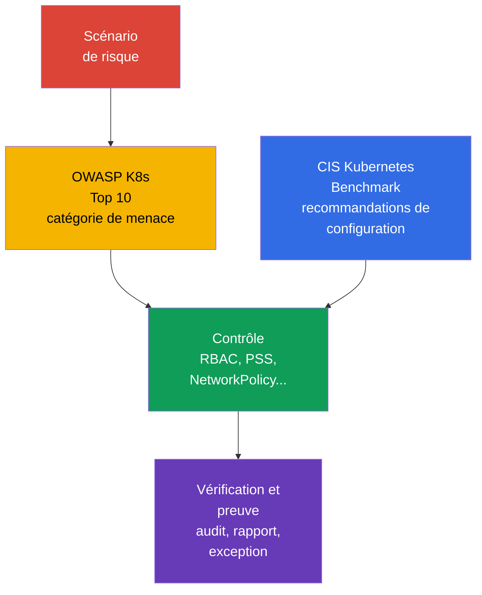

[Русская версия](ru.md) · [Eng version](README.md) · [Versión en español](es.md) · [Deutsche Version](de.md) · [ქართული ვერსია](ge.md) · [繁體中文版](tw.md) · [日本語版](jp.md)

# Chapitre 05. Contrôles, frameworks et techniques d'isolation

> **La suite.** Dans le [chapitre 04](../04/fr.md), la protection était abordée au niveau du cloud et de l'infrastructure. Nous allons maintenant appliquer les principes de defense in depth à l'intérieur du cluster : nous examinerons les repères pour évaluer la sécurité, les outils d'automatisation et les couches d'isolation. Cela fait partie du domaine **Overview of Cloud Native Security**, qui pèse 14 %.

## 05.1 Contrôles et frameworks : CIS Kubernetes Benchmark et OWASP Kubernetes Top 10

Un **security control** est une mesure concrète qui réduit la probabilité d'une attaque ou ses conséquences. Par exemple, interdire l'anonymous access à l'API, limiter un `Role`, appliquer une `NetworkPolicy` avec default-deny ou utiliser un profil Pod Security Standards. Un **framework** est une structure permettant d'évaluer les risques et l'exhaustivité de ces mesures. Un framework ne protège pas le cluster à lui seul : il aide à ne pas omettre des controls importants.

[CIS Kubernetes Benchmark](https://www.cisecurity.org/benchmark/kubernetes) est un ensemble de recommandations pour une configuration sécurisée de Kubernetes. Il regroupe les vérifications par composants du control plane, worker nodes, politiques et autres objets. Une recommandation CIS typique répond à la question : « quel paramètre réduit une surface d'attaque connue ? ». Par exemple, interdire l'accès anonyme, protéger les fichiers contenant des identifiants ou activer un mécanisme d'audit adapté.

Il est important de ne pas considérer le résultat CIS comme un certificat binaire indiquant que « le cluster est sécurisé ». Certaines recommandations dépendent de la méthode d'installation, du managed Kubernetes et du modèle de risque retenu. Elles sont évaluées dans leur contexte : l'exception, le propriétaire du risque et le control compensatoire sont documentés, au lieu de désactiver une vérification sans explication.

[OWASP](https://owasp.org/) (Open Worldwide Application Security Project, projet ouvert pour la sécurité des applications web) [Kubernetes Top 10](https://owasp.org/www-project-kubernetes-top-ten/) est un catalogue de classes courantes de risques Kubernetes, et non un ensemble de paramètres de configuration précis. Il aide à discuter des menaces avec des catégories compréhensibles : configuration non sécurisée, privilèges excessifs, segmentation réseau insuffisante, images non sécurisées et observabilité insuffisante. Il est pratique lors de la conception et des revues : pour chaque catégorie, on se demande où elle est possible dans ce cluster et quel control la réduit.

| Référence | Question principale | Résultat de l'application | Ne remplace pas |
|---|---|---|---|
| CIS Kubernetes Benchmark | Les composants et les nœuds sont-ils configurés de manière sécurisée ? | Liste de recommandations techniques et d'écarts | Le modèle de menace et les processus opérationnels |
| OWASP Kubernetes Top 10 | Quelles classes de risques ne doivent pas être omises ? | Langage commun pour l'analyse des menaces et la priorisation | Les paramètres détaillés et la vérification de configuration |
| Security baseline interne | Que considère l'organisation comme le minimum acceptable ? | Controls obligatoires, exceptions, propriétaires | Les exigences externes de l'industrie ou du régulateur |

CIS et OWASP se complètent : CIS indique généralement *quoi vérifier dans les paramètres*, tandis qu'OWASP aide à comprendre *pourquoi cette classe de protections est nécessaire*. Les exigences sectorielles, les preuves de conformité et la gestion des exceptions sont examinées plus en détail dans le [chapitre 19](../19/fr.md).



## 05.2 Automatisation des vérifications : `kube-bench`, policy engines et scanners

La vérification manuelle est utile pour comprendre le système, mais elle passe mal à l'échelle et devient facilement obsolète. L'automatisation rend le baseline reproductible : elle est exécutée à la création du cluster, dans le CI/CD et régulièrement dans l'environnement en fonctionnement. L'outil produit toutefois un signal, tandis que la décision sur le risque et la correction reste celle de l'équipe.

`kube-bench` compare les paramètres et l'état des composants Kubernetes aux vérifications du CIS Benchmark. Son résultat contient habituellement des pass, fail et manual checks. Il est particulièrement utile pour un cluster self-managed, dans lequel l'équipe gère le control plane et les nœuds. Dans un managed Kubernetes, une partie des vérifications est inaccessible à l'utilisateur ou relève de la responsabilité du fournisseur ; le rapport doit donc être interprété en tenant compte du modèle de shared responsibility.

Un **policy engine** vérifie les objets déclaratifs Kubernetes selon les règles de l'organisation. OPA/Gatekeeper, Kyverno et les mécanismes admission intégrés peuvent, par exemple, rejeter un `Pod` avec `privileged: true`, interdire un registry non autorisé ou exiger des labels. Ils agissent avant la création ou la modification de l'objet via l'admission path. Un policy engine ne remplace pas la protection de l'hôte : il ne voit pas toutes les actions du processus sur le worker node et ne corrige pas un nœud déjà compromis.

Les **scanners** recherchent les vulnérabilités connues, les paramètres non sécurisés et les secrets. Un scanner d'images compare les packages à une base de CVE ; un scanner de manifests détecte les champs risqués ; un scanner de dépôt peut découvrir un token enregistré par inadvertance. Exemples de classes d'outils : Trivy ou Grype pour les images, `kube-linter` et `kubesec` pour les manifests. Une liste de CVE ne correspond pas automatiquement à une vulnérabilité exploitable : l'atteignabilité, l'existence d'un correctif, la criticité de la workload et les mesures compensatoires sont importantes.

| Outil | Ce qu'il vérifie habituellement | Quand il intervient | Limitation typique |
|---|---|---|---|
| `kube-bench` | La configuration des composants et des nœuds selon CIS | Périodiquement ou après une modification du cluster | N'évalue pas la logique métier de l'application |
| Policy engine | Les champs des objets API selon les règles | Lors de l'admission, parfois en mode audit | Ne protège pas contre la compromission directe d'un nœud |
| Image scanner | Les packages et CVE dans l'image | Avant la publication et régulièrement après celle-ci | Ne sait pas si le chemin de code vulnérable est utilisé |
| Manifest/secret scanner | Les champs non sécurisés et les secrets dans le dépôt | En pre-commit ou CI | Ne voit pas l'état complet du cluster |

Un processus fiable combine ces niveaux : le CI n'admet pas les erreurs de base, l'admission n'admet pas d'objet inadapté dans le cluster, et le scan périodique trouve les nouvelles CVE dans les images déjà publiées. Les résultats sont adressés au propriétaire, classifiés selon le risque et ne sont pas ignorés indéfiniment : une exception justifiée doit avoir une date de révision et un control compensatoire.

## 05.3 Techniques d'isolation : de `Namespace` au sandbox runtime

L'isolation réduit la capacité d'un utilisateur, d'une équipe ou d'une workload compromise à affecter une autre workload. Dans Kubernetes, elle est multicouche. Chaque couche couvre son propre type d'interaction ; un seul `Namespace` ou un seul policy engine ne crée donc pas une frontière de sécurité complète.

### Frontière logique : `Namespace` et RBAC

Un `Namespace` sépare les noms de la plupart des objets et fournit une portée pratique pour les quotas, labels, RBAC et politiques. Il convient pour organiser les équipes et les environnements, mais n'interdit pas l'accès à lui seul. Un utilisateur disposant d'un `ClusterRole` approprié peut accéder à des objets hors de son `Namespace`, et le trafic réseau entre `Pod` est généralement autorisé par défaut.

RBAC répond à une autre question : **qui peut exécuter quelle action sur quelle ressource API**. Le principe de least privilege signifie qu'un `Role` ou un `ClusterRole` ne donne que les verbs et le scope nécessaires. L'association `Namespace` + `RoleBinding` suffit souvent à une équipe interne ordinaire, mais elle ne protège pas les données sans isolation réseau et workload.

### Frontière réseau et workload : `NetworkPolicy` et PSS

Une `NetworkPolicy` définit les ingress et egress autorisés pour les `Pod` sélectionnés. Une approche de base pratique est le default-deny, suivi de l'ouverture explicite des directions nécessaires. La politique ne s'applique que si le CNI l'implémente. Elle limite les interactions réseau, mais n'interdit pas l'accès à l'API et ne limite pas les privilèges du processus de conteneur.

Pod Security Standards (PSS) définit trois profils : `privileged`, `baseline` et `restricted`. Pod Security Admission applique un profil à un `Namespace` dans les modes `enforce`, `audit` ou `warn`. En particulier, `restricted` cherche à réduire le risque d'exécution privilégiée, de capabilities dangereuses et d'accès aux espaces de noms de l'hôte. PSS crée un minimum prévisible pour les `Pod`, mais ne résout pas toutes les règles individuelles de l'organisation.

```yaml
apiVersion: v1
kind: Namespace
metadata:
  name: team-a
  labels:
    pod-security.kubernetes.io/enforce: restricted
    pod-security.kubernetes.io/enforce-version: v1.36
```

Cet extrait montre l'attribution des labels, mais ne remplace pas la vérification de compatibilité des workloads concrètes. PSS et Pod Security Admission sont détaillés dans le [chapitre 11](../11/fr.md), et NetworkPolicy ainsi que la segmentation dans le [chapitre 13](../13/fr.md).

### Frontière d'exécution : gVisor et Kata Containers

Un conteneur ordinaire isole les processus par namespaces et cgroups, mais partage le kernel de l'hôte. Si un attaquant obtient l'exécution de code dans le conteneur, une vulnérabilité du kernel ou une configuration incorrecte peut étendre les conséquences.

**gVisor** ajoute une couche sandbox : les appels système de l'application sont traités par le kernel utilisateur `runsc`, et non directement par l'interface kernel habituelle de l'hôte. Cela réduit la surface du kernel exposée à une workload non fiable, au prix de limitations de compatibilité et de performances.

**Kata Containers** exécute la workload de conteneur dans une machine virtuelle légère. La frontière VM est généralement plus forte, car elle applique la virtualisation matérielle et un environnement kernel distinct. Le coût est une consommation de ressources plus élevée, un démarrage plus long et une exploitation plus complexe.

Un sandbox runtime n'est pas utile pour chaque `Pod`. Il est particulièrement adapté au code client, aux CI jobs, aux systèmes de build publics et aux autres workloads à confiance élevée en moins. Il n'annule pas RBAC, PSS, NetworkPolicy et la mise à jour des images : il s'agit d'une couche supplémentaire, et non d'un remplacement des autres controls.

### Soft et hard multi-tenancy

La **soft multi-tenancy** est destinée aux équipes d'une même organisation ayant un niveau de confiance comparable. Elles partagent généralement le control plane et les worker nodes, tandis que les frontières reposent sur `Namespace`, RBAC, ResourceQuota, PSS et NetworkPolicy. Le risque reste commun : une erreur d'administrateur, une vulnérabilité du control plane ou la compromission d'un worker node peut affecter plusieurs tenants.

La **hard multi-tenancy** est nécessaire lorsque les tenants ne se font pas confiance, que les exigences relatives aux données sont plus strictes ou qu'une séparation des responsabilités plus forte est requise. Aux controls énumérés s'ajoutent des nœuds dédiés, un sandbox runtime, des comptes cloud ou VPC séparés, et souvent des clusters distincts. La frontière pratique la plus forte se trouve souvent en dehors d'un unique cluster Kubernetes.

| Couche | Ce qu'elle isole | Exemple de control | Ce qu'il ne faut pas en attendre |
|---|---|---|---|
| Organisationnelle | Les noms d'objets et la propriété | `Namespace`, quotas | Une protection autonome de l'API et du réseau |
| API | Les opérations d'un utilisateur ou ServiceAccount | RBAC | Des restrictions du trafic inter-Pod |
| Réseau | Les flux de trafic autorisés | `NetworkPolicy` | Une protection contre un processus privileged |
| Workload | Les paramètres dangereux de `Pod` | PSS, admission policy | Une isolation du kernel comme celle d'une VM |
| Runtime/infrastructure | L'exécution de code non fiable | gVisor, Kata, nœud dédié | L'annulation de toutes les autres couches |

## 05.4 Linux process et resource isolation : frontières différentes, questions différentes

Un conteneur est avant tout un processus Linux auquel le runtime a attribué plusieurs limites indépendantes. Elles créent une defense in depth, mais un mécanisme ne doit pas être présenté comme un autre.

| Mécanisme | Question à laquelle il répond | Ce qu'il **ne** fait pas |
|---|---|---|
| namespaces | Ce que le processus voit : PID, réseau, mounts et autres espaces de noms | Ne sont pas une policy d'accès et ne limitent pas CPU/RAM. |
| cgroups | Combien de CPU, mémoire et autres ressources le processus peut utiliser | Ne créent pas de sandbox et ne filtrent pas les syscalls. |
| Linux capabilities | Quelles actions individuelles de type root sont autorisées au processus | Une capability n'est pas le root complet et ne remplace pas une MAC policy. |
| seccomp | Quels system calls sont autorisés au processus | Ne régule pas le Pod-to-Pod traffic. |
| AppArmor / SELinux | Quelles actions et ressources une mandatory access control (MAC) policy autorise | Ne sont pas un filtre de system calls : c'est le rôle de seccomp. |
| gVisor / Kata Containers | OCI-compatible sandboxed runtimes : gVisor `runsc` implémente OCI Runtime Specification et isole la workload par un userspace application kernel ; Kata Containers conserve la OCI/CRI compatibility, mais exécute la workload dans une lightweight VM. | Renforcent l'execution boundary, mais ne remplacent pas RBAC, PSS/PSA ou NetworkPolicy. |

`AppArmor` et `SELinux` sont des Linux Security Modules avec mandatory access control : la policy peut interdire une action même lorsque les Unix permissions ordinaires l'autoriseraient. AppArmor applique habituellement un profile à un programme, SELinux applique des labels et une policy aux sujets et aux objets. Pour KCSA, il faut les associer à la limitation des actions d'un processus, et non écrire ses propres profile/policy : c'est une compétence CKS de niveau ultérieur.

### Modèle unifié des ressources

L'isolation des ressources protège la disponibilité du cluster partagé, mais n'est pas une security sandbox. Les `requests` participent à la décision du scheduler et à la réservation ; les `limits.cpu` limitent le CPU et peuvent conduire au throttling ; les `limits.memory` limitent la mémoire et peuvent terminer le processus comme OOM en cas de pressure. `LimitRange` définit les default/min/max pour des conteneurs ou `Pod` individuels dans un namespace, tandis que `ResourceQuota` limite la consommation totale du namespace. HPA met à l'échelle la workload et ne crée pas de security boundary ; `NetworkPolicy` régule le chemin réseau, et non le CPU/RAM.

| Scénario | Meilleur control | Evidence et distractor |
|---|---|---|
| Un tenant peut créer un nombre illimité de `Pod` ou occuper les ressources au total | `ResourceQuota` | Vérifier quota usage ; ce n'est pas `LimitRange`. |
| Un `Pod` demande 64 GiB de RAM sans baseline convenu | `LimitRange` et une policy pour requests/limits | Vérifier admission rejection/default ; ce n'est pas HPA. |
| Un `Pod` compromis ne doit pas accéder à database | `NetworkPolicy` | Vérifier la policy et une tentative de connexion ; quota ne filtre pas le trafic. |

## 05.5 Comment choisir le niveau d'isolation selon la tâche

Le choix ne commence pas par un outil. On formule d'abord la frontière de confiance : qui déploie le code, quelles données il voit, quel dommage est acceptable et qui administre le cluster. On choisit ensuite la combinaison minimale suffisante de controls et on vérifie qu'elle est réellement appliquée.

| Situation | Point de départ raisonnable | Quand renforcer |
|---|---|---|
| Plusieurs équipes internes, même niveau de confiance | `Namespace`, RBAC least-privilege, PSS, NetworkPolicy | En cas d'accès à différentes classes de données ou de privilèges élevés |
| Test jobs ou code provenant d'une source externe | Controls de base plus sandbox runtime | Si le code peut être malveillant ou traite des secrets |
| Des clients déploient leurs propres workloads | Hard multi-tenancy : réseau fort, allocation de calcul, sandbox ou cluster distinct | Si le régulateur ou le modèle de menace exige une frontière administrative indépendante |
| Service avec des données particulièrement sensibles | Accès limité à l'API, segmentation réseau, secrets distincts et observabilité | Si le control plane ou les nœuds partagés restent un risque inacceptable |

En pratique, une question utile est : « que se passera-t-il si ce `Pod`, son ServiceAccount ou son worker node est compromis ? » La réponse montre la couche manquante. Par exemple, RBAC limitera les actions API du ServiceAccount, mais n'empêchera pas une connexion à une autre base de données ; NetworkPolicy arrêtera cette connexion, mais n'empêchera pas le conteneur d'obtenir une capability dangereuse ; un sandbox réduira les conséquences d'un exploit, mais ne corrigera pas un droit RBAC excessif.

L'isolation a aussi un coût opérationnel. Une policy trop stricte introduite sans mode `audit` ni préparation des équipes bloque les releases légitimes. Une policy trop souple transforme le cluster partagé en zone d'impact unique. Les controls sont donc introduits progressivement, les exceptions sont mesurées et ils sont périodiquement révisés avec le modèle de menace.

## 05.6 Application pratique

L'équipe plateforme forme habituellement une security baseline à partir de plusieurs sources : recommandations CIS, catégories de risques OWASP, exigences de l'organisation et modèle de menace des services concernés. Le baseline devient des règles vérifiables : quels profils PSS sont obligatoires, quels registry sont autorisés, si des `NetworkPolicy` default-deny sont nécessaires, qui peut créer un `RoleBinding` et pour quelles workloads un sandbox runtime est requis.

Avant d'admettre une nouvelle workload, l'équipe effectue une courte security review : elle définit le propriétaire, la confiance accordée au code et à l'image, les droits API nécessaires, les dépendances réseau, la sensibilité des données et la frontière acceptable de partage. Le pipeline exécute ensuite les scanners, l'admission vérifie les manifests, et les rapports périodiques de `kube-bench` et des scanners créent des tâches pour corriger les écarts.

Lorsqu'une violation est détectée, il n'est pas toujours juste d'appliquer immédiatement le mode le plus strict. Par exemple, le profil Pod Security Standards choisi peut d'abord être appliqué par Pod Security Admission dans les modes `audit` et `warn` : évaluer les violations réelles, montrer les avertissements aux utilisateurs et corriger les modèles de déploiement. Après une transition concertée, le mode `enforce` est configuré pour le profil requis. Pour un policy engine tiers, son propre mode audit, preview ou un mode non bloquant analogue est utilisé, s'il est pris en charge. Ainsi, un control technique devient un processus durable, et non une vérification ponctuelle.

## 05.7 Vocabulaire d'examen / Mini-glossaire

| Terme | Signification succincte |
|---|---|
| CIS Kubernetes Benchmark | Ensemble de recommandations pour une configuration sécurisée de Kubernetes. |
| control | Mesure technique ou de processus de réduction du risque. |
| gVisor | Sandbox runtime qui intercepte les appels système de la workload. |
| hard multi-tenancy | Isolation des tenants avec des frontières fortes, souvent infrastructurelles. |
| `kube-bench` | Outil qui vérifie la conformité de Kubernetes aux recommandations CIS. |
| `NetworkPolicy` | Ressource API permettant de limiter le trafic ingress et egress des `Pod`. |
| OWASP Kubernetes Top 10 | Catalogue des classes de risques Kubernetes importantes. |
| Pod Security Standards | Profils de sécurité `privileged`, `baseline` et `restricted`. |
| policy engine | Mécanisme appliquant des règles aux objets API, souvent dans l'admission path. |
| soft multi-tenancy | Séparation d'équipes de confiance dans un cluster partagé avec des controls logiques. |

## 05.8 Exam Essentials / Points essentiels du chapitre

- CIS Kubernetes Benchmark fournit des recommandations vérifiables pour une configuration sécurisée, tandis qu'OWASP Kubernetes Top 10 aide à ne pas omettre des classes de risques.
- `kube-bench`, les policy engines et les scanners automatisent différentes étapes de contrôle et ne se remplacent pas les uns les autres.
- `Namespace` organise une portée d'objets, mais ne constitue pas une frontière de sécurité autonome. L'isolation requiert RBAC, NetworkPolicy, PSS et, si nécessaire, un sandbox runtime.
- gVisor et Kata Containers réduisent le risque lié à l'exécution de code non fiable, mais ont un coût de compatibilité, de ressources et d'exploitation.
- La soft multi-tenancy convient aux équipes internes de confiance ; avec des tenants non fiables, une hard multi-tenancy est nécessaire, parfois avec un cluster distinct.
- Le niveau d'isolation est choisi selon la frontière de confiance et les conséquences d'une compromission, et non selon la popularité d'un outil.

## 05.9 À ne pas confondre et présence à l'examen

Une question KCSA décrit généralement un objectif et demande de choisir le control le plus approprié. Il est utile de distinguer les notions proches :

- CIS Benchmark est un ensemble de recommandations de configuration, et non un scanner de vulnérabilités d'images.
- OWASP Kubernetes Top 10 est un catalogue de risques, et non un admission controller.
- `Namespace` est une portée de noms, et non une isolation réseau ou RBAC automatique.
- RBAC limite les accès à l'API Kubernetes, tandis que `NetworkPolicy` limite les flux réseau.
- PSS limite les paramètres des `Pod`, tandis que gVisor et Kata renforcent la frontière d'exécution.
- La soft multi-tenancy suppose un certain risque commun ; la hard multi-tenancy s'applique lorsqu'une frontière de confiance plus forte est requise.

Dans les formulations du type « meilleure première étape », cherchez le control qui couvre la couche nommée. Pour une question sur l'accès d'un ServiceAccount à un `Secret`, il s'agit de RBAC ; pour une question sur le trafic entre `Pod`, de `NetworkPolicy` ; pour une question sur du code non fiable, d'un sandbox runtime comme couche supplémentaire.

## 05.10 Questions d'auto-évaluation

### 1. Quelle est la description la plus précise de l'objectif du CIS Kubernetes Benchmark ?

   - a. C'est un runtime qui isole les conteneurs au moyen de machines virtuelles.
   - b. C'est un mécanisme d'authentification de l'API Kubernetes.
   - c. C'est un ensemble de recommandations pour une configuration sécurisée de Kubernetes.
   - d. C'est une liste de CVE dans les images de conteneur.

<details>
<summary>Réponse et explication</summary>

**Bonne réponse : c.** CIS Kubernetes Benchmark structure les recommandations permettant d'évaluer la configuration sécurisée des composants et des nœuds. L'isolation runtime relève de Kata Containers, les CVE sont recherchées par les scanners d'images, et l'authentification est effectuée dans l'API Server.

</details>

### 2. Quel control limite en premier lieu le trafic réseau entre les `Pod` ?

   - a. `RoleBinding`
   - b. `NetworkPolicy`
   - c. Pod Security Admission
   - d. `Namespace`

<details>
<summary>Réponse et explication</summary>

**Bonne réponse : b.** `NetworkPolicy` définit les flux ingress et egress autorisés avec le support du CNI. RBAC limite les accès à l'API, PSS les paramètres des `Pod`, et `Namespace` ne crée pas à lui seul une frontière réseau.

</details>

### 3. Des équipes d'une même organisation utilisent un cluster partagé et se font confiance, mais ne doivent voir que leurs propres objets et services réseau. Quelle approche est la plus appropriée comme base ?

   - a. Uniquement Kata Containers pour tous les `Pod`.
   - b. Uniquement `Namespace`, sans autres controls.
   - c. Soft multi-tenancy : `Namespace`, RBAC least-privilege, PSS et `NetworkPolicy`.
   - d. Uniquement un cluster distinct pour chaque équipe.

<details>
<summary>Réponse et explication</summary>

**Bonne réponse : c.** Pour des équipes internes de confiance, une combinaison de controls logiques et réseau convient. Un seul `Namespace` ne limite ni l'accès à l'API ni le trafic ; des clusters distincts et Kata peuvent être nécessaires avec un modèle de menace plus strict, mais ne constituent pas le premier choix obligatoire.

</details>

### 4. Dans quelle situation gVisor ou Kata Containers apportent-ils le plus grand bénéfice supplémentaire ?

   - a. Lorsqu'un code à confiance limitée est exécuté et qu'il faut renforcer la frontière d'exécution.
   - b. Lorsqu'il faut donner à un ServiceAccount un accès en lecture à `ConfigMap`.
   - c. Lorsqu'il faut trouver des CVE dans une image publiée.
   - d. Lorsqu'il faut renommer des objets dans différents `Namespace`.

<details>
<summary>Réponse et explication</summary>

**Bonne réponse : a.** Un sandbox runtime réduit la surface d'interaction d'une workload non fiable avec le kernel de l'hôte. L'option b relève de RBAC (accès du ServiceAccount à `ConfigMap`), l'option c d'un image scanner (recherche de CVE dans l'image), et l'option d de `Namespace` (renommage d'objets entre les espaces de noms).

</details>

### 5. Quelle affirmation sur `kube-bench` est vraie ?

   - a. Il corrige automatiquement tous les paramètres non sécurisés du control plane.
   - b. Il bloque un `Pod` inadapté pendant l'étape d'admission.
   - c. Il remplace le modèle de menace et la security review.
   - d. Il compare la configuration aux vérifications CIS et exige une interprétation des résultats.

<details>
<summary>Réponse et explication</summary>

**Bonne réponse : d.** `kube-bench` aide à détecter les écarts par rapport à CIS, mais les résultats dépendent de l'environnement et de la responsabilité du fournisseur. Le blocage automatique d'objets est effectué par un policy engine, tandis que le modèle de menace reste une activité distincte.

</details>

> **Où aller ensuite.** Pour configurer et interpréter les vérifications CIS, passez au chapitre 07 CKS : CIS Benchmarks et kube-bench. Pour les sandbox runtimes et une isolation plus approfondie, consultez le chapitre 22 CKS : RuntimeClass et sandbox. Au sein de KCSA, continuez avec le [chapitre 11 sur PSS et Pod Security Admission](../11/fr.md) et le [chapitre 13 sur NetworkPolicy et la segmentation](../13/fr.md).

[Table des matières](../README_FR.md) · [Chapitre 04](../04/fr.md) · [Chapitre 06](../06/fr.md)