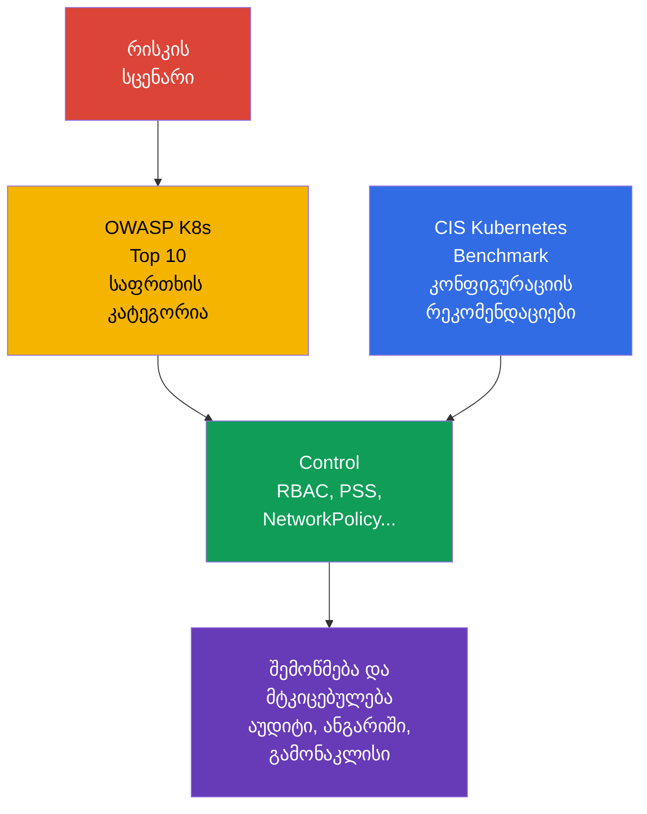

[Русская версия](ru.md) · [Eng version](README.md) · [Versión en español](es.md) · [Version française](fr.md) · [Deutsche Version](de.md) · [繁體中文版](tw.md) · [日本語版](jp.md)

# თავი 05. კონტროლის საშუალებები, ფრეიმვორკები და იზოლაციის ტექნიკები

> **რა არის შემდეგ.** [თავში 04](../04/ge.md) დაცვა ღრუბლისა და ინფრასტრუქტურის დონეზე განიხილებოდა. ახლა defense in depth-ის პრინციპებს კლასტერის შიგნით გადავიტანთ: განვიხილავთ უსაფრთხოების შემოწმების ორიენტირებს, ავტომატიზაციის საშუალებებსა და იზოლაციის ფენებს. ეს არის **Overview of Cloud Native Security** დომენის ნაწილი, რომლის წონაა 14%.

## 05.1 Controls და frameworks: CIS Kubernetes Benchmark და OWASP Kubernetes Top 10

**Security control** - კონკრეტული ზომა, რომელიც ამცირებს შეტევის ალბათობას ან მის შედეგებს. მაგალითად, API-ზე anonymous access-ის აკრძალვა, შეზღუდული `Role`, default-deny `NetworkPolicy` ან Pod Security Standards-ის პროფილი. **Framework** - სტრუქტურა, რომლის მიხედვითაც ფასდება რისკები და ამ ზომების სისრულე. Framework თავისთავად არ იცავს კლასტერს: ის გვეხმარება, რომ მნიშვნელოვანი controls არ გამოგვრჩეს.

[CIS Kubernetes Benchmark](https://www.cisecurity.org/benchmark/kubernetes) - Kubernetes-ის უსაფრთხო კონფიგურაციის რეკომენდაციების ნაკრები. ის შემოწმებებს აჯგუფებს control plane-ის კომპონენტების, worker nodes-ის, პოლიტიკებისა და სხვა ობიექტების მიხედვით. CIS-ის ტიპური რეკომენდაცია პასუხობს კითხვას: „რომელი პარამეტრი ამცირებს შეტევის ცნობილ ზედაპირს?“. მაგალითად, აიკრძალოს ანონიმური წვდომა, დაცული იყოს სააღრიცხვო მონაცემების შემცველი ფაილები ან ჩაირთოს აუდიტის შესაბამისი მექანიზმი.

მნიშვნელოვანია, CIS-ის შედეგი არ აღვიქვათ ბინარულ სერტიფიკატად „კლასტერი უსაფრთხოა“. ზოგიერთი რეკომენდაცია დამოკიდებულია ინსტალაციის მეთოდზე, managed Kubernetes-ზე და მიღებულ რისკის მოდელზე. ისინი კონტექსტში ფასდება: შემოწმების ახსნა-განმარტების გარეშე გამორთვის ნაცვლად დოკუმენტირდება გამონაკლისი, რისკის მფლობელი და საკომპენსაციო control.

[OWASP](https://owasp.org/) (Open Worldwide Application Security Project, ვებაპლიკაციების უსაფრთხოების ღია პროექტი) [Kubernetes Top 10](https://owasp.org/www-project-kubernetes-top-ten/) - Kubernetes-ის გავრცელებული რისკების კლასების კატალოგია და არა კონფიგურაციის ზუსტი პარამეტრების ნაკრები. ის გვეხმარება საფრთხეების გასაგები კატეგორიებით განხილვაში: არაუსაფრთხო კონფიგურაცია, გადაჭარბებული პრივილეგიები, ქსელის სუსტი სეგმენტაცია, არაუსაფრთხო იმიჯები და არასაკმარისი დაკვირვებადობა. მისი გამოყენება მოსახერხებელია პროექტირებისა და მიმოხილვისას: თითოეული კატეგორიისთვის უნდა დაისვას კითხვა, ამ კლასტერში სად შეიძლება წარმოიშვას ის და რომელი control ამცირებს მას.

| ორიენტირი | მთავარი კითხვა | გამოყენების შედეგი | რას არ ანაცვლებს |
|---|---|---|---|
| CIS Kubernetes Benchmark | კომპონენტები და კვანძები უსაფრთხოდ არის კონფიგურირებული? | ტექნიკური რეკომენდაციებისა და გადახრების სია | საფრთხეების მოდელსა და საექსპლუატაციო პროცესებს |
| OWASP Kubernetes Top 10 | რისკების რომელი კლასები არ უნდა გამოგვრჩეს? | საერთო ენა საფრთხეების ანალიზისა და პრიორიტეტების განსაზღვრისთვის | დეტალურ პარამეტრებსა და კონფიგურაციის შემოწმებას |
| შიდა security baseline | რას მიიჩნევს ორგანიზაცია მინიმალურად დასაშვებად? | სავალდებულო controls, გამონაკლისები, მფლობელები | დარგის ან მარეგულირებლის გარე მოთხოვნებს |

CIS და OWASP ერთმანეთს ავსებს: CIS ჩვეულებრივ გვკარნახობს, *რა შევამოწმოთ პარამეტრებში*, ხოლო OWASP გვეხმარება გავიგოთ, *რატომ არის საჭირო დაცვის ეს კლასი*. დარგობრივი მოთხოვნები, შესაბამისობის მტკიცებულებები და გამონაკლისების მართვა უფრო დაწვრილებით [თავში 19](../19/ge.md) განიხილება.



## 05.2 შემოწმებების ავტომატიზაცია: `kube-bench`, policy engines და scanners

ხელით შემოწმება სასარგებლოა სისტემის გასაგებად, მაგრამ ცუდად მასშტაბირდება და ადვილად ძველდება. ავტომატიზაცია baseline-ს განმეორებადს ხდის: მას უშვებენ კლასტერის შექმნისას, CI/CD-ში და რეგულარულად მოქმედ გარემოში. ამასთან, ინსტრუმენტი სიგნალს გასცემს, ხოლო რისკისა და გამოსწორების შესახებ გადაწყვეტილება კვლავ გუნდს ეკისრება.

`kube-bench` Kubernetes-ის კომპონენტების პარამეტრებსა და მდგომარეობას CIS Benchmark-ის შემოწმებებს ადარებს. მისი შედეგი ჩვეულებრივ შეიცავს pass, fail და manual checks სტატუსებს. ის განსაკუთრებით სასარგებლოა self-managed კლასტერისთვის, სადაც გუნდი მართავს control plane-სა და კვანძებს. managed Kubernetes-ში შემოწმებების ნაწილი მომხმარებლისთვის მიუწვდომელია ან პროვაიდერის პასუხისმგებლობას მიეკუთვნება, ამიტომ ანგარიში shared responsibility მოდელის გათვალისწინებით უნდა განიმარტოს.

**Policy engine** Kubernetes-ის დეკლარაციულ ობიექტებს ორგანიზაციის წესების მიხედვით ამოწმებს. OPA/Gatekeeper-ს, Kyverno-სა და ჩაშენებულ admission მექანიზმებს, მაგალითად, შეუძლია უარყოს `Pod`, რომელსაც აქვს `privileged: true`, აკრძალოს დაუშვებელი registry ან მოითხოვოს ჭდეები. ისინი admission path-ის გავლით ობიექტის შექმნამდე ან შეცვლამდე მუშაობს. Policy engine ჰოსტის დაცვას არ ანაცვლებს: ის ვერ ხედავს worker node-ზე პროცესის ყველა მოქმედებას და უკვე კომპრომეტირებულ კვანძს ვერ ასწორებს.

**Scanners** ეძებს ცნობილ მოწყვლადობებს, არაუსაფრთხო პარამეტრებსა და საიდუმლოებებს. იმიჯების სკანერი პაკეტებს CVE ბაზას ადარებს; მანიფესტების scanner სარისკო ველებს ავლენს; რეპოზიტორიის scanner-ს შემთხვევით შენახული ტოკენის აღმოჩენა შეუძლია. ინსტრუმენტების კლასების მაგალითებია: Trivy ან Grype იმიჯებისთვის, `kube-linter` და `kubesec` მანიფესტებისთვის. CVE-ების სია ავტომატურად ექსპლუატირებად მოწყვლადობას არ ნიშნავს: მნიშვნელოვანია მიღწევადობა, გამოსწორების არსებობა, სამუშაო დატვირთვის კრიტიკულობა და საკომპენსაციო ზომები.

| საშუალება | ჩვეულებრივ რას ამოწმებს | როდის მოქმედებს | ტიპური შეზღუდვა |
|---|---|---|---|
| `kube-bench` | კომპონენტებისა და კვანძების კონფიგურაციას CIS-ის მიხედვით | პერიოდულად ან კლასტერის შეცვლის შემდეგ | არ აფასებს აპლიკაციის ბიზნესლოგიკას |
| Policy engine | API ობიექტების ველებს წესების მიხედვით | admission-ისას, ზოგჯერ audit რეჟიმში | არ იცავს კვანძის პირდაპირი კომპრომეტაციისგან |
| Image scanner | იმიჯში არსებულ პაკეტებსა და CVE-ებს | გამოქვეყნებამდე და მის შემდეგ რეგულარულად | არ იცის, გამოიყენება თუ არა კოდის მოწყვლადი გზა |
| Manifest/secret scanner | არაუსაფრთხო ველებსა და საიდუმლოებებს რეპოზიტორიაში | pre-commit-ში ან CI-ში | ვერ ხედავს კლასტერის სრულ მდგომარეობას |

საიმედო პროცესი ამ დონეებს აერთიანებს: CI არ უშვებს საბაზისო შეცდომებს, admission არ უშვებს შეუსაბამო ობიექტს კლასტერში, ხოლო პერიოდული სკანირება უკვე გამოქვეყნებულ იმიჯებში ახალ CVE-ებს პოულობს. შედეგები ეგზავნება მფლობელს, კლასიფიცირდება რისკის მიხედვით და უსასრულოდ არ უგულებელყოფენ: დასაბუთებულ გამონაკლისს უნდა ჰქონდეს გადახედვის ვადა და საკომპენსაციო control.

## 05.3 იზოლაციის ტექნიკები: `Namespace`-დან sandbox runtime-მდე

იზოლაცია ამცირებს ერთი მომხმარებლის, გუნდის ან კომპრომეტირებული სამუშაო დატვირთვის შესაძლებლობას, გავლენა მოახდინოს სხვაზე. Kubernetes-ში ის მრავალფენიანია. თითოეული ფენა ურთიერთქმედების საკუთარ ტიპს ფარავს, ამიტომ ერთი `Namespace` ან ერთი policy engine უსაფრთხოების სრულყოფილ საზღვარს ვერ ქმნის.

### ლოგიკური საზღვარი: `Namespace` და RBAC

`Namespace` ობიექტების უმრავლესობის სახელებს ყოფს და კვოტების, ჭდეების, RBAC-ისა და პოლიტიკებისთვის მოსახერხებელ არეს იძლევა. ის გამოდგება გუნდებისა და გარემოების ორგანიზებისთვის, მაგრამ თავისთავად წვდომას არ კრძალავს. შესაბამისი `ClusterRole`-ის მქონე მომხმარებელს საკუთარი `Namespace`-ის გარეთ არსებულ ობიექტებთან მიმართვა შეუძლია, ხოლო `Pod`-ებს შორის ქსელური ტრაფიკი ნაგულისხმევად, ჩვეულებრივ, დაშვებულია.

RBAC სხვა კითხვას პასუხობს: **ვის შეუძლია რომელ API რესურსზე რომელი მოქმედების შესრულება**. least privilege პრინციპი ნიშნავს, რომ `Role` ან `ClusterRole` მხოლოდ აუცილებელ verbs-სა და scope-ს იძლევა. `Namespace` + `RoleBinding` კომბინაცია ხშირად საკმარისია ჩვეულებრივი შიდა გუნდისთვის, მაგრამ ქსელური და workload იზოლაციის გარეშე მონაცემებს ვერ იცავს.

### ქსელური და workload საზღვარი: `NetworkPolicy` და PSS

`NetworkPolicy` შერჩეული `Pod`-ებისთვის დასაშვებ ingress-სა და egress-ს განსაზღვრავს. პრაქტიკული საბაზისო მიდგომაა default-deny, შემდეგ კი საჭირო მიმართულებების ცხადად გახსნა. პოლიტიკა მხოლოდ მაშინ მოქმედებს, თუ CNI მას ახორციელებს. ის ზღუდავს ქსელურ ურთიერთქმედებას, მაგრამ არ კრძალავს API წვდომას და არ ზღუდავს კონტეინერის პროცესის პრივილეგიებს.

Pod Security Standards (PSS) სამ პროფილს განსაზღვრავს: `privileged`, `baseline` და `restricted`. Pod Security Admission პროფილს `Namespace`-ზე `enforce`, `audit` ან `warn` რეჟიმებში იყენებს. კერძოდ, `restricted` ცდილობს შეამციროს პრივილეგირებული შესრულების, სახიფათო capabilities-ისა და ჰოსტის სახელთა სივრცეებზე წვდომის რისკი. PSS `Pod`-ებისთვის პროგნოზირებად მინიმუმს ქმნის, მაგრამ ორგანიზაციის ყველა ინდივიდუალურ წესს ვერ წყვეტს.

```yaml
apiVersion: v1
kind: Namespace
metadata:
  name: team-a
  labels:
    pod-security.kubernetes.io/enforce: restricted
    pod-security.kubernetes.io/enforce-version: v1.36
```

ეს ფრაგმენტი ჭდეების დანიშნულებას გვიჩვენებს და კონკრეტული სამუშაო დატვირთვების თავსებადობის შემოწმებას არ ანაცვლებს. PSS და Pod Security Admission დეტალურად განხილულია [თავში 11](../11/ge.md), ხოლო NetworkPolicy და სეგმენტაცია - [თავში 13](../13/ge.md).

### შესრულების საზღვარი: gVisor და Kata Containers

ჩვეულებრივი კონტეინერი პროცესებს namespaces-ისა და cgroups-ის მეშვეობით იზოლირებს, მაგრამ ჰოსტის kernel-ს იზიარებს. თუ თავდამსხმელი კონტეინერში კოდის შესრულების შესაძლებლობას მიიღებს, kernel-ის მოწყვლადობამ ან მცდარმა პარამეტრმა შეიძლება შედეგები გააფართოოს.

**gVisor** sandbox-ის ფენას ამატებს: აპლიკაციის სისტემურ გამოძახებებს მომხმარებლის სივრცის ბირთვი `runsc` ამუშავებს და არა უშუალოდ ჰოსტის ჩვეულებრივი kernel ინტერფეისი. ეს ამცირებს ბირთვის ზედაპირს არასანდო სამუშაო დატვირთვისთვის, თავსებადობისა და წარმადობის შეზღუდვების ფასად.

**Kata Containers** კონტეინერულ სამუშაო დატვირთვას მსუბუქი ვირტუალური მანქანის შიგნით უშვებს. VM-ის საზღვარი, ჩვეულებრივ, უფრო ძლიერია, რადგან გამოიყენება აპარატურული ვირტუალიზაცია და ცალკე kernel გარემო. საფასურია რესურსების მეტი ხარჯი, უფრო ხანგრძლივი გაშვება და ექსპლუატაციის გართულება.

Sandbox runtime ყველა `Pod`-ისთვის სასარგებლო არ არის. ის განსაკუთრებით მიზანშეწონილია კლიენტების კოდისთვის, CI jobs-ისთვის, საჯარო build სისტემებისა და სხვა მეტად არასანდო სამუშაო დატვირთვებისთვის. ის არ აუქმებს RBAC-ს, PSS-ს, NetworkPolicy-სა და იმიჯების განახლებას: ეს დამატებითი ფენაა და არა დანარჩენი controls-ის შემცვლელი.

### Soft და hard multi-tenancy

**Soft multi-tenancy** განკუთვნილია ერთი ორგანიზაციის გუნდებისთვის, რომლებსაც ნდობის მსგავსი დონე აქვთ. ისინი, ჩვეულებრივ, control plane-სა და worker nodes-ს იზიარებენ, ხოლო საზღვრები იქმნება `Namespace`-ის, RBAC-ის, ResourceQuota-ს, PSS-ისა და NetworkPolicy-სგან. რისკი საერთო რჩება: ადმინისტრატორის შეცდომამ, control plane-ის მოწყვლადობამ ან worker node-ის კომპრომეტაციამ შეიძლება რამდენიმე tenant დააზარალოს.

**Hard multi-tenancy** საჭიროა, როდესაც tenants ერთმანეთს არ ენდობიან, მონაცემთა მოთხოვნები უფრო მკაცრია ან პასუხისმგებლობის უფრო ძლიერი გამიჯვნაა საჭირო. ჩამოთვლილ controls-ს ემატება გამოყოფილი კვანძები, sandbox runtime, ცალკეული ღრუბლოვანი ანგარიშები ან VPC, ხშირად კი ცალკეული კლასტერებიც. ყველაზე ძლიერი პრაქტიკული საზღვარი ხშირად ერთი Kubernetes კლასტერის გარეთ მდებარეობს.

| ფენა | რას იზოლირებს | control-ის მაგალითი | რის მოლოდინიც არ უნდა გვქონდეს |
|---|---|---|---|
| ორგანიზაციული | ობიექტების სახელებსა და მფლობელობას | `Namespace`, quotas | API-სა და ქსელის დამოუკიდებელი დაცვის |
| API | მომხმარებლის ან ServiceAccount-ის ოპერაციებს | RBAC | `Pod`-ებს შორის ტრაფიკის შეზღუდვის |
| ქსელი | ტრაფიკის დაშვებულ ნაკადებს | `NetworkPolicy` | privileged პროცესისგან დაცვის |
| სამუშაო დატვირთვა | `Pod`-ის სახიფათო პარამეტრებს | PSS, admission policy | kernel-ის VM-ის მსგავსი იზოლაციის |
| Runtime/ინფრასტრუქტურა | არასანდო კოდის შესრულებას | gVisor, Kata, გამოყოფილი კვანძი | ყველა დანარჩენი ფენის გაუქმების |

## 05.4 Linux process და resource isolation: განსხვავებული საზღვრები, განსხვავებული კითხვები

კონტეინერი, უპირველეს ყოვლისა, Linux პროცესია, რომელსაც runtime რამდენიმე დამოუკიდებელ შემზღუდველს ანიჭებს. ისინი defense in depth-ს ქმნიან, მაგრამ ერთი მექანიზმი მეორის ნაცვლად არ უნდა წარმოვადგინოთ.

| მექანიზმი | კითხვა, რომელსაც პასუხობს | რას **არ** აკეთებს |
|---|---|---|
| namespaces | რას ხედავს პროცესი: PID, ქსელი, mounts და სხვა სახელთა სივრცეები | არ არის წვდომის policy და არ ზღუდავს CPU/RAM-ს. |
| cgroups | რამდენი CPU, მეხსიერება და სხვა რესურსი შეუძლია გამოიყენოს პროცესმა | არ ქმნის sandbox-ს და არ ფილტრავს syscalls-ს. |
| Linux capabilities | რომელი ცალკეული root-like მოქმედებებია ნებადართული პროცესისთვის | Capability არ არის სრული root და არც MAC policy-ის შემცვლელია. |
| seccomp | რომელი system calls არის ნებადართული პროცესისთვის | არ არეგულირებს Pod-to-Pod traffic-ს. |
| AppArmor / SELinux | რომელ მოქმედებებსა და რესურსებს უშვებს mandatory access control (MAC) policy | არ არის system calls-ის ფილტრი: ეს seccomp-ის როლია. |
| gVisor / Kata Containers | OCI-სთან თავსებადი sandboxed runtimes: gVisor `runsc` ახორციელებს OCI Runtime Specification-ს და workload-ს userspace application kernel-ის მეშვეობით იზოლირებს; Kata Containers ინარჩუნებს OCI/CRI compatibility-ს, მაგრამ workload-ს lightweight VM-ში უშვებს. | აძლიერებს execution boundary-ს, მაგრამ არ ანაცვლებს RBAC-ს, PSS/PSA-ს ან NetworkPolicy-ს. |

`AppArmor` და `SELinux` - Linux Security Modules-ია mandatory access control-ით: პოლიტიკას მოქმედების აკრძალვა მაშინაც შეუძლია, როდესაც ჩვეულებრივი Unix permissions მას დაუშვებდა. AppArmor, ჩვეულებრივ, პროგრამას profile-ს უსადაგებს, SELinux კი სუბიექტებსა და ობიექტებს - labels-სა და policy-ს. KCSA-ზე ისინი პროცესის მოქმედებების შეზღუდვას უნდა დაუკავშიროთ და არა საკუთარი profile/policy-ის წერას: ეს შემდგომი CKS-level უნარია.

### რესურსების ერთიანი მოდელი

რესურსების იზოლაცია საერთო კლასტერის ხელმისაწვდომობას იცავს, მაგრამ security sandbox არ არის. `requests` scheduler-ის გადაწყვეტილებასა და რეზერვირებაში მონაწილეობს; `limits.cpu` CPU-ს ზღუდავს და შესაძლოა throttling გამოიწვიოს; `limits.memory` მეხსიერებას ზღუდავს და pressure-ის დროს შეიძლება პროცესი OOM-ით დაასრულოს. `LimitRange` namespace-ის შიგნით ცალკეული კონტეინერების ან `Pod`-ებისთვის default/min/max მნიშვნელობებს ადგენს, ხოლო `ResourceQuota` namespace-ის ჯამურ მოხმარებას ზღუდავს. HPA workload-ს მასშტაბირებს და security boundary-ს არ ქმნის; `NetworkPolicy` ქსელურ გზას არეგულირებს და არა CPU/RAM-ს.

| სცენარი | საუკეთესო control | Evidence და distractor |
|---|---|---|
| Tenant-ს შეუზღუდავი რაოდენობის `Pod`-ის შექმნა ან ჯამურად რესურსების დაკავება შეუძლია | `ResourceQuota` | შეამოწმეთ quota usage; ეს `LimitRange` არ არის. |
| ერთი `Pod` შეთანხმებული baseline-ის გარეშე 64 GiB RAM-ს ითხოვს | `LimitRange` და policy requests/limits-ისთვის | შეამოწმეთ admission rejection/default; ეს HPA არ არის. |
| კომპრომეტირებული `Pod` database-ს არ უნდა უკავშირდებოდეს | `NetworkPolicy` | შეამოწმეთ policy და დაკავშირების მცდელობა; quota ტრაფიკს არ ფილტრავს. |

## 05.5 როგორ შევარჩიოთ ამოცანის შესაბამისი იზოლაციის დონე

არჩევა ინსტრუმენტით არ იწყება. ჯერ ნდობის საზღვარი უნდა ჩამოყალიბდეს: ვინ ათავსებს კოდს, რა მონაცემებს ხედავს ის, რა ზიანი არის დასაშვები და ვინ მართავს კლასტერს. შემდეგ ირჩევენ controls-ის მინიმალურად საკმარის კომბინაციას და ამოწმებენ, რომ ის რეალურად გამოიყენება.

| სიტუაცია | გონივრული საწყისი წერტილი | როდის უნდა გაძლიერდეს |
|---|---|---|
| რამდენიმე შიდა გუნდი, ნდობის ერთნაირი დონე | `Namespace`, least-privilege RBAC, PSS, NetworkPolicy | მონაცემთა განსხვავებულ კლასებზე წვდომის ან გაზრდილი პრივილეგიებისას |
| სატესტო jobs ან გარე წყაროდან მიღებული კოდი | საბაზისო controls და დამატებით sandbox runtime | თუ კოდი შესაძლოა მავნე იყოს ან საიდუმლოებებს ამუშავებდეს |
| კლიენტები საკუთარ სამუშაო დატვირთვებს ათავსებენ | Hard multi-tenancy: ძლიერი ქსელი, გამოთვლითი რესურსების გამოყოფა, sandbox ან ცალკე კლასტერი | თუ მარეგულირებელი ან საფრთხეების მოდელი დამოუკიდებელ ადმინისტრაციულ საზღვარს მოითხოვს |
| განსაკუთრებით მგრძნობიარე მონაცემების მქონე სერვისი | API-ზე შეზღუდული წვდომა, ქსელის სეგმენტაცია, ცალკეული საიდუმლოებები და დაკვირვებადობა | თუ საერთო control plane ან კვანძები მიუღებელ რისკად რჩება |

პრაქტიკაში სასარგებლოა კითხვა: „რა მოხდება, თუ ეს `Pod`, მისი ServiceAccount ან worker node კომპრომეტირებული იქნება?“. პასუხი გვაჩვენებს, რომელი ფენა გვაკლია. მაგალითად, RBAC შეზღუდავს ServiceAccount-ის API მოქმედებებს, მაგრამ სხვა მონაცემთა ბაზასთან კავშირს ვერ შეაჩერებს; NetworkPolicy ამ კავშირს შეაჩერებს, მაგრამ კონტეინერს სახიფათო capability-ის მიღებაში ხელს ვერ შეუშლის; sandbox შეამცირებს exploit-ის შედეგებს, მაგრამ RBAC-ში ზედმეტ უფლებას ვერ გამოასწორებს.

იზოლაციას საექსპლუატაციო ღირებულებაც აქვს. ზედმეტად მკაცრი პოლიტიკა, რომელიც `audit` რეჟიმისა ან გუნდების მომზადების გარეშე დაინერგა, ლეგიტიმურ რელიზებს ბლოკავს. ზედმეტად რბილი პოლიტიკა საერთო კლასტერს დაზიანების ერთიან ზონად აქცევს. ამიტომ controls ეტაპობრივად ინერგება, გამონაკლისები იზომება და საფრთხეების მოდელთან ერთად პერიოდულად გადაიხედება.

## 05.6 როგორ იყენებენ ამას პრაქტიკაში

პლატფორმის გუნდი security baseline-ს, ჩვეულებრივ, რამდენიმე წყაროსგან აყალიბებს: CIS-ის რეკომენდაციები, OWASP-ის რისკების კატეგორიები, ორგანიზაციის მოთხოვნები და კონკრეტული სერვისების საფრთხეების მოდელი. Baseline შემოწმებად წესებად გარდაიქმნება: PSS-ის რომელი პროფილებია სავალდებულო, რომელი registry არის დაშვებული, საჭიროა თუ არა default-deny `NetworkPolicy`, ვის შეუძლია `RoleBinding`-ის შექმნა და რომელი workload-ისთვის არის საჭირო sandbox runtime.

ახალი სამუშაო დატვირთვის დაშვებამდე გუნდი მოკლე security review-ს ატარებს: განსაზღვრავს მფლობელს, კოდისა და იმიჯისადმი ნდობას, საჭირო API უფლებებს, ქსელურ დამოკიდებულებებს, მონაცემთა მგრძნობიარობასა და ერთობლივი გამოყენების დასაშვებ საზღვარს. შემდეგ pipeline უშვებს scanners-ს, admission ამოწმებს მანიფესტებს, ხოლო `kube-bench`-ისა და სკანერების პერიოდული ანგარიშები გადახრების აღმოსაფხვრელ ამოცანებს ქმნის.

დარღვევის აღმოჩენისას ყოველთვის სწორი არ არის ყველაზე მკაცრი რეჟიმის დაუყოვნებლივ გამოყენება. მაგალითად, Pod Security Standards-ის შერჩეული პროფილი ჯერ Pod Security Admission-ის `audit` და `warn` რეჟიმებით შეიძლება გამოიყენოთ: შეაფასოთ რეალური დარღვევები, მომხმარებლებს გაფრთხილებები აჩვენოთ და deployment შაბლონები გამოასწოროთ. შეთანხმებული გადასვლის შემდეგ საჭირო პროფილისთვის `enforce` რეჟიმი კონფიგურირდება. გარე policy engine-ისთვის გამოიყენება მისი საკუთარი audit, preview ან მსგავსი არამბლოკავი რეჟიმი, თუ ასეთი რეჟიმი მხარდაჭერილია. ამგვარად, ტექნიკური control მდგრად პროცესად იქცევა და არა ერთჯერად შემოწმებად.

## 05.7 Exam vocabulary / მინი-ლექსიკონი

| ტერმინი | მოკლე მნიშვნელობა |
|---|---|
| CIS Kubernetes Benchmark | Kubernetes-ის უსაფრთხო კონფიგურაციის რეკომენდაციების ნაკრები. |
| control | რისკის შემცირების ტექნიკური ან პროცესული ზომა. |
| gVisor | Sandbox runtime, რომელიც სამუშაო დატვირთვის სისტემურ გამოძახებებს იჭერს. |
| hard multi-tenancy | tenants-ის იზოლაცია ძლიერი, ხშირად ინფრასტრუქტურული საზღვრებით. |
| `kube-bench` | Kubernetes-ის CIS რეკომენდაციებთან შესაბამისობის შემოწმების ინსტრუმენტი. |
| `NetworkPolicy` | API რესურსი `Pod`-ის ingress და egress ტრაფიკის შესაზღუდად. |
| OWASP Kubernetes Top 10 | Kubernetes-ის მნიშვნელოვანი რისკების კლასების კატალოგი. |
| Pod Security Standards | უსაფრთხოების პროფილები `privileged`, `baseline` და `restricted`. |
| policy engine | მექანიზმი, რომელიც API ობიექტებზე წესებს იყენებს, ხშირად admission path-ში. |
| soft multi-tenancy | სანდო გუნდების დაყოფა საერთო კლასტერში ლოგიკური controls-ის გამოყენებით. |

## 05.8 Exam Essentials / თავის შეჯამება

- CIS Kubernetes Benchmark უსაფრთხო კონფიგურაციის შემოწმებად რეკომენდაციებს იძლევა, ხოლო OWASP Kubernetes Top 10 გვეხმარება, რომ რისკების კლასები არ გამოგვრჩეს.
- `kube-bench`, policy engines და scanners კონტროლის სხვადასხვა ეტაპს ავტომატიზებს და ერთმანეთს არ ანაცვლებს.
- `Namespace` ობიექტების არეს ორგანიზებას უკეთებს, მაგრამ უსაფრთხოების დამოუკიდებელი საზღვარი არ არის. იზოლაციისთვის საჭიროა RBAC, NetworkPolicy, PSS და, საჭიროების შემთხვევაში, sandbox runtime.
- gVisor და Kata Containers არასანდო კოდის შესრულების რისკს ამცირებს, თუმცა თავსებადობის, რესურსებისა და ექსპლუატაციის ფასი აქვს.
- Soft multi-tenancy სანდო შიდა გუნდებისთვის გამოდგება; არასანდო tenants-ის შემთხვევაში საჭიროა hard multi-tenancy, ზოგჯერ ცალკე კლასტერით.
- იზოლაციის დონე ნდობის საზღვრისა და კომპრომეტაციის შედეგების მიხედვით ირჩევა და არა ინსტრუმენტის პოპულარობით.

## 05.9 რა არ უნდა აგვერიოს და როგორ გვხვდება ეს გამოცდაზე

KCSA-ის კითხვა, ჩვეულებრივ, აღწერს მიზანს და ითხოვს ყველაზე შესაფერისი control-ის არჩევას. სასარგებლოა მსგავსი ცნებების გამიჯვნა:

- CIS Benchmark - კონფიგურაციის რეკომენდაციებია და არა იმიჯის მოწყვლადობების scanner.
- OWASP Kubernetes Top 10 - რისკების კატალოგია და არა admission controller.
- `Namespace` - სახელთა არეა და არა ავტომატური ქსელური ან RBAC იზოლაცია.
- RBAC ზღუდავს Kubernetes API-სთან მიმართვას, ხოლო `NetworkPolicy` - ქსელურ ნაკადებს.
- PSS `Pod`-ის პარამეტრებს ზღუდავს, ხოლო gVisor და Kata შესრულების საზღვარს აძლიერებს.
- Soft multi-tenancy გარკვეულ საერთო რისკს გულისხმობს; hard multi-tenancy ნდობის უფრო ძლიერი საზღვრისას გამოიყენება.

ფორმულირებებში „საუკეთესო პირველი ნაბიჯი“ ეძებეთ control, რომელიც დასახელებულ ფენას ფარავს. ServiceAccount-ის `Secret`-ზე წვდომის კითხვაში ეს RBAC-ია; `Pod`-ებს შორის ტრაფიკის კითხვაში - `NetworkPolicy`; არასანდო კოდის კითხვაში - sandbox runtime, როგორც დამატებითი ფენა.

## 05.10 თვითშემოწმების კითხვები

### 1. რომელი აღწერს ყველაზე ზუსტად CIS Kubernetes Benchmark-ის დანიშნულებას?

   - a. ეს არის runtime ვირტუალური მანქანების მეშვეობით კონტეინერების იზოლაციისთვის.
   - b. ეს არის Kubernetes API-ის ავთენტიფიკაციის მექანიზმი.
   - c. ეს არის Kubernetes-ის უსაფრთხო კონფიგურაციის რეკომენდაციების ნაკრები.
   - d. ეს არის კონტეინერის იმიჯებში არსებული CVE-ების სია.

<details>
<summary>პასუხი და განმარტება</summary>

**სწორი პასუხია: c.** CIS Kubernetes Benchmark კომპონენტებისა და კვანძების უსაფრთხო კონფიგურაციის შესაფასებელ რეკომენდაციებს აყალიბებს. Runtime იზოლაცია Kata Containers-ს მიეკუთვნება, CVE-ებს იმიჯების scanner ეძებს, ხოლო ავთენტიფიკაცია API Server-ში სრულდება.

</details>

### 2. რომელი control ზღუდავს უპირველესად ქსელურ ტრაფიკს `Pod`-ებს შორის?

   - a. `RoleBinding`
   - b. `NetworkPolicy`
   - c. Pod Security Admission
   - d. `Namespace`

<details>
<summary>პასუხი და განმარტება</summary>

**სწორი პასუხია: b.** `NetworkPolicy` CNI-ის მხარდაჭერის შემთხვევაში დაშვებულ ingress და egress ნაკადებს განსაზღვრავს. RBAC API-სთან მიმართვას ზღუდავს, PSS - `Pod`-ის პარამეტრებს, ხოლო `Namespace` თავისთავად ქსელურ საზღვარს არ ქმნის.

</details>

### 3. ერთი ორგანიზაციის გუნდები საერთო კლასტერს იყენებენ და ერთმანეთს ენდობიან, მაგრამ მხოლოდ საკუთარ ობიექტებსა და ქსელურ სერვისებს უნდა ხედავდნენ. რომელი მიდგომაა ყველაზე მიზანშეწონილი საბაზისოდ?

   - a. მხოლოდ Kata Containers ყველა `Pod`-ისთვის.
   - b. მხოლოდ `Namespace`, სხვა controls-ის გარეშე.
   - c. Soft multi-tenancy: `Namespace`, least-privilege RBAC, PSS და `NetworkPolicy`.
   - d. მხოლოდ ცალკე კლასტერი თითოეული გუნდისთვის.

<details>
<summary>პასუხი და განმარტება</summary>

**სწორი პასუხია: c.** სანდო შიდა გუნდებისთვის ლოგიკური და ქსელური controls-ის კომბინაცია გამოდგება. ერთი `Namespace` API წვდომასა და ტრაფიკს არ ზღუდავს; ცალკეული კლასტერები და Kata შეიძლება უფრო მკაცრი საფრთხეების მოდელისას გახდეს საჭირო, მაგრამ სავალდებულო პირველი არჩევანი არ არის.

</details>

### 4. რომელ სიტუაციაში იძლევა gVisor ან Kata Containers ყველაზე მეტ დამატებით სარგებელს?

   - a. როდესაც მეტად არასანდო კოდი სრულდება და შესრულების საზღვრის გაძლიერებაა საჭირო.
   - b. როდესაც ServiceAccount-ს `ConfigMap`-ის წაკითხვის წვდომა უნდა მიეცეს.
   - c. როდესაც გამოქვეყნებულ იმიჯში CVE უნდა მოიძებნოს.
   - d. როდესაც ობიექტებს სხვადასხვა `Namespace`-ში სახელი უნდა გადაერქვას.

<details>
<summary>პასუხი და განმარტება</summary>

**სწორი პასუხია: a.** Sandbox runtime ამცირებს არასანდო სამუშაო დატვირთვის ჰოსტის kernel-თან ურთიერთქმედების ზედაპირს. b ვარიანტს RBAC წყვეტს (ServiceAccount-ის წვდომა `ConfigMap`-ზე), c ვარიანტს - image scanner (იმიჯში CVE-ის ძიება), ხოლო d ვარიანტს - `Namespace` (ობიექტებისთვის სახელების შეცვლა სივრცეებს შორის).

</details>

### 5. რომელი დებულებაა სწორი `kube-bench`-ის შესახებ?

   - a. ის control plane-ის ყველა არაუსაფრთხო პარამეტრს ავტომატურად ასწორებს.
   - b. ის admission ეტაპზე შეუსაბამო `Pod`-ს ბლოკავს.
   - c. ის საფრთხეების მოდელსა და security review-ს ანაცვლებს.
   - d. ის კონფიგურაციას CIS-ის შემოწმებებს ადარებს და შედეგების ინტერპრეტაციას მოითხოვს.

<details>
<summary>პასუხი და განმარტება</summary>

**სწორი პასუხია: d.** `kube-bench` CIS-დან გადახრების აღმოჩენაში გვეხმარება, მაგრამ შედეგები გარემოსა და პროვაიდერის პასუხისმგებლობაზეა დამოკიდებული. ობიექტების ავტომატურ დაბლოკვას policy engine ასრულებს, ხოლო საფრთხეების მოდელი ცალკე საქმიანობად რჩება.

</details>

> **სად წავიდეთ შემდეგ.** CIS შემოწმებების კონფიგურაციისა და ინტერპრეტაციისთვის გადადით CKS-ის თავზე 07: CIS Benchmarks და kube-bench. sandbox runtimes-ისა და უფრო ღრმა იზოლაციისთვის - CKS-ის თავზე 22: RuntimeClass და sandbox. KCSA-ში განაგრძეთ [თავით 11 PSS-ისა და Pod Security Admission-ის შესახებ](../11/ge.md) და [თავით 13 NetworkPolicy-ისა და სეგმენტაციის შესახებ](../13/ge.md).

[სარჩევი](../README_GE.md) · [თავი 04](../04/ge.md) · [თავი 06](../06/ge.md)
