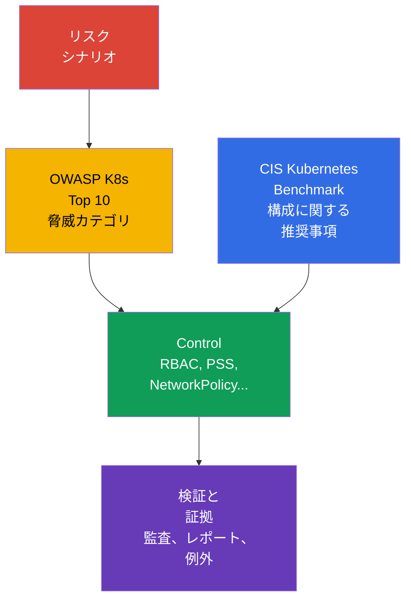

[Русская версия](ru.md) · [Eng version](README.md) · [Versión en español](es.md) · [Version française](fr.md) · [Deutsche Version](de.md) · [ქართული ვერსია](ge.md) · [繁體中文版](tw.md)

# 第05章. コントロール、フレームワーク、隔離技術

> **この次に学ぶこと。** [第04章](../04/jp.md)では、クラウドとインフラストラクチャのレベルで保護を扱いました。ここからは defense in depth の原則をクラスター内部へ広げます。セキュリティ検証の指針、自動化ツール、隔離のレイヤーを取り上げます。これは **Overview of Cloud Native Security** ドメインの一部で、配点比重は14%です。

## 05.1 Controls と frameworks: CIS Kubernetes Benchmark と OWASP Kubernetes Top 10

**Security control** は、攻撃の可能性またはその影響を低減する具体的な対策です。たとえば、API への anonymous access の禁止、限定的な `Role`、default-deny の `NetworkPolicy`、または Pod Security Standards のプロファイルが該当します。**Framework** は、リスクとこうした対策の網羅性を評価するための構造です。Framework 自体がクラスターを保護するわけではありません。重要な controls の見落としを防ぐのに役立ちます。

[CIS Kubernetes Benchmark](https://www.cisecurity.org/benchmark/kubernetes) は、Kubernetes を安全に構成するための推奨事項の集合です。control plane、worker nodes、ポリシー、その他のオブジェクトごとに検証をグループ化しています。典型的な CIS 推奨事項は、「どの設定が既知の攻撃対象領域を減らすか」という問いに答えます。たとえば、匿名アクセスを禁止する、認証情報ファイルを保護する、または適切な監査メカニズムを有効化します。

CIS の結果を「クラスターは安全である」という二値の認定として捉えないことが重要です。一部の推奨事項は、インストール方法、managed Kubernetes、採用しているリスクモデルに依存します。これらは文脈の中で評価します。説明なく検証を無効にするのではなく、例外、リスクの所有者、補償 control を文書化します。

[OWASP](https://owasp.org/) (Open Worldwide Application Security Project、オープンな Web アプリケーションセキュリティプロジェクト) の [Kubernetes Top 10](https://owasp.org/www-project-kubernetes-top-ten/) は、正確な設定パラメーターの集合ではなく、よくある Kubernetes リスククラスのカタログです。安全でない構成、過剰な権限、弱いネットワークセグメンテーション、安全でないイメージ、十分でない可観測性という理解しやすいカテゴリで脅威を議論するのに役立ちます。設計時とレビュー時に便利です。各カテゴリについて、このクラスターのどこで起こり得るか、どの control がそれを減らすかを問います。

| 指針 | 主な問い | 適用結果 | 置き換えられないもの |
|---|---|---|---|
| CIS Kubernetes Benchmark | コンポーネントとノードは安全に構成されているか? | 技術的な推奨事項と逸脱の一覧 | 脅威モデルと運用プロセス |
| OWASP Kubernetes Top 10 | 見落としてはいけないリスククラスは何か? | 脅威分析と優先順位付けのための共通言語 | 詳細な設定と構成検証 |
| 内部 security baseline | 組織が最低限許容できると考えるものは何か? | 必須 controls、例外、所有者 | 業界または規制当局の外部要件 |

CIS と OWASP は相互補完的です。CIS は通常、*設定で何を検証するか*を示し、OWASP は、*なぜこの保護クラスが必要か*を理解する助けになります。業界要件、準拠の証拠、例外管理については[第19章](../19/jp.md)で詳しく扱います。



## 05.2 検証の自動化: `kube-bench`、policy engines、scanners

手動検証はシステムを理解するために有用ですが、スケールしにくく、すぐに古くなりがちです。自動化により baseline を繰り返し可能にします。クラスター作成時、CI/CD 内、稼働中の環境で定期的に実行します。ただし、ツールはシグナルを出すものであり、リスクと修正に関する判断はチームに残ります。

`kube-bench` は Kubernetes コンポーネントのパラメーターと状態を CIS Benchmark の検証項目に照合します。その結果には通常、pass、fail、manual checks が含まれます。control plane とノードをチームが管理する self-managed クラスターで特に有用です。managed Kubernetes では、一部の検証はユーザーが利用できないか、プロバイダーの責任範囲に属するため、shared responsibility モデルを考慮してレポートを解釈する必要があります。

**Policy engine** は、組織のルールに対して Kubernetes の宣言的オブジェクトを検証します。OPA/Gatekeeper、Kyverno、組み込みの admission メカニズムは、たとえば `privileged: true` を含む `Pod` を拒否したり、許可されていない registry を禁止したり、ラベルを要求したりできます。これらは admission path を通じて、オブジェクトの作成または変更の前に動作します。Policy engine はホスト保護を置き換えません。worker node 上のプロセスによるすべての操作を確認できず、すでに侵害されたノードを修復することもできません。

**Scanners** は、既知の脆弱性、安全でない設定、Secret を探します。イメージ scanner はパッケージを CVE データベースに照合し、マニフェスト scanner は危険なフィールドを検出し、リポジトリー scanner は誤って保存されたトークンを見つけられます。ツールクラスの例には、イメージ用の Trivy または Grype、マニフェスト用の `kube-linter` と `kubesec` があります。CVE の一覧が、そのまま自動的に悪用可能な脆弱性を意味するわけではありません。到達可能性、修正の有無、ワークロードの重要度、補償措置が重要です。

| ツール | 通常検証するもの | 動作するタイミング | 典型的な制約 |
|---|---|---|---|
| `kube-bench` | CIS によるコンポーネントとノードの構成 | 定期的、またはクラスター変更後 | アプリケーションのビジネスロジックは評価しない |
| Policy engine | ルールに対する API オブジェクトのフィールド | admission 時、場合によっては audit モード | ノードの直接的な侵害からは保護しない |
| Image scanner | イメージ内のパッケージと CVE | 公開前、および公開後の定期実行 | 脆弱なコードパスが使われるかを把握しない |
| Manifest/secret scanner | リポジトリー内の安全でないフィールドと Secret | pre-commit または CI | クラスター全体の状態を把握しない |

堅牢なプロセスはこれらのレイヤーを組み合わせます。CI は基本的なエラーを通さず、admission は不適切なオブジェクトをクラスターに通さず、定期スキャンはすでに公開されたイメージ内の新しい CVE を見つけます。結果は所有者に割り当て、リスクで分類し、無期限に無視しません。正当な例外には、見直し期限と補償 control が必要です。

## 05.3 隔離技術: `Namespace` から sandbox runtime まで

隔離は、あるユーザー、チーム、または侵害されたワークロードが別のものに影響を及ぼす可能性を減らします。Kubernetes では多層的です。各レイヤーは異なる種類の相互作用を閉じるため、1つの `Namespace` や1つの policy engine だけでは完全なセキュリティ境界は作れません。

### 論理的な境界: `Namespace` と RBAC

`Namespace` は大半のオブジェクトの名前を分割し、quota、ラベル、RBAC、ポリシーに便利なスコープを提供します。チームと環境を整理するのに適していますが、それ自体でアクセスを禁止するものではありません。適切な `ClusterRole` を持つユーザーは、自身の `Namespace` の外にあるオブジェクトにアクセスできます。また、`Pod` 間のネットワークトラフィックは通常、デフォルトで許可されています。

RBAC は別の問いに答えます。**誰が、どの API リソースに対して、どの操作を実行できるか**です。least privilege の原則は、`Role` または `ClusterRole` が必要な verbs と scope だけを与えることを意味します。通常の内部チームには `Namespace` + `RoleBinding` の組み合わせで十分なことが多いですが、ネットワークと workload の隔離なしにデータを保護することはできません。

### ネットワークと workload の境界: `NetworkPolicy` と PSS

`NetworkPolicy` は、選択した `Pod` に許可する ingress と egress を定義します。実用的な基本アプローチは default-deny とし、その後に必要な方向を明示的に開放することです。ポリシーは CNI が実装している場合にのみ有効です。ネットワークの相互作用を制限しますが、API アクセスを禁止したり、コンテナプロセスの権限を制限したりはしません。

Pod Security Standards (PSS) は、`privileged`、`baseline`、`restricted` の3つのプロファイルを定義します。Pod Security Admission は、`enforce`、`audit`、`warn` モードでプロファイルを `Namespace` に適用します。特に、`restricted` は、privileged 実行、危険な capabilities、ホストの名前空間へのアクセスのリスクを下げようとします。PSS は `Pod` に予測可能な最低基準を作りますが、組織固有のすべてのルールを解決するものではありません。

```yaml
apiVersion: v1
kind: Namespace
metadata:
  name: team-a
  labels:
    pod-security.kubernetes.io/enforce: restricted
    pod-security.kubernetes.io/enforce-version: v1.36
```

この断片はラベルの割り当てを示すものであり、特定のワークロードの互換性検証を置き換えるものではありません。PSS と Pod Security Admission の詳細は[第11章](../11/jp.md)で、NetworkPolicy とセグメンテーションの詳細は[第13章](../13/jp.md)で扱います。

### 実行境界: gVisor と Kata Containers

通常のコンテナは namespaces と cgroups を通じてプロセスを隔離しますが、ホストの kernel は共有します。攻撃者がコンテナ内でコード実行を取得した場合、kernel の脆弱性や設定ミスにより影響が拡大する可能性があります。

**gVisor** は sandbox レイヤーを追加します。アプリケーションのシステムコールは、通常のホスト kernel インターフェイスへ直接渡されるのではなく、ユーザー空間の kernel `runsc` により処理されます。これにより、互換性とパフォーマンスの制約を代償として、信頼できないワークロードに対する kernel の攻撃対象領域を減らします。

**Kata Containers** は、軽量な仮想マシン内でコンテナワークロードを実行します。ハードウェア仮想化と個別の kernel 環境を適用するため、VM の境界は通常より強力です。代償は、より大きなリソース消費、起動時間の増加、運用の複雑化です。

Sandbox runtime はすべての `Pod` に必要なわけではありません。顧客のコード、CI jobs、公開 build システム、その他の信頼度が低いワークロードに特に適しています。RBAC、PSS、NetworkPolicy、イメージ更新を不要にするものではありません。これは追加レイヤーであり、他の controls の代替ではありません。

### Soft と hard multi-tenancy

**Soft multi-tenancy** は、信頼度が同程度の単一組織内チームを対象にします。通常は control plane と worker nodes を共有し、`Namespace`、RBAC、ResourceQuota、PSS、NetworkPolicy で境界を構築します。リスクは共有されたままです。管理者のミス、control plane の脆弱性、worker node の侵害は複数のテナントに影響する可能性があります。

**Hard multi-tenancy** は、テナント同士が信頼できない場合、データ要件がより厳しい場合、または責任のより強い分離が必要な場合に求められます。列挙した controls に加え、専用ノード、sandbox runtime、個別のクラウドアカウントまたは VPC、そしてしばしば個別のクラスターを追加します。最も強力な実用上の境界は、1つの Kubernetes クラスターの外部にあることが多いです。

| レイヤー | 隔離するもの | control の例 | 期待するには不十分なこと |
|---|---|---|---|
| 組織 | オブジェクト名と所有権 | `Namespace`、quotas | API とネットワークの単独での保護 |
| API | ユーザーまたは ServiceAccount の操作 | RBAC | Pod 間トラフィックの制限 |
| ネットワーク | 許可されたトラフィックフロー | `NetworkPolicy` | privileged プロセスからの保護 |
| ワークロード | 危険な `Pod` パラメーター | PSS、admission policy | VM のような kernel 隔離 |
| Runtime/インフラストラクチャ | 信頼できないコードの実行 | gVisor、Kata、専用ノード | 他のすべてのレイヤーの不要化 |

## 05.4 Linux process と resource isolation: 異なる境界、異なる問い

コンテナは、主として runtime が複数の独立した制限を割り当てた Linux プロセスです。これらは defense in depth を形成しますが、あるメカニズムを別のメカニズムとして扱うことはできません。

| メカニズム | 答える問い | **しない**こと |
|---|---|---|
| namespaces | プロセスから見えるもの: PID、ネットワーク、mounts、その他の名前空間 | access policy ではなく、CPU/RAM を制限しない。 |
| cgroups | プロセスが使用できる CPU、メモリ、その他のリソース量 | sandbox を作らず、syscalls をフィルタリングしない。 |
| Linux capabilities | プロセスに許可される個別の root-like 操作 | Capability は完全な root ではなく、MAC policy の代替でもない。 |
| seccomp | プロセスに許可される system calls | Pod-to-Pod traffic を制御しない。 |
| AppArmor / SELinux | mandatory access control (MAC) policy が許可する操作とリソース | system calls のフィルターではない: それは seccomp の役割。 |
| gVisor / Kata Containers | OCI 互換の sandboxed runtimes: gVisor の `runsc` は OCI Runtime Specification を実装し、userspace application kernel を通じて workload を隔離する。Kata Containers は OCI/CRI compatibility を維持しつつ、lightweight VM 内で workload を実行する。 | execution boundary を強化するが、RBAC、PSS/PSA、NetworkPolicy を置き換えない。 |

`AppArmor` と `SELinux` は mandatory access control を備えた Linux Security Modules です。通常の Unix permissions では許可されていても、policy により操作を拒否できます。AppArmor は通常プログラムに profile を適用し、SELinux は主体とオブジェクトに labels と policy を適用します。KCSA では独自の profile/policy を書くのではなく、これらをプロセス操作の制限と関連付ける必要があります。これはさらに先の CKS-level スキルです。

### 統一されたリソースモデル

リソース隔離は共有クラスターの可用性を保護しますが、security sandbox ではありません。`requests` は scheduler の決定と予約に関与します。`limits.cpu` は CPU を制限し、throttling を引き起こす可能性があります。`limits.memory` はメモリを制限し、pressure 時にはプロセスを OOM として終了させる可能性があります。`LimitRange` は namespace 内の個々のコンテナまたは `Pod` に default/min/max を定め、`ResourceQuota` は namespace の総消費量を制限します。HPA は workload をスケールし、security boundary を作るものではありません。`NetworkPolicy` はネットワーク経路を制御し、CPU/RAM は制御しません。

| シナリオ | 最適な control | Evidence と distractor |
|---|---|---|
| Tenant が無制限に `Pod` を作成できる、またはリソースを合計で占有できる | `ResourceQuota` | quota usage を確認する。これは `LimitRange` ではない。 |
| ある `Pod` が、合意済みの baseline なしに 64 GiB RAM を要求する | `LimitRange` と requests/limits の policy | admission rejection/default を確認する。これは HPA ではない。 |
| 侵害された `Pod` が database にアクセスしてはならない | `NetworkPolicy` | policy と接続試行を確認する。quota はトラフィックをフィルタリングしない。 |

## 05.5 タスクに応じた隔離レベルの選び方

選択はツールから始めません。最初に信頼境界を定義します。誰がコードを配置するのか、どのデータを見られるのか、どの程度の損害が許容されるのか、誰がクラスターを管理するのかを明確にします。その後、必要十分な controls の組み合わせを選び、それが実際に適用されていることを検証します。

| 状況 | 妥当な出発点 | 強化すべき場合 |
|---|---|---|
| 複数の内部チーム、同じ信頼レベル | `Namespace`、least-privilege RBAC、PSS、NetworkPolicy | 異なるデータ分類へのアクセス、または権限の増加がある場合 |
| テスト jobs または外部ソースのコード | 基本 controls と sandbox runtime | コードが悪意を持つ可能性がある、または Secret を扱う場合 |
| 顧客が独自のワークロードを配置する | Hard multi-tenancy: 強力なネットワーク、コンピューティングの専有化、sandbox または個別クラスター | 規制当局または脅威モデルが独立した管理境界を求める場合 |
| 特に機密性の高いデータを持つサービス | API への制限されたアクセス、ネットワークセグメンテーション、個別の Secret と可観測性 | 共有の control plane またはノードが依然として許容できないリスクである場合 |

実務では、次の問いが有用です。「この `Pod`、その ServiceAccount、または worker node が侵害されたら何が起こるか?」答えは不足しているレイヤーを示します。たとえば、RBAC は ServiceAccount の API 操作を制限しますが、別のデータベースへの接続を止めることはできません。NetworkPolicy はその接続を止めますが、コンテナが危険な capability を取得することは防げません。sandbox は exploit の影響を減らしますが、RBAC の過剰な権限を修正するものではありません。

隔離には運用上のコストもあります。`audit` モードやチームの準備なしに導入された過度に厳しいポリシーは、正当なリリースをブロックします。過度に緩いポリシーは、共有クラスターを単一の被害領域に変えてしまいます。そのため、controls は段階的に導入し、例外を測定し、脅威モデルとともに定期的に見直します。

## 05.6 実務での適用方法

プラットフォームチームは通常、CIS の推奨事項、OWASP のリスクカテゴリ、組織要件、特定サービスの脅威モデルという複数の情報源から security baseline を形成します。Baseline は検証可能なルールに変換されます。どの PSS プロファイルが必須か、どの registry が許可されるか、default-deny `NetworkPolicy` が必要か、誰が `RoleBinding` を作成できるか、どの workload に sandbox runtime が必要かを定めます。

新しいワークロードを許可する前に、チームは短い security review を実施します。所有者、コードとイメージへの信頼、必要な API 権限、ネットワーク依存関係、データの機密性、共有利用における許容境界を確認します。その後、pipeline が scanners を実行し、admission がマニフェストを検証し、`kube-bench` と scanners の定期レポートが逸脱を是正するタスクを作成します。

違反を検出した場合、常に最も厳しいモードを即座に適用することが正しいとは限りません。たとえば、選択した Pod Security Standards プロファイルは、まず Pod Security Admission の `audit` および `warn` モードで適用できます。実際の違反を評価し、ユーザーに警告を示し、デプロイテンプレートを修正します。合意された移行後、必要なプロファイルに `enforce` モードを設定します。サードパーティーの policy engine では、そのようなモードがサポートされる場合、その独自の audit、preview、または類似の非ブロッキングモードを使用します。このように、技術的な control は一回限りの検証ではなく、持続可能なプロセスになります。

## 05.7 Exam vocabulary / ミニ用語集

| 用語 | 簡潔な意味 |
|---|---|
| CIS Kubernetes Benchmark | Kubernetes を安全に構成するための推奨事項の集合。 |
| control | リスクを低減する技術的またはプロセス上の対策。 |
| gVisor | ワークロードのシステムコールをインターセプトする sandbox runtime。 |
| hard multi-tenancy | 強力な、多くの場合インフラストラクチャ上の境界によるテナント隔離。 |
| `kube-bench` | Kubernetes が CIS の推奨事項に準拠しているか検証するツール。 |
| `NetworkPolicy` | `Pod` の ingress と egress トラフィックを制限する API リソース。 |
| OWASP Kubernetes Top 10 | Kubernetes の重要なリスククラスのカタログ。 |
| Pod Security Standards | `privileged`、`baseline`、`restricted` のセキュリティプロファイル。 |
| policy engine | API オブジェクトにルールを適用するメカニズム。多くは admission path で動作する。 |
| soft multi-tenancy | 論理的 controls を備えた共有クラスターにおける、信頼されたチームの分離。 |

## 05.8 Exam Essentials / 章の要点

- CIS Kubernetes Benchmark は安全な構成のための検証可能な推奨事項を提供し、OWASP Kubernetes Top 10 はリスククラスの見落としを防ぐのに役立ちます。
- `kube-bench`、policy engines、scanners は異なる制御段階を自動化し、互いを置き換えるものではありません。
- `Namespace` はオブジェクトのスコープを整理しますが、単独のセキュリティ境界ではありません。隔離には RBAC、NetworkPolicy、PSS、必要に応じて sandbox runtime が必要です。
- gVisor と Kata Containers は信頼できないコード実行のリスクを下げますが、互換性、リソース、運用面でコストがあります。
- Soft multi-tenancy は信頼された内部チームに適しています。信頼できないテナントには hard multi-tenancy が必要であり、場合によっては個別のクラスターが必要です。
- 隔離レベルは、ツールの人気ではなく、信頼境界と侵害の影響に基づいて選びます。

## 05.9 混同しないために - 試験での出題方法

KCSA の問題は通常、目的を説明して最も適切な control を選択させます。近い概念を分けて考えると有用です。

- CIS Benchmark は構成の推奨事項であり、イメージ脆弱性 scanner ではありません。
- OWASP Kubernetes Top 10 はリスクのカタログであり、admission controller ではありません。
- `Namespace` は名前のスコープであり、自動的なネットワークまたは RBAC 隔離ではありません。
- RBAC は Kubernetes API へのアクセスを制限し、`NetworkPolicy` はネットワークフローを制限します。
- PSS は `Pod` のパラメーターを制限し、gVisor と Kata は実行境界を強化します。
- Soft multi-tenancy は一定の共有リスクを前提とします。hard multi-tenancy はより強い信頼境界が必要な場合に適用されます。

「最適な最初のステップ」という表現では、示されたレイヤーを閉じる control を探してください。ServiceAccount の `Secret` へのアクセスについての問題なら RBAC、`Pod` 間トラフィックについての問題なら `NetworkPolicy`、信頼できないコードについての問題なら追加レイヤーとして sandbox runtime です。

## 05.10 自己確認の問題

### 1. CIS Kubernetes Benchmark の目的を最も正確に表すものはどれですか?

   - a. 仮想マシンを通じてコンテナを隔離する runtime である。
   - b. Kubernetes API の認証メカニズムである。
   - c. Kubernetes を安全に構成するための推奨事項の集合である。
   - d. コンテナイメージの CVE 一覧である。

<details>
<summary>回答と解説</summary>

**正解: c.** CIS Kubernetes Benchmark は、コンポーネントとノードの安全な構成を評価するための推奨事項を構造化しています。runtime 隔離は Kata Containers に関するもので、CVE は image scanner が検索し、認証は API Server が実行します。

</details>

### 2. `Pod` 間のネットワークトラフィックを第一に制限する control はどれですか?

   - a. `RoleBinding`
   - b. `NetworkPolicy`
   - c. Pod Security Admission
   - d. `Namespace`

<details>
<summary>回答と解説</summary>

**正解: b.** `NetworkPolicy` は、CNI のサポートがある場合に許可される ingress と egress のフローを定義します。RBAC は API へのアクセスを制限し、PSS は `Pod` のパラメーターを制限し、`Namespace` 自体はネットワーク境界を作りません。

</details>

### 3. 単一組織のチームが共有クラスターを使い、互いを信頼しているものの、自分のオブジェクトとネットワークサービスだけを見られる必要があります。基本として最も適切なアプローチはどれですか?

   - a. すべての `Pod` に Kata Containers だけを使用する。
   - b. 他の controls を使わず、`Namespace` だけを使用する。
   - c. Soft multi-tenancy: `Namespace`、least-privilege RBAC、PSS、`NetworkPolicy`。
   - d. 各チームに個別のクラスターだけを使用する。

<details>
<summary>回答と解説</summary>

**正解: c.** 信頼された内部チームには、論理的 controls とネットワーク controls の組み合わせが適しています。1つの `Namespace` では API アクセスとトラフィックを制限できません。より厳しい脅威モデルでは個別のクラスターや Kata が必要なこともありますが、必須の最初の選択ではありません。

</details>

### 4. gVisor または Kata Containers が最も大きな追加の利点をもたらすのはどの状況ですか?

   - a. 信頼度の低いコードを実行し、実行境界を強化する必要がある場合。
   - b. ServiceAccount に `ConfigMap` の読み取りアクセスを提供する必要がある場合。
   - c. 公開済みイメージの CVE を見つける必要がある場合。
   - d. 異なる `Namespace` にあるオブジェクトの名前を変更する必要がある場合。

<details>
<summary>回答と解説</summary>

**正解: a.** Sandbox runtime は、信頼できないワークロードとホスト kernel の相互作用の攻撃対象領域を減らします。選択肢 b は RBAC (`ConfigMap` への ServiceAccount アクセス)、選択肢 c は image scanner (イメージ内の CVE 検索)、選択肢 d は `Namespace` (名前空間間のオブジェクト名変更) が解決します。

</details>

### 5. `kube-bench` について正しい記述はどれですか?

   - a. 安全でない control plane パラメーターをすべて自動修正する。
   - b. admission 段階で不適切な `Pod` をブロックする。
   - c. 脅威モデルと security review を置き換える。
   - d. 構成を CIS の検証項目に照合し、結果の解釈を必要とする。

<details>
<summary>回答と解説</summary>

**正解: d.** `kube-bench` は CIS からの逸脱の検出に役立ちますが、結果は環境とプロバイダーの責任に依存します。オブジェクトを自動的にブロックするのは policy engine であり、脅威モデルは別の活動として残ります。

</details>

> **次に進むには。** CIS 検証の設定と解釈については、CKS の第07章「CIS Benchmarks と kube-bench」へ進んでください。sandbox runtimes とより深い隔離については、CKS の第22章「RuntimeClass と sandbox」へ進んでください。KCSA 内では、[PSS と Pod Security Admission に関する第11章](../11/jp.md)および[NetworkPolicy とセグメンテーションに関する第13章](../13/jp.md)へ進んでください。

[目次](../README_JP.md) · [第04章](../04/jp.md) · [第06章](../06/jp.md)