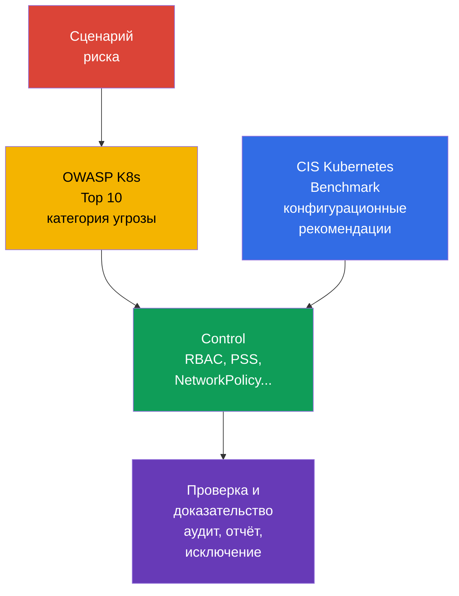

[Eng version](README.md) · [Versión en español](es.md) · [Version française](fr.md) · [Deutsche Version](de.md) · [ქართული ვერსია](ge.md) · [繁體中文版](tw.md) · [日本語版](jp.md)

# Глава 05. Средства контроля, фреймворки и техники изоляции

> **Что дальше.** В [главе 04](../04/ru.md) защита рассматривалась на уровне облака и инфраструктуры. Теперь перенесём принципы defense in depth внутрь кластера: разберём ориентиры для проверки безопасности, средства автоматизации и слои изоляции. Это часть домена **Overview of Cloud Native Security** с весом 14%.

## 05.1 Controls и frameworks: CIS Kubernetes Benchmark и OWASP Kubernetes Top 10

**Security control** - конкретная мера, которая снижает вероятность атаки или её последствия. Например, запрет anonymous access к API, ограниченный `Role`, `NetworkPolicy` с default-deny или профиль Pod Security Standards. **Framework** - структура, по которой оценивают риски и полноту этих мер. Framework не защищает кластер сам по себе: он помогает не пропустить важные controls.

[CIS Kubernetes Benchmark](https://www.cisecurity.org/benchmark/kubernetes) - набор рекомендаций по безопасной конфигурации Kubernetes. Он группирует проверки по компонентам control plane, worker nodes, политикам и другим объектам. Типичная рекомендация CIS отвечает на вопрос: «какая настройка уменьшает известную поверхность атаки?». Например, запретить анонимный доступ, защитить файлы с учетными данными или включить подходящий механизм аудита.

Важно не воспринимать результат CIS как бинарный сертификат «кластер безопасен». Некоторые рекомендации зависят от способа установки, managed Kubernetes и принятой модели риска. Их оценивают в контексте: документируют исключение, владельца риска и компенсирующий control, а не отключают проверку без объяснения.

[OWASP](https://owasp.org/) (Open Worldwide Application Security Project, открытый проект по безопасности веб-приложений) [Kubernetes Top 10](https://owasp.org/www-project-kubernetes-top-ten/) - каталог распространённых классов рисков Kubernetes, а не набор точных параметров конфигурации. Он помогает обсуждать угрозы понятными категориями: небезопасная конфигурация, чрезмерные привилегии, слабая сегментация сети, небезопасные образы и недостаточная наблюдаемость. Его удобно применять на проектировании и ревью: для каждой категории спросить, где она возможна в данном кластере и какой control её уменьшает.

| Ориентир | Главный вопрос | Результат применения | Чего не заменяет |
|---|---|---|---|
| CIS Kubernetes Benchmark | Безопасно ли сконфигурированы компоненты и узлы? | Список технических рекомендаций и отклонений | Модель угроз и эксплуатационные процессы |
| OWASP Kubernetes Top 10 | Какие классы рисков нельзя упустить? | Общий язык для анализа угроз и приоритизации | Детальные настройки и проверку конфигурации |
| Внутренний security baseline | Что организация считает минимально допустимым? | Обязательные controls, исключения, владельцы | Внешние требования отрасли или регулятора |

CIS и OWASP дополняют друг друга: CIS обычно подсказывает, *что проверить в настройках*, а OWASP помогает понять, *почему этот класс защит нужен*. Отраслевые требования, доказательства соответствия и управление исключениями рассматриваются подробнее в [главе 19](../19/ru.md).



## 05.2 Автоматизация проверок: `kube-bench`, policy engines и scanners

Ручная проверка полезна для понимания системы, но плохо масштабируется и легко устаревает. Автоматизация делает baseline повторяемым: её запускают при создании кластера, в CI/CD и регулярно в работающей среде. При этом инструмент выдаёт сигнал, а решение о риске и исправлении остаётся за командой.

`kube-bench` сопоставляет параметры и состояние Kubernetes-компонентов с проверками CIS Benchmark. Его результат обычно содержит pass, fail и manual checks. Он особенно полезен для self-managed кластера, где команда управляет control plane и узлами. В managed Kubernetes часть проверок недоступна пользователю или относится к ответственности провайдера, поэтому отчёт нужно интерпретировать с учётом модели shared responsibility.

**Policy engine** проверяет декларативные объекты Kubernetes по правилам организации. OPA/Gatekeeper, Kyverno и встроенные механизмы admission могут, например, отклонить `Pod` с `privileged: true`, запретить неразрешённый registry или потребовать метки. Они работают до создания или изменения объекта через admission path. Policy engine не заменяет защиту хоста: он не видит всех действий процесса на рабочем узле и не исправляет уже скомпрометированный узел.

**Scanners** ищут известные уязвимости, небезопасные настройки и секреты. Сканер образов соотносит пакеты с базой CVE; scanner манифестов выявляет рискованные поля; scanner репозитория может обнаружить случайно сохранённый токен. Примеры классов инструментов: Trivy или Grype для образов, `kube-linter` и `kubesec` для манифестов. Список CVE не равен автоматически эксплуатируемой уязвимости: важны достижимость, наличие исправления, критичность рабочей нагрузки и компенсирующие меры.

| Средство | Что обычно проверяет | Когда срабатывает | Типичное ограничение |
|---|---|---|---|
| `kube-bench` | Конфигурацию компонентов и узлов по CIS | Периодически или после изменения кластера | Не оценивает бизнес-логику приложения |
| Policy engine | Поля API-объектов по правилам | При admission, иногда в audit-режиме | Не защищает от прямой компрометации узла |
| Image scanner | Пакеты и CVE в образе | До публикации и регулярно после неё | Не знает, используется ли уязвимый путь кода |
| Manifest/secret scanner | Небезопасные поля и секреты в репозитории | В pre-commit или CI | Не видит состояние кластера целиком |

Надёжный процесс сочетает эти уровни: CI не допускает базовые ошибки, admission не допускает неподходящий объект в кластер, а периодическое сканирование находит новые CVE в уже опубликованных образах. Результаты направляют владельцу, классифицируют по риску и не игнорируют бесконечно: для обоснованного исключения должны быть срок пересмотра и компенсирующий control.

## 05.3 Техники изоляции: от `Namespace` до sandbox runtime

Изоляция уменьшает возможность одного пользователя, команды или скомпрометированной рабочей нагрузки влиять на другую. В Kubernetes она многослойна. Каждый слой закрывает свой тип взаимодействия, поэтому один `Namespace` или один policy engine не создают полноценную границу безопасности.

### Логическая граница: `Namespace` и RBAC

`Namespace` разделяет имена большинства объектов и даёт удобную область для квот, меток, RBAC и политик. Он подходит, чтобы организовать команды и окружения, но сам по себе не запрещает доступ. Пользователь с подходящим `ClusterRole` может обращаться к объектам за пределами своего `Namespace`, а сетевой трафик между `Pod` по умолчанию обычно разрешён.

RBAC отвечает на другой вопрос: **кто может выполнить какое действие над каким API-ресурсом**. Принцип least privilege означает, что `Role` или `ClusterRole` даёт только необходимые verbs и scope. Связка `Namespace` + `RoleBinding` часто достаточна для обычной внутренней команды, но не защищает данные без сетевой и workload-изоляции.

### Сетевая и workload-граница: `NetworkPolicy` и PSS

`NetworkPolicy` определяет допустимый ingress и egress для выбранных `Pod`. Практический базовый подход - default-deny, затем явное открытие нужных направлений. Политика действует только если CNI её реализует. Она ограничивает сетевое взаимодействие, но не запрещает API-доступ и не ограничивает привилегии контейнерного процесса.

Pod Security Standards (PSS) задают три профиля: `privileged`, `baseline` и `restricted`. Pod Security Admission применяет профиль к `Namespace` в режимах `enforce`, `audit` или `warn`. В частности, `restricted` стремится снизить риск привилегированного выполнения, опасных capabilities и доступа к пространствам имён хоста. PSS создаёт предсказуемый минимум для `Pod`, но не решает все индивидуальные правила организации.

```yaml
apiVersion: v1
kind: Namespace
metadata:
  name: team-a
  labels:
    pod-security.kubernetes.io/enforce: restricted
    pod-security.kubernetes.io/enforce-version: v1.36
```

Этот фрагмент показывает назначение меток, а не заменяет проверку совместимости конкретных рабочих нагрузок. Подробно PSS и Pod Security Admission разобраны в [главе 11](../11/ru.md), а NetworkPolicy и сегментация - в [главе 13](../13/ru.md).

### Граница исполнения: gVisor и Kata Containers

Обычный контейнер изолирует процессы через namespaces и cgroups, но разделяет kernel хоста. Если атакующий получит выполнение кода в контейнере, уязвимость kernel или ошибочная настройка могут расширить последствия.

**gVisor** добавляет слой sandbox: системные вызовы приложения обрабатываются пользовательским ядром `runsc`, а не напрямую обычным kernel-интерфейсом хоста. Это снижает поверхность ядра для недоверенной рабочей нагрузки ценой ограничений совместимости и производительности.

**Kata Containers** запускает контейнерную рабочую нагрузку внутри лёгкой виртуальной машины. Граница VM обычно сильнее, поскольку применяется аппаратная виртуализация и отдельное kernel-окружение. Цена - больший расход ресурсов, более долгий запуск и усложнение эксплуатации.

Sandbox runtime полезен не для каждого `Pod`. Он особенно уместен для кода клиентов, CI jobs, публичных build-систем и других рабочих нагрузок с повышенной недоверенностью. Он не отменяет RBAC, PSS, NetworkPolicy и обновление образов: это дополнительный слой, а не замена остальных controls.

### Soft и hard multi-tenancy

**Soft multi-tenancy** предназначена для команд одной организации с сопоставимым уровнем доверия. Обычно они разделяют control plane и рабочие узлы, а границы строятся из `Namespace`, RBAC, ResourceQuota, PSS и NetworkPolicy. Риск остаётся общим: ошибка администратора, уязвимость control plane или компрометация рабочего узла может затронуть несколько арендаторов.

**Hard multi-tenancy** нужна, когда арендаторы недоверенны друг другу, требования к данным строже или требуется более сильное разграничение ответственности. К перечисленным controls добавляют выделенные узлы, sandbox runtime, отдельные облачные аккаунты или VPC, а нередко - отдельные кластеры. Самая сильная практическая граница часто находится за пределами одного Kubernetes-кластера.

| Слой | Что изолирует | Пример control | Чего недостаточно ожидать |
|---|---|---|---|
| Организационный | Имена объектов и владение | `Namespace`, quotas | Самостоятельной защиты API и сети |
| API | Операции пользователя или ServiceAccount | RBAC | Ограничения межподового трафика |
| Сеть | Разрешённые потоки трафика | `NetworkPolicy` | Защиты от privileged-процесса |
| Рабочая нагрузка | Опасные параметры `Pod` | PSS, admission policy | Изоляции kernel как у VM |
| Runtime/инфраструктура | Исполнение недоверенного кода | gVisor, Kata, выделенный узел | Отмены всех остальных слоёв |

## 05.4 Linux process и resource isolation: разные границы, разные вопросы

Контейнер - прежде всего Linux-процесс, которому runtime назначил несколько независимых ограничителей. Они создают defense in depth, но один механизм нельзя выдавать за другой.

| Механизм | Вопрос, на который отвечает | Что **не** делает |
|---|---|---|
| namespaces | Что процесс видит: PID, сеть, mounts и другие пространства имён | Не являются policy доступа и не ограничивают CPU/RAM. |
| cgroups | Сколько CPU, памяти и других ресурсов процесс может использовать | Не создают sandbox и не фильтруют syscalls. |
| Linux capabilities | Какие отдельные root-like действия разрешены процессу | Capability - не полный root и не замена MAC policy. |
| seccomp | Какие system calls разрешены процессу | Не регулирует Pod-to-Pod traffic. |
| AppArmor / SELinux | Какие действия и ресурсы разрешает mandatory access control (MAC) policy | Не являются фильтром system calls: это роль seccomp. |
| gVisor / Kata Containers | OCI-совместимые sandboxed runtimes: gVisor `runsc` реализует OCI Runtime Specification и изолирует workload через userspace application kernel; Kata Containers сохраняет OCI/CRI compatibility, но запускает workload внутри lightweight VM. | Усиливают execution boundary, но не заменяют RBAC, PSS/PSA или NetworkPolicy. |

`AppArmor` и `SELinux` - Linux Security Modules с mandatory access control: политика способна запретить действие даже тогда, когда обычные Unix permissions позволили бы его. AppArmor обычно применяет profile к программе, SELinux - labels и policy к субъектам и объектам. На KCSA нужно связывать их с ограничением действий процесса, а не писать собственные profile/policy: это дальнейший CKS-level навык.

### Единая модель ресурсов

Ресурсная изоляция защищает доступность общего кластера, но не является security sandbox. `requests` участвуют в решении scheduler и резервировании; `limits.cpu` ограничивают CPU и могут привести к throttling; `limits.memory` ограничивают память и при pressure могут завершить процесс как OOM. `LimitRange` задаёт default/min/max для отдельных контейнеров или `Pod` внутри namespace, а `ResourceQuota` ограничивает суммарное потребление namespace. HPA масштабирует workload и не создаёт security boundary; `NetworkPolicy` регулирует сетевой путь, а не CPU/RAM.

| Сценарий | Лучший control | Evidence и distractor |
|---|---|---|
| Tenant может создать неограниченно много `Pod` или суммарно занять ресурсы | `ResourceQuota` | Проверить quota usage; это не `LimitRange`. |
| Один `Pod` запрашивает 64 GiB RAM без согласованного baseline | `LimitRange` и policy для requests/limits | Проверить admission rejection/default; это не HPA. |
| Скомпрометированный `Pod` не должен обращаться к database | `NetworkPolicy` | Проверить policy и попытку соединения; quota не фильтрует трафик. |

## 05.5 Как выбрать уровень изоляции под задачу

Выбор не начинается с инструмента. Сначала формулируют границу доверия: кто размещает код, какие данные он видит, какой ущерб допустим и кто администрирует кластер. Затем выбирают минимально достаточную комбинацию controls и проверяют, что она реально применяется.

| Ситуация | Разумная отправная точка | Когда усиливать |
|---|---|---|
| Несколько внутренних команд, одинаковый уровень доверия | `Namespace`, least-privilege RBAC, PSS, NetworkPolicy | При доступе к разным классам данных или повышенных привилегиях |
| Тестовые jobs или код из внешнего источника | Базовые controls плюс sandbox runtime | Если код может быть вредоносным или обрабатывает секреты |
| Клиенты размещают собственные рабочие нагрузки | Hard multi-tenancy: сильная сеть, выделение вычислений, sandbox или отдельный кластер | Если регулятор или модель угроз требует независимой административной границы |
| Сервис с особо чувствительными данными | Ограниченный доступ к API, сегментация сети, отдельные секреты и наблюдаемость | Если общий control plane или узлы остаются неприемлемым риском |

На практике полезен вопрос: «что произойдёт, если этот `Pod`, его ServiceAccount или рабочий узел будут скомпрометированы?» Ответ показывает недостающий слой. Например, RBAC ограничит API-действия ServiceAccount, но не остановит соединение с другой базой данных; NetworkPolicy остановит это соединение, но не помешает контейнеру получить опасную capability; sandbox уменьшит последствия exploit, но не исправит лишнее право в RBAC.

Изоляция имеет и эксплуатационную стоимость. Слишком жёсткая политика, введённая без режима `audit` или подготовки команд, блокирует легитимные релизы. Слишком мягкая политика превращает общий кластер в единую зону поражения. Поэтому controls вводят поэтапно, измеряют исключения и периодически пересматривают вместе с моделью угроз.

## 05.6 Как это применяют на практике

Платформенная команда обычно формирует security baseline из нескольких источников: рекомендации CIS, категории рисков OWASP, требования организации и модель угроз конкретных сервисов. Baseline превращается в проверяемые правила: какие профили PSS обязательны, какие registry разрешены, нужны ли default-deny `NetworkPolicy`, кто может создавать `RoleBinding` и для каких workload требуется sandbox runtime.

До допуска новой рабочей нагрузки команда проводит короткое security review: определяет владельца, доверие к коду и образу, нужные API-права, сетевые зависимости, чувствительность данных и допустимую границу совместного использования. Затем pipeline запускает scanners, admission проверяет манифесты, а периодические отчёты `kube-bench` и сканеров создают задачи на устранение отклонений.

При обнаружении нарушения не всегда правильно немедленно применять самый строгий режим. Например, выбранный профиль Pod Security Standards сначала можно применять через Pod Security Admission в режимах `audit` и `warn`: оценить реальные нарушения, показать предупреждения пользователям и исправить шаблоны деплоя. После согласованного перехода для нужного профиля настраивают режим `enforce`. Для стороннего policy engine используют его собственный audit, preview или аналогичный неблокирующий режим, если такой режим поддерживается. Так технический control становится устойчивым процессом, а не разовой проверкой.

## 05.7 Exam vocabulary / Мини-глоссарий

| Термин | Краткое значение |
|---|---|
| CIS Kubernetes Benchmark | Набор рекомендаций по безопасной конфигурации Kubernetes. |
| control | Техническая или процессная мера снижения риска. |
| gVisor | Sandbox runtime, перехватывающий системные вызовы рабочей нагрузки. |
| hard multi-tenancy | Изоляция арендаторов с сильными, часто инфраструктурными границами. |
| `kube-bench` | Инструмент проверки Kubernetes на соответствие рекомендациям CIS. |
| `NetworkPolicy` | API-ресурс для ограничения ingress и egress трафика `Pod`. |
| OWASP Kubernetes Top 10 | Каталог важных классов рисков Kubernetes. |
| Pod Security Standards | Профили безопасности `privileged`, `baseline` и `restricted`. |
| policy engine | Механизм, применяющий правила к API-объектам, часто в admission path. |
| soft multi-tenancy | Разделение доверенных команд в общем кластере с логическими controls. |

## 05.8 Exam Essentials / Итоги главы

- CIS Kubernetes Benchmark даёт проверяемые рекомендации по безопасной конфигурации, а OWASP Kubernetes Top 10 помогает не упустить классы рисков.
- `kube-bench`, policy engines и scanners автоматизируют разные этапы контроля и не заменяют друг друга.
- `Namespace` организует область объектов, но не является самостоятельной границей безопасности. Для изоляции нужны RBAC, NetworkPolicy, PSS и, при необходимости, sandbox runtime.
- gVisor и Kata Containers уменьшают риск выполнения недоверенного кода, но имеют цену в совместимости, ресурсах и эксплуатации.
- Soft multi-tenancy подходит доверенным внутренним командам; при недоверенных арендаторах нужна hard multi-tenancy, иногда с отдельным кластером.
- Уровень изоляции выбирают по границе доверия и последствиям компрометации, а не по популярности инструмента.

## 05.9 Не путать и как это встречается на экзамене

Вопрос KCSA обычно описывает цель и просит выбрать наиболее подходящий control. Полезно отделять близкие понятия:

- CIS Benchmark - рекомендации по конфигурации, а не scanner уязвимостей образа.
- OWASP Kubernetes Top 10 - каталог рисков, а не admission controller.
- `Namespace` - область имён, а не автоматическая сетевая или RBAC-изоляция.
- RBAC ограничивает обращения к Kubernetes API, а `NetworkPolicy` - сетевые потоки.
- PSS ограничивают параметры `Pod`, а gVisor и Kata усиливают границу исполнения.
- Soft multi-tenancy предполагает некоторый общий риск; hard multi-tenancy применяется при более сильной границе доверия.

В формулировках «лучший первый шаг» ищите control, который закрывает названный слой. При вопросе о доступе ServiceAccount к `Secret` это RBAC; при вопросе о трафике между `Pod` - `NetworkPolicy`; при вопросе о недоверенном коде - sandbox runtime как дополнительный слой.

## 05.10 Вопросы для самопроверки

### 1. Как точнее всего описать назначение CIS Kubernetes Benchmark?

   - a. Это runtime для изоляции контейнеров через виртуальные машины.
   - b. Это механизм аутентификации Kubernetes API.
   - c. Это набор рекомендаций по безопасной конфигурации Kubernetes.
   - d. Это список CVE в контейнерных образах.

<details>
<summary>Ответ и разбор</summary>

**Верный ответ: c.** CIS Kubernetes Benchmark структурирует рекомендации для оценки безопасной конфигурации компонентов и узлов. Runtime-изоляция относится к Kata Containers, CVE ищет scanner образов, а аутентификация выполняется в API Server.

</details>

### 2. Какой control в первую очередь ограничивает сетевой трафик между `Pod`?

   - a. `RoleBinding`
   - b. `NetworkPolicy`
   - c. Pod Security Admission
   - d. `Namespace`

<details>
<summary>Ответ и разбор</summary>

**Верный ответ: b.** `NetworkPolicy` задаёт разрешённые ingress и egress потоки при поддержке со стороны CNI. RBAC ограничивает обращения к API, PSS параметры `Pod`, а `Namespace` сам по себе не создаёт сетевую границу.

</details>

### 3. Команды одной организации используют общий кластер и доверяют друг другу, но должны видеть только свои объекты и сетевые сервисы. Какой подход наиболее уместен как базовый?

   - a. Только Kata Containers для всех `Pod`.
   - b. Только `Namespace`, без иных controls.
   - c. Soft multi-tenancy: `Namespace`, least-privilege RBAC, PSS и `NetworkPolicy`.
   - d. Только отдельный кластер для каждой команды.

<details>
<summary>Ответ и разбор</summary>

**Верный ответ: c.** Для доверенных внутренних команд подходит сочетание логических и сетевых controls. Один `Namespace` не ограничивает API-доступ и трафик; отдельные кластеры и Kata могут быть нужны при более строгой модели угроз, но не являются обязательным первым выбором.

</details>

### 4. В какой ситуации gVisor или Kata Containers дают наибольшую дополнительную пользу?

   - a. Когда запускается код с повышенной недоверенностью и требуется усилить границу исполнения.
   - b. Когда нужно предоставить ServiceAccount доступ на чтение `ConfigMap`.
   - c. Когда необходимо найти CVE в опубликованном образе.
   - d. Когда нужно переименовать объекты в разных `Namespace`.

<details>
<summary>Ответ и разбор</summary>

**Верный ответ: a.** Sandbox runtime уменьшает поверхность взаимодействия недоверенной рабочей нагрузки с kernel хоста. Вариант b решает RBAC (доступ ServiceAccount к `ConfigMap`), вариант c - image scanner (поиск CVE в образе), а вариант d - `Namespace` (переименование объектов между пространствами).

</details>

### 5. Какое утверждение о `kube-bench` верно?

   - a. Он автоматически исправляет все небезопасные параметры control plane.
   - b. Он блокирует неподходящий `Pod` на admission этапе.
   - c. Он заменяет модель угроз и security review.
   - d. Он сопоставляет конфигурацию с проверками CIS и требует интерпретации результатов.

<details>
<summary>Ответ и разбор</summary>

**Верный ответ: d.** `kube-bench` помогает обнаружить отклонения от CIS, но результаты зависят от среды и ответственности провайдера. Автоматическое блокирование объектов выполняет policy engine, а модель угроз остаётся отдельной деятельностью.

</details>

> **Куда дальше.** Для настройки и интерпретации CIS-проверок перейдите к главе 07 CKS: CIS Benchmarks и kube-bench. Для sandbox runtimes и более глубокой изоляции - к главе 22 CKS: RuntimeClass и sandbox. Внутри KCSA продолжите с [главой 11 о PSS и Pod Security Admission](../11/ru.md) и [главой 13 о NetworkPolicy и сегментации](../13/ru.md).

[Оглавление](../README_RU.md) · [Глава 04](../04/ru.md) · [Глава 06](../06/ru.md)
