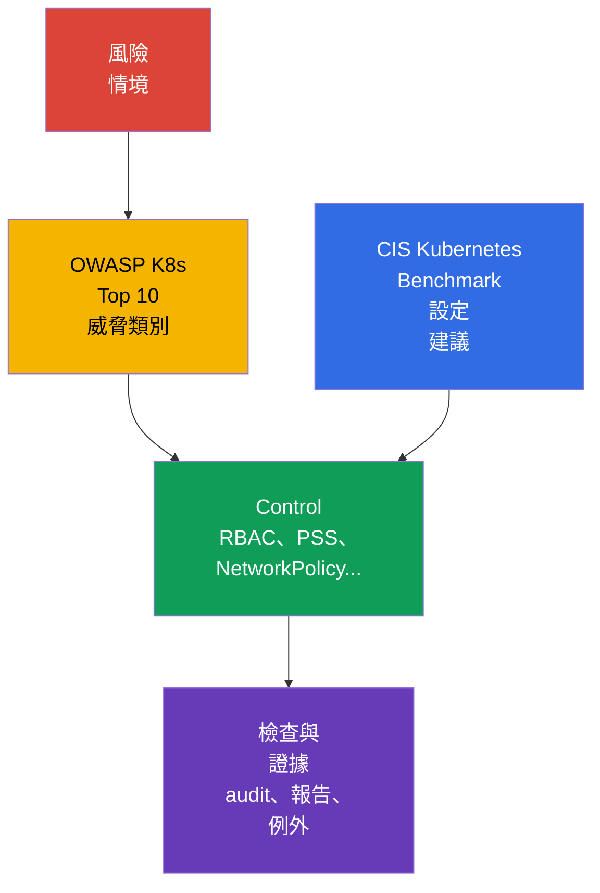

[Русская версия](ru.md) · [Eng version](README.md) · [Versión en español](es.md) · [Version française](fr.md) · [Deutsche Version](de.md) · [ქართული ვერსია](ge.md) · [日本語版](jp.md)

# 第 05 章。控制措施、框架與隔離技術

> **接下來。** 在[第 04 章](../04/tw.md)中，我們從雲端與基礎架構層面探討了防護。現在將 defense in depth 原則延伸至叢集內部：介紹安全檢查的參考依據、自動化工具與隔離層。這是權重為 14% 的 **Overview of Cloud Native Security** 領域之一部分。

## 05.1 Controls 與 frameworks：CIS Kubernetes Benchmark 與 OWASP Kubernetes Top 10

**Security control** 是降低攻擊機率或其後果的具體措施。例如，禁止對 API 的 anonymous access、受限的 `Role`、採用 default-deny 的 `NetworkPolicy`，或 Pod Security Standards profile。**Framework** 是用於評估風險與這些措施完整性的架構。Framework 本身不會保護叢集：它有助於避免遺漏重要的 controls。

[CIS Kubernetes Benchmark](https://www.cisecurity.org/benchmark/kubernetes) 是一組 Kubernetes 安全設定建議。它依 control plane 元件、worker nodes、policies 與其他物件對檢查項目分組。一項典型的 CIS 建議回答的問題是：「哪個設定可縮小已知的攻擊面？」例如，禁止匿名存取、保護含有認證資料的檔案，或啟用合適的 audit 機制。

重要的是，不要將 CIS 結果當作「叢集安全」的二元證書。有些建議取決於安裝方式、managed Kubernetes 與既定的風險模型。應在脈絡中評估它們：記錄例外情況、風險擁有者及補償性 control，而不是毫無解釋地停用檢查。

[OWASP](https://owasp.org/)（Open Worldwide Application Security Project，開放式 Web 應用程式安全專案）[Kubernetes Top 10](https://owasp.org/www-project-kubernetes-top-ten/) 是常見 Kubernetes 風險類別的目錄，而不是一組精確的設定參數。它有助於以清楚的分類討論威脅：不安全的設定、過多的權限、薄弱的網路分段、不安全的映像檔與不足的可觀測性。它適合用於設計與 review：針對每個類別，詢問此叢集中在哪裡可能發生，以及哪個 control 可以降低它。

| 參考依據 | 核心問題 | 套用結果 | 無法取代的項目 |
|---|---|---|---|
| CIS Kubernetes Benchmark | 元件與節點是否經過安全設定？ | 技術建議與偏差清單 | 威脅模型與營運流程 |
| OWASP Kubernetes Top 10 | 哪些風險類別不可遺漏？ | 用於威脅分析與優先順序排序的共同語言 | 詳細設定與設定檢查 |
| 內部 security baseline | 組織認為最低可接受的標準是什麼？ | 強制 controls、例外與擁有者 | 外部產業或監管要求 |

CIS 與 OWASP 相輔相成：CIS 通常提示*設定中要檢查什麼*，OWASP 則有助於理解*為何需要這類防護*。產業要求、合規證據與例外管理會在[第 19 章](../19/tw.md)中更詳細說明。



## 05.2 檢查自動化：`kube-bench`、policy engines 與 scanners

手動檢查有助於理解系統，但難以擴展且容易過時。自動化讓 baseline 可重複執行：在建立叢集時、CI/CD 中，以及運作中的環境內定期執行。不過，工具提供的是訊號，風險與修正決策仍由團隊承擔。

`kube-bench` 將 Kubernetes 元件的參數與狀態對照 CIS Benchmark 檢查項目。其結果通常包含 pass、fail 與 manual checks。它特別適用於團隊管理 control plane 與節點的 self-managed 叢集。在 managed Kubernetes 中，有些檢查使用者無法存取或屬於 provider 的責任，因此必須依據 shared responsibility 模型解讀報告。

**Policy engine** 會依組織規則檢查 Kubernetes 宣告式物件。例如，OPA/Gatekeeper、Kyverno 與內建 admission 機制可拒絕帶有 `privileged: true` 的 `Pod`、禁止未核准的 registry，或要求 labels。它們透過 admission path 在物件建立或變更之前運作。Policy engine 無法取代主機防護：它看不到 worker node 上程序的所有行為，也無法修正已遭入侵的節點。

**Scanners** 尋找已知弱點、不安全設定與 secrets。映像檔 scanner 將 packages 對照 CVE 資料庫；manifest scanner 會找出有風險的欄位；repository scanner 可以發現意外提交的 token。工具類別範例包括用於映像檔的 Trivy 或 Grype，以及用於 manifests 的 `kube-linter` 與 `kubesec`。CVE 清單並不自動等同於可被利用的弱點：可達性、是否有修正、workload 的關鍵性與補償性措施都很重要。

| 工具 | 通常檢查的內容 | 觸發時機 | 典型限制 |
|---|---|---|---|
| `kube-bench` | 依 CIS 檢查元件與節點設定 | 定期或叢集變更後 | 不評估應用程式商業邏輯 |
| Policy engine | 依規則檢查 API 物件欄位 | admission 時，有時在 audit 模式 | 不防護節點遭直接入侵 |
| Image scanner | 映像檔中的 packages 與 CVE | 發布前及發布後定期 | 不知道弱點程式碼路徑是否被使用 |
| Manifest/secret scanner | repository 中的不安全欄位與 secrets | pre-commit 或 CI 中 | 看不到完整叢集狀態 |

可靠的流程會結合這些層次：CI 不允許基本錯誤，admission 不允許不合適的物件進入叢集，而定期掃描會在已發布的映像檔中找出新的 CVE。結果會交給擁有者、依風險分類，且不會無限期忽略：合理的例外必須具有審查期限與補償性 control。

## 05.3 隔離技術：從 `Namespace` 到 sandbox runtime

隔離降低一名使用者、一個團隊或遭入侵的 workload 影響其他對象的可能性。在 Kubernetes 中，它是多層次的。每一層處理其對應類型的互動，因此單一 `Namespace` 或單一 policy engine 都無法建立完整的安全邊界。

### 邏輯邊界：`Namespace` 與 RBAC

`Namespace` 劃分大多數物件的名稱，並為 quotas、labels、RBAC 與 policies 提供便利的範圍。它適合組織團隊與環境，但自身並不禁止存取。具有適當 `ClusterRole` 的使用者可以存取其 `Namespace` 外部的物件，而 `Pod` 之間的網路流量通常預設允許。

RBAC 回答的是另一個問題：**誰可以對哪個 API resource 執行什麼動作**。least privilege 原則表示，`Role` 或 `ClusterRole` 僅提供必要的 verbs 與 scope。`Namespace` + `RoleBinding` 的組合通常足以供一般內部團隊使用，但若沒有網路與 workload 隔離，仍無法保護資料。

### 網路與 workload 邊界：`NetworkPolicy` 與 PSS

`NetworkPolicy` 為選定的 `Pod` 定義允許的 ingress 與 egress。實務上的基本方法是 default-deny，接著明確開放所需方向。此 policy 僅在 CNI 實作時才生效。它限制網路互動，但不禁止 API 存取，也不限制 container process 的權限。

Pod Security Standards (PSS) 定義三個 profiles：`privileged`、`baseline` 與 `restricted`。Pod Security Admission 會以 `enforce`、`audit` 或 `warn` 模式將 profile 套用至 `Namespace`。尤其是 `restricted`，其目標是降低 privileged execution、危險 capabilities 與存取 host namespaces 的風險。PSS 為 `Pod` 建立可預測的最低標準，但無法解決組織的所有個別規則。

```yaml
apiVersion: v1
kind: Namespace
metadata:
  name: team-a
  labels:
    pod-security.kubernetes.io/enforce: restricted
    pod-security.kubernetes.io/enforce-version: v1.36
```

此片段展示 labels 的指定方式，並不能取代對特定 workloads 相容性的檢查。PSS 與 Pod Security Admission 詳見[第 11 章](../11/tw.md)，NetworkPolicy 與網路分段詳見[第 13 章](../13/tw.md)。

### 執行邊界：gVisor 與 Kata Containers

一般 container 透過 namespaces 與 cgroups 隔離程序，但會共用 host kernel。如果攻擊者在 container 中取得 code execution，kernel 弱點或錯誤設定可能擴大影響。

**gVisor** 新增 sandbox 層：應用程式的 system calls 由 userspace kernel `runsc` 處理，而非直接由一般 host kernel 介面處理。這能降低不受信任 workload 對 kernel 的攻擊面，但代價是相容性與效能限制。

**Kata Containers** 在輕量級 virtual machine 內執行 container workload。VM 邊界通常更強，因為它採用 hardware virtualization 與獨立的 kernel 環境。代價是更高的資源消耗、較長的啟動時間與更複雜的營運。

Sandbox runtime 並非每個 `Pod` 都需要。它特別適用於客戶程式碼、CI jobs、公開 build 系統以及其他高度不受信任的 workloads。它不會消除 RBAC、PSS、NetworkPolicy 與映像檔更新的需求：它是額外的一層，不是其他 controls 的替代品。

### Soft 與 hard multi-tenancy

**Soft multi-tenancy** 面向信任程度相近的同一組織團隊。它們通常共用 control plane 與 worker nodes，邊界則由 `Namespace`、RBAC、ResourceQuota、PSS 與 NetworkPolicy 建立。風險仍是共用的：管理員失誤、control plane 弱點或 worker node 遭入侵都可能影響多個 tenants。

**Hard multi-tenancy** 適用於 tenants 彼此不信任、資料要求更嚴格，或需要更強的責任劃分時。除了所列 controls 以外，還會加入 dedicated nodes、sandbox runtime、獨立 cloud accounts 或 VPC，並且常常使用獨立叢集。最強的實務邊界往往位於單一 Kubernetes 叢集之外。

| 層次 | 隔離的對象 | Control 範例 | 不足以期待的效果 |
|---|---|---|---|
| 組織 | 物件名稱與擁有權 | `Namespace`、quotas | 自行保護 API 與網路 |
| API | 使用者或 ServiceAccount 操作 | RBAC | 限制 Pod 間流量 |
| 網路 | 允許的流量 | `NetworkPolicy` | 防護 privileged process |
| Workload | 危險的 `Pod` 參數 | PSS、admission policy | 如 VM 般的 kernel 隔離 |
| Runtime/基礎架構 | 不受信任程式碼的執行 | gVisor、Kata、dedicated node | 取消所有其他層次的需求 |

## 05.4 Linux process 與 resource isolation：不同邊界，不同問題

Container 首先是 Linux process，runtime 為它指派數個獨立的限制機制。它們建立 defense in depth，但不能將一種機制當作另一種機制。

| 機制 | 回答的問題 | **不**做什麼 |
|---|---|---|
| namespaces | 程序看見什麼：PID、網路、mounts 與其他 namespaces | 不是 access policy，也不限制 CPU/RAM。 |
| cgroups | 程序可使用多少 CPU、記憶體與其他資源 | 不建立 sandbox，也不過濾 syscalls。 |
| Linux capabilities | 允許程序進行哪些個別 root-like 動作 | Capability 不是完整 root，也無法取代 MAC policy。 |
| seccomp | 允許程序使用哪些 system calls | 不管理 Pod-to-Pod traffic。 |
| AppArmor / SELinux | mandatory access control (MAC) policy 允許哪些動作與資源 | 不是 system calls filter：這是 seccomp 的角色。 |
| gVisor / Kata Containers | OCI-compatible sandboxed runtimes：gVisor `runsc` 實作 OCI Runtime Specification，並透過 userspace application kernel 隔離 workload；Kata Containers 保持 OCI/CRI compatibility，但在 lightweight VM 內執行 workload。 | 強化 execution boundary，但不取代 RBAC、PSS/PSA 或 NetworkPolicy。 |

`AppArmor` 與 `SELinux` 是提供 mandatory access control 的 Linux Security Modules：即使一般 Unix permissions 允許某項動作，policy 仍可將其拒絕。AppArmor 通常將 profile 套用到程式，SELinux 則將 labels 與 policy 套用到 subjects 和 objects。在 KCSA 中，應將它們與限制程序動作連結，而非自行編寫 profile/policy：這是後續 CKS-level 的技能。

### 統一的資源模型

資源隔離保護共用叢集的可用性，但不是 security sandbox。`requests` 會參與 scheduler 的決策與保留；`limits.cpu` 限制 CPU 並可能導致 throttling；`limits.memory` 限制記憶體，並可在 pressure 情況下以 OOM 終止程序。`LimitRange` 為 namespace 內的個別 containers 或 `Pod` 設定 default/min/max，而 `ResourceQuota` 限制 namespace 的總用量。HPA 會擴展 workload，並不建立 security boundary；`NetworkPolicy` 管理網路路徑，而非 CPU/RAM。

| 情境 | 最適合的 control | Evidence 與 distractor |
|---|---|---|
| Tenant 可建立不限數量的 `Pod` 或占用總體資源 | `ResourceQuota` | 檢查 quota usage；這不是 `LimitRange`。 |
| 一個 `Pod` 未依協定的 baseline 請求 64 GiB RAM | `LimitRange` 以及針對 requests/limits 的 policy | 檢查 admission rejection/default；這不是 HPA。 |
| 遭入侵的 `Pod` 不得存取 database | `NetworkPolicy` | 檢查 policy 與連線嘗試；quota 不過濾流量。 |

## 05.5 如何依任務選擇隔離等級

選擇並非從工具開始。首先要定義信任邊界：誰部署程式碼、它可看見哪些資料、可接受何種損害，以及誰管理叢集。接著選擇最低限度但足夠的 controls 組合，並驗證它們確實生效。

| 情況 | 合理的起始點 | 何時強化 |
|---|---|---|
| 多個內部團隊，信任程度相同 | `Namespace`、least-privilege RBAC、PSS、NetworkPolicy | 存取不同資料類別或具備更高權限時 |
| 測試 jobs 或來自外部來源的程式碼 | 基本 controls 加上 sandbox runtime | 程式碼可能惡意或處理 secrets 時 |
| 客戶部署自己的 workloads | Hard multi-tenancy：強化網路、運算資源劃分、sandbox 或獨立叢集 | 監管機構或威脅模型要求獨立管理邊界時 |
| 具有高度敏感資料的服務 | 受限的 API 存取、網路分段、獨立 secrets 與可觀測性 | 若共用 control plane 或節點仍構成不可接受風險時 |

在實務中，一個有用的問題是：「若此 `Pod`、其 ServiceAccount 或 worker node 遭入侵，會發生什麼事？」答案會顯示缺少的層次。例如，RBAC 會限制 ServiceAccount 的 API 動作，但不會阻止它連線至另一個 database；NetworkPolicy 會阻止該連線，但不會阻止 container 取得危險 capability；sandbox 會降低 exploit 的後果，但無法修正 RBAC 中多餘的權限。

隔離也具有營運成本。未使用 `audit` 模式或未讓團隊準備就導入過嚴 policy，會阻礙合法的 releases。過於寬鬆的 policy 則會將共用叢集變成單一故障範圍。因此，controls 應分階段導入、衡量例外情況，並與威脅模型一同定期審查。

## 05.6 如何在實務中套用

平台團隊通常從多個來源建立 security baseline：CIS 建議、OWASP 風險類別、組織要求，以及特定服務的威脅模型。Baseline 會轉換為可驗證的規則：哪些 PSS profiles 是強制的、允許哪些 registry、是否需要 default-deny `NetworkPolicy`、誰可以建立 `RoleBinding`，以及哪些 workloads 需要 sandbox runtime。

在允許新的 workload 前，團隊進行簡短的 security review：確認擁有者、程式碼與映像檔的信任程度、所需 API 權限、網路相依性、資料敏感度以及可接受的共用邊界。接著 pipeline 執行 scanners，admission 檢查 manifests，定期的 `kube-bench` 與 scanner 報告則建立消除偏差的工作項目。

發現違規時，未必總是應立即套用最嚴格的模式。例如，選定的 Pod Security Standards profile 可先透過 Pod Security Admission 的 `audit` 與 `warn` 模式套用：評估實際違規、向使用者顯示警告，並修正 deployment templates。完成協調的轉換後，為所需 profile 設定 `enforce` 模式。對於第三方 policy engine，若支援此模式，則使用其自身的 audit、preview 或類似非阻擋模式。如此一來，技術 control 便成為穩定的流程，而非一次性的檢查。

## 05.7 Exam vocabulary / 迷你詞彙表

| 術語 | 簡要含義 |
|---|---|
| CIS Kubernetes Benchmark | 一組 Kubernetes 安全設定建議。 |
| control | 降低風險的技術或流程措施。 |
| gVisor | 攔截 workload system calls 的 sandbox runtime。 |
| hard multi-tenancy | 以強大且通常屬於基礎架構的邊界隔離 tenants。 |
| `kube-bench` | 檢查 Kubernetes 是否符合 CIS 建議的工具。 |
| `NetworkPolicy` | 用於限制 `Pod` ingress 與 egress 流量的 API resource。 |
| OWASP Kubernetes Top 10 | 重要 Kubernetes 風險類別的目錄。 |
| Pod Security Standards | `privileged`、`baseline` 與 `restricted` security profiles。 |
| policy engine | 對 API objects 套用規則的機制，常在 admission path 中運作。 |
| soft multi-tenancy | 在共用叢集中以邏輯 controls 分隔受信任團隊。 |

## 05.8 Exam Essentials / 本章重點

- CIS Kubernetes Benchmark 提供可檢查的安全設定建議，而 OWASP Kubernetes Top 10 有助於避免遺漏風險類別。
- `kube-bench`、policy engines 與 scanners 讓不同控制階段自動化，且彼此無法取代。
- `Namespace` 組織物件範圍，但不是獨立的安全邊界。隔離需要 RBAC、NetworkPolicy、PSS，以及在必要時使用 sandbox runtime。
- gVisor 與 Kata Containers 可降低執行不受信任程式碼的風險，但要付出相容性、資源與營運方面的代價。
- Soft multi-tenancy 適用於受信任的內部團隊；若 tenants 不受信任，則需要 hard multi-tenancy，有時需使用獨立叢集。
- 應根據信任邊界與遭入侵的後果選擇隔離等級，而不是依工具的熱門程度。

## 05.9 容易混淆之處及其在考試中的出現方式

KCSA 題目通常描述一個目標，並要求選擇最合適的 control。應區分相近概念：

- CIS Benchmark 是設定建議，不是映像檔弱點 scanner。
- OWASP Kubernetes Top 10 是風險目錄，不是 admission controller。
- `Namespace` 是名稱範圍，不是自動的網路或 RBAC 隔離。
- RBAC 限制對 Kubernetes API 的呼叫，而 `NetworkPolicy` 限制網路流量。
- PSS 限制 `Pod` 參數，而 gVisor 與 Kata 強化執行邊界。
- Soft multi-tenancy 假設存在某些共用風險；hard multi-tenancy 用於更強的信任邊界。

在「最佳的第一步」類型的表述中，尋找能處理所述層次的 control。若問題是 ServiceAccount 對 `Secret` 的存取，答案是 RBAC；若是 `Pod` 之間的流量，答案是 `NetworkPolicy`；若是不受信任的程式碼，答案是 sandbox runtime 作為額外一層。

## 05.10 自我檢查問題

### 1. 如何最準確地描述 CIS Kubernetes Benchmark 的用途？

   - a. 它是透過 virtual machines 隔離 containers 的 runtime。
   - b. 它是 Kubernetes API authentication 機制。
   - c. 它是一組 Kubernetes 安全設定建議。
   - d. 它是 container images 中 CVE 的清單。

<details>
<summary>答案與解析</summary>

**正確答案：c。** CIS Kubernetes Benchmark 建構了用於評估元件與節點安全設定的建議。Runtime 隔離屬於 Kata Containers，CVE 由 image scanner 尋找，而 authentication 在 API Server 中執行。

</details>

### 2. 哪個 control 首先限制 `Pod` 之間的網路流量？

   - a. `RoleBinding`
   - b. `NetworkPolicy`
   - c. Pod Security Admission
   - d. `Namespace`

<details>
<summary>答案與解析</summary>

**正確答案：b。** 在 CNI 支援下，`NetworkPolicy` 會定義允許的 ingress 與 egress 流量。RBAC 限制 API 呼叫，PSS 限制 `Pod` 參數，而 `Namespace` 本身不建立網路邊界。

</details>

### 3. 同一組織的團隊使用共用叢集並彼此信任，但必須只能看見自己的物件與網路服務。哪種方法最適合作為基本方案？

   - a. 僅對所有 `Pod` 使用 Kata Containers。
   - b. 僅使用 `Namespace`，不採用其他 controls。
   - c. Soft multi-tenancy：`Namespace`、least-privilege RBAC、PSS 與 `NetworkPolicy`。
   - d. 僅為每個團隊使用獨立叢集。

<details>
<summary>答案與解析</summary>

**正確答案：c。** 對於受信任的內部團隊，邏輯與網路 controls 的組合很適合。單一 `Namespace` 不限制 API 存取與流量；獨立叢集與 Kata 在更嚴格的威脅模型下可能需要，但不是必要的首選。

</details>

### 4. 哪種情況下 gVisor 或 Kata Containers 能提供最大的額外效益？

   - a. 執行高度不受信任的程式碼，且需要強化執行邊界時。
   - b. 需要授予 ServiceAccount 對 `ConfigMap` 的讀取存取時。
   - c. 需要在已發布的映像檔中找到 CVE 時。
   - d. 需要在不同 `Namespace` 中重新命名物件時。

<details>
<summary>答案與解析</summary>

**正確答案：a。** Sandbox runtime 可降低不受信任 workload 與 host kernel 互動的攻擊面。選項 b 由 RBAC 解決（ServiceAccount 對 `ConfigMap` 的存取），選項 c 由 image scanner 解決（尋找映像檔中的 CVE），而選項 d 由 `Namespace` 解決（在 namespaces 間重新命名物件）。

</details>

### 5. 關於 `kube-bench`，哪個敘述正確？

   - a. 它會自動修正所有不安全的 control plane 參數。
   - b. 它會在 admission 階段阻擋不合適的 `Pod`。
   - c. 它可取代威脅模型與 security review。
   - d. 它會將設定對照 CIS 檢查，並需要解讀結果。

<details>
<summary>答案與解析</summary>

**正確答案：d。** `kube-bench` 有助於發現與 CIS 的偏差，但結果取決於環境與 provider responsibility。自動阻擋物件由 policy engine 執行，威脅模型仍是獨立的工作。

</details>

> **接下來去哪裡。** 如需設定與解讀 CIS 檢查，請前往 CKS 第 07 章：CIS Benchmarks 與 kube-bench。若要了解 sandbox runtimes 與更深層的隔離，請前往 CKS 第 22 章：RuntimeClass 與 sandbox。在 KCSA 內，請繼續閱讀[關於 PSS 與 Pod Security Admission 的第 11 章](../11/tw.md)及[關於 NetworkPolicy 與網路分段的第 13 章](../13/tw.md)。

[目錄](../README_TW.md) · [第 04 章](../04/tw.md) · [第 06 章](../06/tw.md)
