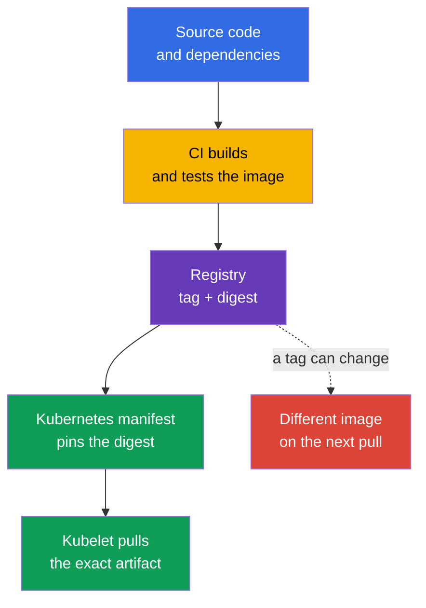
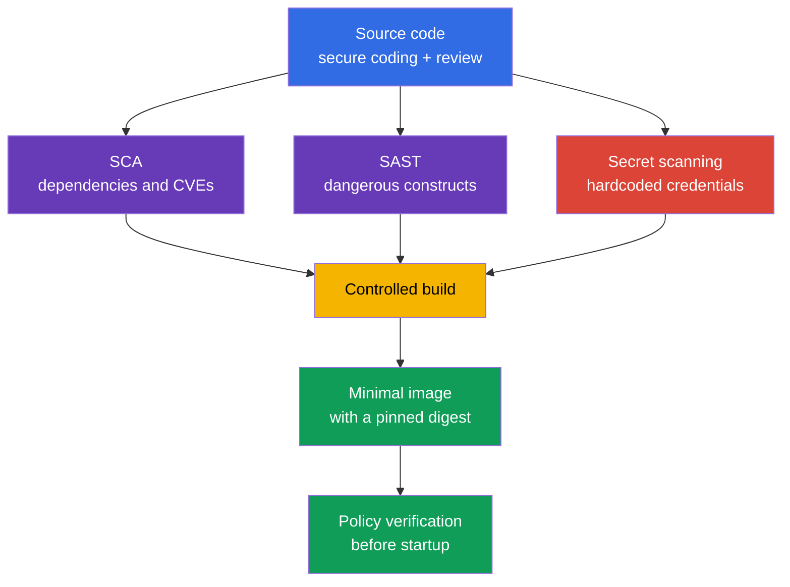

[Русская версия](ru.md) · [Versión en español](es.md) · [Version française](fr.md) · [Deutsche Version](de.md) · [ქართული ვერსია](ge.md) · [繁體中文版](tw.md) · [日本語版](jp.md)

# Chapter 06. Artifact, Image, and Code Security

> **What next.** In [chapter 05](../05/README.md), we covered controls, frameworks, and workload isolation. Now we will trace an application's path to a `Pod`: from source code and dependencies to a container image in a registry. This is part of the **Overview of Cloud Native Security** domain, weighted at 14%. A secure cluster does not compensate for a malicious, vulnerable, or unpredictably changed image.

A container image is a delivery artifact that can be executed. It contains the application, its runtime, libraries, and configuration files. Therefore, image security begins before Kubernetes: with trust in the registry, a reproducible build, the composition of dependencies, and the absence of secrets in source code.

## 06.1 Registries, tags, digests, and trusted images

A **container registry** stores and distributes container images. Kubernetes does not distinguish between public and private registries in terms of the image format, but it does distinguish them in terms of trust and access.

- A **public registry** is available from the internet. It is convenient for published base images, but the author's name or a repository's popularity does not prove that its contents are secure.
- A **private registry** restricts push and pull operations through accounts, roles, or network access. It helps control who publishes and receives internal artifacts, but it does not automatically make an image secure.
- A **proxy or mirror registry** caches approved external images. Such a point makes it possible to log downloads, restrict the list of sources, and reduce build dependence on the external network.

An image path consists of a registry, repository, and a reference to a specific version. For example, in `registry.example.internal/payments/api:v2.4.1`, the `v2.4.1` tag is a human-readable name. The entry `registry.example.internal/payments/api@sha256:...` specifies a digest, which is a cryptographic identifier for the exact contents of the image manifest.

| Reference method | What it pins | Main risk | Typical use |
|---|---|---|---|
| Tag, for example `v2.4.1` | A logical version name | A tag can be moved to another image | Convenient navigation and the build stage |
| Mutable tag, for example `latest` or `stable` | Only a channel name | The same manifest can run different bytes | Do not use as an immutable production release |
| Digest, for example `@sha256:...` | Exact image contents | Does not by itself say who built it or why | Deployment and verifiable delivery |

A tag is convenient but mutable. A repository owner can delete `v2.4.1` and assign that tag to a new image. On the next pull, Kubernetes will receive a different artifact even though the YAML has not changed. A digest solves the identity problem specifically: a particular digest points to particular bytes. It does not prove that those bytes are secure, reviewed, or built by your organization.



`imagePullPolicy: Always` does not make an image more trusted. It only instructs kubelet to check the registry at every startup. If the reference uses a mutable tag, kubelet can receive a new version. Pinning a digest makes the result unambiguous; the pull policy determines when to check its availability.

### Trust in the source

A **trusted image** is not merely an image with no discovered CVEs. It is an artifact for which an organization can answer these questions: where it came from, who is allowed to publish it, how it was built, whether it was reviewed, and whether it is approved for the given environment.

A common trust model includes several independent controls:

1. Allow registries and repositories by allowlist rather than any address on the internet.
2. Restrict pushes to the production repository to separate service accounts with minimal permissions.
3. Scan the image for known vulnerabilities and account for severity, exploitability, and the availability of a fix.
4. Sign artifacts and verify the signature before running them. A signature creates a cryptographic assertion associated with a specific artifact/digest and a signing key or signing identity. During verification, the system separately applies a trust policy: whether the given key/identity/issuer is trusted for this artifact. A signature does not prove the absence of vulnerabilities and does not replace provenance or vulnerability scanning.
5. Pin the digest in the deployment artifact and retain build information, for example an SBOM and provenance.
6. Apply an admission policy that rejects images from unapproved registries or without the required signature.

A public registry has additional threats: typosquatting with a similar name, a compromised publisher account, an unexpected tag change, and unclear provenance of a base image. A private registry still has threats from excessive push permissions, compromised CI credentials, and no verification of exactly what reached the repository.

> **Important.** The entry `image: company/app:latest` does not mean "the most secure version." `latest` is an ordinary tag with no special Kubernetes semantics. It is often mutable, does not communicate a version, and hinders investigation: after an incident, it is difficult to determine which exact image was actually running.

## 06.2 Minimal images: distroless, scratch, and multi-stage builds

Every package in a final image increases the attack surface: it can have CVEs, executable utilities, configuration, and dependent libraries. Image minimization reduces the number of components, but it does not fix an application vulnerability or replace `SecurityContext`, network isolation, or runtime detection.

### Base options

| Final image base | Contents | When useful | Limitation |
|---|---|---|---|
| `scratch` | Empty file system | A statically compiled binary with known requirements | No shell, CA bundle, time zone data, or dynamic loader |
| distroless | The needed language runtime and libraries without a shell/package manager | Application runtime that does not need interactive utilities | Debugging through `kubectl exec -- sh` is usually impossible |
| Full Linux image | A shell, package manager, and a wide set of packages | Justified diagnostics or specific runtime dependencies | More components and capabilities after compromise |

`distroless` means that the image retains the minimum set needed to run the application, but usually has no shell or package manager. This makes post-exploitation after RCE harder for an attacker: they do not get ready-made `sh`, `curl`, `wget`, and a package manager. This is not a guarantee: the application process can still read accessible files, connect to the network, and use its privileges.

`scratch` is an empty base. It is suitable not "for every small image," but for an application that runs without dynamic libraries and missing runtime files. For example, a static Go binary may need a CA bundle for TLS, and some applications need time zone data or other files that are absent from `scratch`; these must be added or mounted explicitly. In Kubernetes, kubelet usually provides the Pod's DNS settings through `/etc/resolv.conf`, so they should not be cited as a file that must automatically be included in the final image. Security must not be achieved by accidentally removing required components.

### Multi-stage build

A builder, compiler, test tools, and source code are required during the build stage, but usually not at runtime. A **multi-stage build** separates these responsibilities: the first stage creates the artifact, and the second contains only the runtime and required files.

```dockerfile
# The build stage contains the compiler and source code.
FROM golang:1.27.1 AS build
WORKDIR /src
COPY . .
RUN CGO_ENABLED=0 go build -o /out/api ./cmd/api

# The final image receives only the finished binary.
FROM scratch
COPY --from=build /out/api /api
USER 65532:65532
ENTRYPOINT ["/api"]
```

The example demonstrates a principle, not a universal recipe. Base image versions, dependencies, and the build method are selected according to organizational policy. An application with dynamic libraries may require a distroless runtime instead of `scratch`. Separately test startup, TLS connections, DNS, write permissions, and operation under a non-privileged user.

| What should not enter the final stage unless necessary | Why it matters |
|---|---|
| Compilers, package managers, test frameworks | New CVEs and tools for post-exploitation |
| Source code and `.git` | Risk of exposing logic, keys, and change history |
| Temporary build files and caches | Increase image size and can contain credentials |
| Shell and administrative utilities | Simplify interactive actions after RCE |

A minimal image requires a different operational discipline. You cannot assume that an engineer can always enter the container and install a utility. Observability is built through logs, metrics, traces, and, when needed, a temporary debug container with controlled permissions. This approach is useful for both operations and security.

## 06.3 Code, dependency, and secret security

An image inherits the risks of source code. Even a perfectly configured private registry will not stop SQL injection, SSRF, insecure deserialization, or a dependency with a known critical vulnerability. Therefore, workload security includes secure coding and control over the dependency lifecycle.

### Secure coding as a control before the container

**Secure coding** is a set of engineering practices that reduce the likelihood of vulnerabilities before building and running. For KCSA, it is important to understand the purpose of these practices:

- validate input and use secure APIs instead of manual string handling;
- verify authentication and authorization in the application rather than treating the network as trusted;
- handle errors without exposing a token, stack trace, or internal configuration to the user;
- restrict application access to the network, file system, and cloud credentials according to the principle of least privilege;
- conduct code reviews and keep the used libraries patched.

Static application security testing, or **SAST**, analyzes source code or compiled code without running it. Such analysis can identify a dangerous API call, injection, a hardcoded secret, or an insecure configuration. It reduces the likelihood of an error, but its results require context: not every warning is exploitable, and not every logic error is visible to a static analyzer.

### Dependencies and SCA

A modern application includes direct and transitive dependencies: language packages, OS packages, a base image, and plugins. **Software Composition Analysis**, or SCA, builds a dependency inventory and matches versions against known vulnerabilities, licenses, and organizational policies.

SCA answers these questions:

- which library and which version are included in the artifact;
- whether a known CVE exists for that version;
- whether a fixed version is available;
- whether the dependency is transitive;
- whether the license complies with organizational rules.

SCA is not the same as container image scanning, although their scopes overlap. SCA primarily considers application composition. An image scanner usually analyzes OS packages and libraries in the built image. A reliable process uses both views and does not treat a report with zero discovered CVEs as proof of complete security.

A lock file pins resolved dependency versions and helps make a build repeatable. Its presence does not remove the need for updates: a dependency can become vulnerable after the lock file was created. Therefore, regular checks in CI and a clear process to assess and remediate findings are useful.

### Secrets must not live in code and images

A hardcoded password, API key, private key, or cloud token often ends up in Git history, a CI log, a Docker layer, or a published image. Removing the line in the next commit is insufficient: the secret may remain in repository history, the CI cache, or an already uploaded image layer.

The proper response to a discovered secret:

1. Immediately revoke or replace the credential. Treat the secret as compromised.
2. Remove it from code, build configuration, and logs.
3. Check history, artifacts, and access points where it could have been retained.
4. Pass secrets to a workload through a mechanism designed for them: Kubernetes `Secret` with restricted RBAC or an external secret manager.
5. Add secret scanning and review rules to prevent repeating the error.

Kubernetes `Secret` does not make it acceptable to store a key in a Dockerfile. If a secret is passed through `ARG`, `ENV`, or copied into an image, it can be accessible in metadata or layers. Secrets are needed by an application at runtime, not as a permanent part of the image.



## 06.4 The place of images and code in the 4C model and Platform Security

In the 4C model from [chapter 03](../03/README.md), an image belongs primarily to the **Container** layer, while source code and dependencies belong to the **Code** layer. Outer layers do not replace inner ones:

- Cloud IAM does not fix a hardcoded secret in a repository.
- RBAC in the cluster does not make a mutable tag immutable.
- `NetworkPolicy` does not remove a CVE from a base image.
- A minimal image does not restrict excessive service account permissions.

Therefore, protection is built in layers. Code is checked before the build, CI produces a known artifact, the registry controls storage and distribution, and Kubernetes verifies what is allowed to run. If one control is compromised, the others reduce the consequences.

Chapter 06 explains incoming artifacts at the Overview of Cloud Native Security level. In [chapter 17](../17/README.md), the topic continues from the Platform Security perspective: supply chain, SBOMs, signatures, image repositories, and admission control. There, an organization decides how to turn trust in a digest and publisher into a rule that Kubernetes applies before creating a `Pod`.

| 4C layer | Security question | Example control |
|---|---|---|
| Code | Does the application contain errors, vulnerable dependencies, or secrets? | Review, SAST, SCA, secret scanning |
| Container | What actually runs, and how many unnecessary components does it contain? | Minimal base, multi-stage build, scanner, digest |
| Cluster | Will the cluster admit an unsuitable artifact? | Admission policy, registry allowlist, RBAC |
| Cloud | Who can read the registry and CI credentials? | IAM, private endpoint, audit logging |

## 06.5 How this is applied in practice

The platform team usually defines a basic delivery process, and product teams follow it in CI/CD:

1. Use approved base images from a controlled registry and update them regularly.
2. Build the image in CI, run tests, SAST, SCA, secret scanning, and image scanning.
3. Publish the result to a private registry with a service account that has minimal permissions.
4. Retain the digest, SBOM, and build information alongside the release.
5. For production deployment, pin the digest rather than `:latest`.
6. Admission control allows only approved registries and, where adopted, requires a signature or other attestations.
7. For a discovered CVE, assess the actual exposure, availability of a fix, and workload criticality, then update the dependency or base image.

At the associate level, it is useful to distinguish a tool from a guarantee. A scanner finds known issues, but not all vulnerabilities. Successful verification confirms that the cryptographic assertion over the verified artifact validates under the expected signing key/identity; trust in the signer is determined by a separate verification policy. It does not prove the absence of a defect. A private registry restricts access but does not replace review. The combination of controls provides defense in depth.

## 06.6 Exam vocabulary / Mini-glossary

| Term | Meaning |
|---|---|
| Artifact | A delivery result, for example a container image, SBOM, or signed manifest. |
| Container registry | A service for storing and distributing container images. |
| Digest | An immutable cryptographic identifier for specific image contents. |
| Distroless | A minimal runtime image without a conventional shell or package manager. |
| Image tag | A human-readable image label that can be changed. |
| Multi-stage build | A build with a separate builder stage and a minimal final stage. |
| SAST | Static code analysis without running the application. |
| SCA | Analysis of software composition and its dependencies. |
| Secret scanning | Searching for credentials and other secrets in code, history, and artifacts. |
| Trusted image | An image with verifiable provenance and a set of trust controls. |

## 06.7 Exam Essentials / Chapter summary

- A registry stores images, but does not itself establish trust in them. Public and private registries require source, access, and publishing controls.
- A tag is convenient for people but can be mutable. A digest pins a specific artifact and is preferable for production deployment.
- `:latest` is an ordinary mutable tag, not an indication of security or recency.
- A multi-stage build and a minimal image reduce the attack surface, but do not replace application security and runtime controls.
- Secure coding, SAST, SCA, and secret scanning protect the Code layer before a container runs.
- A secret cannot be considered safe if it reached Git, a Dockerfile, a CI log, or an image layer. A discovered credential must be revoked and replaced.
- Container and Code protection are connected to Platform Security: a trusted artifact must still be verified and allowed to run.

## 06.8 Do not confuse these concepts and how they appear on the exam

KCSA questions often present several useful measures and ask for the one that is most precise for the given threat.

- For a repeatable run, choose a **digest**, not a tag. A digest provides content identity, but does not replace signing and scanning.
- `latest` does not mean "the latest verified release." It is a mutable tag that reduces predictability and complicates investigation.
- `scratch` and distroless reduce image composition, but are not a sandbox and do not prevent all consequences of RCE.
- SCA concerns dependency composition; SAST analyzes code; secret scanning finds credentials. The tools complement one another.
- A private registry restricts image access, but trust also depends on the publisher, CI, scanning, signing, and policy.

## 06.9 Self-check questions

### 1. Which image reference method best pins a specific set of bytes for a production deployment?

   - a. `registry.example/app:stable`

   - b. `registry.example/app:latest`

   - c. Any tag with `imagePullPolicy: Always`

   - d. `registry.example/app@sha256:...`

<details>
<summary>Answer and explanation</summary>

**Correct answer: d.** A digest identifies the exact contents of an image. `latest` and `stable` are tags and can be reassigned. `imagePullPolicy: Always` checks the registry, but does not make a mutable tag immutable.

</details>

### 2. What best describes `:latest`?

   - a. The immutable digest of the latest build.

   - b. An ordinary tag that can point to different images at different times.

   - c. A special Kubernetes mode that guarantees the newest secure image.

   - d. A policy that prevents startup without a signature.

<details>
<summary>Answer and explanation</summary>

**Correct answer: b.** Kubernetes does not give `latest` special trust properties. It is a tag, usually mutable. It does not communicate which exact bytes were run and does not replace verification.

</details>

### 3. Which statement about a multi-stage build is true?

   - a. It retains the compiler, source code, and build cache in the final image so that the production container can repeat the build.

   - b. It automatically signs the final image and thus replaces separate artifact signature verification.

   - c. It makes SCA and image scanning unnecessary because dependencies are checked automatically between build stages.

   - d. It builds an artifact in a builder stage and copies only the needed runtime files and dependencies into the final stage.

<details>
<summary>Answer and explanation</summary>

**Correct answer: d.** A multi-stage build makes it possible to retain build-only tooling, source code, and intermediate data in the builder stage, while moving only the required runtime artifacts and dependencies to the final image. Signing, SCA, and image scanning remain separate controls.

</details>

### 4. What is SCA primarily used for?

   - a. Analyzing runtime network traffic between a `Pod` and determining connections actually established.
   - b. Creating an inventory of software dependencies and matching their versions against known vulnerabilities and policy.
   - c. Providing an interactive shell in containers where standard debugging tools are absent.
   - d. Encrypting Kubernetes `Secret` data before API objects are stored in `etcd`.

<details>
<summary>Answer and explanation</summary>

**Correct answer: b.** SCA analyzes software composition: direct and transitive dependencies, their versions, known vulnerabilities, and often licenses/policy. Runtime network visibility, debugging, and encryption at rest solve other tasks.

</details>

### 5. An active cloud API key is found in a Git repository. What should be the first action?

   - a. Remove the line in the next commit and continue using the key.

   - b. Encode the key in base64 and store it in the repository.

   - c. Revoke or replace the key, then remove it from code and check history and artifacts.

   - d. Add the key to the `Dockerfile` so that CI does not lose it.

<details>
<summary>Answer and explanation</summary>

**Correct answer: c.** Treat the secret as compromised: it may have reached Git history, caches, logs, or an image. Removing the line does not revoke access that was already granted. Base64 is not protection.

</details>

> **Where next.** For practical image minimization, proceed to CKS chapter 24. CKS chapter 25 covers the supply chain, SBOM, and registry; CKS chapter 26 covers signatures; CKS chapter 27 covers static analysis; CKS chapter 28 covers image scanning. [Chapter 17](../17/README.md) continues KCSA-level supply chain and admission control concepts.

[Table of contents](../README.md) · [Chapter 05](../05/README.md) · [Chapter 07](../07/README.md)